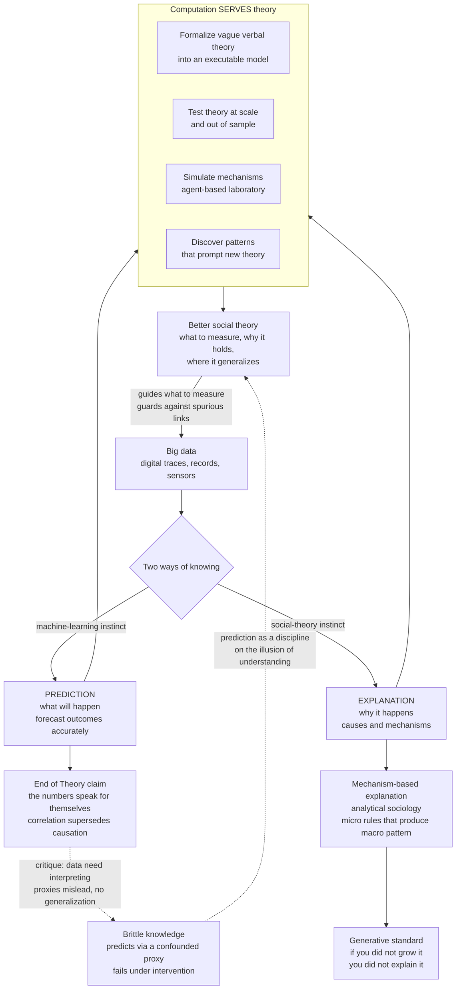

# 🔭 Computation and Social Theory

> [!abstract] TL;DR
> A foundational question of **computational social science (CSS)** is how **computation and big data** relate to social **theory**. Against the provocative **"End of Theory"** claim — that with enough data the hypothesize-model-test cycle is obsolete because *"the numbers speak for themselves"* — CSS insists on distinguishing two different goals that can **diverge**: **PREDICTION** (forecasting outcomes accurately — the machine-learning instinct, *"what will happen?"*) and **EXPLANATION** (understanding causes and mechanisms — the social-science instinct, *"why does it happen?"*). A model can predict brilliantly through a **confounded proxy** while explaining nothing, so **high accuracy never guarantees understanding**. Theory therefore matters *more*, not less: it tells you **what to measure**, guards against **spurious correlations**, enables **generalization**, and supplies **mechanisms**. Crucially, computation **serves** theory rather than replacing it — **formalizing** vague verbal theories into executable models, **testing** them at scale, and offering a distinctively computational, **generative** standard of explanation: *"if you didn't grow it, you didn't explain it"* (Epstein). Tempered by sobering evidence that even massive data predicts life outcomes poorly (the **Fragile Families Challenge**) and by **Watts's** warning against post-hoc common-sense "theory," the disciplined integration of prediction, explanation, data, and theory is the epistemological core that decides whether CSS becomes a **rigorous, cumulative science** or mere atheoretical **data-dredging**.

---

## Intuition

**Analogy — the oracle machine that heals no one.** Imagine a hospital installs a black box that, fed a patient's data, flawlessly predicts who will fall ill next month — 99% accurate, never wrong. A miracle? Only half of one. The machine offers no clue *why* anyone gets sick, no lever to pull, no cause to treat. It cannot tell you whether the sickness is driven by a virus, a toxin, or the hospital's own coffee. It predicts the storm without understanding the weather, so the moment the world shifts — a new treatment, a new population, a new season — the oracle silently breaks, and no one can say why. **Prediction without understanding is a brittle, borrowed kind of knowledge.**

In 2008 an infamous *Wired* headline declared *"The End of Theory"*: with petabytes of data, who needs to understand *why*? Just find the patterns and let the numbers speak. Computational social science lives in exactly the tension this promise papers over — between two ways of knowing. The **machine-learning instinct** asks *what will happen* and prizes accuracy. The **social-theory instinct** asks *why it happens* and prizes mechanism. These are genuinely **different goals**, and they can **come apart**: the storm-predicting oracle is a model that forecasts without explaining. CSS's deepest debate is whether — and how — big data and old theory can be reconciled, and this note (the conceptual anchor of *Computational_Social_Science_Overview*) argues that the answer is not to choose one instinct but to make them **check each other**.

---

## How It Works

### The theory question in CSS

When digital traces — clicks, transactions, GPS pings, social graphs — suddenly made human behavior measurable at planetary scale (*Big_Data_and_the_Social_Sciences*), a natural question followed: does data-rich social science still need **theory**? Two camps formed. One says data makes theory obsolete; the other says data-rich science needs theory *more than ever*, because more data means more ways to fool yourself. This is not a technical quibble — it is a question about the **intellectual identity** of the field: is CSS a branch of applied machine learning aimed at prediction, or a computational upgrade to the centuries-old social-scientific project of *explaining* human affairs? The honest answer, developed below, is that it must be **both**, held in disciplined tension.

### "The End of Theory"?

In *Wired* (2008), Chris Anderson issued the manifesto for pure data-ism: **"With enough data, the numbers speak for themselves."** The scientific method — hypothesize, build a model, test it — was, he argued, becoming obsolete. **"Correlation supersedes causation"**; we no longer need to know *why*, only *that*. Find patterns in petabytes and act on them. This is the **purely inductive, data-first, prediction-focused** vision in its most radical form.

The critique is decisive but incomplete-if-dismissive:

- **Data do not interpret themselves.** A dataset is mute until a question, a construct, and a measurement decision — all theoretical acts — give it meaning. Theory tells you *what to even record*.
- **Correlations mislead.** With enough variables, spurious associations are guaranteed; distinguishing signal from artifact requires prior structure, not more rows.
- **You cannot generalize without theory.** A pattern found in one platform, era, or population may not transfer. Knowing *why* a regularity holds is what licenses extrapolation beyond the sample.

Yet Anderson captured a **real shift**: an era of data-first, prediction-focused science that is genuinely powerful and here to stay. The mistake is not using data-driven pattern-finding — it is believing pattern-finding can stand *alone*. The debate Anderson launched is the debate this whole note is about.

### Prediction vs Explanation — the central distinction

The crux of CSS methodology is that **prediction and explanation are different aims**, formalized in two landmark papers:

- **Leo Breiman's "Two Cultures" (2001).** Statistics split into a **data-modeling culture** (assume a stochastic model, estimate parameters, *explain*) and an **algorithmic-modeling culture** (treat the mechanism as a black box, optimize *predictive* accuracy). Random forests predict; regressions explain — and they answer different questions.
- **Galit Shmueli's "To Explain or to Predict?" (2010).** Explanatory modeling minimizes **bias** to recover the *true* causal structure; predictive modeling minimizes total **error** on new data, and will happily trade a little bias for less variance — even using variables it *knows* are not causal. A model optimized to explain and a model optimized to predict are, in general, **not the same model**.

Why the two **diverge**: a model can predict an outcome superbly through a **confounded proxy** it does not understand. If wealthy neighborhoods correlate with an outcome, "ZIP code" may predict well while explaining nothing and being useless to act on — intervene on the ZIP code and the outcome does not budge. Conversely, a **correct mechanistic** model can predict *poorly* if the mechanism is swamped by noise or by variables the theory rightly excludes. **High accuracy ≠ understanding.** This is the single most important idea in the field, and the Python demo makes it quantitative.

### Inductive vs deductive — and the pragmatic middle

Beneath the prediction/explanation split lies an older methodological axis:

- **Deductive / theory-driven.** Start from theory, derive hypotheses, test them against data (the traditional model of *Scientific_Method_and_Empiricism*). Risk: you only ever confirm or reject what you already thought to ask, and you may miss what the data could have revealed.
- **Inductive / data-driven.** Mine data for patterns and let them generate hypotheses (the big-data instinct). Risk: **overfitting**, spurious patterns, **HARKing** (Hypothesizing After Results are Known — dressing a discovered correlation as if it were a prior prediction), and no guarantee of generalization.

Mature CSS blends them through **abduction** — inference to the best explanation (see *Abductive_Reasoning_and_Inference_to_Best_Explanation*): data-driven **discovery** of a surprising pattern, followed by theory-driven **justification** — proposing a mechanism and testing it on *held-out* data or under intervention. This respects the classic distinction between the **context of discovery** (where hunches may come from anywhere, including a mining algorithm) and the **context of justification** (where a claim must earn its keep). Pure induction dredges; pure deduction blinds; the disciplined loop between them is where CSS does its best work.

### Generative / mechanistic explanation — the CSS signature

CSS contributes a **distinctive standard of explanation** that unites theory and computation. To explain a social phenomenon, **build a model — typically agent-based — that *generates* the phenomenon from micro-mechanisms.** Joshua Epstein's slogan is the whole idea: **"If you didn't grow it, you didn't explain it."** Explanation becomes the demonstration of a **sufficient mechanism**: you have explained a macro pattern (segregation, a fad, a power-law inequality) when a population of interacting agents following plausible local rules *reliably produces* it from the bottom up (*Agent_Based_Models_of_Society*; and in economics, [[Schelling_Segregation_and_Emergent_Patterns]] and [[Emergence_of_Macro_from_Micro]]).

This meshes with **analytical sociology** (Hedström and Ylikoski), which explains macro patterns by specifying the **micro mechanisms** — the cogs and wheels — that bring them about, rather than by citing a bare correlation between macro variables. Computation is the theory-builder's laboratory: an **executable, constructive** criterion for what counts as understanding. (What generative *sufficiency* does and does not establish — a model that grows a pattern is not the only model that could — is exactly the validation problem of *Generative_Social_Science_and_Validation* and [[Calibration_and_Validation_of_Agent_Based_Models]].)

### Computation as a partner to theory — building and testing

The reconciliation is that **computation serves theory** across a full cycle rather than abolishing it:

1. **Formalize.** Turning a vague verbal theory into a precise, executable model forces every hidden assumption into the open and exposes internal inconsistencies. Vague prose can hide contradictions that runnable code cannot.
2. **Test at scale.** Big data lets theories that were once untestable be confronted with millions of cases, and lets predictions serve as a stringent, out-of-sample check.
3. **Simulate.** Agent-based models act as **theoretical laboratories**, deriving the *consequences* of a proposed mechanism — often surprising, emergent ones — that no armchair can compute.
4. **Discover.** Pattern-detection in massive data surfaces regularities that *prompt* new theory, feeding the abductive loop.

The result is a **computational theory-building cycle**: theory more necessary, not less, precisely because there is more data to make sense of.

### Why social theory still matters enormously

Kurt Lewin's dictum — **"there is nothing so practical as a good theory"** — is the summary. Concretely, theory does four things no amount of raw data can:

- **Tells you what to measure.** It supplies **constructs** (trust, status, social capital) rather than merely whatever variable happens to be logged. Convenience is not relevance.
- **Guards against spurious correlations and confounding.** It asks *why the pattern arose* and flags the lurking variable a black box will silently exploit (see [[Causation]], [[Causal_Reasoning]]).
- **Enables generalization.** Understanding *why* a regularity holds is what grants **external validity** — the warrant to expect it elsewhere.
- **Supplies mechanisms and cumulation.** It converts a one-off prediction into understanding, and situates findings in a growing body of knowledge instead of an ever-lengthening list of correlations. Atheoretical data-dredging cannot cumulate.

### The limits of prediction in social systems

A sobering fact keeps everyone honest: **predicting social outcomes is hard, even with the best data and models.** The **Fragile Families Challenge** (Salganik et al., 2020) gave hundreds of research teams an exceptionally rich longitudinal dataset — thousands of variables on thousands of families — and asked them to predict six life outcomes (GPA, eviction, material hardship, and more) with any machine-learning method they liked. The result: even the **best** models beat a trivial benchmark only slightly, and predicted the outcomes **poorly** in absolute terms. Social systems are **complex, reflexive, and stochastic**; individual lives are not forecastable the way orbits are. This counsels humility about *both* prediction *and* explanation, and it punctures the fantasy that "the numbers speak" — often, they mumble.

### Watts and the critique of common-sense social science

Duncan Watts (*Everything Is Obvious: Once You Know the Answer*) turns the discipline's mirror the other way. Much of what passes for social "theory," he argues, is **post-hoc common sense** — obvious *after* the fact and frequently self-contradictory before it (does *"opposites attract"* or do *"birds of a feather flock together"*? Common sense endorses both, which means it predicts nothing). His prescription: CSS should behave more like a **hard science** — making and testing genuine **predictions**, and treating predictive success as a **discipline on explanation**. A "theory" that cannot predict anything is suspect; prediction is the antidote to the **illusion of understanding** that hindsight manufactures. Watts is not siding with the End-of-Theory camp — he is demanding a *more rigorous* theory, one that pays its way in out-of-sample forecasts. This is why the modern synthesis (Hofman, Watts, et al., *Nature* 2021) calls explicitly for **integrating** prediction and explanation rather than pledging allegiance to either.

### Flow / Architecture



---

## Key Concepts

### Secondary
- **Predicting is not understanding.** A machine that perfectly guesses *who* will get sick, but never *why*, cannot cure anyone. Guessing the future and understanding the world are two different skills.
- **"The numbers speak for themselves" is a half-truth.** Data cannot talk on its own — someone has to decide what to count and what it means. A pile of facts is not yet knowledge.
- **A lucky pattern can betray you.** If a website notices that people who buy umbrellas also buy raincoats, it can sell more — but it has not learned that *rain* is the real cause. Change the weather and the pattern breaks.
- **Explaining by building.** One way to prove you understand how a crowd forms is to write simple rules for imaginary people and watch the crowd appear on your screen. If you can *grow* it, you probably understand it.

### Undergraduate
- **Prediction vs explanation.** Prediction forecasts outcomes accurately (the ML goal); explanation identifies causes and mechanisms (the social-science goal). They are distinct and can diverge — a confounded proxy predicts without explaining (Shmueli, "To Explain or to Predict?").
- **The two cultures.** Breiman's split between algorithmic (predictive, black-box) and data-modeling (explanatory, interpretable) approaches — different tools for different questions.
- **The End of Theory (and its critique).** Anderson's claim that big data makes the scientific method obsolete; rebutted because data need interpretation, correlations mislead, and generalization requires theory — but it names a real, prediction-first shift.
- **Inductive vs deductive; abduction.** Theory-driven testing vs data-driven discovery; CSS blends them via inference to the best explanation, separating the context of discovery from the context of justification.
- **Generative explanation.** Explaining a macro pattern by *growing* it from agent-level rules — Epstein's "if you didn't grow it, you didn't explain it"; explanation as demonstrating a sufficient mechanism.
- **Why theory matters.** It tells you what to measure, guards against spurious correlation, enables generalization, and supplies mechanisms — "there is nothing so practical as a good theory" (Lewin).

### Graduate
- **The explain/predict trade-off, precisely.** For a target f estimated by f-hat on features X, expected predictive error decomposes into bias-squared plus variance plus irreducible noise ([[Bias_Variance_Tradeoff]]). Explanatory modeling minimizes bias to recover the true f even at the cost of variance; predictive modeling minimizes expected error and will accept a biased, mechanistically wrong f-hat if it lowers variance out of sample. Hence the estimand differs: a causal effect versus a conditional expectation. A model can be predictively optimal and causally void (a confounded proxy) or causally correct and predictively weak.
- **Confounding and the do-operator.** Observational prediction learns P(Y | X); explanation targets P(Y | do(X)). When an unobserved confounder Z drives both a proxy P and outcome Y, a model on P predicts Y under the observational distribution yet collapses under intervention do(P) — the crisp formal signature of "prediction without understanding" demonstrated in the code (see [[Causation]] and *Causal_Inference_from_Observational_and_Digital_Data*).
- **Generative sufficiency is necessary but not sufficient for explanation.** Epstein's criterion establishes that a mechanism *can* produce a pattern; it does not establish *uniqueness* (equifinality — many mechanisms grow the same macro fact). Validation therefore requires matching multiple moments, out-of-sample micro-patterns, and, ideally, comparative statics under counterfactual rules — the identification problem of *Generative_Social_Science_and_Validation* and [[Calibration_and_Validation_of_Agent_Based_Models]].
- **Prediction as a discipline on theory.** Watts's argument recasts predictive skill as a demarcation criterion against post-hoc "common sense": a theory consistent with any outcome (opposites attract *and* birds of a feather) has zero empirical content, echoing Popper's falsifiability ([[Induction_Falsification_and_Popper]], [[Popper_and_Falsification]]). Out-of-sample forecasting operationalizes the check the illusion of understanding evades.
- **The predictability ceiling.** The Fragile Families Challenge implies a low information-theoretic upper bound on individual-outcome forecastability in reflexive social systems; the gap between that ceiling and simple benchmarks is small. This bounds *both* enterprises: if outcomes are near-unpredictable, prediction-only CSS underperforms and explanation must aim at mechanisms and distributions rather than point forecasts.
- **The integrative program.** Hofman-Watts et al. (2021) formalize a workflow: use ML for pattern discovery and predictive benchmarking, use causal/mechanistic modeling for explanation, and let each discipline the other — predictive checks constrain explanatory hand-waving; theory constrains atheoretical mining and supplies transportable structure.

---

## Python Demo

Two demonstrations of the note's thesis, in `numpy` + `matplotlib` only. **Panel A** shows that **prediction and explanation diverge**: a latent confounder `Z` (say, unobserved neighborhood advantage) drives both a **non-causal proxy** `P` (a status marker) and the **outcome** `Y`, while an **actionable cause** `X` also affects `Y`. A "predict-everything" model on the proxy `P` achieves high accuracy on ordinary data — but when we **intervene** with `do(P)` (breaking the confounding link, as any real policy that changed the marker *without* changing the cause would), its accuracy **collapses**, because it captured a correlation, not a mechanism. A mechanism-based model on the true cause `X` is **robust to the intervention**. High accuracy did *not* imply understanding. **Panel B** shows a **generative explanation**: a one-line agent rule — new nodes attach preferentially to already-popular ones — **grows** an observed macro regularity (a heavy-tailed, power-law degree distribution) from the bottom up. *We explained the pattern by growing it.*

```python
# Prediction vs explanation, and generative explanation. numpy + matplotlib only.
import numpy as np
import matplotlib.pyplot as plt

rng = np.random.default_rng(7)

# =====================================================================
# PANEL A -- PREDICTION IS NOT EXPLANATION.
# Latent confounder Z drives a NON-CAUSAL proxy P and the outcome Y.
# X is the true ACTIONABLE cause of Y. A model on the proxy predicts Y
# well on ordinary data but FAILS under intervention do(P); a model on
# the true cause X is robust. High accuracy != understanding.
# =====================================================================
def make_world(n, intervene_P=False):
    Z = rng.normal(0, 1, n)                     # latent confounder (unobserved advantage)
    X = 1.0 * Z + rng.normal(0, 1.0, n)         # actionable CAUSE of Y (also tied to Z)
    if intervene_P:                             # do(P): set the marker independently of Z
        P = rng.normal(0, np.sqrt(1.16), n)     # same marginal spread, link to Z broken
    else:
        P = 1.0 * Z + rng.normal(0, 0.4, n)     # observational proxy: a marker of Z
    Y = 1.5 * X + 2.0 * Z + rng.normal(0, 1.0, n)   # Y caused by X and Z, NOT by P
    return X, P, Y

def ols(cols, y):                               # least-squares fit with intercept
    A = np.column_stack([np.ones(len(y))] + cols)
    coef, *_ = np.linalg.lstsq(A, y, rcond=None)
    return coef

def apply(coef, cols):
    A = np.column_stack([np.ones(cols[0].shape[0])] + cols)
    return A @ coef

def r2(y, yhat):
    ss_res = np.sum((y - yhat) ** 2)
    ss_tot = np.sum((y - y.mean()) ** 2)
    return 1.0 - ss_res / ss_tot

# --- train both models on ordinary (observational) data ---
Xtr, Ptr, Ytr = make_world(6000)
proxy_coef = ols([Ptr], Ytr)                    # "predict from the status marker"
mech_coef  = ols([Xtr], Ytr)                    # "model the actionable cause"

# --- test on ordinary data AND on an intervened world do(P) ---
Xo, Po, Yo = make_world(6000, intervene_P=False)        # observational test
Xd, Pd, Yd = make_world(6000, intervene_P=True)         # interventional test do(P)

proxy_obs = r2(Yo, apply(proxy_coef, [Po]))
proxy_do  = r2(Yd, apply(proxy_coef, [Pd]))
mech_obs  = r2(Yo, apply(mech_coef,  [Xo]))
mech_do   = r2(Yd, apply(mech_coef,  [Xd]))

# =====================================================================
# PANEL B -- GENERATIVE EXPLANATION ("grow it to explain it").
# Micro rule: each new node attaches to m existing nodes chosen with
# probability proportional to their current degree (preferential
# attachment). This SUFFICIENT mechanism GROWS a heavy-tailed,
# power-law macro degree distribution -- an observed social regularity.
# =====================================================================
def grow_network(n_nodes, m, rng):
    deg = np.zeros(n_nodes, dtype=int)
    endpoints = []                              # repeated node ids -> degree-weighted sampling
    for i in range(m):                          # small seed clique
        for j in range(i + 1, m):
            endpoints += [i, j]; deg[i] += 1; deg[j] += 1
    for new in range(m, n_nodes):
        chosen = set()
        while len(chosen) < m:                  # pick m distinct targets, popularity-weighted
            chosen.add(endpoints[rng.integers(len(endpoints))])
        for t in chosen:
            endpoints += [new, t]; deg[new] += 1; deg[t] += 1
    return deg

deg = grow_network(6000, 2, rng)
d_sorted = np.sort(deg[deg > 0])[::-1]          # CCDF: P(Degree >= k) on log-log axes
ccdf = np.arange(1, d_sorted.size + 1) / d_sorted.size

# ------------------------------- plotting -------------------------------
fig, (ax1, ax2, ax3) = plt.subplots(1, 3, figsize=(16.5, 5))

# (A1) both models predict well on ordinary data
labels = ["proxy model\n(status marker P)", "mechanism model\n(true cause X)"]
ax1.bar(labels, [max(proxy_obs, 0), max(mech_obs, 0)],
        color=["crimson", "navy"], alpha=0.85)
ax1.set_ylim(0, 1); ax1.set_ylabel("predictive R^2  (observational)")
ax1.set_title("(A1) Both PREDICT well on ordinary data")
for i, v in enumerate([proxy_obs, mech_obs]):
    ax1.text(i, max(v, 0) + 0.02, f"{v:.2f}", ha="center", fontsize=11)
ax1.grid(alpha=0.3, axis="y")

# (A2) intervention do(P): proxy collapses, mechanism holds -> only one EXPLAINS
x = np.arange(2); w = 0.35
ax2.bar(x - w/2, [max(proxy_obs, 0), max(mech_obs, 0)], w,
        label="observational", color="steelblue")
ax2.bar(x + w/2, [max(proxy_do, 0), max(mech_do, 0)], w,
        label="under intervention do(P)", color="darkorange")
ax2.set_xticks(x); ax2.set_xticklabels(["proxy model", "mechanism model"])
ax2.set_ylim(0, 1); ax2.set_ylabel("predictive R^2")
ax2.set_title("(A2) Under do(P): proxy FAILS, mechanism HOLDS")
ax2.legend(fontsize=9); ax2.grid(alpha=0.3, axis="y")
ax2.text(0, 0.06, f"{proxy_do:.2f}", ha="center", fontsize=10, color="black")

# (B) generative fit: a micro rule GROWS the observed macro power law
ax3.loglog(d_sorted, ccdf, ".", ms=3, color="navy",
           label="grown network  CCDF")
ref = d_sorted.astype(float) ** (-1.7)
ref *= ccdf[np.argmax(d_sorted <= np.median(d_sorted))] / ref[np.argmax(d_sorted <= np.median(d_sorted))]
ax3.loglog(d_sorted, ref, "--", color="crimson", lw=1.5,
           label="power-law slope reference")
ax3.set_xlabel("degree  k"); ax3.set_ylabel("P(Degree >= k)")
ax3.set_title("(B) Generative explanation: grow the macro pattern")
ax3.legend(fontsize=9); ax3.grid(alpha=0.3, which="both")

plt.tight_layout(); plt.show()

# --------------------------- numeric takeaways ---------------------------
print("PREDICTION vs EXPLANATION")
print(f"  proxy model : observational R^2 = {proxy_obs:5.2f}  ->  do(P) R^2 = {proxy_do:5.2f}  (COLLAPSE)")
print(f"  mechanism   : observational R^2 = {mech_obs:5.2f}  ->  do(P) R^2 = {mech_do:5.2f}  (ROBUST)")
print("  The proxy predicts well yet EXPLAINS nothing: it breaks under intervention.")
print("\nGENERATIVE EXPLANATION")
print(f"  one micro rule (preferential attachment) grew a heavy tail: "
      f"max degree = {deg.max()}, mean degree = {deg.mean():.1f}")
print("  If you didn't grow it, you didn't explain it.")
```

**What you see.** Panel **(A1)**: on ordinary data, *both* the proxy model and the mechanism model predict `Y` well — indistinguishable if accuracy is all you look at. Panel **(A2)** breaks the tie: intervene with `do(P)` — change the status marker *without* changing the underlying advantage, exactly what a real policy targeting the marker would do — and the proxy model's R^2 **collapses** (often below zero, worse than guessing the mean), while the mechanism model, built on the true cause `X`, is **unmoved**. The proxy predicted through a **confounded correlation**; it never understood anything, and understanding is precisely *what survives intervention*. Panel **(B)** flips to the constructive standard: a single micro rule — attach to the popular — **grows** the heavy-tailed, roughly power-law degree distribution observed across real social networks, appearing as an approximately straight line on log-log axes. We did not fit the pattern; we **generated** it. Together the panels are the note in miniature: accuracy alone is a liar, and the cure is mechanism — whether recovered causally or *grown*.

---

## Real-World Applications

> **Example — the Fragile Families Challenge as a referendum on data-ism.** Salganik and colleagues handed hundreds of teams a lavish longitudinal dataset and the best of modern machine learning, and asked for predictions of six life outcomes. The verdict was humbling: predictions were **poor**, barely edging simple benchmarks. This is the End-of-Theory promise meeting reality — with rich data and elite models, individual life outcomes remained stubbornly unforecastable, because social systems are reflexive and stochastic. The lesson for *Prediction_and_Machine_Learning_in_Social_Science* is not defeatism but calibration: aim CSS at **mechanisms, distributions, and comparative statics**, not oracle-like point forecasts, and treat weak predictability itself as a finding about the social world.

- **Recommendation, targeting, and nowcasting.** Where the goal is genuinely to *act on a forecast* — flagging content, nowcasting flu from search queries, predicting churn — the algorithmic/predictive culture is the right tool, and interpretability is secondary. The failures come when a predictive proxy is mistaken for a causal lever, as when Google Flu Trends drifted because it had learned correlates, not epidemiology.
- **Policy and causal claims.** Deploying an ML model to allocate resources (loans, policing, benefits) demands the *explanatory* estimand P(Y | do(X)), not the predictive P(Y | X); confounded proxies encode and amplify bias while predicting well ([[AI_Bias_and_Fairness]], *Causal_Inference_from_Observational_and_Digital_Data*).
- **Agent-based and generative modeling.** From [[Schelling_Segregation_and_Emergent_Patterns]] to opinion dynamics and epidemic models (*Agent_Based_Models_of_Society*), CSS explains macro social patterns by growing them, using [[Calibration_and_Validation_of_Agent_Based_Models]] to guard against equifinality — many mechanisms, one pattern.
- **Interpreting ML as social measurement.** Tools like [[SHAP]] and [[Explainable_AI]] attribute a black box's predictions to features, but attributions are *associational*: they answer "what did the model use," not "what causes the outcome." Reading them as mechanism is the field's most common category error.
- **Cross-pollination with complexity economics.** The same tension animates [[Complexity_Economics_and_Machine_Learning]] and [[Emergence_of_Macro_from_Micro]]: prediction from aggregate correlations versus generative, micro-founded explanation of emergent macro-order.

---

## Common Pitfalls

- **Mistaking accuracy for understanding.** A high R^2 or AUC certifies prediction, not mechanism. The moment the world shifts — a new population, an intervention, a distribution change — a model that rode a confounded proxy breaks, and you will not know why. Always ask what would happen under do(X), not just X.
- **Believing "the numbers speak for themselves."** They do not. Construct definition, measurement, and sampling are theoretical choices baked in before any model runs; garbage constructs guarantee garbage insight regardless of data volume.
- **HARKing and p-hacking at scale.** With enough features, spurious "discoveries" are inevitable. Presenting a mined correlation as a pre-registered prediction, or searching until something is significant, manufactures findings that will not replicate. Separate discovery from justification and validate out of sample.
- **Treating feature importance as causal.** SHAP/LIME attributions describe what a model *used*, which reflects associations in the training distribution, not causes in the world. Acting on them as levers is the confounded-proxy trap in disguise.
- **Confusing generative sufficiency with proof.** Growing a pattern shows a mechanism *could* produce it, not that it *did* — many rules yield the same macro fact (equifinality). A generative model needs external validation, not just a pretty match to one moment.
- **Dismissing prediction as "mere" engineering.** Watts's point cuts the other way too: refusing to make testable predictions lets post-hoc "theory" hide its emptiness. A theory that forbids no observable outcome explains nothing.
- **Expecting orbital predictability from reflexive systems.** Fragile Families shows individual social outcomes have a low predictability ceiling. Overpromising forecasts invites both scientific embarrassment and real-world harm when brittle models are deployed.

---

## Related Concepts

- [[Emergence_of_Macro_from_Micro]] — the sister claim in complexity economics: macro patterns are *grown* from interacting micro-agents, the generative-explanation standard applied to economies.
- [[Agent_Based_Modeling_in_Economics]] — the computational method that operationalizes "if you didn't grow it, you didn't explain it" as a theory-building laboratory.
- [[Schelling_Segregation_and_Emergent_Patterns]] — the canonical generative explanation: mild individual preferences grown into sharp macro segregation no one intended.
- [[Calibration_and_Validation_of_Agent_Based_Models]] — how a generative model earns credibility, confronting equifinality and the "sufficiency is not uniqueness" problem.
- [[Complexity_Economics_and_Machine_Learning]] — the same prediction-versus-mechanism tension inside economics, and how ML augments rather than replaces theory.
- [[Explanation_and_Laws_of_Nature]] — the philosophy-of-science account of what explanation *is* (covering-law, causal, mechanistic) that CSS extends with a generative criterion.
- [[The_Problem_of_Induction]] — Hume's challenge underlying the End-of-Theory hope: no amount of data logically guarantees the next case, so generalization needs more than correlation.
- [[Causation]] — the metaphysics of cause versus correlation that separates a confounded proxy from an actionable mechanism.
- [[Causal_Reasoning]] — practical inference of causes, confounders, and interventions that distinguishes P(Y | X) from P(Y | do(X)).
- [[Abductive_Reasoning_and_Inference_to_Best_Explanation]] — the discovery-to-justification loop that reconciles data-driven pattern-finding with theory-driven testing.
- [[Inductive_Logic]] — the logic of data-driven generalization and its limits, the formal backbone of the inductive-versus-deductive debate.
- [[Scientific_Method_and_Empiricism]] — the hypothesize-model-test tradition that the End of Theory declared obsolete and that CSS instead upgrades.
- [[Induction_Falsification_and_Popper]] — falsifiability as the demarcation Watts invokes: a theory that predicts nothing is empirically empty.
- [[Popper_and_Falsification]] — the philosophical statement of prediction as a discipline on theory.
- [[Sociological_Research_Methods]] — how sociology traditionally links theory, measurement, and inference, the disciplinary ground CSS builds on.
- [[Sociology_of_Knowledge_and_Science]] — the reflexive, socially-situated nature of knowledge that makes social systems harder to predict than physical ones.
- [[Bias_Variance_Tradeoff]] — the statistical mechanism by which explanatory and predictive modeling optimize different objectives and thus diverge.
- [[SHAP]] — feature-attribution for black boxes, whose associational (not causal) reading is a frequent source of the confounded-proxy error.
- [[Explainable_AI]] — the broader interpretability toolkit and its limits as a substitute for mechanism.
- [[AI_Bias_and_Fairness]] — the applied stakes when a predictive proxy encodes structural bias while scoring high on accuracy.

---

## Review Questions

1. **(Conceptual)** A data scientist reports a model that predicts student dropout with 92% accuracy and concludes "we now understand why students drop out." Using the prediction-versus-explanation distinction, the notion of a confounded proxy, and the difference between P(Y | X) and P(Y | do(X)), explain precisely why the conclusion does not follow — and describe one test that would reveal whether the model captured a mechanism or a correlation.
2. **(Scenario)** You discover, by mining a social platform, a strong correlation between a novel behavioral signal and future voting turnout. A colleague wants to publish it as a theory of political participation, invoking "the numbers speak for themselves." Walk through how you would move from *discovery* to *justification*: what role do abduction, out-of-sample prediction, a proposed mechanism, and a generative or causal check each play, and how does this guard against HARKing?
3. **(Trade-off / critique)** The Fragile Families Challenge shows individual life outcomes are barely predictable even with rich data and elite ML, while Epstein insists that "if you didn't grow it, you didn't explain it." Are these in tension? If social outcomes are near-unpredictable, what is the point of generative models — and how should CSS set its goals (point forecasts? distributions? mechanisms? comparative statics?) in light of both results?

---

## Sources

- Anderson, C. (2008). "The End of Theory: The Data Deluge Makes the Scientific Method Obsolete." *Wired*. — the provocation that launched the debate: with enough data, correlation supersedes causation.
- Breiman, L. (2001). "Statistical Modeling: The Two Cultures." *Statistical Science, 16*(3), 199–231. — the algorithmic-prediction versus data-modeling-explanation split.
- Shmueli, G. (2010). "To Explain or to Predict?" *Statistical Science, 25*(3), 289–310. — the definitive treatment of why explanatory and predictive modeling differ and diverge.
- Epstein, J. M. (2006). *Generative Social Science: Studies in Agent-Based Computational Modeling.* Princeton University Press. — "if you didn't grow it, you didn't explain it," the generative standard of explanation.
- Hedström, P., & Ylikoski, P. (2010). "Causal Mechanisms in the Social Sciences." *Annual Review of Sociology, 36*, 49–67. — mechanism-based explanation and analytical sociology.
- Salganik, M. J., et al. (2020). "Measuring the Predictability of Life Outcomes with a Scientific Mass Collaboration." *PNAS, 117*(15), 8398–8403. — the Fragile Families Challenge; the sobering limits of prediction.
- Watts, D. J. (2011). *Everything Is Obvious: Once You Know the Answer.* Crown Business. — the critique of common-sense social science and the case for prediction as a discipline on theory.
- Hofman, J. M., Watts, D. J., et al. (2021). "Integrating Explanation and Prediction in Computational Social Science." *Nature, 595*, 181–188. — the modern synthesis reconciling the two cultures.

---

#computational-social-science #social-theory #prediction-vs-explanation #generative-explanation #philosophy-of-science
