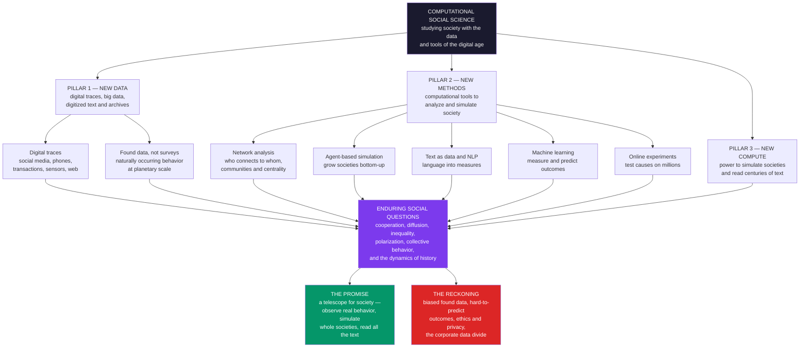

# 🔭 Computational Social Science — An Overview

> [!abstract] TL;DR
> **Computational social science (CSS)** is the interdisciplinary field that uses **computational methods** and **large-scale data** to study **human behavior and society** — fusing the social sciences (sociology, political science, economics, history, psychology, communication) with **data science**, **network science**, **complexity**, and **AI/ML**. It rests on **three drivers**: **new DATA** — the explosion of **digital traces** (social media, mobile phones, transactions, sensors, web, administrative records) and **digitized** text and archives, giving *naturally-occurring* behavior at unprecedented scale and granularity; **new METHODS** — **network analysis**, **agent-based simulation**, **machine learning**, **text-as-data / NLP**, and large-scale **online experiments**; and **new COMPUTE** — the power to simulate whole societies, analyze billions of records, and read centuries of text in an afternoon. Formalized by **Lazer et al.'s 2009 *Science* manifesto**, CSS acts as a **"telescope for society,"** letting researchers observe *real* behavior rather than self-report, simulate counterfactual societies, and experiment on millions — to attack enduring questions of **cooperation, diffusion, inequality, polarization, collective behavior, and the long-run dynamics of history**. Genuinely transformative and tightly linked to **complexity economics** and **network science**, it must nonetheless confront serious problems: **biased "found" data** ("big data ≠ good data"), the surprising **difficulty of predicting** social outcomes, and acute **ethics and privacy** concerns — making it one of the most exciting and consequential frontiers in the study of humanity.

---

## Intuition

**Analogy:** For most of its history, studying society was like **astronomy before the telescope**. Scholars theorized about human behavior from a handful of surveys, censuses, and dusty archives — squinting at a vast, mostly-invisible social universe and inferring its laws from a few bright, nearby points. They could see the moon and a scatter of stars; the rest was conjecture, anecdote, and armchair theory. The instruments were too crude to *see* the object of study.

Then, within a single generation, humanity moved its social life onto **digital infrastructure**. Every message, purchase, movement, friendship, click, and search became a **recorded data point**. Suddenly social scientists had their telescope: **billions of traces of real human behavior at planetary scale**, plus the **computational power** to simulate whole societies and read a century of published text before lunch. **Computational social science is what happens when the study of humanity finally gets its instruments** — when we can *observe* the social universe instead of only guessing at it.

The crucial reframing: the patterns social scientists most care about — how a rumor sweeps a nation, how a movement ignites, how a society polarizes, how inequality compounds — are **collective, emergent** phenomena that live at the level of the crowd, invisible to any single interview. Like a galaxy that only resolves under a large aperture, they become *observable* only when you can watch millions of people at once. To see them, you need the telescope.

---

## How It Works

Computational social science is best understood not as one method but as a **fusion**: enduring **social questions** are attacked with a new **methods portfolio**, powered by three simultaneous shifts in what is possible. Where classical social science was **theory-rich but data-poor** — a few thousand survey respondents, painstakingly collected — CSS is **data-rich and computation-heavy**, working with the behavioral exhaust of entire populations.

### The three drivers that make CSS possible

1. **New DATA — digital traces and digitized archives.** The foundational shift. Human life is now instrumented. **Social media** records opinion and interaction; **mobile phones** log mobility and communication; **transactions** capture consumption; **sensors and the web** record attention; **administrative records** track institutions; and mass **digitization** has turned centuries of newspapers, books, and government archives into machine-readable text. Crucially, most of this is **"found" data** — *naturally-occurring* behavioral traces, not answers to a researcher's questions. This trades the *control* of a survey for enormous **scale, granularity, and reach**: you see what people *did*, continuously, at population scale, rather than what they *say* they did once. (The vault's *Big_Data_and_the_Social_Sciences* and *Digital_Traces_and_Found_Data* notes drill into this shift and its measurement pitfalls.)

2. **New METHODS — a computational toolkit.** Found data at this scale is useless without tools to handle it. CSS assembles: **network analysis** (the structure of relationships — who connects to whom, communities, centrality, diffusion), **agent-based modeling** (growing societies bottom-up to see how macro-patterns emerge from micro-rules), **machine learning** (measuring and forecasting social outcomes from high-dimensional data), **text-as-data / NLP** (turning language into quantitative measures of sentiment, topics, and ideology), and large-scale **online experiments** (running randomized trials on millions to establish causation). This is the methods portfolio the rest of this vault maps.

3. **New COMPUTE — scale of simulation and processing.** Underlying both is raw computational power: enough to **simulate** millions of interacting agents, **analyze** billions of records, and **process** entire corpora of text. Data plus methods plus compute, meeting the social questions, is what distinguishes CSS from both traditional social science (which lacked the data and compute) and pure data science (which lacks the social theory and questions).

### The methodological toolkit — the vault's map

The heart of CSS is its **methods portfolio**, each a branch of this vault:

- **Social network analysis** — the *structure* of social systems: centrality (who is influential), community detection (who clusters together), and diffusion (how things spread through ties). See the forthcoming *Social_Network_Analysis_Foundations*.
- **Agent-based modeling and social simulation** — *growing* societies bottom-up: Schelling segregation, opinion dynamics, cultural evolution. This is where CSS shares a spine with **complexity economics** and **systems thinking** (*Agent_Based_Models_of_Society*).
- **Text as data / NLP** — turning *language* (news, social media, historical archives) into numbers: sentiment, topics, ideology, cultural change over time (*Text_as_Data_in_Social_Science*).
- **Machine learning and prediction** — forecasting and *measuring* social outcomes, and probing the limits of predictability (*Prediction_and_Machine_Learning_in_Social_Science*).
- **Causal inference and online experiments** — establishing *what causes what* at scale, from digital field experiments to quasi-experiments in observational trace data (*Causal_Inference_from_Observational_and_Digital_Data*, *Online_Experiments_and_Digital_Field_Experiments*).
- **Cliodynamics and quantitative history** — mathematical models of *long-run* historical and societal dynamics (*Cliodynamics_and_Quantitative_History*).

### The enduring social questions

The methods are new; the **questions are old and big**. CSS turns its instruments on **cooperation and collective action**, the **diffusion** of innovations, information, and behavior, social **influence** through **networks**, **inequality** and stratification, **collective behavior** (crowds, movements, panics), **polarization** and the online public sphere (*Misinformation_Polarization_and_the_Online_Public_Sphere*), the evolution of **culture**, and the long-run **dynamics of societies**. The methods are the means; these questions are the substance.

### The field as a hub

CSS is a **bridge discipline**. It overlaps with **complexity economics** (agent-based models, networks, emergence), **systems thinking / complex systems** (emergence, self-organization, networks), **data science and AI/ML** (the technical toolkit), **network science** (the structure of social systems), and **digital humanities / cliodynamics** (computational history). It is the hub connecting the social sciences to the computational and complexity sciences.

### The field, in one picture



---

## Key Concepts

### Secondary Level

**What CSS is.** For a long time, studying society meant asking a few thousand people questions and hoping they answered honestly. Now, because so much of life happens on phones and computers, we can *see* what billions of people actually do — who they talk to, what they buy, where they go, what they share. **Computational social science** uses this huge pile of data, plus powerful computers, to study how people and societies really work.

**The telescope idea.** Just as the telescope let astronomers finally *see* the stars instead of only guessing, digital data lets social scientists finally *see* human behavior at a massive scale — how a rumor spreads, how a protest grows, how neighborhoods split apart.

**Three things make it possible:**

| The driver | What it means |
|---|---|
| New **data** | Everything we do online leaves a trace we can study |
| New **methods** | Computer tools to map networks, simulate crowds, and read text |
| New **computing** | Enough power to handle billions of people's data at once |

**Why it matters — and why to be careful.** CSS can spot patterns invisible to old methods. But the data can be **biased** (not everyone is online the same way), predicting people is **hard**, and using personal data raises big **privacy** questions. It is powerful *and* it must be used responsibly.

### Undergraduate Level

#### The definition and the 2009 manifesto

CSS is "the study of society with the tools and data of the digital age." The field was crystallized by **David Lazer and colleagues' 2009 *Science* article "Computational Social Science,"** which argued that the digital footprints of human activity had created an unprecedented opportunity — and that social science needed to organize itself, methodologically and institutionally, to seize it. CSS is inherently **interdisciplinary**: it draws its *questions* from sociology, political science, economics, communication, and history, and its *tools* from computer science, statistics, network science, and physics.

#### Found data vs designed data

The central methodological pivot is from **designed data** (surveys and experiments, collected *for* a research question, with control but limited scale) to **found data** (digital traces, produced as a *byproduct* of everyday life, with enormous scale but no experimental control). Salganik frames this as the difference between *asking* and *observing*. Found data is **big** (population scale), **always-on** (continuous, longitudinal), and **nonreactive** (people are not answering a researcher). But it is also often **incomplete**, **non-representative**, **algorithmically confounded** (shaped by the platform), and of **uncertain validity** — a central tension the field must manage, not wish away.

#### The methods portfolio, concretely

- **Networks.** Represent people as nodes and relationships as edges; compute **centrality** (influence), detect **communities** (clusters), and model **diffusion** (spread). Granovetter's "strength of weak ties" and the study of contagion live here.
- **Agent-based models (ABMs).** Specify simple behavioral rules for many heterogeneous agents, simulate, and watch macro-patterns *emerge*. Schelling's segregation model — mild individual preferences producing stark macro-segregation — is the canonical demonstration.
- **Text as data.** Treat a corpus as data: count words, extract **sentiment**, discover **topics** (topic models like LDA), measure **ideology** or cultural change over time. A century of newspapers becomes a time series.
- **Machine learning.** Use high-dimensional trace data to *measure* hard-to-observe constructs (e.g. estimating income or opinion from behavior) and to *predict* outcomes.
- **Online experiments.** Because platforms let you randomize treatments to millions, CSS can run **field experiments** at a scale traditional social science could never afford — testing, for example, how a message design changes voting or sharing.

#### The predictability problem

A signature *empirical humility* of CSS: even massive data plus state-of-the-art machine learning often predicts individual social outcomes **poorly**. The **Fragile Families Challenge** — hundreds of teams, rich longitudinal data, best-in-class ML — found that life outcomes (GPA, eviction, material hardship) were **barely predictable**. This is a foundational lesson: social systems are not merely under-measured; they may be *intrinsically* hard to predict, tempering naive "more data solves everything" optimism.

### Graduate Level

#### The epistemology: measurement validity in found data

The deepest challenge is not volume but **construct validity**: *does the trace measure what you think it measures?* A "like" is not endorsement; a follow is not friendship; a search is not a belief. Found data are **operationalizations of convenience**, and much of rigorous CSS is the careful work of validating that a computational measure (a sentiment score, an ideology estimate, a mobility metric) tracks the latent social construct — typically by triangulating traces against gold-standard surveys or hand-coded ground truth. The platform is also an **active confounder**: recommendation algorithms shape what is observed, so the data reflect the *system*, not just the users (**algorithmic confounding**). Lazer et al.'s 2014 "**Parable of Google Flu**" is the cautionary classic — a celebrated big-data predictor that drifted badly because it modeled *search behavior and Google's own algorithm changes*, not influenza.

#### Prediction vs explanation, and the "end of theory" debate

CSS inherits a tension between the **predictive** culture of machine learning and the **explanatory** culture of social science. Anderson's provocative "**end of theory**" claim — that with enough data, correlation supersedes causal models — has been broadly rejected: prediction without a model of *mechanism* is fragile (Google Flu), non-transportable, and cannot answer *why* or *what if*. The mature position is **complementarity**: ML for measurement and forecasting; **causal inference** (natural experiments, instrumental variables, difference-in-differences, RCTs) and **generative models** (ABMs) for explanation and counterfactuals. Watts argues CSS's real promise is to make social science more **cumulative and predictive** *precisely by* combining large-scale observation with theory and experiment, not by abandoning theory.

#### Causal inference at scale

Observational trace data invites spurious inference (homophily-vs-influence confounding: do friends behave alike because they influence each other, or because similar people befriend each other?). CSS addresses this with **large-scale randomized experiments** (e.g. the 61-million-person Facebook "social contagion of voting" study; emotional-contagion manipulations) and **quasi-experimental** designs mining natural discontinuities in digital data. This is where CSS's scale is genuinely transformative — statistical power to detect tiny-but-consequential effects across a population — *and* where its ethics are most fraught.

#### The honest reckoning: bias, ethics, and access

Three structural critiques define the field's self-awareness. **Data bias**: digital traces are **non-representative** and platform-skewed (the "WEIRD"-sample problem compounded — Twitter/X users are not the public), so "big data ≠ good data," and naive inference generalizes badly. **Ethics and privacy**: the **Facebook emotional-contagion** experiment (manipulating feeds without consent) and the **Cambridge Analytica** scandal (harvested profiles weaponized for political targeting) exposed acute harms around consent, surveillance, and algorithmic manipulation — CSS operates under real tension between scientific value and individual rights. **The data divide**: the richest behavioral data is **locked inside corporations**, creating profound inequities in who can do this science and a dependence on platform gatekeepers who can revoke access at will. Add the field's **reproducibility** challenges (proprietary data, non-shareable pipelines), and CSS is a science actively — and admirably — **grappling with its own limits**, as Lazer et al.'s 2020 "**Obstacles and Opportunities**" retrospective makes explicit.

---

## Python Demo

```python
import numpy as np
import matplotlib
matplotlib.use("Agg")
import matplotlib.pyplot as plt

# =====================================================================
# THE CSS TOOLKIT IN MINIATURE, on toy data (numpy + matplotlib only):
#   (1) NETWORK ANALYSIS  -> build a social network; find communities
#                            (spectral / Fiedler) and degree centrality
#   (2) AGENT-BASED SIM   -> a diffusion process ON that network; watch
#                            the macro S-curve EMERGE from local infection
#   (3) TEXT AS DATA      -> score toy social-media posts for sentiment
# No networkx required: the graph is a plain adjacency matrix.
# =====================================================================
rng = np.random.default_rng(42)

# ---------------------------------------------------------------------
# (1) BUILD A SOCIAL NETWORK: a stochastic block model with 2 groups.
#     DENSE ties within each group, SPARSE ties between -> communities.
# ---------------------------------------------------------------------
N = 40
group = np.array([0] * (N // 2) + [1] * (N - N // 2))   # planted communities
p_in, p_out = 0.35, 0.03
A = np.zeros((N, N), dtype=int)
for i in range(N):
    for j in range(i + 1, N):
        p = p_in if group[i] == group[j] else p_out
        if rng.random() < p:
            A[i, j] = A[j, i] = 1

deg = A.sum(axis=1)                                     # DEGREE centrality

# --- SPECTRAL COMMUNITY DETECTION (a core network-analysis method) ----
#     Laplacian L = D - A. The FIEDLER vector (eigenvector of the 2nd
#     smallest eigenvalue) splits the graph; its SIGN labels communities.
#     Eigenvectors 2 and 3 double as a 2-D spectral LAYOUT for drawing.
D = np.diag(deg)
L = D - A
evals, evecs = np.linalg.eigh(L)                        # ascending
order = np.argsort(evals)
fiedler = evecs[:, order[1]]
detected = (fiedler > 0).astype(int)
pos = np.column_stack([evecs[:, order[1]], evecs[:, order[2]]])
acc = max((detected == group).mean(), (detected != group).mean())

# ---------------------------------------------------------------------
# (2) AGENT-BASED DIFFUSION: an "independent cascade" of a new behavior.
#     Seed the two highest-degree hubs; each step, every adopter converts
#     each not-yet-adopted NEIGHBOR with probability q. The cumulative
#     S-CURVE emerges from purely LOCAL infections -- macro from micro.
# ---------------------------------------------------------------------
q = 0.16
adopted = np.zeros(N, dtype=bool)
seeds = np.argsort(deg)[-2:]                            # two hubs
adopted[seeds] = True
newly = adopted.copy()
history = [adopted.mean()]
for _ in range(30):
    activate = np.zeros(N, dtype=bool)
    for i in np.where(newly)[0]:
        for j in np.where(A[i] == 1)[0]:
            if not adopted[j] and rng.random() < q:
                activate[j] = True
    newly = activate & ~adopted
    adopted |= activate
    history.append(adopted.mean())
    if not newly.any():
        break
history = np.array(history)

# ---------------------------------------------------------------------
# (3) TEXT AS DATA: turn language into a number. A tiny lexicon scores
#     the SENTIMENT of toy social-media posts -- the simplest bag-of-
#     words measurement, the same idea that scales to billions of posts.
# ---------------------------------------------------------------------
posts = [
    "love this amazing wonderful community so happy",
    "great news fantastic win everyone is excited",
    "okay fine nothing special today just normal",
    "worried about the awful terrible crisis unfolding",
    "hate this broken system it is a total disaster",
    "good people helping happy to see kindness spread",
]
pos_words = {"love", "amazing", "wonderful", "happy", "great", "fantastic",
             "win", "excited", "good", "helping", "kindness", "spread"}
neg_words = {"worried", "awful", "terrible", "crisis", "hate",
             "broken", "disaster", "sad", "angry"}

def sentiment(text):
    toks = text.split()
    s = sum(w in pos_words for w in toks) - sum(w in neg_words for w in toks)
    return s / max(len(toks), 1)

scores = np.array([sentiment(p) for p in posts])

# ------------------------------- REPORT --------------------------------
print("=" * 64)
print("CSS TOOLKIT IN MINIATURE")
print("=" * 64)
print(f"(1) NETWORK : {N} nodes, {A.sum() // 2} edges, "
      f"mean degree {deg.mean():.1f}")
print(f"    spectral community detection recovered planted groups "
      f"at accuracy {acc:.0%}")
print(f"(2) DIFFUSION : seeded 2 hubs -> reached {history[-1]:.0%} "
      f"of the network in {len(history) - 1} steps")
print(f"(3) TEXT : sentiment scores = "
      f"{np.round(scores, 2).tolist()}")
print(f"    -> {(scores > 0).sum()} positive, {(scores < 0).sum()} negative, "
      f"{(scores == 0).sum()} neutral posts")

# ------------------------------- FIGURE --------------------------------
fig, axes = plt.subplots(2, 2, figsize=(13.5, 10.5))
fig.suptitle("Computational Social Science: network + simulation + text, "
             "on toy data", fontsize=13, fontweight="bold")
colors = ["#dc2626", "#2563eb"]

# Panel A: the social network, colored by DETECTED community, sized by degree
axA = axes[0, 0]
for i in range(N):
    for j in range(i + 1, N):
        if A[i, j]:
            axA.plot([pos[i, 0], pos[j, 0]], [pos[i, 1], pos[j, 1]],
                     color="#bbbbbb", lw=0.5, zorder=1)
axA.scatter(pos[:, 0], pos[:, 1], s=40 + 30 * deg,
            c=[colors[d] for d in detected], edgecolors="black",
            linewidths=0.6, zorder=2)
axA.scatter(pos[seeds, 0], pos[seeds, 1], s=260, facecolors="none",
            edgecolors="#059669", linewidths=2.2, zorder=3,
            label="diffusion seeds (hubs)")
axA.set_title(f"(1) Social network + spectral communities\n"
              f"node size = degree centrality  |  recovery {acc:.0%}",
              fontsize=10)
axA.legend(fontsize=8, loc="upper right")
axA.set_xticks([]); axA.set_yticks([])

# Panel B: degree distribution (a first structural statistic)
axB = axes[0, 1]
axB.hist(deg, bins=range(0, deg.max() + 2), color="#7c3aed",
         alpha=0.8, edgecolor="black")
axB.axvline(deg.mean(), color="#dc2626", ls="--", lw=1.8,
            label=f"mean degree = {deg.mean():.1f}")
axB.set_title("(1) Degree distribution\nwho is well-connected?", fontsize=10)
axB.set_xlabel("degree (number of ties)"); axB.set_ylabel("count of people")
axB.legend(fontsize=8); axB.grid(alpha=0.25)

# Panel C: emergent diffusion S-curve
axC = axes[1, 0]
axC.plot(history, "-o", color="#059669", lw=2, ms=5)
axC.fill_between(range(len(history)), history, alpha=0.15, color="#059669")
axC.set_title("(2) Agent-based diffusion on the network\n"
              "macro S-curve EMERGES from local infection", fontsize=10)
axC.set_xlabel("time step"); axC.set_ylabel("fraction adopted")
axC.set_ylim(0, 1.02); axC.grid(alpha=0.25)

# Panel D: text-as-data sentiment
axD = axes[1, 1]
bar_c = ["#059669" if s > 0 else "#dc2626" if s < 0 else "#9ca3af"
         for s in scores]
axD.barh(range(len(posts)), scores, color=bar_c, edgecolor="black")
axD.axvline(0, color="black", lw=0.9)
axD.set_yticks(range(len(posts)))
axD.set_yticklabels([p[:22] + "..." for p in posts], fontsize=7.5)
axD.invert_yaxis()
axD.set_title("(3) Text as data: sentiment of social posts\n"
              "language turned into a number", fontsize=10)
axD.set_xlabel("sentiment score  (negative <- 0 -> positive)")
axD.grid(alpha=0.25, axis="x")

plt.tight_layout(rect=[0, 0, 1, 0.95])
plt.savefig("computational_social_science_overview.png", dpi=110,
            bbox_inches="tight")
plt.show()
```

**What the demo shows:**

- **Panel A (network + communities).** A synthetic social network drawn with a **spectral layout**, colored by the **community** each node is assigned via the **Fiedler vector** of the graph Laplacian — a real, purely-linear-algebra community-detection method. Node size encodes **degree centrality**; the green rings mark the two hubs seeded for diffusion. The method recovers the planted groups with high accuracy, illustrating how CSS reads *structure* out of raw ties.
- **Panel B (degree distribution).** The simplest structural statistic — how many ties each person has. Real social networks are famously *right-skewed* (a few hubs, many peripheral nodes); even this toy graph shows the spread that makes "who is central?" a substantive question.
- **Panel C (emergent diffusion).** A tiny **agent-based** independent-cascade model: two hubs adopt a behavior, and it spreads only through *local* infection of neighbors. The characteristic **S-curve** of cumulative adoption **emerges** — slow start, rapid middle, saturation — a macro pattern no single agent planned, mirroring how innovations, rumors, and behaviors diffuse through real social networks.
- **Panel D (text as data).** A minimal **bag-of-words sentiment** measure turns each social-media post into a single number using a small positive/negative lexicon. Green bars are positive, red negative, gray neutral — the same operation, scaled to billions of documents, is how CSS measures mood, ideology, and cultural change from text.

The takeaway: **network + simulation + text**, the CSS toolkit in miniature — reading structure out of relationships, growing dynamics out of micro-rules, and extracting meaning out of language, all from data.

---

## Real-World Applications

> **Diffusion and social contagion.** The study of how information, behaviors, and innovations spread through networks — from Christakis and Fowler's work on the contagion of obesity, smoking, and happiness in social ties, to the spread of misinformation on platforms. CSS supplies both the network measurement and the diffusion models, connecting directly to [[Diffusion_of_Innovations_and_Adoption_Dynamics]] and [[Network_Dynamics_and_Contagion]].

> **Polarization and the online public sphere.** Large-scale analysis of social media reveals echo chambers, affective polarization, and the dynamics of the digital public square. CSS quantifies ideological segregation, tracks the spread of falsehoods (which travel faster and farther than truth, per Vosoughi et al. in *Science*), and evaluates platform interventions — a hub topic linking to [[Democratic_Backsliding_and_Polarization]] and [[Media_Propaganda_and_Political_Communication]].

> **Mobility, cities, and crises.** Mobile-phone and GPS traces let researchers map human mobility, urban structure, segregation, and — during COVID-19 — the effect of interventions on disease spread in near-real-time. "Social physics" (Pentland) and computational urban science treat the city as an instrumented system, complementing traditional [[Sociological_Research_Methods]].

> **Culture and history at scale.** Mass text digitization powers "**culturomics**" (Google Books n-grams tracking word frequency across centuries) and computational history. The **cliodynamics** program (Turchin) builds mathematical models of the rise and fall of societies, testing them against historical databases — see [[Big_History_and_Cliodynamics]].

> **Computational economics and inequality.** CSS shares agent-based and network methods with **complexity economics** to study the *emergence* of wealth distributions, market dynamics, and systemic risk — see [[Complexity_Economics_Overview]], [[Wealth_and_Income_Inequality_Dynamics]], and [[Economic_Networks_and_Interaction_Structure]].

> **Online field experiments.** Platforms enable randomized experiments at unprecedented scale — the 61-million-person voter-mobilization study on Facebook, A/B tests of message framing, and studies of network influence — establishing *causation* where observational trace data can only show correlation.

---

## Common Pitfalls

- **Treating "big data" as "good data."** The most important warning in the field. Digital traces are **non-representative** and **platform-skewed**: X/Twitter users are not the public, and a huge but biased sample can be *worse* than a small representative one — it gives false confidence. Scale does not cure bias; it can *hide* it. Always ask *who is missing* from the data.
- **Ignoring measurement validity — "does the trace mean what I think?"** A "like" is not endorsement, a friend-link is not friendship, a search is not a belief. Deploying a computational measure without validating it against ground truth (surveys, hand-coding) is the field's most common silent failure. Google Flu Trends is the cautionary monument: a celebrated predictor that modeled *search behavior* and algorithm changes, not flu.
- **Mistaking prediction for explanation.** ML can forecast or measure without revealing *mechanism*. A model that predicts well can still be causally wrong and will fail out-of-distribution. The "end of theory" hope — that data replaces theory — is false; correlation at scale still needs causal design and social theory to answer *why* and *what if*.
- **Confusing correlation with influence (homophily vs contagion).** In observational network data, friends behaving alike may reflect *influence* (you changed me) or *homophily* (we were similar and became friends) — the two are notoriously hard to separate without experiments or careful identification. Claiming "social contagion" from correlation alone is a classic error.
- **Underrating how hard social prediction is.** The Fragile Families Challenge showed even massive data plus top ML predicts individual life outcomes poorly. Overpromising predictability — "we can forecast who will be evicted / radicalized / successful" — invites both scientific embarrassment and real-world harm.
- **Treating ethics and privacy as an afterthought.** Because found data is *nonreactive*, it is tempting to skip consent — but the Facebook emotional-contagion and Cambridge Analytica episodes show the stakes. Surveillance, re-identification of "anonymized" data, and algorithmic manipulation are live harms; ethics is a *design constraint*, not a compliance checkbox.
- **Forgetting the data divide.** The best behavioral data lives inside corporations that can grant or revoke access at will. Building a research program on a single platform's API is scientifically fragile (see the post-2023 Twitter/X and Facebook API restrictions) and raises deep questions about *who gets to do* this science.

---

## Related Concepts

**The social-science substance (Sociology, Political Science, History):**

- [[Social_Networks_and_Social_Ties]] — the sociological theory of networks (weak ties, structural holes) that CSS measures computationally at scale.
- [[Social_Capital_and_Trust]] — a core social construct CSS operationalizes from network structure and trace data.
- [[Collective_Behavior_and_Crowds]] — crowds, panics, and movements; CSS studies these as emergent, network-driven dynamics.
- [[Social_Movements_and_Revolution]] — mobilization and protest, now trackable through social-media traces and network analysis.
- [[Digital_Society_and_Online_Communities]] — the digital social world that *generates* the found data CSS relies on.
- [[Sociological_Research_Methods]] — the classical (designed-data) methods CSS complements and challenges with found data.
- [[Democratic_Backsliding_and_Polarization]] — the polarization CSS quantifies in the online public sphere.
- [[Media_Propaganda_and_Political_Communication]] — misinformation and influence, a flagship CSS application area.
- [[Public_Opinion_and_Political_Socialization]] — opinion measurement, now augmented by text-as-data and trace signals.
- [[Big_History_and_Cliodynamics]] — the quantitative, model-driven study of long-run historical dynamics.
- [[Globalization_and_the_Digital_Age]] — the historical shift that put social life onto instrumented digital infrastructure.
- [[Primary_and_Secondary_Sources]] — the archival sources whose mass digitization enables computational history.

**The complexity and network foundations (Systems Thinking, Complexity Economics):**

- [[Network_Science_Fundamentals]] — the formal backbone of social network analysis.
- [[Centrality_and_Community_Structure]] — the exact measures (centrality, community detection) demonstrated in this note's Python demo.
- [[Small_World_and_Scale_Free_Networks]] — the structural signatures of real social networks (hubs, short paths).
- [[Network_Dynamics_and_Contagion]] — the diffusion and contagion processes CSS models on social ties.
- [[Agent_Based_Modeling]] — the bottom-up simulation method CSS uses to grow societies.
- [[Emergence_and_Self_Organization]] — why macro social patterns cannot be read off individuals; the core CSS insight.
- [[Complex_Adaptive_Systems]] — society as a CAS of interacting, adapting agents; the shared paradigm.
- [[Economic_and_Social_Complexity]] — the systems-thinking application note that CSS extends to social data.
- [[Complexity_Economics_Overview]] — the sibling field sharing agent-based models, networks, and emergence.
- [[Agent_Based_Modeling_in_Economics]] — economic ABMs, methodologically identical to CSS social simulations.
- [[Schelling_Segregation_and_Emergent_Patterns]] — the canonical agent-based model of emergent social segregation.
- [[Diffusion_of_Innovations_and_Adoption_Dynamics]] — the S-curve adoption dynamics reproduced in the demo.
- [[Economic_Networks_and_Interaction_Structure]] — the interaction-structure lens CSS shares with complexity economics.
- [[Wealth_and_Income_Inequality_Dynamics]] — inequality as an emergent, generatively-modeled phenomenon.

**The computational toolkit (AI-ML, Mathematics, Evolutionary Game Theory):**

- [[Text_Preprocessing]] — the first step of any text-as-data pipeline (tokenizing, cleaning social-media text).
- [[Word_Embeddings]] — dense vector representations that let CSS measure meaning, bias, and ideology in text.
- [[Word2Vec]] — the embedding method widely used to quantify semantic and cultural change in corpora.
- [[Naive_Bayes]] — the classic probabilistic text classifier behind sentiment and topic labeling.
- [[BERT]] — modern transformer models now standard for computational text analysis of social data.
- [[Language_Model_Basics]] — the LLM foundations increasingly used to annotate and simulate social text.
- [[Graph_Theory]] — the mathematics underlying every social-network measure.
- [[Cultural_Evolution_and_Social_Learning]] — the theory of how culture spreads and evolves, formalized in CSS models.
- [[The_Prisoners_Dilemma_and_Cooperation]] — the cooperation problem CSS studies via networks and simulation.
- [[Spatial_and_Network_Games]] — strategic interaction on networks, linking game theory to social structure.

**Forthcoming siblings in this vault (planned, not yet written):** *Big Data and the Social Sciences*, *Digital Traces and Found Data*, *Ethics and Privacy in Computational Social Science*, *Social Network Analysis Foundations*, *Agent-Based Models of Society*, *Text as Data in Social Science*, *Cliodynamics and Quantitative History*, *Prediction and Machine Learning in Social Science*, *Causal Inference from Observational and Digital Data*, *Online Experiments and Digital Field Experiments*, *Misinformation, Polarization, and the Online Public Sphere*, and *The Reach and Future of Computational Social Science*. This overview is the map; those notes are the territory.

---

## Review Questions

### Secondary

1. Explain the "telescope for society" idea in your own words: what could social scientists *not* see before digital data, and what can they see now?
2. Name the three drivers that make computational social science possible (data, methods, computing) and give a one-sentence example of each from everyday online life.
3. Give one reason CSS is powerful and one reason it can be misleading or risky. Why might a huge dataset still give the *wrong* answer about "what people think"?

### Undergraduate

1. Distinguish **designed data** (surveys, experiments) from **found data** (digital traces). For each, name one strength and one weakness, and explain the tradeoff CSS makes when it chooses found data.
2. Pick two methods from the CSS portfolio (network analysis, agent-based modeling, text-as-data, machine learning, online experiments). For each, state what kind of social question it is best suited to answer and give a concrete example.
3. The Fragile Families Challenge found that massive data plus machine learning predicted life outcomes poorly. What does this result imply about the limits of prediction in social science, and why is it a *healthy* result for the field to internalize?

### Graduate

1. "Big data ≠ good data." Using **representativeness**, **measurement validity**, and **algorithmic confounding**, explain three distinct ways a large digital-trace dataset can yield biased or invalid social inference, and describe a mitigation for each. Use Google Flu Trends as an illustration.
2. In observational network data, distinguish **homophily** from **social influence** and explain why they are confounded. What research designs (randomized experiments, shocks, identification strategies) can CSS use to separate them, and what are the ethical costs of the experimental route?
3. Evaluate the "end of theory" claim against the prediction-versus-explanation distinction. Where is machine learning genuinely transformative for social science, where does it fail without causal or generative modeling, and how should CSS integrate prediction, causal inference, and social theory? Reference the ethics-and-access constraints (Cambridge Analytica, the data divide, reproducibility) that shape what CSS *can* and *should* do.

---

## Sources

- [Lazer, D. et al. (2009). "Computational Social Science." *Science* 323(5915), 721–723](https://doi.org/10.1126/science.1167742)
- [Lazer, D. M. J. et al. (2020). "Computational social science: Obstacles and opportunities." *Science* 369(6507), 1060–1062](https://doi.org/10.1126/science.aaz8170)
- [Salganik, M. J. (2018). *Bit by Bit: Social Research in the Digital Age*. Princeton University Press](https://www.bitbybitbook.com/)
- [Watts, D. J. (2011). *Everything Is Obvious: Once You Know the Answer*. Crown Business](https://www.penguinrandomhouse.com/books/89643/everything-is-obvious-by-duncan-j-watts/)
- [Cioffi-Revilla, C. (2014). *Introduction to Computational Social Science: Principles and Applications*. Springer](https://doi.org/10.1007/978-1-4471-5661-1)
- [Lazer, D. et al. (2014). "The Parable of Google Flu: Traps in Big Data Analysis." *Science* 343(6176), 1203–1205](https://doi.org/10.1126/science.1248506)

---

#computational-social-science #big-data #social-networks #agent-based-modeling #interdisciplinary
