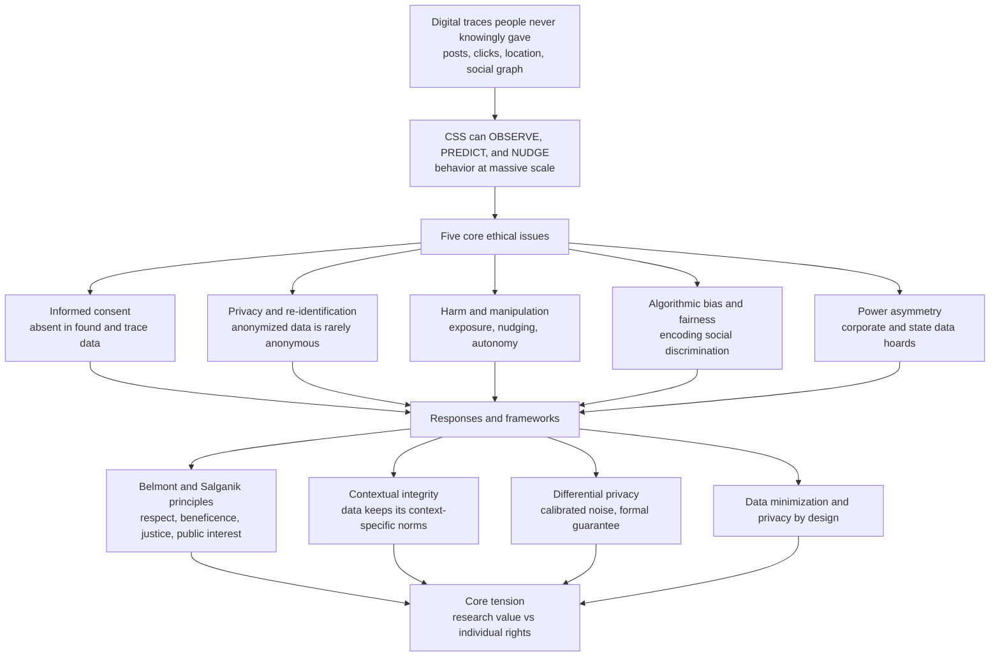

> [!abstract] TL;DR
> Computational social science can **observe, predict, and even nudge** human behavior at a scale no ethics board ever imagined, using data people never knowingly gave — so ethics is a **first-order** concern, not an afterthought. The traditional consent-based model breaks down: **informed consent** is largely absent in found/trace data, **privacy** collapses because "anonymized" data is easily **re-identified** (a handful of quasi-identifiers or location points fingerprint most people), and the field risks **harm, manipulation, algorithmic bias**, and complicity with a **surveillance infrastructure** whose power asymmetry — corporate/state data hoards versus individuals and independent researchers — is itself an ethical problem. Responding demands new frameworks (**contextual integrity**, the **Belmont/Salganik** principles) and technical safeguards (**differential privacy**, now used by the US Census), turning ethics into the defining constraint of the field.

---

## Intuition

**Analogy:** In 2014, Facebook quietly altered the news feeds of **689,000 users** to see whether it could make them sadder or happier — then published the result. No one consented; most never knew. The study "worked" (emotions really are contagious across a network) and immediately ignited a firestorm: is running a psychological experiment on unwitting millions **science**, or **manipulation**?

That question is the whole field in miniature. Computational social science can watch society through its digital exhaust, forecast what people will do, and quietly reshape what they do — all from data that was never knowingly handed over. Its greatest power — **seeing and shaping society through its digital traces** — is also its gravest ethical hazard. The tools that built the [[Big_Data_and_the_Social_Sciences|big-data]] revolution (see the companion **Computational_Social_Science_Overview** and **Digital_Traces_and_Found_Data**) are the same tools that power marketing, micro-targeting, and surveillance. Ethics is not a compliance checkbox bolted on at the end; it is the load-bearing question of what this power is *for* and who it is *done to*.

---

## How It Works

### Why traditional research ethics is not enough

Research ethics as we know it was designed for **small, consenting, in-person studies** — a psychologist recruiting a hundred undergraduates, a clinical trial with signed forms. Its machinery (informed consent, IRB review, the Belmont principles) assumes you can **identify** each subject, **explain** the study, and obtain **voluntary agreement** before anything happens. Computational social science violates every one of those assumptions: subjects number in the millions, they are never contacted, and the data often exists *before* any research question does. The old rules do not so much fail as become **inapplicable** — which is exactly why the field had to re-derive its ethics from cases.

### The five core ethical issues

1. **Informed consent in trace/big data.** The consent ideal requires that people *knowingly and voluntarily* agree to participate. Trace research usually has **none**: agreement is buried in a terms-of-service no one reads, or data is repurposed far from where it was generated. Is a TOS click "consent"? Can anyone consent to *unknown future uses*? And you cannot individually consent **billions** of people. New models — **broad consent** (agree once to a class of future research), **opt-out**, and **community/collective consent** — soften the problem but each has limits (opt-out favors the researcher; broad consent strains the meaning of "informed").

2. **Privacy and re-identification.** Privacy is best understood not as secrecy but as **control over personal information** flowing in its expected context. Helen Nissenbaum's **contextual integrity** frames a violation as moving data *out of its context*: a health post repurposed by an insurer, a location trail sold to a data broker. The pervasive-tracing world quietly erodes this control, and even **group privacy** is at stake — inferences about a group you belong to (a neighborhood, a diagnosis) can harm you without singling you out.

3. **Harm and manipulation.** Beyond privacy lie concrete harms: **embarrassment**, **discrimination**, **chilling effects**, and real-world danger from exposure (an outed identity, a stalked location). Worse is **manipulation** — using behavioral insight to nudge, persuade, or exploit at scale, as the emotional-contagion experiment and political micro-targeting did — a direct threat to **autonomy**. CSS methods are **dual-use**: the same pipeline serves research, marketing, and social control.

4. **Algorithmic bias and fairness.** Models trained on **biased social data** encode and *amplify* discrimination — in recidivism scoring, hiring, policing, and credit — and CSS findings can stigmatize groups while wearing the costume of objective science ("data-washing" discrimination). This is the **justice** dimension: who benefits from computational knowledge, and who is harmed?

5. **The power asymmetry / the "data divide."** The most valuable social data is held by **corporations and states** with vast power to surveil and shape behavior, while individuals have little control and independent researchers little access. This is Shoshana Zuboff's **surveillance capitalism** and its state analogue: the asymmetry of *who can watch whom*. A field dependent on — and complicit with — surveillance infrastructure inherits an ethical problem baked into its data supply.

### The flashpoint cases that forced a reckoning

The field learned its ethics from **failures**:

- **Facebook Emotional Contagion (2014)** — manipulating 689,000 feeds without consent, then publishing.
- **Cambridge Analytica** — harvesting ~87 million Facebook profiles for political micro-targeting.
- **The OkCupid release** — a researcher publicly dumping ~70,000 users' intimate profile data as "already public."
- **Tastes, Ties, and Time ("T3")** — a supposedly-anonymized dataset of Harvard students' Facebook data that was **quickly re-identified** from unique attributes.

### The frameworks that answer them

The response is a shift from rule-following to **ethical reasoning under uncertainty**: the **Belmont** principles (respect for persons, beneficence, justice) extended by Matthew Salganik into **four principles for digital-age research** — *respect for persons, beneficence, justice,* and *respect for law and public interest*; **contextual integrity** for reasoning about information flows; **privacy-by-design** with **differential privacy** and **data minimization**; and the discipline of asking, before you act, *"what could go wrong?"*

### Flow / Architecture



---

## Key Concepts

### Secondary (plain language)
- **"Anonymized" is not anonymous.** Deleting names is not enough: a few ordinary facts about you — your ZIP code, birthday, and sex, or a handful of the places you've been — are often enough to pick you out of millions.
- **Consent you never really gave.** Agreeing to a terms-of-service you didn't read is not the same as agreeing to be studied. Most big-data research never asks.
- **Watching can become nudging.** Once a system can predict your mood or vote, it can also try to *change* it — which is where science shades into manipulation.
- **Whoever holds the data holds the power.** The companies and governments with the biggest data can watch everyone; you cannot watch back.

### Undergraduate (some rigor)
- **Contextual integrity (Nissenbaum):** privacy norms are *context-specific*; a breach is an information flow that violates the norms of the context it came from (health → insurance, dating profile → public dataset).
- **k-anonymity:** a dataset is *k-anonymous* if every record is indistinguishable from at least `k-1` others on its **quasi-identifiers**. Sweeney showed naive de-identification often yields **k = 1** — everyone unique — so ~**87%** of Americans are uniquely identified by just **ZIP + full date of birth + sex**.
- **Linkage attacks:** re-identification works by **joining** a "de-identified" release to an auxiliary dataset that shares quasi-identifiers (the Netflix Prize ratings joined to public IMDb reviews; the Massachusetts hospital records joined to the voter roll).
- **The consent taxonomy:** *specific* vs *broad* consent, *opt-in* vs *opt-out*, individual vs **collective/community** consent — and why none fully rescues billion-person trace data.

### Graduate (advanced)
- **Differential privacy (formal):** a randomized mechanism `M` is **epsilon-differentially private** if for all adjacent datasets `D` and `D'` differing in one individual and all outputs `S`, `Pr[M(D) in S] <= exp(epsilon) * Pr[M(D') in S]`. It bounds what *any* adversary — regardless of side information — can learn about any single person. The **Laplace mechanism** achieves it by adding noise of scale `Δf / epsilon`, where `Δf` is the query's **L1 sensitivity**. Composition is additive in `epsilon`; the **privacy-utility trade-off** is fundamental — smaller `epsilon` means more noise and less accuracy.
- **de Montjoye's unicity:** in a mobility dataset with hourly, antenna-level resolution, **four spatiotemporal points uniquely identify ~95%** of individuals; unicity *decays slowly* with coarsening, so aggregation is a weak defense. High-dimensional sparse behavioral data is *inherently* re-identifiable.
- **Beyond anonymization:** the field's shift from *syntactic* guarantees (k-anonymity, l-diversity, t-closeness — all vulnerable to auxiliary information) to the *semantic*, composition-safe guarantee of differential privacy — the state of the art, deployed by the **US Census (2020)**, **Apple**, and **Google** (see [[Homomorphic_Encryption]] and [[Secure_Multiparty_Computation]] for complementary privacy-preserving computation).
- **Salganik's decision framework:** when consent and identification are impossible, reason from **principles** (the four above) using *consequentialist* and *deontological* lenses together, adopt the **precautionary "minimal risk"** and **"power to help"** heuristics, and treat ethical uncertainty like statistical uncertainty — with explicit assumptions and safeguards, not false confidence.

---

## Python Demo

```python
# Two pillars of CSS privacy ethics, made visible:
#   (a) RE-IDENTIFICATION -- "anonymized" data usually is NOT anonymous.
#       A few quasi-identifiers (ZIP + DOB + sex) or a few location points
#       make MOST people UNIQUE. We plot fraction-unique vs number of attributes,
#       reproducing Sweeney (~87% on ZIP+DOB+sex) and de Montjoye (~95% on 4 points).
#   (b) DIFFERENTIAL PRIVACY -- the privacy-utility trade-off. The Laplace
#       mechanism adds calibrated noise; smaller epsilon = more privacy = more error.
import numpy as np
import matplotlib.pyplot as plt

rng = np.random.default_rng(42)

# ============================================================
# (a) RE-IDENTIFICATION: uniqueness under quasi-identifiers
# ============================================================
N = 20_000

def sample_attr(cardinality, n):
    # mildly skewed (Zipf-like) categorical -- real populations are not uniform
    w = 1.0 / (1.0 + np.arange(cardinality))
    return rng.choice(cardinality, size=n, p=w / w.sum())

def cumulative_unique(cardinalities, n):
    """Fraction of individuals who are UNIQUE on the first k quasi-identifiers,
    for k = 1..len(cardinalities). Uniqueness = equivalence class of size 1."""
    cols = [sample_attr(c, n) for c in cardinalities]
    data = np.column_stack(cols)
    fracs = []
    for k in range(1, len(cardinalities) + 1):
        _, inv, counts = np.unique(data[:, :k], axis=0,
                                   return_inverse=True, return_counts=True)
        class_size = counts[inv.reshape(-1)]      # equivalence-class size per row
        fracs.append(float(np.mean(class_size == 1)))
    return fracs

# Demographic quasi-identifiers, ordered coarse -> fine (Sweeney-style)
demo_cards = [2, 90, 12, 31, 900, 90]   # sex, age-yr, birth-month, birth-day, ZIP3, ZIP-suffix
demo_labels = ["sex", "+age", "+month", "+day", "+ZIP3", "+ZIP5"]
demo_unique = cumulative_unique(demo_cards, N)

# Mobility: each extra "location point" is one hourly antenna bin (de Montjoye-style)
M_BINS = 110                              # distinct (place, hour) bins
loc_cards = [M_BINS] * 5                  # up to 5 spatiotemporal points
loc_unique = cumulative_unique(loc_cards, N)

print("Demographic quasi-identifiers (cumulative fraction unique):")
for lbl, f in zip(demo_labels, demo_unique):
    print(f"  {lbl:>7}: {f:6.1%}")
print(f"  -> ZIP+DOB+sex fingerprints ~{demo_unique[-1]:.0%} of individuals (cf. Sweeney 87%)")
print("Location points (cumulative fraction unique):")
for k, f in enumerate(loc_unique, 1):
    print(f"  {k} point(s): {f:6.1%}")
print(f"  -> {loc_unique[3]:.0%} unique at 4 points (cf. de Montjoye 95%)")

# ============================================================
# (b) DIFFERENTIAL PRIVACY: Laplace mechanism, privacy vs utility
# ============================================================
TRUE_PROP = 0.37                          # a proportion we want to release privately
N_DB = 10_000
true_count = TRUE_PROP * N_DB
SENSITIVITY = 1.0                         # adding/removing one person shifts the count by 1
epsilons = np.logspace(-2, 1.0, 30)       # strong privacy (0.01) -> weak privacy (10)
TRIALS = 4000

mae = []
for eps in epsilons:
    scale = SENSITIVITY / eps             # Laplace noise scale = sensitivity / epsilon
    noisy = true_count + rng.laplace(0.0, scale, size=TRIALS)
    mae.append(np.mean(np.abs(noisy / N_DB - TRUE_PROP)))
mae = np.array(mae)

# ============================================================
# PLOTS
# ============================================================
fig, (ax1, ax2) = plt.subplots(1, 2, figsize=(13, 5))

ax1.plot(range(1, len(demo_unique) + 1), demo_unique, "o-", color="#dc2626",
         label="demographic quasi-identifiers")
ax1.plot(range(1, len(loc_unique) + 1), loc_unique, "s-", color="#2563eb",
         label="location points (hourly)")
ax1.axhline(0.87, color="#dc2626", ls="--", lw=1, alpha=0.7)
ax1.axhline(0.95, color="#2563eb", ls="--", lw=1, alpha=0.7)
ax1.text(1.05, 0.885, "Sweeney ~87%", color="#dc2626", fontsize=9)
ax1.text(1.05, 0.905, "de Montjoye ~95%", color="#2563eb", fontsize=9)
ax1.set_xlabel("number of quasi-identifiers / location points")
ax1.set_ylabel("fraction of individuals UNIQUELY identifiable")
ax1.set_title("Anonymization is fragile\na few attributes fingerprint almost everyone")
ax1.set_ylim(0, 1.02)
ax1.legend(loc="lower right")
ax1.grid(True, alpha=0.3)

ax2.loglog(epsilons, mae, "o-", color="#059669")
ax2.axvline(1.0, color="gray", ls=":", lw=1)
ax2.text(1.1, mae.max() * 0.6, "US Census 2020\noperated near epsilon ~ 1-20",
         fontsize=9, color="gray")
ax2.set_xlabel("epsilon  (larger = weaker privacy)")
ax2.set_ylabel("mean absolute error of released proportion")
ax2.set_title("Differential privacy trade-off\nmore privacy (small epsilon) = more noise = less accuracy")
ax2.grid(True, which="both", alpha=0.3)

plt.tight_layout()
plt.show()
```

**What you see.** *Left:* both curves rocket toward 1.0 — with only a handful of ordinary attributes, nearly everyone becomes **unique**, so "we removed the names" is no protection. The red demographic curve reproduces Sweeney's ~87% at ZIP + DOB + sex; the blue mobility curve reproduces de Montjoye's ~95% at four location points. *Right:* the differential-privacy trade-off is a straight line on log-log axes — as `epsilon` shrinks (stronger privacy), the noise scale `1/epsilon` grows and the error explodes. There is no free lunch: **rigorous privacy has a measurable accuracy cost**, and choosing `epsilon` is an ethical decision made in units of statistical error.

---

## Real-World Applications

- **US Census Bureau (2020):** replaced decades of ad-hoc swapping with **differential privacy** as the formal disclosure-avoidance system for the entire decennial census — the largest deployment of DP ever, and a live demonstration of the privacy-vs-accuracy politics (redistricting and rural-count advocates pushed back on the noise).
- **Apple and Google telemetry:** DP (local model, RAPPOR-style) to collect emoji usage, typing suggestions, and health-app statistics without seeing any individual's raw data.
- **Platform data governance after Cambridge Analytica:** Facebook/Meta's API lockdown and **Social Science One** — an attempt to give vetted researchers privacy-protected access — illustrate both the **data divide** and DP-based sharing as a partial fix.
- **Public-health mobility during COVID-19:** aggregated, DP-protected mobility reports (Google, Meta Data for Good) informed policy while trying to prevent re-identification of individual trajectories — the de Montjoye risk in production.
- **Cautionary re-identifications:** the **Netflix Prize** de-anonymization (Narayanan & Shmatikov), the **AOL search-log** release, and **NYC taxi** trip data all show "anonymized" corporate releases being cracked within days — the recurring lesson that forces the field toward formal guarantees (connects to [[Privacy_and_Data_Protection]] and [[Privacy_Surveillance_and_Data_Ethics]]).

---

## Common Pitfalls

- **"We removed the names, so it's anonymous."** The single most common and most dangerous error. Quasi-identifiers and high-dimensional behavioral traces re-identify people via **linkage**; de-identification is not privacy.
- **Treating a TOS click as informed consent.** Buried, non-negotiable terms are not voluntary, informed agreement to being experimented on. "It was technically permitted" is a legal answer to an ethical question.
- **"The data is public, so anything goes."** Public *in one context* (a dating profile, a tweet) is not fair game for *any* context (a bulk research dump). This is exactly the **contextual-integrity** violation; the OkCupid release is the textbook failure.
- **Confusing legal compliance with ethics.** GDPR/IRB approval sets a floor, not a ceiling. Many harmful studies were legal; many ethical ones need protections law never mentions.
- **Ignoring group and inferential harm.** Even with perfect individual anonymity, a study can stigmatize or endanger a *group* (a neighborhood, an ethnicity, a diagnosis) through the inferences it publishes.
- **Setting epsilon by convenience.** Picking a differential-privacy budget to make results "look good," or silently spending budget across many queries (**composition**) until the guarantee is meaningless.
- **Underestimating dual use.** Building a predictive tool "for research" that is one API call away from becoming a surveillance or micro-targeting weapon — the emotional-contagion and Cambridge Analytica pipelines were *research* methods first.

---

## Related Concepts

- [[Big_Data_and_the_Social_Sciences]] — the found/trace data whose scale and non-consent create these very ethical problems; this note is its ethical counterpart.
- [[Research_Ethics_and_Human_Subjects]] — the Belmont principles and IRB tradition that CSS both inherits and outgrows.
- [[Informed_Consent_and_Autonomy]] — the consent ideal whose breakdown in trace data is the field's central dilemma.
- [[Privacy_Surveillance_and_Data_Ethics]] — privacy, surveillance, and the ethics of data more broadly (the philosophical backbone here).
- [[Algorithmic_Fairness_and_Bias]] — the justice dimension: how models encode and amplify social discrimination.
- [[AI_Bias_and_Fairness]] — the technical/ML treatment of bias, fairness metrics, and mitigation.
- [[AI_Ethics_Overview]] — the wider AI-ethics landscape into which CSS ethics feeds.
- [[Autonomy_Accountability_and_Moral_Machines]] — manipulation, nudging, and threats to autonomy at machine scale.
- [[Privacy_and_Data_Protection]] — the legal frame (GDPR, data-protection regimes) that sets the compliance floor.
- [[Homomorphic_Encryption]] — a complementary technical safeguard: computing on data without exposing it.
- [[Secure_Multiparty_Computation]] — privacy-preserving joint analysis across parties, sibling to differential privacy.
- [[Digital_Society_and_Online_Communities]] — the surveilled social settings that generate the data and bear the harms.
- [[Social_Networks_and_Social_Ties]] — why network data leaks *others'* privacy and enables group inference.
- [[Cybercrime_and_Digital_Law]] — the legal regime around data misuse, breach, and re-identification.
- [[Liberty_and_Rights]] — the political-philosophy grounding of autonomy and the right to privacy.

**Planned companion notes (this vault):** Computational_Social_Science_Overview, Big_Data_and_the_Social_Sciences, Digital_Traces_and_Found_Data, Online_Experiments_and_Digital_Field_Experiments, Misinformation_Polarization_and_the_Online_Public_Sphere, Prediction_and_Machine_Learning_in_Social_Science.

---

## Review Questions

**Secondary.** A company says it "protected users' privacy" in a public data release by deleting everyone's name and email. Using the idea that a few ordinary facts can pick someone out of a crowd, explain why this is not enough. What kind of facts would still give people away?

**Undergraduate.** A researcher scrapes a public dating site and posts 70,000 profiles "because the data was already public." Using **contextual integrity** and the notion of **informed consent**, argue whether this is ethical. Then explain why **k-anonymity** on the released fields would still not fully protect these users against a linkage attack.

**Graduate.** You must release a county-level poverty rate from sensitive survey data under **epsilon-differential privacy** using the Laplace mechanism. (a) Given the query's L1 sensitivity, write the noise scale and explain how `epsilon` trades off privacy against accuracy. (b) You plan to release 50 such statistics from the same dataset — what does *composition* do to your total privacy guarantee, and how should you allocate the budget? (c) Contrast this formal guarantee with k-anonymity, and explain why differential privacy is robust to an adversary's arbitrary side information while k-anonymity is not.

---

## Sources

- Salganik, M. J. (2018). *Bit by Bit: Social Research in the Digital Age*, Chapter 6 "Ethics." Princeton University Press.
- Sweeney, L. (2000). "Simple Demographics Often Identify People Uniquely." *Carnegie Mellon University, Data Privacy Working Paper 3.*
- de Montjoye, Y.-A., Hidalgo, C. A., Verleysen, M., & Blondel, V. D. (2013). "Unique in the Crowd: The Privacy Bounds of Human Mobility." *Scientific Reports*, 3, 1376.
- Dwork, C., & Roth, A. (2014). "The Algorithmic Foundations of Differential Privacy." *Foundations and Trends in Theoretical Computer Science*, 9(3–4), 211–407.
- Kramer, A. D. I., Guillory, J. E., & Hancock, J. T. (2014). "Experimental Evidence of Massive-Scale Emotional Contagion Through Social Networks." *PNAS*, 111(24), 8788–8790.
- Nissenbaum, H. (2010). *Privacy in Context: Technology, Policy, and the Integrity of Social Life.* Stanford University Press.
- Zuboff, S. (2019). *The Age of Surveillance Capitalism.* PublicAffairs.

---

#computational-social-science #research-ethics #privacy #differential-privacy #re-identification
