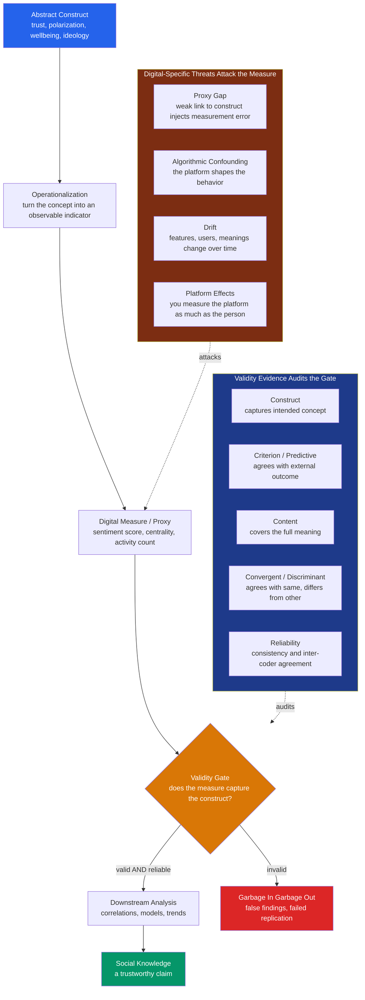

# 🌡️ Measurement and Validity in Digital Data

> [!abstract] TL;DR
> The deepest problem in computational social science is not *getting* data — it is knowing what the data **mean**. Digital traces (clicks, posts, mobility, network ties) hand researchers billions of numbers, but a number becomes a **measurement** only once you have shown it validly captures the abstract **construct** you care about (opinion, wellbeing, ideology, status, trust). This is the discipline of **operationalization** and **validity** — especially **construct validity**. Digital measures are almost always unvalidated **proxies** whose gap from the construct injects biasing **measurement error** (attenuating relationships, or fabricating spurious ones), and they face two threats unique to digital data: **algorithmic confounding** (the platform's algorithm shapes the very behavior you observe, so you measure the platform as much as the person) and **drift** (platforms, populations, and meanings shift, turning artifacts into apparent trends — as Google Flu Trends' collapse showed). Because a measure can be perfectly reliable yet completely invalid, and because no downstream analysis fixes a bad measure, validated measurement is the unglamorous foundation that separates credible CSS from data-dredging.

---

## Intuition

**Analogy:** A thermometer that reads "72" tells you the temperature — but *only* because someone painstakingly validated that the height of the mercury column **corresponds** to heat. The number is trustworthy because a chain of calibration links it to the thing it claims to measure. Now suppose you tried to measure a person's **happiness** by counting their smiling emojis. Does emoji-count really measure happiness? Or does it measure how *performative* they are, which *platform* they use, whether the app's autocomplete *suggested* that emoji, or how the ranking algorithm rewards upbeat posts? Digital data hands social scientists billions of numbers, but **a number is not a measurement until you have shown it validly captures the concept you care about.**

The move from "temperature" to "happiness" is the whole story. Temperature is physical and its instrument is calibrated against a fixed standard. Happiness is an abstract **construct** with no meter — so we substitute a convenient **proxy** and quietly *hope* the correspondence holds. Computational social science lives entirely in that hope, and the discipline of the field is refusing to take it on faith.

---

## How It Works

### Core mechanics

Social science studies **constructs** — abstract, unobservable concepts like *trust*, *polarization*, *wellbeing*, *ideology*, or *social status*. You cannot point at polarization the way you point at a rock. So every empirical study performs **operationalization**: it turns a construct into a concrete, observable **measure** (a survey scale, or a digital proxy such as a sentiment score, a network-centrality value, or an activity count). The distance between the construct and the measure is exactly where **validity** lives, and every digital measure embeds an operationalization — usually one nobody wrote down.

**Validity** is the argument that a measure captures its intended construct. Psychometrics gives a toolkit:

1. **Construct validity** — does the measure actually capture the intended concept? This is the master question; everything else is evidence for it.
2. **Criterion / predictive validity** — does the measure correlate with an external criterion or predict what it should (does a "civic-engagement" proxy predict actual turnout)?
3. **Content validity** — does the measure cover the concept's *full* meaning, or only a convenient slice?
4. **Convergent / discriminant validity** — does it agree with other measures of the *same* construct, and *differ* from measures of *other* constructs?
5. **Face validity** — does it merely *seem* reasonable? The weakest and most seductive form.

**Reliability is not validity.** Reliability is *consistency*: does the measure return the same value on repetition, and do human coders agree (inter-coder reliability, quantified with **Krippendorff's alpha** for text)? A measure can be highly **reliable yet invalid** — a precise, repeatable proxy for the *wrong* construct, like a scale that always reads exactly 5 kg too high. Reliability is necessary but never sufficient; it only caps how valid a measure can be.

The **proxy gap** is the pervasive digital failure mode. A "like" is a proxy for approval, a tweet for opinion, phone mobility for sociability. The link is often weak, unvalidated, or context-dependent. Formally this is the **errors-in-variables** problem: when your proxy is `construct + error`, regressing an outcome on the proxy **attenuates** the estimated relationship toward zero. Worse, if the measurement error is *correlated* with another variable (differential error), it can manufacture **spurious findings** that no amount of clever modeling will remove.

Two threats are distinctively digital:

- **Algorithmic confounding** — the platform's recommendation and ranking algorithm curates what people see, click, and do, so an observed behavior reflects the **algorithm as much as the person**. You are partly measuring the platform, not the user. As Salganik puts it, you cannot measure human behavior on a platform independently of the platform's influence on it.
- **Drift** — digital measures are **moving targets**. Platforms change features and algorithms, user populations shift, slang and emoji meanings evolve. A measure valid today can be invalid tomorrow, and an apparent "trend" may be pure **measurement drift**, not social change. The cautionary classic is **Google Flu Trends**: its flu estimates degraded badly as search behavior and Google's own algorithm changed — "big data hubris."

The remedy is **validation**: check the measure against a **gold standard** (a human-coded ground-truth subset), **calibrate** and correct for measurement error, **triangulate** across multiple measures and data sources, ground digital traces with **surveys**, report reliability and validity metrics, and **preregister** measurement decisions so the construct-measure gap is transparent rather than buried.

### The framework: from concept to trustworthy measure



---

## Key Concepts

### Secondary (intuition level)

- **Construct vs measure.** The *thing you care about* (happiness) is not the *thing you can count* (emoji). Measurement is the bridge between them.
- **A number is not a measurement.** Data abundance is not knowledge. Counting is easy; knowing what the count *means* is the hard part.
- **Reliable is not the same as valid.** A watch stuck 10 minutes fast is perfectly *consistent* (reliable) and perfectly *wrong* (invalid). Consistency feels like accuracy, which is exactly why reliable-but-wrong measures are dangerous.
- **Garbage in, garbage out.** No clever analysis fixes a bad measure — if the input does not mean what you think, neither does the output.

### Undergraduate (mechanics)

- **Operationalization** turns an abstract construct into a concrete indicator. Every digital measure embeds one, usually implicit and unexamined ("we used tweet counts as a measure of political interest").
- **The validity toolkit** (from psychometrics, applied to digital measures): construct, criterion/predictive, content, convergent/discriminant, and face validity. Construct validity is the central question; the others supply evidence for it. See [[Reliability_and_Validity]] for the full psychometric treatment.
- **Reliability for text-as-data** is quantified with **inter-coder reliability** — Krippendorff's alpha or Cohen's kappa — which correct agreement for chance. Report it before you trust any hand-coded or classifier-coded variable.
- **The proxy gap and attenuation.** With a proxy `P = W + u` (true construct plus error), the naive regression slope of an outcome on `P` is shrunk by the **reliability** factor `Var(W) / Var(P)`. This is the **errors-in-variables** result; it *attenuates* correlations, making real effects look weaker. See [[Regression_and_Correlation]].
- **Google Flu Trends** is the canonical failure: an unvalidated search-based proxy that drifted out of calibration and over-predicted flu, a textbook lesson in the fragility of unvalidated digital measures over time.
- **Text-as-data caveats.** A sentiment classifier trained on product reviews may not validly measure *political* emotion; sarcasm, context, and ambiguity break naive lexicon methods. Always validate the NLP measure against human coding.

### Graduate (frontier and formal)

- **Correlated (differential) measurement error** is the truly dangerous case. Classical (random) error only attenuates; error *correlated with a covariate or with the outcome* can create entirely **spurious** associations and reverse signs. Non-differential error weakens; differential error deceives.
- **Algorithmic confounding as an identification problem** (Salganik, *Bit by Bit*). Because the platform's algorithm is an unobserved treatment that shapes observed behavior, the behavior is not a clean readout of the person. You cannot, in general, identify the user-level construct without modeling — or experimentally intervening on — the platform's influence.
- **Non-stationarity and drift.** Digital measurement instruments are **non-stationary**: the mapping from construct to measure changes over time as platforms, populations, and semantics evolve. Time series of digital measures conflate real social change with instrument change; distinguishing them requires anchoring points (e.g., repeated survey benchmarks or held-out gold standards across time).
- **Validation and correction strategies.** Validate against a gold-standard subset; estimate reliability and apply **attenuation correction**; **triangulate** with independent measures and data sources; use **survey-linked traces** (traces joined to validated survey responses) to ground the proxy; report validity/reliability; and **preregister** the operationalization to prevent measurement p-hacking. "Measure twice, cut once."
- **The stakes.** Invalid measurement undermines everything downstream, produces false findings and failed replications (the measurement analogue of the concerns in [[The_Replication_Crisis_and_Critiques_of_Behavioral_Economics]]), and erodes trust in the field. Valid measurement is precisely what makes big data *scientifically* useful — the difference between data science and social **science**.

> [!note] Companion notes in this Foundations section
> This note is the measurement backbone of the CSS foundations. It sits alongside the companion notes *Computational Social Science Overview* (the field's map), *Big Data and the Social Sciences* (why data abundance is not knowledge), *Digital Traces and Found Data* (where these numbers come from and their non-designed nature), *Text as Data in Social Science* and *Sentiment, Emotion, and Stance Analysis* (measuring meaning from language), and *Prediction and Machine Learning in Social Science* (where a *predictively* accurate model can still rest on an *invalid* measure).

---

## Python Demo

```python
# Measurement validity and its two signature failure modes in digital data:
#   (A) CONSTRUCT VALIDITY / PROXY GAP  -> measurement error attenuates a real
#       relationship (errors-in-variables), and validation against a gold
#       standard reveals the gap and lets us correct it.
#   (B) ALGORITHMIC CONFOUNDING / DRIFT -> a platform change produces a spurious
#       "trend" in the measure while the underlying construct never moves.
import numpy as np
import matplotlib.pyplot as plt

rng = np.random.default_rng(42)

# =====================================================================
# PART A: PROXY GAP -> ATTENUATION BIAS -> CORRECTION VIA GOLD STANDARD
# =====================================================================
N = 3000

# The latent SOCIAL CONSTRUCT we actually care about (e.g. true wellbeing),
# standardized. It is NEVER directly observed in the trace data.
W = rng.normal(0.0, 1.0, N)

# A REAL downstream relationship: an outcome truly driven by the construct
# (e.g. a validated survey life-satisfaction score).
beta_true = 1.0
Y = beta_true * W + rng.normal(0.0, 1.0, N)

# The DIGITAL PROXY (e.g. an emoji / sentiment score). It equals the construct
# PLUS measurement error -> the classical errors-in-variables setup.
sigma_u = 1.2                                  # size of the proxy gap
P = W + rng.normal(0.0, sigma_u, N)            # proxy = construct + noise

# Reliability of the proxy = signal share = Var(W) / Var(P).
reliability = np.var(W) / np.var(P)
r_PW = np.corrcoef(P, W)[0, 1]                 # validity coefficient

# NAIVE analysis: treat the proxy AS IF it were the construct.
slope_proxy = np.cov(P, Y, bias=True)[0, 1] / np.var(P)

# VALIDATION: hand-code a small gold-standard subset (expensive), which lets us
# estimate reliability and apply the attenuation correction slope / reliability.
n_gold = 250
idx = rng.choice(N, n_gold, replace=False)
rel_hat = np.corrcoef(P[idx], W[idx])[0, 1] ** 2
slope_corrected = slope_proxy / rel_hat

print(f"proxy-construct correlation (validity coeff): {r_PW:.2f}")
print(f"reliability (signal share of proxy variance): {reliability:.2f}")
print(f"true slope:              {beta_true:.2f}")
print(f"naive slope on PROXY:    {slope_proxy:.2f}  <- attenuated toward zero")
print(f"attenuation-corrected:   {slope_corrected:.2f}  <- gold standard recovers it")

# =====================================================================
# PART B: ALGORITHMIC CONFOUNDING / DRIFT -> ARTIFACTUAL TREND
# =====================================================================
T = 120                                        # e.g. weeks of observation
t = np.arange(T)

# The TRUE population construct is FLAT -> there is NO real social change.
true_level = np.zeros(T)

# But the MEASURE drifts, for reasons that have nothing to do with people:
#   - slow drift: slang / emoji meaning shift + user-population turnover
#   - a sharp jump at week 60: a recommendation-algorithm update that amplifies
#     upbeat content, mechanically inflating the observed sentiment proxy.
slow_drift = 0.006 * t
algo_update = np.where(t >= 60, 0.6, 0.0)
observed_measure = true_level + slow_drift + algo_update + rng.normal(0, 0.05, T)

# =====================================================================
# PLOTS
# =====================================================================
fig, ax = plt.subplots(1, 3, figsize=(16, 4.6))

# (1) Proxy vs construct: the gap made visible.
ax[0].scatter(W, P, s=6, alpha=0.25, color="#2563eb")
lim = [-4, 4]
ax[0].plot(lim, lim, "k--", lw=1, label="perfect measure (P = W)")
ax[0].set_xlim(lim); ax[0].set_ylim(lim)
ax[0].set_xlabel("True construct  W  (gold standard)")
ax[0].set_ylabel("Digital proxy  P")
ax[0].set_title(f"(A) Proxy gap\nvalidity r = {r_PW:.2f},  reliability = {reliability:.2f}")
ax[0].legend(loc="upper left", fontsize=8)

# (2) Attenuation: the naive estimate is biased; validation recovers the truth.
bars = ["True\nslope", "Naive on\nproxy", "Corrected via\ngold standard"]
vals = [beta_true, slope_proxy, slope_corrected]
colors = ["#059669", "#dc2626", "#7c3aed"]
ax[1].bar(bars, vals, color=colors)
ax[1].axhline(beta_true, color="#059669", ls="--", lw=1)
for i, v in enumerate(vals):
    ax[1].text(i, v + 0.02, f"{v:.2f}", ha="center", fontsize=10)
ax[1].set_ylabel("Estimated effect of construct on outcome")
ax[1].set_title("(A) Measurement error\nattenuates the estimate")

# (3) Drift: a flat construct, a trending measure -> an artifact.
ax[2].plot(t, observed_measure, color="#dc2626", lw=1.8, label="Observed digital measure")
ax[2].plot(t, true_level, color="#059669", lw=2, ls="--", label="True construct (flat)")
ax[2].axvline(60, color="#334155", ls=":", lw=1.2)
ax[2].text(61, -0.15, "algorithm update", fontsize=8, color="#334155")
ax[2].set_xlabel("Time (weeks)")
ax[2].set_ylabel("Measure level")
ax[2].set_title("(B) Algorithmic confounding / drift\napparent 'trend' is an artifact")
ax[2].legend(loc="upper left", fontsize=8)

plt.tight_layout()
plt.savefig("measurement_validity_digital_data.png", dpi=120)
plt.show()
```

**What the demo shows.** In Part A the proxy correlates only about `0.64` with the true construct (reliability near `0.41`), so the naive regression slope collapses from the true `1.0` to roughly `0.41` — a real relationship *attenuated* almost by half, purely from measurement error. Validating against a hand-coded gold-standard subset recovers the true slope via attenuation correction. In Part B the underlying construct is dead flat, yet the observed measure rises and then jumps at the algorithm update: a textbook **spurious trend** that a naive analyst would report as social change but is entirely an artifact of the instrument.

---

## Real-World Applications

- **Opinion and sentiment from social media.** Treating tweet sentiment as "public opinion" assumes the posting population, the platform's amplification, and the classifier all preserve the construct — usually untrue. Election "nowcasts" from Twitter volume have repeatedly failed validation against polls.
- **Wellbeing and mental health from digital traces.** Language-based wellbeing indices (e.g., from posts or search) require validation against clinical or survey measures; a linguistic proxy can track *performance of positivity* rather than felt wellbeing (compare [[Happiness_and_Wellbeing]]).
- **Polarization and ideology.** Ideal-point estimates from follow/retweet networks or roll-call-style behavioral data are powerful but measure *revealed platform behavior*, which the ranking algorithm partly authors — a construct-validity and algorithmic-confounding problem at once.
- **Mobility and economic activity.** Phone-location and satellite-nightlight proxies for sociability, migration, or GDP are only as good as their calibration against ground truth; population coverage biases and device turnover cause drift.
- **Any CSS pipeline turning traces into social variables.** Network centrality as "status," activity counts as "engagement," likes as "approval" — each is an operationalization whose validity is the make-or-break of the study.

---

## Common Pitfalls

- **Assuming the proxy IS the construct.** Naming a variable "opinion" or "wellbeing" does not make it one. The construct-measure gap must be argued, not assumed — that is the single most common CSS error.
- **Confusing reliability with validity.** A classifier with high inter-coder agreement or a stable metric feels trustworthy; consistency guarantees only that you are measuring the *same* thing, not the *right* thing.
- **Ignoring algorithmic confounding.** Analyzing on-platform behavior as if it were unmediated human behavior. The recommendation algorithm is an unmeasured confounder authoring the data.
- **Reading drift as trend.** Interpreting a rising measure as social change when it is instrument change (new features, population turnover, semantic shift). Google Flu Trends is the monument to this mistake.
- **Skipping gold-standard validation.** Never checking the machine-coded measure against human ground truth, so measurement error is invisible and uncorrected.
- **Non-differential-error complacency.** Assuming error is random (merely attenuating) when it is correlated with a covariate — differential error fabricates findings rather than just weakening them.
- **Transporting a validated measure.** A sentiment model validated on product reviews is not validated for political emotion; validity is construct-, population-, and context-specific.

---

## Related Concepts

- [[Reliability_and_Validity]] — the psychometric foundation this note applies to digital data: the true-score model, the reliability-caps-validity asymmetry, and the full validity typology.
- [[Sociological_Research_Methods]] — operationalization, measurement, and the positivist/interpretivist stances that frame what a valid social measure even is.
- [[Regression_and_Correlation]] — the errors-in-variables mechanism by which measurement error attenuates estimated relationships.
- [[Factor_Analysis_and_Test_Construction]] — how latent constructs are recovered from indicators and how factorial (construct) validity is established.
- [[The_Replication_Crisis_and_Critiques_of_Behavioral_Economics]] — invalid or noisy measurement as a driver of false findings and non-replication across the social sciences.
- [[Causal_Reasoning]] — measurement error and algorithmic confounding as threats that manufacture spurious associations and block clean identification.
- [[Scientific_Reasoning_and_Method]] — validation, calibration, and preregistration as the methodological discipline behind trustworthy measurement.
- [[Classification_Metrics]] — evaluating a text/sentiment classifier against a gold-standard labeled set, the operational core of validating a computed measure.
- [[The_WEIRD_Problem]] — population validity: whose digital traces you observe determines what your measure can generalize to.
- [[Digital_Society_and_Online_Communities]] — the platforms that both generate the traces and, through their algorithms, shape them.

---

## Review Questions

1. **(Conceptual)** Distinguish reliability from validity, then construct a concrete example of a digital measure that is highly *reliable* yet *invalid*. Why is this combination especially dangerous in practice?
2. **(Applied scenario)** A team reports that national "public happiness" rose sharply after March, based on the mean sentiment of geotagged posts. Before you believe it, list three measurement-validity checks you would demand, and explain how algorithmic confounding and drift could each fully explain the "increase" with no change in actual happiness.
3. **(Trade-off / formal)** You can either (a) run a large-N unvalidated proxy analysis, or (b) hand-validate a small gold-standard subset and apply an attenuation correction. Under classical (random) measurement error, what does each buy you? Now suppose the error is *correlated* with your key covariate — which strategy is salvageable, and why does the correlated-error case change the answer?

---

## Sources

- Salganik, M.J. (2018). *Bit by Bit: Social Research in the Digital Age*. Princeton University Press — esp. Ch. 2 on observing behavior, algorithmic confounding, drift, and system-driftedness.
- Lazer, D., Kennedy, R., King, G., & Vespignani, A. (2014). "The Parable of Google Flu: Traps in Big Data Analysis." *Science*, 343(6176), 1203–1205.
- Sen, I., Flöck, F., Weller, K., Weiß, B., & Wagner, C. (2021). "A Total Error Framework for Digital Traces of Human Behavior on Online Platforms." *Public Opinion Quarterly*, 85(S1), 399–422.
- Grimmer, J., Roberts, M.E., & Stewart, B.M. (2022). *Text as Data: A New Framework for Machine Learning and the Social Sciences*. Princeton University Press — on validating computed text measures.
- Messick, S. (1995). "Validity of Psychological Assessment." *American Psychologist*, 50(9), 741–749 — the unified, construct-centered theory of validity.

---

#computational-social-science #measurement #validity #construct-validity #algorithmic-confounding
