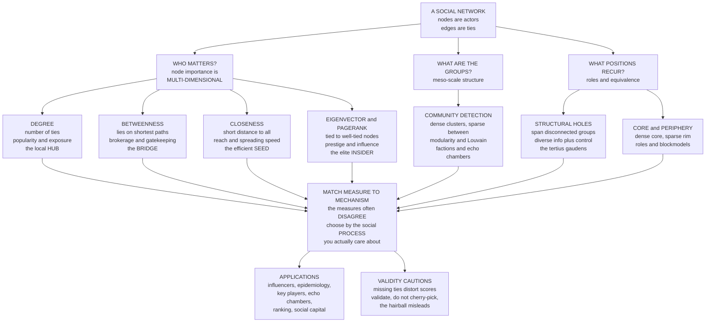

# 🕸️ Centrality, Community, and Structure

> [!abstract] TL;DR
> **Centrality** and **community detection** are the core tools of social network analysis for finding *what matters* in a web of relationships — but "importance" is **multi-dimensional**. **Degree** centrality counts ties (popularity, direct exposure — the hub); **betweenness** counts shortest paths that run through you (brokerage and control of flow — the bridge, whose removal fragments the network); **closeness** measures short distance to everyone (reach and spreading efficiency — the fast seed); and **eigenvector centrality / PageRank** rewards being tied to *well-tied* others (prestige and influence through influential contacts — the elite insider). These measures often **disagree** — a high-betweenness broker may have low degree — so the *right* one depends on the **social process** you care about (finding influencers, seeding a disease intervention, identifying gatekeepers and vulnerabilities). Actors who span **structural holes** between otherwise-disconnected groups (Burt) gain informational and control advantages — a key source of **social capital** and innovation. Beyond nodes, **community detection** (modularity, Louvain) finds the **cohesive groups** — friend circles, factions, echo chambers — that structure social life, while **core-periphery**, **structural equivalence**, and **assortativity** round out the structural vocabulary. Powerful across marketing, epidemiology, security, organizations, and online polarization, these measures nonetheless demand **careful, validated, question-driven** use, because they are acutely sensitive to incomplete network data and easy to misinterpret.

---

## Intuition

**Analogy:** Who is the most *important* person in a social network? Pause on the question, because it has no single answer — it depends entirely on what you mean by "important."

- Is it the person with the **most friends** — the popular, well-connected **hub** everyone knows?
- Is it the person who **bridges otherwise-separate groups** — the **broker** who sits between the marketing team and engineering, controlling what information flows across the gap and quietly profiting from the position?
- Is it the person connected to **other well-connected people** — the **insider** whose prestige comes not from having many contacts but from having the *right* ones, an elite embedded among elites?
- Or is it the person who can **reach everyone fastest** — the **efficient spreader**, the ideal patient zero if you wanted to seed a rumor or a vaccine to the whole network in the fewest hops?

Each of these is a *different kind of central*, measured a different way, and each is the right answer to a different question — from finding influencers for a marketing campaign, to targeting a disease intervention, to identifying the kingpin of a criminal network. **"Importance" in a network is not one thing.** The mistake is to reach for a single number; the skill is to match the *measure* to the *mechanism* you actually care about. Zoom out from individuals and a second question appears: the network is not a uniform mesh but a landscape of **cohesive clumps** — tightly-knit circles loosely joined to one another. Finding those clumps is **community detection**, and it reveals the factions, friend groups, and echo chambers that give a society its shape.

This note is the **computational social science** treatment — centrality and communities as *substantive social measurement*. For the formal graph-theoretic and algorithmic machinery (Perron–Frobenius, power iteration, the Google matrix, spectral partitioning, the resolution limit), see the systems-thinking companion [[Centrality_and_Community_Structure]].

---

## How It Works

Social network analysis represents actors as **nodes** and relationships as **edges**, then asks structural questions at three levels: *which nodes matter* (centrality), *what groups exist* (community detection), and *what positions or roles recur* (core-periphery, equivalence). The foundational representation and graph statistics are the subject of the forthcoming *Social_Network_Analysis_Foundations*; here we assume a graph and interrogate its structure.

### The four classic centralities — four notions of "who matters?"

Each centrality encodes an implicit theory of **how things move** on the network (Borgatti), so each answers a different substantive question.

1. **Degree centrality — POPULARITY / direct connectedness.** Simply the number of ties, $C_D(i)=\sum_j A_{ij}$. It is *local* and cheap, capturing immediate influence and exposure: a high-degree **hub** is directly connected to many others, so it both reaches and is reached by many in one step. Good for questions of direct popularity, activity, and first-order exposure — but blind to the *quality* of those ties (a hub connected only to isolates scores the same as one connected to other hubs).

2. **Betweenness centrality — BROKERAGE / control of flow.** How often a node lies on the **shortest paths** between other pairs, $C_B(i)=\sum_{s\ne i\ne t}\frac{\sigma_{st}(i)}{\sigma_{st}}$. This finds **bridges and gatekeepers**: nodes that sit *between* groups and therefore control what passes between them. A betweenness champion can have *low degree* — a single broker linking two dense clusters touches few people but every cross-group path routes through it. Betweenness also flags **vulnerabilities**: remove high-betweenness nodes and the network fragments. The right measure when you care about *control, gatekeeping, and structural bottlenecks*.

3. **Closeness centrality — REACH / spreading efficiency.** The inverse of average shortest-path distance to all others, $C_C(i)=\frac{n-1}{\sum_j d(i,j)}$. A node with small total distance sits at the network's "center of gravity" and can **reach the whole network in few hops** — the ideal **spreader or receiver**. The right measure when the question is *how quickly can this actor diffuse or acquire something* — seeding information, targeting a disease intervention for maximal reach.

4. **Eigenvector centrality / PageRank — PRESTIGE / influence via influential contacts.** A *recursive* notion: your score is proportional to the sum of your neighbors' scores, $x_i=\frac{1}{\lambda}\sum_j A_{ij}x_j$, i.e. the dominant eigenvector of the adjacency matrix. **It's not how many you know, but *who* you know** — being tied to well-connected nodes lifts your score. **PageRank** is Google's directed-graph, random-walk variant, adding a teleport term so score cannot pool in dead-ends; it ranks the web (and citations) by exactly this "prestige through prestigious links" logic. The right measure for *prestige, status, and influence that propagates through the network*.

### Which centrality for which question — matching measure to mechanism

| Question / social process | Best measure | Why |
|---|---|---|
| Direct popularity, first-order exposure | **Degree** | Immediate, local reach |
| Finding brokers, gatekeepers, bridges; network vulnerabilities | **Betweenness** | Control over flow between groups |
| Efficient spreaders; disease/information seeding | **Closeness** | Fewest hops to reach everyone |
| Prestige, status, influence-through-influential-ties; ranking | **Eigenvector / PageRank** | Quality, not quantity, of connections |

The measures **often disagree**, and that disagreement is the *point*: a high-betweenness broker may sit at low degree; a high-eigenvector insider may broker nothing. Choosing well means asking *what flows, and how* — and the wrong measure for the wrong flow (betweenness for something that diffuses randomly, say) surfaces the wrong "important" nodes.

### Brokerage and structural holes

Betweenness has a rich sociological interpretation. Ronald **Burt's structural holes** theory holds that actors who **bridge otherwise-disconnected groups** — spanning a "hole" in the social structure — gain **advantage**: access to *diverse, non-redundant information* (because the groups they connect know different things) and *control* over the flows between those groups (the **tertius gaudens** — "the third who benefits"). Brokerage is thus a source of **social capital**, **innovation** (recombining ideas across groups), and **power**. This is the structural expression of Granovetter's insight — the subject of the forthcoming *The_Strength_of_Weak_Ties_and_Social_Capital* — that weak, *bridging* ties carry more novel information than strong, redundant *bonding* ties. See also [[Social_Capital_and_Trust]] for closure-versus-brokerage as two contrasting sources of advantage.

### Community detection — finding cohesive groups

Real social networks are **modular**: dense clusters of nodes tightly connected internally but loosely connected between them. **Community detection** finds these groups. The workhorse is **modularity** $Q$ (Newman–Girvan) — the fraction of edges *inside* communities minus the fraction *expected by chance* under a degree-preserving null model; $Q\approx 0$ means no better than random, higher $Q$ means strong community structure. Algorithms include the **Girvan–Newman** divisive method (peel highest-betweenness edges), **spectral** partitioning (eigenvectors of the graph Laplacian), and — the scalable standard for million-node graphs — the **Louvain** method (greedy modularity maximization), with its successor **Leiden**. Communities reveal **meaningful social groups**: friend circles, political factions, echo chambers, and functional modules. But community detection carries real **validity challenges** — the **resolution limit** (modularity hides communities smaller than roughly $\sqrt{2m}$ edges), **overlapping** memberships (a person belongs to family, work, *and* hobby groups at once), and the absence of ground truth (the algorithm always returns *some* partition, even on random noise).

### Other structural patterns

Beyond centrality and community lies a richer structural vocabulary:

- **Core-periphery** — a dense, cohesive **core** surrounded by a sparse **periphery**, common in trade, elite, and organizational networks.
- **Structural equivalence and roles** — nodes with *similar tie patterns* play similar **roles** even if not connected to each other (all the "managers," all the "peripheral" newcomers); **blockmodeling** groups nodes by role rather than cohesion.
- **Assortativity / mixing (homophily)** — do similar nodes connect to each other? Assortative mixing on an attribute is the network signature of **homophily** — the subject of the forthcoming *Homophily_Selection_and_Influence*, which untangles it from social influence.
- **Motifs** — recurring small subgraphs (triangles, feed-forward loops) whose over-representation signals building blocks of the structure.

### Computing on large networks

At CSS scale — million- or billion-node online platforms (the domain of the forthcoming *Online_Social_Networks_and_Platforms*) — exact computation becomes the bottleneck. **Betweenness is $O(nm)$** (Brandes' algorithm) and infeasible on huge graphs, so the field relies on **approximation and sampling** (pivot-based estimators), **efficient parallel/distributed** algorithms, and scalable near-linear community detection (Louvain/Leiden). Matching measure to mechanism must be balanced against what is *computable*.

### The structure of the questions, in one picture



---

## Key Concepts

### Secondary Level

**Centrality is a score for how important a person is in a network — but there is more than one kind of important.**

- **Degree** = how many friends you have. The **popular hub**.
- **Betweenness** = how often you are the *bridge* connecting groups that otherwise could not reach each other. The **broker** who controls the gossip between two friend circles. Remove them and the groups fall apart.
- **Closeness** = how *quickly* you can reach everyone. The best person to start a rumor if you want it everywhere fast.
- **Eigenvector / PageRank** = it's not how many people you know, it's *who* you know. You are important if *important* people are your friends. This is the idea Google used to rank web pages.

These can disagree: a shy person with only two friends can be the single bridge between two big groups — low degree, huge betweenness. **Community detection** is the other big idea: finding the *clusters* — the friend groups, cliques, and factions — hidden in the network.

### Undergraduate Level

**Centrality as competing operationalizations of "importance."** Freeman (1978) formalized degree, betweenness, and closeness as three conceptually distinct centralities, later joined by eigenvector centrality and its PageRank cousin. Each rests on a different **flow assumption** (Borgatti 2005): betweenness and closeness assume things travel along *shortest paths*; eigenvector and PageRank assume a *random walk*; degree assumes *parallel duplication*. Using a centrality whose flow model mismatches your actual process gives misleading rankings.

**Brokerage and structural holes.** Burt (1992) argued that spanning a **structural hole** — being the only tie between two dense clusters — is a source of advantage: you get *non-redundant* information from both sides and can broker (or block) exchange between them. This reframes betweenness as **social capital**. It contrasts with **network closure** (Coleman): dense, redundant ties build trust and enforce norms. Bridging (weak) ties bring *novelty*; bonding (strong) ties bring *support* — two different kinds of value.

**Community detection and modularity.** A **community** is a group with more internal edges than expected by chance. **Modularity** $Q=\frac{1}{2m}\sum_{ij}\big(A_{ij}-\frac{k_ik_j}{2m}\big)\delta(c_i,c_j)$ scores a partition against a degree-preserving null model. **Louvain** greedily maximizes $Q$ and scales to millions of nodes; **Girvan–Newman** removes high-betweenness "bridge" edges. Communities recover real groups — the canonical demonstration is **Zachary's karate club**, where community detection predicts the *actual* faction split that occurred when the club fractured.

**Other structure.** **Core-periphery** models split nodes into a dense core and sparse periphery. **Structural equivalence** groups nodes by similar *tie patterns* (role) rather than by cohesion. **Assortativity** measures whether similar nodes connect (the network fingerprint of homophily).

### Graduate Level

**Choosing a centrality is choosing a model of the social process.** Borgatti's typology maps each measure to (a) the *trajectory* things follow (geodesics, paths, trails, walks) and (b) the *mechanism* of spread (duplication vs transfer, serial vs parallel). Betweenness is optimal for *indivisible goods transferred along shortest paths* (a package, a secret handed hand-to-hand); it is *wrong* for a virus that diffuses along all paths via random walks, where a random-walk betweenness or eigenvector measure fits better. The methodological error is to compute betweenness reflexively and interpret it as generic "importance."

**Structural holes vs closure — the recurring debate.** Burt's brokerage advantage is contingent: it accrues to individuals and to *creative/innovative* tasks (recombining distant knowledge), while closure's trust and norm-enforcement dominate where *coordination and reliability* matter. Aral and Van Alstyne's "diversity–bandwidth tradeoff" complicates the picture: bridging ties carry diverse information but *lower bandwidth*, so under high churn, strong ties can deliver more *novelty per unit time* than the structural-holes account predicts. Brokerage is an advantage *conditional on the task, the tie strength, and the information environment*.

**Validity and inference in community detection.** Modularity maximization has deep pathologies: the **resolution limit** (Fortunato–Barthélemy) merges communities below $\sqrt{2m}$ edges; *maximum* $Q$ is NP-hard, so heuristics report degenerate local optima (many near-optimal, structurally different partitions — the "modularity landscape" is glassy); and high $Q$ appears even in **random graphs**, so a community structure must be tested for **significance** against a configuration-model null before it is believed. Principled alternatives — **stochastic block models (SBMs)** and their degree-corrected/mixed-membership variants — recast community detection as *statistical inference* with model selection (via minimum description length), separating genuine structure from noise and admitting overlap.

**Sensitivity to network data.** Centrality is *not robust* to measurement error. **Missing edges** systematically distort centrality — betweenness and closeness are especially fragile, since a single unobserved shortcut can collapse computed distances — and boundary specification (who counts as "in" the network) can invert rankings. Because CSS networks are built from **incomplete, biased digital traces** (the theme of [[Big_Data_and_the_Social_Sciences]]), reported centralities inherit that bias: a "central" account may be an artifact of which ties the platform API happened to expose. Rigorous SNA reports sensitivity analyses, not point estimates presented as ground truth.

---

## Python Demo

```python
import numpy as np
import matplotlib
matplotlib.use("Agg")
import matplotlib.pyplot as plt
from collections import deque

# =====================================================================
# CENTRALITY + COMMUNITY on a structured social network (numpy + matplotlib).
# We build a graph ENGINEERED so the four classic centralities DISAGREE:
#   - Community A: a STAR around a HUB (node 0) -> dominates DEGREE, but its
#                  leaves are low-degree, so the hub's EIGENVECTOR is modest.
#   - Community B: a near-CLIQUE (nodes 12..21) -> members are tied to other
#                  well-tied members, so B nodes dominate EIGENVECTOR (prestige).
#   - A low-degree BROKER (node 22) is the ONLY link between A and B ->
#                  dominates BETWEENNESS (every cross-group path routes through
#                  it) while having tiny degree. A high-betweenness bridge.
# Then we DETECT COMMUNITIES (spectral / Fiedler bisection) and score modularity.
# networkx is used ONLY for a nicer layout if present; all analysis is pure numpy.
# =====================================================================
rng = np.random.default_rng(7)

# ---------------------------------------------------------------------
# 1. BUILD THE NETWORK as an adjacency matrix.
# ---------------------------------------------------------------------
N_A, N_B = 12, 10               # A: nodes 0..11 (0 = hub) ; B: nodes 12..21
BROKER = 22
N = N_A + N_B + 1               # 23 nodes
A = np.zeros((N, N))

def link(i, j):
    A[i, j] = A[j, i] = 1.0

# Community A: a star (hub 0 -> all others) + a few extra intra-A edges.
for j in range(1, N_A):
    link(0, j)
for (i, j) in [(1, 2), (3, 4), (5, 6), (7, 8), (9, 10)]:
    link(i, j)

# Community B: a dense near-clique (adds strong mutual reinforcement).
B = list(range(N_A, N_A + N_B))
for a_idx in range(len(B)):
    for b_idx in range(a_idx + 1, len(B)):
        if rng.random() < 0.9:          # ~90% of pairs -> near-clique
            link(B[a_idx], B[b_idx])

# The BROKER: the ONLY bridge between A and B. 2 ties into each side ->
# low degree (4) but every A<->B shortest path is forced through it.
for j in (5, 6):                        # gateways on the A side
    link(BROKER, j)
for j in (12, 13):                      # gateways on the B side
    link(BROKER, j)

# ---------------------------------------------------------------------
# 2. FOUR CENTRALITIES, from scratch.
# ---------------------------------------------------------------------
adj = [np.where(A[i] > 0)[0] for i in range(N)]

def degree_centrality(A):
    return A.sum(axis=1)

def closeness_centrality(A):
    C = np.zeros(N)
    for s in range(N):
        dist = -np.ones(N); dist[s] = 0
        q = deque([s])
        while q:
            v = q.popleft()
            for w in adj[v]:
                if dist[w] < 0:
                    dist[w] = dist[v] + 1
                    q.append(w)
        reach = dist[dist > 0]
        if reach.size:
            C[s] = reach.size / reach.sum()      # (n_reachable) / (sum distances)
    return C

def betweenness_centrality(A):                    # Brandes' algorithm
    CB = np.zeros(N)
    for s in range(N):
        S, P = [], [[] for _ in range(N)]
        sigma = np.zeros(N); sigma[s] = 1.0
        dist = -np.ones(N); dist[s] = 0
        q = deque([s])
        while q:
            v = q.popleft(); S.append(v)
            for w in adj[v]:
                if dist[w] < 0:
                    dist[w] = dist[v] + 1
                    q.append(w)
                if dist[w] == dist[v] + 1:
                    sigma[w] += sigma[v]
                    P[w].append(v)
        delta = np.zeros(N)
        while S:
            w = S.pop()
            for v in P[w]:
                delta[v] += (sigma[v] / sigma[w]) * (1 + delta[w])
            if w != s:
                CB[w] += delta[w]
    return CB / 2.0                               # undirected -> each pair counted twice

def eigenvector_centrality(A, iters=2000, tol=1e-12):
    x = np.ones(N) / np.sqrt(N)                    # positive start (Perron-Frobenius)
    for _ in range(iters):
        y = A @ x
        lam = np.linalg.norm(y)
        y = y / lam
        if np.linalg.norm(y - x) < tol:
            x = y; break
        x = y
    return x

deg = degree_centrality(A)
clo = closeness_centrality(A)
bet = betweenness_centrality(A)
eig = eigenvector_centrality(A)

champ = {"degree": int(np.argmax(deg)), "betweenness": int(np.argmax(bet)),
         "closeness": int(np.argmax(clo)), "eigenvector": int(np.argmax(eig))}

# ---------------------------------------------------------------------
# 3. COMMUNITY DETECTION: spectral (Fiedler) bisection + modularity Q.
# ---------------------------------------------------------------------
Dg = np.diag(deg)
L = Dg - A                                         # graph Laplacian
evals, evecs = np.linalg.eigh(L)
order = np.argsort(evals)
fiedler = evecs[:, order[1]]                        # 2nd-smallest eigenvector
comm = (fiedler > 0).astype(int)                    # sign split -> two communities

def modularity(A, comm):
    m = A.sum() / 2.0
    k = A.sum(axis=1)
    Q = 0.0
    for c in np.unique(comm):
        idx = np.where(comm == c)[0]
        for i in idx:
            for j in idx:
                Q += A[i, j] - k[i] * k[j] / (2 * m)
    return Q / (2 * m)

Q = modularity(A, comm)

# planted ground truth (broker excluded) -> recovery accuracy
planted = np.array([0] * N_A + [1] * N_B + [-1])
mask = planted >= 0
agree = (comm[mask] == planted[mask]).mean()
recovery = max(agree, 1 - agree)

# ---------------------------------------------------------------------
# 4. LAYOUT (networkx spring if available, else spectral + jitter).
# ---------------------------------------------------------------------
try:
    import networkx as nx
    G = nx.from_numpy_array(A)
    pos = np.array([nx.spring_layout(G, seed=3, k=0.9)[i] for i in range(N)])
    backend = "networkx spring_layout"
except Exception:
    pos = evecs[:, order[1:3]].copy()
    pos = pos + 0.03 * rng.standard_normal(pos.shape)   # jitter clique overlap
    backend = "spectral layout (numpy)"

# ------------------------------- REPORT --------------------------------
print("=" * 66)
print("CENTRALITY, COMMUNITY, AND STRUCTURE")
print("=" * 66)
print(f"network: {N} nodes, {int(A.sum() // 2)} edges | layout: {backend}")
print("-" * 66)
print(f"{'measure':>14} {'champion node':>14} {'interpretation':>28}")
print(f"{'degree':>14} {champ['degree']:>14} {'the popular HUB (community A)':>28}")
print(f"{'betweenness':>14} {champ['betweenness']:>14} {'the low-degree BROKER':>28}")
print(f"{'closeness':>14} {champ['closeness']:>14} {'the efficient SPREADER':>28}")
print(f"{'eigenvector':>14} {champ['eigenvector']:>14} {'the prestige INSIDER (B)':>28}")
print("-" * 66)
print(f"broker (node {BROKER}) degree = {int(deg[BROKER])} "
      f"but betweenness rank = #{1 + int((bet > bet[BROKER]).sum())}")
print(f"community detection: 2 groups, modularity Q = {Q:.3f}, "
      f"planted-group recovery = {recovery:.0%}")
print(f"=> DIFFERENT measures crown DIFFERENT nodes: importance is multi-dimensional")

# ------------------------------- FIGURE --------------------------------
def draw(ax, values, title, cmap, star=None):
    for i in range(N):
        for j in range(i + 1, N):
            if A[i, j]:
                ax.plot([pos[i, 0], pos[j, 0]], [pos[i, 1], pos[j, 1]],
                        color="#d0d0d0", lw=0.5, zorder=1)
    v = np.asarray(values, float)
    vn = (v - v.min()) / (v.max() - v.min() + 1e-12)
    sc = ax.scatter(pos[:, 0], pos[:, 1], s=50 + 620 * vn, c=v, cmap=cmap,
                    edgecolors="black", linewidths=0.5, zorder=2)
    if star is not None:
        ax.scatter(pos[star, 0], pos[star, 1], s=900, facecolors="none",
                   edgecolors="#111111", linewidths=2.4, zorder=3)
        ax.annotate(f"node {star}", pos[star], textcoords="offset points",
                    xytext=(6, 8), fontsize=8, fontweight="bold")
    ax.set_title(title, fontsize=10); ax.set_xticks([]); ax.set_yticks([])
    return sc

fig, ax = plt.subplots(2, 3, figsize=(16, 10))
fig.suptitle("Centrality, community, and structure: four notions of importance "
             "often DISAGREE", fontsize=13, fontweight="bold")

draw(ax[0, 0], deg, "DEGREE centrality\npopularity / direct ties -> the HUB",
     "Blues", champ["degree"])
draw(ax[0, 1], bet, "BETWEENNESS centrality\nbrokerage / control -> the BRIDGE",
     "Reds", champ["betweenness"])
draw(ax[0, 2], clo, "CLOSENESS centrality\nreach / spreading speed -> the SEED",
     "Greens", champ["closeness"])
draw(ax[1, 0], eig, "EIGENVECTOR / PageRank\nprestige via ties -> the INSIDER",
     "Purples", champ["eigenvector"])

# Panel 5: community structure
axc = ax[1, 1]
palette = np.array(["#dc2626", "#2563eb"])
for i in range(N):
    for j in range(i + 1, N):
        if A[i, j]:
            axc.plot([pos[i, 0], pos[j, 0]], [pos[i, 1], pos[j, 1]],
                     color="#d0d0d0", lw=0.5, zorder=1)
axc.scatter(pos[:, 0], pos[:, 1], s=120, c=palette[comm], edgecolors="black",
            linewidths=0.5, zorder=2)
axc.set_title(f"COMMUNITY DETECTION (spectral)\nmodularity Q = {Q:.2f}  |  "
              f"recovery {recovery:.0%}", fontsize=10)
axc.set_xticks([]); axc.set_yticks([])

# Panel 6: the disagreement, as a grouped bar (measures min-max normalized)
axb = ax[1, 2]
focal = sorted({champ["degree"], champ["betweenness"], champ["eigenvector"]})
measures = {"degree": deg, "betweenness": bet, "closeness": clo, "eigenvector": eig}
norm = {k: (v - v.min()) / (v.max() - v.min() + 1e-12) for k, v in measures.items()}
xpos = np.arange(len(focal)); w = 0.2
mcolors = {"degree": "#2563eb", "betweenness": "#dc2626",
           "closeness": "#059669", "eigenvector": "#7c3aed"}
for m_i, (mname, mval) in enumerate(norm.items()):
    axb.bar(xpos + (m_i - 1.5) * w, [mval[f] for f in focal], w,
            label=mname, color=mcolors[mname], edgecolor="black", linewidth=0.4)
axb.set_xticks(xpos)
axb.set_xticklabels([f"node {f}\n({'hub' if f == champ['degree'] else 'broker' if f == champ['betweenness'] else 'insider'})"
                     for f in focal], fontsize=8)
axb.set_ylabel("centrality (min-max normalized)")
axb.set_title("Each 'central' node wins a DIFFERENT measure", fontsize=10)
axb.legend(fontsize=7, ncol=2); axb.grid(alpha=0.25, axis="y")

plt.tight_layout(rect=[0, 0, 1, 0.96])
plt.savefig("centrality_community_structure.png", dpi=110, bbox_inches="tight")
plt.show()
```

**What the demo shows:**

- **Panels 1–4 (the same network, four measures).** Node size and color encode **degree**, **betweenness**, **closeness**, and **eigenvector/PageRank** in turn, with the champion ringed. The point is visual and unambiguous: **different nodes light up under different measures.** The **hub** at the center of community A dominates *degree* (many direct ties) but not eigenvector; the low-degree **broker** — with only four ties — dominates *betweenness*, because it is the sole bridge every cross-group path must cross; and a node inside the dense **B clique** dominates *eigenvector centrality*, borrowing prestige from its well-connected neighbors. Importance is multi-dimensional.
- **Panel 5 (community detection).** Spectral (Fiedler) bisection partitions the network into two communities, recovering the planted star-cluster and clique with high accuracy and a healthy **modularity** $Q$. At scale this would be **Louvain/Leiden**; the idea is identical — dense-inside, sparse-between groups fall out of the structure.
- **Panel 6 (the disagreement, quantified).** A grouped bar chart of the four (normalized) centralities for the three focal nodes makes the crux explicit: the hub is tallest on degree, the broker on betweenness, the insider on eigenvector. **No single node is "the" central one** — which is exactly why the analyst must choose the measure that matches the social process in question.

---

## Real-World Applications

> **Influencer identification and viral marketing.** Finding the seed set whose adoption maximizes cascade size is a centrality problem — but *which* centrality depends on the diffusion model. Degree and eigenvector centrality flag popular, prestigious accounts; closeness flags efficient spreaders; and influence-maximization algorithms (Kempe–Kleinberg) show that the *combination* of well-placed seeds beats any single top-degree node. Behavior-change and public-health campaigns seed high-centrality actors to accelerate diffusion — connecting to [[Diffusion_of_Innovations_and_Adoption_Dynamics]] and the forthcoming *Contagion_and_Diffusion_in_Social_Networks*.

> **Epidemiology and targeted intervention.** Vaccinating or isolating high-centrality nodes fragments transmission networks far more efficiently than random targeting. The elegant **"acquaintance immunization"** strategy exploits the friendship paradox — vaccinate a *random person's random friend*, who is disproportionately a high-degree hub — to reach central nodes *without* mapping the whole network. Betweenness pinpoints the bridges whose removal isolates communities; closeness identifies the fastest potential spreaders to prioritize.

> **Key players in criminal and terrorist networks.** Intelligence analysis of covert networks uses centrality to find leaders, financiers, and — crucially — **brokers** whose removal maximally *fragments* the organization (high betweenness = single point of failure). The reanalysis of the 9/11 hijacker network (Krebs) is the canonical case; the lesson is that the operationally critical actor is often a low-visibility broker, not the highest-degree hub.

> **Organizational network analysis.** Firms map informal communication networks to find **hidden influencers** (high eigenvector centrality who are not on the org chart), **brokers** bridging silos (high betweenness — a source of innovation per Burt), and structural **silos** (over-strong communities that block cross-team flow). This operationalizes [[Social_Capital_and_Trust]] for management.

> **Echo chambers and online polarization.** Community detection on retweet, follow, and interaction graphs reveals **polarized clusters** — the "red" and "blue" communities of political social media — and quantifies their separation and the scarcity of bridging ties. This is the network signature of the phenomena treated in the forthcoming *Misinformation_Polarization_and_the_Online_Public_Sphere* and *Online_Social_Networks_and_Platforms*.

> **Ranking: PageRank for the web and beyond.** Google's original ranking *is* eigenvector centrality on the directed web graph (see [[Markov_Chains]] and [[Eigenvalues_and_Eigenvectors]]). The same "prestige via prestigious links" logic ranks academic citations, reputation systems, and — as *personalized PageRank* — recommends people and content.

> **Economic and systemic-risk networks.** Centrality identifies **too-central-to-fail** institutions whose distress propagates widely — see [[Financial_Networks_and_Systemic_Risk]] and [[Economic_Networks_and_Interaction_Structure]], where a bank's *systemic importance* is precisely a weighted centrality in the interbank network.

---

## Common Pitfalls

- **Treating one centrality as "the" centrality.** The single most common error. Degree, betweenness, closeness, and eigenvector rank nodes *differently* and can disagree wildly — a low-degree bridge is invisible to degree yet dominant in betweenness. Always match the measure to the **social process** (random walk vs shortest path vs broadcast). Reporting "the most central node" without saying *by which measure* is meaningless.
- **Cherry-picking the measure that supports your story.** Because measures disagree, an analyst can (consciously or not) pick whichever centrality makes their preferred actor "important." Pre-specify the measure *from the mechanism* before looking at results, and report multiple centralities so the reader can see the disagreement.
- **Garbage in: missing/biased ties distort everything.** Centrality is *not robust* to measurement error. A single unobserved edge can collapse computed shortest paths and rewrite betweenness and closeness rankings. Because CSS networks come from **incomplete, platform-biased digital traces** (see [[Big_Data_and_the_Social_Sciences]]), a "central" node may be an artifact of *which ties the data captured*, not of the real network. Run sensitivity analyses; do not present point estimates as truth.
- **Finding communities in random noise.** Community-detection algorithms *always* return a partition — even on a random graph, where modularity $Q$ can look impressively high. A detected community structure must be **tested for significance** against a configuration-model null (or fit via a stochastic block model) before it is believed. High $Q$ alone proves nothing.
- **The resolution limit and forced hard partitions.** Modularity maximization silently *merges* communities smaller than about $\sqrt{2m}$ edges, so genuine small groups vanish in large graphs; and standard methods force each node into exactly *one* community, misrepresenting people who belong to many groups at once. Use multi-resolution parameters or overlapping methods when small or overlapping communities are expected.
- **The "hairball": misleading visualizations.** Network layouts are **arbitrary** — the same graph can be drawn to look clustered or uniform, central or peripheral, depending on the layout algorithm and random seed. A dense "hairball" plot conveys almost no information and can *manufacture* apparent structure. Let the *measures*, not the picture, carry the argument; treat layout as illustration, not evidence.
- **Confusing homophily with influence.** If a community shares a behavior, is it *influence* (the group changed its members) or *homophily* (similar people clustered together)? Community structure alone cannot distinguish them — see the forthcoming *Homophily_Selection_and_Influence*. Claiming "social contagion" from community co-membership is a classic overreach.
- **Betweenness at scale.** Exact betweenness is $O(nm)$ and infeasible on large graphs; naively recomputing it (e.g. inside a Girvan–Newman loop) is a common performance trap. Use sampled/approximate estimators and scalable community methods (Louvain/Leiden) for million-node platforms.

---

## Related Concepts

- [[Centrality_and_Community_Structure]] — the **systems-thinking / graph-theory companion**: the formal machinery (Perron–Frobenius, power iteration, the Google matrix, spectral partitioning, the resolution limit) behind the *social* treatment here.
- [[Network_Science_Fundamentals]] — degree distributions, paths, and the graph models on which every centrality and community measure is defined.
- [[Small_World_and_Scale_Free_Networks]] — the structural signatures (hubs, short paths) of real social networks that make centrality distributions so skewed.
- [[Network_Dynamics_and_Contagion]] — the diffusion and cascade processes whose *flow model* determines which centrality is the right one.
- [[Social_Networks_and_Social_Ties]] — the sociological theory of ties (weak/strong, bridging/bonding) that centrality and community measures operationalize.
- [[Social_Capital_and_Trust]] — brokerage across structural holes (a betweenness idea) versus closure within dense communities as two contrasting sources of social capital.
- [[Diffusion_of_Innovations_and_Adoption_Dynamics]] — the adoption cascades that centrality-based seeding aims to accelerate.
- [[Economic_Networks_and_Interaction_Structure]] — economic interaction as a network where centrality signals influence and position.
- [[Financial_Networks_and_Systemic_Risk]] — "too-central-to-fail": systemic importance as a weighted centrality in the interbank network.
- [[Graph_Theory]] — the discrete-mathematics foundation (adjacency, paths, connectivity) underlying every SNA measure.
- [[Eigenvalues_and_Eigenvectors]] — eigenvector centrality *is* the dominant eigenvector of the adjacency matrix; the linear-algebra core of prestige and PageRank.
- [[Markov_Chains]] — PageRank is the stationary distribution of a random-walk Markov chain on the damped Google matrix.
- [[Computational_Social_Science_Overview]] — the parent field; this note details the network-analysis pillar of the CSS toolkit.
- [[Big_Data_and_the_Social_Sciences]] — the incomplete, biased trace data whose measurement error propagates directly into centrality and community results.

**Forthcoming siblings in this section (planned, referenced above in prose):** *Social_Network_Analysis_Foundations* (the graph representation and basic statistics), *The_Strength_of_Weak_Ties_and_Social_Capital* (Granovetter and the value of bridging ties), *Contagion_and_Diffusion_in_Social_Networks* (how things spread through the ties measured here), *Homophily_Selection_and_Influence* (untangling assortativity from social influence), *Online_Social_Networks_and_Platforms* (SNA at web scale), and *Misinformation_Polarization_and_the_Online_Public_Sphere* (echo chambers as detected communities).

---

## Review Questions

### Secondary

1. A person in a network has only **two friends**, yet removing them splits the network into two disconnected halves. Which kind of "central" is this person high on (degree, betweenness, closeness, or eigenvector), and why is such a low-popularity person so important?
2. Explain in your own words the difference between being **popular** (many friends) and being **prestigious** (friends with important people). Which centrality measures each?
3. What is a **community** in a social network, and give one real example of a community you belong to that a computer could find just from who talks to whom.

### Undergraduate

1. You are given the same social network and asked three separate questions: *(a)* who should we pay to advertise a product, *(b)* whose arrest would most disrupt a smuggling ring, and *(c)* who is the best single person to seed a rumor so it reaches everyone fastest? For each, name the centrality measure you would use and justify the match between **measure and mechanism**.
2. Explain **Burt's structural holes** theory. Why does an actor who bridges two otherwise-disconnected groups gain both an *informational* and a *control* advantage, and how does this relate to betweenness centrality and to the strength-of-weak-ties argument?
3. Your Louvain run returns a partition with modularity $Q = 0.68$. A skeptic says, "That's just what the algorithm always does — even random graphs get high $Q$." How would you **test whether this community structure is real** rather than an artifact?

### Graduate

1. Borgatti argues that "choosing a centrality is choosing a model of network flow." Formalize this: for an epidemic that spreads via a **random walk** along all paths (not just shortest paths), explain why standard **betweenness** can identify the *wrong* critical nodes, and what centrality you would use instead. Then discuss how the *same* mismatch would corrupt a public-health seeding decision.
2. Centrality is notoriously sensitive to **missing edges**, and CSS networks are built from **biased digital traces**. Design a concrete robustness/sensitivity analysis to quantify how much your betweenness ranking depends on the (unknown) unobserved ties, and explain why boundary specification — who counts as "in" the network — can invert conclusions.
3. Compare **modularity maximization** with **stochastic block model (SBM) inference** as approaches to community detection. Address the resolution limit, the glassy modularity landscape (near-degenerate optima), overlapping/mixed membership, statistical significance against a null, and model selection. Under what conditions would you *distrust* a high-modularity partition, and how does the choice between these frameworks change what you can legitimately claim about the "real" social groups?

---

## Sources

- [Freeman, L. C. (1978). "Centrality in Social Networks: Conceptual Clarification." *Social Networks* 1(3), 215–239](https://doi.org/10.1016/0378-8733(78)90021-7)
- [Borgatti, S. P. (2005). "Centrality and Network Flow." *Social Networks* 27(1), 55–71](https://doi.org/10.1016/j.socnet.2004.11.008)
- [Burt, R. S. (1992). *Structural Holes: The Social Structure of Competition.* Harvard University Press](https://www.hup.harvard.edu/catalog.php?isbn=9780674843714)
- [Girvan, M., & Newman, M. E. J. (2002). "Community structure in social and biological networks." *PNAS* 99(12), 7821–7826](https://doi.org/10.1073/pnas.122653799)
- [Blondel, V. D., Guillaume, J.-L., Lambiotte, R., & Lefebvre, E. (2008). "Fast unfolding of communities in large networks." *J. Stat. Mech.* P10008](https://doi.org/10.1088/1742-5468/2008/10/P10008)
- [Wasserman, S., & Faust, K. (1994). *Social Network Analysis: Methods and Applications.* Cambridge University Press](https://doi.org/10.1017/CBO9780511815478)

---

#computational-social-science #centrality #community-detection #betweenness #network-structure
