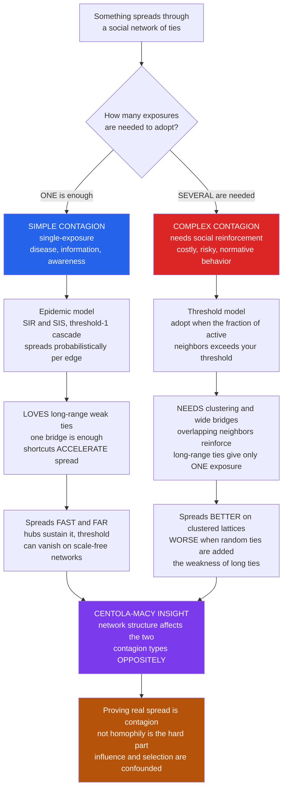

# 🌐 Contagion and Diffusion in Social Networks

> [!abstract] TL;DR
> **Contagion** is how *things* — diseases, information, behaviors, beliefs, emotions, innovations — spread through the **network of social ties**; the **structure** of that network and the **type** of contagion *together* decide what spreads, how fast, and how far. The pivotal distinction (Centola & Macy, 2007) is **SIMPLE vs COMPLEX contagion**. A **simple contagion** needs only a **single exposure**: one infected contact can pass you a virus, one friend can tell you the news. It is modeled by **epidemic SIR/SIS** dynamics, its takeoff governed by the **basic reproduction number $R_0$** and an **epidemic threshold** that can *vanish* on scale-free networks where **hubs** sustain spread (Pastor-Satorras & Vespignani). A **complex contagion** needs **multiple, reinforcing exposures**: you will not join a risky protest, buy an expensive unproven technology, change a health habit, or believe a contested rumor from *one* friend — you need to see **several** neighbors do it first. This obeys **threshold models** (Granovetter, Schelling, Watts) and — the profound result — responds to network structure **OPPOSITELY** to simple contagion. Long-range **weak ties** (small-world shortcuts) *accelerate* a simple contagion (one bridge is enough) but *hurt* a complex one (they deliver only a single, unreinforced exposure), while **clustered, redundant ties** and **"wide bridges"** supply the reinforcement complex contagion needs. Hence **"the weakness of long ties"**: behaviors spread better through **dense, clustered** neighborhoods than through the shortcuts that speed germs and gossip — overturning the naive "weak ties always speed spreading" view and reshaping how we understand epidemics, viral marketing, social movements, health behavior, and misinformation. The deep caveat: proving that a behavior actually *spread* (social **influence**) rather than clustering because similar people connect (**homophily**) is one of computational social science's hardest causal problems.

---

## Intuition

**Analogy — a virus and a new dance move both "spread" through your friend group, but by completely different rules.** Catch a cold from **one** infected contact and you are infected — done. A single exposure suffices; that is a **simple contagion**. Now think about a *risky new behavior* — quitting a stable job for a startup, joining a street protest, adopting a strange expensive gadget, or believing a wild rumor. You almost certainly will **not** do any of these because **one** friend did. You wait until you have seen **several** friends do it — the second, third, and fourth confirmations are what actually move you, because the behavior is costly, risky, or socially loaded and one voice is not enough. That is a **complex contagion**: it needs **reinforcement**.

Here is why that distinction is explosive. Because the two spread by different rules, they react to the *shape* of a social network in **opposite** ways. A virus loves a **shortcut**: one long-range "weak tie" from your town to a distant city is a bridge the germ leaps across, seeding a whole new region — this is exactly why weak ties are famous for speeding the flow of information and disease. But that same lonely shortcut is **useless** for a complex contagion: the one distant friend who protested gives you a *single* exposure, not the *several* you need, so the behavior does not jump the bridge — it stalls there. What complex contagion needs instead is **width**: many overlapping ties into a group, so that a person hears it from multiple sides at once. The counterintuitive punchline — **the very weak-tie shortcuts that accelerate a virus can stop a social movement.** How things spread depends not just on the network, but on *what kind of thing* is spreading.

---

## How It Works

Contagion analysis studies a process running **on** a (roughly frozen) network of social ties. The central move of modern computational social science is to stop asking only "how fast does it spread?" and instead ask "**what kind of contagion is this, and what network structure does *that kind* need?**" Get the pairing wrong and every prediction — and every intervention — inverts.

### Simple contagion: the epidemic template

A **simple contagion** transmits on a **single contact**. Each exposure is an independent chance of catching it, so the natural model is the **epidemic** framework borrowed from mathematical epidemiology (the same machinery as [[Systems_of_ODEs]] and [[Public_Health_and_Epidemiology]]):

1. **SIR / SIS compartments.** Each node is **S**usceptible, **I**nfected, or **R**ecovered. In **SIR** an infected node transmits to susceptible neighbors then recovers permanently (a one-shot wave — flu, measles, a news item that "burns out"). In **SIS** recovery returns you to susceptible, so the infection can become **endemic** (the common cold, a recurring rumor, a computer worm).
2. **$R_0$ and the epidemic threshold.** The **basic reproduction number** $R_0 = \beta/\gamma$ (transmission rate over recovery rate) is the expected number of secondary cases from one case. It hides a **phase transition**: below $R_0 = 1$ the chain dies out; above it, infections grow exponentially. Whether an outbreak *takes off* depends jointly on transmissibility **and** network structure.
3. **Hubs and the vanishing threshold.** On a network the reproduction number scales with degree heterogeneity, $R_0 \propto \frac{\beta}{\gamma}\frac{\langle k^2\rangle}{\langle k\rangle}$. On a **scale-free** network the second moment $\langle k^2\rangle$ diverges, so the **epidemic threshold vanishes** (Pastor-Satorras & Vespignani, 2001): even a barely-transmissible pathogen persists because it eventually reaches a **hub** — a super-spreader — that reignites the population. This is why **targeting hubs** (vaccination, deplatforming, firewalling) beats random intervention.
4. **The structural lesson.** Because *one* successful transmission is enough, simple contagion exploits **any** path across the network. **Long-range weak ties** — the small-world shortcuts of Granovetter and of Watts-Strogatz — are gold: a single bridge lets the contagion **jump** across the whole graph, dramatically shortening the time to reach everyone. *Randomness helps* a simple contagion.

### Complex contagion: the threshold template

A **complex contagion** needs **multiple, reinforcing exposures** because the thing spreading is **costly, risky, controversial, or normative**. Its model is not the epidemic but the **threshold** model (Granovetter's threshold models of collective behavior, 1978; Schelling; Watts' 2002 global-cascade model):

1. **Personal thresholds.** Each person adopts once the **fraction (or number)** of their neighbors who have already adopted **exceeds a personal threshold** $\theta$. A person with threshold $0.25$ needs a quarter of their contacts active before they join. The crowd's fate turns on the *distribution* of thresholds, not the average radicalism.
2. **Social reinforcement is the mechanism.** The extra exposures are not redundant — they *lower the risk and raise the credibility* of adopting. Seeing a second and third neighbor act supplies **social proof**, shared **norms**, and evidence that the behavior is safe or worthwhile (the link to [[Social_Norms_and_Conformity]]).
3. **Cascades and the "cascade window."** Whether a **global cascade** occurs depends on a percolating **"vulnerable cluster"** of low-threshold adopters; cascades are possible only within a narrow connectivity window — too sparse and the seed cannot propagate, too dense and every node has too many neighbors to ever cross its threshold. This is the same cascade physics as [[Cascades_and_Systemic_Risk]] and [[Cascades_Contagion_and_Financial_Crises]].
4. **The structural lesson — the inversion.** Because you need **several** active neighbors *at once*, the contagion needs **redundancy**: neighbors whose neighborhoods **overlap**, so activity is heard from multiple sides. **Clustered, locally-dense** networks provide this; **"wide bridges"** (multiple ties between two groups) transmit it. A **long-range weak tie** provides only **one** exposure — necessary reinforcement never accumulates — so shortcuts *fail*. *Randomness hurts* a complex contagion.

### The Centola-Macy result: structure acts oppositely on the two

Put the two templates on the **same** family of networks and sweep from a **clustered regular lattice** toward a **randomly rewired** small-world (the Watts-Strogatz knob). The **simple** contagion spreads **farther and faster** as you add randomness — shortcuts help. The **complex** contagion spreads **less and eventually fails** as you add randomness — shortcuts replace reinforcing local ties with single unreinforced exposures. This is Centola & Macy's **"the weakness of long ties"**: the classic result that weak, long-range ties *always* speed spreading is **true only for simple contagions**. For the behaviors we most care about, structure matters in the *opposite* direction.

### Empirical evidence and the hard confound

The sharpest test is **Centola's 2010 online experiment** (*Science*): he built artificial online health communities with the **same** number of people and ties but arranged either as a **clustered** lattice or a **random** network, then seeded a health behavior. The behavior spread **farther and faster on the clustered network** — direct experimental confirmation of complex contagion. Observational studies of protest mobilization, hashtag adoption, and behavior change show similar **reinforcement** signatures (the forthcoming *The_Strength_of_Weak_Ties_and_Social_Capital* note develops the weak-tie side of this story).

But observation carries a deadly confound. Seeing that connected people **behave alike** does **not** prove **contagion (influence)**. It could be **homophily** — similar people befriend each other and would have adopted independently — or a shared environment. Shalizi & Thomas (2011) proved that **"homophily and contagion are generically confounded"** in observational network data: you generally cannot separate "you changed me" from "we were alike and became friends." Christakis & Fowler's celebrated **"three degrees of influence"** studies of obesity, smoking, and happiness spreading through social ties were criticized on exactly this point. Establishing that a behavior *truly spreads* demands **experiments** or careful causal identification — the province of the forthcoming *Homophily_Selection_and_Influence* and *Causal_Inference_from_Observational_and_Digital_Data* notes, and one of computational social science's hardest problems (see [[Computational_Social_Science_Overview]] and the found-data pitfalls in [[Digital_Traces_and_Found_Data]]).

### The two contagions, in one picture



---

## Key Concepts

### Secondary Level

- **Contagion:** anything that spreads person-to-person along social connections — a germ, a rumor, a fashion, a mood, a protest.
- **Simple vs complex.** Some things spread from **one** contact (a cold, a piece of news) — that is **simple** contagion. Others need you to see **several** people do it first before you join in (a risky trend, a protest, a new belief) — that is **complex** contagion.
- **Why the difference matters.** A germ can leap across your friend group through a single far-away friend. But a risky *behavior* usually will not — you need several nearby friends doing it to be convinced. So the same friend group spreads a cold and a bold new habit in totally different ways.
- **Weak ties.** A "weak tie" is a distant acquaintance who links two separate groups. Great for passing along news or germs quickly; not enough, by itself, to talk you into something risky.

### Undergraduate Level

- **Simple contagion / epidemic models.** Single-exposure transmission modeled by **SIR** (Susceptible → Infected → Recovered) and **SIS** (recovery returns to Susceptible). Takeoff is governed by $R_0 = \beta/\gamma$; the **epidemic threshold** at $R_0 = 1$ is a phase transition between fizzle and outbreak. On networks $R_0 \propto \frac{\beta}{\gamma}\frac{\langle k^2\rangle}{\langle k\rangle}$, so heterogeneity and **hubs** dominate.
- **Complex contagion / threshold models.** Granovetter's threshold model: a person adopts when the fraction of active neighbors exceeds a personal threshold $\theta$. Collective outcomes depend on the **threshold distribution**; Watts' cascade model puts thresholds on a network and finds a **cascade window**.
- **The structure inversion.** Rewiring a clustered lattice toward randomness (Watts-Strogatz) **shortens paths** (helps simple contagion) but **destroys local redundancy** (hurts complex contagion). Complex contagion needs **clustering** and **wide bridges**; simple contagion needs only **shortcuts**.
- **Homophily vs influence.** Behavioral similarity among friends can reflect **influence** (contagion) or **homophily** (similar people connecting). In observational data these are confounded — you cannot infer contagion from correlation alone.

### Graduate Level

- **Epidemic threshold on networks.** Heterogeneous mean-field gives threshold $\lambda_c = \langle k\rangle / \langle k^2\rangle$; spectrally, the SIS threshold is $\beta/\gamma > 1/\lambda_{\max}(A)$ (inverse largest adjacency eigenvalue). On scale-free graphs with $P(k)\sim k^{-\gamma_{deg}}$, $2 < \gamma_{deg} \le 3$, $\langle k^2\rangle \to \infty$ so $\lambda_c \to 0$ — **no epidemic threshold** in the thermodynamic limit (Pastor-Satorras & Vespignani, 2001).
- **Complex-contagion formalization.** Adoption requires $\theta$ active neighbors (fractional or absolute). Centola & Macy (2007) show that on a Watts-Strogatz ring, increasing rewiring $p$ **monotonically decreases** the spread of a complex contagion while **increasing** that of a simple one — a genuine double dissociation. The mechanism is **wide bridges**: complex contagion propagates across a cut only when the cut has *multiple* ties into the same local neighborhood.
- **The confound, formally.** Shalizi & Thomas (2011): with latent homophilous traits driving both tie formation and behavior, contagion and homophily are **non-identifiable** from observational data without strong assumptions; naive peer-effect estimates are biased. Identification requires randomization (e.g., Centola's experiment; large-scale platform experiments), instrumental variation, or credible natural experiments.
- **Diffusion synthesis.** The **Bass model** $\frac{dF}{dt} = (p + qF)(1-F)$ blends external "innovation" ($p$) and internal "imitation" ($q$) influence to reproduce the adoption **S-curve** (see [[Diffusion_of_Innovations_and_Adoption_Dynamics]]); complex contagion refines the imitation term into a *thresholded, structure-sensitive* process rather than well-mixed proportional mixing.

---

## Python Demo

```python
# Simple vs complex contagion on the SAME family of networks.
# We sweep a Watts-Strogatz ring from a CLUSTERED regular lattice (rewiring p=0)
# toward a RANDOM small-world (p=1) and watch two spreading processes:
#   SIMPLE  (adopt if ANY neighbor is active; single exposure) -> reach GROWS
#           with rewiring, because long-range shortcuts let it jump far/fast.
#   COMPLEX (adopt only if >= 2 neighbors are active; needs reinforcement)
#           -> final size COLLAPSES with rewiring, because random ties give
#           only single, unreinforced exposures (the Centola-Macy result).
# numpy + matplotlib only -- the graph is a plain adjacency matrix.
import numpy as np
import matplotlib
matplotlib.use("Agg")
import matplotlib.pyplot as plt

rng = np.random.default_rng(7)

# ---------------------------------------------------------------------
# Watts-Strogatz ring lattice: N nodes, each joined to K nearest (K/2 per
# side), then each local edge rewired to a random node with probability p.
# p=0 -> clustered regular lattice; p=1 -> random small-world.
# ---------------------------------------------------------------------
def watts_strogatz(N, K, p):
    A = np.zeros((N, N), dtype=np.int8)
    half = K // 2
    for i in range(N):
        for j in range(1, half + 1):
            A[i, (i + j) % N] = 1
            A[(i + j) % N, i] = 1
    for i in range(N):
        for j in range(1, half + 1):
            if rng.random() < p:
                nb = (i + j) % N
                A[i, nb] = 0; A[nb, i] = 0            # cut the local tie
                free = np.where(A[i] == 0)[0]
                free = free[free != i]                # no self-loops / duplicates
                if free.size:
                    new = int(rng.choice(free))
                    A[i, new] = 1; A[new, i] = 1       # add a random long-range tie
                else:
                    A[i, nb] = 1; A[nb, i] = 1          # revert if impossible
    return A

# ---- SIMPLE contagion: single-exposure spread, measured within a fixed
#      TIME BUDGET so "reach" reflects how FAR/FAST it travels (shortcuts win).
def simple_reach(A, seeds, steps):
    active = np.zeros(A.shape[0], dtype=bool)
    active[seeds] = True
    for _ in range(steps):
        exposure = A @ active.astype(np.int32)         # active neighbors per node
        active |= (exposure >= 1)                       # ANY active neighbor -> adopt
    return active.mean()

# ---- COMPLEX contagion: threshold spread, run to a fixed point.
#      Adopt only when >= `thresh` neighbors are active (reinforcement).
def complex_final(A, seeds, thresh):
    active = np.zeros(A.shape[0], dtype=bool)
    active[seeds] = True
    while True:
        exposure = A @ active.astype(np.int32)
        new = (~active) & (exposure >= thresh)
        if not new.any():
            return active.mean()
        active |= new

# ---- full time-course versions (for the middle panel) -------------------
def simple_trace(A, seeds, steps):
    active = np.zeros(A.shape[0], dtype=bool); active[seeds] = True
    tr = [active.mean()]
    for _ in range(steps):
        active |= (A @ active.astype(np.int32) >= 1); tr.append(active.mean())
    return np.array(tr)

def complex_trace(A, seeds, thresh, steps):
    active = np.zeros(A.shape[0], dtype=bool); active[seeds] = True
    tr = [active.mean()]
    for _ in range(steps):
        new = (~active) & (A @ active.astype(np.int32) >= thresh)
        active |= new; tr.append(active.mean())
    return np.array(tr)

# ---------------------------------------------------------------------
# EXPERIMENT: sweep rewiring p; both contagions share graphs and SEEDS
# (a contiguous block of 10 nodes -> gives the complex contagion the
# local reinforcement it needs to even get started).
# ---------------------------------------------------------------------
N, K = 300, 6
seeds = np.arange(10)                 # contiguous seed cluster
SIMPLE_BUDGET, THRESH, N_TRIALS = 8, 2, 15
p_values = np.array([0.0, 0.02, 0.05, 0.1, 0.2, 0.35, 0.5, 0.7, 1.0])

simple_curve, complex_curve = [], []
for p in p_values:
    s_runs, c_runs = [], []
    for _ in range(N_TRIALS):
        A = watts_strogatz(N, K, p)
        s_runs.append(simple_reach(A, seeds, SIMPLE_BUDGET))
        c_runs.append(complex_final(A, seeds, THRESH))
    simple_curve.append(np.mean(s_runs))
    complex_curve.append(np.mean(c_runs))
simple_curve = np.array(simple_curve)
complex_curve = np.array(complex_curve)

# representative time-courses on a regular vs a rewired graph
A_reg  = watts_strogatz(N, K, 0.0)
A_rand = watts_strogatz(N, K, 0.5)
ts_reg,  ts_rand  = simple_trace(A_reg, seeds, 60),  simple_trace(A_rand, seeds, 60)
tc_reg,  tc_rand  = complex_trace(A_reg, seeds, THRESH, 60), complex_trace(A_rand, seeds, THRESH, 60)

# ------------------------------- REPORT --------------------------------
print("=" * 66)
print("SIMPLE vs COMPLEX CONTAGION on a Watts-Strogatz ring")
print("=" * 66)
print(f"{'rewiring p':>10} | {'SIMPLE reach':>13} | {'COMPLEX final':>14}")
for p, s, c in zip(p_values, simple_curve, complex_curve):
    print(f"{p:>10.2f} | {s:>12.0%} | {c:>13.0%}")
print("-" * 66)
print(f"SIMPLE  : reach {simple_curve[0]:.0%} (p=0)  ->  {simple_curve[-1]:.0%} (p=1)"
      "   randomness HELPS (shortcuts)")
print(f"COMPLEX : reach {complex_curve[0]:.0%} (p=0)  ->  {complex_curve[-1]:.0%} (p=1)"
      "   randomness HURTS (lost reinforcement)")

# ------------------------------- FIGURE --------------------------------
fig, ax = plt.subplots(1, 3, figsize=(16.5, 5.2))
fig.suptitle("Simple vs complex contagion: network structure acts OPPOSITELY "
             "(Centola-Macy)", fontsize=13, fontweight="bold")

# Panel 1: the double dissociation -- spread size vs rewiring
ax[0].plot(p_values, simple_curve, "-o", color="#2563eb", lw=2.2,
           label="SIMPLE (reach within budget)")
ax[0].plot(p_values, complex_curve, "-s", color="#dc2626", lw=2.2,
           label="COMPLEX (final adoption)")
ax[0].set_title("Spread size vs network randomness\nopposite trends", fontsize=10)
ax[0].set_xlabel("rewiring probability p  (0 = clustered lattice, 1 = random)")
ax[0].set_ylabel("fraction of network reached")
ax[0].set_ylim(0, 1.02); ax[0].legend(fontsize=9); ax[0].grid(alpha=0.3)
ax[0].annotate("shortcuts speed the virus", (0.55, simple_curve[6]),
               fontsize=8, color="#2563eb")
ax[0].annotate("reinforcement lost", (0.4, complex_curve[5] + 0.05),
               fontsize=8, color="#dc2626")

# Panel 2: time-course on regular vs rewired networks
ax[1].plot(ts_reg,  color="#2563eb", lw=2, ls="-",  label="simple, regular p=0")
ax[1].plot(ts_rand, color="#2563eb", lw=2, ls="--", label="simple, rewired p=0.5")
ax[1].plot(tc_reg,  color="#dc2626", lw=2, ls="-",  label="complex, regular p=0")
ax[1].plot(tc_rand, color="#dc2626", lw=2, ls="--", label="complex, rewired p=0.5")
ax[1].set_title("Adoption over time\nrewiring flips who wins", fontsize=10)
ax[1].set_xlabel("time step"); ax[1].set_ylabel("fraction adopted")
ax[1].set_ylim(0, 1.02); ax[1].legend(fontsize=8); ax[1].grid(alpha=0.3)

# Panel 3: contagion x structure -- the crossover as grouped bars
x = np.arange(2); w = 0.35
simple_ends  = [simple_curve[0],  simple_curve[-1]]
complex_ends = [complex_curve[0], complex_curve[-1]]
ax[2].bar(x - w/2, simple_ends,  w, color="#2563eb", edgecolor="black",
          label="SIMPLE contagion")
ax[2].bar(x + w/2, complex_ends, w, color="#dc2626", edgecolor="black",
          label="COMPLEX contagion")
ax[2].set_xticks(x)
ax[2].set_xticklabels(["clustered\nlattice (p=0)", "random\nrewired (p=1)"])
ax[2].set_title("Same contagions, different structures\nthe crossover", fontsize=10)
ax[2].set_ylabel("fraction of network reached")
ax[2].set_ylim(0, 1.05); ax[2].legend(fontsize=9); ax[2].grid(alpha=0.3, axis="y")

plt.tight_layout(rect=[0, 0, 1, 0.94])
plt.savefig("contagion_simple_vs_complex.png", dpi=110, bbox_inches="tight")
plt.show()
```

**What the demo shows:**

- **Panel 1 (the double dissociation).** As the network is rewired from a **clustered lattice** (`p=0`) toward a **random small-world** (`p=1`), the **simple** contagion's reach **rises** — long-range shortcuts let a single-exposure process jump across the graph and cover far more ground in the same time budget. The **complex** contagion's final size **collapses** — random ties replace the overlapping local neighbors that supplied reinforcement, so threshold-2 adoption stalls. Two processes, one structural knob, **opposite** responses.
- **Panel 2 (time-course).** On the **regular** lattice the complex contagion (solid red) marches all the way around the ring while the simple contagion (solid blue) crawls; on the **rewired** network the simple contagion (dashed blue) saturates almost instantly while the complex one (dashed red) dies near its seed. Rewiring literally **flips which contagion wins**.
- **Panel 3 (crossover).** The grouped bars make the inversion unmissable: on the **clustered** structure complex contagion dominates; on the **random** structure simple contagion dominates. Structure interacts with **contagion type** — the core computational-social-science insight, and the reason a viral-marketing playbook built for information fails when applied to a costly behavior.

---

## Real-World Applications

> **Epidemiology and public health.** Simple-contagion SIR/SEIR models estimate $R_0$, hospital demand, and the herd-immunity target $1 - 1/R_0$ for diseases from influenza to COVID-19. Because real contact networks are scale-free, **hub-targeting** interventions (vaccinating the highly-connected, contact tracing super-spreaders) beat mass random vaccination — see [[Infectious_Disease_Vaccines_and_Immunity]] and [[Public_Health_and_Epidemiology]].

> **Viral marketing and innovation diffusion.** "Going viral" and product adoption seem to invite influencer-seeding — but if the product is expensive, risky, or identity-laden, it is a **complex** contagion, and scattering a few far-flung influencers gives only single, unreinforced exposures. Effective seeding then targets **dense clusters** that can self-reinforce. This is the network-structure refinement of the adoption S-curve in [[Diffusion_of_Innovations_and_Adoption_Dynamics]].

> **Social movements and collective action.** Mobilization — joining a protest, a strike, an uprising — is the archetypal **complex** contagion: costly and risky, requiring reinforcement from multiple trusted, often *local* ties. Studies of the Arab Spring and protest cascades find that recruitment ran through **clustered, redundant** networks rather than weak long-range ties, linking directly to [[Social_Movements_and_Revolution]] and [[Collective_Behavior_and_Crowds]].

> **Health-behavior change.** Adopting PrEP, quitting smoking, going solar, changing diet — Centola's online experiments and field studies show these spread as complex contagions, farther and faster through **clustered** communities. The intervention lesson lives in [[Health_Behavior_and_Behavior_Change]].

> **Misinformation and rumor spread.** Awareness of a rumor is a simple contagion (one exposure to hear it), but *believing and acting on* a contested claim can be complex (needing reinforcement). Platform design — reshare rate-limits, deplatforming super-spreaders, and recommendation algorithms that manufacture artificial reinforcement — shapes which regime dominates; the forthcoming *Misinformation_Polarization_and_the_Online_Public_Sphere* note develops this.

> **Financial contagion.** Default and liquidity shocks propagate across the interbank network like an epidemic, while herding and belief cascades among traders behave like complex contagions with thresholds — the "too connected to fail" super-spreader problem of [[Cascades_Contagion_and_Financial_Crises]], [[Cascades_and_Systemic_Risk]], and [[Herding_Bubbles_and_Crashes]].

---

## Common Pitfalls

- **Modeling a complex contagion as a simple one.** The single most consequential error. Using an SIR/independent-cascade model for a behavior that actually needs reinforcement predicts spread through weak ties that never materializes and prescribes exactly the **wrong** seeding strategy — scattered influencers instead of dense clusters. Always ask: *does one exposure suffice, or are several needed?*
- **Assuming weak ties always speed spreading.** Granovetter's "strength of weak ties" is real **for information and disease** (simple contagion). Generalizing it to *behaviors* is the mistake Centola & Macy corrected: for complex contagion long ties are a **weakness**, and clustered "wide bridges" are what work.
- **Confusing correlation with contagion (homophily vs influence).** Friends behaving alike may reflect **homophily** (similar people connect) or shared environment, not social influence. "Homophily and contagion are generically confounded" (Shalizi & Thomas); claiming contagion from a network snapshot is a classic, publishable-yet-wrong error. Establishing contagion needs experiments or credible identification.
- **Treating $R_0$ as a fixed property of a pathogen.** $R_0 = \beta/\gamma$ depends on behavior and **network structure**, not just biology; it differs across a dense city and a sparse village, and the naive mean-field value is *wrong* when degree variance is huge (the vanishing-threshold regime).
- **Assuming well-mixed dynamics.** Homogeneous-mixing ODEs miss hubs, clustering, and the vanishing epidemic threshold. Structure is not a second-order correction — for both contagion types it can **reverse** the conclusion.
- **Reading a slow start as failure.** A complex contagion (and any S-curve diffusion) *should* start slowly while reinforcement accumulates; killing a campaign in the flat phase can abort a cascade that was about to tip. Conversely, a fast simple-contagion start can outrun any intervention if hubs are already infected.

---

## Related Concepts

**Within Computational Social Science:**

- [[Computational_Social_Science_Overview]] — the parent field; contagion/diffusion is one of its flagship enduring questions.
- [[Digital_Traces_and_Found_Data]] — the found-data on which real contagion is measured, and where the homophily-vs-influence confound bites hardest.

**Network structure and dynamics (Systems Thinking):**

- [[Network_Dynamics_and_Contagion]] — the systems-thinking treatment of spreading processes, SIR/SIS, $R_0$, and the vanishing threshold; the epidemiological backbone this note builds a social-contagion layer on top of.
- [[Small_World_and_Scale_Free_Networks]] — supplies the substrate: the Watts-Strogatz shortcuts that speed simple contagion and the hubs that sustain epidemics.
- [[Cascades_and_Systemic_Risk]] — Granovetter/Watts threshold cascades and the "cascade window," the same physics as complex contagion applied to failures.
- [[Network_Science_Fundamentals]] — the formal graph backbone for every measure used here.
- [[Centrality_and_Community_Structure]] — clustering and community structure are exactly the "wide bridges" and redundancy complex contagion requires.
- [[Bifurcations_and_Tipping_Points]] — the epidemic and cascade thresholds are tipping points where spread abruptly switches on.
- [[Agent_Based_Modeling]] — the bottom-up simulation method (as in this note's demo) used to study contagion on networks.

**Diffusion, economics, and behavior:**

- [[Diffusion_of_Innovations_and_Adoption_Dynamics]] — the adoption S-curve, Bass model, and Rogers categories that complex contagion refines with structure-sensitive thresholds.
- [[Cascades_Contagion_and_Financial_Crises]] — financial contagion as epidemic-plus-threshold dynamics on the interbank network.
- [[Economic_Networks_and_Interaction_Structure]] — the interaction-structure lens shared with complexity economics.
- [[Social_Norms_and_Conformity]] — social reinforcement, the mechanism behind complex contagion, is norm-driven conformity.
- [[Herding_Bubbles_and_Crashes]] — herding as belief contagion with threshold dynamics in markets.

**Social-science substance (Sociology, Health):**

- [[Social_Networks_and_Social_Ties]] — weak vs strong ties and clustering, which decide whether a contagion is a simple- or complex-contagion problem.
- [[Social_Capital_and_Trust]] — trust and dense ties supply the reinforcement complex contagion depends on.
- [[Collective_Behavior_and_Crowds]] — Granovetter's threshold model of riots is the sociological root of the cascade models here.
- [[Social_Movements_and_Revolution]] — mobilization as complex contagion needing clustered reinforcement.
- [[Public_Health_and_Epidemiology]] — the applied epidemiology of simple-contagion disease spread and intervention.
- [[Infectious_Disease_Vaccines_and_Immunity]] — the biology of the R compartment, herd immunity, and hub-targeted vaccination.
- [[Health_Behavior_and_Behavior_Change]] — behavior change as complex contagion, the applied payoff of this distinction.
- [[Systems_of_ODEs]] — the differential-equation machinery behind the mean-field SIR model.

**Planned siblings in this vault (referenced above, not yet written):** *Social Network Analysis Foundations*, *The Strength of Weak Ties and Social Capital*, *Homophily, Selection, and Influence*, *Misinformation, Polarization, and the Online Public Sphere*, and *Causal Inference from Observational and Digital Data*.

---

## Review Questions

### Secondary

1. Explain, in your own words, the difference between a **simple** and a **complex** contagion, using one example of each from your own life. Why does one need only a single exposure while the other needs several?
2. Your friend group has one member who moved to a distant city. How is that far-away friend useful for spreading a piece of news, but *not* enough, by themselves, to get you to join a risky new trend?
3. Give one reason a huge, densely-connected online platform might spread a rumor extremely fast but still struggle to spread an actual behavior change.

### Undergraduate

1. Take the **Watts-Strogatz** picture: as you rewire a clustered ring toward randomness, explain *mechanistically* why the reach of a **simple** contagion grows while the final size of a **complex** contagion shrinks. What structural quantity increases, and what decreases, as you rewire?
2. A public-health team wants to spread a new preventive behavior and copies a **viral-marketing** playbook: seed many well-connected influencers who each reach far via weak ties. It underperforms. Diagnose the failure using the simple-vs-complex distinction, and redesign the seeding strategy. When *would* the weak-tie playbook have been correct?
3. Explain the **epidemic threshold** and why it can **vanish** on a scale-free network. What does this imply for how you would allocate a limited vaccine supply, and why does hub-targeting beat random vaccination?

### Graduate

1. "**Homophily and contagion are generically confounded**" (Shalizi & Thomas). Set up the confound formally: with a latent trait driving both tie formation and behavior, why is a peer-effect (contagion) estimate biased, and in which direction? What identification strategies — Centola's randomized network experiment, large-scale platform experiments, natural experiments — can break the confound, and what are the ethical costs of the experimental route?
2. Centola & Macy show a **double dissociation** between contagion type and network randomness. Formalize a complex contagion with a fractional threshold $\theta$ on a Watts-Strogatz ring and argue why a "wide bridge" (multiple ties into one neighborhood) transmits it while a single long-range tie cannot. How would the picture change as you vary $\theta$ and mean degree $\langle k\rangle$ toward Watts' cascade window?
3. Critically evaluate the claim that "most consequential social spreading is complex contagion." Marshal the evidence (Centola's experiment, protest-mobilization studies) against the counter-evidence and the measurement difficulties (distinguishing simple from complex in observational trace data, confounded with homophily). Where does the distinction most change real policy — misinformation, public health, or movements — and why?

---

## Sources

- [Centola, D., & Macy, M. (2007). "Complex Contagions and the Weakness of Long Ties." *American Journal of Sociology*, 113(3), 702–734](https://doi.org/10.1086/521848)
- [Centola, D. (2010). "The Spread of Behavior in an Online Social Network Experiment." *Science*, 329(5996), 1194–1197](https://doi.org/10.1126/science.1185231)
- [Granovetter, M. (1978). "Threshold Models of Collective Behavior." *American Journal of Sociology*, 83(6), 1420–1443](https://doi.org/10.1086/226707)
- [Pastor-Satorras, R., & Vespignani, A. (2001). "Epidemic Spreading in Scale-Free Networks." *Physical Review Letters*, 86(14), 3200–3203](https://doi.org/10.1103/PhysRevLett.86.3200)
- [Shalizi, C. R., & Thomas, A. C. (2011). "Homophily and Contagion Are Generically Confounded in Observational Social Network Studies." *Sociological Methods & Research*, 40(2), 211–239](https://doi.org/10.1177/0049124111404820)
- [Christakis, N. A., & Fowler, J. H. (2007). "The Spread of Obesity in a Large Social Network over 32 Years." *New England Journal of Medicine*, 357(4), 370–379](https://doi.org/10.1056/NEJMsa066082)

---

#computational-social-science #social-contagion #complex-contagion #diffusion #threshold-models
