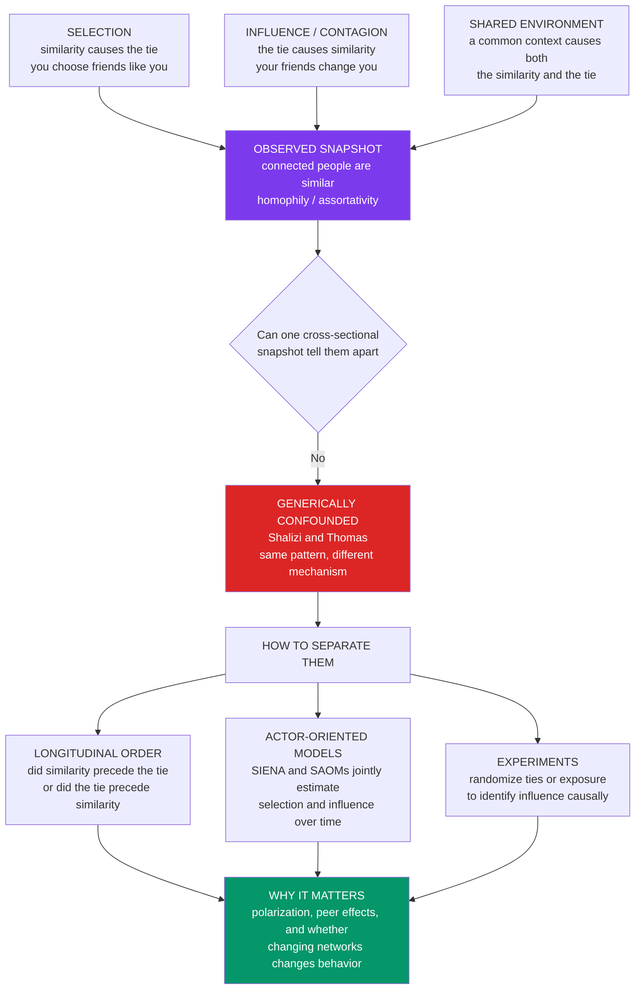

# 🐦 Homophily, Selection, and Influence

> [!abstract] TL;DR
> **Homophily** — "birds of a feather flock together," the pervasive tendency for **similar people to be connected** (friends, spouses, and colleagues tend to share age, race, education, class, politics, and behaviors) — is one of the most **robust regularities** in social networks, with deep consequences for **segregation, inequality, echo chambers, and diffusion**. But it poses one of social science's hardest puzzles. Observing that **connected people are similar** is consistent with **two opposite causal stories**: **SELECTION** (people *choose* to connect with those already similar — similarity *causes* the tie) or **INFLUENCE / contagion** (people *become* similar to those they are connected to — the tie *causes* the similarity). Both produce the *exact same* cross-sectional pattern, yet imply opposite things — *do people choose networks, or do networks change people?* — and they are **generically confounded** in snapshot data and further tangled with **shared environment** (Shalizi & Thomas). So the fact that friends behave alike does **not** prove social contagion — as the sharply criticized **Christakis–Fowler** obesity/happiness "three degrees of influence" studies illustrated. Separating the twin forces requires **longitudinal data** (which came first?), **stochastic actor-oriented models** (SIENA/SAOMs), and **experiments** — and getting it right is essential for understanding **polarization**, evaluating **peer effects**, and knowing whether **interventions that change networks actually change behavior**.

---

## Intuition

**Analogy:** Your close friends probably vote like you, like the same music, and share your habits. Why? There are two very different stories, and from where you sit *right now* they look identical. Maybe your friends **influenced** you — you grew alike *because* you were connected, the way an accent rubs off on you after years in a new city (contagion). Or maybe you **selected** friends who were *already* like you — you sought out people who shared your taste and never bothered with the rest ("birds of a feather flock together"). Take a snapshot today and both stories predict the *same* photograph: similar people, standing together. But rewind the tape and they are opposites. One says the **network changed the person**; the other says the **person chose the network**.

That is the whole puzzle in one image. The pattern — *similar people connected* — is everywhere and easy to see. The **mechanism** behind it is nearly invisible, because a still photograph erases *time*, and time is the only thing that separates "we became alike because we're friends" from "we're friends because we were alike." Untangling these twin forces is one of the trickiest and most consequential problems in all of social science, because the two answers point policy, prediction, and blame in opposite directions.

---

## How It Works

### Homophily: the pattern

**Homophily** is "the principle that contact between similar people occurs at a higher rate than among dissimilar people" (McPherson, Smith-Lovin & Cook, 2001). It is astonishingly general: networks are strongly **segregated by race, class, education, age, religion, politics, gender, and interests**. In network terms, it shows up as **assortativity** — the statistical tendency for an edge to join two nodes with *similar* attributes, so that per-edge similarity is higher than for random pairs.

Homophily is not a curiosity; it is **consequential**. Because you mostly hear from people like you, it shapes **what information and opportunity you are exposed to** (the seed of echo chambers and filter bubbles). It **reproduces inequality** — advantaged people hold advantaged ties, converting network position into social capital (see [[Social_Capital_and_Trust]]). It **limits diffusion across group boundaries** — novelty and new information must cross homophilous divides, which is exactly why *weak ties* between groups matter so much (the theme of the forthcoming *The_Strength_of_Weak_Ties_and_Social_Capital*). And it **drives polarization** — like-minded clustering that reinforces shared views. "Who connects to whom" turns out to be one of the most far-reaching facts about a society.

### The two mechanisms behind the same pattern

Here is the crux. A single homophilous snapshot is **consistent with two opposite generative processes**:

1. **SELECTION (homophily-as-choice).** People *prefer* to form ties with others already **similar** to them. Similarity comes **first**; the tie comes **second**. Similarity *causes* the tie. This is the mechanism in [[Schelling_Segregation_and_Emergent_Patterns]] — mild same-type preferences generate starkly sorted structure.
2. **INFLUENCE (contagion / social influence).** People *become* similar to those they are already connected to — attitudes, behaviors, and tastes flow along ties. The tie comes **first**; the similarity comes **second**. The tie *causes* the similarity. This is the mechanism behind [[Network_Dynamics_and_Contagion]] and diffusion.

Both yield the identical cross-sectional signature — *connected people are similar* — but they have **opposite implications**. Under selection, networks are a **mirror** of pre-existing individuals; under influence, networks are an **engine** that reshapes them. Do you fix behavior by targeting people, or by rewiring networks? The answer depends entirely on which mechanism is operating.

### Why they are confounded

The deep methodological result: **selection and influence are generically confounded** in observational network data. From a single **cross-sectional snapshot**, you *cannot* distinguish them, because both produce the same assortativity. Worse, they are further tangled with a third culprit — **shared environment / common exposure**: connected people may be similar simply because they inhabit the same context (same workplace, neighborhood, algorithm feed, or shock), which *causes both* the tie and the similarity, mimicking both selection and influence. Shalizi & Thomas (2011) proved the sharp version: **"homophily and contagion are generically confounded in observational social network studies"** — you *cannot* cleanly infer social influence from observing that friends' behaviors are correlated. It is a fundamental limit on causal inference from networks, a network-specific instance of the confounding problem central to *Causal_Inference_from_Observational_and_Digital_Data*.

### The cautionary tale: the "social contagion" debate

The famous **Christakis & Fowler** studies (2007–2008) claimed that **obesity, smoking, happiness, and loneliness spread through social networks** — the vivid "**three degrees of influence**" idea that your friends' friends' friends affect you. They were sharply **criticized** (Cohen-Cole & Fletcher; Lyons) precisely because their observational design **could not rule out homophily/selection and shared environment**: friends may be similarly obese because heavy people befriend heavy people (selection), or because they share a food environment (context), not because obesity is contagious. As a *reductio*, critics showed the same method "detects" contagion of **height, headaches, and acne** — traits no one thinks spread socially. The lesson is not that contagion is fake, but that "your friends' obesity predicts yours" is **not proof** of it. It became a landmark debate about the limits of network causal claims.

### How to separate selection and influence

The identification problem is hard but not hopeless. The toolkit:

- **Longitudinal data — the temporal order.** The single most powerful lever. Watch the *sequence*: does **similarity precede the tie** (selection) or does the **tie precede growing similarity** (influence)? Time breaks the symmetry a snapshot cannot.
- **Stochastic actor-oriented models (SAOMs / SIENA).** Snijders' framework jointly models **tie changes** and **behavior changes** across observed network panels, estimating **separate parameters** for selection and influence — the workhorse for co-evolving networks-and-behavior.
- **Experiments.** Randomly assign **ties or exposure** to identify influence causally (the domain of *Online_Experiments_and_Digital_Field_Experiments*) — randomization severs the confounding by construction.
- **Natural experiments, instruments, and matched designs.** Exploit exogenous shocks to network structure or exposure, or match on pre-treatment similarity, to approximate the counterfactual. Aral, Muchnik & Sundararajan (2009) used dynamic matching to show influence is often *dramatically overestimated* when homophily is ignored.

None is perfect, but together they turn an un-identified snapshot into a tractable — if still delicate — inference problem.

### The confound, and how to break it



---

## Key Concepts

### Secondary Level

**Birds of a feather.** Look at any group of friends and you will notice they are alike — similar ages, tastes, backgrounds, opinions. Social scientists call this **homophily**: similar people tend to be connected. It is one of the most reliable facts about human networks.

**Two stories, one photo.** *Why* are friends alike? Either your friends **rubbed off on you** (you became similar because you're connected) or you **picked friends like you** (you were similar first). A photo of your friend group *today* can't tell which story is true — both make the same picture. You'd have to watch the friendship form over *time* to know which came first, the similarity or the tie.

**Why anyone cares.** If friends make each other unhealthy (or healthy), then changing *who people know* could change behavior — a huge lever for public health, education, and politics. But if people just *pick* similar friends, changing networks won't help. So knowing which story is right actually matters for what we should *do*.

| The story | What comes first | What it implies |
|---|---|---|
| **Selection** | similarity, then the tie | people *choose* their networks |
| **Influence** | the tie, then similarity | networks *change* people |

### Undergraduate Level

#### Homophily and assortativity

Homophily is measured as **assortativity**: the tendency for an edge to link nodes with similar attributes, so that the average similarity *across ties* exceeds the average similarity of *random pairs*. It appears on nearly every attribute studied — **race** (usually the strongest divide in friendship networks), education, age, class, religion, and political affiliation — and it structures who is exposed to what information, mirroring the network foundations in [[Social_Networks_and_Social_Ties]].

#### Baseline vs inbreeding homophily

A crucial distinction. Some homophily is mechanical: if a group is 90% of the population, even *random* mixing yields mostly same-group ties (**baseline homophily**). The interesting quantity is **inbreeding homophily** — same-group ties *above* what population proportions predict. Confusing the two overstates preference-driven sorting.

#### Selection vs influence, precisely

- **Selection (homophily):** the probability of forming a tie *increases* with prior similarity. A generative rule: `P(new tie i–j) grows with similarity(i, j)`. Attributes are (relatively) fixed; the **network adapts**.
- **Influence (contagion):** an actor's attribute moves toward its neighbors' attributes. A generative rule: `x_i(t+1) = x_i(t) + μ · (mean of neighbors − x_i(t))`. The network is (relatively) fixed; the **attributes adapt**.

Real systems have **both at once** — networks and behavior **co-evolve** — which is exactly why disentangling them is hard.

#### The identification problem

A single snapshot gives you the *joint* distribution of ties and attributes, but the mechanism is a claim about *dynamics*. Two different processes can produce the same joint distribution (they are **observationally equivalent** cross-sectionally). This is the core of the **selection–influence identification problem**: the data underdetermine the mechanism.

#### The Christakis–Fowler debate in one line

"Your friends' obesity predicts yours" is **compatible with** contagion, selection, *and* shared environment. The prediction is real; the causal reading ("obesity is contagious") is not licensed by observational network correlation alone.

### Graduate Level

#### The Shalizi–Thomas result

Shalizi & Thomas (2011) formalize the confound with **causal graphs**. If each actor has an unobserved trait that drives *both* its attribute *and* its tie choices (**latent homophily**), then conditioning on a friend's behavior opens a **backdoor path**, and the estimated "influence" is biased by selection — *even with longitudinal data and rich controls*. Their theorem: contagion and homophily are **generically non-identified** from observational network data. Latent homophily acts as an **unmeasured confounder** that no amount of covariate adjustment on *observed* attributes can close, because the confounder is the *propensity to form ties*, which is not directly observed.

#### Why longitudinal data helps — and its limits

Panel data lets you exploit **temporal precedence**: model tie formation as a function of *lagged* similarity (selection) and behavior change as a function of *lagged* neighbor behavior (influence). **SAOMs (SIENA)** implement this as a continuous-time Markov process over the joint (network, behavior) state, alternating **network micro-steps** (actors add/drop ties) and **behavior micro-steps** (actors adjust attributes), each driven by an objective function whose parameters *separate* selection from influence. The **limit**: identification still rests on parametric and Markov assumptions and on the absence of the very latent homophily Shalizi & Thomas flag — so SAOM estimates are only as credible as those assumptions. Time-varying confounders (a shared shock that alters both ties and behavior) remain a threat.

#### Experiments and quasi-experiments as the gold standard

Because observation is confounded, the cleanest evidence is **randomized**: assign exposure or ties at random and measure downstream behavior. Large-scale digital experiments — Facebook's 61-million-person voter-mobilization study, randomized product-adoption and information-diffusion trials — identify **influence** by construction, because randomization guarantees exposure is independent of the actor's latent traits. **Instrumental variables** and **natural experiments** (exogenous roommate assignment, random shocks to a peer's outcome) approximate this observationally. Aral et al. (2009) showed that ignoring homophily can **overstate peer influence by 300–700%** in diffusion data — a quantitative warning about naive contagion estimates.

#### Co-evolution, emergence, and the generative view

Homophilous **selection** is a key mechanism *generating* segregated, clustered structure: small same-type preferences produce starkly divided networks, exactly as in [[Schelling_Segregation_and_Emergent_Patterns]]. Layer **influence** on top and the two forces **reinforce** each other — homophily assembles like-minded clusters, influence homogenizes them further — a positive feedback that grows **echo chambers** and homogeneous communities from the bottom up. This is the co-evolutionary, [[Emergence_and_Self_Organization|emergent]] view: macro-structure (segregation, polarization) as the equilibrium of micro-rules for whom-to-befriend and whom-to-imitate, a hallmark of [[Complex_Adaptive_Systems]].

#### Implications for polarization and echo chambers

Homophily + influence are the network engine of **echo chambers** and **filter bubbles**: like-minded clusters that reinforce shared views (the theme of the forthcoming *Misinformation_Polarization_and_the_Online_Public_Sphere* and connected to [[Democratic_Backsliding_and_Polarization]]). Whether **online** life *increases* homophily is **contested**: some find algorithmic and self-selected sorting intensifying homogeneity, while others (Bakshy et al.; Boxell et al.) find social media *also* exposes users to more cross-cutting content than offline life, and that polarization has risen fastest among the *least* online. The mechanism of political sorting — and whether platforms cause it — is itself an open selection-vs-influence question.

---

## Python Demo

This demo makes the identification problem concrete. We simulate a **co-evolving network + behavior** where each of `N` agents has a continuous attribute (an "opinion") and a similarity `1 − |xᵢ − xⱼ|`. We run **two pure processes** tuned to reach the *same* homophily:

- **PURE SELECTION** — attributes are **fixed**; agents **rewire** ties toward more-similar others.
- **PURE INFLUENCE** — the network is **fixed**; agents move their attribute **toward their neighbors'** average.

**Part (a)** shows both processes drive the network to the **same final assortativity** (per-edge similarity), and their **final edge-similarity distributions overlap** — so a single **cross-sectional snapshot cannot distinguish them** (the identification problem). **Part (b)** shows how **longitudinal signatures** disambiguate: under **selection**, newly-formed ties are **already similar before** the tie exists (similarity precedes tie); under **influence**, the **initial cohort of ties grows more similar over time** (tie precedes similarity), while under selection those same pairs' similarity stays flat (people never changed — the edges moved). Uses only `numpy` and `matplotlib`.

```python
import numpy as np
import matplotlib
matplotlib.use("Agg")
import matplotlib.pyplot as plt

rng = np.random.default_rng(11)

# =====================================================================
# CO-EVOLVING NETWORK + BEHAVIOR.  N agents, each with a continuous
# ATTRIBUTE x in [0,1] (an "opinion").  similarity(i,j) = 1 - |xi - xj|.
# HOMOPHILY / ASSORTATIVITY = tied pairs are more similar than random pairs.
#   SELECTION : attributes FIXED; agents REWIRE ties toward similar others.
#   INFLUENCE : network FIXED; agents move their attribute toward neighbors'.
# Both are tuned to the SAME homophily -> one snapshot can't tell them apart.
# Only the TEMPORAL ORDER (Part b) distinguishes the mechanisms.
# =====================================================================
N = 60
BLOCKS = np.array([0] * (N // 2) + [1] * (N - N // 2))   # two weak clusters

def sbm(n, blocks, p_in=0.25, p_out=0.006):
    """Stochastic block model: dense within block, sparse between."""
    A = np.zeros((n, n))
    for i in range(n):
        for j in range(i + 1, n):
            p = p_in if blocks[i] == blocks[j] else p_out
            if rng.random() < p:
                A[i, j] = A[j, i] = 1.0
    return A

def edge_pairs(A):
    ii, jj = np.where(np.triu(A, 1) > 0)
    return ii, jj

def edge_sims(A, x):
    ii, jj = edge_pairs(A)
    return 1 - np.abs(x[ii] - x[jj])

def assortativity(A, x):
    s = edge_sims(A, x)
    return float(s.mean()) if len(s) else np.nan

def random_pair_sim(x, k=6000):
    a, b = rng.integers(0, len(x), k), rng.integers(0, len(x), k)
    m = a != b
    return float(np.mean(1 - np.abs(x[a[m]] - x[b[m]])))

# --- shared initial condition: attributes correlate weakly with blocks,
#     with heavy overlap so t=0 is only MILDLY homophilous ---
x0 = np.clip(np.where(BLOCKS == 0,
                      rng.normal(0.35, 0.16, N),
                      rng.normal(0.65, 0.16, N)), 0, 1)
A0 = sbm(N, BLOCKS)
init_ii, init_jj = edge_pairs(A0)                    # the t=0 tie COHORT
STEPS = 40

def cohort_sim(x):                                   # similarity of t=0 ties
    return float(np.mean(1 - np.abs(x[init_ii] - x[init_jj])))

# ================= PURE SELECTION (attributes fixed) =================
def run_selection():
    A, x = A0.copy(), x0.copy()
    assort, cohort, newtie = [assortativity(A, x)], [cohort_sim(x)], []
    for _ in range(STEPS):
        for _ in range(N):                           # N rewire attempts / sweep
            i = rng.integers(N)
            nbrs = np.where(A[i] > 0)[0]
            if len(nbrs) == 0:
                continue
            drop = nbrs[np.argmax(np.abs(x[i] - x[nbrs]))]   # shed least similar
            cand = np.where(A[i] == 0)[0]
            cand = cand[cand != i]
            if len(cand) == 0:
                continue
            w = (1 - np.abs(x[i] - x[cand])) ** 8    # strong pull toward similar
            j = rng.choice(cand, p=w / w.sum())
            A[i, drop] = A[drop, i] = 0.0
            A[i, j] = A[j, i] = 1.0
            newtie.append(1 - abs(x[i] - x[j]))      # similarity AT formation
        assort.append(assortativity(A, x))
        cohort.append(cohort_sim(x))                 # x never changes -> flat
    return A, x, np.array(assort), np.array(cohort), np.array(newtie)

# ================= PURE INFLUENCE (network fixed) =================
def run_influence(mu=0.30):
    A, x = A0.copy(), x0.copy()
    deg = A.sum(1)
    assort, cohort = [assortativity(A, x)], [cohort_sim(x)]
    for _ in range(STEPS):
        nbr_mean = (A @ x) / np.maximum(deg, 1)
        x = np.where(deg > 0, x + mu * (nbr_mean - x), x)    # move toward nbrs
        assort.append(assortativity(A, x))
        cohort.append(cohort_sim(x))                 # tied pairs converge -> rises
    return A, x, np.array(assort), np.array(cohort)

As, xs, sel_assort, sel_cohort, sel_newtie = run_selection()
Ai, xi, inf_assort, inf_cohort = run_influence()

base = random_pair_sim(x0)
print("=" * 66)
print("SELECTION vs INFLUENCE  (same pattern, different mechanism)")
print("=" * 66)
print(f"random-pair similarity (baseline)      : {base:.3f}")
print(f"FINAL assortativity  SELECTION         : {sel_assort[-1]:.3f}")
print(f"FINAL assortativity  INFLUENCE         : {inf_assort[-1]:.3f}")
print("  -> nearly identical snapshot: indistinguishable cross-section")
print(f"SELECTION new-tie similarity (mean)    : {sel_newtie.mean():.3f}"
      f"  (>> baseline: similarity PRECEDES the tie)")
print(f"INFLUENCE cohort sim  t=0 -> t=end      : "
      f"{inf_cohort[0]:.3f} -> {inf_cohort[-1]:.3f}  (tie PRECEDES similarity)")
print(f"SELECTION cohort sim  t=0 -> t=end      : "
      f"{sel_cohort[0]:.3f} -> {sel_cohort[-1]:.3f}  (flat: people never changed)")

# ------------------------------- FIGURE --------------------------------
fig, ax = plt.subplots(2, 2, figsize=(13.5, 10))
fig.suptitle("Homophily: selection and influence produce the SAME snapshot, "
             "but a DIFFERENT temporal signature", fontsize=13, fontweight="bold")
c_sel, c_inf = "#dc2626", "#2563eb"

# Panel A: assortativity over time -> both reach the same final level
a = ax[0, 0]
a.plot(sel_assort, "-o", color=c_sel, ms=3, label="pure SELECTION")
a.plot(inf_assort, "-s", color=c_inf, ms=3, label="pure INFLUENCE")
a.axhline(base, ls=":", color="gray", label="random-pair baseline")
a.set_title("(a) Assortativity over time\nboth converge to the SAME homophily")
a.set_xlabel("time step"); a.set_ylabel("mean similarity across ties")
a.legend(fontsize=8); a.grid(alpha=0.25); a.set_ylim(0.5, 1.02)

# Panel B: final edge-similarity DISTRIBUTIONS overlap -> snapshot can't tell
b = ax[0, 1]
bins = np.linspace(0, 1, 21)
b.hist(edge_sims(As, xs), bins=bins, alpha=0.55, color=c_sel,
       density=True, label="SELECTION (final)")
b.hist(edge_sims(Ai, xi), bins=bins, alpha=0.55, color=c_inf,
       density=True, label="INFLUENCE (final)")
b.set_title("(b) CROSS-SECTION is indistinguishable\nsame edge-similarity "
            "distribution")
b.set_xlabel("per-edge similarity  1 - |xi - xj|"); b.set_ylabel("density")
b.legend(fontsize=8); b.grid(alpha=0.25)

# Panel C: SELECTION signature -> ties are similar BEFORE they form
c = ax[1, 0]
c.bar(["random\npair", "newly-formed\ntie"], [base, sel_newtie.mean()],
      color=["gray", c_sel], edgecolor="black")
c.set_title("(c) SELECTION fingerprint\nsimilarity PRECEDES the tie")
c.set_ylabel("mean similarity"); c.set_ylim(0, 1.02); c.grid(alpha=0.25, axis="y")
c.text(1, sel_newtie.mean() + 0.03, "new ties already similar",
       ha="center", fontsize=8, color=c_sel)

# Panel D: INFLUENCE signature -> the t=0 tie cohort GROWS similar over time
d = ax[1, 1]
d.plot(inf_cohort, "-s", color=c_inf, ms=3, label="INFLUENCE: ties converge")
d.plot(sel_cohort, "-o", color=c_sel, ms=3, label="SELECTION: flat (fixed x)")
d.set_title("(d) INFLUENCE fingerprint\nthe SAME initial ties grow similar")
d.set_xlabel("time step"); d.set_ylabel("similarity of t=0 tie cohort")
d.legend(fontsize=8); d.grid(alpha=0.25); d.set_ylim(0.5, 1.02)

plt.tight_layout(rect=[0, 0, 1, 0.95])
plt.savefig("homophily_selection_influence.png", dpi=110, bbox_inches="tight")
plt.show()
```

**What the demo shows:**

- **Panel (a) — same destination.** Selection (attributes frozen, edges migrate toward similar pairs) and influence (edges frozen, attributes converge toward neighbors) both climb from the mild baseline to the *same* high assortativity. Two entirely different mechanisms, one identical macro-outcome.
- **Panel (b) — indistinguishable snapshot.** The final **per-edge similarity distributions overlap almost completely**. Handed only the end-state network, you *cannot* say which process produced it — the visual statement of the **identification problem**.
- **Panel (c) — the selection fingerprint.** When a new tie forms under selection, the two agents are **already far more similar than a random pair** *before* the edge exists. **Similarity precedes the tie** — the temporal signature of choice.
- **Panel (d) — the influence fingerprint.** Track the *same set of ties that existed at t = 0*. Under **influence** their endpoints **grow steadily more similar** (the tie caused the convergence); under **selection** those pairs' similarity is **flat** (attributes never moved — the homophily came from *relocating edges*, not from *changing people*). **The tie precedes the similarity.**

The takeaway: **a snapshot is silent, but the sequence speaks.** Only by observing *what came first* — similarity or the tie — can longitudinal data begin to separate selection from influence.

---

## Real-World Applications

> **Peer effects in health and behavior.** The whole enterprise of estimating whether obesity, smoking, drinking, exercise, or happiness "spreads" through networks lives or dies on separating influence from homophily and shared environment. The Christakis–Fowler obesity studies and their critiques (Cohen-Cole & Fletcher; Lyons) are the canonical case: a real correlation that does **not** license a contagion claim without experimental or longitudinal identification.

> **Product adoption and viral marketing.** Firms must know whether a product "goes viral" because adopters **influence** their friends (worth seeding the network) or because similar people **independently** adopt and happen to be connected (worth targeting look-alikes, not seeding). Aral et al. showed influence is routinely *overestimated* when homophily is ignored — a multimillion-dollar distinction for [[Diffusion_of_Innovations_and_Adoption_Dynamics|diffusion]] strategy.

> **Polarization and echo chambers.** Whether the online public sphere is fragmenting is a selection-vs-influence question: do platforms **sort** like-minded users together (selection), **radicalize** them via exposure (influence), or both? The answer shapes platform design and content-moderation policy — see [[Democratic_Backsliding_and_Polarization]] and [[Media_Propaganda_and_Political_Communication]].

> **Segregation and integration policy.** If residential and school segregation is driven by homophilous **selection** (Schelling dynamics), attitude-change campaigns alone may not integrate a city; if by structural constraints, different levers apply. Getting the mechanism right determines whether an intervention can work — the policy bite of [[Schelling_Segregation_and_Emergent_Patterns]].

> **Designing network interventions.** You can only change behavior by changing networks **if influence is real**. Public-health "network interventions" (seeding key nodes, restructuring ties) presume contagion; if the correlation is actually selection, rewiring the network changes nothing. Distinguishing the two is a prerequisite for any network-based policy.

---

## Common Pitfalls

- **Reading contagion off correlation.** The headline error: "my friends' behavior predicts mine, therefore it spread to me." The correlation is equally consistent with selection and shared environment. Never infer influence from a snapshot of correlated behavior among ties — the Christakis–Fowler debate is the monument to this mistake.
- **Ignoring latent homophily.** Controlling for *observed* similarity does not close the confound, because the confounder is the **unobserved propensity to form ties** (Shalizi & Thomas). Rich covariates give false confidence; the backdoor path can stay open no matter how many observed attributes you adjust for.
- **Forgetting shared environment.** Even after wrestling with selection *and* influence, connected people may be similar because they share a **context** (workplace, neighborhood, algorithm, shock) that causes both the tie and the behavior. A third confounder, easily overlooked, that mimics both mechanisms.
- **Confusing baseline and inbreeding homophily.** Attributing to *preference* the same-group ties that are merely a **mechanical** consequence of group sizes. Majorities have mostly same-group ties even under random mixing; only the *excess* over baseline reflects homophilous selection.
- **Trusting a snapshot to reveal a mechanism.** Mechanisms are claims about **dynamics**; a cross-section is a still frame. Two processes can be **observationally equivalent** cross-sectionally (Panel b of the demo). Without temporal or experimental variation, the data underdetermine the answer — full stop.
- **Over-claiming from SAOMs.** SIENA can *estimate* selection and influence separately, but only under Markov and parametric assumptions and the *absence* of the very latent homophily that motivates the whole problem. Treating SAOM coefficients as clean causal effects overstates what the method delivers.
- **Assuming online life must increase homophily.** Intuitive but contested. Some studies find algorithmic and self-selected sorting; others find social media exposes users to *more* cross-cutting content than offline life. Do not assert the direction of the effect as settled fact.

---

## Related Concepts

**Within Computational Social Science (this vault):**

- [[Computational_Social_Science_Overview]] — the parent field; this note is the deep dive on its hardest identification problem (homophily vs contagion).
- [[Digital_Traces_and_Found_Data]] — the observational network data in which selection and influence are confounded; the raw material of the puzzle.
- [[Measurement_and_Validity_in_Digital_Data]] — validity threats that compound the confound when attributes and ties are measured from traces.
- [[Big_Data_and_the_Social_Sciences]] — scale does not solve identification; "big data ≠ good data" applies directly to naive contagion estimates.

**Networks and complexity (Systems Thinking, Complexity Economics):**

- [[Network_Dynamics_and_Contagion]] — the influence/contagion mechanism, one half of the twin forces, modeled as spread on ties.
- [[Schelling_Segregation_and_Emergent_Patterns]] — the archetypal **selection** model: mild same-type preference generates stark segregation.
- [[Network_Science_Fundamentals]] — assortativity, degree, and the formal apparatus for measuring homophily.
- [[Centrality_and_Community_Structure]] — homophilous selection generates the very communities community-detection recovers.
- [[Small_World_and_Scale_Free_Networks]] — the structural context in which homophily and diffusion interact (weak ties bridging homophilous clusters).
- [[Emergence_and_Self_Organization]] — segregation and echo chambers as emergent equilibria of micro-rules for tie choice and imitation.
- [[Complex_Adaptive_Systems]] — networks and behavior as a co-evolving adaptive system, the general frame for selection–influence feedback.
- [[Agent_Based_Modeling]] — the method behind this note's co-evolving simulation of selection and influence.
- [[Economic_Networks_and_Interaction_Structure]] — the interaction-topology lens where homophily shapes economic outcomes.
- [[Diffusion_of_Innovations_and_Adoption_Dynamics]] — adoption cascades whose influence estimates are biased by unmodeled homophily.

**Social science substance (Sociology, Political Science):**

- [[Social_Networks_and_Social_Ties]] — the sociological theory of networks; homophily is one of its most robust empirical regularities.
- [[Social_Capital_and_Trust]] — homophily concentrates advantaged ties among the advantaged, reproducing inequality through networks.
- [[Race_Ethnicity_and_Racism]] — race is typically the strongest homophily divide in friendship networks; the substantive stakes of segregation.
- [[Urban_Sociology_and_the_City]] — residential segregation as homophilous selection plus structural constraint.
- [[Digital_Society_and_Online_Communities]] — the online setting where algorithmic and self-selected homophily are debated.
- [[Democratic_Backsliding_and_Polarization]] — polarization as homophily + influence: like-minded clustering that reinforces itself.
- [[Media_Propaganda_and_Political_Communication]] — echo chambers and the online public sphere, a flagship selection-vs-influence arena.
- [[Sociological_Research_Methods]] — the broader methodological toolkit for causal inference that this problem stress-tests.

**Planned siblings in this section (not yet written):** *Social_Network_Analysis_Foundations*, *Contagion_and_Diffusion_in_Social_Networks*, *The_Strength_of_Weak_Ties_and_Social_Capital*, *Causal_Inference_from_Observational_and_Digital_Data*, *Online_Experiments_and_Digital_Field_Experiments*, and *Misinformation_Polarization_and_the_Online_Public_Sphere* — this note is the identification-problem hub they connect back to.

---

## Review Questions

### Secondary

1. Explain "birds of a feather flock together" in your own words, then give the **two** different reasons friends might end up alike. Why can't a single photo of a friend group tell you which reason is the real one?
2. Give one everyday example where it *matters* whether friends became alike by **influence** (they changed each other) or by **selection** (they picked similar friends) — for instance, in health, school, or online. What would you *do* differently under each story?
3. Name one thing that could make friends similar *other than* influence or selection — some shared situation that makes both the friendship and the similarity happen. Give a concrete example.

### Undergraduate

1. Define **homophily**, **selection**, and **influence**, and explain why they are *confounded* in a cross-sectional network snapshot. Using the demo's logic, describe the **temporal signature** that distinguishes selection from influence when you have longitudinal data.
2. Distinguish **baseline** from **inbreeding** homophily, and explain why conflating them leads to overstating preference-driven sorting. Then explain why "your friends' obesity predicts yours" does **not**, by itself, demonstrate social contagion.
3. You observe that heavy social-media users are more politically polarized than light users. List the selection, influence, and shared-environment explanations for this correlation, and propose one research design (longitudinal, SAOM, or experimental) that could begin to separate them.

### Graduate

1. State the **Shalizi–Thomas** result precisely. Why does adjusting for *observed* covariates fail to identify influence when **latent homophily** is present? Draw the causal graph implied by "an unobserved trait drives both an actor's behavior and its tie choices," and identify the open backdoor path.
2. Compare **stochastic actor-oriented models (SIENA)** and **randomized experiments** as strategies for separating selection from influence. What identifying assumptions does each require, where does each remain vulnerable (time-varying confounders; external validity; ethics of manipulation), and under what conditions would you trust one over the other?
3. Selection and influence typically operate *together* in co-evolving networks, and they **reinforce** each other to grow echo chambers. Formalize this feedback (in words or equations), explain why it complicates *both* estimation and intervention, and evaluate the claim that "online platforms increase homophily and polarization" against the contested empirical evidence (Bakshy et al.; Boxell et al.; Aral et al.).

---

## Sources

- [McPherson, M., Smith-Lovin, L., & Cook, J. M. (2001). "Birds of a Feather: Homophily in Social Networks." *Annual Review of Sociology* 27, 415–444](https://doi.org/10.1146/annurev.soc.27.1.415)
- [Shalizi, C. R., & Thomas, A. C. (2011). "Homophily and Contagion Are Generically Confounded in Observational Social Network Studies." *Sociological Methods & Research* 40(2), 211–239](https://doi.org/10.1177/0049124111404820)
- [Christakis, N. A., & Fowler, J. H. (2007). "The Spread of Obesity in a Large Social Network over 32 Years." *New England Journal of Medicine* 357(4), 370–379](https://doi.org/10.1056/NEJMsa066082)
- [Aral, S., Muchnik, L., & Sundararajan, A. (2009). "Distinguishing influence-based contagion from homophily-driven diffusion in dynamic networks." *PNAS* 106(51), 21544–21549](https://doi.org/10.1073/pnas.0908800106)
- [Snijders, T. A. B., van de Bunt, G. G., & Steglich, C. E. G. (2010). "Introduction to stochastic actor-based models for network dynamics." *Social Networks* 32(1), 44–60](https://doi.org/10.1016/j.socnet.2009.02.004)
- [Cohen-Cole, E., & Fletcher, J. M. (2008). "Detecting implausible social network effects in acne, height, and headaches: longitudinal analysis." *BMJ* 337, a2533](https://doi.org/10.1136/bmj.a2533)

---

#computational-social-science #homophily #selection-vs-influence #social-contagion #causal-inference
