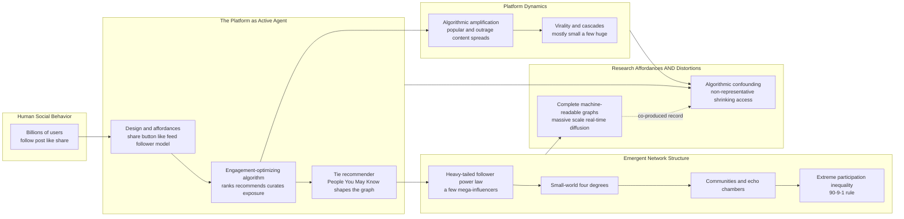

# 📱 Online Social Networks and Platforms

> [!abstract] TL;DR
> The social networks that form on platforms like Facebook, Twitter/X, Instagram, TikTok, Reddit, and YouTube have revolutionized computational social science by exposing **complete, machine-readable social graphs and behavioral records at planetary scale** — revealing heavy-tailed (power-law) follower distributions, small-world structure, community/echo-chamber clustering, and extreme **participation inequality** (a tiny slice of influencers commanding most attention). But a platform is **not a neutral window** onto society: its **design** (share buttons, likes, the follower model) and its **engagement-optimizing algorithms** (the feed, the recommender, "People You May Know") actively **shape** the network and behavior they record — amplifying popular and emotional content, curating exposure, even recommending the ties themselves. So online data is **algorithmically confounded** (you measure the human-algorithm system, not "natural" behavior), non-representative, and increasingly access-restricted. Because these platforms now mediate public discourse, news, mobilization, polarization, and misinformation, studying online networks is essential both to social science and to governing the platformed public sphere.

---

## Intuition

**Analogy:** For the first time in human history, a huge fraction of social life happens in a place where **everything is recorded** and where **an algorithm decides what you see**. Imagine a city square where every conversation, handshake, and rumor is written into an indelible ledger — the social scientist's impossible dream, a complete transcript of who talks to whom. But now imagine the square is not open air: it is a building owned by a company, and between you and the crowd stands a curator who quietly rearranges the room — pushing the loudest voices to the front, seating you next to people who will keep you there longest, and amplifying whatever makes you gasp. You are watching real human society, and you are watching a machine reshape it, **at the same time and through the same glass.**

That double nature is the whole subject. Online platforms are simultaneously the empirical windfall that drove the network-science revolution — a machine-readable record of billions of friendships, follows, messages, and shares — **and** a hall of mirrors, because the platform is an *active agent* in producing the behavior it logs. Its recommendation algorithm curates your feed, its interface nudges your clicks, and its incentive to sell attention rewards outrage. Studying online networks therefore means studying two things fused into one: **society, and the machine reshaping it.**

---

## How It Works

### Why online networks changed the field

Before platforms, network science ran on tiny, hand-collected samples: a sociologist would ask 30 monks who they trusted, or mail Milgram's letters and hope a few came back. Online platforms detonated that constraint. They deliver **complete** networks (the *entire* follower or friendship graph, not a name-generator survey of a few ties), at **massive scale** (billions of nodes), with **rich** data (the ties *plus* the content, the timing, and the downstream behavior), in **real time**, and — crucially — with the ability to observe **diffusion, influence, and collective behavior directly** as they unfold. This is why online platforms have been called "the largest social experiment in history" and the single biggest driver of the computational-social-science network turn. The same repurposing of behavioral exhaust is the theme of the sibling note *Digital_Traces_and_Found_Data*.

### The recurring structure of online graphs

Measure enough online networks and the same fingerprints keep appearing:

1. **Heavy-tailed (power-law) degree.** Follower counts are wildly unequal — a few mega-hubs (celebrities, influencers, brands) and an enormous long tail of ordinary accounts. This is the **rich-get-richer / preferential-attachment** pattern of [[Small_World_and_Scale_Free_Networks]]: new users follow accounts that are *already* popular, so the popular grow fastest.
2. **Small-world.** Despite billions of nodes, paths are startlingly short. Backstrom et al. (2012) measured the whole Facebook graph and found roughly **"four degrees of separation,"** tighter even than Milgram's famous six.
3. **High clustering and community structure.** Ties bundle into dense interest groups and ideological clusters — the structural substrate of **echo chambers** and the concern of the not-yet-written sibling *Misinformation_Polarization_and_the_Online_Public_Sphere*.
4. **Directed asymmetry.** On Twitter/X, Instagram, or TikTok you can follow without being followed back. The graph is *directed*, and in-degree (followers) is far more skewed than out-degree — attention flows one way toward hubs.
5. **Extreme participation inequality.** A tiny fraction of users create most of the content while the vast majority **lurk** — the "1 percent rule" or **90-9-1 rule**: about 90 percent lurk, 9 percent occasionally engage, 1 percent create. Attention is a scarce resource, and it is captured by a handful of **influencers**.

### The twist: design and algorithms shape the record

Here is what separates an online network from a naturally occurring one. The graph and the behavior are **co-produced by users and the platform**. Two levers do this:

- **Design / affordances.** The retweet and share buttons, the like counter, the character limit, the follower model, the infinite scroll — these are not neutral. They make some actions one tap easy and others impossible, and "the medium shapes the message."
- **Algorithms.** The ranking/feed algorithm decides *what you see*; the recommender ("People You May Know," "Suggested for You") decides *whom you connect to* — literally editing the network itself. Modern feeds are tuned to **maximize engagement**, which systematically **amplifies already-popular, high-arousal, and emotionally provocative (often outrage) content**, producing rich-get-richer virality and, potentially, polarization. The machinery is the same recommender technology covered in [[Recommendation_System]].

### The consequence for research: confounding, coverage, access

Because the algorithm shapes the behavior you observe, online data is **algorithmically confounded** — a spike in retweets may reflect a change to the ranking model, not a change in public opinion, so you are measuring the **human-algorithm system**, not "natural" human behavior. This is the central threat analyzed in the sibling *Measurement and Validity in Digital Data* (and confirmed in the vault). Compounding it: platform populations are **non-representative** ("Twitter is not America"; each platform is a different population), and researcher **access is shrinking** — post-Cambridge-Analytica API lockdowns and corporate gatekeeping created a "data divide" that makes independent study of the platforms that dominate social life harder every year.

### Flow / Architecture



The left-to-right flow is the promise: human behavior filtered through platform design and algorithms produces measurable structure and dynamics, which give researchers complete graphs at scale. The dotted return edge is the standing correction — that same record is co-produced by the machine, so every affordance the field exploits is also a distortion it must account for.

---

## Key Concepts

### Secondary

- **Online social network.** The web of connections you build on an app — your friends on Facebook, your followers on Instagram, the people you follow on TikTok. It is a real social network, just living inside a company's software.
- **The feed and the algorithm, plainly.** You do not see everything your friends post in the order they posted it. A computer program (the *algorithm*) picks and orders what shows up, usually to keep you scrolling. Turn it off and you get a plain time-ordered ("chronological") feed instead.
- **Followers and influencers.** A few accounts have millions of followers; most have a few dozen. Those rare huge accounts — the **influencers** — grab most of the attention. It is deeply unequal, like a stadium where a handful of people hold the microphones.
- **Lurkers and the 1 percent rule.** Most people mostly *watch* online without posting. A rough rule of thumb: 90 percent lurk, 9 percent comment occasionally, 1 percent create most of the content.
- **Going viral.** A post spreads when people share it, who then share it onward — a chain reaction. Most posts fizzle; a rare few explode to millions.

### Undergraduate

- **Preferential attachment on platforms.** New users disproportionately follow already-popular accounts, so follower counts follow a **power law** (heavy tail), not a bell curve — the online face of the Barabási-Albert mechanism in [[Small_World_and_Scale_Free_Networks]]. A tiny number of hubs hold a giant share of all follows.
- **Four degrees of separation.** Backstrom, Boldi, Rosa, Ugander & Vigna (2012) computed path lengths across the entire Facebook graph and found an average of about **4.7** — the online world is even *smaller* than Milgram's "six degrees."
- **Participation inequality (90-9-1).** Jakob Nielsen's rule and its many empirical confirmations: online contribution is grotesquely unequal. A handful of users produce most posts, edits (Wikipedia), reviews, and answers. Whose views get *seen* is therefore a highly filtered, non-representative slice.
- **Directed graphs and attention.** Following is asymmetric. In-degree (followers) is far more concentrated than out-degree (followees), so **attention** — not friendship — is the scarce, unequally distributed resource platforms allocate.
- **Chronological vs algorithmic feed.** A chronological feed shows posts in time order; an **engagement-optimizing** feed reorders them to maximize clicks, watch time, and shares. The switch (Instagram 2016, Twitter 2016) measurably changed what spread and how much.
- **The "medium shapes the message."** Affordances matter: adding a one-tap **retweet** button in 2009 made cascades vastly larger; a 280-character limit shapes discourse; infinite scroll and autoplay shape time-on-site. Design is a social force, not a backdrop.

### Graduate

- **Algorithmic confounding.** Because the ranking model curates exposure, the observed network and behavior are **endogenous to the platform**. A measured trend may be an artifact of an A/B test or a model change, not a social fact. Distinguishing user behavior from the system that records it is the field's core measurement-validity problem (see *Measurement and Validity in Digital Data* and Salganik's *Bit by Bit*). Trace-based longitudinal claims are invalid without accounting for product changes over the window.
- **The influentials debate (Watts-Dodds).** A tempting theory of virality says "seed the influencers and cascades follow." Watts & Dodds (2007) simulated and analyzed cascade formation and found that **large cascades are usually triggered not by exceptional influentials but by a critical mass of easily-influenced ordinary users** — virality is a property of the *network's global susceptibility*, hard to predict or engineer. Aral & Walker and later field studies refined but did not overturn the humility this imposes on "influencer marketing."
- **Cascade statistics.** Empirically, information cascades are **overwhelmingly small and shallow, with a heavy-tailed minority going huge** — the same power-law signature that governs the contagion in [[Network_Dynamics_and_Contagion]] and [[Cascades_and_Systemic_Risk]]. Goel, Watts & Goldstein showed most diffusion is a single hop from a broadcaster, not a deep multi-generation tree; true multi-step virality is rare.
- **Emotional and moral amplification.** Vosoughi, Roy & Aral (2018, *Science*) found **false news spreads farther, faster, and deeper than true news** on Twitter, driven by novelty and emotional response — and Brady et al. (2017) showed **moral-emotional ("outrage") language boosts diffusion within ideological groups**. Engagement optimization thus has a structural bias toward the provocative, with implications for polarization.
- **The n-is-all fallacy and non-representativeness.** Big-N is not big-representative (Tufekci, 2014, "Big Questions for Social Media Big Data"). Coverage error — who is *on* the platform, who is *active*, which behaviors the API exposes — dominates and is immune to sample size. Single-platform findings generalize poorly; different platforms are different social worlds.
- **The access and political-economy problem.** Independent research depends on data controlled by the firms under study. Post-2018 API restrictions, the shutdown of academic access tiers, and the "streetlight effect" (studying whichever platform grants access, usually pre-2023 Twitter) bias the entire literature — a structural threat linked to the *Ethics and Privacy in Computational Social Science* sibling.

---

## Python Demo

```python
# Online-network structure and platform dynamics, from scratch (numpy + matplotlib).
#
# PART A -- ONLINE FOLLOWER NETWORK via PREFERENTIAL ATTACHMENT.
#   New users follow accounts in proportion to how many followers they already
#   have ("rich get richer"), producing a heavy-tailed / power-law FOLLOWER
#   distribution: a few mega-influencers, a long tail of ordinary users. We then
#   quantify PARTICIPATION INEQUALITY with a Lorenz curve + Gini and the top-1%
#   attention share (the "1 percent rule").
#
# PART B -- ALGORITHMIC FEED EFFECT.
#   Each account posts one representative piece of content. A CHRONOLOGICAL feed
#   distributes exposure in proportion to reach (followers). An ENGAGEMENT-
#   OPTIMIZING feed instead amplifies content by engagement^alpha (rich-get-richer
#   virality) and gives an extra boost to "outrage/high-arousal" content. We show
#   the algorithm CONCENTRATES attention (higher Gini, bigger top-content share)
#   and reshapes WHAT spreads.
#
# numpy + matplotlib only -- no networkx.

import numpy as np
import matplotlib.pyplot as plt

rng = np.random.default_rng(11)

# ----------------------------------------------------------------------------
# PART A: grow a directed follower network by preferential attachment.
# in-degree of a node = its follower count.
# ----------------------------------------------------------------------------
def grow_follower_network(n, m, seed=0):
    r = np.random.default_rng(seed)
    followers = np.zeros(n, dtype=np.int64)
    pool = []                       # each id appears once per follower it has
    for i in range(m):              # seed: a small clique so the pool is nonempty
        followers[i] = 1
        pool.append(i)
    for new in range(m, n):         # each new user follows m existing accounts
        chosen = set()
        while len(chosen) < m:
            chosen.add(pool[r.integers(len(pool))])   # P(pick) ~ current followers
        for target in chosen:
            followers[target] += 1
            pool.append(target)     # weight target more heavily for the future
    return followers

N, M = 20000, 3
followers = grow_follower_network(N, M, seed=1)

def gini(x):
    x = np.sort(np.asarray(x, dtype=float))
    n = x.size
    idx = np.arange(1, n + 1)
    return (2.0 * np.sum(idx * x) / (n * x.sum())) - (n + 1.0) / n

def lorenz(x):
    xs = np.sort(np.asarray(x, dtype=float))
    cum = np.cumsum(xs)
    cum = np.insert(cum / cum[-1], 0, 0.0)          # cumulative share of attention
    p = np.linspace(0.0, 1.0, cum.size)             # cumulative share of users
    return p, cum

g_foll = gini(followers)
srt = np.sort(followers)[::-1]
top1_share = srt[: max(1, N // 100)].sum() / followers.sum()
print(f"[A] Followers: mean {followers.mean():.1f}   max {followers.max()}  (mega-influencer)")
print(f"[A] Gini of follower/attention distribution : {g_foll:.3f}")
print(f"[A] Share of ALL followers held by top 1% of accounts: {100*top1_share:.1f}%")

# ----------------------------------------------------------------------------
# PART B: algorithmic amplification vs a chronological feed.
# ----------------------------------------------------------------------------
reach = followers.astype(float) + 1.0                        # baseline reach ~ followers
engagement = rng.lognormal(mean=0.0, sigma=1.0, size=N)      # per-post engagement signal
is_outrage = rng.random(N) < 0.10                            # 10% high-arousal / outrage
engagement[is_outrage] *= 4.0                                # outrage draws more engagement

# Chronological: exposure proportional to reach only (time-ordered, no ranking).
expo_chrono = reach / reach.sum()

# Algorithmic: engagement-optimizing feed amplifies popular + high-engagement posts.
alpha = 1.8                                                  # amplification exponent > 1
score = reach * engagement**alpha
expo_algo = score / score.sum()

g_chrono, g_algo = gini(expo_chrono), gini(expo_algo)

def top_frac_share(share, frac):
    s = np.sort(share)[::-1]
    return s[: max(1, int(frac * s.size))].sum()

print(f"[B] Exposure Gini  chronological {g_chrono:.3f}  ->  algorithmic {g_algo:.3f}")
print(f"[B] Top 1% of posts capture: chrono {100*top_frac_share(expo_chrono,0.01):.1f}% "
      f" ->  algo {100*top_frac_share(expo_algo,0.01):.1f}%")
outrage_amp = expo_algo[is_outrage].sum() / expo_chrono[is_outrage].sum()
print(f"[B] Outrage content's share of exposure is amplified {outrage_amp:.2f}x by the algorithm")

# ----------------------------------------------------------------------------
# FIGURE: 2x2 -- structure (A) and platform effect (B)
# ----------------------------------------------------------------------------
fig, ax = plt.subplots(2, 2, figsize=(13, 10))

# (A1) follower distribution on log-log -> power law -------------------------
counts = np.bincount(followers)
k = np.nonzero(counts)[0]
pk = counts[k] / counts.sum()
k = k[k > 0]; pk = pk[-k.size:]
ax[0, 0].loglog(k, pk, "o", ms=4, color="#c0392b", label="follower distribution")
kk = np.array([M, k.max()], dtype=float)
ax[0, 0].loglog(kk, pk[0] * (kk / M) ** -3.0, "k--", lw=1.4, label="slope -3 (power law)")
ax[0, 0].set_title("(A) Online follower distribution\nheavy-tailed: a few mega-influencers")
ax[0, 0].set_xlabel("follower count k"); ax[0, 0].set_ylabel("P(k)")
ax[0, 0].legend(fontsize=8); ax[0, 0].grid(True, which="both", alpha=0.3)

# (A2) Lorenz curve of attention + Gini -> participation inequality -----------
p, cum = lorenz(followers)
ax[0, 1].plot(p, cum, color="#8e44ad", lw=2, label=f"followers (Gini={g_foll:.2f})")
ax[0, 1].plot([0, 1], [0, 1], "k--", lw=1, label="perfect equality")
ax[0, 1].fill_between(p, cum, p, color="#8e44ad", alpha=0.15)
ax[0, 1].set_title("(A) Participation inequality\ntop 1% hold "
                   f"{100*top1_share:.0f}% of all attention")
ax[0, 1].set_xlabel("cumulative share of users")
ax[0, 1].set_ylabel("cumulative share of attention")
ax[0, 1].legend(fontsize=8)

# (B1) sorted exposure share per post: chronological vs algorithmic -----------
sc = np.sort(expo_chrono)[::-1]
sa = np.sort(expo_algo)[::-1]
rank = np.arange(1, N + 1)
ax[1, 0].loglog(rank, sc, color="#2471a3", lw=2, label="chronological feed")
ax[1, 0].loglog(rank, sa, color="#e67e22", lw=2, label="algorithmic feed")
ax[1, 0].set_title("(B) Algorithmic amplification\nrich-get-richer: top posts get even more")
ax[1, 0].set_xlabel("content rank (most exposed first)")
ax[1, 0].set_ylabel("share of total exposure")
ax[1, 0].legend(fontsize=8); ax[1, 0].grid(True, which="both", alpha=0.3)

# (B2) cumulative exposure captured by top-x% of content ----------------------
def cum_top_curve(share):
    s = np.sort(share)[::-1]
    return np.cumsum(s)
fr = rank / N
ax[1, 1].plot(fr, cum_top_curve(expo_chrono), color="#2471a3", lw=2,
              label=f"chronological (Gini={g_chrono:.2f})")
ax[1, 1].plot(fr, cum_top_curve(expo_algo), color="#e67e22", lw=2,
              label=f"algorithmic (Gini={g_algo:.2f})")
ax[1, 1].axvline(0.01, color="0.5", ls=":", lw=1)
ax[1, 1].set_title("(B) Platform algorithm concentrates attention\nexposure captured by top content")
ax[1, 1].set_xlabel("top fraction of content")
ax[1, 1].set_ylabel("cumulative share of exposure")
ax[1, 1].set_xlim(0, 0.2); ax[1, 1].legend(fontsize=8)

plt.tight_layout()
plt.show()
```

**What the demo shows (and what it hides).**

- **Panel A1** — the follower distribution falls along a straight downward line on log-log axes, hugging the `slope -3` reference: the **power-law fingerprint** produced purely by preferential attachment. A handful of accounts reach into the thousands of followers while most sit in the single digits.
- **Panel A2** — the Lorenz curve bows far below the equality diagonal, with a Gini typically near 0.6-0.7 and the **top 1 percent of accounts holding a large share of all attention**: the structural "1 percent rule," online voice concentrated in a few hands.
- **Panels B1-B2** — swapping a chronological feed for an **engagement-optimizing** one lifts the exposure Gini and lets the top slice of content capture a *much* larger share (the orange curve rises above the blue), while the printout shows outrage content's exposure amplified several-fold. The algorithm did not change the users; it changed **what they saw and what spread** — the rich-get-richer virality that makes online data a record of the *human-algorithm system*, not human behavior alone.
- **The limitation, made concrete.** The model treats "engagement" as a given signal, but on a real platform that signal is itself shaped by prior algorithmic exposure — a feedback loop this static demo cannot capture. That circularity *is* algorithmic confounding: cause and measurement are entangled.

---

## Real-World Applications

> **Understanding information and misinformation spread.** Twitter/X and Facebook cascade data drive research on how (mis)information diffuses — Vosoughi, Roy & Aral (2018) showed false news outruns true news — informing platform interventions (labels, friction, downranking) and the not-yet-written sibling *Misinformation_Polarization_and_the_Online_Public_Sphere*.

> **Polarization and echo chambers.** Community-detection on follower/retweet graphs (Cinelli et al., 2021; Bakshy, Messing & Adamic, 2015) quantifies ideological segregation and how much of it is user homophily versus algorithmic curation — central to debates over filter bubbles and to the design of depolarizing interventions.

> **Social movements and mobilization.** Network analysis of hashtag campaigns — the Arab Spring, #MeToo, #BLM — maps how protest coordination, framing, and recruitment propagate through follower networks, connecting to [[Media_Propaganda_and_Political_Communication]] and the sociology of collective action.

> **Viral marketing and influencer strategy.** Firms model follower power-laws and cascade dynamics to target seeding — tempered by the Watts-Dodds finding that virality is hard to engineer, so "spray-and-pray" broadcast plus many small influencers often beats betting on a few mega-hubs.

> **Public health and civic messaging.** Platforms and agencies use online-network structure to target vaccination, cessation, and crisis communication, and to detect emerging health rumors — the platform analogue of the digital-epidemiology work built on [[Digital_Traces_and_Found_Data]].

> **Platform governance and algorithmic accountability.** Content-moderation policy, recommender audits, and regulation (the EU Digital Services Act's data-access provisions) all depend on measuring how design and ranking shape the online public sphere.

---

## Common Pitfalls

- **Treating the platform as a neutral window.** The single biggest error. The feed algorithm, the recommender, and the affordances **co-produce** the behavior you observe. Any claim about "what people do online" is really a claim about what people do *on this platform, under this algorithm, this year* — see *Measurement and Validity in Digital Data*.
- **Ignoring algorithmic confounding.** A change in a metric may be a change in the *model*, not in society. Longitudinal and A/B-contaminated data require explicit accounting for product changes; otherwise you measure the engineer, not the user.
- **The "n = all" illusion.** A billion tweets still represent only tweeters. Coverage error dominates and is immune to sample size; "Twitter is not America," and no platform is a random sample of humanity.
- **Single-platform generalization.** Findings on pre-2023 Twitter (studied because its API was open — the "streetlight effect") transfer poorly to TikTok, WhatsApp, or Reddit, which have different populations, affordances, and dynamics.
- **Assuming influencers cause virality.** The intuitive "seed the big accounts" theory fails as often as it works (Watts-Dodds). Large cascades usually depend on a globally susceptible network, not an exceptional seed; virality is emergent and hard to predict.
- **Mistaking engagement for endorsement or importance.** A viral post is not a representative or true one — the algorithm selects for arousal, not accuracy. Amplification is a property of the ranking objective, not of social significance.
- **Reifying "anonymized" platform data.** Follower graphs and interaction logs are high-dimensional and re-identifiable; access agreements and privacy protections, not naive scrubbing, are required (the *Ethics and Privacy* sibling).

---

## Related Concepts

- [[Digital_Traces_and_Found_Data]] — online platforms are the richest source of found behavioral data; this note zooms into the *network* structure of that exhaust and the algorithm that shapes it.
- [[Digital_Society_and_Online_Communities]] — the sociological treatment of platform society, datafication, surveillance capitalism, and online community; this note is the CSS / network-science complement (structure, power-laws, algorithmic dynamics).
- [[Small_World_and_Scale_Free_Networks]] — supplies the mechanism (growth + preferential attachment) behind heavy-tailed follower distributions and the small-world "four degrees" of online graphs.
- [[Network_Dynamics_and_Contagion]] — the diffusion and cascade dynamics (contagion thresholds, complex contagion) that govern how content and behavior spread through online networks.
- [[Cascades_and_Systemic_Risk]] — the heavy-tailed cascade-size statistics (mostly small, a few enormous) and tipping dynamics that describe viral spread on platforms.
- [[Recommendation_System]] — the algorithmic machinery of the feed and "People You May Know" that curates exposure and even recommends the ties, the engine of algorithmic confounding.
- [[Media_Propaganda_and_Political_Communication]] — the political-communication stakes of platform-mediated discourse: agenda-setting, mobilization, and manipulation in the online public sphere.
- [[Economic_Networks_and_Interaction_Structure]] — the complexity-economics view of interaction networks, sharing the heavy-tailed, hub-dominated structure seen in follower graphs.
- [[Power_Laws_and_Heavy_Tails_in_Economics]] — the same power-law statistics (and their statistical pitfalls) that describe follower counts, cascade sizes, and attention concentration.

*Sibling notes in this section (to be written): Social_Network_Analysis_Foundations, Centrality_Community_and_Structure, Contagion_and_Diffusion_in_Social_Networks, Homophily_Selection_and_Influence, Misinformation_Polarization_and_the_Online_Public_Sphere.*

---

## Review Questions

**Secondary**

1. A friend says social media "just shows you what your friends post." Explain, in your own words, what an algorithmic feed does differently from a chronological one, and give one everyday consequence of the difference.
2. Online activity follows a "90-9-1" pattern. Explain what that means and why it implies that the opinions you see online may not represent most people.

**Undergraduate**

3. Follower counts on Twitter/X follow a power law rather than a bell curve. Explain the mechanism (preferential attachment) that produces this, and describe one consequence for how attention is distributed on the platform.
4. A brand wants to make a campaign "go viral" by paying the ten biggest influencers to post it. Using the Watts-Dodds influentials debate and what is known about cascade sizes, explain why this strategy is riskier than it sounds and what an alternative approach might be.

**Graduate**

5. A researcher observes that "political outrage on Platform X doubled over the past year" using raw engagement data. Diagnose why this claim may be invalid using the concept of *algorithmic confounding*, and design a study (data, controls, comparisons) that could distinguish a genuine rise in outrage from an artifact of algorithm changes.
6. You are asked to estimate national public opinion on a policy from Twitter/X data. Identify the representativeness and access problems involved, explain why a larger sample of tweets does not fix them, and propose two concrete steps to make the estimate more defensible.

---

## Sources

- [Lazer, D., Pentland, A., Adamic, L., et al. (2009). "Computational Social Science." *Science*, 323(5915), 721–723.](https://doi.org/10.1126/science.1167742) — the field-defining manifesto, with online networks as a core data source.
- [Backstrom, L., Boldi, P., Rosa, M., Ugander, J., & Vigna, S. (2012). "Four Degrees of Separation." *Proc. 4th ACM Web Science Conf.*](https://doi.org/10.1145/2380718.2380723) — the entire Facebook graph is a small world with average distance ~4.7.
- [Watts, D. J., & Dodds, P. S. (2007). "Influentials, Networks, and Public Opinion Formation." *Journal of Consumer Research*, 34(4), 441–458.](https://doi.org/10.1086/518527) — large cascades are usually driven by susceptible masses, not exceptional influentials.
- [Vosoughi, S., Roy, D., & Aral, S. (2018). "The spread of true and false news online." *Science*, 359(6380), 1146–1151.](https://doi.org/10.1126/science.aap9559) — false news spreads farther, faster, and deeper than true news.
- [Tufekci, Z. (2014). "Big Questions for Social Media Big Data: Representativeness, Validity and Other Methodological Pitfalls." *ICWSM*.](https://doi.org/10.1609/icwsm.v8i1.14517) — the representativeness, sampling, and algorithmic-confounding critiques of platform data.
- [Salganik, M. (2018). *Bit by Bit: Social Research in the Digital Age.* Princeton University Press.](https://www.bitbybitbook.com/) — the canonical treatment of algorithmic confounding, drift, and found-data research design.

---

#computational-social-science #online-social-networks #platforms #algorithms #social-media
