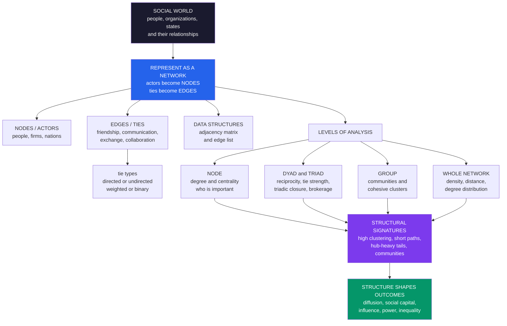

# 🕸️ Social Network Analysis — Foundations

> [!abstract] TL;DR
> **Social network analysis (SNA)** studies society as a **web of relationships** — representing social actors (people, organizations, states) as **nodes** and their relationships (friendship, communication, collaboration, exchange) as **edges/ties**, then analyzing the resulting **structure** and its consequences. Its defining move is a **paradigm shift**: from **attribute-based** explanation (outcomes flow from individuals' characteristics — age, income, attitudes) to **relational / structural** explanation (outcomes flow from your **position** and **connections** in the network), on the premise that *"it's not what you know, it's who you know."* Built on graph-theoretic fundamentals — **degree** (connectivity), **paths and distance** (geodesics, "six degrees"), **density** (interconnection), **components**, and **clustering / triadic closure** ("the friend of my friend is my friend") — SNA analyzes structure at multiple **levels** (node, dyad, triad, community, whole network) and reveals the distinctive **structural signatures** of real social networks: **high clustering**, **short paths** (small-world), **heavy-tailed** degree distributions (a few **hubs**), and **community** structure. That structure is not decorative — it **drives outcomes**: **diffusion** of information and disease, **social capital** and advantage (brokerage across **structural holes**), **influence**, **cooperation**, and **inequality**. With deep roots in sociology (Moreno's sociometry, Granovetter, Harrison White) and now supercharged by **big network data** from digital platforms, SNA is a foundational, cross-domain method of computational social science spanning epidemiology, organizations, politics, marketing, and online platforms.

---

## Intuition

**Analogy:** Imagine you want to understand a single person. You could study them **in isolation** — their traits, their skills, their choices, their attitudes. That is how much of social science has traditionally worked: explain the person by their *attributes*. But stop and ask where the most consequential things in your life actually came from. The job you got through a **friend of a friend**. The flu you caught from a **contact on a crowded train**. The opinion you absorbed, almost without noticing, from **the people around you**. The promotion you won because you happened to sit **between two teams that needed each other**. None of these live *inside* you. They live in the **connections between people** — in the shape of the web you are embedded in.

Social network analysis **flips the lens**. Instead of asking "what is this person *like*?" it asks "**where is this person *situated*?**" — who are they tied to, how are those ties arranged, and what does their position let them reach, block, broker, or catch. The claim is bracing: **structure, not just attributes, is destiny.** Two people with identical résumés can have wildly different fortunes because one sits at a crossroads of information and the other in a cul-de-sac. SNA is, quite literally, the **mathematics of "it's not what you know, it's who you know."** Turn society into a graph of nodes and ties, and a whole layer of causation — invisible to a survey of individuals — suddenly comes into focus.

---

## How It Works

Social network analysis is a **method and a theory at once**. The *method* is to formalize a social system as a **graph** and compute structural measures on it. The *theory* — the **relational** or **structural** perspective — is the substantive claim that this structure *matters*, that position and connection explain behavior, opportunity, and outcomes as much as (or more than) individual attributes. Granovetter's idea of **embeddedness** captures the spirit: economic and social action is not carried out by atomized individuals but is **embedded in ongoing networks of social relations**.

### From attributes to relations

Classical social science is **attribute-based**: it arranges people in a spreadsheet — one row per person, columns for age, income, education, opinions — and explains outcomes with those columns. SNA adds a second, orthogonal kind of data: **relational data**, which is not about individuals but about the **pairs between them** — who is tied to whom. This is why network data cannot be stored as a simple case-by-variable table; it needs a structure that records **relationships**. The payoff is that you can now ask questions no attribute table can answer: *Is this person a bridge between otherwise-separate groups? Do their friends know each other? How many steps separate any two people? Which cluster do they belong to?*

### Representing a network

- **Nodes (vertices, actors).** The social units — people, firms, states, web pages, neurons. In SNA they are **actors**.
- **Edges (ties, relations).** The relationships — friendship, advice, communication, money, collaboration, following. Ties can be:
  - **Directed** (asymmetric): *A follows B*, *A gives advice to B* — the relation has a sender and receiver. Or **undirected** (symmetric): *A and B are friends* — the tie is mutual.
  - **Weighted** (tie strength: frequency, closeness, volume) or **binary** (present/absent).
  - **Multi-relational**: the same actors can be connected by several kinds of tie at once (friendship *and* kinship *and* co-work).
- **Data structures.** Two canonical formats: the **adjacency matrix** `A` — an `N × N` grid where `A[i,j] = 1` (or a weight) if `i` is tied to `j` — which is compact for dense graphs and lets you use **linear algebra** on networks; and the **edge list** — a simple two-column list of tied pairs — which is efficient for the **sparse** networks typical of real social systems. This is exactly the machinery of [[Graph_Theory]] applied to society.

### Core structural concepts

The vocabulary of network structure — the fundamentals every SNA rests on:

1. **Degree** — the number of ties a node has; its connectivity, activity, or (for directed graphs) **in-degree** (popularity / prestige) versus **out-degree** (expansiveness). The single most basic measure of a node's involvement.
2. **Paths and distance** — a **path** is a sequence of ties connecting two actors; the **geodesic** is the *shortest* such path, and its length is the **distance**. The famous *"six degrees of separation"* is a claim about typical geodesic distances in the human acquaintance network.
3. **Density** — the fraction of *possible* ties that are actually present. A fully connected group has density 1; most real networks are extremely **sparse** (density near zero), which is itself a structural fact.
4. **Components** — maximal sets of nodes all reachable from one another. Most large social networks have one **giant component** plus small fragments and isolates.
5. **Clustering / transitivity** — do your friends know each other? **Triadic closure** is the strong tendency, in social networks, for two people with a friend in common to become friends themselves — *"the friend of my friend is my friend."* It produces **high clustering**, a signature that sharply distinguishes social networks from random graphs.

### Levels of analysis

The same network yields insight at **every scale**, and choosing the right level is half the craft:

- **Node level** — a single actor's **position**: its **centrality** (importance/influence). Different centralities answer different questions — degree (connectedness), betweenness (brokerage/gatekeeping), closeness (reach), eigenvector/PageRank (connected-to-the-connected). *(Developed in the sibling note [[Centrality_and_Community_Structure]] and this section's* Centrality_Community_and_Structure*.)*
- **Dyad level** — **pairs**: is the tie **reciprocated**? How **strong** is it?
- **Triad level** — **triples**: **balance**, **closure**, and **brokerage**. Georg Simmel first noted that the triad is qualitatively different from the dyad — a third party enables mediation, coalition, and *tertius gaudens* ("the third who benefits").
- **Subgroup level** — **communities**: densely connected clusters loosely tied to the rest, detected algorithmically (modularity, spectral, label-propagation methods).
- **Whole-network level** — **global** structure: density, degree distribution, average path length, centralization, small-world-ness.

### The structural signatures of real social networks

Real social networks look nothing like **random** graphs. They share a recurring fingerprint:

- **High clustering** — from triadic closure; far more triangles than chance predicts.
- **Short average paths** — the **small-world** phenomenon (Milgram's letters, Watts–Strogatz), captured in the vault by [[Small_World_and_Scale_Free_Networks]].
- **Heavy-tailed degree distributions** — a few enormously connected **hubs** among many low-degree nodes, roughly **scale-free**, generated by **preferential attachment** ("the rich get richer"); this links to [[Power_Laws_and_Heavy_Tails_in_Economics]].
- **Community structure** — dense clusters, often produced by **homophily** ("birds of a feather"), the tendency to tie to similar others.
- **Core–periphery structure** — a densely interconnected core surrounded by a loosely attached periphery.

### Why structure matters — the substantive payoff

This is the point of it all. Network structure is a **cause** of social outcomes:

- **Diffusion** — how information, disease, and behavior spread depends on structure: hubs accelerate epidemics, bridges carry novelty, clustering can trap or amplify contagion *(this section's* Contagion_and_Diffusion_in_Social_Networks*)*.
- **Social capital and advantage** — your position confers resources. Ronald **Burt** showed that spanning **structural holes** — brokering between otherwise-disconnected groups — yields information and control advantages *(this section's* The_Strength_of_Weak_Ties_and_Social_Capital*)*.
- **Influence and power** — central actors are disproportionately influential; power is partly a property of position, not personality.
- **Cooperation** — network structure can sustain or undermine cooperation, a theme SNA shares with [[Spatial_and_Network_Games]].
- **Inequality** — unequal network position translates into unequal outcomes, compounding over time.

### Structure, in one picture



---

## Key Concepts

### Secondary Level

**A map of people, not a list of people.** Usually when we describe a group, we list what each person is *like* — their age, their grades, their hobbies. Social network analysis draws a **map instead**: a dot for each person and a **line between any two people who are connected** (friends, texting, teammates). Then it studies the **shape of the map**.

**Why the map matters.** The map reveals things a list never could:

| Question the map answers | What it is called |
|---|---|
| Who has the most friends? | **Degree** (most connected) |
| Who is the "bridge" between two groups? | **Betweenness** (broker) |
| How many friend-hops between any two people? | **Distance** ("six degrees") |
| Do my friends know each other? | **Clustering** (friend-of-a-friend) |
| Which people clump together? | **Community** |

**The big idea.** So much of your life is decided by **where you are on the map** — the job you hear about, the rumor you catch, the crowd you copy — not just by who *you* are. That is why "it's not *what* you know, it's *who* you know."

### Undergraduate Level

#### The relational paradigm shift

The intellectual core of SNA is a move from **variable-centered** (attribute) explanation to **relation-centered** (structural) explanation. Where standard regression asks *"which individual characteristics predict the outcome?"*, network analysis asks *"which features of a person's position and the network's shape predict the outcome?"* These are complementary, but the relational view repeatedly finds that **structure explains variance attributes miss** — most famously in Granovetter's *The Strength of Weak Ties*, where people found jobs not through close friends (strong ties, redundant information) but through **acquaintances** (weak ties spanning into other social worlds).

#### The formalism, made precise

A network is a graph `G = (V, E)`: a set of **vertices** `V` (actors) and **edges** `E` (ties). Encode it as an **adjacency matrix** `A` where `A[i,j]` records the tie from `i` to `j`. For an **undirected** graph `A` is symmetric; for a **directed** one it need not be. Elegant facts fall out of the matrix:

- **Degree** of node `i` is the row sum `sum_j A[i,j]`.
- The `(i,j)` entry of `A²` counts **paths of length 2** from `i` to `j`; of `A³`, paths of length 3 — so the **diagonal of `A³`** counts each node's **triangles** (times two), the basis of clustering.
- **Density** is `2E / (N(N−1))` for an undirected simple graph.
- The **graph Laplacian** `L = D − A` (with `D` the diagonal degree matrix) has an eigenvector — the **Fiedler vector** — whose sign **partitions the graph into communities**.

#### The three canonical questions

Most applied SNA reduces to three questions at three levels:

1. **Who is important?** — **Centrality**. Degree (activity), **betweenness** (how many shortest paths run *through* you — brokerage/gatekeeping), closeness (how quickly you reach everyone), and **eigenvector/PageRank** (importance from being tied to important others).
2. **Who clusters together?** — **Community detection**. Partition nodes into densely-connected groups, typically by maximizing **modularity** (more within-group ties than expected by chance).
3. **How does the whole thing hang together?** — **Global structure**. Density, average path length, degree distribution, connectedness, small-world and scale-free character.

#### Homophily, closure, and where structure comes from

Two engines generate the signatures of social networks: **triadic closure** (friends-of-friends connect, producing clustering) and **homophily** (similar people connect, producing communities). Both are studied in this section's *Homophily_Selection_and_Influence*, which confronts the hard identification problem — did your friends make you similar (**influence**) or did being similar make you friends (**selection/homophily**)? — a confound that haunts all observational network research.

### Graduate Level

#### Boundary specification and the sampling problem

The deepest methodological difficulty in SNA is **not** computing measures — it is **defining the network**. The **boundary specification problem** (Laumann, Marsden, Prensky): who counts as a member, and which relations count? Unlike a survey where you can sample individuals independently, **networks resist sampling** — a random sample of *nodes* destroys the very structure you want (you lose most edges), and **missing ties** and **missing nodes** bias structural measures nonlinearly. Betweenness and path-based measures are especially fragile to missing data. **Name generators** ("list up to five people you discuss important matters with") impose artificial degree ceilings; **fixed-choice** designs distort degree distributions. Digital trace networks trade these for new problems: an **email/phone/follower** graph is a *proxy* for a social relation, shaped by the platform, not a clean measurement of "friendship."

#### The measurement-theory divide: which centrality, and why

There is no single "importance." Each centrality encodes a **theory of how something flows** through the network (Borgatti's *flow model*): degree suits parallel duplication (like a broadcast), **closeness** suits things that travel by shortest paths, **betweenness** suits **serial, non-duplicating** flows where you can **intercept or broker** (goods, brokered deals, gatekept information), and **eigenvector/Katz/PageRank** suit **walk-based** influence that reflects off the whole structure. Choosing a centrality without specifying the substantive process is a common — and consequential — error, because the rankings they produce can disagree sharply.

#### Statistical models of tie formation

Descriptive measures do not tell you *why* ties form or let you test hypotheses while controlling for dependence between edges — and edges are **not independent** (my tie to you and my tie to her are correlated through closure). This motivates **statistical network models**: **Exponential Random Graph Models (ERGMs / p\*)** model the probability of the *whole observed graph* as a function of local configurations (edges, reciprocity, triangles, homophily terms), letting you ask "is there *more* triadic closure than chance, net of homophily?"; and **Stochastic Actor-Oriented Models (SAOMs / SIENA)** model network *dynamics* over time to disentangle **selection from influence**. Both grapple with **degeneracy**, estimation difficulty, and the fundamental non-independence of relational data.

#### Position, structure, and the theoretical stakes

At the frontier sit ideas about **structural equivalence** and **blockmodeling** (Lorrain and White): two actors are *equivalent* not if they are connected *to each other* but if they occupy the **same kind of position** — tied to the same others, or the same *types* of others (**regular equivalence**) — formalizing social **roles** from pure structure. This is the ambition Harrison **White** and the "Harvard breakthrough" pursued: to derive social **structure and role** from relational data alone. It closes the loop back to the founding claim — that a person's **position** in a web of relations is a real, measurable, causal social fact, on par with any attribute.

---

## Python Demo

```python
import numpy as np
import matplotlib
matplotlib.use("Agg")
import matplotlib.pyplot as plt
from collections import deque

# =====================================================================
# SOCIAL NETWORK ANALYSIS FROM SCRATCH (numpy + matplotlib).
#   Data: Zachary's KARATE CLUB if networkx is available, else a
#         synthetic social network with planted community structure.
#   (a) FUNDAMENTALS: degree distribution, density, average path length,
#       and CLUSTERING (transitivity) -> show clustering >> density,
#       i.e. TRIADIC CLOSURE, the fingerprint of real social networks;
#       identify high-degree HUBS.
#   (b) SUBSTANTIVE INSIGHT: compute BETWEENNESS (Brandes), then remove
#       high-betweenness "BRIDGE" nodes and watch the giant component
#       FRAGMENT far faster than under random removal -> brokers matter.
#   All metrics are pure-numpy so results are deterministic.
# =====================================================================
rng = np.random.default_rng(7)

# ---------------------------------------------------------------------
# BUILD THE NETWORK  (real if networkx present, else synthetic)
# ---------------------------------------------------------------------
try:
    import networkx as nx
    G = nx.karate_club_graph()
    N = G.number_of_nodes()
    A = nx.to_numpy_array(G, nodelist=range(N)).astype(int)
    layout = {i: p for i, p in nx.spring_layout(G, seed=3).items()}
    pos = np.array([layout[i] for i in range(N)])
    net_name = "Zachary's Karate Club (real social network, 34 actors)"
except Exception:
    # Stochastic block model: 3 dense communities, sparse between-ties.
    sizes = [12, 11, 11]
    N = sum(sizes)
    grp = np.concatenate([[k] * s for k, s in enumerate(sizes)])
    p_in, p_out = 0.45, 0.03
    A = np.zeros((N, N), dtype=int)
    for i in range(N):
        for j in range(i + 1, N):
            p = p_in if grp[i] == grp[j] else p_out
            if rng.random() < p:
                A[i, j] = A[j, i] = 1
    net_name = f"Synthetic social network ({N} actors, 3 communities)"
    pos = None  # filled by spectral layout below

deg = A.sum(axis=1)

# ---------------------------------------------------------------------
# STRUCTURAL FUNDAMENTALS (pure numpy)
# ---------------------------------------------------------------------
def density(A):
    n = A.shape[0]
    return A.sum() / (n * (n - 1))          # undirected: sum counts both dirs

def bfs_dist(A, s):                          # shortest-path distances from s
    n = A.shape[0]
    dist = np.full(n, -1)
    dist[s] = 0
    q = deque([s])
    while q:
        u = q.popleft()
        for v in np.where(A[u] == 1)[0]:
            if dist[v] < 0:
                dist[v] = dist[u] + 1
                q.append(v)
    return dist

def avg_path_length(A):                       # over reachable pairs
    tot = cnt = 0
    for s in range(A.shape[0]):
        d = bfs_dist(A, s)
        reach = d[d > 0]
        tot += reach.sum(); cnt += reach.size
    return tot / cnt

def transitivity(A):                          # global clustering coefficient
    tri = np.trace(A @ A @ A) / 6.0           # closed triangles
    d = A.sum(1)
    triples = np.sum(d * (d - 1)) / 2.0       # connected triples (paths len 2)
    return 3 * tri / triples if triples else 0.0

def avg_local_clustering(A):
    n = A.shape[0]; d = A.sum(1); cc = np.zeros(n)
    for i in range(n):
        if d[i] >= 2:
            nb = np.where(A[i] == 1)[0]
            links = A[np.ix_(nb, nb)].sum() / 2.0
            cc[i] = 2 * links / (d[i] * (d[i] - 1))
    return cc.mean()

def n_components(A):
    n = A.shape[0]; seen = np.zeros(n, bool); c = 0
    for s in range(n):
        if not seen[s]:
            seen[bfs_dist(A, s) >= 0] = True; c += 1
    return c

def giant_fraction(A):
    n = A.shape[0]; seen = np.zeros(n, bool); biggest = 0
    for s in range(n):
        if not seen[s]:
            comp = bfs_dist(A, s) >= 0
            seen |= comp; biggest = max(biggest, comp.sum())
    return biggest / n

dens = density(A)
apl = avg_path_length(A)
trans = transitivity(A)
loc = avg_local_clustering(A)

# ---------------------------------------------------------------------
# BETWEENNESS CENTRALITY  (Brandes' algorithm, unweighted)
# ---------------------------------------------------------------------
def betweenness(A):
    n = A.shape[0]
    adj = [np.where(A[i] == 1)[0] for i in range(n)]
    CB = np.zeros(n)
    for s in range(n):
        S = []
        P = [[] for _ in range(n)]
        sigma = np.zeros(n); sigma[s] = 1.0
        dist = np.full(n, -1); dist[s] = 0
        q = deque([s])
        while q:
            v = q.popleft(); S.append(v)
            for w in adj[v]:
                if dist[w] < 0:
                    dist[w] = dist[v] + 1; q.append(w)
                if dist[w] == dist[v] + 1:
                    sigma[w] += sigma[v]; P[w].append(v)
        delta = np.zeros(n)
        while S:
            w = S.pop()
            for v in P[w]:
                delta[v] += (sigma[v] / sigma[w]) * (1 + delta[w])
            if w != s:
                CB[w] += delta[w]
    return CB / 2.0                            # each pair counted twice

btw = betweenness(A)

# ---------------------------------------------------------------------
# SPECTRAL COMMUNITY DETECTION  (Fiedler vector of the Laplacian)
#   For the karate club this famously recovers the real faction split.
# ---------------------------------------------------------------------
L = np.diag(deg) - A
evals, evecs = np.linalg.eigh(L)
order = np.argsort(evals)
fiedler = evecs[:, order[1]]
community = (fiedler > 0).astype(int)
if pos is None:                                # spectral layout for synthetic
    pos = np.column_stack([evecs[:, order[1]], evecs[:, order[2]]])

# ---------------------------------------------------------------------
# SUBSTANTIVE EXPERIMENT: attack the network by removing nodes.
#   Compare removing high-BETWEENNESS bridges vs RANDOM nodes; track the
#   giant-component fraction. Faster collapse == brokers hold it together.
# ---------------------------------------------------------------------
def fragmentation_curve(A, order, K):
    frac = [giant_fraction(A)]
    Ar = A.copy()
    for k in range(K):
        v = order[k]
        Ar[v, :] = 0; Ar[:, v] = 0            # delete the node
        frac.append(giant_fraction(Ar))
    return np.array(frac)

K = min(8, N - 1)
btw_order = np.argsort(btw)[::-1]              # highest betweenness first
rnd_order = rng.permutation(N)
frac_btw = fragmentation_curve(A, btw_order, K)
frac_rnd = fragmentation_curve(A, rnd_order, K)

# ------------------------------- REPORT --------------------------------
hub = int(np.argmax(deg)); broker = int(np.argmax(btw))
print("=" * 66)
print("SOCIAL NETWORK ANALYSIS —", net_name)
print("=" * 66)
print(f"nodes                : {N}")
print(f"edges                : {A.sum() // 2}")
print(f"density              : {dens:.3f}   (fraction of possible ties)")
print(f"mean degree          : {deg.mean():.2f}")
print(f"avg path length      : {apl:.2f}   (short == small world)")
print(f"transitivity         : {trans:.3f}")
print(f"avg local clustering : {loc:.3f}")
print(f"  -> clustering ({trans:.2f}) >> density ({dens:.2f}): "
      f"TRIADIC CLOSURE, the social-network fingerprint")
print(f"top HUB (degree)     : node {hub} with degree {deg[hub]}")
print(f"top BROKER (between.) : node {broker} with betweenness {btw[broker]:.1f}")
print(f"removing {K} bridges  -> giant component {frac_btw[-1]:.0%} of network")
print(f"removing {K} random   -> giant component {frac_rnd[-1]:.0%} of network")

# ------------------------------- FIGURE --------------------------------
fig, axes = plt.subplots(2, 2, figsize=(14, 11))
fig.suptitle("Social Network Analysis: structure, hubs, and the power of "
             "bridges", fontsize=14, fontweight="bold")
cols = ["#dc2626", "#2563eb"]

# Panel A: the network, colored by community, sized by betweenness centrality
axA = axes[0, 0]
for i in range(N):
    for j in range(i + 1, N):
        if A[i, j]:
            axA.plot([pos[i, 0], pos[j, 0]], [pos[i, 1], pos[j, 1]],
                     color="#cccccc", lw=0.6, zorder=1)
sizes_plot = 60 + 900 * (btw / btw.max() if btw.max() > 0 else btw)
axA.scatter(pos[:, 0], pos[:, 1], s=sizes_plot,
            c=[cols[c] for c in community], edgecolors="black",
            linewidths=0.7, zorder=2)
axA.scatter(pos[broker, 0], pos[broker, 1], s=90, marker="*",
            c="#f5d90a", edgecolors="black", linewidths=0.8, zorder=3,
            label=f"top broker (node {broker})")
axA.set_title("(a) The social network\ncolor = community, "
              "size = betweenness centrality", fontsize=10)
axA.legend(fontsize=8, loc="upper right")
axA.set_xticks([]); axA.set_yticks([])

# Panel B: degree distribution (right-skewed -> a few hubs)
axB = axes[0, 1]
axB.hist(deg, bins=range(0, deg.max() + 2), color="#7c3aed",
         alpha=0.85, edgecolor="black")
axB.axvline(deg.mean(), color="#dc2626", ls="--", lw=1.8,
            label=f"mean degree = {deg.mean():.1f}")
axB.axvline(deg[hub], color="#059669", ls=":", lw=1.8,
            label=f"hub degree = {deg[hub]}")
axB.set_title("(b) Degree distribution\nright-skewed: a few hubs, "
              "many low-degree actors", fontsize=10)
axB.set_xlabel("degree (number of ties)"); axB.set_ylabel("count of actors")
axB.legend(fontsize=8); axB.grid(alpha=0.25)

# Panel C: clustering vs density -> triadic closure
axC = axes[1, 0]
bars = axC.bar(["density\n(random baseline)", "avg local\nclustering",
                "transitivity\n(global clustering)"],
               [dens, loc, trans],
               color=["#9ca3af", "#2563eb", "#7c3aed"], edgecolor="black")
for b, v in zip(bars, [dens, loc, trans]):
    axC.text(b.get_x() + b.get_width() / 2, v + 0.01, f"{v:.2f}",
             ha="center", fontsize=9)
axC.set_title("(c) Clustering  >>  density\nthe signature of TRIADIC CLOSURE",
              fontsize=10)
axC.set_ylabel("coefficient"); axC.set_ylim(0, max(trans, loc, dens) * 1.3)
axC.grid(alpha=0.25, axis="y")

# Panel D: bridge removal fragments the network faster than random removal
axD = axes[1, 1]
xs = range(K + 1)
axD.plot(xs, frac_btw, "-o", color="#dc2626", lw=2, ms=6,
         label="remove high-betweenness BRIDGES")
axD.plot(xs, frac_rnd, "-s", color="#2563eb", lw=2, ms=6,
         label="remove RANDOM nodes")
axD.fill_between(xs, frac_btw, frac_rnd, where=(frac_rnd >= frac_btw),
                 alpha=0.15, color="#dc2626")
axD.set_title("(d) Brokers hold the network together\ntargeting bridges "
              "fragments it fast", fontsize=10)
axD.set_xlabel("number of nodes removed")
axD.set_ylabel("fraction in giant component")
axD.set_ylim(0, 1.02); axD.legend(fontsize=8); axD.grid(alpha=0.25)

plt.tight_layout(rect=[0, 0, 1, 0.95])
plt.savefig("social_network_analysis_foundations.png", dpi=110,
            bbox_inches="tight")
plt.show()
```

**What the demo shows:**

- **Panel (a) — the network.** The social graph drawn with nodes **colored by detected community** (the Fiedler vector of the Laplacian; on the karate club this recovers the real split into two factions) and **sized by betweenness centrality**. The largest nodes are the **brokers** sitting on many shortest paths — structurally important even when they are not the highest-degree.
- **Panel (b) — degree distribution.** The **right-skewed** shape typical of social networks: most actors have a few ties, a handful of **hubs** have many. This skew is *why* "who is central?" is a substantive question rather than a formality.
- **Panel (c) — clustering >> density.** The decisive fingerprint. **Density** (the random-graph baseline) is low, yet **clustering** (transitivity and average local clustering) is several times higher — because friends-of-friends become friends. That gap **is** **triadic closure**, the feature that separates real social networks from random ones.
- **Panel (d) — brokers hold the network together.** Removing a handful of **high-betweenness bridge** nodes **shatters** the giant component far faster than removing the same number of **random** nodes. This is the substantive punchline of SNA: **position is power** — a few brokers spanning **structural holes** are load-bearing for the whole network's connectivity, information flow, and resilience.

Run it and read the console table (`density`, `avg path length`, `transitivity`, top hub, top broker): the numbers make concrete every fundamental defined above.

---

## Real-World Applications

> **Epidemiology and public health.** Disease spreads along **contact networks**, so SNA is central to modeling epidemics and designing interventions. Because degree distributions are heavy-tailed, **targeted** strategies — immunizing or isolating **hubs** and **bridges** rather than random individuals — are dramatically more efficient. Contact tracing, HIV/STI transmission networks, and COVID-19 mobility networks are all SNA in action, connecting to [[Network_Dynamics_and_Contagion]].

> **Organizations and knowledge flow.** The **informal** network of who-talks-to-whom often matters more than the org chart. SNA maps advice networks, collaboration, and information silos; identifies **brokers** who span departments (Burt's structural holes) and **bottlenecks**; and informs team design, leadership identification, and post-merger integration — extending [[Organizations_and_Formal_Structures]].

> **Marketing, diffusion, and influence.** Viral spread, word-of-mouth, and "influencer" seeding are network phenomena. Firms use centrality to find high-leverage seeds and community structure to target segments — the applied face of [[Diffusion_of_Innovations_and_Adoption_Dynamics]] and the classic Christakis–Fowler work on social contagion of behavior.

> **Politics, coalitions, and polarization.** SNA reveals legislative coalitions, donor networks, protest mobilization, and — on social media — the **community structure of polarization** (echo chambers as densely-clustered, weakly-bridged communities). It quantifies how information and misinformation traverse the online public sphere.

> **Crime, security, and covert networks.** Criminal and terrorist organizations are studied as networks where **removing high-betweenness brokers** can fragment operations — exactly the experiment in Panel (d). Financial-crime and fraud-ring detection rely on the same structural signatures.

> **Online platforms and the web.** Social-media graphs, follower networks, and the hyperlink web are giant social networks; **PageRank** is an eigenvector centrality on the web graph, and recommendation, community detection, and abuse-detection systems all run on SNA foundations — the substance of this section's *Online_Social_Networks_and_Platforms*.

---

## Common Pitfalls

- **Mistaking a network picture for analysis.** A force-directed drawing of a large graph is a **"hairball"** — visually striking, analytically empty, and easily manipulated by layout choices. Beautiful visualizations can *mislead*; the rigor is in the **measures** (centrality, clustering, community modularity), not the pretty picture. Always pair a plot with numbers.
- **Choosing a centrality without a theory of flow.** Degree, betweenness, closeness, and eigenvector centrality answer *different* questions and can rank actors very differently. Picking one by habit — or picking the one that flatters your story — is a classic error. First specify **what flows** through the ties (information? goods? influence?), then choose the matching centrality.
- **Ignoring the boundary and missing-data problem.** Who is *in* the network, and which ties count, are **decisions**, not givens (the boundary specification problem). **Missing nodes and ties** bias path-based measures (betweenness, closeness) nonlinearly, so conclusions can flip. Report how the boundary was drawn and how robust results are to missing data.
- **Reading structure off a biased sample.** You **cannot** randomly sample nodes and preserve structure — you lose most edges and destroy clustering and path lengths. Network measures need (near-)complete data on a well-defined population, or sampling designs (respondent-driven, snowball) whose biases you explicitly model.
- **Confusing homophily with influence.** If connected people behave alike, is it because they influenced each other (**contagion**) or because similar people connected (**selection/homophily**)? These are **confounded** in observational data; claiming "social contagion" from correlation alone is unwarranted without longitudinal models (SAOMs) or experiments.
- **Treating a proxy tie as the real relation.** An email, a phone call, or a "follow" is a *trace*, not friendship. Digital ties are shaped by the **platform** and its affordances; conflating the measured graph with the underlying social relation imports the platform's biases into your conclusions.
- **Forgetting that edges are not independent.** Relational data violate the independence assumptions of ordinary statistics — your ties are correlated through closure and shared partners. Naive regressions on network-derived variables understate uncertainty; use network-aware models (**ERGMs**, **SAOMs**, permutation tests like QAP).

---

## Related Concepts

**This section and vault (Computational Social Science):**

- [[Computational_Social_Science_Overview]] — the parent field; SNA is one of its core method pillars, and this note is the section-opener that the overview's map points to.
- [[Big_Data_and_the_Social_Sciences]] — the digital-trace revolution now supplying network data at planetary scale (and its sampling/validity pitfalls).

*Forthcoming siblings in this section (planned, referenced in prose above):* **Centrality, Community, and Structure** (the measures in depth), **The Strength of Weak Ties and Social Capital** (Granovetter, Burt, structural holes), **Contagion and Diffusion in Social Networks** (spread on ties), **Homophily, Selection, and Influence** (why ties form and the selection-vs-influence confound), and **Online Social Networks and Platforms** (SNA on digital platforms).

**The sociological substance:**

- [[Social_Networks_and_Social_Ties]] — the sociological theory of ties (weak ties, embeddedness) that SNA formalizes and measures; this note is the CSS/methods companion to it.
- [[Social_Capital_and_Trust]] — the resources that flow from network position; the substantive stakes of structure.
- [[Digital_Society_and_Online_Communities]] — the online social world that generates much modern network data.
- [[Collective_Behavior_and_Crowds]] — crowds and movements as emergent, network-driven dynamics.
- [[Social_Movements_and_Revolution]] — mobilization and recruitment, classic applications of tie structure.
- [[Organizations_and_Formal_Structures]] — informal networks versus the formal org chart.
- [[Urban_Sociology_and_the_City]] — community and neighborhood ties in urban space.
- [[Social_Class_and_Stratification]] — how unequal network position compounds into unequal outcomes.
- [[Sociological_Research_Methods]] — the broader methodological toolkit SNA sits within.

**The network-science and complexity foundations:**

- [[Network_Science_Fundamentals]] — the general formal backbone (nodes, edges, degree, paths) that SNA specializes to society.
- [[Centrality_and_Community_Structure]] — the exact measures (centrality, community detection) demonstrated in the Python panel.
- [[Small_World_and_Scale_Free_Networks]] — the structural signatures (short paths, hubs) that distinguish social from random networks.
- [[Network_Dynamics_and_Contagion]] — diffusion and epidemic processes running *on* social structure.
- [[Cascades_and_Systemic_Risk]] — how bridge removal and cascades relate to network resilience.
- [[Emergence_and_Self_Organization]] — why macro network patterns cannot be read off individual actors.
- [[Complex_Adaptive_Systems]] — society as interacting adaptive agents, the shared paradigm.
- [[Economic_and_Social_Complexity]] — the systems-thinking application of these ideas to social data.

**Complexity economics and interaction structure:**

- [[Economic_Networks_and_Interaction_Structure]] — the same relational lens applied to economic actors.
- [[Financial_Networks_and_Systemic_Risk]] — bank and firm networks where broker-removal / cascade logic governs stability.
- [[Cascades_Contagion_and_Financial_Crises]] — contagion on economic networks.
- [[Diffusion_of_Innovations_and_Adoption_Dynamics]] — the adoption/diffusion processes SNA models on ties.
- [[Power_Laws_and_Heavy_Tails_in_Economics]] — the heavy-tailed hub distributions of real networks.
- [[Wealth_and_Income_Inequality_Dynamics]] — inequality as an emergent, position-driven outcome.
- [[Schelling_Segregation_and_Emergent_Patterns]] — homophily and emergent structure, the flip side of community formation.
- [[Complexity_Economics_Overview]] — the sibling field sharing networks, agent-based models, and emergence.

**Formal and game-theoretic tools:**

- [[Graph_Theory]] — the mathematics (adjacency matrices, paths, connectivity) underlying every SNA measure.
- [[Matrices_and_Determinants]] — the adjacency/Laplacian matrix machinery used throughout.
- [[Eigenvalues_and_Eigenvectors]] — behind eigenvector/PageRank centrality and spectral community detection (the Fiedler vector).
- [[Agent_Based_Modeling]] — the complementary bottom-up method for simulating processes on networks.
- [[Spatial_and_Network_Games]] — strategic interaction and cooperation on network structure.
- [[Evolutionary_Dynamics_on_Graphs]] — how network structure shapes evolution and the spread of strategies.

---

## Review Questions

### Secondary

1. Draw a small "friendship map" of six people with lines for who is friends with whom. Circle the person with the **most connections** and the person who is the only **bridge** between two groups. Why might the *bridge* be powerful even if they have *fewer* friends than the most-connected person?
2. Explain **triadic closure** ("the friend of my friend becomes my friend") in your own words, and give one everyday example. Why does it make real social networks have lots of little triangles?
3. Give one real example each of how your **connections** (not your personal qualities) shaped something in your life — a piece of news, an opportunity, or a habit you picked up.

### Undergraduate

1. Contrast the **attribute-based** and **relational/structural** approaches to explaining a social outcome (say, getting a job). What can a network analysis reveal that a regression on individual characteristics cannot? Use Granovetter's *strength of weak ties* in your answer.
2. Define **degree**, **betweenness**, **closeness**, and **eigenvector** centrality, and describe a situation in which betweenness and degree would rank actors *differently*. Which would you use to find a **gatekeeper**, and why?
3. Real social networks show **high clustering**, **short paths**, and **heavy-tailed** degree distributions. Explain what mechanism (triadic closure, small-world rewiring, preferential attachment) produces each, and why these features distinguish social networks from random graphs.

### Graduate

1. You are handed an email-log network for a company and asked "who are the key people?" Walk through the **boundary specification**, **missing-data**, and **proxy-tie** problems you must confront *before* computing any centrality, and explain how each could bias a betweenness ranking. What would you report to make your conclusions defensible?
2. In an observational network you find that connected actors have correlated behavior. Formalize the **homophily-versus-influence** identification problem: why are the two confounded, what statistical model (e.g. a **SAOM/SIENA** or an **ERGM** extension) or experimental design could separate them, and what assumptions does each require?
3. Borgatti argues that each centrality measure presupposes a **model of how something flows** through a network. Choose two substantive processes (e.g. a brokered bribe versus a viral rumor) and argue which centrality is theoretically appropriate for each. Then discuss how the wrong choice could lead to substantively wrong conclusions about who is "central."

---

## Sources

- [Wasserman, S. & Faust, K. (1994). *Social Network Analysis: Methods and Applications*. Cambridge University Press](https://doi.org/10.1017/CBO9780511815478)
- [Newman, M. E. J. (2018). *Networks* (2nd ed.). Oxford University Press](https://global.oup.com/academic/product/networks-9780198805090)
- [Easley, D. & Kleinberg, J. (2010). *Networks, Crowds, and Markets: Reasoning About a Highly Connected World*. Cambridge University Press](https://www.cs.cornell.edu/home/kleinber/networks-book/)
- [Borgatti, S. P., Everett, M. G. & Johnson, J. C. (2018). *Analyzing Social Networks* (2nd ed.). SAGE](https://us.sagepub.com/en-us/nam/analyzing-social-networks/book255068)
- [Scott, J. (2017). *Social Network Analysis* (4th ed.). SAGE](https://us.sagepub.com/en-us/nam/social-network-analysis/book245730)
- [Granovetter, M. (1973). "The Strength of Weak Ties." *American Journal of Sociology* 78(6), 1360–1380](https://doi.org/10.1086/225469)

---

#computational-social-science #social-network-analysis #network-structure #centrality #graph-theory
