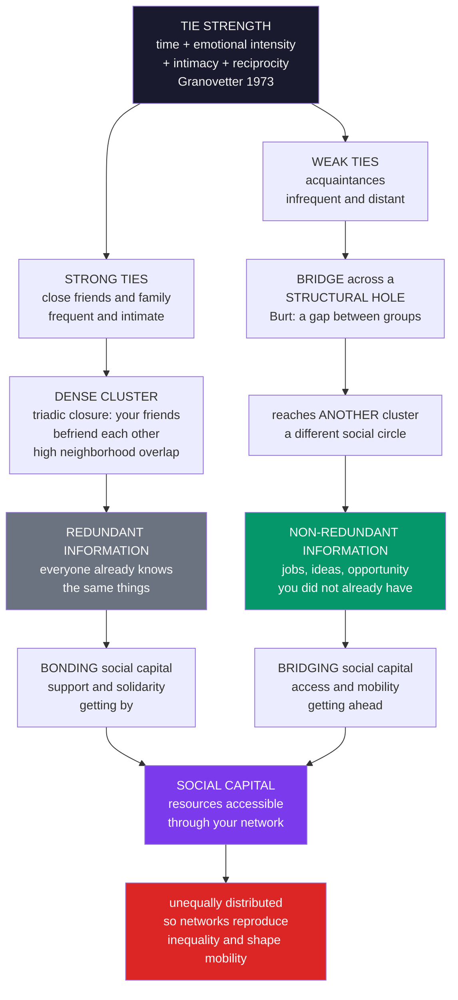

# 🌉 The Strength of Weak Ties and Social Capital

> [!abstract] TL;DR
> **Mark Granovetter's "strength of weak ties" (1973)** overturns intuition: **weak ties** (acquaintances — infrequent, less intimate) are often *more* valuable than **strong ties** (close friends and family) for accessing **novel information and opportunity**. The reason is structural, not emotional. Strong ties cluster: through **triadic closure** your close friends become each other's friends, forming a dense group where everyone knows the same things — **redundant** information. Weak ties, being less clustered, are far more likely to be **bridges** that span a **structural hole** (Ronald Burt) to *another* cluster, carrying **non-redundant** news, ideas, and job leads from distant parts of the network. Granovetter found people found **jobs** more often through weak ties than strong ones, and weak ties speed the **diffusion** of information across a whole society. Actors who bridge structural holes (**brokers**) gain informational and control advantages, and more broadly **social capital** — the resources accessible *through* one's network — comes in **bonding** form (strong within-group ties for support, "getting by") and **bridging** form (weak cross-group ties for opportunity, "getting ahead"). Both are **unequally distributed**, so network position **reproduces inequality and shapes mobility** — a claim now quantified at planetary scale by computational social science (Chetty's "economic connectedness" predicting upward mobility from billions of Facebook friendships; Onnela's mobile-phone confirmation; Rajkumar's causal LinkedIn experiment).

---

## Intuition

**Analogy:** When Mark Granovetter asked people how they found their jobs, he expected the answer to be close friends and family — the people who love you and want to help. Instead, most people got their jobs through **acquaintances**: people they barely knew, saw only occasionally, would never call in a crisis. The paradox has a simple structure. Your close friends all know *each other* and move in *your* world — they read the same feeds, attend the same events, and therefore know the same things you already know. Telling them you are job-hunting mostly echoes information back to you. It is the **weak** tie — the former colleague glimpsed at a reunion, the friend-of-a-friend from another city, the distant acquaintance embedded in a *different* circle — who bridges you to a world you would never otherwise reach: fresh openings, unfamiliar ideas, opportunities that never circulate in your own dense little cluster.

Sometimes the most valuable connections are precisely the ones you value least. The strength of a tie for accessing opportunity has little to do with its *emotional* strength and everything to do with its *structural position*: whether it reaches **outside** your cluster or merely deeper **inside** it. The people closest to you are, informationally, the most redundant. The distant acquaintance is a doorway.

---

## How It Works

The core claim is **structural**. Ties differ in **strength** — Granovetter defined tie strength as a combination of **time** spent, **emotional intensity**, **intimacy**, and **reciprocity** — but the reason weak ties matter is *where they sit in the network*, not how strong they feel.

### Core mechanics

1. **Strong ties cluster; weak ties do not.** Strong ties are subject to **triadic closure**: if A is close to B and A is close to C, then B and C are very likely to become close too (you introduce your good friends to each other). Repeatedly applied, closure packs your strong ties into a **dense cluster** where everyone is connected to everyone — a clique with a high **clustering coefficient**.

2. **Dense clusters carry redundant information.** Inside such a cluster, information circulates until everyone already knows it. Your strong ties therefore give you **redundant** information: you all share the same neighbors, so you share the same news. This is captured empirically by **neighborhood overlap** — the fraction of two people's contacts that are shared. Strong ties have *high* overlap (redundant); weak ties have *low* overlap (novel). Onnela et al. (2007) confirmed exactly this in a nationwide mobile-phone network.

3. **Weak ties are the bridges.** Because weak ties escape triadic closure, they are far more likely to be **bridges** — the *only* connection between your cluster and some *other* cluster. Granovetter's "**forbidden triad**" argument shows why a *strong* bridge is structurally unstable: if a strong tie A–B were the only link between two groups, closure would soon fill in the triangle and it would stop being a bridge. Hence **bridges tend to be weak**. Weak ties span the gaps between social worlds.

4. **Novelty flows through the weak links.** A bridge spans what Ronald **Burt** calls a **structural hole** — a gap between two groups with no other direct connection. Information crossing that hole is **non-redundant**: it is new to the receiving side. So novel jobs, ideas, and opportunities reach you disproportionately through your weak, bridging ties — and, at the level of a whole society, weak ties are what let information **diffuse** across otherwise-separate communities. Delete the weak bridges and the network fragments into informational islands.

5. **Brokerage is an advantage.** The person who sits *astride* a structural hole — the **broker** — gains twice: **access** to diverse, early, non-redundant information from both sides, and **control** over what flows between them. Burt's *Structural Holes* (1992) shows brokers enjoy better ideas, faster promotion, and more power — the "social capital of brokerage." This connects directly to **betweenness centrality**, which measures exactly how many shortest paths run through a node.

6. **Social capital comes in two forms.** **Social capital** is the resource — information, support, influence, trust, opportunity — accessible *through* one's network (Bourdieu, Coleman, Putnam, Lin, Burt). Putnam's key distinction: **bonding** capital comes from strong ties within a close, homogeneous group and provides solidarity and support ("getting by"); **bridging** capital comes from weak ties across diverse groups and provides novel information and mobility ("getting ahead"). Both matter, but for different things — and both are **unequally distributed**, so who you know shapes your life chances.

### Diagram



Within the wider vault this note is one pillar of social network analysis: the companion siblings *Social_Network_Analysis_Foundations* lays out graphs and tie measurement, *Centrality_Community_and_Structure* formalizes brokerage and betweenness, *Contagion_and_Diffusion_in_Social_Networks* treats the spread that weak ties accelerate, *Homophily_Selection_and_Influence* explains why networks segregate (and thus why bridging ties are scarce for the disadvantaged), and *Online_Social_Networks_and_Platforms* covers the digital settings where weak ties and social capital are now measured at scale.

---

## Key Concepts

### Secondary Level

**The surprising finding.** You would think your best friends are your best source of a job tip. They are not. Your close friends all hang out with each other and with you, so they hear the same news you do — telling them you are looking mostly bounces your own information back at you. The person who actually points you to a new opportunity is usually an **acquaintance** in a *different* group, who knows things your circle does not. This is Granovetter's famous idea: the **strength of weak ties**.

**Why it works.** Picture your friend group as a tight bubble where everyone knows everyone. Inside the bubble, all the gossip is old news. To hear something *new*, you need a connection that reaches *outside* the bubble into another one — and those reaching-out connections are usually weak, casual ties, not your closest bonds.

**Two kinds of connection.**

| | Strong ties (close) | Weak ties (acquaintances) |
|---|---|---|
| Who | family, best friends | people you barely know |
| Give you | support, help, loyalty | new information, opportunities |
| Nickname | "getting by" (bonding) | "getting ahead" (bridging) |

**Social capital.** Your connections are a kind of wealth: the help, information, and opportunities you can get *because of who you know*. People with lots of **bridging** connections to different groups tend to get ahead faster — which is one reason where you start in life, and who you happen to know, shapes where you end up.

### Undergraduate Level

**Tie strength, defined.** Granovetter operationalized the strength of a tie as a *combination* of four things: the **amount of time**, the **emotional intensity**, the **mutual intimacy**, and the **reciprocal services** that characterize the relationship. Crucially, his argument is not that weak ties are magically better *because* they are weak — it is that weakness *correlates with structural position*. Weak ties are more likely to be **local bridges** connecting otherwise-distant parts of the network.

**The forbidden-triad theorem.** Granovetter's structural argument runs: if A has strong ties to both B and C, then a tie between B and C is highly likely to form (triadic closure). The configuration where A–B and A–C are strong but B–C is *absent* is therefore rare — the "**forbidden triad**." A direct corollary: **no strong tie can be a bridge**. If A–B were the *only* path between two groups and it were strong, closure would generate alternative paths and destroy its bridge status. So all bridges (and all *local* bridges — edges whose removal sharply lengthens the shortest path between their endpoints) are **weak**. Bridges are where novelty crosses, and bridges are weak; therefore novelty rides on weak ties.

**Redundancy vs novelty.** The information value of a tie depends on **neighborhood overlap**: how many contacts the two endpoints share. High overlap = your worlds coincide = redundant information. Low overlap = your contact reaches a non-overlapping world = novel information. Strong, embedded ties have high overlap; weak, bridging ties have low overlap. This is the mechanism behind the whole theory, and it is directly measurable in digital-trace data.

**The job-search finding.** In *Getting a Job* (1974), Granovetter found that among professional and managerial workers who found their job through a contact, a **majority** heard about it through a tie they saw only **occasionally or rarely** — a weak tie — rather than one they saw often. The intuition: an acquaintance in a different circle has *access to information you do not already have*. (Interesting nuance he already noted: strong ties are more *motivated* to help you, but weak ties know *more that is useful* — a tension the later causal work sharpens.)

**Structural holes and brokerage (Burt).** Ronald Burt reframed weak ties in terms of the **holes** they span. A **structural hole** is the empty space between two groups that are not otherwise connected. Someone whose ties reach across many such holes has a network rich in **non-redundant** contacts. Burt showed these **brokers** enjoy real returns — better and earlier information, the ability to *recombine* ideas from separate worlds (innovation), higher performance evaluations, faster promotion, and bargaining power from controlling flows between groups. He formalized the opposite of brokerage as **constraint**: a network is constraining when your contacts are all tied to each other (a closed, redundant clique).

**Social capital — the resource.** **Social capital** names the resources — information, influence, support, trust, opportunity — that flow to a person or group *through their social network*. It is a genuine *form of capital* (an asset that yields returns), but it lives in relationships rather than in things or skills. Four traditions shaped the concept: **Bourdieu** (social capital as a class resource that helps reproduce inequality through durable networks of recognition); **Coleman** (a *functional* resource that enables action through network **closure** and enforceable norms); **Putnam** (the collective civic fabric of networks, norms, and generalized **trust** that sustains democracy — *Bowling Alone*); and **Nan Lin** (social capital as *resources embedded in networks* that people access and mobilize for instrumental gain — the "social resources" theory of status attainment).

**Bonding vs bridging (Putnam).** The most useful practical distinction. **Bonding** social capital arises from **strong ties within a close, homogeneous group** — it provides support, solidarity, trust, and norm enforcement; it is good for **"getting by."** **Bridging** social capital arises from **weak ties across diverse groups** — it provides novel information, opportunity, and connection to resources beyond one's own group; it is good for **"getting ahead."** They are complements, not substitutes, and a healthy life (and a healthy society) needs both.

### Graduate Level

**The global-connectivity theorem.** Granovetter's deeper structural point is macroscopic: because bridges are weak, **weak ties disproportionately hold the whole network together**. In a "macro" thought experiment, deleting all *strong* ties leaves the large-scale connectivity roughly intact (you lose intra-cluster density but the between-cluster bridges survive); deleting all *weak* ties **shatters** the network into disconnected islands, collapsing global diffusion. Onnela et al. (2007, *PNAS*), analyzing a mobile-communication network of millions, confirmed both halves: tie strength (call volume/duration) is strongly **positively correlated with neighborhood overlap** (strong ties are embedded, weak ties bridge), and percolation experiments showed that removing ties **weakest-first** disintegrates the giant component far faster than removing them strongest-first. The "strength of weak ties" is literally the strength holding society's components in one piece.

**Burt's constraint and the brokerage–closure debate.** Burt formalized network **constraint** (concentration of one's ties into a single mutually-connected group) and **effective size / efficiency** of a network. Empirically, low constraint (many structural holes) predicts advantage. This sets up a productive tension with **Coleman's closure** thesis: closure (dense, redundant ties) builds **trust and enforceable norms** — good for cooperation and reliability — while **brokerage** (spanning holes) builds **information advantage and innovation**. The reconciliation is contingency: **closure inside groups + brokerage between them** is often optimal; whether closure or brokerage pays depends on whether the task rewards trust/coordination or novelty/vision.

**Social resources and status attainment (Lin).** Nan Lin's theory makes social capital *stratified by design*: the returns to networking depend on the **resources embedded** in the contacts you can reach (their wealth, authority, prestige), on the **strength of ties** used to reach them, and on your **network location** (bridges, proximity to resource-rich actors). Lin's synthesis: weak ties help *precisely because* they reach **upward and outward** to more diverse, higher-status resources than your homogeneous strong ties can. Measured with the **position generator** (whether you know someone in each of a list of occupations), this predicts occupational attainment — and reveals that the *poor and segregated* have weak ties too, just weak ties to *other resource-poor people*, which is why bridging is scarce exactly where it would help most.

**The causal test (Rajkumar et al. 2022).** Observational weak-tie studies are confounded by **homophily vs influence** and by selection. Rajkumar, Saint-Jacques, Bojinov, Brynjolfsson, and Aral ran a **randomized experiment** on Linkedin's "People You May Know" involving ~20 million users over five years, exogenously varying the strength (tie strength proxied by mutual connections and interaction) of recommended new ties and tracking actual **job mobility**. The causal finding refines Granovetter: the relationship is an **inverted U** — **moderately weak ties** produce the greatest job transmission, *more* than either the strongest ties *or* the very weakest ties, and the effect is stronger in more digital/tech industries. This is the first large-scale *causal* validation (and correction) of a theory that had stood on observational evidence for half a century.

**Social capital, inequality, and mobility (Chetty et al. 2022).** The stratification payoff, now measured at national scale. Chetty and colleagues (*Nature*, two papers) built a **Social Capital Atlas** from **21 billion Facebook friendships** among 72 million U.S. users, decomposing social capital into **economic connectedness** (the share of a low-income person's friends who are high-income), **cohesiveness** (clustering), and **civic engagement**. Their headline result: **economic connectedness — cross-class friendship — is one of the strongest known predictors of upward income mobility**, dwarfing measures like inequality, family structure, or school quality. Children who grow up in counties where the poor and rich are *friends* earn substantially more as adults. The mechanism is exactly bridging social capital: **homophily** (people befriend similar others) segregates networks by class and race, so bridging ties across class are scarce for the disadvantaged, and their scarcity **reproduces inequality**. This is Granovetter and Burt and Lin, validated with the largest social network ever analyzed — and it reframes bridging connection as a *policy target* (integration, mentoring, "friending bias" reduction).

**The CSS turn.** Big network data (phone, email, platform friendships) lets researchers *measure* tie strength directly from interaction frequency and reciprocity, *test* the strength-of-weak-ties hypothesis at population scale (largely confirming it), and *quantify* social capital and its link to mobility. A half-century-old sociological theory has become an **empirically validated, causally tested, planet-scale computational science** — while also inheriting CSS's caveats: trace-based tie strength is a proxy, platform data is non-representative, and "just build weak ties" ignores the structural scarcity of bridging opportunities for the isolated.

---

## Python Demo

```python
import numpy as np
import matplotlib
matplotlib.use("Agg")
import matplotlib.pyplot as plt

# =====================================================================
# THE STRENGTH OF WEAK TIES, demonstrated on a toy network
# (numpy + matplotlib only; no networkx).
#
#   Build C dense CLUSTERS (tight groups joined by STRONG ties inside),
#   linked by only a FEW WEAK ties BETWEEN clusters. Then show:
#     (1) INFORMATION DIFFUSION reaches the whole society ONLY through the
#         weak bridging ties; delete them and information is trapped inside
#         the seed's cluster (strong ties merely recirculate what is known).
#     (2) REDUNDANCY: strong within-cluster ties join people who already
#         share most of their neighbors -> high overlap = REDUNDANT info;
#         weak between-cluster ties join non-overlapping neighborhoods
#         -> zero overlap = NOVEL info.  (Onnela et al. 2007, PNAS.)
# =====================================================================
rng = np.random.default_rng(7)

C, m = 5, 8                                    # C clusters of m people each
N = C * m
cluster = np.repeat(np.arange(C), m)           # cluster label of each node

# ---- BUILD THE GRAPH -------------------------------------------------
A = np.zeros((N, N), dtype=int)                # full adjacency
strong = np.zeros((N, N), dtype=int)           # 1 = strong (within-cluster)
weak = np.zeros((N, N), dtype=int)             # 1 = weak   (between-cluster)

# STRONG ties: each cluster is a fully connected clique (dense, redundant)
for c in range(C):
    idx = np.where(cluster == c)[0]
    for a in range(len(idx)):
        for b in range(a + 1, len(idx)):
            i, j = idx[a], idx[b]
            A[i, j] = A[j, i] = 1
            strong[i, j] = strong[j, i] = 1

# WEAK ties: a single bridge between each adjacent cluster in a ring.
# A handful of weak edges are the ONLY links between clusters.
for c in range(C):
    i = c * m + (m - 1)                         # last node of cluster c
    j = ((c + 1) % C) * m                       # first node of next cluster
    A[i, j] = A[j, i] = 1
    weak[i, j] = weak[j, i] = 1

n_strong = strong.sum() // 2
n_weak = weak.sum() // 2

# ---- (1) INFORMATION DIFFUSION: with vs without the weak bridges -----
def diffuse(adj, seed, q=0.55, steps=14, trials=60):
    """Averaged SI spread: each step every knower tells each neighbor w.p. q."""
    reach = np.zeros(steps + 1)
    for _ in range(trials):
        knows = np.zeros(N, dtype=bool)
        knows[seed] = True
        traj = [knows.mean()]
        for _ in range(steps):
            nxt = knows.copy()
            for i in np.where(knows)[0]:
                for j in np.where(adj[i] == 1)[0]:
                    if not knows[j] and rng.random() < q:
                        nxt[j] = True
            knows = nxt
            traj.append(knows.mean())
        reach += np.array(traj)
    return reach / trials

seed = 0                                        # a node in cluster 0
with_weak = diffuse(A, seed)                    # full network
without_weak = diffuse(strong, seed)            # weak bridges deleted

# ---- (2) REDUNDANCY: neighborhood overlap per edge -------------------
def overlap(adj, i, j):
    ni = set(np.where(adj[i] == 1)[0]) - {j}
    nj = set(np.where(adj[j] == 1)[0]) - {i}
    uni = ni | nj
    return len(ni & nj) / len(uni) if uni else 0.0

strong_ov, weak_ov = [], []
for i in range(N):
    for j in range(i + 1, N):
        if strong[i, j]:
            strong_ov.append(overlap(A, i, j))
        elif weak[i, j]:
            weak_ov.append(overlap(A, i, j))
strong_ov, weak_ov = np.array(strong_ov), np.array(weak_ov)

# ---- REPORT ----------------------------------------------------------
weak_share = n_weak / (n_weak + n_strong)
extra_reach = with_weak[-1] - without_weak[-1]
print("=" * 62)
print("THE STRENGTH OF WEAK TIES")
print("=" * 62)
print(f"network : {N} people, {C} clusters, "
      f"{n_strong} strong ties, {n_weak} weak ties")
print(f"weak ties are only {weak_share:.1%} of all edges")
print(f"reach WITHOUT weak ties : {without_weak[-1]:.0%} "
      f"(trapped in the seed cluster)")
print(f"reach WITH    weak ties : {with_weak[-1]:.0%} "
      f"(essentially the whole society)")
print(f"-> {extra_reach:.0%} of the network is reachable ONLY via weak ties")
print(f"mean neighborhood overlap : strong {strong_ov.mean():.2f} "
      f"(redundant) vs weak {weak_ov.mean():.2f} (novel)")

# ---- FIGURE ----------------------------------------------------------
# Positions: clusters on a big ring, members on a small ring around each.
pos = np.zeros((N, 2))
for c in range(C):
    cx, cy = np.cos(2 * np.pi * c / C), np.sin(2 * np.pi * c / C)
    idx = np.where(cluster == c)[0]
    for k, node in enumerate(idx):
        ang = 2 * np.pi * k / len(idx)
        pos[node] = [3 * cx + 0.7 * np.cos(ang), 3 * cy + 0.7 * np.sin(ang)]

fig, ax = plt.subplots(2, 2, figsize=(13.5, 10.5))
fig.suptitle("The Strength of Weak Ties: a few weak bridges carry novel "
             "information across a clustered society",
             fontsize=13, fontweight="bold")
pal = ["#2563eb", "#059669", "#d97706", "#7c3aed", "#dc2626"]

# Panel A: the network -- strong ties gray, weak bridges thick red
axA = ax[0, 0]
for i in range(N):
    for j in range(i + 1, N):
        if strong[i, j]:
            axA.plot(*zip(pos[i], pos[j]), color="#cccccc", lw=0.6, zorder=1)
for i in range(N):
    for j in range(i + 1, N):
        if weak[i, j]:
            axA.plot(*zip(pos[i], pos[j]), color="#dc2626", lw=2.4,
                     zorder=2, solid_capstyle="round")
axA.scatter(pos[:, 0], pos[:, 1], s=70, c=[pal[c] for c in cluster],
            edgecolors="black", linewidths=0.6, zorder=3)
axA.scatter(pos[seed, 0], pos[seed, 1], s=230, facecolors="none",
            edgecolors="black", linewidths=2.0, zorder=4)
axA.plot([], [], color="#dc2626", lw=2.4, label="weak tie (bridge)")
axA.plot([], [], color="#cccccc", lw=1.5, label="strong tie (within cluster)")
axA.set_title("Dense clusters joined by a few WEAK bridges", fontsize=10)
axA.legend(fontsize=8, loc="upper right")
axA.set_xticks([]); axA.set_yticks([]); axA.set_aspect("equal")

# Panel B: diffusion reach over time, with vs without weak ties
axB = ax[0, 1]
axB.plot(with_weak, "-o", color="#059669", lw=2, ms=4, label="with weak ties")
axB.plot(without_weak, "-s", color="#dc2626", lw=2, ms=4,
         label="without weak ties")
axB.axhline(1 / C, color="#dc2626", ls=":", lw=1.2,
            label=f"one cluster = {1 / C:.0%}")
axB.set_title("(1) Information reaches the whole society\nONLY through "
              "weak ties", fontsize=10)
axB.set_xlabel("time step"); axB.set_ylabel("fraction who know")
axB.set_ylim(0, 1.03); axB.legend(fontsize=8); axB.grid(alpha=0.25)

# Panel C: redundancy -- neighborhood overlap, strong vs weak
axC = ax[1, 0]
means = [strong_ov.mean(), weak_ov.mean()]
axC.bar([0, 1], means, color=["#6b7280", "#dc2626"], edgecolor="black",
        width=0.6)
axC.scatter(np.zeros(len(strong_ov)) + rng.normal(0, 0.05, len(strong_ov)),
            strong_ov, color="black", s=14, alpha=0.4, zorder=3)
axC.scatter(np.ones(len(weak_ov)), weak_ov, color="black", s=30,
            alpha=0.8, zorder=3)
axC.set_xticks([0, 1])
axC.set_xticklabels(["strong ties\n(within cluster)", "weak ties\n(bridges)"])
axC.set_title("(2) Redundancy: neighborhood overlap\nhigh = redundant info, "
              "low = novel info", fontsize=10)
axC.set_ylabel("neighborhood overlap (Jaccard)")
axC.set_ylim(0, max(means) * 1.3 + 0.05); axC.grid(alpha=0.25, axis="y")
for x, v in zip([0, 1], means):
    axC.text(x, v + 0.02, f"{v:.2f}", ha="center", fontsize=9,
             fontweight="bold")

# Panel D: the punchline -- tiny share of edges, huge share of reach
axD = ax[1, 1]
bars = axD.bar([0, 1], [weak_share, extra_reach],
               color=["#9ca3af", "#059669"], edgecolor="black", width=0.6)
axD.set_xticks([0, 1])
axD.set_xticklabels(["weak ties as a\nshare of all edges",
                     "network reachable\nONLY via weak ties"])
axD.set_title("The strength of weak ties in one bar:\na few links carry the "
              "novelty", fontsize=10)
axD.set_ylabel("fraction")
axD.set_ylim(0, 1.05); axD.grid(alpha=0.25, axis="y")
for b, v in zip(bars, [weak_share, extra_reach]):
    axD.text(b.get_x() + b.get_width() / 2, v + 0.02, f"{v:.0%}",
             ha="center", fontsize=10, fontweight="bold")

plt.tight_layout(rect=[0, 0, 1, 0.95])
plt.savefig("strength_of_weak_ties.png", dpi=110, bbox_inches="tight")
plt.show()
```

**What the demo shows:**

- **Panel A (the network).** Five dense **clusters** (fully connected cliques of strong ties, drawn in gray) joined by only **five weak bridges** (thick red). This is Granovetter's world in miniature: information-rich cliques separated by structural holes, spanned only by weak ties.
- **Panel B (diffusion).** Seed a rumor at one node and let it spread. **With** the weak ties it reaches essentially the **entire** society; **without** them it saturates the seed's own cluster and stops dead at **1/C** of the network. The novelty crosses between worlds *only* through the weak bridges — strong ties merely recirculate what the cluster already knows.
- **Panel C (redundancy).** **Neighborhood overlap** (Jaccard) per edge. Strong within-cluster ties have overlap near **1.0** (their endpoints share almost all their contacts — redundant information); weak bridging ties have overlap **0.0** (their endpoints share *no* contacts — purely novel information). This is exactly the tie-strength-vs-overlap relationship Onnela et al. found in real phone data.
- **Panel D (the punchline).** The weak ties are a tiny **~3%** of all edges, yet they are responsible for reaching **~80%** of the network. A handful of weak links carry the entire burden of connecting society — the strength of weak ties in one bar.

The takeaway: the value of a tie is **structural**. Strong ties give density and support but redundant information; a few weak, bridging ties are what let novelty diffuse across an otherwise-fragmented society.

---

## Real-World Applications

> **Job search and labor markets.** The founding application. Referrals and networking dominate hiring, and weak/bridging ties supply the *non-redundant* leads. Firms formalize this as referral programs; workers cultivate diverse acquaintances. The causal LinkedIn experiment (Rajkumar et al. 2022) refined it to an inverted-U — *moderately* weak ties move the most people into new jobs — directly informing platform recommendation of connections. Connects to labor-market frictions and [[Unemployment]].

> **Diffusion of information and innovation.** Bridging ties are the highways along which news, behaviors, and innovations cross between communities; without them ideas stay trapped in local cliques. This is the structural basis of adoption dynamics — see [[Diffusion_of_Innovations_and_Adoption_Dynamics]] and [[Network_Dynamics_and_Contagion]] — though *complex* contagions (needing multiple exposures) can require the reinforcement of strong ties, a productive complication to the weak-tie story.

> **Organizational knowledge-sharing and innovation.** Inside firms, **brokers** who bridge structural holes between departments get better ideas, faster promotions, and higher performance ratings (Burt). Innovation often comes from *recombining* knowledge across otherwise-disconnected units — see [[Innovation_Recombination_and_the_Adjacent_Possible]] — so organizations deliberately build cross-unit ties, rotation programs, and communities of practice.

> **Community development and civic engagement.** Putnam's *Bowling Alone* argues that declining bridging social capital erodes generalized trust and democratic health. Interventions — civic associations, mixed-income housing, cross-group programs — aim to rebuild bridging ties. See the sociological treatment in [[Social_Capital_and_Trust]].

> **Reducing inequality via bridging connection.** Chetty et al.'s finding that **economic connectedness** (cross-class friendship) predicts upward mobility reframes bridging ties as a *lever*: mentoring, school and neighborhood integration, and reducing "friending bias" become concrete mobility policy. Links to [[Poverty_Social_Mobility_and_Life_Chances]] and [[Education_and_Social_Reproduction]].

> **Platform design.** "People You May Know," "connections in common," and friend/edge recommendation directly engineer the tie structure of billions of users — and thus the flow of information, jobs, and social capital. The strength-of-weak-ties theory is now a *design parameter* of the social web; see [[Big_Data_and_the_Social_Sciences]] and [[Computational_Social_Science_Overview]].

---

## Common Pitfalls

- **Confusing weakness with the real cause (structural position).** Granovetter's claim is not "weaker is always better" — it is that weak ties tend to be **bridges**. A weak tie *inside* your own cluster carries no novelty. Rajkumar's causal test makes this explicit: the *most* useful ties for job mobility are **moderately** weak, not the very weakest. Reason about *bridging*, not raw tie strength.
- **Ignoring the strong-tie side of the ledger.** Granovetter himself noted strong ties are more *motivated* to help and better for **complex** transfers (trust, tacit knowledge, emotional support, mobilizing action). Weak ties supply *information*; strong ties supply *help and trust*. Prescribing "just make more weak ties" ignores the bonding capital people also need.
- **Assuming bridging is a free choice.** Bridging ties are **structurally scarce** exactly for the isolated and segregated: **homophily** means the poor's weak ties often reach *other* poor people (Lin's "social resources" are stratified). "Network harder" is bad advice if there is no bridge to build. See *Homophily_Selection_and_Influence* for why networks segregate.
- **Homophily vs influence confound.** In observational data, a job that follows a contact could reflect the contact's *causal* help **or** the fact that similar people cluster together (selection). Claiming weak ties *caused* an outcome from correlation alone is the classic network-inference error — which is exactly why the LinkedIn randomized experiment mattered.
- **Treating social capital as purely an individual asset.** Bourdieu/Coleman/Putnam disagree on whether social capital is a private resource, a functional byproduct, or a collective public good — and all three are partly right. Reducing it to "my rolodex" misses its role in trust, norms, and democratic capacity.
- **Over-reading trace-based tie strength.** Call frequency, message counts, or mutual-friend counts are *proxies* for tie strength, and platform data is non-representative. A "like" is not intimacy; interaction volume is not emotional closeness. Validate the proxy before building conclusions on it.

---

## Related Concepts

**The sociological foundation:**

- [[Social_Networks_and_Social_Ties]] — the parent sociological treatment of weak ties, structural holes, small-world, and homophily; this note is the CSS/network deep-dive on the weak-ties + social-capital slice.
- [[Social_Capital_and_Trust]] — the sociology of social capital (Bourdieu, Coleman, Putnam) and generalized trust; this note is the network-analytic, computational companion.
- [[Poverty_Social_Mobility_and_Life_Chances]] — how unequal social capital reproduces (im)mobility; the stratification payoff of bridging ties.
- [[Social_Class_and_Stratification]] — class-segregated networks are why bridging ties are scarce where they would help most.
- [[Education_and_Social_Reproduction]] — schools as sites where bridging (or its absence) shapes opportunity, per Bourdieu and Chetty.

**The network-science machinery:**

- [[Network_Science_Fundamentals]] — degree, clustering, path length, and the graph substrate underlying every claim here.
- [[Centrality_and_Community_Structure]] — betweenness centrality formalizes brokerage; community detection formalizes the "clusters" weak ties bridge.
- [[Small_World_and_Scale_Free_Networks]] — a few long-range weak ties collapse path length (Watts–Strogatz), the macro consequence of bridging ties.
- [[Network_Dynamics_and_Contagion]] — the diffusion/contagion processes that weak ties accelerate (with the complex-contagion caveat).

**The economics and diffusion links:**

- [[Economic_Networks_and_Interaction_Structure]] — networks as the interaction substrate of the economy; weak ties shape information flow and matching.
- [[Diffusion_of_Innovations_and_Adoption_Dynamics]] — the S-curve adoption that bridging ties carry across communities.
- [[Innovation_Recombination_and_the_Adjacent_Possible]] — brokerage as recombination of ideas across structural holes.
- [[Wealth_and_Income_Inequality_Dynamics]] — network-position inequality as a generator of economic inequality.
- [[Increasing_Returns_and_Path_Dependence]] — "the well-connected get more connected"; cumulative advantage in network position.
- [[Trust_Altruism_and_Cooperation]] — the trust and reciprocity that bonding (strong-tie) social capital produces.

**The CSS frame:**

- [[Computational_Social_Science_Overview]] — the field that measures tie strength and social capital at planetary scale (Onnela, Rajkumar, Chetty).
- [[Big_Data_and_the_Social_Sciences]] — the digital-trace data (phone, email, platform friendships) that quantified this theory.
- [[Digital_Society_and_Online_Communities]] — the online platforms where weak ties and social capital now form and are engineered.

**Forthcoming siblings in this section (planned, not yet written):** *Social Network Analysis Foundations*, *Centrality, Community, and Structure*, *Contagion and Diffusion in Social Networks*, *Homophily, Selection, and Influence*, and *Online Social Networks and Platforms*.

---

## Review Questions

### Secondary

1. Why are your *closest* friends often *not* the best source of a new job tip? Explain the "bubble" idea in your own words.
2. Give an everyday example of a **bonding** connection (getting by) and a **bridging** connection (getting ahead) from your own life.
3. What is "social capital," and why might two people with the same skills and the same rights still end up with very different opportunities?

### Undergraduate

1. State the four components of **tie strength** and explain Granovetter's "**forbidden triad**": why can no *strong* tie be a bridge, and why does that mean novelty travels on *weak* ties?
2. Define **neighborhood overlap** and explain how it links *tie strength* to *information redundancy*. What did Onnela et al. (2007) find about overlap and tie strength in a real mobile-phone network?
3. Distinguish **bonding** from **bridging** social capital and Coleman's **closure** from Burt's **brokerage**. For a task that rewards *trust and coordination* vs one that rewards *novelty and vision*, which network structure pays, and why?

### Graduate

1. The classic weak-ties evidence is observational. Explain the **homophily-vs-influence** confound, then describe how Rajkumar et al. (2022) used a randomized "People You May Know" experiment to test causality — and how their **inverted-U** result both confirms and *revises* Granovetter's original claim.
2. Chetty et al. (2022) find **economic connectedness** (cross-class friendship) is among the strongest predictors of upward mobility. Lay out the causal chain from **homophily** to **class-segregated networks** to **scarce bridging ties** to **reproduced inequality**, and argue whether "increase bridging" is a defensible *policy* prescription or a naive one.
3. Reconcile the "strength of weak ties" with the theory of **complex contagion** (behaviors needing multiple reinforcing exposures). When do *weak* bridging ties spread something, and when do you instead need the redundancy of *strong* ties? What does this imply for using tie strength as a lever in diffusion, organizations, and platform design?

---

## Sources

- [Granovetter, M. S. (1973). "The Strength of Weak Ties." *American Journal of Sociology* 78(6), 1360–1380](https://doi.org/10.1086/225469)
- [Burt, R. S. (1992). *Structural Holes: The Social Structure of Competition*. Harvard University Press](https://www.hup.harvard.edu/books/9780674843714)
- [Onnela, J.-P. et al. (2007). "Structure and tie strengths in mobile communication networks." *PNAS* 104(18), 7332–7336](https://doi.org/10.1073/pnas.0610245104)
- [Rajkumar, K., Saint-Jacques, G., Bojinov, I., Brynjolfsson, E., Aral, S. (2022). "A causal test of the strength of weak ties." *Science* 377(6612), 1304–1310](https://doi.org/10.1126/science.abl4476)
- [Chetty, R. et al. (2022). "Social capital I: measurement and associations with economic mobility." *Nature* 608, 108–121](https://doi.org/10.1038/s41586-022-04996-4)
- [Lin, N. (2001). *Social Capital: A Theory of Social Structure and Action*. Cambridge University Press](https://doi.org/10.1017/CBO9780511815447)

---

#computational-social-science #weak-ties #social-capital #granovetter #structural-holes
