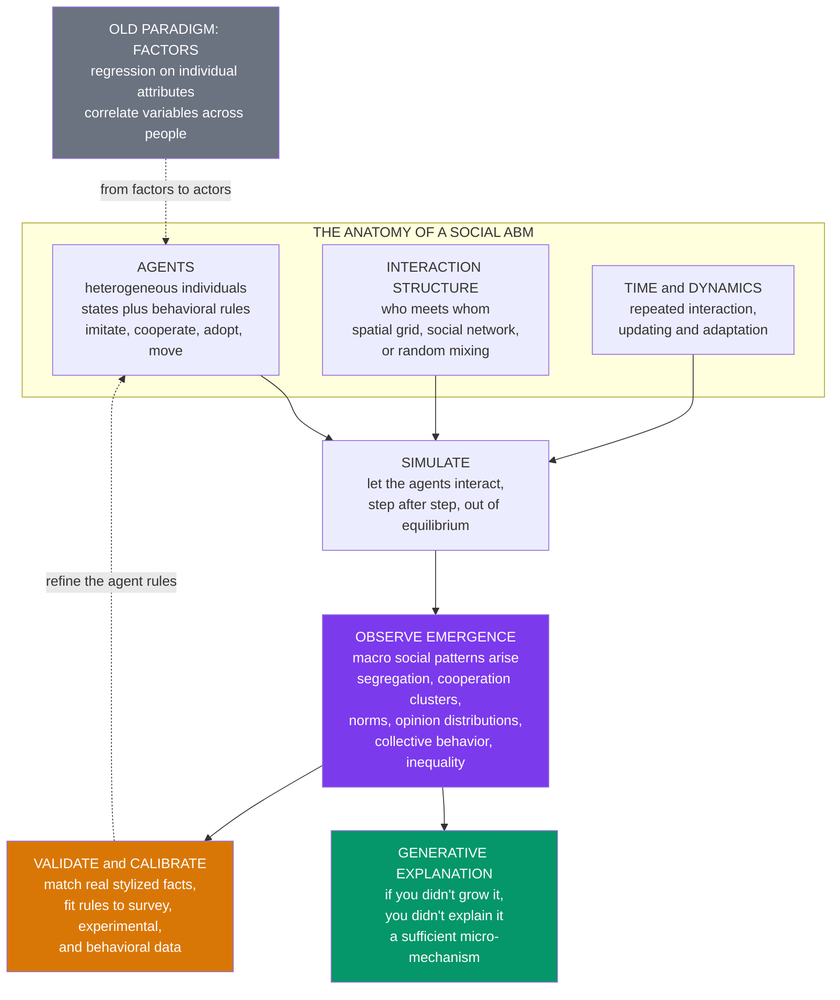

# 🌱 Agent-Based Models of Society

> [!abstract] TL;DR
> **Agent-based modeling (ABM)** in social science builds computational models of **society from the bottom up**: populate a computer with thousands of **heterogeneous artificial agents** — simple artificial people with states (attributes, opinions, strategies) and **behavioral rules** (imitate, cooperate, adopt, move) — connect them by an **interaction structure** (a spatial grid, a social **network**, or random mixing), let them **interact over time**, and watch **macro social patterns emerge** that no agent designed: **segregation** from mild preferences, **cooperation** from repeated encounters, **norms** and **culture** from imitation, **opinion** distributions from social influence, **collective behavior** from thresholds, and **inequality** from local exchange. This is the signature shift Macy and Willer named **"from factors to actors"** — away from correlating individual *attributes* with statistical regression toward *simulating interacting actors*, capturing the **interaction, heterogeneity, adaptation, and emergence** that variable-based methods structurally miss. It embodies **Epstein's generative social science** — *"if you didn't grow it, you didn't explain it"* — treating explanation as **demonstrating a sufficient micro-mechanism** for a macro pattern, the constructive complement to analytical sociology's mechanism-based explanation. From **Schelling** segregation and the **evolution of cooperation** to **Sugarscape**'s whole artificial society, opinion dynamics, culture dissemination, threshold models of collective action, and today's **agent-based epidemiology** informing real policy, social ABM is the social scientist's **flight simulator** — a virtual laboratory for the experiments on whole societies that are impossible, unethical, or too slow to run for real. Its power (heterogeneity, networks, out-of-equilibrium dynamics, "impossible experiments") is matched by an honest reckoning: ABMs are **flexible** ("you can grow anything"), less **transparent** than equations, and demand that agent rules be **justified** and **empirically calibrated and validated** — the frontier that turns illustrative toys into credible science and makes ABM the defining computational method for studying **society as a complex adaptive system**.

---

## Intuition

**Analogy:** How does a *society* actually work? You can't run a controlled experiment on a whole civilization — you cannot split a country in two, impose different rules on each half, and watch which one polarizes. Surveys and censuses only capture frozen **snapshots**: they tell you *that* a city is segregated or *that* opinion is polarized, never the moving process that produced it. History runs the experiment only **once**, with no rewind and no control group. The object of study is too big, too slow, too entangled, and too ethically off-limits to put on a lab bench.

So social scientists do the next best thing: they build **societies in silico**. Populate a computer with thousands of simple **artificial people**, give each one a handful of plausible **social rules** — *prefer neighbors a bit like me; cooperate with those who cooperated back; copy the opinion I hear most; adopt the fad once enough friends have* — then press play and watch what the crowd *does*. Out of nothing but local interactions, the macro-world **grows**: neighborhoods split into stark ethnic blocks even though no one wanted segregation; islands of cooperation survive in a sea of selfishness; a shared norm crystallizes; opinions converge, or fracture into camps. None of it was programmed at the top; all of it **emerged** from the bottom.

**Agent-based modeling is the social scientist's flight simulator.** A pilot cannot learn to survive an engine fire by crashing real planes, so we build a simulator faithful enough to fly the impossible scenario safely. In the same way, ABM is a **laboratory for societies** — a place to grow segregation, cooperation, culture, and collective action from the ground up, rewind, change one rule, and run it again, studying social worlds that could never be studied any other way.

---

## How It Works

An agent-based model of society has a deceptively simple recipe. You specify (1) a population of **agents**, (2) how they are **connected**, and (3) how they **act and update over time** — and then you *run* it and *observe* what macro-pattern falls out. The explanatory move is **generative**: you have "explained" a social phenomenon when you can **grow** it from plausible local behavior.

### From factors to actors — the paradigm shift

Traditional quantitative sociology explains outcomes through **factors**: it regresses an outcome (income, turnout, prejudice) on individual **attributes** (education, age, race), estimating how variables *correlate* across a population of independent observations. It is powerful but blind to three things at once — it assumes observations are **independent** (no interaction), treats people as bundles of attributes rather than **adaptive actors**, and can describe *association* but not the *process* that generates it. Macy and Willer's manifesto **"From Factors to Actors"** (2002) named the alternative: model the **actors** — agents who *interact*, *adapt*, and *respond to each other* — and let the aggregate outcome **emerge** from their interplay. The unit of analysis shifts from the *variable* to the *interacting agent*; the goal shifts from *correlating attributes* to *simulating mechanism*. ABM does not replace statistics — it **complements** it, recovering exactly the interaction, heterogeneity, and emergence that variable-based methods must assume away.

### The anatomy of a social ABM

Every social ABM is assembled from four ingredients:

1. **Agents.** Heterogeneous individuals, each carrying an internal **state** — attributes, an opinion, a strategy, a wealth, a location — and a set of **behavioral rules** that map what an agent perceives to what it does: *imitate the majority, cooperate conditionally, adopt once a threshold of neighbors has, move if unhappy, learn from payoffs*. Crucially, agents are **diverse**, not a single "representative individual," and often **boundedly rational** rather than perfectly optimizing.
2. **An interaction structure.** *Who interacts with whom.* This may be a **spatial grid** (agents affect their local neighbors — Schelling, spatial games), a **social network** (agents affect the specific others they are tied to — the realistic case for influence and diffusion), or **random mixing** (any agent may meet any other — the "mean-field" baseline). The structure is not decoration: local, networked interaction is precisely what produces clusters, cascades, and coexistence that well-mixed models cannot.
3. **Time and dynamics.** Interaction is **repeated**. Agents act, observe outcomes, and **update** — strategies spread, opinions shift, the population **adapts**. Social ABMs typically live **out of equilibrium**: the interesting behavior is the ongoing process, not a fixed resting point.
4. **Emergent macro-outcomes.** The payoff. From the churn of local interaction, **aggregate social patterns arise** — segregation maps, cooperation clusters, a shared norm, an opinion distribution, a diffusion S-curve, a wealth distribution. These are the *explananda*: the macro-facts the model set out to generate.

### Generative social science — a constructive standard of explanation

Joshua Epstein's **generative social science** turns this recipe into an **epistemology**. Its slogan — **"if you didn't grow it, you didn't explain it"** — proposes a constructive test: to *explain* a macro social regularity (a segregation pattern, a norm, an inequality, an epidemic curve) is to exhibit a population of agents whose plausible local rules **generate** that regularity as an emergent outcome. Growing the pattern demonstrates a **sufficient micro-mechanism** — a candidate causal story that operates through the actions of individuals, not through unexplained aggregate laws. This dovetails with **analytical sociology's** mechanism-based explanation (Hedström): the goal is to open the black box between micro and macro and show the **cogs and wheels** — the social mechanism — that link them. (The vault's forthcoming *Generative_Social_Science_and_Model_Validation* note develops this standard and its limits.)

### The canon — the classic social ABMs

The section that this note opens covers the landmark models of social simulation:

- **Schelling segregation** — mild individual preferences ("I want at least a third of my neighbors to be like me") tip into **stark, near-total segregation** that no one intended; the founding demonstration that macro ≠ the sum of micro intentions (this vault's [[Schelling_Segregation_and_Emergent_Patterns]]; the CSS treatment is the forthcoming *Segregation_and_Emergent_Social_Order*).
- **The evolution of cooperation** — Axelrod's tournaments and the **spatial Prisoner's Dilemma** (Nowak and May) show cooperation surviving through repeated and *spatially structured* interaction even when defection is individually tempting (this note's demo; see [[The_Prisoners_Dilemma_and_Cooperation]] and [[Spatial_and_Network_Games]]).
- **Opinion dynamics** — how opinions **converge, polarize, or fragment** under social influence (bounded-confidence, voter, and social-impact models; the forthcoming *Opinion_Dynamics_and_Polarization*).
- **Axelrod's culture dissemination** — how interacting agents form **cultural regions** yet stable **diversity** can persist (the forthcoming *Culture_Dissemination_and_Social_Influence_Models*).
- **Sugarscape** — Epstein and Axtell's *whole artificial society*, growing trade, migration, wealth distributions, and institutions from agents on a resource landscape ([[The_Sugarscape_Model]]).
- **Threshold models of collective behavior** — Granovetter's insight that riots, fads, and movements ignite when individuals have heterogeneous **thresholds** for joining (the forthcoming *Simulating_Collective_Behavior_and_Social_Movements*).
- **Norm emergence** — how conventions and norms **self-organize** and stabilize without a central designer (see [[The_Evolution_of_Conventions_and_Norms]] and [[Institutions_Cooperation_and_Norms]]).

### The workflow



### Why ABM for social science — and the honest challenges

**Why reach for ABM.** It natively captures what statistics must assume away: **heterogeneity** (a whole population of diverse agents, not one representative individual), **interaction and networks** (who-affects-whom, violating the independence assumptions of regression), **adaptation** (agents that learn and change), **out-of-equilibrium** social processes, and above all **emergence** (macro patterns that are not visible in, or reducible to, any single agent). And it enables **"impossible experiments"** — counterfactual societies, historical what-ifs, and interventions you could never ethically or practically run on real people.

**The honest limits.** That same flexibility is the danger. ABMs have **many rules and parameters**, so "you can grow *anything*" — which makes disciplined **calibration and validation** essential rather than optional (this vault's [[Calibration_and_Validation_of_Agent_Based_Models]]). They are **less transparent** than a closed-form equation — it can be genuinely hard to know *why* a simulation produced its result ("black box"). They require **justifying the agent rules** — are the behaviors realistic, or convenient? — which is the behavioral-realism question that ties ABM to [[Bounded_Rationality_and_Heterogeneous_Agents]]. And they face a standing tension between **simplicity** (the KISS principle — interpretable, illustrative toys that isolate one mechanism) and **realism** (calibrated, data-rich models aimed at prediction). The credibility frontier is **empirical grounding**: fitting agent rules to survey and experimental data, validating outputs against real social **stylized facts** (observed segregation patterns, opinion distributions, diffusion curves), and increasingly using **big data and machine learning** to *learn* agent behaviors and calibrate models — the move from illustrative toy to policy-grade instrument.

---

## Key Concepts

### Secondary Level

**Growing a society in a computer.** You cannot experiment on a whole country, and a survey is just a photo — it shows you *what* things are like right now, not *how* they got that way. So social scientists build a pretend society inside a computer. They fill it with lots of simple **artificial people** ("agents"), give each one a few easy rules to follow, connect them so they can affect their neighbors or friends, and then let time run. The amazing part: big patterns **appear on their own** that nobody put in.

**Simple rules, surprising results.** If everyone follows the rule *"I'm happy as long as a few of my neighbors are like me,"* whole neighborhoods split apart into separate groups — even though *no one* wanted the city to be that divided. If people cooperate with those who cooperated with them, teamwork can survive even among selfish neighbors. Small local choices add up to a big social outcome that no single person planned. That surprise is called **emergence**.

**Change one rule, flip the world.** The best part of a computer society is that you can rewind and try again. Turn one dial — make people a little greedier, or a little more tolerant — and the whole outcome can flip from cooperation to conflict, or from a mixed city to a divided one. This is why it is like a **flight simulator**: a safe place to test "what would happen if..." without doing it for real.

| The idea | What it means |
|---|---|
| **Agent** | A simple artificial person following rules |
| **Interaction** | Agents affect their neighbors or friends |
| **Emergence** | Big patterns appear that no one designed |
| **Simulation** | Let it run and watch what the crowd does |

### Undergraduate Level

**"From factors to actors."** Traditional quantitative social science explains an outcome by correlating it with people's **attributes** — a regression of, say, prejudice on education and age. This is the world of **factors** (variables). ABM offers a different lens: model the **actors** themselves — agents who *interact and adapt* — and let the social outcome **emerge** from their interplay. Macy and Willer (2002) argued this recovers three things regression structurally ignores: **interaction** (regression assumes independent observations), **heterogeneity** (regression leans on averages), and **emergence** (macro patterns that are not encoded in any individual). ABM is a **complement** to statistics — process modeling alongside association testing — not a replacement.

**The four ingredients.** A social ABM needs **agents** (heterogeneous states + behavioral rules), an **interaction structure** (grid, network, or random mixing — *who meets whom*), **dynamics** (repeated interaction and updating), and an **emergent macro-outcome** to observe. Swap the interaction structure — grid versus network versus well-mixed — and the same agent rules can yield wildly different aggregate behavior; structure is a first-class modeling choice.

**Generative explanation.** Epstein's standard — *"if you didn't grow it, you didn't explain it"* — says that to explain a social pattern is to **generate** it from the bottom up with plausible agents. Growing segregation from mild preferences, or cooperation from spatial reciprocity, demonstrates a **sufficient mechanism**: a working proof that these micro-behaviors *can* produce this macro-pattern. Note the logic — generativity shows **sufficiency**, not **necessity**; other mechanisms might grow the same pattern, which is exactly why validation matters.

**The canon.** Learn the landmarks: **Schelling** (segregation from tolerance), **Axelrod / Nowak-May** (cooperation from repeated and spatial play), **opinion dynamics** (convergence, polarization, fragmentation), **Axelrod culture** (cultural regions and persistent diversity), **Sugarscape** (a whole artificial society — trade, migration, inequality), and **Granovetter thresholds** (riots and fads from heterogeneous tipping points). Each is a compact demonstration that a simple, nameable mechanism suffices for a famous social regularity.

**Why and when.** Reach for ABM when **interaction, heterogeneity, adaptation, and out-of-equilibrium dynamics** matter — exactly when the independence and equilibrium assumptions of standard models break. Its unique gift is the **"impossible experiment":** run a counterfactual society, test a policy on a simulated population, replay history with one rule changed.

### Graduate Level

**Micro-macro and the Coleman boat.** Social ABM is a computational engine for the **micro-macro problem** (Coleman's "boat"): macro conditions shape individual situations, individuals act, and their interactions **aggregate back** into new macro outcomes — the upward arrow of *transformation* that statistical aggregation cannot express because it is **nonlinear, path-dependent, and interaction-mediated**. ABM makes the upward arrow **explicit and computable**, which is precisely why it captures emergent regularities (segregation coefficients, opinion clustering, Pareto wealth tails) that linear aggregation of individual attributes cannot reproduce. This is the deep sense in which "the whole is other than the sum of its parts" for social systems.

**Sufficiency, equifinality, and the identification problem.** Generativity establishes **sufficiency**, not identification: many distinct micro-specifications can generate the same macro-pattern (**equifinality**), so matching a single stylized fact under-determines the mechanism. Rigorous ABM therefore aims to match **multiple** stylized facts simultaneously, to derive **novel, testable** predictions beyond the target pattern, and to conduct systematic **sensitivity analysis** over rules and parameters. The tension with the **"you can grow anything"** critique is real: unconstrained flexibility drains explanatory bite, so credibility comes from **out-of-sample prediction** and **cross-model robustness**, not from a single hand-tuned fit.

**Empirical grounding and the calibration frontier.** Moving ABM from illustrative toy to scientific instrument means **empirically grounding** it: **calibrating** agent rules to survey, experimental, and behavioral data (behavioral game theory, laboratory experiments, longitudinal panels), and **validating** outputs against real distributions and dynamics via pattern-oriented modeling, indirect inference, and simulated method of moments. Increasingly, **machine learning** is folded in — to *learn* agent decision rules from micro-data, to build fast **surrogate models / emulators** of expensive simulations, and to explore high-dimensional parameter spaces (linking to the CSS prediction/ML program and [[Reinforcement_Learning]] for adaptive agents). The **KISS-versus-KIDS** debate (*Keep It Simple* versus *Keep It Descriptive*) frames the design tradeoff: transparent minimal models that isolate a mechanism, versus richly detailed, data-driven models built for prediction and policy.

**Epistemology and standards.** ABM sits inside **analytical sociology's** program of mechanism-based, middle-range explanation (Hedström, Ylikoski), and its methodological maturation is codified in the **ODD protocol** (Overview, Design concepts, Details) for documentation and the push for **reproducibility, docking, and model alignment** (replicating one model's results in another). The interpretive challenge is intrinsic: a simulation is an **opaque generative process**, so understanding *why* a pattern arose requires the same experimental discipline one would apply to an empirical system — systematic perturbation, ablation of rules, and comparison across interaction structures — treating the model itself as an object of study.

---

## Python Demo

```python
import numpy as np
import matplotlib
matplotlib.use("Agg")
import matplotlib.pyplot as plt
import matplotlib.colors
import matplotlib.patches

# =====================================================================
# EMERGENCE OF COOPERATION: the SPATIAL PRISONER'S DILEMMA
# (Nowak & May 1992) -- a canonical SOCIAL agent-based model showing
# emergent social order grown from simple local rules.
#
# Society = a grid of agents, each a COOPERATOR (C) or a DEFECTOR (D).
# Each round every agent plays the Prisoner's Dilemma with its 8 Moore
# neighbors (and itself), sums its payoff, then IMITATES whichever
# agent in its neighborhood scored highest.
#
# In a WELL-MIXED world defection always wins -- yet SPATIAL structure
# lets cooperators survive by forming CLUSTERS: cooperating neighbors
# shield one another from exploitation. Cooperation becomes an EMERGENT
# social order that NO single agent designed (macro from micro).
#
# A SINGLE parameter -- b, the TEMPTATION to defect -- flips the macro
# outcome from a cooperative society to social collapse, illustrating
# the micro-macro link and its policy relevance.
# =====================================================================
rng = np.random.default_rng(7)

L = 60            # grid is L x L agents
STEPS = 40        # rounds of play + imitation
INIT_C = 0.60     # initial fraction of cooperators

# One-parameter PD payoffs: a COOPERATOR earns 1 per cooperating
# partner; a DEFECTOR earns b (> 1, the temptation) per cooperating
# partner; mutual defection earns 0. Self-interaction is included.
def neighbor_C_count(grid):
    """Count of cooperating neighbors (8-cell Moore), toroidal wrap."""
    total = np.zeros_like(grid, dtype=float)
    for di in (-1, 0, 1):
        for dj in (-1, 0, 1):
            if di == 0 and dj == 0:
                continue
            total += np.roll(np.roll(grid, di, axis=0), dj, axis=1)
    return total

def payoff_field(grid, b):
    """Total PD payoff of every agent vs its 8 neighbors + itself."""
    nC = neighbor_C_count(grid)
    coop_pay = nC + 1.0          # C earns 1 per C partner, incl. self (C)
    def_pay = b * nC             # D earns b per C partner; self (D) -> 0
    return np.where(grid == 1, coop_pay, def_pay)

def step(grid, b):
    """Each cell copies the strategy of the highest-payoff agent in
    its own Moore neighborhood (imitate-the-best updating)."""
    pay = payoff_field(grid, b)
    best_pay = pay.copy()
    best_strat = grid.copy()
    for di in (-1, 0, 1):
        for dj in (-1, 0, 1):
            if di == 0 and dj == 0:
                continue
            sp = np.roll(np.roll(pay, di, axis=0), dj, axis=1)
            ss = np.roll(np.roll(grid, di, axis=0), dj, axis=1)
            take = sp > best_pay
            best_strat = np.where(take, ss, best_strat)
            best_pay = np.where(take, sp, best_pay)
    return best_strat

def run(b, seed_grid, steps=STEPS):
    grid = seed_grid.copy()
    frac = [grid.mean()]
    for _ in range(steps):
        grid = step(grid, b)
        frac.append(grid.mean())
    return grid, np.array(frac)

# Fix ONE initial society so that runs differ only in the parameter b.
init = (rng.random((L, L)) < INIT_C).astype(int)

# ---- Two regimes: LOW vs HIGH temptation to defect -----------------
b_low, b_high = 1.7, 2.3
grid_low, frac_low = run(b_low, init)
grid_high, frac_high = run(b_high, init)

# ---- PARAMETER SWEEP: cooperation vs temptation b ------------------
bs = np.linspace(1.2, 2.6, 15)
coop_final = np.array([run(b, init)[1][-10:].mean() for b in bs])

# ------------------------------- REPORT ------------------------------
print("=" * 62)
print("SPATIAL PRISONER'S DILEMMA -- emergence of cooperation")
print("=" * 62)
print(f"grid {L}x{L}, initial cooperators = {init.mean():.0%}")
print(f"LOW  temptation b={b_low}: cooperators {frac_low[-1]:.0%} "
      f"-> clusters survive")
print(f"HIGH temptation b={b_high}: cooperators {frac_high[-1]:.0%} "
      f"-> cooperation collapses")
print(f"parameter sweep: cooperation goes from {coop_final[0]:.0%} "
      f"at b={bs[0]:.1f} to {coop_final[-1]:.0%} at b={bs[-1]:.1f}")

# ------------------------------- FIGURE ------------------------------
fig, axes = plt.subplots(2, 2, figsize=(12.5, 11))
fig.suptitle("Growing cooperation from the bottom up: "
             "the spatial Prisoner's Dilemma",
             fontsize=13, fontweight="bold")
cmap = matplotlib.colors.ListedColormap(["#dc2626", "#2563eb"])  # D red, C blue

axes[0, 0].imshow(init, cmap=cmap, vmin=0, vmax=1)
axes[0, 0].set_title(f"Initial society (random)\n"
                     f"{init.mean():.0%} cooperators", fontsize=10)

axes[0, 1].imshow(grid_low, cmap=cmap, vmin=0, vmax=1)
axes[0, 1].set_title(f"Evolved, LOW temptation b={b_low}\n"
                     f"cooperators CLUSTER and persist "
                     f"({grid_low.mean():.0%})", fontsize=10)

axes[1, 0].imshow(grid_high, cmap=cmap, vmin=0, vmax=1)
axes[1, 0].set_title(f"Evolved, HIGH temptation b={b_high}\n"
                     f"cooperation COLLAPSES "
                     f"({grid_high.mean():.0%})", fontsize=10)
for ax in (axes[0, 0], axes[0, 1], axes[1, 0]):
    ax.set_xticks([]); ax.set_yticks([])

axP = axes[1, 1]
axP.plot(bs, coop_final, "-o", color="#7c3aed", lw=2, ms=5)
axP.axvline(b_low, color="#2563eb", ls="--", lw=1.5, label=f"b={b_low}")
axP.axvline(b_high, color="#dc2626", ls="--", lw=1.5, label=f"b={b_high}")
axP.set_title("Parameter sensitivity: one rule flips society",
              fontsize=10)
axP.set_xlabel("temptation to defect, b")
axP.set_ylabel("cooperators (mean of last 10 rounds)")
axP.set_ylim(-0.02, 1.02); axP.grid(alpha=0.25); axP.legend(fontsize=9)

handles = [matplotlib.patches.Patch(color="#2563eb", label="Cooperator"),
           matplotlib.patches.Patch(color="#dc2626", label="Defector")]
axes[0, 0].legend(handles=handles, fontsize=8, loc="upper right",
                  framealpha=0.9)

plt.tight_layout(rect=[0, 0, 1, 0.95])
plt.savefig("agent_based_models_of_society.png", dpi=110,
            bbox_inches="tight")
plt.show()
```

**What the demo shows:**

- **Panels A-C (the emergent social order).** A society of 3,600 agents starts as a *random* salt-and-pepper mix of cooperators (blue) and defectors (red). Each agent does nothing sophisticated — it plays a Prisoner's Dilemma with its immediate neighbors and copies whoever nearby did best. Under **low temptation** (`b = 1.7`), cooperation does not merely survive: cooperators self-organize into **compact clusters** whose interior members, surrounded by fellow cooperators, out-earn the defectors nibbling at the edges. This spatial clustering is the whole point — it is a macro social order (durable cooperation) that emerges purely from **local** imitation, something impossible in a well-mixed population where a lone defector always exploits its way to dominance. Under **high temptation** (`b = 2.3`), the same rules and the *same starting society* produce **collapse**: defection spreads faster than clusters can shield cooperators, and the cooperative order dissolves.
- **Panel D (the parameter flip — the micro-macro link).** Sweeping the single temptation parameter `b` traces how the **macro** outcome (society-wide cooperation) depends on one **micro** incentive. Cooperation is high when the temptation to defect is modest and falls off as it rises — a smooth, sometimes sharp, transition from a cooperative society to social collapse. That a *single* rule-level dial reorganizes the *whole* society is exactly the **micro-macro link** ABM exists to expose, and exactly why it is **policy-relevant**: change the payoffs to defection (via norms, sanctions, or institutions) and you can move the collective outcome from breakdown to cooperation.

The lesson in one line: **no agent decided that society should cooperate or collapse** — the macro-pattern was *grown* from simple local rules, and one parameter change flipped it. That is generative social science in miniature.

---

## Real-World Applications

> **Residential segregation and urban policy.** Schelling's model — mild same-group preferences producing stark macro-segregation — remains the archetype for computational studies of neighborhood dynamics, "tipping," and the (often counter-intuitive) effect of housing and integration policies. It shows why segregation can persist even when *no one* prefers it, reframing the policy problem entirely (this vault's [[Schelling_Segregation_and_Emergent_Patterns]]).

> **The emergence of cooperation, norms, and institutions.** Agent-based and evolutionary models explain how cooperation, fairness norms, conventions, and institutions **self-organize** without central design — through reciprocity, reputation, spatial structure, and social learning. This is the bridge from social simulation to [[Institutions_Cooperation_and_Norms]], [[The_Evolution_of_Conventions_and_Norms]], and [[Cultural_Evolution_and_Social_Learning]].

> **Opinion dynamics, polarization, and misinformation.** Models of social influence (bounded-confidence, voter, social-impact) reproduce how populations **converge, polarize, or fragment**, and are now used to study echo chambers, affective polarization, and the spread of misinformation on platforms — a live, policy-charged frontier (the forthcoming *Opinion_Dynamics_and_Polarization*).

> **Collective behavior and social movements.** Granovetter-style **threshold models** explain why riots, protests, fads, and bank runs ignite suddenly once enough individuals with heterogeneous tipping points join — the mathematics of crowds, cascades, and mobilization (the forthcoming *Simulating_Collective_Behavior_and_Social_Movements*; and this vault's [[Collective_Behavior_and_Crowds]], [[Social_Movements_and_Revolution]]).

> **Agent-based epidemiology and public health.** During COVID-19, large agent-based models of disease spread through realistic contact networks (Imperial College, Institute for Disease Modeling) directly **informed lockdown, distancing, and vaccination policy** — arguably ABM's highest-stakes real-world use, fusing social interaction structure with disease dynamics ([[Network_Dynamics_and_Contagion]]).

> **Traffic, crowds, and evacuation; organizations and markets.** ABM drives pedestrian and crowd-dynamics models for stadium and building **evacuation** design, traffic simulation, organizational behavior, and market microstructure — the same machinery ties directly to [[Agent_Based_Modeling_in_Economics]], the Santa Fe artificial stock market, and agent-based macroeconomics.

> **Inequality and the whole artificial society.** Sugarscape and its descendants **grow** wealth distributions, trade, and migration from local exchange, offering a generative account of how heavy-tailed inequality emerges from simple interaction rules ([[The_Sugarscape_Model]], [[Wealth_and_Income_Inequality_Dynamics]]).

---

## Common Pitfalls

- **"You can grow anything" — the flexibility trap.** With enough free rules and parameters, an ABM can be tuned to reproduce almost any target pattern, which drains the result of explanatory force. Guard against it by matching **multiple** stylized facts at once, deriving **novel out-of-sample predictions**, and reporting systematic **sensitivity analysis** — not a single hand-fit to one curve.
- **Confusing sufficiency with necessity.** Growing a pattern shows a mechanism is *sufficient*, never that it is *the* mechanism (**equifinality** — many micro-rules can generate the same macro-fact). Claiming "this model explains segregation" overreaches; "these preferences *suffice to generate* this segregation" is the honest claim.
- **Unjustified agent rules.** Behavioral rules chosen for convenience rather than evidence make the whole model a just-so story. Anchor rules in behavioral experiments, survey data, and theories of [[Bounded_Rationality_and_Heterogeneous_Agents]] — and be explicit about which rules are load-bearing.
- **Ignoring the interaction structure.** The *same* agent rules give different macro-outcomes on a grid, a scale-free network, or a well-mixed population. Treating the interaction topology as an afterthought — or defaulting to random mixing — silently discards the very structure that produces clustering, cascades, and coexistence.
- **Skipping empirical validation.** An illustrative toy that is never confronted with real data (segregation indices, opinion distributions, diffusion curves) stays a *thought experiment*, not a scientific finding. Calibration and validation ([[Calibration_and_Validation_of_Agent_Based_Models]]) are what earn a model the right to inform policy.
- **The black-box interpretation gap.** Because a simulation is an opaque generative process, it is easy to report *that* a pattern emerged without understanding *why*. Treat the model as an object of study: ablate rules, vary parameters one at a time, and compare interaction structures to isolate the actual mechanism.
- **Over-claiming prediction and policy authority.** ABMs are strongest at *explanation* and *scenario exploration*, weaker at precise point prediction. Presenting an under-validated model's output as a confident forecast — of an epidemic, a market, or a movement — invites both scientific embarrassment and real-world harm.

---

## Related Concepts

**The immediate CSS neighborhood (this vault):**

- [[Computational_Social_Science_Overview]] — the parent overview; social ABM is one pillar of the CSS methods portfolio.
- [[Computation_and_Social_Theory]] — the epistemology of computational and generative explanation that ABM instantiates.
- [[Social_Network_Analysis_Foundations]] — supplies the **interaction structures** (real social networks) on which social ABMs run.
- [[Big_Data_and_the_Social_Sciences]] — the data revolution that makes empirical **calibration** of social ABMs increasingly possible.

**Agent-based modeling across the vaults (the shared method):**

- [[Agent_Based_Modeling]] — the general systems-thinking treatment of the method; this note is its social-science specialization.
- [[Agent_Based_Modeling_in_Economics]] — the economics sibling; methodologically identical, focused on markets and macro rather than society.
- [[Modeling_and_Simulation_of_Complex_Systems]] — the broader simulation family (system dynamics, cellular automata, ABM) that houses social simulation.
- [[Cellular_Automata]] — the grid-based ancestor of spatial ABMs (Conway, Nowak-May); the demo's engine is a payoff-driven CA.
- [[Multi_Agent_Systems]] — the AI/engineering cousin: designed interacting agents, versus social ABM's *explanatory* modeling of people.
- [[Reinforcement_Learning]] — how ABM agents can *learn* adaptive rules from experience rather than following fixed heuristics.

**The complexity foundations (why macro ≠ sum of micro):**

- [[Emergence_and_Self_Organization]] — the core phenomenon social ABM generates: macro order no agent designed.
- [[Complex_Adaptive_Systems]] — society as a CAS of interacting, adapting agents; the shared paradigm.
- [[Emergence_of_Macro_from_Micro]] — the complexity-economics statement of the exact micro-macro link the demo exhibits.
- [[Economies_as_Complex_Adaptive_Systems]] — the sibling framing for economies, sharing agents, networks, and emergence.
- [[Network_Science_Fundamentals]] — the formal structure of the social networks agents interact over.
- [[Network_Dynamics_and_Contagion]] — diffusion, cascades, and contagion — the dynamics ABM runs on networks.

**The canonical models and their theory:**

- [[Schelling_Segregation_and_Emergent_Patterns]] — the founding social ABM: segregation from mild preferences.
- [[The_Sugarscape_Model]] — Epstein and Axtell's whole artificial society; the manifesto of generative social science.
- [[The_Prisoners_Dilemma_and_Cooperation]] — the cooperation problem the Python demo grows on a grid.
- [[Spatial_and_Network_Games]] — how spatial and network structure rescues cooperation; the theory behind the demo.
- [[Cultural_Evolution_and_Social_Learning]] — the imitation and social-learning dynamics behind culture-dissemination ABMs.
- [[The_Evolution_of_Conventions_and_Norms]] — how norms and conventions self-organize without a designer.
- [[Institutions_Cooperation_and_Norms]] — the emergence of cooperation and institutions as a generative problem.
- [[Diffusion_of_Innovations_and_Adoption_Dynamics]] — adoption S-curves and threshold cascades in social ABMs.
- [[Calibration_and_Validation_of_Agent_Based_Models]] — the empirical-grounding methods that make social ABMs credible.
- [[Bounded_Rationality_and_Heterogeneous_Agents]] — the behavioral realism question at the heart of justifying agent rules.

**The social substance (Sociology):**

- [[Social_Networks_and_Social_Ties]] — the sociological theory of the networks agents interact over.
- [[Collective_Behavior_and_Crowds]] — crowds, panics, and cascades that threshold models generate.
- [[Social_Movements_and_Revolution]] — mobilization as an emergent, threshold-driven collective process.
- [[Culture_Norms_Values_and_Ideology]] — the cultural constructs that dissemination and influence models formalize.
- [[Social_Capital_and_Trust]] — a social construct that cooperation and norm models help explain generatively.
- [[Sociological_Research_Methods]] — the classical (variable-based) methods that "from factors to actors" complements.

**Forthcoming siblings in this section (planned, not yet written):** *Segregation and Emergent Social Order*, *Opinion Dynamics and Polarization*, *Culture Dissemination and Social Influence Models*, *Generative Social Science and Model Validation*, and *Simulating Collective Behavior and Social Movements*. This note is the section's map; those are its territory.

---

## Review Questions

### Secondary

1. Explain the "flight simulator for society" idea in your own words. Why can't social scientists just run an experiment on a whole country, and how does a computer society help instead?
2. In the segregation example, whole neighborhoods split apart even though *no one* wanted the city divided. How can a big pattern appear that no single person planned? What is this called?
3. In the cooperation demo, changing one dial (the temptation to defect) flipped the whole society from cooperation to collapse. Give one everyday example of a small change in incentives that could change how a whole group behaves.

### Undergraduate

1. Explain the shift **"from factors to actors."** What three things (interaction, heterogeneity, emergence) does agent-based modeling capture that a regression on individual attributes cannot, and why is ABM a *complement* to statistics rather than a replacement?
2. List the **four ingredients** of a social ABM and explain, with an example, why the **interaction structure** (grid vs. network vs. random mixing) is a substantive modeling choice rather than a technical detail.
3. State Epstein's generative slogan and explain what it means to "explain by growing." Then explain the crucial caveat: why does growing a pattern show **sufficiency** but not **necessity**, and what does that imply for how strongly you can claim your model "explains" the phenomenon?

### Graduate

1. Using the **Coleman boat** (macro → micro → action → macro), explain precisely why linear aggregation of individual attributes cannot reproduce emergent social regularities (e.g. a Pareto wealth tail or opinion polarization), and how ABM makes the upward "transformation" arrow explicit and computable.
2. Confront the **"you can grow anything"** critique. Given **equifinality** and unconstrained model flexibility, what concrete methodological practices (multi-pattern matching, out-of-sample prediction, sensitivity analysis, pattern-oriented modeling, docking/alignment) distinguish a credible generative explanation from a hand-tuned just-so story? Where does empirical **calibration and validation** enter?
3. Discuss the **KISS-versus-KIDS** design tension and the role of **machine learning** in modern social ABM. When should a modeler prefer a transparent minimal model over a data-rich descriptive one, and how do ML-learned agent rules, surrogate emulators, and big-data calibration change both the power *and* the interpretability of the resulting models?

---

## Sources

- [Epstein, J. M. & Axtell, R. (1996). *Growing Artificial Societies: Social Science from the Bottom Up*. Brookings / MIT Press](https://mitpress.mit.edu/9780262550253/growing-artificial-societies/)
- [Epstein, J. M. (2006). *Generative Social Science: Studies in Agent-Based Computational Modeling*. Princeton University Press](https://press.princeton.edu/books/paperback/9780691125473/generative-social-science)
- [Macy, M. W. & Willer, R. (2002). "From Factors to Actors: Computational Sociology and Agent-Based Modeling." *Annual Review of Sociology* 28, 143–166](https://doi.org/10.1146/annurev.soc.28.110601.141117)
- [Axelrod, R. (1997). *The Complexity of Cooperation: Agent-Based Models of Competition and Collaboration*. Princeton University Press](https://press.princeton.edu/books/paperback/9780691015675/the-complexity-of-cooperation)
- [Nowak, M. A. & May, R. M. (1992). "Evolutionary games and spatial chaos." *Nature* 359, 826–829](https://doi.org/10.1038/359826a0)
- [Squazzoni, F. (2012). *Agent-Based Computational Sociology*. Wiley](https://onlinelibrary.wiley.com/doi/book/10.1002/9781119954200)

---

#computational-social-science #agent-based-modeling #social-simulation #emergence #generative-social-science
