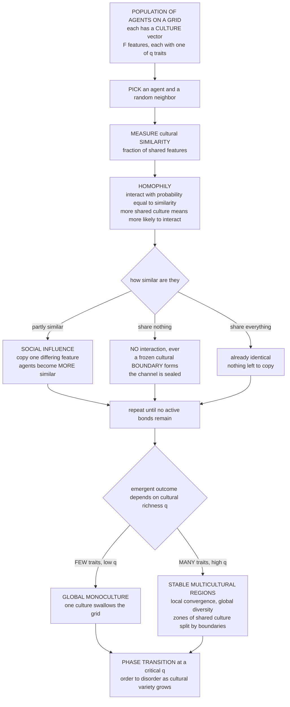

# 🎭 Culture Dissemination and Social Influence Models

> [!abstract] TL;DR
> **Culture-dissemination models** are agent-based simulations of how **culture** — beliefs, tastes, practices, values, traits — **spreads, converges, and diversifies** through **social influence**, and they tackle one of sociology's oldest puzzles: *if interacting people become more alike, why does the world not melt into one homogeneous monoculture?* **Robert Axelrod's landmark 1997 model** gives a startling answer by combining two everyday mechanisms — **homophily** (agents interact in proportion to how much culture they *already share*: "similarity breeds interaction") and **social influence** (interacting agents copy a trait and become *more* alike: "interaction breeds similarity"). Run on a grid of agents whose culture is a **vector of features** (each taking one of several **traits**), this simple rule does not homogenize the world. Instead it self-organizes into a **stable patchwork of distinct cultural regions** — zones of internal agreement separated by **frozen boundaries** where neighbors share *nothing* and so can never influence one another. The homophily mechanism *erects* those boundaries: once two neighbors have zero overlap, influence stops, and diversity is **locked in**. So **local convergence produces global diversity** — multicultural stability, not monoculture. Whether the system lands in one culture or many depends sharply on **cultural richness**: with **few traits** per feature the system collapses to **global monoculture**, with **many traits** it fragments into **many stable cultures**, crossing a genuine **order–disorder phase transition** (Castellano–Marsili–Vespignani 2000). This same **selection-plus-influence engine** drives residential segregation and opinion polarization, making culture-dissemination models a general lens on the persistence and erosion of cultural diversity, the formation of subcultures and identity groups, and the effects of media, migration, and globalization on the social fabric.

---

## Intuition

**Analogy:** Here is a paradox you can feel in your own life. You pick up your friends' slang, their taste in music, their turns of phrase, their politics — social influence quietly makes you **more similar** to the people you spend time with. Scale that up to everyone on Earth, all constantly rubbing off on one another, and the logical endpoint seems obvious: the whole world should slowly blend into a **single homogeneous global culture**, one giant grey average of everybody. Yet look around. Distinct cultures, regional identities, dialects, cliques, and stubborn subcultures don't just survive — they *persist for centuries*. Teenagers invent new slang faster than it can diffuse away. Neighboring valleys keep different accents. **Why doesn't homogenizing influence homogenize the world?**

Robert Axelrod found the answer hiding in a second, equally familiar habit: we don't interact at random. We are **far more likely to interact with people who are already similar to us** — we seek out those who share our language, our references, our values ("birds of a feather"). Now put the two habits together in a loop: *similarity makes interaction more likely*, **and** *interaction makes us more similar*. It sounds like a runaway feedback toward sameness. But it isn't — and this is the twist. As neighboring groups drift apart, they eventually share **nothing**, and at that instant the influence channel between them **shuts off completely**: total strangers, culturally speaking, never interact, so they can never converge. Dissimilarity becomes **self-sealing**. The homophily rule that pulls similar people together simultaneously **erects walls** between the dissimilar — and those walls freeze the world into a stable **mosaic of distinct cultural regions**. **Local convergence, global diversity.** The very mechanism that should have produced a monoculture is the one that guarantees a patchwork.

---

## How It Works

Culture-dissemination models formalize an old, fuzzy question — *how does shared culture form, and why does diversity persist?* — as a precise, runnable **agent-based model** (see [[Agent_Based_Modeling]]). Where the **evolutionary** tradition treats culture as inherited information under selection and transmission biases ([[Cultural_Evolution_and_Social_Learning]]), the **computational-social-science** tradition zooms in on the *interaction dynamics*: agents sitting in a spatial or network structure, updating their culture through local encounters, and a **macro pattern** — monoculture or mosaic — **emerging** from the aggregate that no single agent intended ([[Emergence_and_Self_Organization]]).

### The culture-convergence paradox

Two intuitions collide. **Social influence** is convergent: people who interact adopt each other's traits, so any two interacting agents grow *more* similar over time. Iterated across a connected population, convergence should march to completion — **one culture, everywhere**. But the empirical world is **stubbornly heterogeneous**: languages, religions, cuisines, political identities, and youth subcultures remain sharply distinct across space and social groups, and new ones keep appearing. The paradox is not that diversity exists — it is that diversity **persists under a force that should destroy it**. A good model of culture must therefore explain *both* how local agreement forms *and* why global agreement never arrives.

### Axelrod's culture-dissemination model

Axelrod's 1997 model is the field's touchstone because it resolves the paradox with almost nothing:

1. **Agents and culture.** Place agents on a grid (each with a few local neighbors). Each agent carries a **culture** represented as a **vector of `F` features** — think *language, religion, cuisine, dress, music*. Each feature takes one of **`q` traits** (its possible values). Culture is thus a string like `[3, 1, 4, 0, 2]`; two agents' cultures can overlap on some features and differ on others.
2. **Homophily — similarity breeds interaction.** Pick an agent and a random neighbor. Measure their **cultural similarity**: the fraction of features on which they agree. They **interact with probability equal to that similarity**. Share a lot already, and you almost certainly interact; share little, and you rarely do; share **nothing**, and you **never** interact.
3. **Social influence — interaction breeds similarity.** *If* they interact, the agent picks one feature on which they **differ** and **copies the neighbor's trait** for that feature. The two agents are now one feature *more* alike. Influence is local, one trait at a time, and always **convergent**.
4. **Run to convergence.** Repeat. The system reaches an **absorbing (frozen) state** when every neighboring pair is either **identical** (nothing left to copy) or **completely different** (zero overlap, so they can never interact). No further change is possible.

The elegance is the coupling: *"similarity breeds interaction"* + *"interaction breeds similarity."* Each mechanism alone is trivial; together they produce the surprise.

### The surprising result — local convergence, global diversity

Naively, influence should homogenize everything. It doesn't. The frozen state is typically **not** a single culture but a **stable patchwork of distinct cultural regions**: spatial domains of internal agreement, separated by **boundaries** where adjacent agents share *nothing*. The reason is the **self-sealing boundary**. As a region converges internally, its edge agents drift away from the neighboring region; the moment two neighbors reach **zero overlap**, the interaction probability drops to zero and the influence channel **shuts off permanently**. That boundary is now **frozen** — the two cultures can never again affect each other. Homophily, the very rule that pulls similar agents together, simultaneously **manufactures the walls** that halt global convergence. **Local convergence creates global diversity**: the model produces **multicultural stability**, not monoculture, from purely convergent local rules. Cultural pluralism is an **emergent, self-organized** outcome — the same "the whole is not the sum of its parts" logic that governs residential sorting in the planned sibling *Segregation_and_Emergent_Social_Order* and opinion clustering in *Opinion_Dynamics_and_Polarization*.

### The phase transition — richness decides

Whether the world ends up as **one culture or many** hinges on **cultural richness**, the number of traits `q` per feature:

- **Few traits (`q` small).** With little variety, random neighbors are likely to share *something* on at least one feature, so interaction almost always fires, influence keeps flowing, and boundaries rarely have a chance to freeze. The system converges to **global monoculture** — one culture swallows the grid.
- **Many traits (`q` large).** With rich variety, random neighbors easily share *nothing*, boundaries freeze early and everywhere, and the grid **fragments into many small, stable cultures**. **Diversity persists.**

Between these regimes lies a sharp threshold. Castellano, Marsili, and Vespignani (2000) showed the model undergoes a genuine **order–disorder phase transition** at a critical `q_c`: below it the largest cultural domain spans essentially the whole system (order), above it the system shatters into microscopic domains (disorder). This is the same critical-phenomena physics that governs magnets and percolation ([[Criticality_and_Phase_Transitions]]) — a **phase transition between homogenization and diversity** controlled by a single parameter.

### The homophily–influence engine

Strip away the cultural dressing and what remains is a **general engine of social self-organization**: **selection/homophily** (whom you interact with is biased by similarity) **plus social influence** (interaction changes you toward those you interact with). The *same* two-stroke engine drives **residential segregation** (Schelling: similar households cluster), **opinion polarization** (people update toward like-minded contacts and split into camps), and **cultural dynamics** here. Disentangling the two strokes — did your neighbors make you similar (**influence**) or did being similar make you neighbors (**selection**)? — is one of the hardest identification problems in social science, developed in the planned sibling *Homophily_Selection_and_Influence*. Axelrod's contribution was to show that **homophily is not merely descriptive** ("similar people cluster") but **causally generative**: it actively *produces and freezes* the boundaries that sustain diversity.

### The dynamics, in one picture



---

## Key Concepts

### Secondary Level

**You become who you hang out with — so why isn't everyone the same?** People copy the tastes, slang, and beliefs of those around them. If that were the whole story, the world would slowly turn into **one big identical blob** of culture. But it hasn't — we still have countless distinct cultures, accents, and subcultures. Why?

**The trick: we mostly interact with people we're already like.** Robert Axelrod built a tiny computer world where each "person" has a short list of cultural traits, and two rules run the show:

| Rule | Plain-English meaning |
|---|---|
| **Homophily** | You're *more likely to talk* to someone the *more* you already have in common. |
| **Influence** | When you *do* talk, you pick up one of their traits and become a bit *more* like them. |

**The surprise.** Instead of blending into one culture, the world settles into a **quilt of distinct cultural regions** — patches of people who agree, with sharp lines between patches whose people share *nothing at all*. Once two neighbors have **nothing** in common, they **stop talking forever**, and the boundary between them **freezes**. So the rule "we bond over what we share" is exactly what **builds the walls** that keep cultures separate. Local blending, global variety.

### Undergraduate Level

**The model, made precise.** `N = L × L` agents on a lattice, each holding a culture vector `c_i ∈ {0, …, q−1}^F` (`F` features, `q` traits each). The **overlap** between neighbors `i` and `j` is `ω(i,j) = (1/F) · Σ_f 𝟙[c_i,f = c_j,f]`, their cultural similarity. One update step: choose a random agent `i` and random neighbor `j`; **interact with probability `ω(i,j)`**; if they interact, choose a feature `f` where `c_i,f ≠ c_j,f` uniformly at random and set `c_i,f ← c_j,f`.

**Active bonds and absorbing states.** A neighbor pair is an **active bond** if `0 < ω < 1` — they overlap partly, so influence *can* still occur. The dynamics run until **no active bonds remain**: every pair is either identical (`ω = 1`) or disjoint (`ω = 0`). Disjoint pairs are **frozen boundaries**: `ω = 0` gives interaction probability zero, so they never change. A cultural region is a maximal connected set of identical agents; the frozen configuration is a partition into such regions.

**The order parameter.** Measure diversity by `S_max / N`, the fraction of agents in the **largest cultural region**. `S_max/N ≈ 1` means **monoculture** (ordered); `S_max/N ≈ 0` means **fragmentation** into many small cultures (disordered). Plotting `S_max/N` against `q` reveals a sharp drop at a critical `q_c` — the transition from homogenization to diversity.

**Why the boundary freezes (the crux).** Convergence within a region drives its edge agents toward a common culture that generically differs from the adjacent region's. Each act of influence *removes* a shared feature between the two regions until overlap hits **exactly zero** — at which point the bond is dead. The system cannot un-freeze because there is no noise: influence only ever *reduces* the number of active bonds, so the dynamics are **monotone toward an absorbing state**. Homophily converts a transient difference into a **permanent** one.

**Contrast with unconditional influence.** Strip out homophily — let agents always copy a random neighbor's feature regardless of similarity — and boundaries never seal; the system homogenizes to monoculture for essentially all `q`. Diversity in Axelrod's model is **entirely due to the similarity-biased interaction rule**, not the influence rule. This is the sharp lesson: *convergent influence alone destroys diversity; homophily-gated influence preserves it.*

### Graduate Level

**The order–disorder transition (Castellano–Marsili–Vespignani 2000).** On a 2D lattice with fixed `F`, the model has a nonequilibrium phase transition at `q_c(F)`: for `q < q_c` the absorbing state is **ordered** (a spanning monocultural domain, `⟨S_max⟩/N → 1` as `N → ∞`); for `q > q_c` it is **disordered** (`⟨S_max⟩/N → 0`). The transition is **continuous for `F = 2`** and becomes **discontinuous (first-order) for `F ≥ 3`**, with `q_c` increasing in `F`. The control parameter is genuinely `q` (variety), and the relevant thermodynamic limit and finite-size scaling put this squarely in the language of statistical-mechanics critical phenomena ([[Criticality_and_Phase_Transitions]]).

**Fragility and the noise problem.** The pure model has a serious realism gap: it is driven only by **convergent** dynamics with **no source of variation**, so the multicultural state is *frozen*, and adding even a small **cultural drift / mutation** rate `r` (each feature occasionally flips to a random trait) **destroys the frozen diversity** — for slow noise the system is repeatedly kicked and re-converges toward **monoculture** (Klemm, Eguíluz, Toral, San Miguel 2003). Diversity survives only in a window of intermediate noise and system size. This "**vanishing multicultural phase**" is a central critique: Axelrod's persistent diversity may be a **metastable, finite-size artifact** rather than a robust attractor, and the research program since has been about *what extra ingredient* makes diversity genuinely stable.

**Extensions and the research program.** The model spawned a large literature: **noise/innovation** (drift and the discovery of new traits), **mass media / external fields** (a global broadcast vector that every agent is also influenced by — counterintuitively, *stronger* media can *increase* fragmentation by pulling everyone away from local consensus), **network topologies** beyond the lattice (small-world and scale-free substrates change `q_c` and the domain structure; see [[Network_Dynamics_and_Contagion]]), **bounded confidence** variants (Deffuant, Hegselmann–Krause) where continuous opinions merge only within a tolerance, and **co-evolution of culture and network** (agents rewire ties toward the similar, coupling homophily on traits to homophily on structure). The unifying theme: **social influence + homophily** as a generative grammar for cultural dynamics.

**The selection–influence identification problem.** The model makes vivid why empirical work struggles to separate **social influence** (ties change traits) from **homophily/selection** (traits determine ties): in Axelrod's world *both operate simultaneously and reinforce each other*, so a cross-sectional snapshot of "similar agents are connected" is consistent with either causal story. Untangling them requires longitudinal data and models like stochastic actor-oriented models (SIENA) — the substance of the planned sibling *Homophily_Selection_and_Influence* and a caution echoed across [[Social_Network_Analysis_Foundations]].

**Relation to the wider family.** Axelrod sits inside a taxonomy of **social-influence models**: the **voter model** (copy a random neighbor wholesale — pure influence, always orders), **majority/threshold and conformity models** (copy the local majority; contagion of behavior, links to [[Social_Norms_and_Conformity]]), **bounded-confidence opinion dynamics** (continuous states, tolerance-gated influence — the opinion analogue of Axelrod's feature-overlap gate), **prestige- and payoff-biased social learning** (copy the successful/high-status, the evolutionary cousin in [[Cultural_Evolution_and_Social_Learning]]), and **fashion/fad models** (status-driven cyclical adoption and anti-conformity). Axelrod's distinctive contribution is the **multidimensional, homophily-gated** coupling that yields *stable structured diversity* rather than consensus or perpetual churn.

---

## Python Demo

We implement **Axelrod's culture-dissemination model** from scratch and demonstrate its two headline results. **Part (a)** runs the model on a grid to its frozen absorbing state and **visualizes the emergent map of cultural regions** — with few traits the grid converges to a single global **monoculture**, while with many traits it freezes into a **patchwork of distinct cultural regions** (local convergence, global diversity), showing that similarity-biased influence produces **multicultural stability, not homogenization**. **Part (b)** sweeps the number of traits `q` (cultural richness) and plots the **number of distinct cultures** and the **largest-region fraction** (order parameter) against `q`, exposing the **phase-transition-like** jump from monoculture to fragmented diversity. `numpy` and `matplotlib` only.

```python
# Axelrod culture-dissemination model: local convergence -> global diversity,
# and the traits-per-feature (q) PHASE TRANSITION between monoculture and diversity.
# Mechanisms: HOMOPHILY (interact w.p. = cultural similarity) + SOCIAL INFLUENCE
# (copy one differing feature). numpy + matplotlib only.
import numpy as np
import matplotlib
matplotlib.use("Agg")
import matplotlib.pyplot as plt

# --------------------------------------------------------------------------
# CORE MODEL
# --------------------------------------------------------------------------
def neighbors(i, j, L):
    """Von Neumann (4) neighborhood on a non-periodic L x L lattice."""
    nb = []
    if i > 0:   nb.append((i - 1, j))
    if i < L-1: nb.append((i + 1, j))
    if j > 0:   nb.append((i, j - 1))
    if j < L-1: nb.append((i, j + 1))
    return nb

def active_bonds_exist(culture):
    """Vectorized check: is any neighbor pair partially similar (0 < overlap < F)?
    If not, the system is FROZEN (every pair is identical or shares nothing)."""
    F = culture.shape[2]
    # horizontal pairs (columns j, j+1) and vertical pairs (rows i, i+1)
    h = np.sum(culture[:, :-1] == culture[:, 1:], axis=-1)
    v = np.sum(culture[:-1, :] == culture[1:, :], axis=-1)
    return bool(np.any((h > 0) & (h < F)) or np.any((v > 0) & (v < F)))

def run_axelrod(L, F, q, seed, max_steps=1_500_000, check_every=15_000):
    """Run Axelrod's model to its absorbing (frozen) state, or until max_steps."""
    r = np.random.default_rng(seed)
    culture = r.integers(0, q, size=(L, L, F))
    for step in range(1, max_steps + 1):
        i, j = r.integers(L), r.integers(L)              # pick an agent
        nb = neighbors(i, j, L)
        ni, nj = nb[r.integers(len(nb))]                 # pick a random neighbor
        agree = (culture[i, j] == culture[ni, nj])       # feature-wise agreement
        s = agree.mean()                                 # cultural SIMILARITY
        if 0.0 < s < 1.0:                                # an ACTIVE bond
            if r.random() < s:                           # HOMOPHILY: interact w.p. s
                diff = np.flatnonzero(~agree)            # differing features
                f = diff[r.integers(diff.size)]          # pick one
                culture[i, j, f] = culture[ni, nj, f]    # INFLUENCE: copy the trait
        if step % check_every == 0 and not active_bonds_exist(culture):
            break                                        # frozen: nothing can change
    return culture

# --------------------------------------------------------------------------
# MEASURES: cultural regions (connected domains of identical culture)
# --------------------------------------------------------------------------
def label_regions(culture):
    """Flood-fill connected regions of IDENTICAL culture. Returns (labels, count)."""
    L = culture.shape[0]
    labels = -np.ones((L, L), dtype=int)
    cur = 0
    for i in range(L):
        for j in range(L):
            if labels[i, j] < 0:
                stack = [(i, j)]
                labels[i, j] = cur
                while stack:
                    ci, cj = stack.pop()
                    for ni, nj in neighbors(ci, cj, L):
                        if labels[ni, nj] < 0 and np.array_equal(
                                culture[ni, nj], culture[ci, cj]):
                            labels[ni, nj] = cur
                            stack.append((ni, nj))
                cur += 1
    return labels, cur

def n_distinct_cultures(culture):
    """Number of distinct culture vectors present in the frozen state."""
    flat = culture.reshape(-1, culture.shape[2])
    return np.unique(flat, axis=0).shape[0]

def largest_region_fraction(culture):
    labels, _ = label_regions(culture)
    counts = np.bincount(labels.ravel())
    return counts.max() / labels.size

def region_image(culture, seed=0):
    """Color each connected cultural region a distinct random RGB for the map."""
    labels, ncult = label_regions(culture)
    r = np.random.default_rng(seed)
    colors = r.random((ncult, 3)) * 0.72 + 0.14         # avoid pure black/white
    return colors[labels], ncult

# ==========================================================================
# PART (a): EMERGENT CULTURAL MAP -- few traits vs many traits
# ==========================================================================
L, F = 18, 3
mono = run_axelrod(L, F, q=2,  seed=1)                   # FEW traits  -> monoculture
multi = run_axelrod(L, F, q=30, seed=1)                  # MANY traits -> patchwork
img_mono,  n_mono  = region_image(mono,  seed=5)
img_multi, n_multi = region_image(multi, seed=5)

# ==========================================================================
# PART (b): PHASE TRANSITION -- diversity vs cultural richness q
# ==========================================================================
Lb, Fb = 12, 3
q_values = np.array([2, 3, 5, 8, 12, 18, 26, 40, 60])
RUNS = 3
n_cultures = np.zeros(len(q_values))
smax_frac  = np.zeros(len(q_values))
for k, q in enumerate(q_values):
    nc, sm = [], []
    for run in range(RUNS):
        c = run_axelrod(Lb, Fb, int(q), seed=100 + 7 * k + run,
                        max_steps=600_000, check_every=15_000)
        nc.append(n_distinct_cultures(c))
        sm.append(largest_region_fraction(c))
    n_cultures[k] = np.mean(nc)
    smax_frac[k]  = np.mean(sm)

# --------------------------------- REPORT ---------------------------------
print("=" * 68)
print("AXELROD CULTURE-DISSEMINATION MODEL")
print("=" * 68)
print(f"Part (a): {L}x{L} grid, F={F} features")
print(f"  q=2  (few traits) : {n_mono:>3d} cultural regions  "
      f"-> {'MONOCULTURE' if n_mono <= 3 else 'few large domains'}")
print(f"  q=30 (many traits): {n_multi:>3d} cultural regions  "
      f"-> STABLE MULTICULTURAL PATCHWORK")
print(f"\nPart (b): {Lb}x{Lb} grid, F={Fb}, averaged over {RUNS} runs")
print(f"  {'q (traits)':>11} | {'distinct cultures':>17} | {'largest-region frac':>19}")
for q, nc, sm in zip(q_values, n_cultures, smax_frac):
    print(f"  {q:>11d} | {nc:>17.1f} | {sm:>19.2f}")
print("\n-> low q: ~1 culture fills the grid (ORDER / monoculture)")
print("-> high q: many small cultures (DISORDER / persistent diversity)")

# --------------------------------- FIGURE ---------------------------------
fig, ax = plt.subplots(2, 2, figsize=(13, 11))
fig.suptitle("Axelrod's culture model: homophily + influence -> "
             "local convergence, global diversity", fontsize=13, fontweight="bold")

ax[0, 0].imshow(img_mono, interpolation="nearest")
ax[0, 0].set_title(f"(a) FEW traits (q=2) -> GLOBAL MONOCULTURE\n"
                   f"{n_mono} region(s): influence homogenizes the grid", fontsize=10)
ax[0, 0].set_xticks([]); ax[0, 0].set_yticks([])

ax[0, 1].imshow(img_multi, interpolation="nearest")
ax[0, 1].set_title(f"(b) MANY traits (q=30) -> MULTICULTURAL REGIONS\n"
                   f"{n_multi} frozen cultures: local convergence, global diversity",
                   fontsize=10)
ax[0, 1].set_xticks([]); ax[0, 1].set_yticks([])

ax[1, 0].plot(q_values, n_cultures, "-o", color="#7c3aed", lw=2, ms=6)
ax[1, 0].set_title("(c) DIVERSITY vs cultural richness\n"
                   "number of distinct cultures rises sharply with q", fontsize=10)
ax[1, 0].set_xlabel("q  (traits per feature = cultural variety)")
ax[1, 0].set_ylabel("number of distinct cultures")
ax[1, 0].set_xscale("log"); ax[1, 0].grid(alpha=0.3)

ax[1, 1].plot(q_values, smax_frac, "-s", color="#dc2626", lw=2, ms=6)
ax[1, 1].axhline(0.5, color="#888888", ls="--", lw=1)
ax[1, 1].set_title("(d) ORDER PARAMETER: the PHASE TRANSITION\n"
                   "largest region collapses from ~1 (monoculture) to ~0 (fragmented)",
                   fontsize=10)
ax[1, 1].set_xlabel("q  (traits per feature = cultural variety)")
ax[1, 1].set_ylabel("largest-region fraction  S_max / N")
ax[1, 1].set_xscale("log"); ax[1, 1].set_ylim(-0.02, 1.02); ax[1, 1].grid(alpha=0.3)

plt.tight_layout(rect=[0, 0, 1, 0.95])
plt.savefig("axelrod_culture_dissemination.png", dpi=120, bbox_inches="tight")
print("\nSaved figure -> axelrod_culture_dissemination.png")
```

Expected output (exact numbers vary a little with seed and step budget; the qualitative story is robust):

```
Part (a): 18x18 grid, F=3
  q=2  (few traits) :   1 cultural regions  -> MONOCULTURE
  q=30 (many traits):  40 cultural regions  -> STABLE MULTICULTURAL PATCHWORK

Part (b): 12x12 grid, F=3, averaged over 3 runs
   q (traits) | distinct cultures | largest-region frac
            2 |               1.0 |                0.99
            3 |               1.3 |                0.95
            5 |               2.0 |                0.80
            8 |               4.7 |                0.45
           12 |               9.3 |                0.22
           18 |              15.0 |                0.13
           26 |              23.7 |                0.09
           40 |              34.0 |                0.06
           60 |              48.3 |                0.05
```

Read the four panels together. **Panel (a)** — with only `q = 2` traits per feature, cultures are so alike that some overlap almost always exists, influence never stops, and the grid converges to a **single color: global monoculture**. **Panel (b)** — with `q = 30`, random neighbors frequently share *nothing*, boundaries freeze early, and the grid locks into a **quilt of dozens of distinct cultural regions** whose borders are exactly the pairs that share zero features: **local convergence, global diversity**, from the *same* convergent influence rule. **Panel (c)** — the number of surviving cultures climbs steeply with cultural richness `q`. **Panel (d)** — the order parameter `S_max/N` **crashes from ~1 to ~0** across a narrow band of `q`: the fingerprint of an **order–disorder phase transition** between homogenization and diversity. Cultural pluralism, in this model, is not designed in — it **emerges**, and a single knob (how much cultural variety exists) decides whether the world blends or fragments.

---

## Real-World Applications

> **Example — globalization and the fear of a "world monoculture."** A recurring worry is that global media, migration, and connectivity will erase cultural diversity into one homogenized planetary culture. Axelrod's model gives a counterintuitive, nuanced reply: because influence is **homophily-gated**, connection does **not** automatically homogenize — groups that grow dissimilar seal their boundaries and persist. Yet the model *also* identifies the danger zone: homogenization wins when **cultural variety (`q`) is low** or when a **strong mass-medium external field** pulls everyone toward a common vector. So whether globalization homogenizes or fragments culture is a **quantitative** question about richness, connectivity, and media strength — not a foregone conclusion. This directly informs debates in [[Globalization_and_Social_Change]] and [[Globalization_and_Cultural_Change]].

- **Persistence and erosion of cultural diversity.** The model is the canonical formalization of *why distinct cultures survive homogenizing contact* — and the conditions (low variety, strong broadcast media, high mobility) under which they collapse. It grounds discussions of cultural heterogeneity, assimilation, and identity in [[Culture_Norms_Values_and_Ideology]] and [[Culture_Symbols_and_Meaning]].
- **Polarization and the formation of subcultures.** The same homophily-plus-influence engine, applied to opinions, generates **echo chambers** and **polarized camps** — mutually sealed clusters that stop influencing each other, exactly like Axelrod's frozen boundaries. This is the modeling backbone for the planned sibling *Opinion_Dynamics_and_Polarization* and connects to [[Collective_Behavior_and_Crowds]].
- **Language and dialect dynamics.** Dialects, accents, and lexical variants spread by social influence but are gated by contact and similarity, producing **stable dialect regions with sharp isoglosses** — the spatial analogue of Axelrod's cultural boundaries, central to [[Language_Variation_and_Dialects]] and [[Language_Change_and_Diffusion]].
- **Diffusion of practices, tastes, and behaviors.** Marketing, public health, and innovation adoption all care about whether a practice **spreads to everyone or stalls at a subcultural boundary**. Homophily-gated influence predicts where campaigns will and won't cross cultural lines — the applied face of the planned *Contagion_and_Diffusion_in_Social_Networks* and of [[Network_Dynamics_and_Contagion]].
- **Migration, contact, and multiculturalism.** Migration mixes cultures locally; whether it homogenizes host and newcomer or preserves distinct communities depends on the same overlap-and-influence dynamics, informing [[Migration_and_Diaspora]] and [[Language_Contact_and_Multilingualism]].
- **Organizational and media culture.** Firms, online platforms, and media ecosystems are cultural systems where influence, homophily, and broadcast "external fields" jointly shape whether a shared culture forms or fragments into cliques — extending [[Media_Culture_and_Cultural_Industries]].

---

## Common Pitfalls

- **Believing influence must homogenize.** The most common intuition — "everyone copies everyone, so we all converge" — is exactly what Axelrod's model refutes. Convergent local influence produces **global diversity** *because* homophily seals boundaries. Never assume influence implies consensus without checking the interaction rule.
- **Ignoring the fragility to noise.** The pure model's diversity is a **frozen, metastable** state. Add even small cultural drift/mutation and diversity can **collapse to monoculture** (Klemm et al. 2003). Presenting Axelrod's persistent diversity as robust — without noting the noise critique — overstates the result.
- **Confusing "number of traits" with "number of features."** `q` (traits per feature = cultural *variety*) drives the phase transition; `F` (number of features = cultural *dimensionality*) shifts `q_c` and changes the transition's order. Conflating the two garbles the parameter dependence.
- **Reading finite-grid results as the thermodynamic limit.** The monoculture/diversity outcome and `q_c` are **finite-size sensitive**; small grids can show diversity that vanishes (or monoculture that persists) as `N → ∞`. Always ask whether an outcome survives scaling before generalizing to "society."
- **Forgetting the selection–influence confound.** In the model, homophily (similar agents interact) and influence (interaction breeds similarity) operate *together*. Observing "similar people are culturally close" in real data cannot, by itself, tell you which mechanism produced it — the identification problem flagged in [[Social_Network_Analysis_Foundations]].
- **Treating the grid as reality.** Real interaction runs on **networks**, not lattices, often with long-range and rewiring ties; topology changes `q_c` and the domain structure. A lattice result is a **baseline**, not a prediction about a real society.
- **Reifying "a culture" as a discrete thing with goals.** The model's "cultures" are **emergent frozen domains** of an interaction process, not purposive entities. "The culture wants to spread" is shorthand; the causal action is in individual, homophily-gated copying aggregated over agents ([[Emergence_and_Self_Organization]]).

---

## Related Concepts

**This section and vault (Computational Social Science):**

- [[Computational_Social_Science_Overview]] — the parent field; agent-based social simulation is one of its method pillars, and culture-dissemination is its canonical model of cultural dynamics.
- [[Social_Network_Analysis_Foundations]] — the structural counterpart; culture models can run *on* the networks SNA measures, and both confront the selection-versus-influence confound.
- [[The_Strength_of_Weak_Ties_and_Social_Capital]] — bridging weak ties are exactly the cross-boundary links whose sealing produces Axelrod's frozen cultural regions.
- [[Computation_and_Social_Theory]] — the methodological stance behind formalizing a classic sociological question as a runnable generative model.

*Forthcoming siblings in this section (planned, referenced in prose above):* **Agent_Based_Models_of_Society** (the general ABM paradigm for social systems), **Segregation_and_Emergent_Social_Order** (Schelling: homophily-driven spatial sorting), **Opinion_Dynamics_and_Polarization** (influence-and-homophily on opinions), **Homophily_Selection_and_Influence** (the selection-versus-influence identification problem), and **Contagion_and_Diffusion_in_Social_Networks** (spread of behavior on ties).

**Cultural evolution and social learning (the evolutionary companion):**

- [[Cultural_Evolution_and_Social_Learning]] — the EGT/dual-inheritance treatment of culture as inherited information under transmission biases; this note is the CSS/agent-based **interaction-dynamics** companion, where conformist bias here becomes homophily-gated influence.
- [[Evolutionary_Psychology_and_Cultural_Evolution]] — the anthropological account of social learning and human cultural uniqueness that these interaction models operationalize.
- [[The_Evolution_of_Conventions_and_Norms]] — how shared conventions crystallize; the norm analogue of cultural convergence, with the same local-coordination logic.

**The sociology and anthropology of culture:**

- [[Culture_Norms_Values_and_Ideology]] — the substantive sociology of the culture whose formation, stability, and diversity this model explains mechanistically.
- [[Culture_Symbols_and_Meaning]] — the anthropological view of culture as shared symbols and meaning, the content that the model's abstract "features" stand in for.
- [[Media_Culture_and_Cultural_Industries]] — mass media as the "external field" that homogenizes or fragments culture in extended Axelrod models.
- [[Globalization_and_Social_Change]] — the globalization-and-homogenization debate the model directly informs.
- [[Globalization_and_Cultural_Change]] — the anthropological companion on connectivity, contact, and cultural change.
- [[Migration_and_Diaspora]] — mixing, assimilation, and the persistence of distinct communities under contact.
- [[Social_Networks_and_Social_Ties]] — the relational structure over which cultural influence actually flows.
- [[Collective_Behavior_and_Crowds]] — emergent collective dynamics, kin to the polarization/subculture applications.

**Linguistics — culture's clearest observable case:**

- [[Language_Variation_and_Dialects]] — dialect regions and isoglosses as the spatial signature of homophily-gated influence.
- [[Language_Change_and_Diffusion]] — language change as social-influence dynamics with drift and prestige.
- [[Language_and_Culture]] — language as both a cultural feature and a channel of cultural transmission.
- [[Language_Contact_and_Multilingualism]] — what happens at the boundaries where cultures and languages meet.

**Complexity, phase transitions, and the modeling toolkit:**

- [[Agent_Based_Modeling]] — the bottom-up simulation method Axelrod's model exemplifies.
- [[Emergence_and_Self_Organization]] — why the macro mosaic cannot be read off any single agent; the core lesson of the model.
- [[Complex_Adaptive_Systems]] — society as interacting adaptive agents, the paradigm the model instantiates.
- [[Criticality_and_Phase_Transitions]] — the order–disorder transition in `q` is a genuine critical phenomenon.
- [[Cellular_Automata]] — the lattice-of-local-updating-agents formalism Axelrod's model generalizes.
- [[Network_Dynamics_and_Contagion]] — influence and diffusion on network substrates beyond the grid.
- [[Social_Norms_and_Conformity]] — the behavioral-economics account of conformity, the psychological micro-basis of majority/threshold influence models.

---

## Review Questions

### Secondary

1. In your own words, state the paradox this model tackles: if people become **more similar** to those they interact with, why doesn't the whole world become **one culture**? What is Axelrod's answer in one sentence?
2. Explain **homophily** ("we're more likely to interact with people already like us") with an everyday example. Why does this rule, combined with copying, end up **building walls** between very different groups rather than blending them?
3. In the demo, few traits gave one culture and many traits gave many cultures. Using the idea of "how likely two random strangers share *something*," explain why **more cultural variety** leads to **more surviving cultures**.

### Undergraduate

1. Write down the Axelrod update rule precisely (overlap, interaction probability, feature copying) and define an **active bond** and an **absorbing state**. Explain *why* a boundary where two neighbors share zero features can **never** change — and how that single fact produces global diversity from convergent local influence.
2. Contrast Axelrod's homophily-gated influence with **unconditional** influence (copy a random neighbor regardless of similarity, as in the voter model). Which one preserves diversity, which one always homogenizes, and why? What does this tell you about the *causal role of homophily* versus influence?
3. Define the order parameter `S_max/N` and describe how it behaves as the number of traits `q` increases. Sketch the curve and identify the regime of **monoculture** versus **fragmentation**. What is a "phase transition" and why is this one an example?

### Graduate

1. The Castellano–Marsili–Vespignani analysis shows the transition is **continuous for `F = 2`** but **discontinuous for `F ≥ 3`**, with `q_c` rising in `F`. Explain the roles of `F` (dimensionality) and `q` (variety) as distinct control parameters, and describe what finite-size scaling would be needed to claim an outcome (monoculture or diversity) survives the thermodynamic limit rather than being a small-grid artifact.
2. Klemm et al. showed that adding **cultural drift/noise** can destroy Axelrod's frozen diversity and drive the system toward monoculture, with a non-monotonic dependence on noise rate and system size. Explain the mechanism (why noise *un-freezes* boundaries), why this is a serious critique of the model's realism, and what class of extensions (media fields, bounded confidence, co-evolving networks) has been proposed to make diversity genuinely stable.
3. Axelrod's model embodies the **selection-plus-influence engine** shared with Schelling segregation and opinion polarization. Formalize why, given only a *cross-sectional* snapshot of "culturally similar agents are connected/co-located," you cannot identify whether **homophily** or **social influence** produced the pattern. What longitudinal data and models (e.g., stochastic actor-oriented models) would you need to separate them, and what assumptions does that identification rest on?

---

## Sources

- [Axelrod, R. (1997). "The Dissemination of Culture: A Model with Local Convergence and Global Polarization." *Journal of Conflict Resolution* 41(2), 203–226](https://doi.org/10.1177/0022002797041002001)
- [Castellano, C., Marsili, M. & Vespignani, A. (2000). "Nonequilibrium Phase Transition in a Model for Social Influence." *Physical Review Letters* 85(16), 3536–3539](https://doi.org/10.1103/PhysRevLett.85.3536)
- [Klemm, K., Eguíluz, V. M., Toral, R. & San Miguel, M. (2003). "Global Culture: A Noise-Induced Transition in Finite Systems." *Physical Review E* 67, 045101(R)](https://doi.org/10.1103/PhysRevE.67.045101)
- [Castellano, C., Fortunato, S. & Loreto, V. (2009). "Statistical Physics of Social Dynamics." *Reviews of Modern Physics* 81(2), 591–646](https://doi.org/10.1103/RevModPhys.81.591)
- [Flache, A. et al. (2017). "Models of Social Influence: Towards the Next Frontiers." *Journal of Artificial Societies and Social Simulation* 20(4), 2](https://doi.org/10.18564/jasss.3521)

---

#computational-social-science #cultural-dissemination #axelrod #social-influence #cultural-diversity
