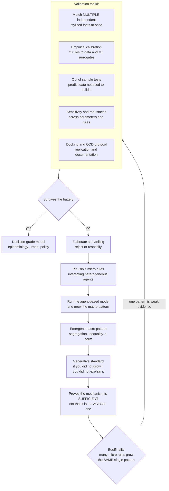

# 🌱 Generative Social Science and Model Validation

> [!abstract] TL;DR
> **Generative social science** (Joshua Epstein) explains a social phenomenon by **growing it from the bottom up** in an agent-based model from plausible micro-level behaviors — its motto, **"if you didn't grow it, you didn't explain it,"** makes explanation *constructive* and *mechanism-based*: you understand segregation, cooperation, a norm, or an inequality when a population of interacting agents *reliably produces* it. But this is only **half the story**. Growing a pattern proves a mechanism is **sufficient** (it *can* produce the pattern), not that it is the **actual** one — and because flexible agent-based models can "grow almost anything," **equifinality** (many different micro-mechanisms yield the *same* macro pattern) means reproducing a *single* pattern cannot identify the true mechanism. Rigorous **validation** is therefore what separates insight from elaborate storytelling: matching **multiple independent stylized facts at once**, **empirical calibration** to data (increasingly via **machine-learning surrogates** and **simulation-based inference**), **out-of-sample** tests, **sensitivity and robustness** analysis, model **docking** and replication, and standardized **ODD** documentation. This unglamorous methodology is precisely what elevates agent-based social science from illustrative toys into the **decision-grade instruments** now used in epidemiological, urban, and social policy.

---

## Intuition

**Analogy — the magician's coin.** A magician can make a coin appear from thin air. It is impressive, it *looks* like an explanation of where coins come from, and it explains absolutely nothing about coins. An agent-based model that "reproduces" residential segregation is similarly seductive and similarly hollow — *unless* you have shown it captures the **real mechanism**, and not merely one of a thousand ways to fake the pattern. Watching the trick work is not the same as understanding the trick.

Epstein's motto — **"if you didn't grow it, you didn't explain it"** — is the field's founding demand: to claim you understand a macro social pattern, you must *build* a society of interacting individuals whose local rules *generate* that pattern from the bottom up. That is genuinely powerful, but it is only **half the story**. The other half is proving your grown society **resembles the real one**. The promise of generative social science is *explanation by construction*; its peril is that flexible simulations can grow almost *anything*, so **validation is what separates insight from elaborate storytelling** — the same tension that animates [[Computation_and_Social_Theory]] and, in economics, [[Calibration_and_Validation_of_Agent_Based_Models]].

---

## How It Works

### The generative standard of explanation

Generative social science offers a **distinctive, computational standard of explanation** for the social sciences. To explain a macro pattern — segregation, cooperation, inequality, the spread of a norm — you write down **plausible local rules** for interacting, heterogeneous agents and show that a population of them **reliably produces** that pattern from the bottom up. Explanation becomes the **demonstration of a sufficient micro-mechanism**: Schelling's *mild* individual preferences suffice to generate sharp macro segregation ([[Schelling_Segregation_and_Emergent_Patterns]]), even though no agent wants it. This standard is:

- **Constructive** — you do not merely describe the pattern, you *build* the process that yields it.
- **Mechanism-based** — it specifies *how* the pattern arises from interactions, aligning with **analytical sociology** (Hedström and Ylikoski), which explains macro regularities by naming the micro "cogs and wheels" rather than citing a bare correlation between macro variables.
- **Unifying** — it fuses theory with computation: the model *is* the theory, made executable ([[Emergence_of_Macro_from_Micro]], [[Agent_Based_Modeling_in_Economics]]).

It contrasts sharply with **statistical explanation** (a correlation between variables) and with **equilibrium proofs** (a fixed point that assumes away the dynamics). "Growing" a phenomenon is a form of understanding no regression or theorem provides — the epistemology of the emerging *Agent_Based_Models_of_Society* and *Segregation_and_Emergent_Social_Order* siblings, and a genuine contribution of computational social science to the philosophy of social explanation (compare [[Explanation_and_Laws_of_Nature]]).

### The motto and its limits — sufficiency is not identity

Here is the crucial caveat the slogan hides. Growing a pattern proves your mechanism is **sufficient** — it *can* produce the pattern — **not** that it is the **actual** or **necessary** one. Real societies might produce the same regularity in an entirely different way. So *"grew it"* is **necessary but not sufficient** for explanation: it is the price of admission, not the trophy. There is a real gap between *demonstrating a possible mechanism* and *identifying the true one*, and closing that gap is exactly what **validation** does. Honest generative modeling states this boundary out loud: a successful demonstration is a candidate explanation, not a proven one.

### The validation problem — you can grow anything

This is the central methodological challenge. Agent-based models are **flexible**: many agents, many rules, many free parameters. Such a model is a *very expressive function* and can be tuned to "grow" almost **any** pattern you like. So how do you show a model captures **reality**, rather than just your own assumptions? This is the credibility crisis of simulation — sometimes called the **"wilderness"** critique — and validation is what separates *scientific* agent-based modeling from an elaborate just-so story. Making generative social science rigorous is the whole point of the discipline described here and its economic cousin, [[Calibration_and_Validation_of_Agent_Based_Models]].

### Equifinality — the deep identification problem

The sharpest form of the problem has a name: **equifinality** (also **underdetermination**). **Many different micro-mechanisms can produce the same macro pattern.** Several distinct rule-sets can grow the *same* segregation level, the *same* skewed wealth distribution, the *same* power-law city-size curve. The map from **mechanisms to patterns is many-to-one**, so *inverting* it — inferring the mechanism from the outcome alone — is impossible. Consequently, **matching one pattern is weak evidence**: you cannot read the process off the result, and a beautiful match to a single macro statistic proves almost nothing. The Python demo below makes this quantitative.

### The validation toolkit — how to defeat equifinality

Validation is a **layered** activity spanning **input** (are the rules realistic?), **process** (is the mechanism right?), and **output** (does the model match data?) checks:

1. **Match stylized facts.** Reproduce robust empirical regularities — fat tails, skewed distributions, a segregation index — *without hard-coding them*. This is the first bar.
2. **Match multiple independent stylized facts at once.** This is the key to defeating equifinality. Any one regularity is easy to fake; a model that reproduces *several unrelated* regularities *simultaneously* is dramatically harder to fake and far more credible. Grimm's **pattern-oriented modeling** formalizes this: demand several patterns at several scales together, and the space of admissible mechanisms collapses.
3. **Empirical calibration.** Fit agent rules and parameters to survey, experimental, behavioral, or big-data evidence rather than choosing them by hand (the found-data and behavioral inputs of *Prediction_and_Machine_Learning_in_Social_Science*).
4. **Out-of-sample / predictive validation.** Does the calibrated model reproduce data it was *not* built on? This is the hardest and most honest test — the [[Cross_Validation]] discipline imported from machine learning.
5. **Face validity and micro-validation.** Are the agent rules themselves realistic? Validate the *micro-behavior* against direct evidence, not just the macro output.
6. **Sensitivity and robustness analysis.** Do the results survive across parameters, seeds, and reasonable rule variants, or are they **fragile artifacts** of one lucky configuration? Global methods (Sobol indices, Latin-hypercube sampling) separate robust findings from knife-edge coincidences.

### Docking, replication, and the ODD protocol

Because an agent-based model *is* code, it invites a "black box" complaint, answered by reproducibility practices:

- **Docking** (model-to-model alignment; Axtell, Axelrod, Epstein, and Cohen) re-implements a model in a *different* framework to check that a result is a property of the **theory**, not of coding artifacts.
- **Replication** of published models — often revealing that they do *not* reproduce as described — is a recognized reproducibility problem in the field.
- **Standardized documentation** via the **ODD protocol** (Overview, Design concepts, Details; Grimm et al.) lets a model be described completely and reproducibly in prose. Together with open code and fixed seeds, this professionalizes the methodology and answers the black-box concern.

### The simplicity-realism tension — KISS vs KIDS

A live design debate governs *how much* to include:

- **KISS** ("Keep It Simple, Stupid"; Axelrod) — simple, transparent, illustrative models that reveal *one* mechanism cleanly, deliberately sacrificing realism. Best for **understanding and theory**.
- **KIDS** ("Keep It Descriptive, Stupid"; Edmonds and Moss) — rich, realistic, calibrated models built for **prediction and policy**, sacrificing interpretability for fidelity.

Neither wins in general; the art is **matching model complexity to the question**. Simple models buy interpretability; complex ones buy realism — the same **bias-variance / interpretability-fidelity** trade-off that governs supervised learning ([[Bias_Variance_Tradeoff]]).

### The modern frontier — machine learning meets validation

Because each simulation run is expensive and the likelihood is intractable, the modern toolkit is **simulation-based inference**: fit fast **surrogate / emulator** models (Gaussian processes, random forests, neural nets) to the model's costly input-output map, use **Approximate Bayesian Computation** and neural **simulation-based inference** to calibrate flexible models to data, and run **inverse modeling** to estimate *which* mechanisms best fit. This computational-statistics machinery — sharing its toolbox with [[Bayesian_Statistics]] and Bayesian optimization — is what finally makes generative models **empirically disciplined**.

### Flow / Architecture



---

## Key Concepts

### Secondary
- **Growing a thing is a way of understanding it.** If you can write simple rules for imaginary people and watch a real-looking pattern — a segregated city, a fashion, a wealth gap — appear on your screen, you have shown *one way* the pattern could arise. That is Epstein's "if you didn't grow it, you didn't explain it."
- **But the magician's coin is not an explanation.** Making the pattern appear proves your rules *can* produce it, not that they are what *actually* produces it in the real world.
- **Many recipes, one cake.** Very different sets of rules can produce the *same* overall pattern (this is called **equifinality**). So matching one pattern is weak evidence — you cannot tell which recipe was really used just by tasting the cake.
- **The cure is to match many facts at once.** A model that reproduces *several* unrelated real-world regularities together is much harder to fake than one that matches a single number.

### Undergraduate
- **The generative standard.** Explanation as demonstrating a *sufficient micro-mechanism*: you have explained a macro pattern when interacting agents following plausible local rules reliably grow it (constructive, mechanism-based, unifying theory with computation).
- **Sufficiency is not identity.** Growing a pattern shows a mechanism *can* produce it, not that it *did*. "Grew it" is necessary but not sufficient for explanation; the gap is closed by validation.
- **Equifinality / underdetermination.** The mechanism-to-pattern map is many-to-one, so a good fit to one pattern does not pin down the mechanism. This is the central limit on generative inference.
- **The validation toolkit.** Match stylized facts (and crucially *multiple independent* ones), calibrate rules to data, test out-of-sample, validate the micro-rules for face validity, and run sensitivity/robustness analysis to weed out fragile artifacts.
- **Docking, replication, ODD.** Re-implement a model in another framework (docking) to check it is not a coding artifact; replicate published models; document with the ODD protocol so results are transparent and reproducible.
- **KISS vs KIDS.** Simple illustrative models for *understanding* versus rich calibrated models for *prediction* — match model complexity to the question.

### Graduate
- **Generative sufficiency versus explanatory identification.** Epstein's criterion certifies that a mechanism belongs to the *sufficient set* for a target pattern; it says nothing about *uniqueness*. Equifinality means the preimage of a macro observable under the mechanism-to-pattern map is a large, often high-dimensional set — the formal signature of underdetermination in social simulation, and the reason a single moment cannot identify a model (see the demo and [[Calibration_and_Validation_of_Agent_Based_Models]]).
- **Defeating equifinality with joint moments.** Each additional *independent* stylized fact imposes a further constraint surface in mechanism space; requiring a model to lie on the intersection of many such surfaces shrinks the admissible set super-linearly. Pattern-oriented modeling (Grimm) and over-identified simulated method of moments exploit exactly this — over-identification also yields a *specification test*: a model that cannot match all moments jointly is misspecified, not merely mis-tuned.
- **Likelihood-free calibration.** ABM likelihoods are intractable, so estimation is simulation-based: **ABC** (accept parameters whose simulated summaries fall close to observed ones), **synthetic likelihood**, **surrogate/emulator** calibration, and neural **simulation-based inference**. All rest on [[Bayesian_Statistics|Bayesian]] posteriors approximated through simulation rather than closed forms; surrogate-assisted search imports Bayesian optimization into social science.
- **Input, process, and output validation.** Rigorous practice validates the *rules* (micro/face validity against behavioral evidence), the *mechanism* (docking, process tracing), and the *output* (multi-moment, out-of-sample). Output fit alone is the weakest link precisely because of equifinality.
- **The KISS-KIDS trade-off as bias-variance.** Simple models are high-bias, low-variance, interpretable, and transportable; descriptive models are low-bias, high-variance, harder to identify and prone to overfitting ([[Bias_Variance_Tradeoff]]). The choice is not aesthetic but a function of whether the goal is mechanism-understanding or point-prediction.
- **Prediction as a demarcation criterion.** A generative model consistent with *any* observable outcome has zero empirical content; out-of-sample forecasting operationalizes falsifiability against the illusion of understanding ([[Popper_and_Falsification]]). In reflexive, non-ergodic social systems, however, a fixed data-generating distribution may not exist, bounding how far predictive validation can go.

---

## Python Demo

We make the note's two claims concrete with `numpy` + `matplotlib`. **Panel (a) — equifinality.** A skewed "wealth" distribution is a robust social stylized fact. We build **three genuinely different generative mechanisms** for it and **calibrate each one to match the same single macro statistic** — the empirical **Gini coefficient**: (1) **Gibrat** multiplicative growth (each agent's wealth is multiplied by a random factor each period → *lognormal*), (2) a **kinetic exchange** ABM (random pairs pool and re-split money → *gamma / exponential*), and (3) a **Kesten** process (multiplicative growth with additive resets → *power-law tail*). All three are tuned to the **same** Gini as an empirical target — yet their full distributions differ sharply. *Reproducing one macro number does not identify the mechanism.* **Panel (b) — multi-target validation.** We then score each calibrated model on **four independent stylized facts at once** (Gini, top-1% share, fraction of agents below the mean, and a tail-spread ratio). On the single matched statistic all three look identical; on the full battery only the mechanism whose *family* matches the data survives. *Matching many independent facts is what defeats equifinality.*

```python
# Equifinality and multi-target validation of generative social models.
# Three DIFFERENT agent-based mechanisms are each calibrated to the SAME
# single macro statistic (the Gini), then judged on MULTIPLE stylized facts.
# numpy + matplotlib only.
import numpy as np
import matplotlib.pyplot as plt

N, T = 4000, 250

# ---------- three distinct generative mechanisms for a skewed distribution ----
def gibrat(sigma, seed=0):
    """Multiplicative growth (Gibrat's law): w is multiplied by a random factor
    each period. Emergent distribution is LOGNORMAL. Knob: per-step volatility."""
    r = np.random.default_rng(seed); w = np.ones(N)
    for _ in range(T):
        w *= np.exp(r.normal(-0.5 * sigma**2, sigma, N))   # drift keeps log-mean stable
    return w / w.mean()

def kinetic(lam, seed=0):
    """Kinetic wealth-exchange ABM: random pairs pool a fraction (1-lam) of their
    money and split it at random. Emergent distribution is GAMMA/exponential.
    Knob: saving propensity lam (higher lam -> more equal -> lower Gini)."""
    r = np.random.default_rng(seed); w = np.ones(N); m = N // 2
    for _ in range(T):
        p = r.permutation(N); a, b = p[:m], p[m:2 * m]
        pool = (1.0 - lam) * (w[a] + w[b]); f = r.random(m)
        w[a] = lam * w[a] + f * pool; w[b] = lam * w[b] + (1.0 - f) * pool
    return w / w.mean()

def kesten(sigma, seed=0):
    """Kesten process: w <- a*w + b with random multiplicative a (slight negative
    log-drift) and additive injection b. Multiplicative growth WITH resets yields
    a POWER-LAW tail. Knob: multiplicative volatility (higher -> heavier tail)."""
    r = np.random.default_rng(seed); w = np.ones(N)
    for _ in range(T):
        a = np.exp(r.normal(-0.02, sigma, N))              # E[log a] < 0
        b = 0.1 * r.random(N)                              # additive reset
        w = a * w + b
    return w / w.mean()

# ---------- stylized-fact estimators -----------------------------------------
def gini(w):
    x = np.sort(w); n = x.size; i = np.arange(1, n + 1)
    return (2.0 * np.sum(i * x)) / (n * np.sum(x)) - (n + 1.0) / n

def top_share(w, q=0.01):
    x = np.sort(w); k = int(round((1.0 - q) * x.size))
    return x[k:].sum() / x.sum()

def frac_below_mean(w):
    return float(np.mean(w < w.mean()))

def tail_ratio(w):
    return np.percentile(w, 99) / np.percentile(w, 50)     # heavy-tail spread

# ---------- an "empirical" target with a genuine power-law tail --------------
emp = (np.random.default_rng(1).pareto(1.6, 40000) + 1.0)  # real data: heavy tail
emp /= emp.mean()
G_target = gini(emp)                                       # the ONE statistic we calibrate to

# ---------- calibrate each mechanism to the SAME Gini (single-moment SMM) -----
def calibrate(mech, grid):
    g = np.array([np.mean([gini(mech(k, seed=s)) for s in (0, 1)]) for k in grid])
    return grid[int(np.argmin(np.abs(g - G_target)))]

s_gib = calibrate(gibrat,  np.linspace(0.02, 0.12, 11))
l_kin = calibrate(kinetic, np.linspace(0.00, 0.70, 11))
s_kes = calibrate(kesten,  np.linspace(0.05, 0.20, 11))

models = {"Gibrat (lognormal)": gibrat(s_gib), "kinetic (gamma)": kinetic(l_kin),
          "Kesten (power-law)": kesten(s_kes)}

# ---------- panel (a): same Gini, different mechanisms (equifinality) ---------
def ccdf(w):
    x = np.sort(w)[::-1]; y = np.arange(1, x.size + 1) / x.size
    return x, y

fig, ax = plt.subplots(1, 2, figsize=(15.5, 6))
xe, ye = ccdf(emp)
ax[0].loglog(xe, ye, "k-", lw=2.5, label=f"EMPIRICAL data  Gini={gini(emp):.2f}")
for (name, w), c in zip(models.items(), ["crimson", "seagreen", "navy"]):
    x, y = ccdf(w)
    ax[0].loglog(x, y, ".", ms=2.5, color=c, label=f"{name}  Gini={gini(w):.2f}")
ax[0].set_title("(a) Equifinality: same Gini, different mechanisms")
ax[0].set_xlabel("wealth  w  (mean = 1)"); ax[0].set_ylabel("P(Wealth >= w)")
ax[0].legend(fontsize=8.5); ax[0].grid(True, which="both", alpha=0.3)

# ---------- panel (b): multiple independent stylized facts discriminate -------
facts = ["Gini", "top-1% share", "frac below mean", "P99 / P50"]
def profile(w):
    return np.array([gini(w), top_share(w), frac_below_mean(w), tail_ratio(w)])
emp_p = profile(emp)
xpos = np.arange(len(facts)); width = 0.2
ax[1].bar(xpos - 1.5 * width, np.ones(len(facts)), width, color="black",
          label="EMPIRICAL (normalized to 1)")
for i, ((name, w), c) in enumerate(zip(models.items(), ["crimson", "seagreen", "navy"])):
    ax[1].bar(xpos + (i - 0.5) * width, profile(w) / emp_p, width, color=c, label=name)
ax[1].axhline(1.0, color="gray", ls="--", lw=1)
ax[1].set_xticks(xpos); ax[1].set_xticklabels(facts, fontsize=9)
ax[1].set_ylabel("stylized fact  /  empirical value")
ax[1].set_title("(b) Multiple targets discriminate the mechanism")
ax[1].legend(fontsize=8.5); ax[1].grid(True, axis="y", alpha=0.3)
plt.tight_layout(); plt.show()

# ---------- numeric takeaway --------------------------------------------------
print(f"single-target calibration: every mechanism matches Gini = {G_target:.3f}")
for name, w in models.items():
    d1 = abs(gini(w) - emp_p[0])                                   # 1 fact
    d4 = np.mean(np.abs(profile(w) - emp_p) / emp_p)              # 4 facts, normalized
    print(f"  {name:22s}  |Gini gap|={d1:.3f}   mean multi-fact gap={d4:.3f}")
print("Same single moment, very different multi-fact distances: matching MANY "
      "independent stylized facts -- not one -- is what identifies the mechanism.")
```

**What you see.** Panel **(a)** overlays the empirical complementary CDF with the three *calibrated* mechanisms on log-log axes. Every curve carries the **same Gini** (they were tuned to it), yet they are visibly **different distributions**: the kinetic-exchange model drops off fast (a thin, exponential tail), the Gibrat lognormal is intermediate, and only the Kesten process reproduces the empirical **straight-line power-law tail**. That single shared statistic hid three different worlds — the picture of equifinality. Panel **(b)** scores each model on **four** stylized facts, normalized so the empirical bar is 1.0 across the board. On **Gini** all four bars are level — single-moment calibration succeeded and tells you nothing. On **top-1% share**, **fraction below the mean**, and the **P99/P50 tail ratio**, the Gibrat and kinetic models fall far from 1.0 while the Kesten model tracks the data. The printout confirms it: the one-fact gap is near zero for every mechanism, but the four-fact gap is small **only** for the mechanism whose family actually matches the tail. *Growing the pattern was easy and proved nothing; surviving a battery of independent facts is what earns a generative model its credibility.*

---

## Real-World Applications

> **Example — validated agent-based epidemiology for COVID-19 policy.** Individual-based epidemic models (Imperial College's CovidSim, network-SEIR variants) placed millions of synthetic agents on realistic contact networks and *grew* epidemic curves from micro-level contact and infection rules. Because these models informed lockdown and vaccination decisions, they were held to the full validation standard: calibrated to case, hospitalization, and serology data; validated *out-of-sample* against later waves; and probed by sensitivity analysis on transmission and mixing parameters. A merely *suggestive* ABM would never be allowed near a life-and-death policy lever — the difference between a decision-grade instrument and an academic toy is exactly the validation described here.

- **Urban and residential dynamics.** From Schelling's segregation model onward ([[Schelling_Segregation_and_Emergent_Patterns]]), housing and neighborhood ABMs are validated by reproducing observed segregation indices *and* price gradients *and* mobility rates together — the multi-fact bar that guards against the equifinality of "many rules, one segregation level" ( *Segregation_and_Emergent_Social_Order* ).
- **Agent-based macroeconomics and finance.** Large models (the "Schumpeter meeting Keynes" family, financial-market ABMs) are validated against a *battery* of macro and market stylized facts — fat-tailed growth, volatility clustering, business-cycle comovements — precisely because matching any one is trivial ([[Agent_Based_Modeling_in_Economics]], [[Calibration_and_Validation_of_Agent_Based_Models]]).
- **Opinion dynamics and social movements.** Models of protest cascades, polarization, and norm change are disciplined by digital-trace data and out-of-sample events, the calibration frontier of *Simulating_Collective_Behavior_and_Social_Movements* and *Prediction_and_Machine_Learning_in_Social_Science*.
- **Machine-learning surrogates in practice.** Because each policy scenario is an expensive run, agencies increasingly fit Gaussian-process or neural emulators to the ABM and calibrate the surrogate — simulation-based inference bringing generative models under empirical discipline ([[Bayesian_Statistics]], [[Modeling_and_Simulation_of_Complex_Systems]]).
- **The scientific status of CSS simulation.** Docking and ODD-style documentation are what let regulators, journals, and other labs *audit* a model, converting a private illustration into cumulative, reproducible science and answering the "you can grow anything" dismissal.

---

## Common Pitfalls

- **Treating "grew it" as "explained it."** Reproducing a pattern proves a mechanism is *sufficient*, never that it is the *actual* one. Stating a demonstration as a proven explanation is the field's original sin; always label it a candidate pending validation.
- **Matching a single macro statistic.** Tuning one number — a Gini, a segregation index, one moment — and declaring victory. As the demo shows, one statistic is non-identifying under equifinality; credibility requires **multiple independent** stylized facts matched *at once*.
- **Ignoring equifinality entirely.** Presenting *your* mechanism as *the* mechanism without asking what *other* rule-sets grow the same pattern. If you have not ruled out plausible alternatives, you have not identified anything.
- **Confusing calibration with validation.** A great in-sample fit is *fitting*, not *testing*. Without out-of-sample checks the model is unfalsified and possibly overfit — the [[Cross_Validation]] lesson applies directly.
- **Skipping sensitivity and robustness analysis.** A headline result can secretly hinge on an obscure parameter, the agent update order, or a boundary condition. Without global sensitivity analysis you cannot tell a robust emergent finding from a knife-edge artifact.
- **Over-complex models chasing realism (KIDS without discipline).** Adding rules and knobs until it fits makes a good fit *weak* evidence and destroys identifiability. Prefer the simplest model that could show the effect unless prediction genuinely demands the detail.
- **Non-reproducible black boxes.** Publishing conclusions without code, seeds, an ODD description, or a docking check invites — and deserves — the "elaborate storytelling" charge. Unauditable simulations cannot cumulate.
- **Expecting orbital predictability from reflexive systems.** Social outcomes have a low predictability ceiling; a non-ergodic, path-dependent society may lack a fixed data-generating distribution, bounding how far even perfect validation can go.

---

## Related Concepts

- [[Computation_and_Social_Theory]] — the parent debate: prediction versus explanation, and why the generative standard is CSS's distinctive answer to what social explanation *is*.
- [[Calibration_and_Validation_of_Agent_Based_Models]] — the economics-side deep dive on calibration (simulated method of moments, ABC, surrogates) and the overfitting critique this note frames socially.
- [[Schelling_Segregation_and_Emergent_Patterns]] — the canonical generative explanation: mild preferences *suffice* to grow sharp segregation, the textbook case of sufficiency and of equifinality.
- [[Emergence_of_Macro_from_Micro]] — the macro-from-micro claim that generative modeling operationalizes and that validation must discipline.
- [[Agent_Based_Modeling_in_Economics]] — the computational method whose empirical credibility this note is about; ABMs are the laboratory of generative social science.
- [[Agent_Based_Modeling]] — the general bottom-up simulation methodology across complex-systems science.
- [[Modeling_and_Simulation_of_Complex_Systems]] — the broader simulation-and-validation methodology of which generative social science is the social-science wing.
- [[Explanation_and_Laws_of_Nature]] — the philosophy-of-science account of explanation (covering-law, causal, mechanistic) that the generative criterion extends.
- [[Popper_and_Falsification]] — falsifiability as the demarcation that out-of-sample validation operationalizes against the illusion of understanding.
- [[Bayesian_Statistics]] — the foundation of Approximate Bayesian Computation, synthetic likelihood, and simulation-based inference used to calibrate flexible models.
- [[Cross_Validation]] — the out-of-sample discipline imported from machine learning to defend generative models against overfitting.
- [[Bias_Variance_Tradeoff]] — the statistical face of the KISS-versus-KIDS tension between interpretability and predictive fidelity.

---

## Review Questions

1. **(Conceptual — Secondary/Undergraduate)** State Epstein's motto in your own words and explain, using the magician's-coin analogy, why "growing" segregation in a Schelling model is *not* the same as proving that mild preferences are what actually cause segregation in real cities. What does the demonstration establish, and what does it leave open?
2. **(Scenario — Undergraduate/Graduate)** You build an agent-based model whose emergent wealth distribution has exactly the Gini coefficient of the real economy, and a reviewer is unimpressed. Using the ideas of equifinality, multiple independent stylized facts, out-of-sample testing, and sensitivity analysis, lay out the *additional* evidence you would produce — and explain precisely why matching several independent facts at once is far harder to fake than matching one.
3. **(Trade-off / critique — Graduate)** A colleague argues that because agent-based models can "grow almost anything," generative social science is unfalsifiable and therefore unscientific. Steelman the objection via equifinality and model flexibility, then rebut it: explain how pattern-oriented multi-moment validation, likelihood-free calibration (ABC and ML surrogates), docking, and the ODD protocol together answer the charge — and identify one setting (for example, a reflexive, non-ergodic social system) where the objection retains real force.

---

## Sources

- Epstein, J. M. (1999). "Agent-Based Computational Models and Generative Social Science." *Complexity, 4*(5), 41–60. — the founding statement of the generative standard.
- Epstein, J. M. (2006). *Generative Social Science: Studies in Agent-Based Computational Modeling.* Princeton University Press. — "if you didn't grow it, you didn't explain it," collected.
- Axtell, R., Axelrod, R., Epstein, J. M., & Cohen, M. D. (1996). "Aligning Simulation Models: A Case Study and Results." *Computational and Mathematical Organization Theory, 1*(2), 123–141. — the docking / model-alignment method.
- Grimm, V., et al. (2005). "Pattern-Oriented Modeling of Agent-Based Complex Systems: Lessons from Ecology." *Science, 310*(5750), 987–991. — matching multiple patterns at once to defeat equifinality.
- Grimm, V., et al. (2006, updated 2010). "A Standard Protocol for Describing Individual-Based and Agent-Based Models" (the ODD protocol). *Ecological Modelling, 198*(1–2), 115–126. — reproducible documentation.
- Edmonds, B., & Moss, S. (2005). "From KISS to KIDS — An 'Anti-Simplistic' Modelling Approach." In *Multi-Agent and Multi-Agent-Based Simulation*, LNCS 3415, 130–144. — the simplicity-versus-realism design debate.
- Cranmer, K., Brehmer, J., & Louppe, G. (2020). "The Frontier of Simulation-Based Inference." *PNAS, 117*(48), 30055–30062. — machine-learning calibration of intractable simulators.

---

#computational-social-science #generative-social-science #model-validation #equifinality #agent-based-modeling
