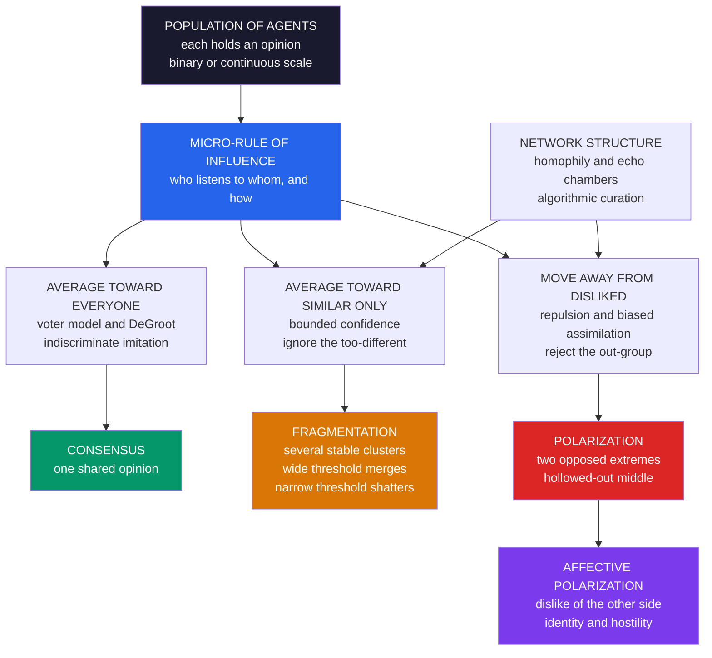

# 🧲 Opinion Dynamics and Polarization

> [!abstract] TL;DR
> **Opinion dynamics** is the computational study of how **opinions, beliefs, and attitudes form, spread, and change** through **social influence** in a population — modeling agents who update their views from their social contacts and asking what **macro-outcome** emerges: **consensus** (everyone converges), **fragmentation** (several stable opinion clusters), or **polarization** (divergence into opposed extremes). It is a core topic of computational social science / **social physics**, motivated by a genuine puzzle: naive averaging influence *should* diffuse opinions into agreement — like a drop of ink dispersing until a glass of water is uniformly gray — yet real societies show **persistent disagreement, factions, and polarization**. The resolution lies in the **micro-rules of who-influences-whom**. The classic toolkit runs from the **voter model** and **DeGroot averaging** (which produce consensus), to **bounded-confidence models** (Deffuant–Weisbuch and Hegselmann–Krause), where agents are swayed **only by others whose opinion is within a confidence threshold** — a simple, realistic tweak that **breaks consensus** and fractures the population into clusters when open-mindedness is limited — to models with **negative influence / repulsion, biased assimilation, homophily, and echo chambers** that drive opinions to **opposed poles** (polarization, including the corrosive **affective polarization** of partisan animosity). Because outcomes depend sensitively on these micro-rules and on **network structure**, opinion-dynamics models illuminate one of the defining challenges of the age — political polarization, misinformation, and a fracturing public sphere — while vigorous debates over whether social media truly *drives* polarization underscore the need to ground elegant models in messy empirical data.

---

## Intuition

**Analogy:** Put a drop of ink in a glass of water and it spreads until the whole glass is a uniform, moderate gray — a natural "consensus." Diffusion mixes; differences average away; the system relaxes to one shared shade. So here is the puzzle: **why don't human opinions do the same?** If everyone drifted a little toward the people around them, all our views should blend into a placid middle. Instead, societies fracture into hostile camps that drift *further* apart, harden into factions, and sometimes split into two warring poles that despise each other.

The answer hides in the **rules of social influence**. Ink molecules bump into every neighbor indiscriminately — but people do not. **We don't listen to everyone equally.** We tune out those too different from us, amplify our own tribe, distrust the other side, and read ambiguous evidence to confirm what we already believe. Change those micro-rules of who-influences-whom — how open-minded we are, whether we can be *repelled* by an out-group, which voices our network lets us hear — and a simulated society will converge to consensus, splinter into fragments, or polarize into two poles. **Opinion dynamics is the physics of how societies make up — or lose — their collective mind.**

---

## How It Works

Opinion dynamics models a population of **agents**, each holding an **opinion** — a binary label (Democrat/Republican, adopt/reject) or, more richly, a **continuous** value on a scale (say, left-to-right from `0` to `1`, or `-1` to `+1`). Time advances in steps; at each step agents **update** their opinion using an **influence rule** applied to (some of) their social contacts. Nobody dictates the outcome. Whether the population reaches **consensus, fragmentation, or polarization** is an **emergent** property of the micro-rule and the interaction network — exactly the bottom-up logic of [[Agent_Based_Modeling]] and the sibling *Agent_Based_Models_of_Society*, and the same "macro-from-micro" surprise as [[Schelling_Segregation_and_Emergent_Patterns]].

### The classic models, from consensus to polarization

The field is best understood as a **progression of influence rules**, each adding realism and each producing a qualitatively different macro-outcome:

1. **Voter model** (statistical physics). Each agent copies the binary opinion of a **randomly chosen neighbor**. On a connected finite graph this drives the system to **consensus** through slow **coarsening** — growing domains of one opinion — analogous to spin systems relaxing. The lesson: **pure imitation yields agreement**, but the route and timescale depend on the network's dimension and structure.

2. **DeGroot / averaging models** (social learning). Each agent sets its next opinion to a **weighted average** of its contacts' current opinions. If the trust matrix is a connected, aperiodic stochastic matrix, opinions **converge to a common value** — the mathematics of **social learning** and the "wisdom of crowds." Again: **consensus**, this time on a continuous scale. Averaging is the ink-diffusion of the social world.

3. **Bounded-confidence models** (the crucial realistic tweak). Deffuant–Weisbuch (random pairwise meetings) and **Hegselmann–Krause** (simultaneous averaging over the like-minded) add **selective influence**: an agent is moved **only by others whose opinion lies within a confidence threshold** `ε`, ignoring anyone too different. This one change **breaks consensus**. The population **fragments** into distinct opinion **clusters** separated by "confidence gaps." A wide `ε` (open-mindedness) still gives consensus; a narrow `ε` (closed-mindedness) gives many isolated clusters — a **phase-transition-like** dependence on a single parameter.

4. **Negative-influence / repulsion / biased-assimilation models** (polarization). Real disagreement is not just *ignored* — it can be **actively rejected**. Add **repulsion** (move *away* from a disliked out-group: "I believe the opposite of them"), **biased assimilation** (interpret the same evidence to confirm your prior — the confirmation-bias engine of [[Confirmation_Bias_and_Motivated_Reasoning]]), or motivated, identity-protective reasoning, and opinions no longer settle in the middle. They diverge to **opposed extremes** — a **bimodal** split into two poles: **polarization**.

### Bounded confidence and fragmentation — why limited open-mindedness fractures a public

The single most important idea is **selective, homophilous influence**: people are moved only by those **not too different** from themselves. This is influence-side **homophily** (the theme of the sibling *Homophily_Selection_and_Influence*), and it is deadly to consensus. Because agents at the far edges of opinion space **never come within earshot** of each other, the population settles into several internally-agreeing clusters divided by gaps no one crosses. Sweeping the threshold `ε` reveals a clean regularity: the number of surviving clusters scales roughly like `1 / (2ε)`. **Open-mindedness widens the reach of influence and merges clusters; closed-mindedness narrows it and shatters the public** — a bifurcation in the spirit of [[Bifurcations_and_Tipping_Points]] and [[Criticality_and_Phase_Transitions]].

### Mechanisms of polarization — from fragmentation to opposed poles

Fragmentation gives you *several* clusters; **polarization** gives you *two opposed extremes* with a hollowed-out middle. What pushes opinions apart rather than merely apart-and-scattered?

- **Negative influence / repulsion** — moving *away* from out-groups you distrust, actively differentiating from "them."
- **Biased assimilation** — the *same* mixed evidence makes believers more sure they are right and skeptics more sure they are right, so a shared signal *increases* divergence.
- **Motivated reasoning and identity** — opinions become badges of group membership, defended like territory.
- **Homophily and echo chambers** — hearing only one side (below) amplifies and hardens each pole.
- **Social sorting** — when many issue-opinions line up with a single identity, cross-cutting ties that once moderated views disappear.

### Networks and echo chambers — the structural driver

Opinion dynamics never runs in a vacuum; it runs **on a network**. **Homophilous, clustered, or algorithmically-curated** networks — **echo chambers** and filter bubbles — trap agents among like-minded others, starving them of the cross-cutting contacts that pull opinions toward the center and **accelerating fragmentation and polarization** (this is [[Network_Dynamics_and_Contagion]] with opinions as the contagion, and the substance of the sibling *Online_Social_Networks_and_Platforms* and *Misinformation_Polarization_and_the_Online_Public_Sphere*). Worse, opinions and ties **co-evolve**: we choose ties to match our views (selection) and adjust views to match our ties (influence), a feedback loop that can spiral a mild lean into a sealed chamber. How much online **algorithms** actually drive this is **contested** — a debate returned to below.

### Affective vs issue polarization

A distinction that increasingly matters: **issue / ideological polarization** is opinions on *questions* diverging (positions on taxes, immigration, climate). **Affective polarization** is growing **dislike and distrust of the other side** — partisan animosity, out-group hostility (Iyengar and colleagues). One can rise without the other, and the **affective** form — feeling, not just belief — is arguably the more corrosive and the more clearly rising in many democracies. Modern models increasingly encode identity and affect, not just positions: **polarization is a feeling, not only a belief.**

### From micro-rule to macro-outcome, in one picture



---

## Key Concepts

### Secondary Level

**When does a group agree, and when does it split?** Imagine everyone in a class rates how much they like a new idea from 0 to 10. Now they chat and nudge their scores toward the people they talk to.

- If they listen to **everybody**, all the scores drift together — the class ends up **agreeing** (consensus), just like a drop of ink spreading until the water is one even color.
- If each person only listens to others **whose score is already close to theirs** — ignoring anyone too different — the class **splits into a few groups**, each agreeing inside but disagreeing with the others (**fragmentation**).
- If people actively push **away** from a group they dislike ("I want the opposite of *them*"), the scores race to the two ends — **1s versus 9s**, with nobody left in the middle (**polarization**).

**The one big idea:** whether a group agrees or fractures depends less on the *facts* and more on the **rules of who listens to whom**. Being **closed-minded** (only hearing people like you) and **spiteful** (pushing away from people you dislike) is exactly what breaks a group into warring camps.

### Undergraduate Level

#### The formal setup

A population of `N` agents holds opinions `x_1, ..., x_N`. In **continuous** models `x_i ∈ [0, 1]` or `[-1, 1]`; in **binary** models `x_i ∈ {0, 1}`. An **update rule** maps the current profile to the next one. Key models:

- **DeGroot:** `x_i(t+1) = Σ_j W_ij x_j(t)`, with `W` a row-stochastic trust matrix. Converges to consensus iff `W` is (essentially) a connected, aperiodic Markov chain; the consensus value is a `W`-weighted average of initial opinions.
- **Hegselmann–Krause (HK):** `x_i(t+1) = mean{ x_j(t) : |x_i(t) − x_j(t)| ≤ ε }`. Only the **ε-neighbors** in opinion space count. Empirically, consensus for large `ε`, and roughly `⌊1/(2ε)⌋` clusters for small `ε`.
- **Deffuant–Weisbuch:** pick a random pair; if `|x_i − x_j| ≤ ε`, each moves a fraction `μ` toward the other. Same qualitative bounded-confidence phenomenology, asynchronous.

#### The bounded-confidence phase transition

Bounded confidence turns a **parameter** (`ε`, open-mindedness) into a **structural outcome** (number of opinion clusters). As `ε` decreases past thresholds, the equilibrium jumps from **one** cluster (consensus) to **two**, then **three**, and so on — a staircase reminiscent of a phase transition, where a smooth change in a control knob produces qualitatively distinct regimes. This is the cleanest demonstration that **enduring disagreement is a property of the influence rule, not of stubborn individuals**.

#### Adding polarization

Bounded confidence alone produces **symmetric fragmentation** (clusters can sit anywhere). To get **polarization** — a **bimodal** distribution at the extremes — you add a mechanism that **pushes opinions apart**:

- **Repulsion / negative influence:** if `|x_i − x_j|` exceeds a repulsion threshold, `i` moves *away* from `j` (rather than ignoring it).
- **Biased assimilation:** the update *amplifies* agreement with prior-consistent contacts and *discounts* prior-inconsistent ones, so shared evidence widens the gap.

Both, especially on homophilous networks, hollow out the center and pile agents at `0` and `1` (or `−1` and `+1`).

#### Networks matter

The same rule on different graphs gives different outcomes. On a **well-mixed** or random graph, bounded confidence merges more easily; on a **clustered, homophilous** graph (echo chambers), clusters lock in and polarization intensifies. Because ties and opinions **co-evolve**, the network is not a fixed backdrop but part of the dynamics.

### Graduate Level

#### The consensus theorems and their fragility

DeGroot/French–Harary averaging rests on **Markov-chain convergence**: a connected, aperiodic stochastic `W` has a unique stationary distribution, and iterating `W` drives all coordinates to a common value — a linear-consensus theorem also central to distributed control and multi-agent systems. The deep point is how **fragile** this consensus is. Bounded confidence makes `W` **state-dependent** (`W(x(t))`), turning a linear system into a **nonlinear** one whose attractors are multiple clustered fixed points. Consensus is no longer guaranteed; it is one regime among several selected by `ε` and initial conditions. Rigorous results on HK (finite-time convergence, cluster counting, the "`2ε`" heuristic and its exceptions) remain an active area, and continuous-agent (density-based) formulations connect to nonlinear PDEs and interacting-particle systems.

#### Polarization requires a symmetry-breaking or anti-conformity term

Pure attractive influence — however selective — cannot *create* extremity beyond the initial support; it only contracts opinions inward. Genuine polarization to the boundary requires either (i) **repulsive / negative** coupling (anti-conformity, differentiation from an out-group), (ii) **biased assimilation** that makes the update *expansive* rather than contractive along the identity axis, or (iii) **reinforcement with structural homophily** that lets two sub-populations run away from each other. Distinguishing which mechanism operates in real data is hard: several very different micro-models can fit the same bimodal opinion histogram — a serious **identifiability** problem that motivates grounding models in dynamics and network structure, not just cross-sectional distributions (the concern of the vault's measurement and validity notes and *Culture_Dissemination_and_Social_Influence_Models*).

#### Issue vs affective polarization, formalized

Treat each agent as carrying both an **issue vector** `p_i` (positions) and an **affect** `a_ij` (warmth/animosity toward others or groups). **Issue polarization** is dispersion/bimodality of `p`; **affective polarization** is the growth of out-group `a_ij < 0`. Crucially, they can **decouple**: elite and media cues can raise affective animosity (Iyengar) while issue positions barely move, and **social sorting** — the alignment of many `p`-dimensions with a single identity — can convert cross-cutting, moderating ties into reinforcing ones. Models that couple opinion updating to identity/affect reproduce the empirically important pattern that **hostility can outrun disagreement**.

#### The empirical-validation frontier and the social-media debate

Elegant models must confront **messy data**. Polarization is measured from **surveys** (feeling thermometers, issue scales), **roll-call voting** (DW-NOMINATE), and **text / social-media traces** (embeddings, stance detection) — each with validity caveats (see the vault's *measurement* and *digital-traces* notes). The headline debate: **is polarization rising, and does social media drive it?** Evidence is genuinely mixed. Boxell, Gentzkow, and Shapiro find affective polarization rising *fastest among older, least-online* U.S. groups — awkward for a pure algorithm story. Bail's *Breaking the Social Media Prism* and field experiments show exposure to the other side can *backfire*, hardening views. Large platform experiments (e.g., the 2020 U.S. Facebook–Instagram studies) find algorithmic feeds shape *exposure* strongly but move *attitudes* modestly. The lesson is not that networks are irrelevant, but that the **gap between crisp models and real polarization** is exactly where the science now lives — a caution echoed in [[Democratic_Backsliding_and_Polarization]].

---

## Python Demo

```python
import numpy as np
import matplotlib
matplotlib.use("Agg")
import matplotlib.pyplot as plt

# =====================================================================
# OPINION DYNAMICS: from CONSENSUS to FRAGMENTATION to POLARIZATION
#   (numpy + matplotlib only, deterministic seed)
#
# PART A -- BOUNDED CONFIDENCE (Hegselmann-Krause):
#   Continuous opinions in [0,1]. Each step, an agent moves to the MEAN
#   of all agents within a CONFIDENCE THRESHOLD eps (it ignores the
#   too-different). We show:
#     * LARGE eps  (open-minded)   -> CONSENSUS      (one cluster)
#     * MEDIUM eps (in between)    -> FRAGMENTATION  (a few clusters)
#     * SMALL eps  (closed-minded) -> MANY clusters  (persistent disagreement)
#   ...and sweep eps to trace the consensus -> fragmentation TRANSITION.
#
# PART B -- POLARIZATION (attraction + REPULSION / negative influence):
#   Add a repulsion term: agents move TOWARD the similar but AWAY from
#   the too-different. Opinions split into TWO opposed poles (bimodal),
#   not the middle -- reproducing polarization.
# =====================================================================
rng = np.random.default_rng(42)

# ---------------------------------------------------------------------
# PART A: Hegselmann-Krause bounded-confidence model
# ---------------------------------------------------------------------
def hk_run(x0, eps, steps):
    """Synchronous HK: return trajectory array of shape (steps+1, N)."""
    x = x0.copy()
    traj = [x.copy()]
    for _ in range(steps):
        xnew = np.empty_like(x)
        for i in range(len(x)):
            neighbors = np.abs(x - x[i]) <= eps        # who is close enough
            xnew[i] = x[neighbors].mean()              # move to their mean
        x = xnew
        traj.append(x.copy())
    return np.array(traj)

def count_clusters(x, tol=0.01):
    """Count distinct opinion clusters in a converged profile."""
    xs = np.sort(x)
    return 1 + int(np.sum(np.diff(xs) > tol))

N = 200
STEPS = 25
x0 = np.linspace(0.0, 1.0, N)                          # opinions spread over [0,1]

eps_values = {"large  (open-minded)":  0.30,           # -> consensus
              "medium (selective)":    0.15,           # -> few clusters
              "small  (closed-minded)":0.07}           # -> many clusters
traj_A = {name: hk_run(x0, e, STEPS) for name, e in eps_values.items()}

# Sweep eps to trace the consensus -> fragmentation transition
eps_sweep = np.linspace(0.03, 0.40, 40)
clusters_sweep = []
for e in eps_sweep:
    xf = hk_run(x0, e, 60)[-1]
    clusters_sweep.append(count_clusters(xf))
clusters_sweep = np.array(clusters_sweep)

# ---------------------------------------------------------------------
# PART B: polarization via attraction + repulsion (negative influence)
#   Opinions in [-1, 1]. Toward similar (|dx| < d_attract), AWAY from
#   the too-different (|dx| > d_repel). Repulsion drives the two poles.
# ---------------------------------------------------------------------
def polarize_run(x0, d_attract=0.5, d_repel=1.0,
                 mu_a=0.20, mu_r=0.10, steps=60):
    x = x0.copy()
    traj = [x.copy()]
    for _ in range(steps):
        xnew = x.copy()
        for i in range(len(x)):
            dx = x - x[i]                              # signed gaps to others
            near = (np.abs(dx) < d_attract) & (dx != 0.0)
            far  = np.abs(dx) > d_repel
            pull = mu_a * dx[near].mean() if near.any() else 0.0   # toward similar
            push = mu_r * (-dx[far]).mean() if far.any() else 0.0  # away from far
            xnew[i] = np.clip(x[i] + pull + push, -1.0, 1.0)
        x = xnew
        traj.append(x.copy())
    return np.array(traj)

xB0 = rng.uniform(-1.0, 1.0, N)                        # start spread across scale
traj_B = polarize_run(xB0)

# ------------------------------- REPORT --------------------------------
print("=" * 66)
print("OPINION DYNAMICS: consensus -> fragmentation -> polarization")
print("=" * 66)
for name, e in eps_values.items():
    nc = count_clusters(traj_A[name][-1])
    print(f"HK  eps={e:<5} {name:<24} -> {nc} final cluster(s)")
print(f"polarization: final opinions at two poles, "
      f"mean|x| = {np.abs(traj_B[-1]).mean():.2f} (near 1 == extreme)")
frac_extreme = np.mean(np.abs(traj_B[-1]) > 0.8)
print(f"              {frac_extreme:.0%} of agents ended at an extreme pole")

# ------------------------------- FIGURE --------------------------------
fig, axes = plt.subplots(2, 3, figsize=(16, 9))
fig.suptitle("Opinion Dynamics: the micro-rule of influence decides "
             "consensus vs fragmentation vs polarization",
             fontsize=14, fontweight="bold")
t_axis = np.arange(STEPS + 1)

# Row 1: HK trajectories for three thresholds
for ax, (name, e) in zip(axes[0], eps_values.items()):
    traj = traj_A[name]
    for i in range(N):
        ax.plot(t_axis, traj[:, i], color="#2563eb", lw=0.4, alpha=0.25)
    nc = count_clusters(traj[-1])
    ax.set_title(f"eps = {e}  ({name.split('(')[1][:-1].strip()})\n"
                 f"{nc} cluster(s)", fontsize=10)
    ax.set_xlabel("time step"); ax.set_ylabel("opinion in [0,1]")
    ax.set_ylim(-0.02, 1.02); ax.grid(alpha=0.2)
axes[0, 0].set_title(axes[0, 0].get_title(), color="#059669", fontsize=10)
axes[0, 1].set_title(axes[0, 1].get_title(), color="#d97706", fontsize=10)
axes[0, 2].set_title(axes[0, 2].get_title(), color="#dc2626", fontsize=10)

# Row 2, panel (d): consensus -> fragmentation transition
axd = axes[1, 0]
axd.step(eps_sweep, clusters_sweep, where="mid", color="#7c3aed", lw=2)
axd.fill_between(eps_sweep, clusters_sweep, step="mid",
                 alpha=0.15, color="#7c3aed")
axd.axhline(1, color="#059669", ls="--", lw=1.2, label="consensus (1 cluster)")
axd.set_title("(d) Bounded-confidence transition\nopen-mindedness merges, "
              "closed-mindedness shatters", fontsize=10)
axd.set_xlabel("confidence threshold eps  (open-mindedness ->)")
axd.set_ylabel("number of final opinion clusters")
axd.legend(fontsize=8); axd.grid(alpha=0.2)

# Row 2, panel (e): polarization trajectories -> two poles
axe = axes[1, 1]
tB = np.arange(traj_B.shape[0])
for i in range(N):
    color = "#dc2626" if traj_B[-1, i] > 0 else "#2563eb"
    axe.plot(tB, traj_B[:, i], color=color, lw=0.4, alpha=0.25)
axe.axhline(0, color="black", lw=0.8, ls=":")
axe.set_title("(e) Add REPULSION -> POLARIZATION\nopinions diverge to two "
              "extremes", fontsize=10)
axe.set_xlabel("time step"); axe.set_ylabel("opinion in [-1,1]")
axe.set_ylim(-1.05, 1.05); axe.grid(alpha=0.2)

# Row 2, panel (f): final opinion distribution -> bimodal
axf = axes[1, 2]
axf.hist(xB0, bins=25, range=(-1, 1), color="#9ca3af", alpha=0.6,
         edgecolor="black", label="initial (spread out)")
axf.hist(traj_B[-1], bins=25, range=(-1, 1), color="#dc2626", alpha=0.75,
         edgecolor="black", label="final (bimodal poles)")
axf.set_title("(f) Polarized outcome is BIMODAL\nhollow middle, two poles",
              fontsize=10)
axf.set_xlabel("opinion in [-1,1]"); axf.set_ylabel("count of agents")
axf.legend(fontsize=8); axf.grid(alpha=0.2, axis="y")

plt.tight_layout(rect=[0, 0, 1, 0.94])
plt.savefig("opinion_dynamics_and_polarization.png", dpi=110,
            bbox_inches="tight")
plt.show()
```

**What the demo shows:**

- **Row 1 — the consensus-to-fragmentation transition, live.** The *same* bounded-confidence rule and the *same* initial opinions produce three completely different worlds depending only on the **confidence threshold** `ε`. A **large** `ε` (open-minded) collapses everyone to **one cluster** — **consensus**, the ink-in-water outcome. A **medium** `ε` yields a **handful of clusters** — **fragmentation**. A **small** `ε` (closed-minded) leaves **many isolated clusters** — **persistent disagreement**. Nothing about the agents' stubbornness changed; only *who they were willing to listen to*.
- **Panel (d) — the transition curve.** Sweeping `ε` shows the number of surviving clusters falling in **steps** as open-mindedness rises, reaching **1** (consensus) past a threshold — the phase-transition-like signature of bounded confidence, and a compact statement of *why limited open-mindedness fractures a public*.
- **Panels (e)–(f) — polarization.** Adding a **repulsion / negative-influence** term (move toward the similar, *away* from the too-different) changes the physics: opinions no longer settle in the middle but **race to the two extremes**. The trajectories (e) fan out to `+1` and `−1`; the final distribution (f) is **bimodal** with a **hollowed-out center** — the fingerprint of **polarization**, not mere fragmentation.

Run it and read the console: the cluster counts and the fraction of agents ending at an extreme pole make every claim above quantitative.

---

## Real-World Applications

> **Political polarization and democracy.** Opinion-dynamics models are a lens on the defining political trend of the era — the sorting of electorates into hostile camps, the decline of the persuadable middle, and rising **affective** animosity. They inform diagnoses of, and interventions against, the dynamics analyzed in [[Democratic_Backsliding_and_Polarization]] and [[Political_Psychology_and_Ideology]], and connect to how positions form in the first place ([[Public_Opinion_and_Political_Socialization]]).

> **Misinformation and belief spread.** Whether a false claim fizzles or captures a community depends on the same influence and network mechanics — bounded confidence, biased assimilation, and echo chambers — that govern opinion. Modeling belief contagion (the subject of the sibling *Misinformation_Polarization_and_the_Online_Public_Sphere*) guides fact-checking, friction, and platform design, and runs on the contagion machinery of [[Network_Dynamics_and_Contagion]].

> **Platform and algorithm design.** Recommender and feed algorithms are, in effect, **editors of who-influences-whom**. Opinion-dynamics models let designers ask whether a ranking change would widen or narrow exposure and stress-test **depolarizing interventions** (bridging feeds, diverse-exposure nudges) — the applied face of [[Media_Propaganda_and_Political_Communication]] and *Online_Social_Networks_and_Platforms*.

> **Deliberation and consensus design.** If closed-mindedness and homophilous sorting fracture a public, deliberative formats (citizens' assemblies, structured dialogue, mixed juries) can be engineered to **raise effective confidence thresholds** and force cross-cutting contact — using the models to reason about what discussion structures actually produce agreement.

> **Marketing, persuasion, and social movements.** Diffusion of tastes, brand opinion, and movement frames are opinion dynamics on social ties — the same seeding, threshold, and clustering logic that governs [[Diffusion_of_Innovations_and_Adoption_Dynamics]] and the mobilization studied in [[Collective_Behavior_and_Crowds]], where conformity ([[Social_Norms_and_Conformity]]) and herding ([[Herding_Bubbles_and_Crashes]]) shape which opinions cascade.

---

## Common Pitfalls

- **Assuming influence implies consensus.** The intuitive "if everyone averages toward neighbors, we all agree" is *true only for indiscriminate averaging*. The moment influence is **selective** (bounded confidence) or **signed** (repulsion), consensus is no longer the default — it is one regime among consensus, fragmentation, and polarization. Reasoning from the ink-diffusion picture alone gives the wrong answer.
- **Confusing fragmentation with polarization.** Several stable clusters (fragmentation) is *not* the same as two opposed extremes with a hollow middle (polarization). They arise from different mechanisms — selective attraction vs repulsion / biased assimilation — and demand different remedies. Reporting a multimodal opinion distribution as "polarization" muddies the science.
- **Over-reading a bimodal snapshot.** Many very different micro-models can produce the *same* bimodal histogram. A cross-sectional distribution **cannot identify the mechanism**; you need **dynamics** (trajectories over time) and **network structure** to distinguish repulsion from biased assimilation from mere sorting. Fitting one model to a snapshot and declaring the mechanism found is an identifiability error.
- **Blaming the algorithm without evidence.** "Social media caused polarization" is a strong causal claim that the data only partly support — affective polarization has risen fastest among the *least* online in some studies, cross-exposure can *backfire*, and platform experiments move exposure far more than attitudes. Treat the social-media-drives-polarization story as a **hypothesis under active test**, not a settled premise.
- **Ignoring the network — or freezing it.** Running an opinion model on a well-mixed population misses the echo-chamber effects that dominate reality; but treating the network as a *fixed* backdrop misses that **ties and opinions co-evolve** (selection *and* influence). Both simplifications can flip the qualitative outcome.
- **Treating opinions as beliefs only, never affect.** Focusing solely on issue positions misses **affective polarization** — the rise of out-group hostility that can grow even when issue positions barely move, and that is arguably the more corrosive form. A model of positions with no identity or animosity term cannot speak to the phenomenon people most worry about.

---

## Related Concepts

**This section and vault (Computational Social Science):**

- [[Computational_Social_Science_Overview]] — the parent field; opinion dynamics is a flagship agent-based-simulation topic within it.
- [[Social_Network_Analysis_Foundations]] — the structural half of the story; opinion dynamics runs *on* the networks SNA measures, and echo chambers are its community structure.
- [[Measurement_and_Validity_in_Digital_Data]] — the caveats behind measuring opinion and polarization from surveys, voting, and text traces.

*Forthcoming siblings in this Agent-Based Social Simulation section (planned, referenced in prose above):* **Agent-Based Models of Society** (the umbrella method), **Segregation and Emergent Social Order** (Schelling in the social-science key), **Culture Dissemination and Social Influence Models** (Axelrod culture model and kin), **Homophily, Selection, and Influence** (why like ties to like, and the selection-vs-influence confound), **Online Social Networks and Platforms**, and **Misinformation, Polarization, and the Online Public Sphere**.

**Behavioral and cognitive mechanisms:**

- [[Confirmation_Bias_and_Motivated_Reasoning]] — the cognitive engine of **biased assimilation** that turns shared evidence into divergence.
- [[Social_Norms_and_Conformity]] — the conformity pressure behind imitation and consensus in influence models.
- [[Herding_Bubbles_and_Crashes]] — opinion cascades in markets, the financial cousin of consensus/polarization dynamics.

**Political and social substance:**

- [[Democratic_Backsliding_and_Polarization]] — the political stakes: what mass and elite polarization do to democracy.
- [[Public_Opinion_and_Political_Socialization]] — how the opinions that these models update are formed and transmitted.
- [[Political_Psychology_and_Ideology]] — identity, affect, and the psychology feeding affective polarization.
- [[Media_Propaganda_and_Political_Communication]] — the media and messaging environment shaping who-influences-whom.
- [[Collective_Behavior_and_Crowds]] — emergent, contagion-driven collective opinion and mobilization.

**Complexity, networks, and dynamics:**

- [[Agent_Based_Modeling]] — the bottom-up simulation method opinion dynamics is built on.
- [[Schelling_Segregation_and_Emergent_Patterns]] — the twin "macro-from-micro" model where mild preferences yield stark structure.
- [[Network_Dynamics_and_Contagion]] — opinions as a contagion spreading over network structure.
- [[Bounded_Rationality_and_Heterogeneous_Agents]] — the boundedly-rational, heterogeneous agents whose limited attention *is* bounded confidence.
- [[Criticality_and_Phase_Transitions]] — the phase-transition lens on the consensus-to-fragmentation threshold.
- [[Bifurcations_and_Tipping_Points]] — the bifurcation view of how a small change in openness flips the macro-outcome.

---

## Review Questions

### Secondary

1. A drop of ink in water spreads until the whole glass is one even gray. Explain, in your own words, why human opinions often do **not** end up like that — give two "rules of listening" that would keep a group split instead.
2. What is the difference between a group that **fragments** into several opinion groups and a group that **polarizes** into two opposite extremes? Give an everyday example of each.
3. If you wanted a classroom debate to end closer to **agreement**, would you want people to be more **open-minded** or more **closed-minded** about whom they listen to? Explain using the idea of a "confidence threshold."

### Undergraduate

1. Write down the Hegselmann–Krause update rule and explain precisely how the **confidence threshold** `ε` controls whether the population reaches consensus or fragments. Roughly how does the number of final clusters scale with `ε`, and why is this described as "phase-transition-like"?
2. Pure attractive influence (even selective) can only *contract* opinions inward. Explain why, and describe **two** distinct mechanisms you would add to a model to produce genuine **polarization** to the extremes (a bimodal distribution). What does each mechanism assume about how people process out-group opinions?
3. Distinguish **issue** polarization from **affective** polarization. Give an empirical reason the two can move independently, and explain why a model containing only issue positions cannot capture the affective form.

### Graduate

1. You observe a **bimodal** opinion distribution in survey data and want to infer the generating mechanism. Explain the **identifiability problem**: name at least two different micro-models that could produce the same snapshot, and describe what additional data (dynamics over time, network structure) you would need to distinguish repulsion from biased assimilation from social sorting.
2. Critically assess the claim "social media algorithms are the main cause of rising political polarization." Marshal specific evidence on **both** sides (e.g., Boxell–Gentzkow–Shapiro age patterns, Bail's backfire findings, large platform experiments) and state what a **defensible** causal conclusion would require. How does this illustrate the gap between elegant opinion-dynamics models and empirical reality?
3. DeGroot averaging on a connected, aperiodic trust matrix guarantees consensus. Bounded confidence makes the effective trust matrix **state-dependent**, `W(x(t))`. Explain how this transforms a linear consensus system into a nonlinear one with multiple clustered attractors, and discuss what this implies for whether "persistent disagreement" is a property of *individuals* or of the *interaction rule*.

---

## Sources

- [Hegselmann, R. & Krause, U. (2002). "Opinion Dynamics and Bounded Confidence: Models, Analysis and Simulation." *Journal of Artificial Societies and Social Simulation* 5(3)](https://www.jasss.org/5/3/2.html)
- [Deffuant, G., Neau, D., Amblard, F. & Weisbuch, G. (2000). "Mixing Beliefs among Interacting Agents." *Advances in Complex Systems* 3, 87–98](https://doi.org/10.1142/S0219525900000078)
- [Castellano, C., Fortunato, S. & Loreto, V. (2009). "Statistical Physics of Social Dynamics." *Reviews of Modern Physics* 81, 591–646](https://doi.org/10.1103/RevModPhys.81.591)
- [Iyengar, S., Lelkes, Y., Levendusky, M., Malhotra, N. & Westwood, S. J. (2019). "The Origins and Consequences of Affective Polarization in the United States." *Annual Review of Political Science* 22, 129–146](https://doi.org/10.1146/annurev-polisci-051117-073034)
- [Boxell, L., Gentzkow, M. & Shapiro, J. M. (2017). "Greater Internet Use Is Not Associated with Faster Growth in Political Polarization among US Demographic Groups." *PNAS* 114(40), 10612–10617](https://doi.org/10.1073/pnas.1706588114)
- [Bail, C. (2021). *Breaking the Social Media Prism: How to Make Our Platforms Less Polarizing*. Princeton University Press](https://press.princeton.edu/books/hardcover/9780691203423/breaking-the-social-media-prism)

---

#computational-social-science #opinion-dynamics #polarization #bounded-confidence #social-influence
