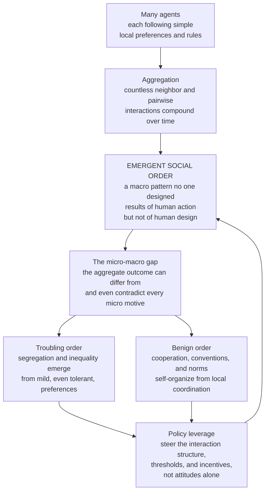

# 🏙️ Segregation and Emergent Social Order

> [!abstract] TL;DR
> Much of **social order** — the patterns, structures, institutions, conventions, and even the cities and languages we inhabit — **emerges** from decentralized **local interactions** *without* central design or any individual intending the outcome: "**spontaneous order**" (Hayek), "**the results of human action but not of human design**" (Ferguson). Agent-based social simulation reveals *how*. **Schelling's segregation model** is the archetype: **mild, even tolerant** individual preferences produce **stark macro-segregation that no one intended** — vividly demonstrating the **micro–macro gap** (aggregate outcomes can differ from, and even *contradict*, individual motives, so you cannot read social patterns off attitudes) and **tipping-point** dynamics. The very same emergence gives rise to **cooperation** (via spatial clustering, reciprocity, and norms) and to shared **conventions and norms** (self-organizing through local coordination, **path-dependently**). But emergence is **value-neutral** — it produces troubling order (segregation, inequality) as readily as benign order (cooperation, useful conventions). So the central question of computational sociology is **which order emerges under which conditions**, and how to **steer it through the interaction structure and incentives** rather than attitudes alone — the crux of effective policy.

---

## Intuition

**Analogy:** A flock of starlings wheels across the evening sky in breathtaking, shifting patterns — and there is **no lead bird**, no choreographer, no plan. Each bird follows a few local rules about its nearest neighbors, and the murmuration *emerges*. Now widen the lens. A city sorts itself into distinct neighborhoods with **no planner** drawing the lines. A language settles on grammar rules **no committee ever wrote**. Strangers on a highway, each just avoiding collisions, coordinate into **smooth flowing lanes** nobody organized. Over and over, **order emerges in human society without anyone designing it** — sometimes benign (cooperation, greetings, money, useful conventions), sometimes troubling (segregation, inequality, polarization).

Here is the astonishing, slightly unsettling lesson of social simulation: this order is often **not what any individual intended**. It is an **emergent property of countless local interactions**, and it can be *dramatically different from* — even *contrary to* — the preferences of the very people who produce it. A town can look brutally segregated without a single resident who *wants* segregation. A community can sustain cooperation without a single altruist. Understanding **how social order self-organizes — for good or ill, and how to nudge which kind we get** — is one of social science's deepest questions, and the one that agent-based models were built to answer.

---

## How It Works

The unifying idea is **generative**: to *explain* a macro social pattern is to *grow* it from the bottom up — to exhibit a population of simple, interacting agents whose local rules **produce** the pattern. When you do this, you discover something profound and repeatable: **decentralized local interactions generate global order**, and that order is an emergent property no single agent holds, wants, or controls.

### 1. The archetype — Schelling segregation

Thomas **Schelling's 1971** *Dynamic Models of Segregation* (a strand of the work that won the 2005 Nobel) is the paradigmatic case. Put two types of agents on a grid with some empty cells. Each agent has a **tolerance threshold** `T`: it is content as long as at least a fraction `T` of its occupied neighbors share its type, and it **relocates** to a vacancy if not. Crucially, set `T` *low* — say `0.30`, meaning an agent is perfectly happy being a **70 percent minority**. These are *mild, tolerant* preferences; nobody is a bigot in the model.

Run it and watch in dismay: the grid self-sorts into **stark, near-total segregation** that no one intended. The mechanism is a quiet **ratchet** — each move that soothes one agent shifts its old and new neighbors' fractions, pushing others across their thresholds and triggering more moves. **Integration is unstable; clustering is self-reinforcing.** (The Complexity_Economics vault develops this model in depth in [[Schelling_Segregation_and_Emergent_Patterns]]; this note places it inside the *broader family* of emergent social order.)

### 2. The micro–macro gap — the key insight

Schelling's real subject is the title of his book: ***Micromotives and Macrobehavior***. The **aggregate outcome can be dramatically different from, and even contrary to, individual intentions.** You **cannot read the macro pattern off the micro motives**, and you cannot read the motives off the pattern: *segregation does not imply everyone is racist; cooperation does not imply everyone is altruistic.* This is **emergence** in social systems, and it is a standing warning against inferring intentions from outcomes and outcomes from intentions. (The general principle is treated in [[Emergence_of_Macro_from_Micro]] and [[Emergence_and_Self_Organization]].)

### 3. Tipping and neighborhood dynamics

Schelling also pioneered **tipping models**: once a neighborhood's composition crosses a critical **threshold**, a self-reinforcing cascade — the classic "white flight" or rapid resorting — **tips it fully** from one type to the other. Below the threshold the mix is stable; above it, departures beget departures. These are **tipping points in social systems**, linking segregation to the broader dynamics of neighborhood change, residential sorting, and cascade phenomena.

### 4. The other face — emergent cooperation

The *same* emergence produces **benign** order. How does **cooperation** self-organize among self-interested agents facing a social dilemma, *without* central enforcement? Simulation gives several answers: **spatial structure** — cooperators who cluster on a grid protect one another and survive invasion by defectors (**Nowak–May**); **repeated interaction and reciprocity** — tit-for-tat wins **Axelrod's** tournaments; and **reputation and norms**. Cooperation is thus **emergent, not assumed** — social order arising from repeated local interaction. (See [[The_Prisoners_Dilemma_and_Cooperation]] and [[Spatial_and_Network_Games]].)

### 5. The self-organization of conventions and norms

Social **rules** emerge the same way. **Conventions** — which side of the road to drive on, greetings, money, standards, the words of a language — and **norms** arise from repeated **coordination** without any central design (Lewis; Young; **Centola–Baronchelli's** *naming game*, in which a population spontaneously converges on a **shared** convention through local pairwise interactions). Typically **multiple** conventions are possible, and **which** one wins is **arbitrary and path-dependent** — a matter of history, not optimality (see [[Increasing_Returns_and_Path_Dependence]]). A shared social reality **self-organizes** from the bottom up. (See [[The_Evolution_of_Conventions_and_Norms]] and [[Institutions_Cooperation_and_Norms]].)

### 6. Spontaneous order — the general principle

Zoom all the way out and you reach **Hayek's spontaneous order**: the **market and price mechanism** coordinating vastly dispersed knowledge, the self-organization of **cities**, the **division of labor**, the structure of society itself — all "**order for free**," the invisible hand *as emergence*. The deep claim is that **complex social order needn't be — and usually isn't — centrally designed** (the economies-as-complex-adaptive-systems view; see [[Economies_as_Complex_Adaptive_Systems]] and [[Complex_Adaptive_Systems]]).

### 7. The normative twist — when is emergent order *good*?

Here is the crucial caveat: **emergent order is not always desirable.** Segregation and inequality emerge just as "naturally" as cooperation and useful conventions. **Emergence is value-neutral**: mild preferences yield *bad* segregation; self-interest yields *sometimes* good cooperation and *sometimes* a tragic commons. You **cannot assume emergent = optimal**. The scientific and policy task is to understand **which** order emerges under **which** conditions — and how to **steer** it.

### 8. Policy implications

Because social order is *emergent*, interventions must target the **emergent dynamics**, not just individual attitudes. Changing preferences may **not** fix segregation, because the dynamics *amplify* even mild preferences. You often must change the **interaction structure**, the **thresholds**, or the **incentives**. Small **leverage** interventions can *tip* a system — positively (social tipping for climate or health behavior) or negatively. The mature stance is to **design for good emergent order** (mechanism and institution design) rather than to *command* outcomes — the challenge and the opportunity of governing emergent social systems (see [[Complexity_Economics_and_Public_Policy]]).

### The one-picture logic



---

## Key Concepts

### Secondary Level

- **Order without a designer.** Flocks, traffic lanes, city neighborhoods, and even languages fall into orderly patterns with **nobody in charge**. The order *emerges* from lots of people or animals following simple local rules.
- **The surprise of segregation.** In Schelling's game, people who are perfectly happy in a mixed neighborhood — happy to be a *minority* — still end up sorted into separate blocks. **Nobody wanted it; it happened anyway.**
- **You cannot read minds from maps.** A segregated town does **not** prove its residents are prejudiced, and a cooperative town does not prove everyone is a saint. The big picture can be very different from what individuals feel.
- **Good order and bad order.** The same "it just emerges" process gives us helpful things (cooperation, driving on one side of the road) *and* harmful things (segregation, unfairness). Emergence does not care which.

### Undergraduate Level

- **Emergent (spontaneous) order.** Global structure arising from decentralized local interaction with **no central plan** — Hayek's *spontaneous order*, Ferguson's "results of human action but not of human design." The market, cities, money, and language are canonical examples.
- **The tolerance threshold `T`.** Schelling's single control knob: the minimum same-type neighbor fraction an agent accepts. **Low `T` = high tolerance**, yet still yields **high macro-segregation** — the model's whole shock.
- **The micro–macro gap.** Aggregate outcomes can be **qualitatively different from, and contrary to,** the motives producing them. Formalized by *Micromotives and Macrobehavior*; a warning against inferring intent from outcome or outcome from intent.
- **Tipping points.** Composition stable up to a critical fraction, then a self-reinforcing **cascade** flips the neighborhood. The origin of "tipping point" language in social science; connects to cascades and thresholds ([[Cascades_and_Systemic_Risk]], [[Bifurcations_and_Tipping_Points]]).
- **Emergent cooperation.** Cooperation among self-interested agents self-organizes via **spatial clustering** (Nowak–May), **reciprocity** (Axelrod's tit-for-tat), and **reputation/norms** — cooperation is *grown*, not assumed.
- **Emergent conventions and norms.** Shared rules (side of the road, greetings, money, language) self-organize through repeated **coordination**; the *naming game* shows a population converging on **one** arbitrary, **path-dependent** convention.

### Graduate Level

- **Generative explanation.** Epstein's standard — "*if you didn't grow it, you didn't explain it*." A macro regularity is *explained* by exhibiting a population of agents whose local interactions **generate** it. Segregation, cooperation, and conventions are all grown to be explained; this whole vault section (see the forthcoming *Agent_Based_Models_of_Society*) is built on it.
- **Sufficiency, not necessity.** Schelling proves a **mechanism is sufficient** to produce segregation; it does **not** claim preferences are the *sole* or *actual* cause. Real segregation also involves discrimination, income, institutions, and policy. The value is conceptual — bounding what a mild mechanism *alone* can do.
- **Value-neutrality of emergence.** The identical bottom-up logic produces welfare-improving order (Pareto-relevant conventions, cooperation) and welfare-reducing order (segregation, inequality, coordination on an *inferior* standard). There is **no theorem that emergent = efficient**; the invisible-hand intuition is a *special case*, not a law.
- **Equilibrium selection and path dependence.** Coordination games have **multiple equilibria**; which convention the population locks into is selected by **history, initial conditions, and stochastic early moves**, not by optimality — the same increasing-returns logic that drives standards races and lock-in ([[Increasing_Returns_and_Path_Dependence]]).
- **Interaction structure as the lever.** *Who interacts with whom* — the network or spatial topology — is often more decisive than agents' attitudes. Changing the **structure** (mixing, thresholds, incentive alignment) can shift the emergent outcome even when preferences are fixed; conversely, changing preferences may not, because the dynamics amplify them ([[Economic_Networks_and_Interaction_Structure]]).
- **Steering emergent systems.** Because outcomes are emergent, effective policy is **mechanism/institution design** — engineering the rules of interaction so that *good* order self-organizes — rather than command-and-control of outcomes. Small, well-placed **leverage** interventions can tip the system; this is the theory behind *social tipping* for climate and health (Centola).

---

## Python Demo

Two demonstrations, both with only `numpy` and `matplotlib`. **Part (a) — Schelling segregation**: two agent types on a grid, each moving to a vacancy if fewer than a fraction `T` of its neighbors are same-type. Even a **tolerant** `T = 0.30` (happy as a 70 percent minority) drives the grid to **stark segregation no one intended**; we plot the grid before and after and the **segregation-vs-tolerance** curve. **Part (b) — an emergent convention (the naming game)**: agents interact in local pairs, and a **shared convention self-organizes from local interactions with no central coordinator** — the population starts with many competing "words," then spontaneously **collapses onto one arbitrary, path-dependent convention**; we plot the number of competing conventions and the coordination-success rate over time, and show that **different runs lock in different winners**.

```python
import numpy as np
import matplotlib
matplotlib.use("Agg")
import matplotlib.pyplot as plt
from matplotlib.colors import ListedColormap

rng = np.random.default_rng(11)

# =====================================================================
# PART (a): SCHELLING SEGREGATION
#   Two types (1, 2) on a grid; 0 = empty. An agent is "happy" if the
#   fraction of same-type OCCUPIED neighbors >= threshold T; unhappy
#   agents relocate to a random empty cell. Mild preferences -> stark
#   segregation NO ONE INTENDED (the micro-macro gap).
# =====================================================================
N, EMPTY_FRAC, STEPS = 50, 0.10, 80

def make_grid(n, empty_frac):
    r = rng.random((n, n))
    g = np.where(r < empty_frac, 0,
        np.where(r < empty_frac + (1 - empty_frac) / 2, 1, 2))
    return g.astype(int)

def same_fraction(grid, i, j):
    t = grid[i, j]
    i0, i1 = max(i - 1, 0), min(i + 2, grid.shape[0])
    j0, j1 = max(j - 1, 0), min(j + 2, grid.shape[1])
    block = grid[i0:i1, j0:j1]
    occ = np.count_nonzero(block) - 1          # exclude self
    if occ == 0:
        return 1.0                             # isolated -> content
    return (np.count_nonzero(block == t) - 1) / occ

def seg_index(grid):
    return float(np.mean([same_fraction(grid, i, j)
                          for i, j in zip(*np.nonzero(grid))]))

def run_schelling(grid, threshold, steps=STEPS):
    grid = grid.copy()
    for _ in range(steps):
        empties = list(zip(*np.where(grid == 0)))
        agents = list(zip(*np.nonzero(grid)))
        rng.shuffle(agents)
        moved = 0
        for (i, j) in agents:
            if same_fraction(grid, i, j) < threshold and empties:
                k = rng.integers(len(empties))
                ei, ej = empties[k]
                grid[ei, ej] = grid[i, j]      # move to a vacancy
                grid[i, j] = 0                 # old cell empties
                empties[k] = (i, j)
                moved += 1
        if moved == 0:                         # equilibrium reached
            break
    return grid

T = 0.30
base = make_grid(N, EMPTY_FRAC)
before, after = base.copy(), run_schelling(base, T)
seg0, seg1 = seg_index(before), seg_index(after)

thresholds = np.linspace(0.0, 0.70, 15)
final_seg = np.array([seg_index(run_schelling(make_grid(N, EMPTY_FRAC), t))
                      for t in thresholds])

# =====================================================================
# PART (b): AN EMERGENT CONVENTION -- the NAMING GAME
#   M agents; each holds an inventory of "names". Repeatedly pick a
#   random speaker + hearer. Speaker (inventing if empty) utters a
#   random name; if the hearer knows it -> SUCCESS: both collapse to
#   just that name; else -> the hearer LEARNS it. With NO central
#   coordinator the whole population self-organizes onto ONE shared,
#   ARBITRARY, path-dependent convention.
# =====================================================================
def naming_game(M, rounds, rng, record_every):
    inv = [set() for _ in range(M)]
    nxt, succ = 0, 0
    distinct, success_rate = [], []
    for step in range(rounds):
        s = int(rng.integers(M))
        h = int(rng.integers(M))
        while h == s:
            h = int(rng.integers(M))
        if not inv[s]:
            inv[s].add(nxt); nxt += 1          # invent a fresh word
        word = int(rng.choice(list(inv[s])))
        if word in inv[h]:                      # coordination SUCCESS
            inv[s] = {word}; inv[h] = {word}; succ += 1
        else:                                   # FAILURE -> learn it
            inv[h].add(word)
        if (step + 1) % record_every == 0:
            distinct.append(len(set().union(*inv)))
            success_rate.append(succ / record_every)
            succ = 0
    settled = [next(iter(w)) for w in inv if len(w) == 1]
    winner = max(set(settled), key=settled.count) if settled else None
    frac = np.mean([len(w) == 1 and (winner in w) for w in inv])
    return np.array(distinct), np.array(success_rate), winner, frac

M, ROUNDS, EVERY = 100, 12000, 150
distinct, succ_rate, winner, consensus = naming_game(M, ROUNDS, rng, EVERY)
gens = (np.arange(len(distinct)) + 1) * EVERY

# path dependence: independent runs lock onto DIFFERENT arbitrary winners
winners = [naming_game(M, ROUNDS, np.random.default_rng(s), EVERY)[2]
           for s in range(5)]

# ============================= FIGURE ================================
fig, ax = plt.subplots(2, 2, figsize=(13.5, 10))
cmap = ListedColormap(["white", "#d62728", "#1f77b4"])

ax[0, 0].imshow(before, cmap=cmap, vmin=0, vmax=2)
ax[0, 0].set_title(f"(a) Schelling BEFORE  (integrated)\nseg index = {seg0:.2f}")
ax[0, 1].imshow(after, cmap=cmap, vmin=0, vmax=2)
ax[0, 1].set_title(f"(a) Schelling AFTER, T={T:.2f}  (segregated)\n"
                   f"seg index = {seg1:.2f}  -- no one intended this")
for a in (ax[0, 0], ax[0, 1]):
    a.set_xticks([]); a.set_yticks([])

axc = ax[1, 0]
axc.plot(thresholds, final_seg, "o-", color="purple", label="macro outcome")
axc.plot([0, 0.7], [0, 0.7], "--", color="gray", label="if macro = micro")
axc.axhline(0.5, ls=":", c="black", label="random baseline ~0.5")
axc.axvline(0.30, ls=":", c="green")
axc.set_xlabel("tolerance threshold T  (individual preference)")
axc.set_ylabel("final segregation index  (macro outcome)")
axc.set_title("(a) Mild preference -> stark segregation")
axc.legend(fontsize=8)

axd = ax[1, 1]
axd.plot(gens, distinct, "-o", color="#c026d3", ms=3,
         label="competing conventions (distinct words)")
axd.set_xlabel("interactions"); axd.set_ylabel("number of distinct conventions")
axd.set_title("(b) Naming game: ONE shared convention self-organizes")
axd.axhline(1, ls=":", c="black")
axt = axd.twinx()
axt.plot(gens, succ_rate, "-", color="#059669", lw=2,
         label="coordination success rate")
axt.set_ylabel("coordination success rate"); axt.set_ylim(0, 1.05)
l1, la1 = axd.get_legend_handles_labels()
l2, la2 = axt.get_legend_handles_labels()
axd.legend(l1 + l2, la1 + la2, fontsize=8, loc="center right")

plt.tight_layout()
plt.savefig("segregation_and_emergent_social_order.png", dpi=110,
            bbox_inches="tight")
plt.show()

print("=" * 62)
print("PART (a) SCHELLING SEGREGATION")
print(f"  tolerant threshold T = {T:.2f} (agents happy as 70% minority)")
print(f"  segregation index: {seg0:.2f} (random) -> {seg1:.2f} (final)")
print(f"  at T=0.30 the macro outcome sits FAR above the micro line")
print("PART (b) EMERGENT CONVENTION (naming game)")
print(f"  distinct conventions: {distinct[0]} -> peak {distinct.max()} "
      f"-> {distinct[-1]} (consensus)")
print(f"  final coordination success rate: {succ_rate[-1]:.2f}")
print(f"  {consensus:.0%} of the population converged on word #{winner}")
print(f"  path dependence -- 5 runs locked onto DIFFERENT winners: {winners}")
```

Running it, **Part (a)** shows the grid transform from a salt-and-pepper mix (segregation index near `0.5`) into two sharply separated blocks (index above `0.75`) even though every agent is content being a 70 percent minority; the sweep curve rises **far above** the dashed "macro = micro" diagonal — the micro–macro gap made visual. **Part (b)** shows the number of competing conventions rise as agents invent words, then **collapse to 1** as a **single shared convention self-organizes**, while the coordination-success rate climbs toward 1 — all with **no central coordinator**. And the five independent runs lock onto **different** winning words: the convention that wins is **arbitrary and path-dependent**, exactly as with real standards, currencies, and languages.

---

## Real-World Applications

> **Residential segregation and integration policy.** Schelling's model reframes both the *cause* of persistent segregation (emergent dynamics, not only prejudice) and the *cure* (policy must overcome the dynamics, since mild preferences plus mobility regenerate separation even as reported prejudice falls). It anchors debates on why cities stay segregated and why attitude-change campaigns alone can fail — see [[Urban_Sociology_and_the_City]] and [[Race_Ethnicity_and_Racism]].

> **Designing institutions for cooperation.** Because cooperation is *emergent* rather than guaranteed, governing the commons, structuring platforms, and building reputation systems are exercises in engineering the interaction structure so that cooperation self-organizes and survives — the applied side of [[The_Prisoners_Dilemma_and_Cooperation]], [[Institutions_Cooperation_and_Norms]], and [[Public_Goods]].

> **Shifting norms, conventions, and standards.** The naming-game logic explains how shared conventions form — and how to *change* them. Centola's work on **social tipping** shows that once a committed minority crosses a critical size, a new convention can cascade to the whole population, a lever for climate, public-health, and workplace-norm interventions ([[Social_Norms_and_Conformity]], [[The_Evolution_of_Conventions_and_Norms]]).

> **Polarization and social sorting.** The same emergent-sorting mechanism, run on *opinions* and *ties* rather than *locations*, produces echo chambers and affective polarization — foreshadowing the sibling notes *Opinion_Dynamics_and_Polarization* and *Homophily_Selection_and_Influence*, where mild homophily yields starkly divided communities.

> **Urban dynamics, gentrification, and culture.** Tipping analysis models how districts flip once composition crosses a threshold (white flight in one direction, gentrification cascades in the other), while cultural-transmission models explain how tastes, dialects, and practices spread and self-organize — connecting to *Culture_Dissemination_and_Social_Influence_Models* and to [[Cultural_Evolution_and_Social_Learning]].

The broader research program is mapped by the forthcoming siblings *Agent_Based_Models_of_Society* (the method), *Opinion_Dynamics_and_Polarization*, *Culture_Dissemination_and_Social_Influence_Models*, *Simulating_Collective_Behavior_and_Social_Movements*, and *Homophily_Selection_and_Influence* — this note is the theme (emergent order) that unifies them.

---

## Common Pitfalls

- **Inferring intent from outcome.** Reading strong prejudice off a segregated map — or deep altruism off a cooperative community. Mild preferences suffice for segregation, and reciprocity suffices for cooperation, so the *outcome* is weak evidence about *motives*. This is the whole cautionary payload of the micro–macro gap.
- **Assuming emergent means optimal.** The invisible-hand intuition seduces people into treating whatever self-organizes as efficient or just. Emergence is **value-neutral**: it produces segregation and coordination on inferior standards just as readily as useful conventions. There is no theorem that emergent = good.
- **Fixing attitudes instead of structure.** Because the dynamics *amplify* mild preferences, changing minds may not change the pattern. Effective intervention often means changing the **interaction structure, thresholds, or incentives** — the leverage points — not just the attitudes.
- **Mistaking sufficiency for necessity.** A model showing a mechanism is *sufficient* to generate a pattern does not show it is the *actual* or *sole* cause. Schelling establishes conceptual sufficiency for segregation; real-world segregation also involves discrimination, income, and institutions.
- **Ignoring path dependence.** Treating the *particular* convention that emerged as if it were optimal or inevitable. Which convention wins is typically **arbitrary and historically contingent** — different runs, and different histories, lock in different rules.
- **Reading a transient as an equilibrium.** A partially sorted grid or a not-yet-converged naming game is still churning; conclusions should be drawn only after the dynamics stabilize, or the "result" is an artifact of stopping early.
- **Over-generalizing the parable.** These are conceptual proofs-of-concept, not calibrated forecasts. Using Schelling to predict a specific neighborhood's future composition confuses a mechanism demonstration with an empirical model.

---

## Related Concepts

**The segregation model and the micro–macro theme (Complexity Economics):**

- [[Schelling_Segregation_and_Emergent_Patterns]] — the Complexity_Economics deep dive on the segregation model itself; this note is its CSS/sociology companion on the *broader* theme of emergent order.
- [[Emergence_of_Macro_from_Micro]] — the general principle that aggregate patterns are grown from local rules and can contradict individual motives.
- [[Economies_as_Complex_Adaptive_Systems]] — the economy as a self-organizing CAS; the spontaneous-order view of markets and prices.
- [[Increasing_Returns_and_Path_Dependence]] — why the *particular* convention or standard that emerges is arbitrary, historically contingent, and locked in.
- [[Economic_Networks_and_Interaction_Structure]] — the interaction topology that often matters more than attitudes for which order emerges.
- [[Complexity_Economics_and_Public_Policy]] — steering emergent systems via structure and incentives rather than commanding outcomes.

**Emergence, self-organization, and tipping (Systems Thinking):**

- [[Emergence_and_Self_Organization]] — the core idea that global order arises from local interaction with no central controller.
- [[Complex_Adaptive_Systems]] — society as many adapting agents whose interactions produce collective order.
- [[Cellular_Automata]] — the grid-and-local-rule framework Schelling shares with the broader class of emergent-pattern models.
- [[Bifurcations_and_Tipping_Points]] — the critical-threshold, cascade dynamics behind neighborhood tipping and social tipping.
- [[Cascades_and_Systemic_Risk]] — the self-reinforcing cascade logic underlying both segregation ratchets and norm cascades.

**Cooperation, conventions, and norms (Evolutionary Game Theory):**

- [[The_Prisoners_Dilemma_and_Cooperation]] — the social dilemma whose cooperative resolution self-organizes rather than being assumed.
- [[Spatial_and_Network_Games]] — how spatial clustering (Nowak–May) lets cooperation survive; the game-theoretic analogue of Schelling's spatial sorting.
- [[The_Evolution_of_Conventions_and_Norms]] — the emergence of shared conventions and norms through repeated coordination.
- [[Cultural_Evolution_and_Social_Learning]] — how conventions, tastes, and practices spread and self-organize across a population.
- [[Cooperation_and_Evolutionary_Game_Theory]] — the systems-thinking treatment of how cooperation emerges among self-interested agents.

**The social substance and its institutions (Sociology, Behavioral Economics, Micro):**

- [[Urban_Sociology_and_the_City]] — residential segregation, neighborhood change, and tipping as core urban phenomena.
- [[Race_Ethnicity_and_Racism]] — the substantive domain where the "sufficiency, not necessity" caveat matters most.
- [[Collective_Behavior_and_Crowds]] — the sociological family of unintended macro patterns from local behavior.
- [[Culture_Norms_Values_and_Ideology]] — norms and shared meanings as emergent, self-organizing social facts.
- [[Social_Networks_and_Social_Ties]] — the relational structure through which local interaction produces macro order.
- [[Social_Norms_and_Conformity]] — the behavioral-economics account of norm formation, cascades, and tipping.
- [[Institutions_Cooperation_and_Norms]] — norms and institutions as emergent solutions to cooperation problems.
- [[Public_Goods]] — the commons/social-dilemma setting where emergent order can be tragic rather than benign.

**Parent overview:**

- [[Computational_Social_Science_Overview]] — the field-level map; this note develops its agent-based-simulation pillar.

**Forthcoming siblings in this section (planned, not yet written):** *Agent_Based_Models_of_Society*, *Opinion_Dynamics_and_Polarization*, *Culture_Dissemination_and_Social_Influence_Models*, *Simulating_Collective_Behavior_and_Social_Movements*, and *Homophily_Selection_and_Influence*.

---

## Review Questions

### Secondary

1. Give two examples of "order that emerges without anyone designing it" — one benign and one troubling — and explain what "no one designed it" means in each case.
2. In Schelling's model, agents are happy to be a large *minority* yet still end up segregated. In your own words, why does mild tolerance still produce a split neighborhood?
3. Why can't you conclude that a segregated town is full of prejudiced people, or that a cooperative town is full of altruists?

### Undergraduate

1. Define the **micro–macro gap** and explain, using both Schelling segregation *and* the emergence of a convention (the naming game), how the aggregate outcome can differ from — and be independent of — individual motives.
2. Emergent order is **value-neutral**. Contrast a case where emergence yields *good* order (cooperation or a useful convention) with one where it yields *bad* order (segregation or a tragic commons), and identify what differs between the two situations.
3. A city sees sharply segregated neighborhoods and launches an anti-bias education campaign. Using the model's dynamics, explain why the campaign might succeed at changing attitudes yet **fail** to integrate the city — and name one *structural* intervention that might work instead.

### Graduate

1. "Emergent does not imply optimal." Explain why the invisible-hand intuition is a *special case* rather than a general law, using equilibrium selection and path dependence in coordination games to show how a population can self-organize onto an **inferior** convention.
2. Distinguish **sufficiency** from **necessity** in generative models. What exactly does Schelling's model *establish* about the causes of real segregation, what does it *not* establish, and how should this shape — without over-determining — integration policy?
3. If social order is emergent, effective policy targets the **interaction structure** rather than attitudes. Formalize this claim: identify the leverage points (topology, thresholds, incentives, committed minorities) through which one can steer which order emerges, and discuss the risks — positive *and* negative tipping — of small interventions in a system with self-reinforcing dynamics.

---

## Sources

- [Schelling, T. C. (1971). "Dynamic Models of Segregation." *Journal of Mathematical Sociology* 1(2), 143–186](https://www.tandfonline.com/doi/abs/10.1080/0022250X.1971.9989794)
- Schelling, T. C. (1978). *Micromotives and Macrobehavior*. W. W. Norton. — Names and develops the micro–macro gap and tipping models.
- Hayek, F. A. (1945). ["The Use of Knowledge in Society." *American Economic Review* 35(4), 519–530](https://www.jstor.org/stable/1809376) — The classic statement of spontaneous order and dispersed knowledge.
- [Nowak, M. A., & May, R. M. (1992). "Evolutionary games and spatial chaos." *Nature* 359, 826–829](https://www.nature.com/articles/359826a0) — Spatial clustering enables emergent cooperation.
- [Baronchelli, A., Felici, M., Loreto, V., Caglioti, E., & Steels, L. (2006). "Sharp transition towards shared vocabularies in multi-agent systems." *J. Stat. Mech.* P06014](https://iopscience.iop.org/article/10.1088/1742-5468/2006/06/P06014) — The naming game and self-organized conventions.
- [Centola, D., Becker, J., Brackbill, D., & Baronchelli, A. (2018). "Experimental evidence for tipping points in social convention." *Science* 360(6393), 1116–1119](https://www.science.org/doi/10.1126/science.aas8827) — Empirical social tipping of conventions.

---

#computational-social-science #segregation #emergent-order #schelling #self-organization
