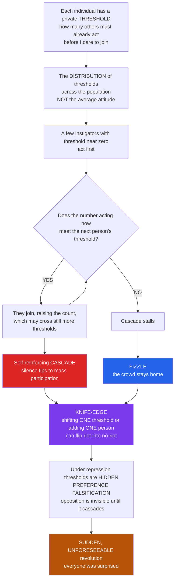

# 🔥 Simulating Collective Behavior and Social Movements

> [!abstract] TL;DR
> **Collective behavior** — protests, riots, revolutions, strikes, panics, fads — is notoriously **unpredictable** and prone to **sudden cascades**, and computational models tell us *why*. The foundational insight is **Granovetter's threshold model** (1978): a person joins collective action not on principle alone but based on **how many OTHERS have already joined** — each carries a private **threshold**, the number (or fraction) of others who must already be participating before they dare. A few **instigators** (threshold ≈ 0) act; that pushes the threshold-1 people over their edge; that pushes the threshold-2 people; and the crowd can **cascade** from silence to uprising. The profound, counterintuitive result is the **knife-edge**: the outcome depends exquisitely on the **DISTRIBUTION of thresholds**, *not* the average attitude, so **two nearly-identical crowds can diverge completely** — one erupts, one stays home — and **shifting a single person's threshold can flip the result** from no-riot to full-riot. This reframes classic puzzles: the **free-rider / critical-mass** problem (Olson; Oliver-Marwell) of why movements struggle to *start*, and — via **Timur Kuran's preference falsification** — why revolutions are **unforeseeable**: under repression everyone **hides** their true opposition, so hidden dissent accumulates **invisibly** until a trigger cascades people into revealing their real preferences (1989 Eastern Europe, the Arab Spring), and *everyone was surprised*. Because mobilization spreads through **social networks** as a **complex contagion** and exhibits **tipping points** (Centola's ~25 percent critical mass for flipping conventions), agent-based models — threshold simulations, **Epstein's civil-violence model** — and social-media data let us study the dynamics of movements, the science of **social tipping** for rapid beneficial change, and the deep **limits** of predicting when a society will rise.

---

## Intuition

**Analogy — why do some sparks ignite revolutions while identical sparks fizzle?** In 1989, protests toppled governments across Eastern Europe in a matter of weeks that *no one* — not the CIA, not the regimes, not even the dissidents themselves — saw coming. Six months earlier the same societies looked immovably stable. What changed? The secret is that people join a protest not on principle alone but based on **how many OTHERS have already joined**. Everyone carries a private **threshold**: "how many must go before *I* dare?" A committed radical has a threshold near zero — she marches even if she is the only one. A cautious sympathizer might need to see a thousand neighbors already in the street before he risks his job and safety. Most people are somewhere in between.

Now watch the machine. A crowd with the *right* hidden distribution of thresholds **cascades**: the lone radical acts, which tips the person who only needed one, which tips the person who needed two, and the first domino topples the whole line — silence becomes an uprising. But shift that distribution *slightly* — remove one linker, nudge a single threshold from "I'll join once one other does" to "once two others do" — and the very same crowd, with the very same average anger, **stays home forever**, because the chain breaks at the missing link and the cascade stalls. Collective behavior is a **knife-edge**. You *cannot* read the future of a society from its average grievance; the outcome lives in the *distribution* and the *dynamics*, most of which are hidden until the moment they cascade into view.

---

## How It Works

The computational study of collective behavior stops asking "how angry is this population on average?" and starts asking "**what is the distribution of thresholds, and does it support a cascade?**" That single reframing — from average to distribution, from statics to dynamics — explains why mobilization is so unpredictable, so sensitive to small changes, and so prone to sudden eruption.

### Granovetter's threshold model — the engine of collective action

Mark Granovetter's landmark 1978 paper *Threshold Models of Collective Behavior* provides the mechanism. Consider a crowd deciding whether to riot, strike, or adopt a risky behavior:

1. **Each person has a threshold** $\theta_i$ — the number (or fraction) of *others* who must already be participating before person $i$ joins. A threshold-0 person is an **instigator** who acts regardless; a threshold-99 person joins only when nearly everyone else has.
2. **The cascade unfolds in rounds.** Instigators act first. Now some people see their threshold met and join, raising the participant count, which meets *still more* people's thresholds, which pulls in *still more* — a self-reinforcing **bandwagon**. The process runs to a **fixed point** where no additional person's threshold is met.
3. **The outcome is governed by the threshold DISTRIBUTION, not the mean.** Granovetter's canonical example: 100 people with thresholds $\{0, 1, 2, \dots, 99\}$ — one person at each level. The threshold-0 person riots (1 active), tripping the threshold-1 person (2 active), tripping the threshold-2 person, and so on **all the way to 100**. A full riot from a single spark.

### The knife-edge — extreme sensitivity to the distribution

Here is Granovetter's profound and deeply counterintuitive result. Take that same crowd and change **exactly one person**: move the individual with threshold 1 up to threshold 2, so the thresholds are now $\{0, 2, 2, 3, 4, \dots, 99\}$. The **average threshold barely moves**. But now: the instigator riots (1 active) — and *no one* has a threshold of 1, so the cascade needs 2 people active to continue, which never happens. It **stalls at 1**. The identical-looking crowd, with essentially the same average radicalism, produces a **fizzle instead of a riot**.

The lesson is severe and general: **you cannot predict collective action from average attitudes**. Two crowds with the same mean grievance can diverge from silence to uprising, and adding or removing a single "linker" — the person whose participation bridges a gap in the threshold chain — can flip the entire outcome. This is why superficially similar situations (two cities, two campuses, two Tuesdays) have wildly different outcomes, and why mobilization looks like luck. It is not luck; it is **sensitive dependence on a hidden distribution** — the social analogue of the tipping points in [[Bifurcations_and_Tipping_Points]] and the cascade physics of [[Cascades_and_Systemic_Risk]].

### The free-rider problem — why movements struggle to start at all

Threshold dynamics explain *how* a movement spreads, but there is a prior puzzle: why does anyone bear the cost of going first? Mancur Olson's *The Logic of Collective Action* (1965) frames a social movement as a **public good** with a **free-rider** problem: if the movement wins, *everyone* benefits (freedom, better wages) whether or not they marched, but each individual bears the personal **cost and risk** of participating. The narrowly rational move is to let others take the risks and free-ride on their success — so, in theory, **no one acts and movements never start**. Oliver, Marwell, and Teixeira's **critical-mass** theory (1985) resolves the paradox: a small, committed minority who act *regardless of what others do* (the low-threshold instigators) can produce the initial participation that trips everyone else's thresholds. Movements also defeat free-riding with **selective incentives** (rewards only for participants), **collective identity**, and **dense networks** that make defection socially visible. Critical mass and thresholds are two faces of the same coin: the instigators *are* the critical mass.

### Preference falsification — why revolutions are unforeseeable (Kuran)

Timur Kuran's theory of **preference falsification** explains the most dramatic feature of collective behavior: sudden, unpredicted revolution. Under a repressive regime, people **hide their true anti-regime preferences** out of fear, publicly professing support they do not feel. Because everyone falsifies, the regime *looks* rock-solid and — crucially — **no one knows how much hidden opposition actually exists**, not even the opposition. Yet each person carries a private **revolutionary threshold**: the level of *public* dissent at which they would finally reveal their true preference. A small trigger (a botched crackdown, an economic shock, one brave individual) can push the first few over their thresholds; their public defiance emboldens the next tier, whose defiance emboldens the next — an **informational cascade of preference revelation** that snowballs into a **sudden, total revolution**. Because the thresholds were *hidden* until they cascaded, the uprising is genuinely **unforeseeable** — which is exactly why "everyone was surprised" by 1989 and by the Arab Spring. Kuran's insight is the threshold model plus **invisible state**: the distribution that determines everything was never observable in advance.

### Networks, contagion, and tipping points

Real mobilization does not happen in a well-mixed crowd; it spreads through **social networks**. Joining a risky protest is the archetypal **complex contagion** (see [[Contagion_and_Diffusion_in_Social_Networks]]): you need reinforcement from **multiple** already-participating contacts, not a single distant one, so **network structure** — clustering, wide bridges, the position of instigators, pre-existing organizations — decides whether a movement spreads or stalls (McAdam's "strength of strong ties" for high-risk activism; Centola on wide bridges). This connects mobilization to the general science of **social tipping points**: a critical mass past which participation self-reinforces. Centola's 2018 experiments found roughly a **25 percent** committed minority can flip an established social convention — a result now central to strategies for rapid norm change on climate and public health.

### Agent-based models — the CSS toolkit

Beyond well-mixed threshold math, agent-based models simulate mobilization on explicit populations and networks. **Joshua Epstein's civil-violence model** (2002) is the canonical example: agents decide to rebel based on their **grievance**, their **perceived risk** (a function of nearby "cop" density), and a hardship parameter; the model spontaneously produces **punctuated bursts** of rebellion — long quiet periods shattered by sudden outbreaks — reproducing the episodic, bursty character of real unrest without any central script. Combined with **social-media and big-data** analysis of real movements (the Arab Spring, #MeToo, Black Lives Matter, Hong Kong 2019 — reconstructed from digital traces), these models form the computational social scientist's apparatus for studying, and probing the limits of predicting, when a society mobilizes.



---

## Key Concepts

### Secondary Level

- **Collective behavior:** what happens when many people act *together* — a protest, a riot, a strike, a craze — even though each person is making an individual choice.
- **Threshold:** your personal tipping point — *how many other people must already be doing something before you will join in*. A brave few need almost no one; the cautious need a big crowd first.
- **Cascade / bandwagon:** the first few who act tip the people who needed just a nudge, who tip the next, and so on — a chain reaction that can turn silence into a mass movement.
- **The knife-edge:** two almost-identical crowds can behave completely differently, and changing just one person's willingness to join can decide whether *nothing* happens or *everything* does.
- **Why revolutions surprise everyone:** under a scary government, people hide how much they really oppose it — so no one realizes how much hidden anger there is until it suddenly bursts into the open.

### Undergraduate Level

- **Granovetter threshold model (1978).** Person $i$ joins once the number of others participating reaches threshold $\theta_i$. Collective outcome is the **fixed point** of the cascade; it is set by the **threshold distribution**, not the mean. The uniform crowd $\{0,1,\dots,99\}$ riots fully; nudging one threshold produces a fizzle — the **knife-edge**.
- **Free-rider problem and critical mass.** Olson (1965): collective action is a public good, so rational actors free-ride and movements under-mobilize. Oliver-Marwell (1985): a **critical mass** of unconditional participants (low-threshold instigators) can ignite the rest. Selective incentives, identity, and networks help overcome free-riding (see [[Public_Goods]]).
- **Preference falsification (Kuran).** Public conformity hides private opposition; each person has a **revolutionary threshold** in terms of *public* dissent. Hidden opposition accumulates invisibly until a trigger sets off a **cascade of preference revelation** — a sudden, unpredicted revolution.
- **Complex contagion and networks.** High-risk participation needs **reinforcement** from multiple contacts, so it spreads as a **complex contagion**; clustered, redundant networks and pre-existing organizations matter more than long-range weak ties (see [[Contagion_and_Diffusion_in_Social_Networks]]).
- **Social tipping.** A committed minority (Centola's ~25 percent) can flip an entrenched convention — the basis of deliberate norm-change strategy.

### Graduate Level

- **Fixed-point / equilibrium structure.** Let $F(x)$ be the fraction of the population with threshold $\le x$. The cascade map is $r_{t+1} = F(r_t)$ (fractional form) and equilibria are solutions of $r^\* = F(r^\*)$. **Stable** equilibria satisfy $F'(r^\*) < 1$; the cascade launched from instigators climbs to the **lowest stable fixed point**. A small perturbation to the distribution can make a stable low fixed point collide with an unstable one and vanish (**saddle-node bifurcation**), whereupon the system jumps to a high fixed point — the formal content of the knife-edge and of Kuran's sudden revolution.
- **Sensitivity and non-identifiability.** Because the outcome depends on the *entire* distribution near the diagonal, two distributions with identical means (and even identical low-order moments) can produce opposite equilibria. This is why average-attitude survey data has weak predictive power for mobilization, and why preference falsification makes the relevant distribution **unobservable** ex ante.
- **Critical mass, formally.** Oliver-Marwell model the production function of a collective good; **accelerating** production functions (each contribution raises the marginal impact of the next) generate a critical-mass threshold and bandwagon, while **decelerating** ones lead to under-provision. Heterogeneity in interest and resources — a few highly-resourced actors — often drives real mobilization more than the size of the sympathetic pool.
- **Epstein civil-violence model.** Agents on a grid have grievance $G = H(1-L)$ (hardship $H$, perceived legitimacy $L$) and rebel when $G - N \cdot P(\text{arrest}) > T$, with arrest probability decreasing in the local cop-to-active-rebel ratio. The model yields **punctuated equilibria** and endogenous "free-assembly" bursts — emergent macro-dynamics absent from any agent's rules (see [[Agent_Based_Modeling]]).
- **Network thresholds and cascade windows.** Placing thresholds on a graph (Watts 2002) yields **global cascades** only within a connectivity window bounded by a percolating **vulnerable cluster** of low-threshold nodes; too sparse and the seed cannot propagate, too dense and every node has too many neighbors to ever cross its fractional threshold.

---

## Python Demo

```python
# Granovetter's THRESHOLD MODEL of collective action + preference falsification.
# A person joins the riot/protest once the NUMBER already participating meets
# their personal THRESHOLD. Instigators have threshold 0. Because every joiner
# raises the count, low thresholds trip higher ones -> a CASCADE. Whether it
# takes off is exquisitely sensitive to the DISTRIBUTION of thresholds, NOT the
# average -- the famous "knife-edge." numpy + matplotlib only.
import numpy as np
import matplotlib
matplotlib.use("Agg")
import matplotlib.pyplot as plt

rng = np.random.default_rng(0)

# ---------------------------------------------------------------------
# Core: well-mixed Granovetter cascade. Everyone sees the GLOBAL count of
# current participants; person i is active once count >= threshold_i.
# We iterate to a fixed point and return the whole time-trace of the count.
# ---------------------------------------------------------------------
def cascade_trace(thresholds):
    thr = np.asarray(thresholds, dtype=float)
    count = int(np.sum(thr <= 0))            # instigators: threshold 0 act first
    trace = [count]
    while True:
        new = int(np.sum(thr <= count))      # join if participants-so-far >= your threshold
        trace.append(new)
        if new == count:                     # fixed point: no one new joins
            return np.array(trace)
        count = new

def final_participation(thresholds):
    return cascade_trace(thresholds)[-1]

# =====================================================================
# (1) THE KNIFE-EDGE: two crowds differing by ONE person's threshold.
#     Crowd A: thresholds 0,1,2,...,99  (Granovetter's uniform crowd)
#     Crowd B: identical, except the ONE person with threshold 1 now has 2.
#     Same average radicalism -> opposite outcome (full riot vs total fizzle).
# =====================================================================
N = 100
crowd_A = np.arange(N).astype(float)          # 0,1,2,...,99  -> full cascade
crowd_B = np.arange(N).astype(float)
crowd_B[1] = 2.0                              # move ONE threshold 1 -> 2 -> fizzle
trace_A = cascade_trace(crowd_A)
trace_B = cascade_trace(crowd_B)

# =====================================================================
# (2)+(3) SAME AVERAGE, DIFFERENT OUTCOME. Hold the MEAN threshold fixed at
#     mu; vary ONLY the spread (std). A wider spread grows a low-threshold
#     tail of instigators -> the cascade can ignite. Averaged over random
#     crowds the final size makes a SHARP JUMP; individual crowds are
#     BIMODAL -- they either fizzle near 0 or erupt near N, rarely between.
# =====================================================================
mu, TRIALS = 40.0, 300
sigmas = np.linspace(4, 42, 26)
mean_frac, all_frac = [], []
for s in sigmas:
    fr = np.array([final_participation(np.clip(np.round(rng.normal(mu, s, N)), 0, N)) / N
                   for _ in range(TRIALS)])
    mean_frac.append(fr.mean()); all_frac.append(fr)
mean_frac = np.array(mean_frac)
crit_idx  = int(np.argmin(np.abs(mean_frac - 0.5)))   # most bimodal crowd
crit_sigma, crit_outcomes = sigmas[crit_idx], all_frac[crit_idx]

# =====================================================================
# (4) PREFERENCE FALSIFICATION (Kuran). In a repressive regime people HIDE
#     their opposition: each has a private REVOLUTIONARY THRESHOLD = the
#     fraction of the population that must ALREADY be openly dissenting
#     before they dare to reveal. Rising grievance g effectively LOWERS
#     everyone's threshold. Public dissent stays ~0 (regime looks stable) as
#     hidden opposition accumulates -> then a tiny extra g tips a SUDDEN,
#     near-total cascade. The outcome was invisible until it happened.
# =====================================================================
M = 5000
base = np.clip(rng.normal(0.62, 0.18, M), 0, 1)       # most need a near-majority first
def equilibrium_dissent(g):
    r = 0.0
    for _ in range(4000):
        nr = float(np.mean(base <= (r + g)))          # reveal if fraction-so-far + grievance >= threshold
        if abs(nr - r) < 1e-9:
            break
        r = nr
    return r
grievance = np.linspace(0.0, 0.6, 400)
public    = np.array([equilibrium_dissent(g) for g in grievance])
jump_idx  = int(np.argmax(np.diff(public)))           # locate the abrupt jump
jump_g    = grievance[jump_idx]

# ------------------------------- REPORT --------------------------------
print("=" * 68)
print("GRANOVETTER THRESHOLD MODEL OF COLLECTIVE BEHAVIOR")
print("=" * 68)
print("[1] KNIFE-EDGE  (two crowds differing by ONE person's threshold)")
print(f"    Crowd A  thresholds 0..99          -> final participation {trace_A[-1]:>3d}/{N}")
print(f"    Crowd B  same, but one 1 -> 2        -> final participation {trace_B[-1]:>3d}/{N}")
print(f"    Same average radicalism, OPPOSITE outcome: full riot vs fizzle.")
print("-" * 68)
print("[2] SAME MEAN, DIFFERENT SPREAD (mean threshold fixed at 40)")
print(f"    narrow spread  sigma={sigmas[0]:.0f} -> mean participation {mean_frac[0]:.0%}")
print(f"    wide   spread  sigma={sigmas[-1]:.0f} -> mean participation {mean_frac[-1]:.0%}")
print(f"    sharp transition near sigma={crit_sigma:.1f}")
extreme = np.mean((crit_outcomes < 0.1) | (crit_outcomes > 0.9))
print(f"[3] At the critical spread, {extreme:.0%} of crowds land near 0 or near 1 (BIMODAL).")
print("-" * 68)
print(f"[4] PREFERENCE FALSIFICATION: public dissent stays near zero, then")
print(f"    JUMPS from {public[jump_idx]:.0%} to {public[jump_idx+1]:.0%} at grievance g={jump_g:.3f}")
print(f"    -> a sudden, unforeseeable revolution; hidden thresholds were invisible.")

# ------------------------------- FIGURE --------------------------------
fig, ax = plt.subplots(2, 2, figsize=(15, 10))
fig.suptitle("Simulating collective behavior: the threshold-cascade KNIFE-EDGE",
             fontsize=14, fontweight="bold")

# Panel 1: knife-edge cascade dynamics over time
a = ax[0, 0]
a.plot(trace_A, "-o", color="#dc2626", ms=3, lw=2, label="Crowd A: thresholds 0..99  (RIOT)")
a.plot(trace_B, "-s", color="#2563eb", ms=5, lw=2, label="Crowd B: one threshold 1->2  (FIZZLE)")
a.set_title("Cascade dynamics: ONE changed threshold flips the outcome", fontsize=10)
a.set_xlabel("cascade round"); a.set_ylabel("number participating")
a.set_ylim(-3, N + 3); a.legend(fontsize=9, loc="center right"); a.grid(alpha=0.3)
a.annotate("full uprising", (len(trace_A) - 1, N), xytext=(len(trace_A) * 0.45, 82),
           fontsize=9, color="#dc2626",
           arrowprops=dict(arrowstyle="->", color="#dc2626"))
a.annotate("stalls at 1", (1.5, 1), xytext=(20, 12), fontsize=9, color="#2563eb",
           arrowprops=dict(arrowstyle="->", color="#2563eb"))

# Panel 2: same MEAN, varying SPREAD -> sharp jump; scatter shows bimodality
a = ax[0, 1]
for s, ys in zip(sigmas, all_frac):
    a.scatter(np.full(ys.size, s), ys, s=5, color="#94a3b8", alpha=0.12)
a.plot(sigmas, mean_frac, "-o", color="#7c3aed", lw=2.4, ms=4, label="mean over crowds")
a.axvline(crit_sigma, color="#b45309", ls="--", lw=1.5, label=f"critical spread ~{crit_sigma:.0f}")
a.set_title("Same AVERAGE threshold (40), only the SPREAD changes", fontsize=10)
a.set_xlabel("std of threshold distribution (spread)"); a.set_ylabel("fraction participating")
a.set_ylim(-0.03, 1.05); a.legend(fontsize=9, loc="center right"); a.grid(alpha=0.3)
a.text(sigmas[0] + 1, 0.55, "identical mean,\nopposite outcome", fontsize=9, color="#7c3aed")

# Panel 3: bimodal outcome histogram at the critical spread
a = ax[1, 0]
a.hist(crit_outcomes, bins=np.linspace(0, 1, 21), color="#0f766e", edgecolor="black")
a.set_title(f"Outcomes at the critical spread (sigma={crit_sigma:.0f}): BIMODAL", fontsize=10)
a.set_xlabel("fraction participating"); a.set_ylabel("number of crowds (of 300)")
a.grid(alpha=0.3, axis="y")
a.text(0.30, a.get_ylim()[1] * 0.7,
       "crowds either FIZZLE (~0)\nor ERUPT (~1) -- rarely between",
       fontsize=9, color="#0f766e")

# Panel 4: preference falsification -> sudden revolution
a = ax[1, 1]
a.plot(grievance, public, color="#dc2626", lw=2.6)
a.axvline(jump_g, color="#b45309", ls="--", lw=1.5)
a.fill_between(grievance[:jump_idx + 1], 0, public[:jump_idx + 1], color="#2563eb", alpha=0.25)
a.set_title("Preference falsification: hidden dissent, sudden revolution", fontsize=10)
a.set_xlabel("rising grievance g  (erodes hidden thresholds)")
a.set_ylabel("observed PUBLIC dissent")
a.set_ylim(-0.03, 1.05); a.grid(alpha=0.3)
a.annotate("regime looks stable\n(hidden opposition invisible)", (jump_g * 0.4, 0.06),
           fontsize=9, color="#1e3a8a")
a.annotate("SUDDEN cascade\n'everyone was surprised'", (jump_g, 0.55),
           xytext=(jump_g - 0.28, 0.8), fontsize=9, color="#dc2626",
           arrowprops=dict(arrowstyle="->", color="#dc2626"))

plt.tight_layout(rect=[0, 0, 1, 0.95])
plt.savefig("collective_behavior_knife_edge.png", dpi=110, bbox_inches="tight")
plt.show()
```

**What the demo shows:**

- **Panel 1 — the knife-edge in time.** Two crowds with essentially the same average threshold: Crowd A ($\{0,1,\dots,99\}$) cascades all the way to a **full riot** of 100, while Crowd B — identical except that the single threshold-1 person now needs 2 — **stalls at 1**. The chain of dominoes breaks at one missing link. This is Granovetter's exact result: outcome is set by the *distribution*, and one person decides everything.
- **Panel 2 — distribution, not mean.** The **mean threshold is held fixed at 40** while only the **spread** varies. Narrow crowds fizzle (no instigators in the tail); as the spread widens a low-threshold tail appears and the population **jumps sharply** to full participation. Identical average radicalism, opposite fate — the mean is nearly useless as a predictor.
- **Panel 3 — bimodality.** At the critical spread, crowds do not land at "half a riot." They pile up near **0 (fizzle)** or near **1 (full uprising)** — the signature of a cascade system poised on a knife-edge, where tiny differences in the drawn distribution decide the outcome.
- **Panel 4 — preference falsification and sudden revolution.** As grievance slowly rises, **observed public dissent stays near zero** — the regime looks stable and the accumulating hidden opposition is *invisible*. Then, at a critical grievance, the low equilibrium disappears and public dissent **jumps abruptly to near-total**: a sudden, unforeseeable revolution. An outside observer watching the flat public curve had **no warning** — precisely the 1989 / Arab Spring surprise.

---

## Real-World Applications

> **The 1989 revolutions and the Arab Spring.** Kuran's preference falsification is the canonical explanation for why the collapse of Eastern European communism and the 2011 Arab uprisings were *not predicted* by intelligence agencies, area experts, or the participants. Hidden anti-regime sentiment, masked by public conformity, crossed a tipping point once a trigger (a single self-immolation in Tunisia; the opening of the Hungarian border) started the cascade of preference revelation. See [[Social_Movements_and_Revolution]] for the sociological framing.

> **Riots, protests, and mobilization forecasting.** Threshold and civil-violence models inform (and caution) attempts at **early warning** for unrest. The core lesson is the *limits* of prediction: because the decisive distribution is hidden and the dynamics are knife-edge, point forecasts of "when will a city riot" are fundamentally fragile — a sobering result for security agencies and a check on over-confident predictive policing. The sociological substance lives in [[Collective_Behavior_and_Crowds]].

> **Movement strategy and organizing.** Activists implicitly manage thresholds: build a visible **critical mass** of committed instigators, make participation feel safe and normative (lowering others' thresholds), and recruit through **dense, trusted local networks** rather than scattered weak ties — because high-risk participation is a **complex contagion** (see [[Contagion_and_Diffusion_in_Social_Networks]]). Understanding the free-rider problem ([[Public_Goods]]) shapes tactics like selective incentives and identity-building.

> **Social tipping for beneficial change.** The same dynamics power *deliberate* rapid change — climate action, vaccination norms, anti-harassment norms (#MeToo), quitting smoking. Centola's finding that a committed ~25 percent minority can flip an entrenched convention is now a design principle for norm-change campaigns and for the science of **social tipping points**.

> **Panics, bank runs, and market cascades.** The identical threshold logic drives financial panics: each depositor's decision to withdraw depends on how many others already have, so a run is a threshold cascade and a market crash a bandwagon of belief revelation. This is the bridge to [[Cascades_and_Systemic_Risk]], the complexity-economics treatment in *Cascades, Contagion, and Financial Crises*, and behavioral herding in *Herding, Bubbles, and Crashes*.

> **Simulating movements from digital traces.** Computational social scientists reconstruct real cascades — the Arab Spring, Black Lives Matter, Hong Kong 2019 — from social-media data, fitting threshold and contagion models to observed participation curves. This empirical wing connects to the found-data and measurement notes in this vault (see [[Computational_Social_Science_Overview]]) and to the forthcoming *Misinformation, Polarization, and the Online Public Sphere*.

---

## Common Pitfalls

- **Predicting mobilization from average attitudes.** The single most consequential error. Two populations with identical average grievance can produce a riot and a fizzle; the outcome lives in the *distribution* of thresholds and in the *dynamics*, not the mean. Survey averages of "how angry are people" have notoriously weak predictive power for collective action — by design of the model, not by accident.
- **Ignoring the knife-edge / over-fitting a single history.** Because outcomes are sensitively dependent on the distribution, "it happened, therefore it was inevitable" is a hindsight illusion. The same conditions could easily have fizzled; a single missing linker or a slightly different trigger flips it. Treat successful (and failed) movements as **draws from a bimodal distribution**, not deterministic consequences of grievance.
- **Assuming stability from observed calm.** Kuran's warning: under repression, *observed* public support tells you almost nothing about *hidden* opposition. A regime can look maximally stable moments before it collapses. Preference falsification makes the decisive variable **structurally unobservable**, which is why confident "this regime is secure" predictions repeatedly fail.
- **Applying the well-mixed model to a networked world.** The classic threshold model assumes everyone sees a global count. Real mobilization is **local and networked** — you respond to *your* contacts, and high-risk participation needs **reinforcement** (complex contagion). Clustering, wide bridges, and pre-existing organizations can enable or block a cascade that the well-mixed model gets wrong (see [[Contagion_and_Diffusion_in_Social_Networks]]).
- **Forgetting the free-rider problem when explaining why movements *start*.** Threshold cascades describe how participation *spreads* once seeded, but not why the risky first-movers act despite free-rider incentives. Explanations that skip the **critical-mass / selective-incentive** mechanism (Olson; Oliver-Marwell) leave the hardest part — ignition — unexplained.
- **Confusing threshold heterogeneity with irrationality.** A high threshold is not apathy or stupidity; it is a rational response to genuinely higher personal cost and risk. Movements grow by *lowering* those costs (safety in numbers, shared identity), which shifts the distribution — not by assuming people "wake up."

---

## Related Concepts

**Within Computational Social Science:**

- [[Computational_Social_Science_Overview]] — the parent field; modeling collective behavior is one of its flagship problems, bridging sociology, political science, and complexity.
- [[Contagion_and_Diffusion_in_Social_Networks]] — high-risk mobilization is a **complex contagion** needing reinforcement; that note supplies the network machinery this well-mixed threshold model abstracts away.
- [[Agent_Based_Modeling]] — the bottom-up simulation method (as in this note's demo and Epstein's civil-violence model) for studying emergent mobilization.

**Complexity, cascades, and tipping points (Systems Thinking):**

- [[Cascades_and_Systemic_Risk]] — Granovetter/Watts threshold cascades and the "cascade window" are the same physics applied to failures; riots and blackouts share a mathematics.
- [[Bifurcations_and_Tipping_Points]] — the knife-edge is a **saddle-node bifurcation**: a stable low-participation equilibrium collides with an unstable one and vanishes, jumping the system to uprising.

**Sociology and political science substance:**

- [[Collective_Behavior_and_Crowds]] — the sociological treatment of crowds, panics, and Granovetter's riot threshold model; the disciplinary home of this computational note.
- [[Social_Movements_and_Revolution]] — resource mobilization, political-process, and framing theories of movements and revolutions, and the four traditions this note formalizes.

**Collective action and economics:**

- [[Public_Goods]] — the free-rider / non-excludability structure that makes collective action hard to start; the microeconomic root of Olson's problem.

**Planned siblings in this vault (referenced above, not yet written):** *Agent-Based Models of Society* (the broader ABM-of-social-life umbrella this note sits under), *Opinion Dynamics and Polarization* (how opinions — not just actions — cascade and cluster), *Segregation and Emergent Social Order* (Schelling-style emergence, the peaceful cousin of cascades), and *Misinformation, Polarization, and the Online Public Sphere* (how social media reshapes the thresholds and networks of modern mobilization).

---

## Review Questions

### Secondary

1. Explain, in your own words, what a "threshold" means in Granovetter's model. Give an example of a person with a *low* threshold and a person with a *high* threshold for joining a protest, and say why each acts the way they do.
2. Two crowds are equally angry on average, yet one erupts into a protest and the other stays completely silent. Using the idea of thresholds, explain how that is possible even though the average anger is the same.
3. Why were so many people surprised when the East European governments fell in 1989? Explain using the idea that people were *hiding* how they really felt.

### Undergraduate

1. Walk through Granovetter's canonical example: a crowd with thresholds $\{0,1,2,\dots,99\}$ versus the same crowd with a single threshold moved from 1 to 2. Trace the cascade in each case and explain *mechanically* why one produces a full riot and the other stalls at 1. What does this say about predicting mobilization from average attitudes?
2. A movement has plenty of sympathizers but cannot get anyone to show up first. Diagnose this using the **free-rider problem**, then propose three interventions (drawing on critical-mass theory and selective incentives) that would shift the threshold distribution enough to ignite a cascade.
3. Explain **preference falsification** and why it makes revolutions unforeseeable. In the demo's Panel 4, the observed public-dissent curve is flat until it suddenly jumps — why can an outside observer watching that curve get *no warning* of the coming revolution?

### Graduate

1. Formalize the well-mixed threshold model as the fixed-point map $r_{t+1} = F(r_t)$ where $F$ is the threshold CDF. Characterize stable versus unstable equilibria, and show how a small perturbation to $F$ can trigger a **saddle-node bifurcation** that discontinuously jumps the equilibrium from near-zero to near-one. Connect this explicitly to the knife-edge and to Kuran's sudden revolution.
2. The classic threshold model assumes global observation of the participant count. Re-cast it as a **complex contagion on a network** with fractional thresholds. Why do clustered, redundant ties and "wide bridges" enable cascades that a well-mixed model or a random network would suppress? What does this predict about which real-world networks (pre-existing churches, unions, student groups) most reliably produce high-risk mobilization?
3. Critically compare threshold models, Kuran's preference-falsification cascade, and Epstein's civil-violence agent-based model as accounts of the *unpredictability* of unrest. Which sources of unpredictability does each capture (hidden distribution, invisible preferences, endogenous bursty dynamics), and what does the combined picture imply about the fundamental limits — and the ethics — of forecasting or suppressing collective action?

---

## Sources

- [Granovetter, M. (1978). "Threshold Models of Collective Behavior." *American Journal of Sociology*, 83(6), 1420–1443](https://doi.org/10.1086/226707)
- [Kuran, T. (1991). "Now Out of Never: The Element of Surprise in the East European Revolution of 1989." *World Politics*, 44(1), 7–48](https://doi.org/10.2307/2010422)
- [Olson, M. (1965). *The Logic of Collective Action: Public Goods and the Theory of Groups*. Harvard University Press](https://www.hup.harvard.edu/catalog.php?isbn=9780674537514)
- [Oliver, P., Marwell, G., & Teixeira, R. (1985). "A Theory of the Critical Mass. I. Interdependence, Group Heterogeneity, and the Production of Collective Action." *American Journal of Sociology*, 91(3), 522–556](https://doi.org/10.1086/228313)
- [Epstein, J. M. (2002). "Modeling Civil Violence: An Agent-Based Computational Approach." *PNAS*, 99(suppl 3), 7243–7250](https://doi.org/10.1073/pnas.092080199)
- [Centola, D., Becker, J., Brackbill, D., & Baronchelli, A. (2018). "Experimental Evidence for Tipping Points in Social Convention." *Science*, 360(6393), 1116–1119](https://doi.org/10.1126/science.aas8827)

---

#computational-social-science #collective-behavior #social-movements #threshold-models #cascades
