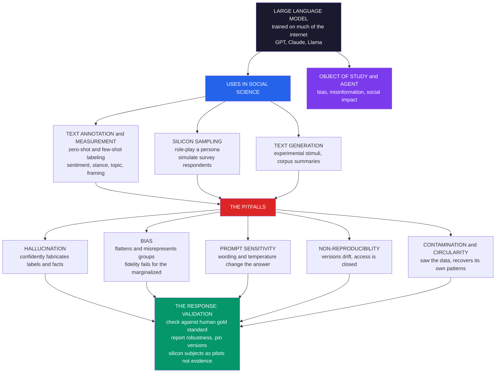

# 🤖 Large Language Models in Social Science

> [!abstract] TL;DR
> **Large language models** (GPT-4, Claude, Llama, and kin) are rapidly transforming computational social science by turning a machine that has read much of the internet into a cheap, flexible, always-available research assistant. Their three headline uses are **text ANNOTATION and measurement** — labeling documents for **sentiment, stance, topic, emotion, or framing** via **zero-shot / few-shot** prompting (no training data, just a task description) at a scale and cost that hand-coding and crowd-work cannot match, and often *matching or beating* trained classifiers and human coders (Gilardi et al. found ChatGPT outperforms crowd-workers on several annotation tasks) — **"SILICON SAMPLING,"** the provocative idea of prompting a model to role-play a persona ("a 68-year-old conservative retiree from Ohio") and answer a survey, generating synthetic **"silicon subjects"** whose subgroup opinion patterns can echo real ones to a surprising degree (Argyle et al.'s **"algorithmic fidelity"**) — and **text GENERATION / analysis** (experimental stimuli, corpus summarization, LLM agents). But the shortcut is paved with serious new traps: LLMs **HALLUCINATE** (confidently fabricate labels, facts, and citations), encode and **launder BIASES** that systematically flatten and misrepresent groups (especially marginalized, non-WEIRD, non-English ones — where algorithmic fidelity *fails*), are acutely sensitive to **PROMPT wording, temperature, and model version** (a reproducibility crisis of "measuring a moving target"), and risk training-data **CONTAMINATION and circularity** (a model trained on human text may merely *recover* that text's patterns). Because these threaten the **validity** of findings, the cardinal rules persist: **validate against human gold standards**, report prompt/robustness sensitivity, **pin model versions**, check bias across groups, and treat silicon subjects as **cautious pilots, not evidence** about real humans. Crucially, LLMs are not only *tools* for social science but increasingly *objects of study* and *agents* reshaping communication, work, and the information ecosystem — making their disciplined use and critical study a defining frontier of the field.

---

## Intuition

**Analogy:** For a century, studying society through text meant slow, expensive, human labor. Graduate students **hand-coded** newspaper articles one by one; survey firms **paid thousands of people** to answer questionnaires; a single content-analysis project could take a year to label what one afternoon of the internet now produces in a second. Then came a machine that has **read much of what humanity has written** and will, on command, do three astonishing things: **label a million documents' sentiment** by lunchtime, **role-play** a "68-year-old conservative retiree from Ohio" and answer your survey as if it were that person, or **summarize a decade of policy debate** into a paragraph. It is the ultimate research assistant — infinitely patient, instantly available, absurdly cheap — and it seems to offer a shortcut around the two things that always throttled social science: the cost of **measuring** text and the cost of **sampling** humans.

But this assistant has three unnerving habits. It **sometimes makes things up** — inventing a citation, a fact, or a confident label that is simply wrong — and says it with the same fluent authority as the truth. It **carries hidden biases** absorbed from its training data, so it reliably nails the views of the majority it saw a million times and quietly **flattens or fabricates** the views of the minority it barely saw. And it gives you **different answers depending on how you ask** — reword the prompt, nudge the temperature, or wait for the model to silently update, and yesterday's result no longer replicates. The shortcut is real. So are the new, subtle traps — and the whole methodological game is learning to take the assistant's help without inheriting its lies. This note is the **application** of large language models to social research; for the models themselves see [[Language_Model_Basics]], [[GPT_Family]], and [[Transformer_Architecture]].

---

## How It Works

Large language models are next-token predictors trained on enormous text corpora and then aligned (via [[RLHF]] and instruction tuning) to follow instructions — see [[Language_Model_Basics]] for the mechanics. What makes them a *social-science instrument* is a single capability: **you describe a task in natural language and the model performs it without task-specific training** — [[Zero_Shot_and_Few_Shot]] learning. That collapses the two historically expensive steps of text-based research (building a labeled training set; recruiting human respondents) into a **prompt**. Everything below flows from that, and so do all the hazards. This note is the anchor of the vault's **Text as Data** section — see the forthcoming siblings *Text_as_Data_in_Social_Science* (the umbrella), *Topic_Models_and_Document_Classification*, *Sentiment_Emotion_and_Stance_Analysis*, *Word_Embeddings_and_Semantic_Change*, and *Measuring_Culture_and_Ideology_from_Text*.

### Use 1 — LLMs as text annotators and measurement tools (the biggest current use)

The dominant, most defensible use is **automated annotation**: prompt the model to **classify or measure** a construct in each document — *"Is the stance of this tweet toward the policy AGAINST, NEUTRAL, or FAVOR?"* — and it returns a label for each of a million texts. Because it is **zero-shot or few-shot**, you need **no training corpus**; you can measure **sentiment, stance, topic, emotion, framing, toxicity, or complex bespoke constructs** ("does this speech invoke national identity?") by *describing* them. Empirically, on many tasks LLM zero-shot annotation **matches or exceeds** both trained supervised classifiers and human crowd-workers, at a fraction of the cost and time (Gilardi, Alizadeh & Kubli, 2023: "ChatGPT outperforms crowd-workers for text-annotation tasks"; see the review by Ziems et al., 2024). This is the **annotation revolution** — flexible, automated text measurement — but it inherits the old requirement of any measurement instrument: it must be **validated** ([[Measurement_and_Validity_in_Digital_Data]]).

### Use 2 — "Silicon sampling": LLMs as simulated subjects

A more provocative frontier is **silicon sampling**: prompt the model to **role-play a persona** (demographics, ideology, region) and **answer questions** as that person, generating a synthetic sample of **"silicon subjects."** Argyle et al. (2023, *"Out of One, Many"*) conditioned GPT-3 on thousands of real demographic backstories and found it reproduced **subgroup opinion patterns** from real surveys to a surprising degree — a property they named **"algorithmic fidelity."** The tantalizing (and controversial) promise: **pilot** survey instruments, **predict** how a population might respond, or reach **hard-to-survey** populations by simulating them — even build **societies of LLM agents** (Park et al.'s *Generative Agents*). The peril is that the fidelity is uneven and the subjects are, ultimately, a **model of a model of humans** (see the pitfalls).

### Use 3 — Text generation and analysis assistance

LLMs also **generate** research materials — personalized experimental stimuli, treatment texts, synthetic vignettes, even deepfakes-as-stimuli — and **assist analysis** by summarizing large corpora, extracting entities and events, and drafting codebooks. These are labor-savers, subject to the same validity and reproducibility caveats.

### The pitfalls — why the shortcut is dangerous

- **Hallucination and fabrication (the reliability problem).** LLMs generate **fluent falsehoods** — fake citations, invented facts, confidently *wrong* labels. For measurement, a model may **mis-label with total confidence**; for silicon subjects, it may **fabricate plausible-but-wrong responses**. You cannot take the confident answer at face value; outputs must be **verified against ground truth**.
- **Bias and misrepresentation (the validity / fairness problem).** LLMs encode the biases of their training data and alignment, skewing toward **WEIRD, English, mainstream** perspectives. So annotations and silicon respondents **systematically misrepresent** groups — flattening diversity, defaulting to majority or stereotyped views, **missing minority perspectives**. Argyle's "algorithmic fidelity" *fails* precisely for marginalized groups. Using LLMs risks **laundering** these biases into published findings — *whose views does the model represent?* (see [[AI_Bias_and_Fairness]], [[Algorithmic_Fairness_and_Bias]], and how bias lives in [[Word_Embeddings]]).
- **Prompt sensitivity and non-reproducibility (the replication problem).** Outputs are **highly sensitive** to prompt wording (a hidden **researcher degree of freedom**), to **temperature** (stochastic outputs), and to **model version** (proprietary models update and deprecate — results are not reproducible over time). Closed, black-box access makes the instrument un-inspectable. This is a genuine **reproducibility crisis** — "measuring a moving target" (Ollion et al., 2024).
- **Contamination and circularity (the epistemic problem).** **Training-data contamination**: the model may have *seen* your test set or phenomenon in training, inflating apparent performance and invalidating any claim of "prediction." **Circularity**: using a model trained on human text to "discover" facts about humans may just **recover the training data's patterns** — you learn about the corpus, not the world.

### The response — validation and best practices

The discipline that separates credible LLM social science from hype: **(1)** always **validate** LLM outputs against a **human gold-standard** subset and report agreement ([[Measurement_and_Validity_in_Digital_Data]]); **(2)** report **prompt and robustness sensitivity** (multiple prompts, temperatures); **(3)** **pin model versions** and document everything; **(4)** **check bias across groups**; **(5)** use LLMs to **augment, not replace** human judgment; **(6)** treat **silicon subjects with extreme caution** — as hypotheses and pilots, not evidence about real humans.

### The broader stakes — LLMs as objects and agents

Social science does not only **use** LLMs; it must **study** them. They are increasingly **objects of study** (their biases, their role in misinformation and the online public sphere — the sibling *Misinformation_Polarization_and_the_Online_Public_Sphere*) and **agents** in the economy and society (echoing the [[Complexity_Economics_and_Machine_Learning]] and [[Behavioral_Economics_and_Machine_Learning]] concerns), reshaping communication, work, and knowledge. CSS both **uses** LLMs and must **critique** them — the dual relationship that defines the frontier.

### From capability to hazard to remedy, in one picture



---

## Key Concepts

### Secondary Level

Imagine you have **a million tweets** and you want to know how many are **for** or **against** a new law. The old way: pay hundreds of people to read and sort them — slow and expensive. The new way: ask a very well-read AI, *"Is this tweet for or against the law?"* and let it sort all million in an afternoon. That is **LLM annotation**, and it is genuinely amazing.

But the AI has three bad habits you must never forget:

- **It makes things up.** Sometimes it gives a confident answer that is just **wrong** — like a student who never says "I don't know" and instead invents an answer. So you always have to **check** its work against some tweets that real people sorted.
- **It has favorites.** Because it learned from the internet, it knows the **loud majority** very well and the **quiet minority** poorly. If you ask it to pretend to be someone from a small or under-represented group, it often gives a **flattened, stereotyped** answer — not what those people actually think.
- **It changes its mind with the question.** Ask the *same* thing in *slightly different words* and you can get a **different answer**. So a result that came from one exact prompt might not appear if someone reworded it.

**The one big idea:** an LLM is a brilliant but unreliable assistant. Use it to go fast, but **always double-check it against real people**, or you will confidently publish something false.

### Undergraduate Level

**Zero-shot vs few-shot annotation.** In **zero-shot** annotation you give only a task description and the document; in **few-shot** you also include a handful of labeled examples in the prompt ([[Zero_Shot_and_Few_Shot]], [[Prompt_Engineering_Basics]]). Few-shot and clear rubrics usually improve reliability. The output is a **measurement**, so it needs the same scrutiny as any coded variable.

**Validation is non-negotiable.** Hand-label a random subset (the **gold standard**), have the LLM label it too, and compute **inter-coder agreement** — accuracy, precision/recall per class, and chance-corrected measures like **Cohen's kappa** or **Krippendorff's alpha** ([[Measurement_and_Validity_in_Digital_Data]]). High agreement on the validation set licenses trusting the LLM on the rest; low or *class-dependent* agreement is a red flag. Watch for **characteristic error patterns**: an LLM may be near-perfect on the extremes but systematically collapse the ambiguous **middle** category — an error that is *not random noise* and can **bias your estimates** even when overall accuracy looks fine.

**Silicon sampling and algorithmic fidelity.** Conditioning a model on a demographic persona and reading off its answer treats the LLM as a **conditional distribution over opinions given demographics**, `P(opinion | persona)`. Argyle et al. call it high fidelity when this matches real subgroup distributions. The undergraduate caution: fidelity is **heterogeneous** — often decent for well-represented majorities and **poor** for minorities — and the model tends to **shrink within-group variance** (everyone in a group sounds the same), erasing real diversity.

**Prompt sensitivity as a researcher degree of freedom.** Because reworded prompts, temperatures, and model versions change results, the choice of prompt is a **forking path** that can be (consciously or not) tuned toward a desired finding — the LLM analogue of p-hacking. The remedy is **pre-registered prompts**, **multiple prompt variants** reported together, fixed **temperature = 0** where possible, and **pinned model versions**.

**Contamination.** If the phenomenon you are "predicting" appeared in the training data (e.g., you ask GPT to "predict" a 2019 election it has read about), performance is **inflated** and the exercise is not prediction. Prefer **held-out, post-cutoff** data and be explicit about the model's knowledge cutoff.

### Graduate Level

**Measurement error with structure.** Classical measurement error is mean-zero noise; LLM annotation error is often **systematic and correlated with the construct** (e.g., a positivity/sycophancy skew that leaks "neutral" into "favor"). Such **non-classical, differential** error does not merely attenuate — it can **bias** downstream regression coefficients in either direction and distort estimated **prevalences**. The fix is not just higher accuracy but **modeling the confusion matrix**: estimate the LLM's per-class error on a validated subset and **correct** aggregate estimates (a measurement-error / misclassification adjustment), rather than treating LLM labels as ground truth.

**The identifiability of silicon subjects.** `P_LLM(opinion | persona)` is a function of (i) genuine social regularities the model absorbed, (ii) **stereotypes** and majority priors, and (iii) alignment/RLHF steering. These are **not separable** from the outputs alone. A silicon sample can reproduce a marginal distribution while getting the **generating mechanism** wrong — so it may **predict** an aggregate yet **mislead** about *why*, or fail out-of-distribution (new issues, new populations). Treating silicon subjects as evidence about real humans commits a **circularity**: you may be measuring the training corpus's demography, not society's.

**Reproducibility under proprietary drift.** Closed models are **moving, un-inspectable instruments**: silent version updates change outputs, deprecations destroy replicability, and rate-limited APIs preclude exhaustive robustness sweeps (Ollion et al., 2024). This is an epistemological problem, not merely an engineering one — a science built on instruments that **cannot be held fixed or opened** strains the norms of replication. Partial mitigations: **open-weight models** (Llama, Mistral) that can be pinned locally, full prompt/parameter disclosure, seed fixing, and reporting the **distribution** of outcomes across runs rather than a single number.

**The dual object/agent stance.** Methodologically, LLMs are **instruments** whose validity must be established. Substantively, they are **social objects** (shaping discourse, misinformation, labor) and **strategic agents** in economic and social systems. A mature CSS holds both: using LLMs to measure society while studying how LLMs **remake** it — and remaining alert that the instrument's biases and the phenomenon's biases can be **the same bias**, viewed twice.

---

## Python Demo

```python
import numpy as np
import matplotlib
matplotlib.use("Agg")
import matplotlib.pyplot as plt

# =====================================================================
# LLMs IN SOCIAL SCIENCE -- a SIMULATION of the methodological points.
#
# IMPORTANT: no real LLM or API is called here. We SIMULATE plausible LLM
# behavior (accuracy, error patterns, prompt sensitivity, bias) to make
# the METHODOLOGY visible. Every number is illustrative, not a benchmark.
#
#   PART A -- LLM-as-ANNOTATOR reliability:
#     Simulate an "LLM classifier" and a traditional classifier labeling
#     documents whose TRUE (human gold) stance we know. The LLM is MORE
#     accurate overall but has a CHARACTERISTIC error pattern (it collapses
#     the ambiguous NEUTRAL class toward FAVOR). We measure agreement with
#     humans (accuracy + Cohen's kappa) -- the essential validation -- and
#     show WHERE it fails.
#
#   PART B -- PROMPT SENSITIVITY / non-reproducibility:
#     The SAME task under different PROMPTS / temperature / model versions
#     yields DIFFERENT results. The substantive estimate (share FAVORABLE)
#     swings with the prompt -- a validity / reproducibility threat.
#
#   PART C -- BIAS in SILICON SAMPLING:
#     LLM "silicon respondents" reproduce the MAJORITY well but FLATTEN and
#     MISREPRESENT a marginalized minority (algorithmic fidelity fails).
# =====================================================================
rng = np.random.default_rng(7)
CLASSES = ["against", "neutral", "favor"]

# ---------------------------------------------------------------------
# PART A: LLM-as-ANNOTATOR -- accuracy AND characteristic error pattern
# ---------------------------------------------------------------------
N = 900
true = rng.choice(3, size=N, p=[0.35, 0.30, 0.35])     # human GOLD labels

def annotate(true_labels, conf):
    """Simulate an annotator via a per-true-class confusion matrix.
       Row = true class; that row = P(predicted class | true class)."""
    out = np.empty_like(true_labels)
    for c in range(3):
        idx = np.where(true_labels == c)[0]
        out[idx] = rng.choice(3, size=idx.size, p=conf[c])
    return out

# Traditional supervised classifier: decent, roughly SYMMETRIC errors.
conf_trad = np.array([[0.78, 0.14, 0.08],
                      [0.15, 0.70, 0.15],
                      [0.08, 0.14, 0.78]])

# LLM zero-shot: HIGHER accuracy at the poles, but a CHARACTERISTIC bias --
# it reads the ambiguous "neutral" as "favor" (a positivity / sycophancy
# skew). Great on extremes, systematically wrong in the middle.
conf_llm = np.array([[0.90, 0.06, 0.04],
                     [0.05, 0.52, 0.43],   # neutral -> often labeled favor
                     [0.03, 0.05, 0.92]])

pred_trad = annotate(true, conf_trad)
pred_llm  = annotate(true, conf_llm)

def accuracy(pred, gold):
    return float(np.mean(pred == gold))

def cohen_kappa(a, b, k=3):
    obs = np.mean(a == b)
    pa = np.array([np.mean(a == c) for c in range(k)])
    pb = np.array([np.mean(b == c) for c in range(k)])
    pe = float(np.sum(pa * pb))
    return (obs - pe) / (1 - pe)

acc_trad, acc_llm = accuracy(pred_trad, true), accuracy(pred_llm, true)
kap_trad, kap_llm = cohen_kappa(pred_trad, true), cohen_kappa(pred_llm, true)

# LLM confusion matrix (rows=true, cols=predicted), row-normalized.
cm = np.zeros((3, 3))
for t, p in zip(true, pred_llm):
    cm[t, p] += 1
cm_norm = cm / cm.sum(axis=1, keepdims=True)
recall_llm = np.diag(cm_norm)                          # per-class recall

# ---------------------------------------------------------------------
# PART B: PROMPT SENSITIVITY -- same task, different prompt/temp/version
#   -> different neutral->favor leakage -> different ESTIMATED share favorable
# ---------------------------------------------------------------------
prompts = ["P1\nwording A", "P2\nwording B", "P3\n+examples",
           "P4\ntemp 0.7", "P5\nmodel v2", "P6\nreworded"]
true_share_favor = float(np.mean(true == 2))
leaks = np.array([0.43, 0.20, 0.55, 0.35, 0.62, 0.10])  # neutral->favor rate
est_share_favor = []
for L in leaks:
    conf_v = np.array([[0.90, 0.06, 0.04],
                       [0.05, 1 - 0.05 - L, L],
                       [0.03, 0.05, 0.92]])
    est_share_favor.append(float(np.mean(annotate(true, conf_v) == 2)))
est_share_favor = np.array(est_share_favor)

# ---------------------------------------------------------------------
# PART C: BIAS in SILICON SAMPLING -- flatten / misrepresent a minority
#   Opinion on a 1..5 scale. Real survey has genuine cross-group variation.
# ---------------------------------------------------------------------
groups = ["Majority\n(WEIRD-like)", "Group B", "Marginalized\nminority"]
scale = np.arange(1, 6)
real_dist = np.array([
    [0.05, 0.15, 0.25, 0.35, 0.20],   # majority: broad, mild-positive
    [0.10, 0.25, 0.30, 0.25, 0.10],   # group B: centered
    [0.35, 0.30, 0.20, 0.10, 0.05],   # minority: distinct, skews low
])

def flatten_toward(p_real, p_major, w):
    """LLM silicon distribution: blend real toward the MAJORITY prior by
       weight w (fidelity failure), then over-sharpen (shrink variety)."""
    q = (1 - w) * p_real + w * p_major
    q = q ** 1.4
    return q / q.sum()

fidelity_fail = np.array([0.05, 0.35, 0.75])            # minority worst
llm_dist = np.array([flatten_toward(real_dist[g], real_dist[0], fidelity_fail[g])
                     for g in range(3)])
real_mean, llm_mean = real_dist @ scale, llm_dist @ scale
tvd = 0.5 * np.abs(real_dist - llm_dist).sum(axis=1)    # total-variation gap

# ------------------------------- REPORT --------------------------------
print("=" * 68)
print("LLMs IN SOCIAL SCIENCE  (SIMULATED -- illustrates methodology)")
print("=" * 68)
print("PART A -- LLM-as-annotator vs traditional (agreement with humans):")
print(f"  traditional : accuracy={acc_trad:.2f}  kappa={kap_trad:.2f}")
print(f"  LLM zero-shot: accuracy={acc_llm:.2f}  kappa={kap_llm:.2f}"
      f"   (higher overall...)")
print(f"  ...BUT per-class recall (LLM): against={recall_llm[0]:.2f} "
      f"neutral={recall_llm[1]:.2f} favor={recall_llm[2]:.2f}")
print(f"     -> the ambiguous NEUTRAL class is where it fails.")
print("PART B -- prompt sensitivity (estimated SHARE FAVORABLE):")
print(f"  true share favorable = {true_share_favor:.2f}")
print(f"  across 6 prompts: min={est_share_favor.min():.2f} "
      f"max={est_share_favor.max():.2f} "
      f"spread={est_share_favor.max()-est_share_favor.min():.2f}")
print("PART C -- silicon-sampling fidelity gap (total-variation distance):")
for g in range(3):
    print(f"  {groups[g].splitlines()[0]:<12}: TVD={tvd[g]:.2f}  "
          f"real_mean={real_mean[g]:.2f}  llm_mean={llm_mean[g]:.2f}")

# ------------------------------- FIGURE --------------------------------
fig, axes = plt.subplots(2, 3, figsize=(16, 9))
fig.suptitle("LLMs in social science: powerful but validity-fraught "
             "(SIMULATED to show the methodology)",
             fontsize=14, fontweight="bold")

# (a) accuracy + kappa: LLM vs traditional
ax = axes[0, 0]
x = np.arange(2); w = 0.38
ax.bar(x - w/2, [acc_trad, acc_llm], w, color="#2563eb", label="accuracy")
ax.bar(x + w/2, [kap_trad, kap_llm], w, color="#7c3aed", label="Cohen kappa")
ax.set_xticks(x); ax.set_xticklabels(["traditional", "LLM\nzero-shot"])
ax.set_ylim(0, 1); ax.set_ylabel("agreement with human gold")
ax.set_title("(a) LLM can BEAT a trained classifier\n"
             "-- but validate agreement, always", fontsize=10)
ax.legend(fontsize=8); ax.grid(alpha=0.2, axis="y")

# (b) LLM confusion matrix -- WHERE it fails
ax = axes[0, 1]
im = ax.imshow(cm_norm, cmap="Reds", vmin=0, vmax=1)
ax.set_xticks(range(3)); ax.set_xticklabels(CLASSES)
ax.set_yticks(range(3)); ax.set_yticklabels(CLASSES)
ax.set_xlabel("LLM predicted"); ax.set_ylabel("true (human gold)")
for i in range(3):
    for j in range(3):
        ax.text(j, i, f"{cm_norm[i, j]:.2f}", ha="center", va="center",
                color="white" if cm_norm[i, j] > 0.5 else "black", fontsize=10)
ax.set_title("(b) Characteristic ERROR pattern\n"
             "neutral leaks into favor (not random)", fontsize=10)

# (c) per-class recall -- the middle collapses
ax = axes[0, 2]
colors = ["#059669", "#dc2626", "#059669"]
ax.bar(CLASSES, recall_llm, color=colors, edgecolor="black")
ax.axhline(0.8, color="gray", ls="--", lw=1, label="0.80 acceptable")
ax.set_ylim(0, 1); ax.set_ylabel("LLM recall per class")
ax.set_title("(c) High overall accuracy HIDES a\n"
             "systematic hole in 'neutral'", fontsize=10)
ax.legend(fontsize=8); ax.grid(alpha=0.2, axis="y")

# (d) prompt sensitivity -- the estimate swings with the prompt
ax = axes[1, 0]
bars = ax.bar(range(len(prompts)), est_share_favor, color="#d97706",
              edgecolor="black")
ax.axhline(true_share_favor, color="#059669", ls="--", lw=2,
           label=f"true = {true_share_favor:.2f}")
ax.set_xticks(range(len(prompts))); ax.set_xticklabels(prompts, fontsize=8)
ax.set_ylabel("estimated share FAVORABLE")
ax.set_ylim(0, max(est_share_favor) * 1.25)
ax.set_title("(d) SAME task, different PROMPTS\n"
             "-> different 'finding' (reproducibility risk)", fontsize=10)
ax.legend(fontsize=8); ax.grid(alpha=0.2, axis="y")

# (e) silicon sampling -- real vs LLM mean opinion per group
ax = axes[1, 1]
xg = np.arange(3)
ax.bar(xg - w/2, real_mean, w, color="#2563eb", label="real survey")
ax.bar(xg + w/2, llm_mean, w, color="#dc2626", label="LLM silicon")
ax.set_xticks(xg); ax.set_xticklabels(groups, fontsize=8)
ax.set_ylabel("mean opinion (1..5)")
ax.set_title("(e) SILICON SAMPLING misrepresents\n"
             "the minority (drift toward majority)", fontsize=10)
ax.legend(fontsize=8); ax.grid(alpha=0.2, axis="y")

# (f) fidelity gap per group -- worst for the marginalized
ax = axes[1, 2]
gcolors = ["#059669", "#d97706", "#dc2626"]
ax.bar([g.splitlines()[0] for g in groups], tvd, color=gcolors,
       edgecolor="black")
ax.set_ylabel("distribution gap (total variation)")
ax.set_title("(f) 'Algorithmic fidelity' FAILS\n"
             "for the marginalized group", fontsize=10)
ax.grid(alpha=0.2, axis="y")

plt.tight_layout(rect=[0, 0, 1, 0.94])
plt.savefig("large_language_models_in_social_science.png", dpi=110,
            bbox_inches="tight")
plt.show()
```

**What the demo shows (all simulated — it illustrates the methodology, not a real model):**

- **Panels (a)–(c) — annotation can beat a trained classifier, but you must find where it fails.** The simulated **LLM zero-shot** annotator has **higher overall accuracy and kappa** than a traditional classifier (a) — exactly the Gilardi-style result that fuels the annotation revolution. Yet the **confusion matrix** (b) reveals a **characteristic, non-random error**: the ambiguous **"neutral"** class **leaks into "favor,"** so per-class **recall** (c) is fine at the poles but **collapses in the middle**. High headline accuracy **hides** a systematic hole — which is why **class-level validation against human gold labels** is non-negotiable, and why you may need to **correct estimates using the confusion matrix**.
- **Panel (d) — the same task, different prompts, different "finding."** Running the *identical* documents under six **prompt / temperature / version** variants yields **widely different** estimates of the substantive quantity (**share favorable**), straddling the true value. The prompt is a **hidden researcher degree of freedom** and a **reproducibility hazard** — hence pre-registered prompts, multi-prompt robustness, and pinned versions.
- **Panels (e)–(f) — silicon sampling flatters the majority and fails the minority.** The simulated **silicon respondents** match the **majority** group's opinion well but **drift the marginalized minority toward the majority** and **shrink its variance** (e). The **fidelity gap** (f) is small for the majority and **large for the marginalized group** — "algorithmic fidelity" *fails* exactly where representation matters most. This is why silicon subjects are **cautious pilots, not evidence**.

Read the console: the accuracy/kappa numbers, the per-class recall, the prompt-to-prompt spread, and the per-group fidelity gaps make every claim above quantitative.

---

## Real-World Applications

> **Large-scale text annotation and measurement.** The workhorse use: classifying **sentiment, stance, topic, emotion, framing, and toxicity** across millions of social-media posts, news articles, speeches, or open-ended survey responses — replacing or augmenting hand-coding and crowd-work (Gilardi et al., 2023; Ziems et al., 2024). Feeds directly into the vault's forthcoming *Sentiment_Emotion_and_Stance_Analysis*, *Topic_Models_and_Document_Classification*, and *Measuring_Culture_and_Ideology_from_Text*, and always requires the validation logic of [[Measurement_and_Validity_in_Digital_Data]].

> **Simulating respondents and behavior (silicon sampling — cautiously).** Prompting personas to **pilot** survey instruments, **predict** subgroup responses, or explore **hard-to-reach** populations (Argyle et al., 2023) — used as a **cheap pretest**, not a substitute for fielding real surveys, and connected to how opinions actually form in [[Public_Opinion_and_Political_Socialization]].

> **Generating experimental stimuli and treatments.** Producing **personalized persuasion messages, vignettes, misinformation-as-stimulus, and deepfakes** for controlled experiments on framing, persuasion, and belief — with obvious ties to [[Media_Propaganda_and_Political_Communication]] and the ethics guardrails of [[Ethics_and_Privacy_in_Computational_Social_Science]] and [[AI_Ethics_Overview]].

> **Corpus summarization and analysis assistance.** Distilling **decades of legislative debate, court opinions, or historical archives**, extracting entities/events, and drafting codebooks — accelerating qualitative and mixed-methods work on the **found data** of [[Digital_Traces_and_Found_Data]] and [[Big_Data_and_the_Social_Sciences]].

> **LLM-agent social simulation.** Populating **agent-based models** with generative LLM agents that converse, remember, and plan (Park et al.'s *Generative Agents*), extending the classic simulations of [[Agent_Based_Models_of_Society]] and [[Opinion_Dynamics_and_Polarization]] toward richer, language-driven behavior — a frontier as promising as it is fragile.

> **Studying LLMs' own biases and societal effects.** Auditing models for **encoded bias** ([[AI_Bias_and_Fairness]], [[Algorithmic_Fairness_and_Bias]]), tracing their role in **misinformation and the online public sphere** (the sibling *Misinformation_Polarization_and_the_Online_Public_Sphere*), and analyzing their impact on **labor, communication, and knowledge** — CSS as the study *of* AI, not only *with* it.

---

## Common Pitfalls

- **Skipping validation ("the LLM is smart, so trust it").** The single deadliest error. Without a **human gold-standard** subset and reported agreement (accuracy, per-class recall, kappa/alpha), you have **no idea** whether the labels are valid — and headline accuracy can **hide** a systematic hole in one category. Validation is not optional overhead; it *is* the measurement (see [[Measurement_and_Validity_in_Digital_Data]]).
- **Treating LLM labels as ground truth in downstream models.** LLM error is **systematic and correlated with the construct**, so feeding raw labels into a regression can **bias coefficients and prevalences**. Estimate the **confusion matrix** on validated data and **correct**, or propagate the uncertainty — do not pretend the labels are error-free.
- **Cherry-picking the prompt.** Reporting the one prompt that "worked" is the LLM analogue of p-hacking. Different wordings give different answers (panel d), so **pre-register prompts**, report **multiple variants**, fix **temperature = 0**, and disclose everything.
- **Assuming reproducibility from a proprietary model.** Closed models **silently update and deprecate**; today's result may vanish tomorrow, and no one can inspect the instrument (Ollion et al., 2024). **Pin versions**, prefer **open-weight** models when replicability matters, and report the *distribution* of outputs across runs.
- **Believing silicon subjects are people.** Silicon samples can reproduce a **majority marginal** while **flattening minorities**, **shrinking within-group variance**, and getting the **mechanism** wrong. "Algorithmic fidelity" is **uneven** and worst for the marginalized. Use them as **hypotheses and pilots**, never as evidence about real humans — and never to *replace* under-represented voices.
- **Ignoring contamination and circularity.** "Predicting" an event or text the model **saw in training** is not prediction; and "discovering" facts about humans from a model of human text may just **echo the corpus**. Use **post-cutoff, held-out** data and ask whether you are learning about the **world** or about the **training set**.
- **Laundering bias into findings.** An LLM's encoded biases can silently become your study's conclusions, dressed in the authority of "AI-measured." **Audit across groups**, be transparent about the model's WEIRD/English skew, and ask *whose views the model represents* ([[AI_Bias_and_Fairness]]).

---

## Related Concepts

**This section and vault (Computational Social Science):**

- [[Measurement_and_Validity_in_Digital_Data]] — the cardinal rule this note keeps invoking: validate LLM outputs against a human gold standard; construct/measurement validity for any AI-derived variable.
- [[Digital_Traces_and_Found_Data]] — the messy, large-scale text that LLMs are enlisted to annotate and summarize.
- [[Big_Data_and_the_Social_Sciences]] — the scale problem LLM annotation is meant to solve, and the biases it can amplify.
- [[Ethics_and_Privacy_in_Computational_Social_Science]] — consent, harm, and privacy when generating stimuli, simulating people, or mining text with LLMs.
- [[Computational_Social_Science_Overview]] — the parent field; LLMs are its fastest-moving and most hyped frontier.
- [[Agent_Based_Models_of_Society]] — classic ABM, now being populated with generative LLM agents.
- [[Opinion_Dynamics_and_Polarization]] — opinion formation that silicon samples try to reproduce and that LLM misinformation can inflame.
- [[Online_Social_Networks_and_Platforms]] — the platforms whose text LLMs annotate and whose information ecosystem LLMs reshape.

*Forthcoming siblings in this Text-as-Data section (referenced in prose above):* **Text as Data in Social Science** (the umbrella), **Topic Models and Document Classification**, **Sentiment, Emotion, and Stance Analysis**, **Word Embeddings and Semantic Change**, **Measuring Culture and Ideology from Text**, and **Misinformation, Polarization, and the Online Public Sphere**.

**The models themselves (AI-ML vault):**

- [[Language_Model_Basics]] — what an LLM is and how next-token prediction works, beneath every use here.
- [[GPT_Family]] — the GPT lineage (GPT-3/4) central to the annotation and silicon-sampling literatures.
- [[BERT]] — the encoder predecessor still widely used for supervised text classification, the "traditional classifier" baseline.
- [[Transformer_Architecture]] — the architecture underlying all these models.
- [[Zero_Shot_and_Few_Shot]] — the capability that turns a task description into a measurement without training data.
- [[Prompt_Engineering_Basics]] — how prompts are written, and why their fragility is a validity threat.
- [[Chain_of_Thought]] — a prompting strategy that can improve (and complicate) LLM annotation.
- [[RLHF]] — the alignment step that instills helpfulness and, with it, sycophancy and steered biases.
- [[Word_Embeddings]] — where "bias in the training data" was first quantified, foreshadowing LLM bias.
- [[AI_Bias_and_Fairness]] — the encoded-bias problem that makes LLM annotations and silicon subjects misrepresent groups.

**Ethics, politics, and society:**

- [[AI_Ethics_Overview]] — the ethical frame for using and studying LLMs in research.
- [[Algorithmic_Fairness_and_Bias]] — fairness formalisms behind "whose views does the model represent?"
- [[Public_Opinion_and_Political_Socialization]] — the real opinions silicon sampling tries (and often fails) to mimic.
- [[Media_Propaganda_and_Political_Communication]] — the communication environment LLMs both measure and disrupt.
- [[Sociological_Research_Methods]] — the survey/content-analysis traditions LLMs are augmenting and threatening.
- [[Complexity_Economics_and_Machine_Learning]] — LLMs as economic agents in complex adaptive systems.
- [[Behavioral_Economics_and_Machine_Learning]] — the parallel debate on ML/LLMs as behavioral instruments and subjects.

---

## Review Questions

### Secondary

1. You have a million tweets and want to know how many support a new law. Explain, in plain words, how you could use an AI to sort them fast — and why you should still have **some real people** sort a small batch first.
2. An AI is asked to "answer this survey as if you were a person from a small, under-represented community." Why might its answer be **misleading**? Give the idea in your own words.
3. Why might asking the *same* question in **two slightly different ways** give an AI two **different** answers, and why is that a problem for a scientist trying to report a result?

### Undergraduate

1. Define **zero-shot LLM annotation** and describe the **validation** procedure you would run before trusting LLM labels on a full corpus. Which metrics would you report, and why is a **chance-corrected** measure (kappa/alpha) better than raw accuracy? What does a **class-dependent** failure (e.g., the "neutral" hole in the demo) do to your conclusions?
2. Explain **silicon sampling** and **"algorithmic fidelity."** Give two reasons fidelity tends to be **worse for marginalized groups**, and explain why "the silicon sample reproduced the real marginal distribution" is **not** sufficient to trust it.
3. Describe three concrete threats to **reproducibility** in LLM-based research (prompt, temperature, model version) and the mitigation for each. Why does using a **proprietary** model make this worse than a **traditional** classifier?

### Graduate

1. LLM annotation error is often **systematic and correlated with the construct**, not mean-zero noise. Explain how such **non-classical measurement error** can **bias** a downstream regression coefficient (in either direction), and describe a **confusion-matrix / misclassification correction** you could apply using a validated subset. Why is "just get a more accurate LLM" an incomplete fix?
2. Critically evaluate the claim "silicon subjects can substitute for human respondents." Address **identifiability** (genuine social regularity vs stereotype vs RLHF steering are not separable from outputs), **circularity** (are you measuring society or the training corpus?), and **out-of-distribution** failure. Under what narrow conditions, if any, is silicon sampling defensible?
3. Argue whether LLM-based social science can meet standard **replication norms** given proprietary, drifting, black-box models (Ollion et al.). What role do **open-weight** models, version pinning, prompt pre-registration, and reporting output **distributions** play — and is there an irreducible epistemological problem in building a science on instruments that cannot be held fixed or opened?

---

## Sources

- [Gilardi, F., Alizadeh, M. & Kubli, M. (2023). "ChatGPT outperforms crowd workers for text-annotation tasks." *PNAS* 120(30), e2305016120](https://doi.org/10.1073/pnas.2305016120)
- [Argyle, L. P., Busby, E. C., Fulda, N., Gubler, J. R., Rytting, C. & Wingate, D. (2023). "Out of One, Many: Using Language Models to Simulate Human Samples." *Political Analysis* 31(3), 337–351](https://doi.org/10.1017/pan.2023.2)
- [Ziems, C., Held, W., Shaikh, O., Chen, J., Zhang, Z. & Yang, D. (2024). "Can Large Language Models Transform Computational Social Science?" *Computational Linguistics* 50(1), 237–291](https://doi.org/10.1162/coli_a_00502)
- [Bail, C. A. (2024). "Can Generative AI improve social science?" *PNAS* 121(21), e2314021121](https://doi.org/10.1073/pnas.2314021121)
- [Ollion, É., Shen, R., Macanovic, A. & Chatelain, A. (2024). "The dangers of using proprietary LLMs for text analysis in computational social science." *Sociological Methods & Research* (online first)](https://doi.org/10.1177/00491241241268776)
- [Park, J. S., O'Brien, J. C., Cai, C. J., Morris, M. R., Liang, P. & Bernstein, M. S. (2023). "Generative Agents: Interactive Simulacra of Human Behavior." *UIST 2023*, arXiv:2304.03442](https://arxiv.org/abs/2304.03442)

---

#computational-social-science #large-language-models #LLM-annotation #silicon-sampling #validity
