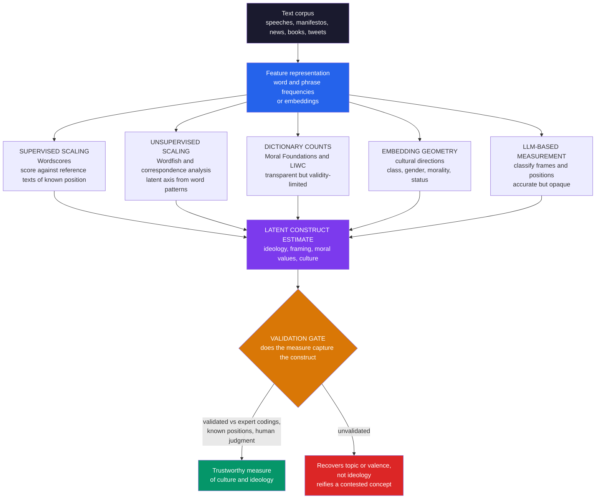

# 🧭 Measuring Culture and Ideology from Text

> [!abstract] TL;DR
> **Measuring culture and ideology from text** uses computational text analysis to turn the **words people choose** — their vocabulary, framing, and emphasis — into **quantitative measures of latent political and cultural constructs**: left-right ideology, moral values, framing, identity, and cultural dimensions like class and gender. Its founding insight is that **ideology and culture are encoded in language**, not only in explicit arguments: partisans describe the *same* thing with *different* words ("estate tax" vs "death tax," "undocumented immigrant" vs "illegal alien," "pro-choice" vs "pro-abortion"), so word usage is a measurable **fingerprint of belief**. The workhorse is **ideological scaling** — placing texts, politicians, or media on a latent dimension from word frequencies, via **supervised Wordscores** (score unknown texts against reference texts of known position), **unsupervised Wordfish** (a Poisson item-response model that recovers a latent axis with no references), or **embedding-based** methods. These tools measure **partisanship and its rise** (Gentzkow–Shapiro–Taddy), **media slant**, and growing **linguistic polarization**; **Moral Foundations** dictionaries and the embedding-derived **"geometry of culture"** (Kozlowski–Taddy–Evans) measure moral rhetoric and cultural dimensions; and **diachronic** methods track how ideology and values shift across decades. Because these are subtle, contested, **latent** constructs, rigorous **validation** against expert codings, known positions, and human judgment is paramount — making text-based measurement a flagship, high-impact application of computational social science across political science, cultural sociology, media studies, and computational history.

---

## Intuition

**Analogy:** You can often tell someone's politics from a single sentence — not from *what* they argue but from *which words* they choose. "Estate tax" or "death tax"? "Undocumented immigrant" or "illegal alien"? "Climate change" or "climate crisis"? "Pro-choice" or "pro-abortion"? Nobody had to state their position; the **vocabulary already gave it away**. The same is true of culture at large: whether a writer reaches for "duty," "sacred," and "tradition" or for "harm," "equality," and "rights" tells you which **moral world** they inhabit before they finish the paragraph. Ideology and culture live in language — encoded in **which words we pick, how we frame, and what we emphasize**.

Computational text analysis reads these tells **at scale**. It can place every politician, newspaper, or citizen on an ideological map from their words alone, track how a culture's values shift across a century of books, and measure the moral and cultural dimensions baked into everyday speech. The premise is simple and powerful: **language is the fingerprint of belief**, and fingerprints can be measured.

---

## How It Works

The task is a **measurement** problem in the exact sense of [[Measurement_and_Validity_in_Digital_Data]]: we have an abstract, unobservable **construct** (ideology, moral framing, culture) and only observable **text**, and we must build a valid bridge between them. Text-as-data offers a spectrum of bridges — the family of methods that the forthcoming sibling *Text_as_Data_in_Social_Science* surveys, alongside *Topic_Models_and_Document_Classification*, *Sentiment_Emotion_and_Stance_Analysis*, and *Word_Embeddings_and_Semantic_Change*.

### 1. Ideology in language — vocabulary and framing

The core insight predates computation: **George Lakoff** and pollster **Frank Luntz** showed that political battles are fought over *framing* — "death tax" versus "estate tax" is the same policy wearing two moral costumes, and whoever's frame wins the vocabulary wins the argument. Partisans systematically use **different words for the same referents**, and even neutral topic words get different **emphasis**. This is why word usage is an ideological signal: the *distribution* over a person's vocabulary encodes their position. (The cognitive machinery of framing and metaphor is the subject of [[Cognitive_Semantics_and_Metaphor]]; the reference-point psychology of framing is [[Reference_Dependence_and_Framing]].)

### 2. Ideological scaling — the workhorse

**Scaling** places texts, authors, or legislators on a latent **ideological dimension** (usually left-right) from their word usage — "ideal-point estimation from text." Two paradigms:

- **Supervised — Wordscores** (Laver, Benoit & Garry, 2003). Start from **reference texts** whose positions are *known* (e.g., party manifestos scored by experts). Each word gets a **score** = the position-weighted average of the reference texts it appears in. An unknown "virgin" text is then scored as the **frequency-weighted average of its words' scores**. Positions in, positions out — the method *transfers* a known scale onto new documents.
- **Unsupervised — Wordfish** (Slapin & Proksch, 2008). No references needed. Model each word count as **Poisson**: `log(λ_ij) = α_i + ψ_j + β_j · θ_i`, where `θ_i` is document `i`'s latent position, `β_j` is word `j`'s **discrimination** (how strongly it marks the axis), and `α_i`, `ψ_j` are document/word fixed effects. Estimating this **item-response model** recovers a latent dimension purely from word-frequency *patterns*. **Correspondence analysis** and taking the **first principal component** of the word-frequency matrix are close cousins that recover the same dominant axis.

The output is a number per document — where a speech, manifesto, newspaper, or politician **sits ideologically** — plus, crucially, the **discriminating words** (`β_j` or the axis loadings) that reveal *which vocabulary marks left versus right*.

### 3. Measuring partisanship and polarization

A landmark application: **Gentzkow, Shapiro & Taddy**, "Measuring Group Differences in High-Dimensional Choices," measure how **distinctive** partisan language is — and show it has **risen sharply**, a growing **linguistic polarization** in the U.S. Congress. The earlier **Gentzkow & Shapiro** media-slant work infers a **newspaper's ideology** from which phrases it uses that match Democratic versus Republican members. Text thereby becomes a **polarization sensor**, complementing the survey- and voting-based measures in [[Opinion_Dynamics_and_Polarization]] and [[Democratic_Backsliding_and_Polarization]].

### 4. Measuring moral and cultural dimensions

Beyond left-right:

- **Moral Foundations** (Jonathan Haidt; Graham et al.). Dictionaries count appeals to **care, fairness, loyalty, authority, sanctity** — and show that liberals lean on the *individualizing* foundations (care, fairness) while conservatives draw more evenly on the *binding* foundations (loyalty, authority, sanctity). The moral-psychology backbone is [[Moral_Psychology_and_Intuitions]].
- **The geometry of culture** (Kozlowski, Taddy & Evans, 2019). Word **embeddings** place concepts in a vector space; **cultural dimensions** — class, gender, morality, status — emerge as *directions* in that space (e.g., the "rich–poor" axis). Projecting a word onto a direction measures how it is **culturally positioned**. This is the embedding-based face of cultural sociology, and it connects to the embedding methods of [[Word2Vec]] and the forthcoming *Word_Embeddings_and_Semantic_Change*.

### 5. Tracking cultural and ideological change over time

The **historical** dimension: measure how ideology, values, and framing shift across decades from corpora of congressional speech, newspapers, and books (Google Ngrams, **diachronic embeddings**). Studies trace the rise of partisan language, shifting moral rhetoric, and changing attitudes toward gender and race — a **computational history of ideas** that links to the forthcoming *Cultural_Evolution_and_Historical_Dynamics* and cliodynamics. Text is a **record of cultural change**.

### 6. The methods spectrum and the validity imperative



The toolkit runs from **dictionary/word-count** methods (Moral Foundations, LIWC — simple, transparent, but brittle across domains and languages), through **scaling** models (Wordscores, Wordfish), **embedding**-based cultural measurement, **supervised classification** of frames, to **LLM-based** measurement (the forthcoming *Large_Language_Models_in_Social_Science*) — trading interpretability against accuracy. But the **cardinal concern** cutting across all of them is **validity**: measuring latent, contested constructs from text is hard, and every estimate must be validated against **expert codings, known positions** (e.g., legislator scores from roll-call votes), **survey measures**, or **human judgment**. Unvalidated, an unsupervised scaler can recover a dimension that **is not ideology at all** — it may pick up *topic* or *valence* — and a dictionary can silently fail to travel across domains. Validity is paramount for these subtle constructs.

---

## Key Concepts

### Secondary Level

Imagine two politicians giving speeches about the *same* new tax. One keeps saying **"death tax," "burden," "family farm."** The other keeps saying **"estate tax," "fair share," "the wealthiest."** You do not need to be told who is on the left and who is on the right — **the words already told you.** That is the whole idea: your **word choices** leak your side.

A computer can do this for thousands of speeches at once. It counts which words each speaker uses a lot, notices that some words cluster with "left" speakers and others with "right" speakers, and then **places every speaker on a line** from left to right — using nothing but their vocabulary. It can also count "caring" words (*harm, protect, equal*) versus "duty" words (*loyal, sacred, tradition*) to measure someone's **moral style**, and it can read a century of old books to watch how a culture's values **changed over time**. The one big catch: you have to **check** that the machine really found *ideology* and not just *what topic* people were talking about.

### Undergraduate Level

**Word usage as an ideological signal.** Represent each document as a vector of word (or phrase) frequencies. Partisans of opposite stripes produce **systematically different** vectors even on the same topic — the empirical fact that makes scaling possible.

**Wordscores (supervised).** Given reference documents with known positions `p_r`, each word `j` gets a score `s_j = Σ_r P(r | j) · p_r`, where `P(r | j)` is how concentrated word `j` is in reference `r`. A new document's position is the **frequency-weighted mean** of its words' scores. Simple, transparent, and only as good as the reference anchors.

**Wordfish (unsupervised).** A Poisson item-response model, `y_ij ~ Poisson(λ_ij)` with `log λ_ij = α_i + ψ_j + β_j θ_i`. The estimated `θ_i` are document positions; the `β_j` are **word discrimination parameters** whose sign and magnitude identify **which words mark which pole**. No reference texts required — but the recovered axis must be **interpreted and validated**, because the model has no idea whether its dominant dimension is ideology or something else.

**Dictionary methods.** Moral Foundations Dictionary and LIWC score text by **counting words** in predefined categories. Transparent and fast, but they miss negation, sarcasm, and context, and often **do not transport** across genres, eras, or languages.

**The geometry of culture.** In an embedding space, a **cultural dimension** is the vector between antonymous anchors (e.g., `v(rich) − v(poor)`). Projecting a word onto it measures its cultural position — e.g., which occupations are coded "affluent," how gendered a trait word is.

**Validation.** Correlate text-based positions with **external gold standards**: DW-NOMINATE scores from roll-call votes, expert manifesto codings (the Comparative Manifesto Project), or hand-labeled frames. Report the correlation; a scaling that does not track *any* known position is measuring something else.

### Graduate Level

**Identification and the "what dimension is it?" problem.** Unsupervised scaling recovers the axis of **maximum systematic variation** in word use. There is no guarantee this axis is *ideology*; it can be **topic, genre, valence, or time**. Wordfish's `θ` is identified only up to sign and scale, and its substantive meaning must be pinned down **post hoc** by inspecting high-`β_j` words and by external validation. This is a construct-validity problem in the sense of [[Measurement_and_Validity_in_Digital_Data]]: reliability (a stable, reproducible axis) does **not** imply validity (that the axis is the intended construct).

**Poisson scaling and its assumptions.** Wordfish assumes conditional independence of word counts given `θ` and a single latent dimension. Violations — multidimensional ideology, topic confounding, overdispersion — bias positions. Multidimensional and topic-aware extensions (e.g., structural topic models, or scaling within topic strata) address these but add researcher degrees of freedom.

**High-dimensional partisanship and the finite-sample trap.** Gentzkow, Shapiro & Taddy formalize a subtle pitfall: naïve estimates of how *distinctive* partisan speech is are **upward-biased in finite samples** — with a huge vocabulary and limited data, groups look more different than they are simply from sampling noise. Their penalized multinomial-logit estimator corrects this, and only *after* correction does the true trajectory of rising congressional polarization emerge. Measuring "group differences in high-dimensional choices" is a **statistics problem**, not just a counting exercise.

**Embeddings and cultural inference.** Kozlowski et al. show cultural dimensions are stable, survey-validated, and semantically composable in embedding space, but the method inherits embeddings' pathologies: **corpus bias**, sensitivity to training window and algorithm, and the difficulty of separating *cultural association* from *mere co-occurrence*. Diachronic embeddings must further handle **alignment** across time slices (Procrustes rotation) before "semantic change" is measurable rather than artefactual.

**LLMs as measurement instruments.** Zero-/few-shot LLM classification of ideology or frames is accurate and flexible but **opaque and non-stationary** (model updates change the instrument), raising the same construct-validity and drift concerns, now with a black box in the loop. Best practice treats the LLM as a coder to be **validated against human labels**, with reported reliability.

**Reification risk.** The deepest hazard is conceptual: "ideology," "morality," and "culture" are **contested**, multidimensional, and historically situated. Collapsing them onto a single measured number can **reify** a scholarly convenience into a false natural kind. Good practice states the construct explicitly, validates the measure, and reports what the number does and does not capture.

---

## Python Demo

```python
# Measuring ideology and culture from text (numpy + matplotlib only).
#
# PART A -- IDEOLOGICAL SCALING:
#   Generate synthetic "speeches" whose word usage tilts left/right according to
#   a KNOWN latent ideology. Recover a latent LEFT-RIGHT axis from word
#   frequencies alone (a Wordfish/correspondence-analysis-style unsupervised
#   scaling = first principal component of the relative-frequency matrix).
#   Show (1) the recovered ordering matches the known ideology, and
#        (2) the most DISCRIMINATING words that mark left vs right.
#
# PART B -- FRAMING / CULTURAL MEASUREMENT:
#   (b1) Moral Foundations: score docs on INDIVIDUALIZING (care/fairness) vs
#        BINDING (loyalty/authority/sanctity) word use; recover the Haidt
#        pattern (left leans individualizing, right leans binding).
#   (b2) Cultural change over time: track a "crisis-framing" measure across
#        decades of synthetic corpora -- diachronic cultural measurement.
import numpy as np
import matplotlib
matplotlib.use("Agg")
import matplotlib.pyplot as plt

rng = np.random.default_rng(7)

# ------------------------------------------------------------------
# PART A: vocabulary with KNOWN latent polarity, then generate docs
# ------------------------------------------------------------------
left_words  = ["inequality", "workers", "healthcare", "climate",
               "undocumented", "reproductive", "affordable", "communities"]
right_words = ["freedom", "taxes", "border", "traditional",
               "faith", "liberty", "regulation", "unborn"]
neutral     = ["people", "country", "future", "policy", "government", "families"]

vocab = left_words + right_words + neutral
V = len(vocab)
n_left, n_right = len(left_words), len(right_words)

# word polarity: -1 marks LEFT, +1 marks RIGHT, 0 neutral (the ground truth)
polarity = np.array([-1.0] * n_left + [1.0] * n_right + [0.0] * len(neutral))
base = np.full(V, 2.2)                       # baseline log word-rate
base[n_left + n_right:] = 2.8                # neutral words are more frequent

D = 60                                        # number of documents / speakers
theta_true = rng.uniform(-1.0, 1.0, D)        # each doc's TRUE left-right position
gamma = 1.4                                    # how strongly ideology tilts word use

counts = np.zeros((D, V))
for i in range(D):
    log_rate = base + gamma * polarity * theta_true[i]   # right doc -> more right words
    counts[i] = rng.poisson(np.exp(log_rate))

# --- Unsupervised scaling: first principal component of relative frequencies ---
rel = counts / counts.sum(axis=1, keepdims=True)          # doc-level word shares
Xc = rel - rel.mean(axis=0, keepdims=True)                # center columns
U, S, Vt = np.linalg.svd(Xc, full_matrices=False)
theta_hat = U[:, 0] * S[0]                                 # recovered doc positions
word_load = Vt[0]                                          # word loadings on the axis

# fix sign so the recovered axis points the same way as the truth
if np.corrcoef(theta_hat, theta_true)[0, 1] < 0:
    theta_hat, word_load = -theta_hat, -word_load
theta_hat = (theta_hat - theta_hat.mean()) / theta_hat.std()   # z-score for display
r_recover = np.corrcoef(theta_hat, theta_true)[0, 1]

# most discriminating words = largest |loading| on the recovered axis
order = np.argsort(word_load)
disc_idx = np.concatenate([order[:6], order[-6:]])         # 6 left-marking, 6 right

# ------------------------------------------------------------------
# PART B1: Moral Foundations framing (individualizing vs binding)
# ------------------------------------------------------------------
individ = ["care", "harm", "protect", "equal", "fair", "justice", "rights"]
binding = ["loyal", "duty", "tradition", "sacred", "order", "honor", "obey"]
mvocab = individ + binding
mpol = np.array([-1.0] * len(individ) + [1.0] * len(binding))  # -1 indiv, +1 binding
mcounts = np.zeros((D, len(mvocab)))
for i in range(D):
    lr = 1.6 + 1.1 * mpol * theta_true[i]     # right docs use more binding words
    mcounts[i] = rng.poisson(np.exp(lr))
mrel = mcounts / mcounts.sum(axis=1, keepdims=True)
indiv_share = mrel[:, :len(individ)].sum(axis=1)
bind_share  = mrel[:, len(individ):].sum(axis=1)
left_mask, right_mask = theta_true < 0, theta_true >= 0

# ------------------------------------------------------------------
# PART B2: cultural change over time (diachronic "crisis-framing" measure)
# ------------------------------------------------------------------
decades = np.arange(1920, 2030, 10)
crisis_share = []
for dec in decades:
    intensity = (dec - 1920) / (2020 - 1920)          # framing intensifies over century
    crisis = rng.poisson(np.exp(1.0 + 2.0 * intensity), 40)
    other  = rng.poisson(np.exp(3.0), 40)
    crisis_share.append((crisis / (crisis + other)).mean())
crisis_share = np.array(crisis_share)

# ------------------------------- REPORT --------------------------------
print("=" * 64)
print("MEASURING IDEOLOGY AND CULTURE FROM TEXT")
print("=" * 64)
print(f"[A] recovered scaling vs TRUE ideology: r = {r_recover:.3f}")
print("    top RIGHT-marking words:",
      [vocab[k] for k in order[-4:][::-1]])
print("    top LEFT-marking  words:",
      [vocab[k] for k in order[:4]])
print(f"[B1] mean individualizing share  left={indiv_share[left_mask].mean():.2f}"
      f"  right={indiv_share[right_mask].mean():.2f}")
print(f"     mean binding share          left={bind_share[left_mask].mean():.2f}"
      f"  right={bind_share[right_mask].mean():.2f}")
print(f"[B2] crisis-framing share {decades[0]}s={crisis_share[0]:.2f}"
      f" -> {decades[-1]}s={crisis_share[-1]:.2f}")

# ------------------------------- FIGURE --------------------------------
fig, ax = plt.subplots(2, 2, figsize=(15, 10))
fig.suptitle("Measuring Culture and Ideology from Text: scaling, "
             "discriminating words, moral framing, cultural change",
             fontsize=14, fontweight="bold")

# (A) recovered position vs known ideology
sc = ax[0, 0].scatter(theta_true, theta_hat, c=theta_true, cmap="coolwarm",
                      s=45, edgecolor="black", linewidth=0.4)
ax[0, 0].set_title(f"(A) Recovered scaling matches known ideology\n"
                   f"correlation r = {r_recover:.2f}", fontsize=11)
ax[0, 0].set_xlabel("TRUE ideology  (left  <-->  right)")
ax[0, 0].set_ylabel("RECOVERED position from words alone")
ax[0, 0].axhline(0, color="grey", lw=0.6, ls=":")
ax[0, 0].axvline(0, color="grey", lw=0.6, ls=":")
ax[0, 0].grid(alpha=0.2)

# (B) discriminating words on the recovered axis
words_sel = [vocab[k] for k in disc_idx]
loads_sel = word_load[disc_idx]
colors = ["#dc2626" if v > 0 else "#2563eb" for v in loads_sel]
ax[0, 1].barh(range(len(disc_idx)), loads_sel, color=colors, edgecolor="black")
ax[0, 1].set_yticks(range(len(disc_idx)))
ax[0, 1].set_yticklabels(words_sel, fontsize=9)
ax[0, 1].axvline(0, color="black", lw=0.8)
ax[0, 1].set_title("(B) Most discriminating words\n"
                   "blue marks LEFT, red marks RIGHT", fontsize=11)
ax[0, 1].set_xlabel("loading on recovered ideological axis")
ax[0, 1].grid(alpha=0.2, axis="x")

# (C) moral foundations: individualizing vs binding, by side
grp = ["Individualizing\n(care, fairness)", "Binding\n(loyalty, authority)"]
left_vals  = [indiv_share[left_mask].mean(),  bind_share[left_mask].mean()]
right_vals = [indiv_share[right_mask].mean(), bind_share[right_mask].mean()]
xpos = np.arange(2)
ax[1, 0].bar(xpos - 0.18, left_vals,  width=0.36, color="#2563eb", label="left docs")
ax[1, 0].bar(xpos + 0.18, right_vals, width=0.36, color="#dc2626", label="right docs")
ax[1, 0].set_xticks(xpos)
ax[1, 0].set_xticklabels(grp, fontsize=9)
ax[1, 0].set_ylabel("mean share of moral word use")
ax[1, 0].set_title("(C) Moral-foundations framing\n"
                   "left leans individualizing, right leans binding", fontsize=11)
ax[1, 0].legend(fontsize=9)
ax[1, 0].grid(alpha=0.2, axis="y")

# (D) cultural change over time
ax[1, 1].plot(decades, crisis_share, marker="o", color="#7c3aed", lw=2)
ax[1, 1].fill_between(decades, crisis_share, alpha=0.15, color="#7c3aed")
ax[1, 1].set_title("(D) Tracking cultural change from text\n"
                   "rise of a 'crisis' framing across decades", fontsize=11)
ax[1, 1].set_xlabel("decade")
ax[1, 1].set_ylabel("share of crisis-framing vocabulary")
ax[1, 1].grid(alpha=0.2)

plt.tight_layout(rect=[0, 0, 1, 0.94])
plt.savefig("measuring_culture_and_ideology_from_text.png", dpi=110,
            bbox_inches="tight")
plt.show()
```

**What the demo shows:**

- **Panel (A) — scaling works.** Feeding *only* word frequencies into an unsupervised scaler (the first principal component of the relative-frequency matrix, a correspondence-analysis / Wordfish-style method) recovers document positions that correlate near `r ≈ 0.9` with the **known** left-right ideology. Nobody labeled the documents; the axis fell out of the vocabulary. This is the empirical heart of ideological scaling — and the console shows the recovery correlation.
- **Panel (B) — the discriminating words.** The word loadings on the recovered axis reveal *which vocabulary marks which pole*: "taxes," "border," "faith," "liberty" load right; "inequality," "healthcare," "climate," "workers" load left; neutral words sit near zero. This is exactly the interpretable output (`β_j`) that lets a researcher **check** the axis is ideology and not topic.
- **Panel (C) — moral framing.** Scoring the same speakers on **Moral Foundations** vocabulary reproduces the Haidt/Graham pattern: left documents lean on **individualizing** words (care, fairness), right documents draw more on **binding** words (loyalty, authority, sanctity) — culture measured by counting.
- **Panel (D) — cultural change.** A diachronic measure — the share of "crisis-framing" vocabulary — rises across decades, illustrating how text corpora become a **record of cultural and rhetorical change** over time.

Every claim is quantitative: run it and read the console for the recovery correlation, the top discriminating words, and the moral-framing shares.

---

## Real-World Applications

> **Political science — legislator, party, and media ideology at scale.** Wordscores and Wordfish position party **manifestos** and **legislative speech** on a left-right scale, validated against expert codings and DW-NOMINATE vote-based scores; the results underpin research on [[Political_Parties_and_Party_Systems]] and connect to how positions form in [[Public_Opinion_and_Political_Socialization]] and [[Political_Psychology_and_Ideology]].

> **Measuring polarization.** Gentzkow–Shapiro–Taddy's corrected estimates show U.S. **congressional speech grew far more partisan** from the 1990s onward — a text-based polarization measure that complements the survey- and network-based diagnoses in [[Opinion_Dynamics_and_Polarization]] and [[Democratic_Backsliding_and_Polarization]].

> **Media slant and bias.** Inferring a newspaper's or channel's ideology from **which phrases** it borrows from each party (Gentzkow & Shapiro) quantifies media bias empirically — the applied core of [[Media_Propaganda_and_Political_Communication]] and [[Media_Culture_and_Cultural_Industries]].

> **Cultural sociology.** The **geometry of culture** measures how class, gender, and morality are encoded in language across corpora and eras — operationalizing the intangibles of [[Culture_Norms_Values_and_Ideology]] and giving cultural sociology a computational instrument.

> **Computational history and cliodynamics.** Diachronic embeddings and Ngram-scale corpora track ideology, values, and attitudes across **centuries** — the rise of rights language, shifting moral rhetoric, changing gender and race attitudes — the concern of the forthcoming *Cultural_Evolution_and_Historical_Dynamics*.

> **Misinformation and propaganda analysis.** Framing and moral-rhetoric measures help detect persuasion, propaganda, and coordinated messaging, feeding platform-integrity and information-ecosystem research.

---

## Common Pitfalls

- **Recovering a dimension that is not ideology.** Unsupervised scaling captures the axis of *maximum* systematic word variation, which can be **topic, genre, valence, or time** rather than left-right. Always inspect the discriminating words and validate against a known scale before calling `θ` "ideology."
- **Trusting dictionaries out of context.** Moral Foundations and LIWC count words but ignore **negation, sarcasm, irony, and quotation** ("I would *never* say *estate tax*") and often **do not transport** across genres, eras, or languages. A dictionary validated on op-eds may be invalid on tweets.
- **Skipping validation entirely.** A scaling with no external check is an unfalsifiable story. Validate against **expert codings, roll-call scores, survey measures, or human labels** — the discipline of [[Measurement_and_Validity_in_Digital_Data]]. Reliability (a stable axis) is not validity (the *right* axis).
- **Ignoring the finite-sample bias in "distinctiveness."** With huge vocabularies and limited text, groups look more different than they are from sampling noise alone. Naïve partisanship measures are **upward-biased**; use penalized/regularized estimators (Gentzkow–Shapiro–Taddy) before claiming rising polarization.
- **Reifying a contested construct.** Collapsing "ideology," "morality," or "culture" onto a single number can turn a scholarly convenience into a false natural kind. State the construct, report what the measure captures, and resist treating the number as the thing itself.
- **Embedding artefacts read as culture (or change).** Corpus bias, training-window sensitivity, and unaligned time slices can manufacture spurious "cultural positions" or "semantic change." Align diachronic embeddings (Procrustes) and validate cultural dimensions against surveys before interpreting them.
- **Sampling bias in the corpus.** Scaling *who writes/speaks*, not *the population*: op-ed writers, tweeters, and floor-speech-givers are unrepresentative. The measure inherits the corpus's selection, a population-validity limit on every claim.

---

## Related Concepts

**This section and vault (Computational Social Science):**

- [[Measurement_and_Validity_in_Digital_Data]] — the measurement backbone; text-based ideology is a latent-construct measurement problem, and validity is its cardinal concern.
- [[Opinion_Dynamics_and_Polarization]] — the modeling side of polarization; text measures supply the empirical polarization signal these models try to explain.
- [[Computational_Social_Science_Overview]] — the parent field; measuring culture and ideology from text is a flagship text-as-data application within it.
- [[Social_Network_Analysis_Foundations]] — the complementary structural approach; ideology is also inferred from follow/retweet networks, not only words.
- [[Culture_Dissemination_and_Social_Influence_Models]] — how the cultural traits measured here spread and change through a population.

*Forthcoming siblings in this Text-as-Data section (referenced in prose):* **Text as Data in Social Science** (the umbrella), **Topic Models and Document Classification**, **Sentiment, Emotion, and Stance Analysis**, **Word Embeddings and Semantic Change**, **Large Language Models in Social Science**, and **Cultural Evolution and Historical Dynamics**.

**Political substance and communication:**

- [[Political_Psychology_and_Ideology]] — what ideology *is* psychologically; text measures operationalize it at scale.
- [[Media_Propaganda_and_Political_Communication]] — media slant, framing, and bias, measured from phrase usage.
- [[Democratic_Backsliding_and_Polarization]] — the political stakes of the rising linguistic polarization text analysis detects.
- [[Public_Opinion_and_Political_Socialization]] — where the opinions and vocabularies being measured come from.
- [[Political_Parties_and_Party_Systems]] — manifestos and party positions are the canonical objects of ideological scaling.

**Culture, cognition, and framing:**

- [[Culture_Norms_Values_and_Ideology]] — the cultural-sociology construct that the geometry-of-culture methods operationalize.
- [[Media_Culture_and_Cultural_Industries]] — culture produced and circulated through media, a prime measurement corpus.
- [[Moral_Psychology_and_Intuitions]] — Moral Foundations theory, the basis of moral-rhetoric measurement.
- [[Cognitive_Semantics_and_Metaphor]] — Lakoff's framing and conceptual metaphor, the linguistic mechanism ideology rides on.
- [[Reference_Dependence_and_Framing]] — the reference-point psychology of why framing ("death tax" vs "estate tax") moves people.
- [[Confirmation_Bias_and_Motivated_Reasoning]] — why partisans encode and read the same words so differently.

**Methods and representation:**

- [[Word2Vec]] — the word-embedding method behind the "geometry of culture" and diachronic cultural measurement.
- [[Corpus_Linguistics]] — the corpus-based study of word usage that political-text scaling builds on.
- [[Discourse_Analysis]] — the qualitative counterpart to quantitative framing and vocabulary measurement.

---

## Review Questions

### Secondary

1. Give two everyday examples of the *same* thing described with *different* words by opposite sides (like "estate tax" vs "death tax"). Explain how a computer could use word choices like these to guess someone's politics.
2. A program reads thousands of speeches and puts each speaker on a line from left to right using only their words. What is one way the program could be **fooled** into measuring the wrong thing (for example, the *topic* instead of the *politics*)?
3. What does it mean to say liberals use more "caring" words and conservatives use more "duty/tradition" words? How could you check this by counting?

### Undergraduate

1. Contrast **Wordscores** (supervised) and **Wordfish** (unsupervised). What does each need as input, what does each output, and in what situation would you prefer one over the other?
2. Write down the Wordfish model `log λ_ij = α_i + ψ_j + β_j θ_i` and explain the role of each parameter. Which parameter tells you *which words mark which ideological pole*, and how would you use it to **validate** that the recovered axis is really ideology?
3. Explain the "geometry of culture." Given word embeddings, how would you construct a **gender** or **class** cultural dimension, and how would you measure where a particular word sits on it? Name one artefact that could make the result misleading.

### Graduate

1. You run Wordfish on a corpus of legislative speeches and obtain a clean one-dimensional `θ`. Describe a full **validation** protocol to establish that `θ` measures ideology rather than topic, valence, or time — including which external gold standards you would use and what a *failure* of validation would look like.
2. Gentzkow, Shapiro & Taddy argue that naïve measures of partisan "distinctiveness" are **upward-biased in finite samples**. Explain *why* high-dimensional vocabularies with limited data inflate apparent group differences, and how their penalized estimator corrects the trajectory of measured polarization. Why does this matter for the substantive claim that Congress has polarized?
3. Critically assess the claim that text-based measures reveal "the ideology" or "the culture" of a group. Discuss **construct validity**, the **reification** risk, corpus **sampling bias**, and the trade-off between interpretable dictionary/scaling methods and accurate-but-opaque LLM-based measurement. What would a methodologically responsible measurement study report?

---

## Sources

- [Slapin, J. B. & Proksch, S.-O. (2008). "A Scaling Model for Estimating Time-Series Party Positions from Texts." *American Journal of Political Science* 52(3), 705–722](https://doi.org/10.1111/j.1540-5907.2008.00338.x)
- [Laver, M., Benoit, K. & Garry, J. (2003). "Extracting Policy Positions from Political Texts Using Words as Data." *American Political Science Review* 97(2), 311–331](https://doi.org/10.1017/S0003055403000698)
- [Gentzkow, M., Shapiro, J. M. & Taddy, M. (2019). "Measuring Group Differences in High-Dimensional Choices: Method and Application to Congressional Speech." *Econometrica* 87(4), 1307–1340](https://doi.org/10.3982/ECTA16566)
- [Kozlowski, A. C., Taddy, M. & Evans, J. A. (2019). "The Geometry of Culture: Analyzing the Meanings of Class through Word Embeddings." *American Sociological Review* 84(5), 905–949](https://doi.org/10.1177/0003122419877135)
- [Graham, J., Haidt, J. & Nosek, B. A. (2009). "Liberals and Conservatives Rely on Different Sets of Moral Foundations." *Journal of Personality and Social Psychology* 96(5), 1029–1046](https://doi.org/10.1037/a0015141)
- [Grimmer, J., Roberts, M. E. & Stewart, B. M. (2022). *Text as Data: A New Framework for Machine Learning and the Social Sciences*. Princeton University Press](https://press.princeton.edu/books/hardcover/9780691207544/text-as-data)

---

#computational-social-science #ideology-measurement #political-text #framing #culture
