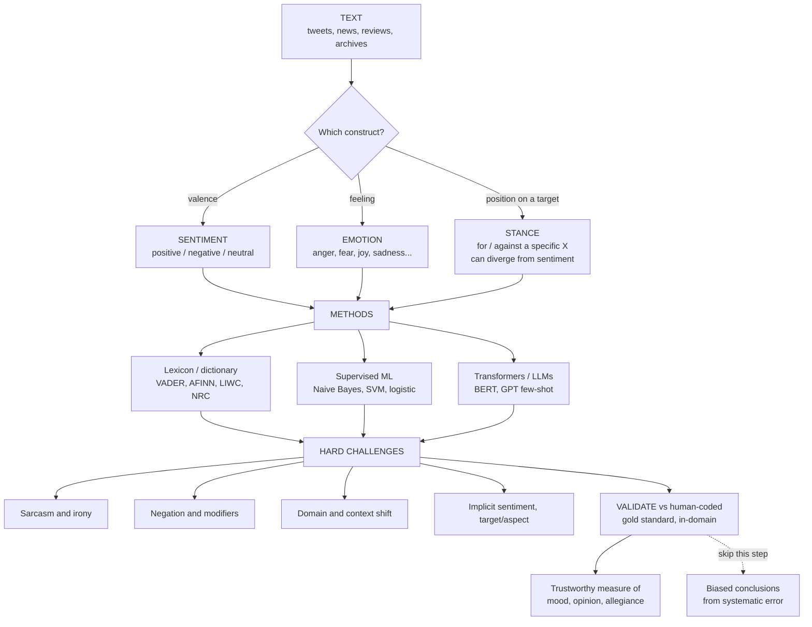

# 🌡️ Sentiment, Emotion, and Stance Analysis

> [!abstract] TL;DR
> **Sentiment, emotion, and stance analysis** are computational methods that turn subjective language into *quantitative measures of affect, feeling, and allegiance* — reading mood, opinion, and position from text at massive scale. They are among computational social science's most **popular** tools (social media as a mood sensor for elections, crises, markets, and history) and among its most **over-used and treacherous**. Three cautions dominate. **First, they measure three different things** that are constantly confused: **sentiment** is *valence* (favorable/unfavorable — positive/negative/neutral), **emotion** is a *discrete feeling* (anger, fear, joy, sadness, disgust, surprise — Ekman's basic emotions, or dimensional valence–arousal), and **stance** is the author's *position for or against a specific target* — which can diverge sharply from sentiment ("I'm **furious** that they might ban abortion" is *negative* sentiment but *pro-choice* stance). **Second, language is genuinely hard**: sarcasm, negation, context- and domain-dependence, and implicit sentiment defeat naive lexicon/dictionary methods, so measures are often **unvalidated proxies** whose *systematic* errors can bias conclusions. **Third, accuracy depends critically on method and domain** — from crude word-counting (VADER, AFINN, LIWC, NRC) through supervised classifiers to context-aware transformers and LLMs (each with its own new pitfalls) — so **rigorous validation against a human-coded gold standard in the specific domain is non-negotiable.**

---

## Intuition

**Analogy — taking a nation's emotional temperature.** Imagine you could take the emotional temperature of an entire country, minute by minute, by reading its tweets: spotting the collective *dread* building before an election, the *grief* pouring out after a tragedy, the *euphoria* of a last-minute World Cup goal. Sentiment analysis promises exactly this — to measure the moods, opinions, and allegiances hidden in text at a scale no army of human readers could ever match. Point a thermometer at the crowd and read off the number.

But language is a slippery thing, and this thermometer is easily fooled. "This movie was **SO good** I nearly fell asleep" drips with sarcasm that no word-counter catches — it scores glowingly positive while meaning the opposite. "**Not** good" and "**hardly** terrible" flip their own valence, yet a dictionary that just tallies words gets them exactly backwards. And "**sick**" means *terrible* or *wonderful* depending on the year, the domain, and the speaker. Reading the emotional mind of a crowd is powerful, seductive, and full of traps — a measurement problem dressed up as a text problem. The whole discipline of doing it *well* is the discipline of knowing when your thermometer is lying.

---

## How It Works

### The three constructs (do not conflate them)

The single most important conceptual move is to keep three different questions apart. They are measured differently, they can *disagree*, and treating one as another is a classic source of invalid conclusions.

1. **Sentiment — valence / polarity.** *"Is this favorable or unfavorable?"* A one-dimensional scale from negative through neutral to positive. The workhorse of product reviews and "market mood."
2. **Emotion — discrete feeling.** *"What feeling is expressed?"* Categorical labels from **Ekman's basic emotions** (anger, fear, joy, sadness, disgust, surprise — see [[Emotion_Theories]]) or a **dimensional** model (valence × arousal). Anger and sadness are both "negative" sentiment but are socially and politically very different (anger mobilizes; sadness withdraws).
3. **Stance — position toward a target.** *"Does this text support or oppose **X**?"* Stance is defined *relative to a proposition or entity*, and it is **crucially different from sentiment**. "I'm **furious** that they might ban abortion" is negative in sentiment (fury) but its stance is **pro-choice / against the ban**. A campaign tweet can be gleefully positive in tone yet *against* your candidate ("Can't wait to watch him lose!"). Confusing stance with sentiment silently mislabels half your data.

### The method toolkit (word-counting → context)

There is a clear historical progression, each rung trading transparency for accuracy:

1. **Lexicon / dictionary methods.** Count words against a pre-built sentiment or emotion word-list: **VADER** (social-media-tuned, handles some negation/boosters/emoji), **AFINN** (integer valences −5…+5), **LIWC** (psychometric categories), and the **NRC Emotion Lexicon (EmoLex)** for discrete emotions. *Transparent, reproducible, needs no training data* — the classic social-science approach. But **crude**: it is context-blind, so sarcasm, negation, and domain shift defeat it. Validity-limited by construction.
2. **Supervised machine learning.** Train a classifier ([[Naive_Bayes]], SVM, logistic regression, or neural nets) on human-labeled examples. *More accurate and can learn domain-specific patterns* — but it **needs labeled data** and is only as good as its training domain (a model trained on movie reviews measures political emotion badly).
3. **Transformers and LLMs.** Contextual models — [[BERT]] and the [[Transformer_Architecture]] family, or generative LLMs from the [[GPT_Family]] — read whole sentences in context, handling **negation and some sarcasm** far better, and support **zero-/few-shot** annotation with no task-specific training set. State of the art — but they introduce *new* validity problems (prompt sensitivity, hallucination, embedded bias, non-reproducibility).

### The hard challenges (why it is treacherous)

- **Sarcasm and irony** — "great, another Monday" is literally positive, actually negative. Pervasive on social media and very hard even for strong models.
- **Negation and modifiers** — "not good," "hardly terrible," "no longer sad" flip or scale valence; count-based dictionaries fail systematically.
- **Context / domain dependence** — a word's valence depends on the domain: "**unpredictable**" is bad for a car, good for a movie; slang and emoji drift year to year.
- **Implicit sentiment** — negative meaning with *no* negative words ("the battery lasted about an hour").
- **Target / aspect** — sentiment toward **what?** "Great camera, terrible battery" is positive *and* negative — this is **aspect-based sentiment analysis**.
- **Subjective ground truth** — humans disagree on labels (inter-annotator agreement is often modest), so even the "true" label is noisy.

### The validity crisis

Because the challenges above are real, off-the-shelf sentiment scores are frequently **unvalidated proxies** with poor accuracy on the *actual* construct in the *actual* domain — yet they are reported as if valid. The danger is not random error (which merely adds noise) but **systematic error that correlates with the variable of interest**, which *biases* the conclusion. If a classifier under-detects anger in a group you are comparing, your finding is an artifact of the tool. The imperative — the theme of the companion note *Measurement_and_Validity_in_Digital_Data* — is to **validate against a human-coded gold standard in the specific domain**, report accuracy/F1 and error structure, and never assume "off-the-shelf sentiment measures what you think."



---

## Key Concepts

**Secondary (plain-language).** Sentiment analysis is a computer trying to guess the *feeling* behind writing — is this happy or angry, for or against? It works by looking at the words: "love," "amazing," "best" push positive; "hate," "terrible," "worst" push negative. That works surprisingly often at large scale, but the computer has no sense of humor, so "great, another Monday" fools it completely. Sentiment (happy vs. sad), emotion (which feeling exactly), and stance (whose side are you on) are three different questions, and the computer must be checked against real humans before you trust its numbers.

**Undergraduate.** Three constructs: **sentiment** (valence: positive/negative/neutral), **emotion** (discrete categories per Ekman, or valence–arousal dimensions), and **stance** (support/oppose a target — orthogonal to sentiment). Three method families: **lexicon-based** (bag-of-words dictionary scoring — VADER/AFINN/LIWC/NRC; transparent, zero training data, context-blind), **supervised** (train [[Naive_Bayes]]/SVM/logistic on labeled data; domain-specific), and **contextual** ([[BERT]]/[[GPT_Family]]; handle negation and context, few-/zero-shot). Core failure modes: sarcasm, negation, domain shift, implicit sentiment, and aspect/target attribution. Evaluation uses accuracy, precision/recall/**F1**, and inter-annotator agreement (Krippendorff's α) on a held-out human-coded set. Pipeline preliminaries — tokenization and normalization — are covered in [[Text_Preprocessing]].

**Graduate.** The central issue is **measurement validity**, not classifier accuracy in the abstract. (i) *Construct validity*: does your instrument measure the intended construct, or a correlate? A generic sentiment model applied to political text may be measuring *tone* while you claim to measure *affective polarization*. (ii) *Systematic vs. random error*: random misclassification attenuates estimates (regression toward the null), but error **correlated with the treatment/group of interest** produces spurious effects — the dangerous case. (iii) *Domain transfer*: performance degrades sharply off-distribution; report in-domain gold-standard metrics, not the tool's published benchmark. (iv) *LLM-as-annotator*: zero-shot LLM labeling can match or beat crowd workers on some tasks, but is **prompt-sensitive, biased, and non-deterministic**, risking that you "measure the LLM's biases" rather than the world's opinion; treat the LLM as a coder to be *validated against humans*, and report reproducibility. (v) *Representativeness*: even a perfect classifier on a **non-representative** corpus (Twitter ≠ the electorate) yields a biased population estimate — a sampling problem stacked on top of the measurement problem. These threads run through the sibling notes *Text_as_Data_in_Social_Science* (the parent overview), *Topic_Models_and_Document_Classification*, *Word_Embeddings_and_Semantic_Change* (how "sick" changes valence over time), *Large_Language_Models_in_Social_Science*, *Measuring_Culture_and_Ideology_from_Text*, and *Measurement_and_Validity_in_Digital_Data*.

---

## Python Demo

This demo does two things. **(a)** It builds a tiny AFINN/VADER-style **lexicon scorer** and tracks a synthetic *collective mood* over 30 days, recovering a "tragedy" shock at day 15 — showing sentiment analysis *works* in clean conditions. **(b)** It then breaks the lexicon on **hard cases** (sarcasm, negation, domain-slang), shows the errors are *systematic*, and demonstrates that a **negation-aware** rule and then a **supervised context-aware classifier** progressively fix them — while **domain slang defeats every count-based method**, which is exactly why validation and contextual models matter.

```python
# Sentiment analysis: it works in clean conditions, and where it fails.
# numpy + matplotlib only.
import re
import numpy as np
import matplotlib.pyplot as plt

rng = np.random.default_rng(42)

# =====================================================================
# (a) LEXICON-BASED SENTIMENT -- a tiny AFINN/VADER-style word list
# =====================================================================
LEXICON = {
    # positive
    "good": 3, "great": 3, "love": 3, "happy": 3, "excellent": 4,
    "wonderful": 4, "amazing": 4, "best": 3, "win": 2, "victory": 3,
    "joy": 3, "hope": 2, "enjoyable": 2, "beautiful": 3,
    # negative
    "bad": -3, "terrible": -4, "hate": -3, "sad": -3, "awful": -4,
    "worst": -4, "horrible": -4, "loss": -2, "cry": -2, "fear": -2,
    "angry": -3, "death": -3, "tragedy": -4, "grief": -3, "disaster": -3,
    "sick": -2,          # <-- DOMAIN-DEPENDENT! slang "sick" = great
}
NEGATORS  = {"not", "no", "never", "hardly", "cannot", "without", "nor"}
SARC_CUES = {"asleep", "monday", "disaster"}   # crude irony red-flags

def tokenize(text):
    return re.findall(r"[a-z]+", text.lower().replace("n't", " not"))

def lexicon_score(text):
    "Context-blind bag-of-words: just sum the valences."
    return sum(LEXICON.get(w, 0) for w in tokenize(text))

def negation_aware_score(text, window=3):
    "Flip the valence of sentiment words within `window` tokens after a negator."
    toks, score, flip_until = tokenize(text), 0, -1
    for i, w in enumerate(toks):
        if w in NEGATORS:
            flip_until = i + window
            continue
        v = LEXICON.get(w, 0)
        if v and i <= flip_until:
            v = -v
        score += v
    return score

def sarcasm_flag(text):
    "Fires when a positive word co-occurs with an irony red-flag."
    toks = set(tokenize(text))
    return 1.0 if any(LEXICON.get(w, 0) > 0 for w in toks) and (toks & SARC_CUES) else 0.0

# ---- synthetic 30-day "collective mood" timeline with a shock -------
POS    = [w for w, v in LEXICON.items() if v > 0]
NEG    = [w for w, v in LEXICON.items() if v < 0 and w != "sick"]
FILLER = ["the", "today", "people", "match", "news", "everyone", "again"]

days  = np.arange(30)
event = 15
shock = np.where(days >= event, -4.0 * np.exp(-(days - event) / 4.0), 0.0)
latent_mood = 1.2 + shock                       # the TRUE underlying mood

def make_tweet(mood):
    p_pos, words = 1.0 / (1.0 + np.exp(-mood)), []
    for _ in range(int(rng.integers(4, 9))):
        if rng.random() < 0.4:
            words.append(rng.choice(FILLER))
        else:
            words.append(rng.choice(POS if rng.random() < p_pos else NEG))
    return " ".join(words)

daily_mean = np.array([
    np.mean([lexicon_score(make_tweet(latent_mood[d])) for _ in range(200)])
    for d in days
])

# =====================================================================
# (b) THE PITFALLS -- hard cases with TRUE human labels
# =====================================================================
hard_cases = [
    ("This movie was so good I nearly fell asleep",   "neg", "sarcasm"),
    ("Great, another Monday at the office",           "neg", "irony"),
    ("Wow, what a wonderful disaster this turned out", "neg", "sarcasm"),
    ("The food was not good at all",                  "neg", "negation"),
    ("I am not happy with this service",              "neg", "negation"),
    ("The ending was hardly terrible, I loved it",    "pos", "neg-of-neg"),
    ("The plot was not bad, actually quite enjoyable", "pos", "negation"),
    ("This concert was absolutely sick",              "pos", "domain slang"),
]
truth = [1 if lab == "pos" else 0 for _, lab, _ in hard_cases]

# ---- a supervised classifier on CONTEXT-AWARE features --------------
def features(text):
    return np.array([lexicon_score(text),
                     negation_aware_score(text),
                     sarcasm_flag(text)], float)

train = [
    ("i love this great win", 1), ("a wonderful and amazing day", 1),
    ("so happy the best victory", 1), ("beautiful and excellent hope", 1),
    ("this is bad and terrible", 0), ("awful horrible worst experience", 0),
    ("so sad full of grief", 0), ("angry about the tragedy and loss", 0),
    ("not good at all", 0), ("i am not happy", 0),
    ("this is not great", 0), ("not the best honestly", 0),
    ("not bad at all", 1), ("hardly terrible", 1), ("this is not a tragedy", 1),
    ("great another monday", 0), ("so good i fell asleep", 0),
    ("what a wonderful disaster", 0),
]
Xtr = np.array([features(t) for t, _ in train])
ytr = np.array([y for _, y in train], float)
mu, sd = Xtr.mean(0), Xtr.std(0) + 1e-9
Xn = np.hstack([(Xtr - mu) / sd, np.ones((len(Xtr), 1))])
w  = np.zeros(Xn.shape[1])
for _ in range(6000):                             # logistic regression, full-batch GD
    p = 1.0 / (1.0 + np.exp(-Xn @ w))
    w -= 0.3 * Xn.T @ (p - ytr) / len(ytr)

def supervised_pred(text):
    x = np.append((features(text) - mu) / sd, 1.0)
    return 1 if 1.0 / (1.0 + np.exp(-x @ w)) >= 0.5 else 0

to_label   = lambda s: 1 if s > 0 else 0          # score -> pos(1)/neg(0)
pred_naive = [to_label(lexicon_score(t))       for t, _, _ in hard_cases]
pred_neg   = [to_label(negation_aware_score(t)) for t, _, _ in hard_cases]
pred_sup   = [supervised_pred(t)                for t, _, _ in hard_cases]
acc  = lambda pr: np.mean([a == b for a, b in zip(pr, truth)])
accs = [acc(pred_naive), acc(pred_neg), acc(pred_sup)]

print(f"{'case':<14}{'truth':<7}{'naive':<7}{'+neg':<7}{'super':<7}")
for (t, lab, k), tr, a, b, c in zip(hard_cases, truth, pred_naive, pred_neg, pred_sup):
    ok = lambda x: "OK " if x == tr else "XX "
    print(f"{k:<14}{lab:<7}{ok(a):<7}{ok(b):<7}{ok(c):<7}")
print("accuracy:", dict(zip(["naive", "+negation", "supervised"], np.round(accs, 2))))

# =====================================================================
# PLOTS
# =====================================================================
z = lambda x: (x - x.mean()) / x.std()

# Figure 1: the collective-mood time series
fig1, ax = plt.subplots(figsize=(9, 4.2))
ax.plot(days, z(daily_mean),  "-o", color="#2c7fb8", label="Lexicon sentiment (z-scored)")
ax.plot(days, z(latent_mood), "--", color="gray",    label="True latent mood (z-scored)")
ax.axvline(event, color="crimson", ls=":", lw=2)
ax.annotate("tragedy strikes", xy=(event, -1.7), xytext=(event + 0.4, -1.7), color="crimson")
ax.set(title="Reading the collective mood: lexicon sentiment tracks a shock",
       xlabel="day", ylabel="sentiment (z-score)")
ax.legend(); fig1.tight_layout()

# Figure 2: the pitfall / failure analysis
fig2, (axL, axR) = plt.subplots(1, 2, figsize=(12, 4.6))
scores = [lexicon_score(t) for t, _, _ in hard_cases]
colors = ["seagreen" if p == tr else "crimson" for p, tr in zip(pred_naive, truth)]
y = np.arange(len(hard_cases))
axL.barh(y, scores, color=colors)
axL.axvline(0, color="k", lw=0.8)
axL.set_yticks(y); axL.set_yticklabels([k for _, _, k in hard_cases])
axL.invert_yaxis()
axL.set(title="Naive lexicon on hard cases\n(green = correct, red = WRONG vs truth)",
        xlabel="lexicon sentiment score")

axR.bar(["naive\nlexicon", "+ negation\nhandling", "supervised\ncontext model"],
        accs, color=["crimson", "orange", "seagreen"])
axR.set(ylim=(0, 1), ylabel="accuracy on hard cases",
        title="Context-awareness matters\n(domain slang still defeats count-based methods)")
for i, a in enumerate(accs):
    axR.text(i, a + 0.02, f"{a:.0%}", ha="center")
fig2.tight_layout(); plt.show()
```

**What you see.** *Figure 1*: the daily lexicon average faithfully tracks the latent mood, plunging at the day-15 tragedy and recovering — the "social media as mood sensor" promise, in the *easy* regime where tweets are literal. *Figure 2, left*: on hard cases the naive lexicon is wrong on **every** example (sarcasm scores positive, "not good" scores positive, "hardly terrible" scores negative, slang "sick" scores negative) — and the errors are **systematic**, not random. *Figure 2, right*: negation handling lifts accuracy to ~50% (it fixes "not good"/"hardly terrible" but not sarcasm), and the supervised context-aware model reaches ~88% — yet **domain slang ("sick" = great) still defeats all count-based methods**, the residual failure that only a domain-adapted lexicon or a contextual model like [[BERT]] can catch. The lesson: *validate in-domain, and pick the method the language demands.*

---

## Real-World Applications

> **Public opinion and mood.** Researchers use social-media sentiment/emotion as a real-time proxy for [[Public_Opinion_and_Political_Socialization|public opinion]] around elections, policies, and crises — "social media as an opinion poll" — but with heavy caveats about **representativeness** (the parent note *Text_as_Data_in_Social_Science* and the big-data literature stress that Twitter is not the electorate).

> **Financial and market sentiment.** News- and social-media-derived sentiment is used to **nowcast** consumer confidence and to build trading signals — the affective flip side of [[Sentiment_and_Noise_Trading|noise-trader sentiment]] and the news-driven price moves studied in [[Econophysics_and_Statistical_Mechanics_of_Markets|econophysics]].

> **Political emotion and polarization.** Measuring **anger, fear, and moral outrage** in political discourse links directly to **affective polarization** and outrage dynamics (see [[Democratic_Backsliding_and_Polarization]]) and to framing effects in [[Media_Propaganda_and_Political_Communication|political communication]].

> **Misinformation, brand monitoring, and mental health.** Emotion/stance signals help flag manipulation and coordinated campaigns; industry runs continuous brand and product monitoring; and clinical NLP detects distress in text (with serious ethics and consent concerns).

> **Historical mood.** Sentiment applied to digitized archives, letters, and newspapers reconstructs emotional trends across decades — the affective wing of cliodynamics and *Measuring_Culture_and_Ideology_from_Text*.

---

## Common Pitfalls

- **Confusing stance with sentiment.** The costliest conceptual error: labeling "furious about the ban" as *anti-issue* when the author is *pro-issue*. Always ask "sentiment/emotion toward **what target**?" before coding, and treat stance as a separate task.
- **Trusting off-the-shelf tools out of domain.** A VADER/BERT model tuned on product reviews measures political or financial affect *badly*. Report **in-domain** gold-standard accuracy/F1, not the tool's published benchmark.
- **Ignoring systematic (not random) error.** Random misclassification only attenuates estimates; error **correlated with your variable of interest** manufactures spurious findings. Audit whether errors differ across the groups you compare.
- **Naive negation and sarcasm handling.** Bag-of-words lexicons invert on "not good" and "hardly terrible" and miss irony entirely. Use negation-aware scoring at minimum and contextual models for sarcasm-heavy corpora.
- **Domain and temporal drift.** Word valence shifts across domains and years ("sick," "wicked," emoji). A lexicon frozen in 2015 mismeasures 2026 slang — connect to *Word_Embeddings_and_Semantic_Change*.
- **Treating LLM output as ground truth.** Zero-shot LLM labels are prompt-sensitive, biased, and non-reproducible. Fix and version the prompt, sample temperature 0, and **validate against humans** — otherwise you measure the model's biases, not the public's.
- **Non-representative corpora.** Even a perfect classifier on a skewed sample yields a biased population estimate. Sampling bias and measurement error compound.

---

## Related Concepts

- [[Emotion_Theories]] — the psychological basis (Ekman's basic emotions, valence–arousal) that emotion detection operationalizes computationally.
- [[Naive_Bayes]] — the classic supervised baseline for sentiment/text classification; still a strong, interpretable benchmark.
- [[BERT]] — contextual transformer that handles negation and context far better than lexicons; workhorse of modern sentiment/stance models.
- [[Transformer_Architecture]] — the architecture underlying BERT and GPT-family sentiment classifiers.
- [[GPT_Family]] — generative LLMs enabling zero-/few-shot sentiment, emotion, and stance annotation at scale (with new validity caveats).
- [[Word_Embeddings]] — distributed word representations behind supervised and neural sentiment models; also the basis for tracking semantic/valence change.
- [[Text_Preprocessing]] — tokenization and normalization that feed every sentiment method (as in the demo's `tokenize`).
- [[Public_Opinion_and_Political_Socialization]] — the construct that social-media sentiment is so often used (and abused) to proxy.
- [[Democratic_Backsliding_and_Polarization]] — affective polarization and outrage, frequently measured via emotion in political text.
- [[Media_Propaganda_and_Political_Communication]] — emotional framing and persuasion in political messaging.
- [[Sentiment_and_Noise_Trading]] — investor sentiment / market mood as a price-moving force; the finance application of text sentiment.
- [[Econophysics_and_Statistical_Mechanics_of_Markets]] — nowcasting market sentiment from news and social-media text streams.

---

## Review Questions

1. **(Conceptual)** Explain, with an original example, how a text can be *negative in sentiment* but *supportive in stance* toward a target. Why does conflating sentiment and stance produce invalid conclusions in a study of public attitudes toward a policy?
2. **(Applied scenario)** You must measure *fear vs. anger* in tweets about a public-health crisis. You have an off-the-shelf sentiment model trained on Amazon reviews. Walk through why it is likely invalid here, and design a validation-and-modeling plan (gold standard, metrics, method choice) to fix it.
3. **(Trade-off)** A colleague proposes replacing all human coding with zero-shot GPT annotation because "it's cheaper and matches crowd workers." Argue both sides: what does the LLM buy you, what new validity threats does it introduce (prompt sensitivity, bias, reproducibility), and what minimal safeguards make the result defensible?

---

## Sources

- [Pang, B. & Lee, L. (2008). *Opinion Mining and Sentiment Analysis.* Foundations and Trends in Information Retrieval.](https://www.cs.cornell.edu/home/llee/omsa/omsa.pdf)
- [Hutto, C. J. & Gilbert, E. (2014). *VADER: A Parsimonious Rule-based Model for Sentiment Analysis of Social Media Text.* ICWSM.](https://ojs.aaai.org/index.php/ICWSM/article/view/14550)
- [Mohammad, S., Kiritchenko, S., Sobhani, P., et al. (2016). *SemEval-2016 Task 6: Detecting Stance in Tweets.* SemEval.](https://aclanthology.org/S16-1003/)
- [Grimmer, J. & Stewart, B. M. (2013). *Text as Data: The Promise and Pitfalls of Automatic Content Analysis Methods for Political Texts.* Political Analysis.](https://web.stanford.edu/~jgrimmer/tad2.pdf)
- [Gilardi, F., Alizadeh, M. & Kubli, M. (2023). *ChatGPT outperforms crowd workers for text-annotation tasks.* PNAS.](https://www.pnas.org/doi/10.1073/pnas.2305016120)

---

#computational-social-science #sentiment-analysis #emotion-detection #stance-detection #text-as-data
