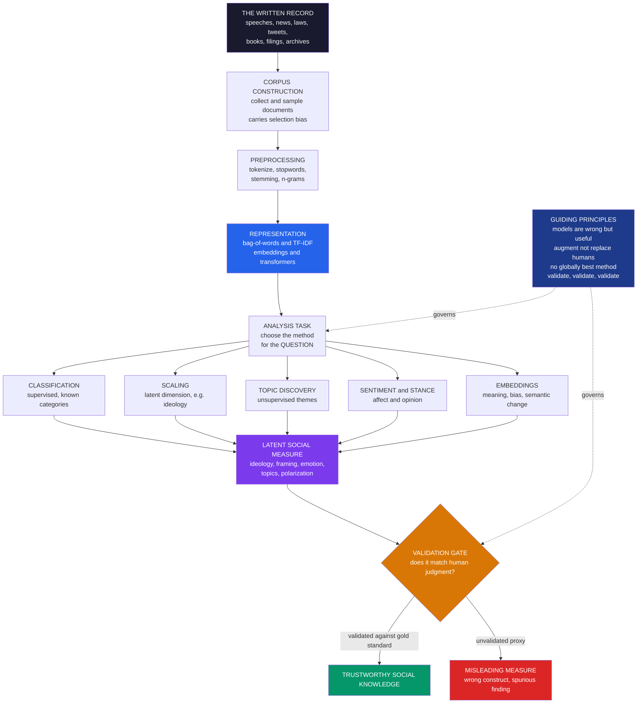

# 📜 Text as Data in Social Science

> [!abstract] TL;DR
> **Text as data** is the use of computational methods to turn vast collections of **text** — news, social media, speeches, manifestos, laws, court rulings, corporate filings, books, historical archives, open-ended survey answers — into quantitative **data** for social-science analysis: *the written record of humanity as a data source*. Its defining reframe (Grimmer, Roberts & Stewart) is that, for social science, text analysis is fundamentally **measurement** — using language to measure **latent social constructs** (ideology, sentiment, emotion, framing, topics, polarization, uncertainty) that cannot be observed directly. That reframe imports the full discipline of **measurement validity**: a text measure is a **proxy** that must be **validated** against human judgment. The field runs on four guiding principles — *all quantitative text models are wrong, but some are useful; automated methods **augment** rather than replace human reading; there is **no globally best method** (choose the method for the question); and **validate, validate, validate**.* A standard **pipeline** — corpus → preprocessing → representation → analysis → validation — supports five task families: **classification** (supervised measurement of known categories), **scaling** (placing texts on a latent dimension, e.g. Wordscores/Wordfish ideology), **topic discovery** (unsupervised themes, e.g. topic models/LDA), **sentiment/stance**, and **embedding/semantic** analysis. Representations have evolved from interpretable **bag-of-words / TF-IDF** and dictionaries, through **word embeddings** (meaning as geometry), to **transformers and large language models** (contextual understanding, few-shot classification, LLM-as-annotator) — more powerful but less interpretable, with new validation challenges. Despite the genuine hardness of language (context, sarcasm, negation, ambiguity), corpus **selection bias**, and **encoded model bias**, text-as-data is a foundational pillar of computational social science, illuminating politics, media, culture, law, the economy, and history through the collective written mind of humanity.

---

## Intuition

**Analogy:** Humanity writes its mind down. Every law, news article, campaign speech, tweet, novel, court ruling, product review, and private diary is a kind of **fossil record** — a trace of what people at some moment *thought, valued, feared, and argued about*. For almost all of history this ocean of text was simply too vast to read: a historian might spend an entire career on a single archive, a single decade of one city's newspapers. The record of civilization existed, but no one could *hold it all in view at once*.

Now a computer can read a **million documents before lunch**. Point it at a century of books and it can trace the birth and spread of an ideology through the changing words people used. Point it at a nation's tweets and it can take the emotional temperature of the country hour by hour. Point it at millions of court decisions and it can surface patterns of bias no clerk could ever have counted. **Text as data** is the move that makes this possible: it stops treating text as something only a human can interpret one page at a time, and starts treating it as *measurable evidence* — mining the collective written mind of humanity at a scale no reader could match. The catch, and the whole discipline of the field, is that turning words into numbers is an act of **measurement** — and a number that does not faithfully capture the human meaning behind the words is worse than no number at all.

---

## How It Works

Text-as-data sits at the intersection of two traditions. From **natural language processing** it borrows the machinery — tokenization, vector representations, classifiers, embeddings, language models. From **social science** it borrows the *question*: not "can the machine process this text?" but "**what social fact does this text let me measure, and can I trust that measurement?**" The second question is what distinguishes text-as-data from NLP proper, and it changes everything downstream.

### The core reframe: text analysis as measurement

Grimmer and Stewart's foundational move is to insist that, for social science, computational text analysis is **measurement of latent constructs**. Social scientists care about abstract, unobservable concepts — *ideology, framing, emotion, tone, polarization, policy attention, legal reasoning, economic uncertainty*. None of these is written on the page in plain sight; each must be **operationalized** as some function of observable words. A sentiment score, an ideology scale, a topic proportion — each is a **proxy** standing in for a construct. This is exactly the logic of [[Measurement_and_Validity_in_Digital_Data]]: the distance between the construct and the word-based measure is where **construct validity** lives, and no amount of clever modeling repairs a measure that captures the wrong thing.

### The four guiding principles

The methodological wisdom of the field compresses into four principles (Grimmer, Roberts & Stewart):

1. **All quantitative text models are wrong, but some are useful.** Language is astronomically complex; every model radically simplifies it. Judge a text model not by whether it is "true" but by whether it is **useful for the task at hand** — a stance borrowed straight from statistics (Box).
2. **Quantitative methods augment humans, they do not replace them.** The value is in combining **machine scale** with **human reading and interpretation** — the human stays in the loop to build categories, read samples, and interpret output. Automation without human judgment is not rigor; it is abdication.
3. **There is no globally best method.** The right tool depends on the **question**. Measuring a known category is *classification*; discovering unknown themes is *topic discovery*; placing texts on a dimension is *scaling*. A method that is perfect for one is wrong for another.
4. **Validate, validate, validate.** The cardinal rule. A text measure is a proxy that **must be checked against a gold standard** — a hand-coded subset, human judgment, or an external criterion. Unvalidated text measures are the field's signature failure mode.

### The pipeline

Nearly every text-as-data study walks the same road, and every stage is a **decision point** that shapes the result:

- **Corpus construction.** Collect and sample documents — a party's manifestos, a year of front pages, a platform's posts. The corpus carries its *own biases*: whose text got recorded, digitized, and retained? An unrepresentative corpus produces an unrepresentative measure (see [[Big_Data_and_the_Social_Sciences]] and [[Digital_Traces_and_Found_Data]]).
- **Preprocessing.** Tokenize, lowercase, remove stopwords, stem/lemmatize, form n-grams. These choices are *not* innocent housekeeping — Denny and Spirling showed that preprocessing decisions can materially change unsupervised results. This connects to [[Text_Preprocessing]] and [[Tokenization]].
- **Representation.** Turn text into numbers: a **bag-of-words / document-term matrix**, **TF-IDF** weighting (down-weighting ubiquitous words — [[TF_IDF_Classical]]), or dense **embeddings** and contextual representations ([[Word_Embeddings]], [[Word2Vec]]).
- **Analysis.** Apply the task-appropriate method (below).
- **Validation.** Check the measure against human judgment before trusting it.

### The five task families

The map of methods sorts along one axis — do you **measure something you already defined** (supervised) or **discover something you did not** (unsupervised)?

- **Classification / supervised measurement.** Assign documents to *known* categories — topic, stance, tone, relevance — learned from labeled training data. Measures a **defined** construct (see [[Text_Classification]], [[Naive_Bayes]], [[Logistic_Regression]]).
- **Scaling / ideal-point estimation.** Place documents or authors on a latent **dimension** — left-right ideology (**Wordscores**, **Wordfish**), sentiment intensity, extremity. Measures **position**, not category.
- **Topic discovery / unsupervised.** Find latent themes with *no* pre-defined categories — **topic models / LDA** and their structural extensions. Discovers the categories rather than assuming them.
- **Sentiment / emotion / stance.** Measure affect and opinion — polarity, discrete emotions, or stance toward a target.
- **Semantic / embedding analysis.** Study meaning, associations, bias, and **semantic change** over time via the geometry of embeddings.

### The technological arc: from bag-of-words to LLMs

The field's tools have grown steadily more powerful and steadily less transparent. It began with **bag-of-words and dictionary** methods — counting words, still remarkably useful and fully interpretable. It advanced through **word embeddings** (word2vec, GloVe — meaning encoded as *direction and distance* in a vector space). It now reaches **transformers and large language models** ([[BERT]], [[GPT_Family]], [[Language_Model_Basics]]) that read words *in context*, classify with few or zero labeled examples, and increasingly serve as **automated annotators**. Each step trades **interpretability** for **capability** — and raises fresh validation questions, because a model that "understands" text also imports whatever biases and idiosyncrasies it learned.

### The pipeline and its principles, in one picture



---

## Key Concepts

### Secondary Level

**Turning words into numbers you can count.** Imagine you had every speech a politician ever gave, or every review of a movie, or a hundred years of newspapers. A person could never read it all. **Text as data** is teaching a computer to read all of it and turn it into **numbers** — how often certain words appear, whether the tone is positive or negative, what topics keep coming up. Then you can *count, compare, and graph* the writing of thousands or millions of people.

**Why it is powerful — and where it goes wrong:**

| What the computer counts | What a social scientist wants to know |
|---|---|
| How often "freedom," "market," "family" appear | Is this speech **conservative** or **progressive**? |
| Whether words are happy or angry | What is the **public mood**? |
| Which words cluster together across documents | What **topics** are people discussing? |
| How word meanings shift over decades | How did **culture** change? |

**The one rule to remember.** A computer counting words is only *useful* if the count really means what you think it means. So the golden rule of text as data is: **always check the computer's answers against what a human reader would say.** A machine that labels a sarcastic "oh great, just wonderful" as *positive* is measuring the wrong thing.

### Undergraduate Level

#### Text as measurement, not just processing

The intellectual core of text-as-data is a *reframe*: for social science, analyzing text is **measuring a latent construct**. You are not trying to make the machine "understand" language for its own sake; you are trying to produce a **valid, reliable measure** of something like ideology or emotion. This is why the standards of measurement — **construct validity** (does the measure capture the concept?), **criterion validity** (does it predict an external outcome?), and **inter-coder reliability** (do humans agree on the labels the machine is trained to reproduce?) — govern the whole enterprise. A sentiment classifier is a *measurement instrument*, and like any instrument it must be calibrated.

#### The document-term matrix and TF-IDF

The workhorse representation is the **bag-of-words** model: forget word order, and represent each document as a vector of word counts. Stack them and you get the **document-term matrix** `X`, where `X[d, w]` is how many times word `w` appears in document `d`. Raw counts over-weight ubiquitous words, so **TF-IDF** re-weights each entry by *term frequency* times *inverse document frequency* — a word that appears in *every* document (like a stopword) is uninformative and gets crushed, while a word specific to a few documents is amplified. The bag-of-words is "wrong" (it discards syntax and context) but often "useful," and it is fully interpretable — you can always ask *which words* drove a result. It rests on the vector-space machinery of [[Vectors_and_Vector_Spaces]] and [[Matrices_and_Determinants]].

#### Supervised vs unsupervised: the two big roads

- **Supervised (measure the known).** You *define* the categories, hand-label a training set, and train a classifier (Naive Bayes, logistic regression, or a fine-tuned transformer) to reproduce those labels on new documents. Use it when you know *what* you want to measure (Is this tweet about immigration? Is this review positive?). Evaluation is by held-out accuracy, precision, recall, and F1 against gold labels — [[Classification_Metrics]].
- **Unsupervised (discover the unknown).** You do *not* pre-specify categories; the method surfaces latent structure — **topic models** cluster co-occurring words into themes; **scaling** models place documents on a continuous dimension. Use it for *discovery* and exploration. The cost: the output is not guaranteed to be substantively meaningful, so **validation and human interpretation are even more essential**.

#### Scaling: putting text on a ruler

Between classification and discovery sits **scaling** — measuring *position* on a latent dimension. **Wordscores** (Laver, Benoit & Garry) learns word weights from reference texts of known position (e.g. party manifestos scored left-right by experts), then scores new texts by their word usage. **Wordfish** (Slapin & Proksch) does it *without* reference texts, assuming word frequencies follow a Poisson model driven by a latent position. Both convert a pile of speeches into a single number per author — an ideology estimate you can plot, correlate, and track over time.

### Graduate Level

#### The identification problem: what does the measure identify?

The deepest issue is not building a classifier but knowing **which construct it actually identifies**. A model trained to predict "toxicity" may in fact be detecting African-American Vernacular English; an "economic uncertainty" index built from newspaper phrases may partly track newspaper *style*. Because text measures are functions of correlated linguistic signals, a measure can achieve high accuracy on a held-out set while measuring a *different, confounded* construct than the one named — the text analogue of the construct-validity problem in [[Measurement_and_Validity_in_Digital_Data]]. Unsupervised methods sharpen this: a topic is only a "topic" once a human validates that its top words cohere and correspond to a real theme (Chang et al.'s "reading tea leaves" showed that models optimizing *held-out likelihood* can produce *less* human-interpretable topics — statistical fit and semantic validity can diverge).

#### Preprocessing as a researcher degree of freedom

Denny and Spirling ("Text Preprocessing for Unsupervised Learning") demonstrated that the *order* and *combination* of preprocessing steps (stemming, stopword lists, n-gram inclusion, rare-term pruning) can change which documents cluster together — a **researcher degree of freedom** that, left undisclosed, enables (accidental) specification search. The graduate-level response is to treat preprocessing as part of the model, report sensitivity across reasonable pipelines, and, for high-stakes measures, preregister the operationalization.

#### Validation strategies, made precise

Grimmer, Roberts & Stewart formalize validation by task. For **supervised** methods: a labeled gold standard, out-of-sample accuracy/precision/recall/F1, and **inter-coder reliability** (Krippendorff's alpha) establishing that humans can even agree on the construct. For **unsupervised** methods, where no gold labels exist by construction: **semantic validity** (do top words and exemplar documents cohere?), **predictive validity** (does the discovered dimension correlate with external events or covariates?), and **construct validity** via known relationships. The cardinal error is to skip validation because the numbers "look reasonable" — face validity is the weakest evidence and the most seductive.

#### The LLM turn and its new validation frontier

Large language models can now perform **zero-shot** and **few-shot** classification and act as **automated annotators**, sometimes rivaling crowdworkers. But this shifts rather than removes the validation burden. LLM labels are **not** ground truth: they inherit training-data biases, are sensitive to prompt wording, can be non-reproducible across model versions (drift), and may agree with humans on easy cases while failing systematically on the hard, theoretically-interesting ones. The emerging standard (e.g. design-based approaches to LLM annotation) is to *still* hand-validate a sample, quantify the LLM's error rate, and **statistically correct** downstream estimates for that measurement error — treating the LLM as a fallible instrument, not an oracle. This is the frontier developed in this section's forthcoming *Large_Language_Models_in_Social_Science*.

---

## Python Demo

```python
import numpy as np
import matplotlib
matplotlib.use("Agg")
import matplotlib.pyplot as plt

# =====================================================================
# TEXT AS DATA -> A QUANTITATIVE SOCIAL MEASURE (pure numpy + matplotlib)
#   (a) Build a small CORPUS of synthetic political statements labeled by
#       STANCE (progressive vs conservative), PREPROCESS (tokenize + remove
#       stopwords), and represent as a BAG-OF-WORDS / TF-IDF matrix.
#   (b) Three social-science text tasks on the same corpus:
#        (i)  DISTINCTIVE WORDS per group  -> Monroe et al. "fightin' words"
#             log-odds with an informative prior (which words mark each side).
#        (ii) CLASSIFICATION -> multinomial Naive Bayes, trained on a TRAIN
#             split, evaluated on held-out TEST docs (a categorical measure).
#        (iii)SCALING -> project each document onto the distinctive-word
#             direction to get a continuous IDEOLOGY score (a latent measure).
#   (c) VALIDATION -> compare machine measures to the GOLD (human) labels.
#   Deterministic: everything is pure numpy, no external corpora needed.
# =====================================================================
rng = np.random.default_rng(11)

# ---------------------------------------------------------------------
# (a) CORPUS: each document mixes shared STOPWORDS + neutral FILLER with
#     stance-specific vocabulary -> realistic signal-plus-noise text.
# ---------------------------------------------------------------------
stopwords = {"the","a","an","and","or","to","of","we","will","our","must",
             "is","that","this","for","in","on","it","be","as"}
filler    = ["policy","nation","people","future","government","today",
             "country","plan","america","reform"]
prog_words = ["equality","welfare","climate","workers","regulation","public",
              "rights","diversity","healthcare","union"]
cons_words = ["tradition","market","freedom","security","family","taxes",
              "business","order","borders","enterprise"]

def make_doc(stance, length=26):
    base = list(rng.choice(list(stopwords) + filler, size=int(length * 0.55)))
    if stance == 0:                                  # progressive
        strong = list(rng.choice(prog_words, size=int(length * 0.35)))
        weak   = list(rng.choice(cons_words, size=int(length * 0.10)))
    else:                                            # conservative
        strong = list(rng.choice(cons_words, size=int(length * 0.35)))
        weak   = list(rng.choice(prog_words, size=int(length * 0.10)))
    doc = base + strong + weak
    rng.shuffle(doc)
    return " ".join(doc)

N_per  = 130
docs   = [make_doc(0) for _ in range(N_per)] + [make_doc(1) for _ in range(N_per)]
labels = np.array([0] * N_per + [1] * N_per)         # GOLD human stance labels
names  = {0: "progressive", 1: "conservative"}
D = len(docs)

# --- PREPROCESS: tokenize + remove stopwords -------------------------
def tokenize(text):
    return [t for t in text.lower().split() if t not in stopwords]

tokenized = [tokenize(d) for d in docs]
vocab   = sorted({w for toks in tokenized for w in toks})
vindex  = {w: i for i, w in enumerate(vocab)}
V = len(vocab)

# --- BAG-OF-WORDS document-term matrix + TF-IDF ----------------------
X = np.zeros((D, V))
for i, toks in enumerate(tokenized):
    for w in toks:
        X[i, vindex[w]] += 1
tf    = X / np.maximum(X.sum(1, keepdims=True), 1)
df    = (X > 0).sum(0)
idf   = np.log((1 + D) / (1 + df)) + 1
tfidf = tf * idf

# ---------------------------------------------------------------------
# (b-i) DISTINCTIVE WORDS: log-odds ratio with an informative Dirichlet
#       prior, z-scored (Monroe, Colaresi & Quinn 2008 "fightin' words").
#       z > 0 -> conservative-marking, z < 0 -> progressive-marking.
# ---------------------------------------------------------------------
prior = 0.25
cnt_p = X[labels == 0].sum(0)                        # counts among progressive
cnt_c = X[labels == 1].sum(0)                        # counts among conservative
tot_p, tot_c = cnt_p.sum(), cnt_c.sum()
lo_p  = np.log((cnt_p + prior) / (tot_p + prior * V - cnt_p - prior))
lo_c  = np.log((cnt_c + prior) / (tot_c + prior * V - cnt_c - prior))
delta = lo_c - lo_p                                  # log-odds difference
z     = delta / np.sqrt(1.0 / (cnt_p + prior) + 1.0 / (cnt_c + prior))

# ---------------------------------------------------------------------
# (b-ii) CLASSIFICATION: multinomial Naive Bayes, train/test split.
# ---------------------------------------------------------------------
perm = rng.permutation(D)
ntr  = int(0.70 * D)
tr, te = perm[:ntr], perm[ntr:]

def nb_fit(Xtr, ytr, alpha=1.0):
    logpri, loglik = {}, {}
    for c in (0, 1):
        wc = Xtr[ytr == c].sum(0) + alpha            # Laplace-smoothed counts
        loglik[c] = np.log(wc / wc.sum())
        logpri[c] = np.log((ytr == c).mean())
    return logpri, loglik

logpri, loglik = nb_fit(X[tr], labels[tr])
scores_te = np.column_stack([X[te] @ loglik[c] + logpri[c] for c in (0, 1)])
pred = scores_te.argmax(1)
acc  = (pred == labels[te]).mean()

conf = np.zeros((2, 2), int)                          # confusion matrix vs gold
for t, p in zip(labels[te], pred):
    conf[t, p] += 1

# ---------------------------------------------------------------------
# (b-iii) SCALING: project each document's word usage onto the
#         distinctive-word direction -> a continuous IDEOLOGY score.
# ---------------------------------------------------------------------
word_weight = np.tanh(z / (np.abs(z).max()))          # bounded word ideology weights
doc_score   = tf @ word_weight                         # latent left-right score per doc
# validate the SCALE as a classifier: threshold at 0 -> compare to gold
scale_pred  = (doc_score > np.median(doc_score)).astype(int)
scale_acc   = (scale_pred == labels).mean()

# ------------------------------- REPORT ------------------------------
order = np.argsort(z)
print("=" * 66)
print("TEXT AS DATA: measuring political stance from words")
print("=" * 66)
print(f"documents={D}  vocabulary={V}  (stopwords removed)")
print("top CONSERVATIVE-marking words:",
      [vocab[i] for i in order[::-1][:6]])
print("top PROGRESSIVE-marking words :",
      [vocab[i] for i in order[:6]])
print(f"Naive Bayes test accuracy vs GOLD : {acc:.2f}  (n={len(te)})")
print(f"ideology-SCALE accuracy vs GOLD   : {scale_acc:.2f}")

# ------------------------------- FIGURE ------------------------------
fig, ax = plt.subplots(2, 2, figsize=(14, 10))
fig.suptitle("Text as data: turning political speech into social measures",
             fontsize=14, fontweight="bold")
c_prog, c_cons = "#2563eb", "#dc2626"

# Panel A: distinctive words (fightin' words)
axA = ax[0, 0]
topc = order[::-1][:8]; topp = order[:8]
words = [vocab[i] for i in topp][::-1] + [vocab[i] for i in topc]
vals  = [z[i] for i in topp][::-1] + [z[i] for i in topc]
colors = [c_prog] * 8 + [c_cons] * 8
axA.barh(range(len(words)), vals, color=colors, edgecolor="black")
axA.set_yticks(range(len(words))); axA.set_yticklabels(words, fontsize=8)
axA.axvline(0, color="black", lw=0.8)
axA.set_title("(a) Distinctive words per stance\nlog-odds z-score "
              "(blue=progressive, red=conservative)", fontsize=10)
axA.set_xlabel("z-scored log-odds (fightin' words)")

# Panel B: document ideology scaling -> two separated distributions
axB = ax[0, 1]
axB.hist(doc_score[labels == 0], bins=22, color=c_prog, alpha=0.6,
         label="progressive (gold)", edgecolor="white")
axB.hist(doc_score[labels == 1], bins=22, color=c_cons, alpha=0.6,
         label="conservative (gold)", edgecolor="white")
axB.set_title("(b) Latent SCALING\ndocuments placed on an ideology dimension",
              fontsize=10)
axB.set_xlabel("estimated ideology score (word-usage projection)")
axB.set_ylabel("number of documents"); axB.legend(fontsize=8)

# Panel C: confusion matrix vs gold labels
axC = ax[1, 0]
im = axC.imshow(conf, cmap="Blues")
for i in range(2):
    for j in range(2):
        axC.text(j, i, conf[i, j], ha="center", va="center",
                 fontsize=13, fontweight="bold",
                 color="white" if conf[i, j] > conf.max() / 2 else "black")
axC.set_xticks([0, 1]); axC.set_xticklabels(["prog", "cons"])
axC.set_yticks([0, 1]); axC.set_yticklabels(["prog", "cons"])
axC.set_xlabel("Naive Bayes prediction"); axC.set_ylabel("GOLD human label")
axC.set_title(f"(c) CLASSIFICATION vs gold\ntest accuracy = {acc:.2f}",
              fontsize=10)
fig.colorbar(im, ax=axC, fraction=0.046)

# Panel D: VALIDATION -> machine measures agree with human labels
axD = ax[1, 1]
majority = max(np.mean(labels == 0), np.mean(labels == 1))
bars = axD.bar(["majority\nbaseline", "ideology\nSCALE", "Naive Bayes\nclassifier"],
               [majority, scale_acc, acc],
               color=["#9ca3af", "#7c3aed", "#059669"], edgecolor="black")
for b, v in zip(bars, [majority, scale_acc, acc]):
    axD.text(b.get_x() + b.get_width() / 2, v + 0.01, f"{v:.2f}",
             ha="center", fontsize=10)
axD.axhline(majority, color="#9ca3af", ls="--", lw=1)
axD.set_ylim(0, 1.08); axD.set_ylabel("agreement with GOLD human labels")
axD.set_title("(d) VALIDATION\nmeasures checked against human judgment",
              fontsize=10)

plt.tight_layout(rect=[0, 0, 1, 0.95])
plt.savefig("text_as_data_in_social_science.png", dpi=110, bbox_inches="tight")
plt.show()
```

**What the demo shows:**

- **Panel (a) — distinctive words.** The **fightin'-words** log-odds surfaces exactly the vocabulary that marks each side ("freedom, market, family, order" versus "equality, welfare, climate, rights"). This is text-as-data at its most interpretable: a *measure* of framing you can read word-by-word and defend.
- **Panel (b) — latent scaling.** Projecting each document's word usage onto the distinctive-word direction yields a **continuous ideology score**. The two gold-labeled groups form two separated distributions — *text has become a ruler*, converting speeches into positions on a dimension (the logic of Wordscores/Wordfish).
- **Panel (c) — classification.** A from-scratch **Naive Bayes** classifier, trained on 70% of documents, recovers the stance of held-out documents with high accuracy — a **supervised measurement** of a categorical construct, scored against gold labels in a confusion matrix.
- **Panel (d) — validation.** The punchline of the whole field. Both the **scale** and the **classifier** beat the majority baseline *and* agree strongly with **human gold labels** — which is the only reason we are entitled to trust them. Swap in a corpus where the machine's "sentiment" quietly tracks writing *style* instead of stance, and this panel is where the deception would show up. **No validation panel, no credible measure.**

Run it and read the console: the distinctive-word lists and the two accuracy figures make concrete every idea above — words become numbers, numbers become a social measure, and the measure is only as good as its agreement with human judgment.

---

## Real-World Applications

> **Political ideology, polarization, and agendas.** Scaling manifestos, floor speeches, and social-media posts yields ideology estimates (Wordscores/Wordfish), maps party agendas and issue attention (Comparative Agendas Project), and quantifies rising **polarization** in congressional language (Gentzkow, Shapiro & Taddy's partisan-phrase work). Connects to [[Democratic_Backsliding_and_Polarization]] and this section's forthcoming *Measuring_Culture_and_Ideology_from_Text*.

> **Media framing and bias.** Automated content analysis measures how outlets **frame** issues, detects slant, and tracks which stories get attention — the computational descendant of classical [[Media_Propaganda_and_Political_Communication]] and content analysis in [[Discourse_Analysis]].

> **Public opinion and sentiment at scale.** Sentiment and stance models turn reviews, posts, and open-ended survey responses into mood and opinion measures — with the heavy caveat (validated against [[Public_Opinion_and_Political_Socialization]] and polls) that the posting population is not the public.

> **Economic sentiment and uncertainty indices.** Baker, Bloom & Davis's **Economic Policy Uncertainty** index — built by counting uncertainty-related phrases in newspapers — is a text measure that moves markets and feeds macro models; central-bank "hawkish/dovish" tone scoring is now routine in finance.

> **Cultural and historical analysis.** Word-usage over centuries of digitized books (Google Books n-grams, "culturomics") traces the rise and fall of ideas; embedding-based methods detect **semantic change** and encoded stereotypes across decades (the topic of this section's forthcoming *Word_Embeddings_and_Semantic_Change*).

> **Law, misinformation, and open-ended surveys.** Text-as-data measures legal reasoning and bias in millions of rulings, powers **misinformation** and toxic-speech detection, and codes free-text survey answers at scale — replacing armies of hand-coders while (ideally) validating against a hand-coded subset.

---

## Common Pitfalls

- **Skipping validation.** The cardinal sin. A classifier or topic model that "looks reasonable" is not validated; face validity is the weakest evidence. Always benchmark against a hand-coded gold standard and report accuracy/F1 or, for unsupervised methods, semantic and predictive validity. (See [[Measurement_and_Validity_in_Digital_Data]].)
- **Assuming the measure captures the named construct.** A "sentiment" score may track writing style, a "toxicity" model may track dialect, an "uncertainty" index may track a few idiosyncratic phrases. High accuracy on a held-out set does **not** prove you measured the construct you named — it may have learned a confounded proxy.
- **Corpus selection bias.** *Whose* text is in the corpus? Social-media users, digitized books, and archived documents are all non-representative. An unrepresentative corpus yields an unrepresentative measure, no matter how sophisticated the model (links to [[Big_Data_and_the_Social_Sciences]]).
- **Treating preprocessing as neutral.** Stemming, stopword lists, n-grams, and rare-term pruning materially change results, especially for unsupervised methods (Denny & Spirling). Undisclosed preprocessing is a hidden researcher degree of freedom; report sensitivity across pipelines.
- **The language-is-hard traps.** Sarcasm, irony, negation ("not good"), and context flip meaning. Bag-of-words and naive dictionaries miss all of them; even LLMs stumble on the hard cases. Validate especially on the difficult, theoretically-interesting examples, not just the easy majority.
- **Encoded model bias.** Embeddings and language models learn the biases of their training text (gender, race, ideology). A measure built on them can inherit and amplify those biases — a validity *and* an ethics problem (see [[Ethics_and_Privacy_in_Computational_Social_Science]]).
- **Over-interpreting topic-model output.** Topics are statistical co-occurrence patterns, not ground-truth themes; a low-perplexity model can produce *less* interpretable topics (Chang et al.). Read the top words *and* exemplar documents before naming a topic, and never treat topic proportions as exact without validation.
- **Trusting LLM annotations as ground truth.** LLM labels are fallible, prompt-sensitive, and non-reproducible across versions. Treat the LLM as an instrument: validate a sample, estimate its error rate, and correct downstream estimates for measurement error.

---

## Related Concepts

**This section and vault (Computational Social Science):**

- [[Computational_Social_Science_Overview]] — the parent field; text-as-data is one of its core method pillars, and this note is the section-opener the overview's map points to.
- [[Measurement_and_Validity_in_Digital_Data]] — the measurement backbone: text analysis *is* measurement, so construct validity, reliability, and gold-standard validation govern every text measure.
- [[Big_Data_and_the_Social_Sciences]] — why data abundance is not knowledge, and the corpus **selection-bias** problem behind every text collection.
- [[Digital_Traces_and_Found_Data]] — where much social-media and platform text comes from, and its non-designed, found nature.
- [[Ethics_and_Privacy_in_Computational_Social_Science]] — consent, privacy, and encoded bias in analyzing people's words at scale.

*Forthcoming siblings in this section (referenced in prose above):* **Topic Models and Document Classification** (supervised categories and unsupervised themes), **Sentiment, Emotion, and Stance Analysis** (measuring affect and opinion), **Word Embeddings and Semantic Change** (meaning as geometry, bias, and cultural drift), **Large Language Models in Social Science** (transformers and LLM-as-annotator), and **Measuring Culture and Ideology from Text** (scaling ideology, framing, and values).

**NLP representations and methods (AI-ML / NLP vaults):**

- [[Text_Preprocessing]] — tokenization, stopword removal, stemming: the preprocessing stage whose choices shape results.
- [[Tokenization]] — splitting text into the units that become the columns of the document-term matrix.
- [[TF_IDF_Classical]] — the bag-of-words / TF-IDF representation demonstrated in the Python panel.
- [[Text_Classification]] — the supervised-measurement task family (topic, stance, tone).
- [[Naive_Bayes]] — the classic generative text classifier implemented from scratch in the demo.
- [[Logistic_Regression]] — the discriminative workhorse for supervised text measurement.
- [[Classification_Metrics]] — precision, recall, and F1 for validating a text classifier against gold labels.
- [[Word_Embeddings]] — dense representations where meaning is geometry; the basis of semantic and bias analysis.
- [[Word2Vec]] — the canonical embedding method that made "meaning as direction" practical.
- [[BERT]] — contextual transformer representations for modern text classification and measurement.
- [[GPT_Family]] — generative LLMs used for zero/few-shot classification and as automated annotators.
- [[Language_Model_Basics]] — the language-modeling foundation beneath embeddings and transformers.

**Linguistic and mathematical foundations:**

- [[Corpus_Linguistics]] — the linguistic tradition of studying language from large text corpora, kin to text-as-data.
- [[Discourse_Analysis]] — the interpretive study of language-in-use that computational content analysis complements and formalizes.
- [[Lexical_Semantics]] — how word meaning works, the phenomenon embeddings try to capture and semantic-change studies track.
- [[Vectors_and_Vector_Spaces]] — the vector-space model underlying document and word representations.
- [[Matrices_and_Determinants]] — the document-term matrix machinery on which bag-of-words analysis runs.

**Substantive social-science applications:**

- [[Sociological_Research_Methods]] — content analysis and coding, the qualitative ancestor that text-as-data scales up.
- [[Media_Propaganda_and_Political_Communication]] — framing, slant, and agenda-setting, prime targets for automated text measurement.
- [[Public_Opinion_and_Political_Socialization]] — the opinion constructs sentiment and stance models try to measure.
- [[Democratic_Backsliding_and_Polarization]] — polarization in political language, a flagship text-as-data finding.

---

## Review Questions

### Secondary

1. Give one real example of "text" that a computer could turn into **data** (for instance, tweets or movie reviews), and one **question** about people you could answer by counting words in it.
2. A computer reads the review "Oh great, another boring superhero movie" and labels it **positive** because it saw the word "great." What went wrong, and why does this show you must always **check the computer against a human reader**?
3. In your own words, what does it mean to say text-as-data lets us "read a million documents before lunch"? Why is that useful for studying society?

### Undergraduate

1. Explain the claim that, *for social science, text analysis is measurement*. Using a construct like **ideology** or **public mood**, walk through operationalization, the proxy gap, and what "validating" the measure would concretely require.
2. Distinguish **supervised** classification, **unsupervised** topic discovery, and **scaling**. For each, give a research question it fits and describe how you would validate the result. Why is "there is no globally best method" a consequence of these differences?
3. Describe the bag-of-words / TF-IDF representation and one thing it throws away. Give a concrete example (e.g. negation or sarcasm) where discarding that information would make a text measure fail, and how you might mitigate it.

### Graduate

1. You build a classifier that predicts "policy uncertainty" from newspaper text with 92% held-out accuracy, and you use its index as a regressor. Argue why high accuracy does **not** establish construct validity, identify two plausible confounded constructs it might actually be measuring, and design a validation protocol (gold standard, criterion checks, sensitivity to preprocessing) to defend the measure.
2. Grimmer, Roberts & Stewart insist that quantitative text methods **augment rather than replace** human interpretation, yet LLMs can now annotate text at scale. Reconcile these: where does human judgment remain indispensable in an LLM-annotation pipeline, and how would you statistically correct downstream estimates for the LLM's (validated) error rate?
3. Chang et al. showed that topic models with better held-out likelihood can yield *less* human-interpretable topics. Explain why statistical fit and semantic validity diverge, what this implies for choosing and validating unsupervised text models, and how "reading tea leaves" reframes what "a good model" means in text-as-data.

---

## Sources

- [Grimmer, J. & Stewart, B.M. (2013). "Text as Data: The Promise and Pitfalls of Automatic Content Analysis Methods for Political Texts." *Political Analysis* 21(3), 267–297](https://doi.org/10.1093/pan/mps028)
- [Grimmer, J., Roberts, M.E. & Stewart, B.M. (2022). *Text as Data: A New Framework for Machine Learning and the Social Sciences*. Princeton University Press](https://press.princeton.edu/books/hardcover/9780691207544/text-as-data)
- [Gentzkow, M., Kelly, B. & Taddy, M. (2019). "Text as Data." *Journal of Economic Literature* 57(3), 535–574](https://doi.org/10.1257/jel.20181020)
- [Salganik, M.J. (2018). *Bit by Bit: Social Research in the Digital Age*. Princeton University Press](https://www.bitbybitbook.com/)
- [Monroe, B.L., Colaresi, M.P. & Quinn, K.M. (2008). "Fightin' Words: Lexical Feature Selection and Evaluation for Identifying the Content of Political Conflict." *Political Analysis* 16(4), 372–403](https://doi.org/10.1093/pan/mpn018)
- [Denny, M.J. & Spirling, A. (2018). "Text Preprocessing for Unsupervised Learning: Why It Matters, When It Misleads, and What to Do About It." *Political Analysis* 26(2), 168–189](https://doi.org/10.1017/pan.2017.44)

---

#computational-social-science #text-as-data #natural-language-processing #text-analysis #measurement
