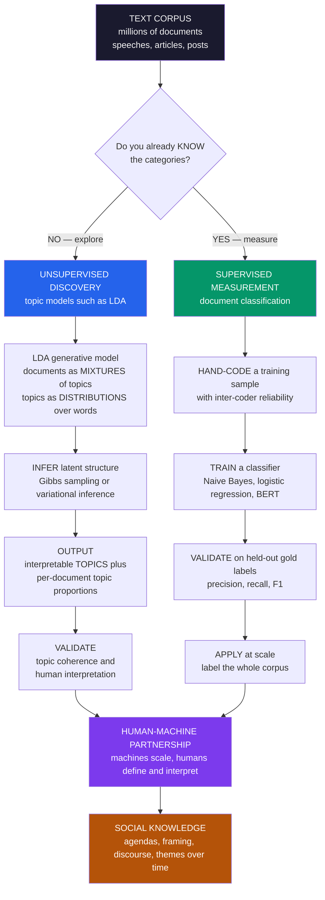

# 📚 Topic Models and Document Classification

> [!abstract] TL;DR
> **Topic models** and **document classification** are the two workhorse modes of turning text into social knowledge, embodying computational text analysis's fundamental divide between **unsupervised discovery** and **supervised measurement**. A **topic model** — canonically **Latent Dirichlet Allocation (LDA**, Blei–Ng–Jordan) — is a **probabilistic generative model** that treats each **document as a mixture of latent topics** and each **topic as a distribution over words**, then **infers** the hidden thematic structure of a corpus **without any labels or predefined categories** — it *discovers* what a collection is "about." **Supervised classification** instead trains on **hand-labeled** documents to reliably **measure a known construct** — topic, stance, tone, frame, relevance — extending a human **coding scheme** to millions of documents by machine (from **Naive Bayes** and **logistic regression** to transformer classifiers like BERT). The choice hinges on **whether you know the categories in advance**: use topic models to **explore** (inductive, but the topics need interpretation and may not match your construct); use classification to **measure** (deductive, but needs labeled data and may miss the unanticipated). Both demand rigorous **validation** — **topic coherence** and human interpretation for the unsupervised side, **precision/recall/F1** against gold standards for the supervised — because unvalidated topics can be junk and classifiers inherit training-data bias. And both embody the guiding principle of text-as-data (Grimmer–Stewart): computational methods **augment rather than replace** human interpretation. Together they power the measurement of **political agendas, media framing, public discourse, open-ended survey responses, and historical themes** across the social sciences.

---

## Intuition

**Analogy.** Imagine you inherit a warehouse holding a **million documents** — letters, memos, clippings — with no index, no folders, and no idea what is inside. You have two very different ways to make sense of it.

The **first** way: you don't know what themes are even in there, so you want the pile to *tell you*. Picture a machine that reads all million documents overnight and announces: *"These documents are about 30 things. One cluster is dominated by the words jobs, growth, tax, market — call it 'the economy.' Another is hospital, doctor, insurance, patients — 'healthcare.' A third is military, treaty, border, alliance — 'foreign policy.'"* Nobody told the machine to look for the economy; it **discovered** that theme from the way words **co-occur**, and it can tell you that a given letter is *"60% economy, 25% healthcare, 15% foreign policy."* That machine is a **topic model**. It answers the question: **"What is this collection about?"**

The **second** way: you already **know** the categories you care about — say you want to sort every document into "supports the policy," "opposes it," or "neutral." You can't articulate a rule, but you can **recognize** the categories when you read. So you hand-sort a few hundred documents yourself, then train a machine to imitate your judgments and apply them to the remaining 999,700. That is **supervised classification**. It answers a different question: **"How much of this known thing is here, and where?"**

**Discovery versus measurement** — finding what themes *exist* versus counting *known* things — is the great methodological fork of computational text analysis. One is **inductive** (let the corpus surprise you), the other **deductive** (impose a scheme you defined). Neither replaces the reader: a human still has to **name** the discovered topics and **define and check** the categories. But together they let a single analyst do what an army of readers could not.

---

## How It Works

Computational text analysis (Grimmer, Roberts & Stewart's *Text as Data*) rests on a decision made *before* any model runs: **do you already know the categories you want, or not?** That decision routes you to one of two families of methods that mirror the broader machine-learning split between **unsupervised** and **supervised** learning.

### Mode 1 — Unsupervised discovery: topic models

A **topic model** finds **latent structure** in a corpus with **no labels and no predefined categories**. The dominant instance is **Latent Dirichlet Allocation (LDA)**, a **generative Bayesian model** of how documents are (pretended to be) written:

1. There are `K` hidden **topics**. Each topic `k` is a **probability distribution over the vocabulary** — a topic is nothing but a set of word-probabilities (the "economy" topic puts high probability on *jobs, growth, tax*).
2. To generate a document, first draw its **topic proportions** `θ` from a **Dirichlet** prior — a mixture like "70% economy, 30% healthcare."
3. Then, for each word slot, **pick a topic** according to `θ`, and **draw a word** from that topic's word-distribution.

Real documents are treated as **bags of words** (order ignored). LDA **reverses** this story: given only the observed word counts, it **infers** the latent topics (the word-distributions) and each document's topic proportions that best **explain the co-occurrence patterns**. Because the posterior is intractable, inference uses **collapsed Gibbs sampling** (see [[Gibbs_Sampling_and_Conditional_Updates]] and [[MCMC_Sampling_in_Machine_Learning]]) or **variational inference** (see [[Variational_Inference_as_Free_Energy_Minimization]]). The **outputs** are directly interpretable: a **topic–word matrix** (each topic as a ranked list of characteristic words) and a **document–topic matrix** (what each document is "about," as proportions). This is **inductive theme extraction** — the corpus reveals its own structure.

**Social-science variants** tailor the toolkit:

- **Structural Topic Model (STM**, Roberts–Stewart–Tingley) — lets **topic prevalence and content depend on document covariates** (author's party, publication date, gender), so you can ask *"do Democrats and Republicans talk about immigration differently, and how has that changed over time?"* This linkage of topics to **metadata** made STM enormously popular in political science and sociology.
- **Dynamic topic models** — let topics **evolve over time** (the vocabulary of "technology" in 1990 vs 2020).
- **Correlated topic models** — allow topics to **co-occur** (a document about the economy is also likely about labor).
- **Embedding-based topic models** (e.g. BERTopic) — cluster documents in the geometry of contextual **[[Word_Embeddings]]** rather than raw counts, often yielding more coherent topics.

### Mode 2 — Supervised measurement: document classification

**Supervised classification** trains a model on **hand-labeled** documents to predict the category — topic, **stance**, tone, frame, relevance — of **unlabeled** ones. It **scales a human coding scheme** to a corpus far too large to read, **measuring a construct you have already defined**. The methods range from classic **bag-of-words** learners — **[[Naive_Bayes]]** (fast, a strong text baseline), **[[Logistic_Regression]]**, and SVMs — to modern **transformer** classifiers like **[[BERT]]** that read word order and context. This is ordinary **supervised learning** pointed at a **social-measurement** target.

The **supervised text-measurement workflow** is a disciplined, human-in-the-loop pipeline:

1. **Define** the construct and the category scheme precisely (what exactly counts as "populist"?).
2. **Hand-code** a training sample, checking **inter-coder reliability** so the labels are trustworthy — humans must agree before a machine can imitate them.
3. **Train** a classifier on those labels.
4. **Validate** on **held-out**, human-coded documents — the crucial step — reporting **accuracy, precision, recall, and F1** on the actual construct (see [[Classification_Metrics]], [[Cross_Validation]]).
5. **Apply** the validated model at scale.

Humans supply **judgment** (defining and validating); the machine supplies **scale** (applying). That partnership is the standard for supervised text measurement.

### Discovery vs measurement — choosing, and combining

- **Use topic models / unsupervised** when you **do not know** the categories and want to **explore** — but expect topics that need **interpretation** and may **not align** with any construct you care about.
- **Use classification / supervised** when you **do know** the categories and want to **measure them reliably** — but expect to pay for **labeled data**, and to **miss** content your scheme never anticipated.
- They are **complementary**: a common recipe is **discover then measure** — run a topic model to surface candidate themes, then build a supervised classifier to measure the ones you decide matter.

### The validation and interpretation challenges

Both modes fail silently if you skip validation.

- **Topics require human interpretation.** A topic is just a word-list; you must judge whether it is **coherent and meaningful** or an **artifact**. Chang et al.'s *"Reading Tea Leaves"* famously showed that models optimizing **held-out likelihood** can produce topics humans find **less** interpretable — so **topic coherence** metrics and **human evaluation** matter more than fit statistics. Worse, the **number of topics `K`** is a **researcher choice** that changes the results, and some topics are **mixtures or junk**.
- **Classifiers require validation and can inherit bias.** A classifier is only as good as its **measured accuracy on the construct**, and it can absorb the **biases of its training data** and **fail to generalize** under **domain shift** (a model trained on 2016 tweets may misread 2024 ones).

Both traps — **"garbage topics"** and the **"unvalidated classifier"** — are avoided the same way: by **reading a sample of the output** and **checking it against human judgment** (this ties directly to [[Measurement_and_Validity_in_Digital_Data]]).

### The whole workflow, in one picture



---

## Key Concepts

### Secondary Level

**Two ways to organize a giant pile of writing.** Suppose you have a **mountain of articles** and want to understand it.

- **Way 1 — let the pile sort itself (discovery).** A **topic model** reads everything and finds groups of words that keep showing up together — *jobs/tax/growth*, *doctor/hospital/insurance* — and says *"here are the main themes, and here's how much each article talks about each one."* Nobody told it the themes; it **found** them. You still have to look and say *"ah, that group is about the economy."*
- **Way 2 — teach the computer your own labels (measurement).** If you already know the buckets you want — say "happy," "angry," "neutral" — you sort a few hundred articles **by hand**, and the computer learns to copy you and sort the rest.

**The one-line difference:** discovery asks **"what themes are in here?"**; measurement asks **"where is the theme I already care about?"** And a key honesty check: after the computer sorts things, a **person has to read some** and confirm it did a sensible job.

### Undergraduate Level

#### Topic models as a generative story of text

LDA imagines each document was written by a two-step dice game: **draw a mix of topics** for the document, then **for each word, pick a topic from that mix and pick a word from that topic**. A **topic** is formally a **probability distribution over the vocabulary**; a **document** is a **probability distribution over topics** (its mixture `θ`). Given only the word counts, LDA runs the game **backwards** — it estimates the topic word-distributions and each document's mixture that make the observed text most probable. Two outputs matter: the **topic–word matrix** (interpretable themes) and the **document–topic matrix** (what each document is about). Because we never see the topics, LDA is **unsupervised**; it is a cousin of clustering ([[KMeans]]) and dimensionality reduction ([[PCA]]) for count data, but with a full **Bayesian** generative model and **soft**, mixed membership (a document belongs partly to several topics at once).

#### Classification as supervised measurement

A classifier learns a mapping from **document features** (word counts, TF-IDF, or embeddings) to a **label** from **examples**. **Multinomial Naive Bayes** models each class as a bag-of-words distribution and applies **Bayes' rule** ([[Bayesian_Statistics]]); it is fast and a famously strong text baseline. **Logistic regression** learns a weighted combination of features. You **train** on labeled data, then **evaluate on held-out labeled data** you never trained on. The metrics matter because **accuracy alone lies** on **imbalanced** classes (if 95% of tweets are "not hate speech," a model that always says "not hate" scores 95% and is useless): report **precision** (of the documents I labeled X, how many really were?), **recall** (of the documents that really were X, how many did I catch?), and their harmonic mean **F1**, plus a **confusion matrix**.

#### The core trade-off

| | **Topic models (discovery)** | **Classification (measurement)** |
|---|---|---|
| Logic | **Inductive** — find structure | **Deductive** — impose a scheme |
| Needs labels? | **No** | **Yes** (hand-coded) |
| Answers | "What is this about?" | "Where is category X?" |
| Main risk | Topics may be junk / need interpretation | Misses unanticipated content; inherits bias |
| Validation | Coherence + human reading | Precision / recall / F1 vs gold labels |

#### The number of topics is a choice

`K` is not estimated for free; it is a **modeling decision** that changes everything. Too few topics and distinct themes **blur together**; too many and topics **fragment** into near-duplicates or noise. Analysts pick `K` using held-out likelihood, coherence scores, semantic-stability checks, and — decisively — **substantive judgment about interpretability**.

### Graduate Level

#### The generative model and its inference, precisely

LDA's joint distribution over a corpus factorizes as `p(w, z, θ, φ) = ∏_k p(φ_k | β) ∏_d p(θ_d | α) ∏_n p(z_{dn} | θ_d) p(w_{dn} | φ_{z_{dn}})`, with **Dirichlet** priors `α` on document–topic proportions and `β` on topic–word distributions (the **Dirichlet–multinomial conjugacy** is what makes the math tractable). Exact posterior inference over the latent `z, θ, φ` is intractable, so we use **collapsed Gibbs sampling** — integrating out `θ, φ` and sampling each word's topic assignment `z_{dn}` from its **full conditional** given all others (a direct application of [[Gibbs_Sampling_and_Conditional_Updates]]) — or **mean-field variational inference**, which turns inference into an **optimization** of a free-energy bound ([[Variational_Inference_as_Free_Energy_Minimization]]). Sparse **hyperpriors** `α, β` encode the belief that documents concern **few** topics and topics emphasize **few** words. There is a deep bridge here to statistical physics: LDA inference is **posterior sampling over an energy landscape**, the same machinery used across [[MCMC_Sampling_in_Machine_Learning]].

#### Identifiability, stability, and "reading tea leaves"

Topic models suffer real **identification** headaches. Topics are only defined **up to permutation** (label switching), the **likelihood surface is multimodal**, and different **random seeds** or `K` yield **different, non-nested** solutions — so a "topic" is not a stable, mind-independent object. Chang et al. (2009) delivered the field's cautionary classic: models with **better held-out likelihood** produced topics that human raters judged **less coherent** on word-intrusion and topic-intrusion tasks. The lesson is that **statistical fit and interpretability can diverge**, motivating dedicated **topic-coherence** metrics (e.g. normalized PMI) and **human-in-the-loop** validation. Model-selection freedom (`K`, priors, preprocessing, stopword lists) creates **researcher degrees of freedom** that can, wittingly or not, be tuned toward a desired narrative — a validity threat this section shares with [[Measurement_and_Validity_in_Digital_Data]].

#### The STM and covariate-aware discovery

The **Structural Topic Model** generalizes LDA by letting **topic prevalence** (`θ`) and **topical content** (`φ`) depend on observed **document metadata** through regression links — prevalence via a logistic-normal prior on `θ` regressed on covariates, content via covariate-specific deviations in the word-distributions. This unifies **unsupervised discovery** with **regression-style inference**: you can estimate the **effect of author party or year on how much a topic is discussed**, with uncertainty. It is the reason topic modeling became a mainstream **causal-adjacent** measurement tool in social science rather than a mere exploratory gadget — though its inferences inherit all the identification caveats above.

#### Validation as the load-bearing wall of text-as-data

Grimmer & Stewart's manifesto crystallizes the discipline in four maxims: **(1) all quantitative text models are wrong but some are useful; (2) quantitative methods augment humans, they do not replace them; (3) there is no globally best method — it depends on the task; (4) validate, validate, validate.** Concretely: **unsupervised** models require **semantic validity** (do topics correspond to real, coherent concepts?), **predictive validity**, and **stability** checks; **supervised** models require **out-of-sample** performance on a **gold standard** built with measured **inter-coder reliability**, plus scrutiny for **domain shift** and **label bias**. The frontier — **LLM-assisted** coding and **zero-shot** classification — raises the stakes: models that label text *without task-specific training data* are powerful and cheap, but their outputs are **unvalidated by construction** unless benchmarked against human labels, and they can import opaque pretraining biases. The invariant across every generation of method is that **measurement claims from text are only as good as their validation against human judgment**.

---

## Python Demo

```python
import numpy as np
import matplotlib
matplotlib.use("Agg")
import matplotlib.pyplot as plt

# =====================================================================
# TWO MODES OF TEXT-AS-DATA, FROM SCRATCH (numpy + matplotlib).
#   We build a synthetic corpus from 3 KNOWN "topics" (economy /
#   healthcare / foreign policy) using the LDA generative story, then:
#     (a) DISCOVERY  — fit a topic model (sklearn LDA if available, else
#         a pure-numpy NMF) with NO labels; recover the topic-word
#         distributions and each document's topic proportions, and show
#         it rediscovers the planted themes and what documents are about.
#     (b) MEASUREMENT — train a supervised classifier (Multinomial Naive
#         Bayes) on HAND-LABELED docs to measure a KNOWN construct
#         (dominant topic), and evaluate precision / recall / F1 and a
#         confusion matrix on held-out gold labels.
#   Everything is deterministic (fixed seed).
# =====================================================================
rng = np.random.default_rng(42)

# ---------------------------------------------------------------------
# 1) VOCABULARY grouped by 3 planted topics (block structure on purpose)
# ---------------------------------------------------------------------
vocab = [
    # topic 0: ECONOMY
    "jobs", "growth", "tax", "market", "trade", "inflation", "wages",
    # topic 1: HEALTHCARE
    "hospital", "doctor", "insurance", "patients", "medicine", "clinic", "care",
    # topic 2: FOREIGN POLICY
    "military", "treaty", "border", "alliance", "defense", "diplomacy", "troops",
]
V = len(vocab)
K = 3
topic_names = ["economy", "healthcare", "foreign policy"]
block = np.array([0]*7 + [1]*7 + [2]*7)   # true topic of each vocab word

# TRUE topic-word distributions phi[k]: high mass on own block, small leak
phi_true = np.zeros((K, V))
for k in range(K):
    phi_true[k, block == k] = 0.9 / np.sum(block == k)   # 90% on-theme
    phi_true[k, block != k] = 0.1 / np.sum(block != k)   # 10% background

# ---------------------------------------------------------------------
# 2) GENERATE a corpus by the LDA story: draw theta ~ Dirichlet, then
#    draw each word from a topic chosen by theta. Label = dominant topic.
# ---------------------------------------------------------------------
N_docs = 240
doc_len = 70
alpha = np.array([0.4, 0.4, 0.4])         # sparse -> docs favor few topics
X = np.zeros((N_docs, V), dtype=int)      # document-term count matrix
theta_true = np.zeros((N_docs, K))
y = np.zeros(N_docs, dtype=int)           # gold label = dominant topic

for d in range(N_docs):
    theta = rng.dirichlet(alpha)
    theta_true[d] = theta
    y[d] = int(np.argmax(theta))
    zs = rng.choice(K, size=doc_len, p=theta)          # a topic per word slot
    for z in zs:
        w = rng.choice(V, p=phi_true[z])               # a word from that topic
        X[d, w] += 1

# =====================================================================
# (a) DISCOVERY: fit a topic model with NO labels
# =====================================================================
def numpy_nmf(M, k, iters=400, seed=0):
    """Non-negative matrix factorization via multiplicative updates.
       M ~ W @ H, W = doc-topic (N x k), H = topic-word (k x V)."""
    r = np.random.default_rng(seed)
    n, v = M.shape
    W = r.random((n, k)) + 0.1
    H = r.random((k, v)) + 0.1
    eps = 1e-9
    Mf = M.astype(float)
    for _ in range(iters):
        H *= (W.T @ Mf) / (W.T @ W @ H + eps)
        W *= (Mf @ H.T) / (W @ H @ H.T + eps)
    return W, H

try:
    from sklearn.decomposition import LatentDirichletAllocation
    lda = LatentDirichletAllocation(n_components=K, max_iter=50,
                                    learning_method="batch", random_state=0)
    doc_topic = lda.fit_transform(X)          # N x K (unnormalized)
    topic_word = lda.components_              # K x V
    model_used = "sklearn LatentDirichletAllocation"
except Exception:
    W, H = numpy_nmf(X, K, iters=500, seed=0)
    doc_topic, topic_word = W, H
    model_used = "pure-numpy NMF (LDA fallback)"

# normalize to proper distributions
topic_word = topic_word / topic_word.sum(axis=1, keepdims=True)
doc_topic = doc_topic / doc_topic.sum(axis=1, keepdims=True)

# The discovered topics come out in arbitrary order -> ALIGN them to the
# planted topics by best cosine match so the plots are interpretable.
def cosine(a, b):
    return (a @ b) / (np.linalg.norm(a) * np.linalg.norm(b) + 1e-12)

perm, used = [], set()
for k in range(K):                            # match planted topic k
    sims = [cosine(phi_true[k], topic_word[j]) if j not in used else -1
            for j in range(K)]
    j = int(np.argmax(sims)); used.add(j); perm.append(j)
topic_word = topic_word[perm]
doc_topic = doc_topic[:, perm]

# =====================================================================
# (b) MEASUREMENT: supervised classification of a KNOWN construct
# =====================================================================
idx = rng.permutation(N_docs)
split = int(0.65 * N_docs)
tr, te = idx[:split], idx[split:]

class MultinomialNB:
    """Multinomial Naive Bayes text classifier (Laplace-smoothed)."""
    def fit(self, Xd, yd, a=1.0):
        self.classes = np.unique(yd)
        C, Vv = len(self.classes), Xd.shape[1]
        self.log_prior = np.zeros(C)
        self.log_feat = np.zeros((C, Vv))
        for ci, c in enumerate(self.classes):
            Xc = Xd[yd == c]
            self.log_prior[ci] = np.log(Xc.shape[0] / Xd.shape[0])
            cnt = Xc.sum(axis=0) + a
            self.log_feat[ci] = np.log(cnt / cnt.sum())
        return self
    def predict(self, Xd):
        scores = Xd @ self.log_feat.T + self.log_prior     # log-posterior
        return self.classes[np.argmax(scores, axis=1)]

try:
    from sklearn.naive_bayes import MultinomialNB as SkNB
    clf = SkNB().fit(X[tr], y[tr]); clf_name = "sklearn MultinomialNB"
    y_pred = clf.predict(X[te])
except Exception:
    clf = MultinomialNB().fit(X[tr], y[tr]); clf_name = "numpy MultinomialNB"
    y_pred = clf.predict(X[te])

# metrics from scratch
def confusion(yt, yp, C):
    M = np.zeros((C, C), int)
    for t, p in zip(yt, yp):
        M[t, p] += 1
    return M

CM = confusion(y[te], y_pred, K)
accuracy = np.trace(CM) / CM.sum()
prec = np.array([CM[c, c] / CM[:, c].sum() if CM[:, c].sum() else 0 for c in range(K)])
rec  = np.array([CM[c, c] / CM[c, :].sum() if CM[c, :].sum() else 0 for c in range(K)])
f1   = np.array([2*p*r/(p+r) if (p+r) else 0 for p, r in zip(prec, rec)])

# ------------------------------- REPORT --------------------------------
print("=" * 68)
print("TWO MODES OF TEXT-AS-DATA")
print("=" * 68)
print(f"corpus: {N_docs} documents, {doc_len} words each, vocab={V}, K={K}")
print(f"\n(a) DISCOVERY via {model_used} -- top words per recovered topic:")
for k in range(K):
    top = [vocab[i] for i in np.argsort(topic_word[k])[::-1][:5]]
    print(f"    topic {k} ~ planted '{topic_names[k]}': {', '.join(top)}")
print(f"\n(b) MEASUREMENT via {clf_name} on {len(te)} held-out docs:")
print(f"    accuracy = {accuracy:.3f}")
for k in range(K):
    print(f"    {topic_names[k]:14s}  P={prec[k]:.2f}  R={rec[k]:.2f}  F1={f1[k]:.2f}")

# ------------------------------- FIGURE --------------------------------
fig, axes = plt.subplots(2, 2, figsize=(15, 11))
fig.suptitle("Topic Models vs Document Classification: discovery vs measurement",
             fontsize=14, fontweight="bold")

# Panel A (DISCOVERY): recovered topic-word matrix -> the block structure
axA = axes[0, 0]
im = axA.imshow(topic_word, aspect="auto", cmap="magma")
axA.set_yticks(range(K)); axA.set_yticklabels(
    [f"topic {k}\n'{topic_names[k]}'" for k in range(K)], fontsize=8)
axA.set_xticks(range(V)); axA.set_xticklabels(vocab, rotation=90, fontsize=7)
axA.set_title("(a) DISCOVERY: recovered topic-word distributions\n"
              "no labels used -- block structure = planted themes found",
              fontsize=10)
fig.colorbar(im, ax=axA, fraction=0.046, pad=0.04, label="P(word | topic)")

# Panel B (DISCOVERY): document-topic proportions, docs sorted by dominant topic
axB = axes[0, 1]
order = np.argsort(y)                       # group docs by true dominant topic
im2 = axB.imshow(doc_topic[order].T, aspect="auto", cmap="viridis")
axB.set_yticks(range(K)); axB.set_yticklabels(topic_names, fontsize=8)
axB.set_xlabel("documents (sorted by dominant topic)")
axB.set_title("(b) DISCOVERY: each document as a MIXTURE of topics\n"
              "what every document is 'about' -- proportions, not hard bins",
              fontsize=10)
fig.colorbar(im2, ax=axB, fraction=0.046, pad=0.04, label="topic proportion")

# Panel C (MEASUREMENT): confusion matrix on held-out gold labels
axC = axes[1, 0]
im3 = axC.imshow(CM, cmap="Blues")
for i in range(K):
    for j in range(K):
        axC.text(j, i, CM[i, j], ha="center", va="center",
                 color="white" if CM[i, j] > CM.max()/2 else "black",
                 fontsize=11, fontweight="bold")
axC.set_xticks(range(K)); axC.set_xticklabels(topic_names, rotation=20, fontsize=8)
axC.set_yticks(range(K)); axC.set_yticklabels(topic_names, fontsize=8)
axC.set_xlabel("predicted"); axC.set_ylabel("true (hand-coded)")
axC.set_title(f"(c) MEASUREMENT: confusion matrix\nheld-out accuracy = "
              f"{accuracy:.0%}", fontsize=10)

# Panel D (MEASUREMENT): precision / recall / F1 per class
axD = axes[1, 1]
xk = np.arange(K); w = 0.25
axD.bar(xk - w, prec, w, label="precision", color="#2563eb", edgecolor="black")
axD.bar(xk,     rec,  w, label="recall",    color="#059669", edgecolor="black")
axD.bar(xk + w, f1,   w, label="F1",        color="#7c3aed", edgecolor="black")
axD.set_xticks(xk); axD.set_xticklabels(topic_names, fontsize=8)
axD.set_ylim(0, 1.15); axD.axhline(1.0, color="gray", ls=":", lw=0.8)
axD.set_ylabel("score")
axD.set_title("(d) MEASUREMENT: validated per-class performance\n"
              "scaling a hand-coded scheme to the whole corpus", fontsize=10)
axD.legend(fontsize=8, ncol=3, loc="lower center")

plt.tight_layout(rect=[0, 0, 1, 0.95])
plt.savefig("topic_models_and_document_classification.png", dpi=110,
            bbox_inches="tight")
plt.show()
```

**What the demo shows:**

- **Panels (a) and (b) — DISCOVERY.** Given only **word counts and no labels**, the topic model recovers **topic–word distributions** whose bright **block structure** (Panel a) reproduces the planted *economy / healthcare / foreign-policy* themes, and **document–topic proportions** (Panel b) showing every document as a **soft mixture** — this is the "what is this collection about?" output. The alignment step is only cosmetic: it reorders the *arbitrarily-numbered* discovered topics so their names line up, dramatizing that **topics come out unlabeled and need a human to name them**.
- **Panels (c) and (d) — MEASUREMENT.** Trained on **hand-labeled** documents and evaluated on a **held-out gold set** it never saw, the Naive Bayes classifier's **confusion matrix** (Panel c) and **per-class precision/recall/F1** (Panel d) *quantify* how well the machine reproduces the human coding scheme — the "where is category X, and can I trust the count?" output that lets you scale coding to millions of documents.
- **The contrast is the point.** The **same corpus** yields two different kinds of knowledge: discovery **finds** structure you did not specify (but must interpret and validate for coherence); measurement **reliably counts** a construct you **did** specify (but must validate against gold labels and may miss the unanticipated). Swap in your own documents and the same two-mode workflow applies.

---

## Real-World Applications

> **Political agendas and issue attention.** Topic models and classifiers measure **what politicians, parties, and media talk about** — the distribution of attention across issues in congressional speeches, party manifestos, press releases, and question time. The **Comparative Agendas Project** and STM-based studies quantify how issue attention shifts with events and who owns which issues, connecting to [[Media_Propaganda_and_Political_Communication]] and to this section's forthcoming *Measuring_Culture_and_Ideology_from_Text*.

> **Media framing and content analysis at scale.** Classical **content analysis** — hand-coding articles for frames, tone, and slant — was capped by human reading capacity. Supervised classification **scales the codebook** to entire archives, while topic models surface **emergent frames**; together they map how outlets frame immigration, climate, or crime, extending [[Media_Culture_and_Cultural_Industries]].

> **Public discourse and social media.** Tracking **themes and stance** across billions of posts — measuring the salience of topics, detecting misinformation narratives, and mapping the evolution of online discourse — is a core application, feeding this section's forthcoming *Sentiment_Emotion_and_Stance_Analysis* and drawing on the [[Digital_Traces_and_Found_Data]] that platforms generate.

> **Science of science.** Topic modeling the **research literature** reveals the **rise and fall of fields**, interdisciplinary bridges, and emerging fronts — Blei's own motivating application, run over decades of journal abstracts to chart how science's thematic structure evolves.

> **Open-ended survey responses.** Free-text answers that were once too costly to code by hand are now **classified or topic-modeled** at scale, recovering the themes respondents actually raise — a bridge between qualitative depth and quantitative reach in [[Sociological_Research_Methods]].

> **Legal, regulatory, and historical text.** Topic models over **statutes, court opinions, regulatory comments, and historical corpora** (newspapers, books, archives) track **themes over time** — the vocabulary of rights, the framing of policy, the drift of meaning — linking to the forthcoming *Word_Embeddings_and_Semantic_Change* and to computational history.

---

## Common Pitfalls

- **Treating discovered topics as ground truth.** A topic is a **word-list a model produced**, not a validated concept. Reporting topics without checking **coherence** and **human interpretability** ("reading tea leaves") risks building an argument on **artifacts and junk topics**. Always read exemplar documents for each topic and confirm it names a real, coherent theme.
- **Cherry-picking `K` and preprocessing to fit a narrative.** The number of topics, stopword lists, stemming, and `n`-gram choices are **researcher degrees of freedom** that reshape results. Choosing them to produce the topics you *wanted* is a validity failure. Pre-register or report **robustness** across `K` and preprocessing decisions.
- **Skipping classifier validation.** Deploying a classifier without measuring **out-of-sample precision/recall/F1 on a gold standard** means you are **measuring nothing you can defend**. Held-out accuracy on human-coded data is not optional — it is the measurement claim.
- **Ignoring class imbalance and using accuracy alone.** On skewed constructs (hate speech, rare frames) a trivial "always the majority class" model posts high **accuracy** while catching **none** of the target. Report **per-class recall** and **F1**, not just accuracy.
- **Assuming a classifier generalizes across domains and time.** A model trained on one platform, period, or genre often **degrades under domain shift**. Re-validate when you move to new data, and watch for **training-data bias** baked into the labels.
- **Confusing a topic with a construct.** A topic model may discover *"immigration language"* but that is **not** the same as *"anti-immigrant stance."* Discovery gives themes; **measuring a defined construct** (stance, frame) usually needs **supervised** classification. Match the method to whether your target is exploratory or predefined.
- **Believing the machine replaces the reader.** Both modes **augment** human interpretation; neither eliminates it. If no human ever reads a sample of the model's output, the pipeline is unvalidated by construction — including for modern **LLM zero-shot** labeling, which is powerful but must still be benchmarked against human coding.

---

## Related Concepts

**This section and vault (Computational Social Science):**

- [[Computational_Social_Science_Overview]] — the parent field; topic models and classification are core methods of its **text-as-data** pillar.
- [[Measurement_and_Validity_in_Digital_Data]] — the measurement-theory foundation; both modes live or die by the **validity and reliability** standards developed there.
- [[Digital_Traces_and_Found_Data]] — the platform text (posts, comments, logs) that these methods most often analyze.
- [[Big_Data_and_the_Social_Sciences]] — why corpora too large to read by hand made automated text methods necessary.
- [[Social_Network_Analysis_Foundations]] — the sibling method pillar; text and network analysis are frequently combined (who says what to whom).
- [[Agent_Based_Models_of_Society]] — the complementary generative/simulation approach to social explanation.

*Forthcoming siblings in this section (referenced in prose above):* **Text as Data in Social Science** (the overview), **Sentiment, Emotion, and Stance Analysis** (measuring affect and position), **Word Embeddings and Semantic Change** (geometry of meaning over time), **Large Language Models in Social Science** (LLM-assisted coding and zero-shot classification), and **Measuring Culture and Ideology from Text** (constructs from language).

**Machine-learning foundations (AI-ML vault):**

- [[Naive_Bayes]] — the classic, strong bag-of-words text classifier used in the demo.
- [[Logistic_Regression]] — the workhorse discriminative classifier for supervised text measurement.
- [[BERT]] — the transformer that powers modern context-aware document classification.
- [[Word_Embeddings]] — dense semantic representations behind embedding-based topic models and modern classifiers.
- [[Word2Vec]] — the foundational embedding method for representing words as vectors.
- [[Text_Preprocessing]] — tokenization, stopwords, and normalization that shape every downstream result.
- [[Classification_Metrics]] — precision, recall, F1, and the confusion matrix used to validate classifiers.
- [[Cross_Validation]] — held-out evaluation protocol underpinning trustworthy supervised measurement.
- [[KMeans]] — hard clustering, a contrast to LDA's soft mixed-membership discovery.
- [[PCA]] — linear dimensionality reduction; a geometric cousin of topic modeling for count data.

**Probabilistic and inference machinery:**

- [[Bayesian_Statistics]] — the Bayes' rule and Dirichlet-prior foundation of LDA and Naive Bayes.
- [[Gibbs_Sampling_and_Conditional_Updates]] — the MCMC scheme most used to fit LDA.
- [[Variational_Inference_as_Free_Energy_Minimization]] — the faster, optimization-based alternative for LDA inference.
- [[MCMC_Sampling_in_Machine_Learning]] — the broader sampling toolkit behind Bayesian topic models.

**Social-science substance:**

- [[Sociological_Research_Methods]] — the content-analysis tradition these tools scale.
- [[Media_Culture_and_Cultural_Industries]] — media content and framing as a prime application.
- [[Media_Propaganda_and_Political_Communication]] — political messaging and agenda-setting measured from text.
- [[Public_Opinion_and_Political_Socialization]] — opinion and discourse increasingly measured through text-as-data.

---

## Review Questions

### Secondary

1. Explain, in your own words, the difference between a machine that **discovers the themes** in a pile of documents and one that **sorts documents into labels you chose**. Give a real example of when you would want each.
2. A topic model reports that a group of documents is dominated by the words *hospital, doctor, insurance, patients*. What theme would you **name** this topic, and why does the model itself not know that name?
3. Why is it important for a **person to read some** of the documents after the computer sorts them, in **both** kinds of analysis?

### Undergraduate

1. Describe LDA's **generative story**: how are documents and topics defined, and what does the model **infer** from raw word counts? Why is it called an **unsupervised** method?
2. You want to measure whether tweets **support or oppose** a policy. Walk through the **supervised text-measurement workflow** from defining the construct to applying the classifier at scale, and explain why **F1** can be more informative than **accuracy**.
3. Contrast **discovery** and **measurement** as research strategies. For each of these goals, say which you would use and why: (a) exploring what an unfamiliar archive contains; (b) tracking the prevalence of a well-defined frame across a million news articles.

### Graduate

1. Chang et al.'s *"Reading Tea Leaves"* found that models with **better held-out likelihood** produced **less interpretable** topics. Explain why statistical fit and semantic coherence can diverge, and what this implies for how you should **select `K`** and **validate** a topic model.
2. The **Structural Topic Model** lets topic prevalence depend on covariates like author party and date. Explain what this buys a social scientist over vanilla LDA, and what **identification caveats** (multimodality, label switching, researcher degrees of freedom) still apply to any causal-sounding claim you draw from it.
3. A colleague proposes using an **LLM zero-shot** to label a million documents for "populist rhetoric" with **no task-specific training data**. Lay out the **validation** you would demand before trusting the resulting measurements, the specific **biases** you would probe for, and how this squares with the principle that computational methods **augment rather than replace** human interpretation.

---

## Sources

- [Blei, D. M., Ng, A. Y. & Jordan, M. I. (2003). "Latent Dirichlet Allocation." *Journal of Machine Learning Research* 3, 993–1022](https://www.jmlr.org/papers/volume3/blei03a/blei03a.pdf)
- [Grimmer, J. & Stewart, B. M. (2013). "Text as Data: The Promise and Pitfalls of Automatic Content Analysis Methods for Political Texts." *Political Analysis* 21(3), 267–297](https://doi.org/10.1093/pan/mps028)
- [Grimmer, J., Roberts, M. E. & Stewart, B. M. (2022). *Text as Data: A New Framework for Machine Learning and the Social Sciences*. Princeton University Press](https://press.princeton.edu/books/hardcover/9780691207544/text-as-data)
- [Roberts, M. E., Stewart, B. M. & Tingley, D. (2019). "stm: An R Package for Structural Topic Models." *Journal of Statistical Software* 91(2)](https://doi.org/10.18637/jss.v091.i02)
- [Chang, J., Boyd-Graber, J., Gerrish, S., Wang, C. & Blei, D. M. (2009). "Reading Tea Leaves: How Humans Interpret Topic Models." *NeurIPS* 22](https://papers.nips.cc/paper/2009/hash/f92586a25bb3145facd64ab20fd554ff-Abstract.html)

---

#computational-social-science #topic-models #text-classification #LDA #supervised-learning
