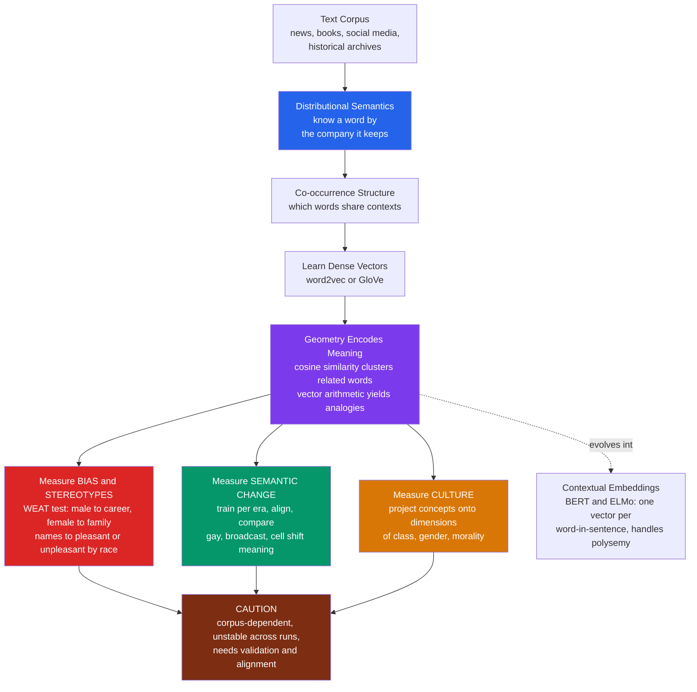

# 🗺️ Word Embeddings and Semantic Change

> [!abstract] TL;DR
> **Word embeddings** learn each word's meaning from **"the company it keeps"** — the principle of **distributional semantics** (Firth) — representing every word as a **dense vector** in a high-dimensional space where **geometry encodes meaning**: words used in similar contexts land close together (**cosine similarity** captures relatedness), and *relations* become *directions*, so that vector arithmetic yields analogies (**king − man + woman ≈ queen**; **Paris − France + Japan ≈ Tokyo**). Trained by **word2vec** (Mikolov) and **GloVe** (Pennington), embeddings are a foundational NLP tool — but for computational social science they are something rarer: a **measurement instrument for meaning, culture, and bias**. Because they absorb the associations of human text, they *capture the cultural stereotypes baked into language* — the **WEAT** (Word-Embedding Association Test) reveals gender and racial biases at scale ("semantics derived automatically from language corpora contain human-like biases," Caliskan et al.), a warning that **AI inherits these biases**. Trained separately on different eras' text, **diachronic embeddings** *measure semantic change* — tracking how words like **"gay," "broadcast," "cell"** shifted meaning, and how a century of stereotypes evolved (Garg et al.; Hamilton et al.). And **"the geometry of culture"** (Kozlowski et al.) extracts dimensions like class, gender, and morality directly from embedding space. Powerful, but corpus-dependent and unstable — a distinctive paradigm that demands validation.

---

## Intuition

**Analogy:** Imagine you could draw the entire **meaning of a language as a map** — a vast landscape where every word is a location. On this map, **"king" and "queen" sit close together**, "dog" is near "cat," and "January" clusters with the other months. More startlingly, the *directions* between places are meaningful: the arrow from **"France" to "Paris"** points the same way as the arrow from **"Japan" to "Tokyo"** (the "capital-of" direction), and the arrow from "man" to "woman" is the same as the one from "king" to "queen" (the "gender" direction). Meaning has become **geometry** — and you can *navigate* it with arithmetic.

Word embeddings build exactly this map, and they build it in the most unsupervised way imaginable: purely by reading which words appear near which others in billions of sentences. No dictionary, no human labels — just **"you shall know a word by the company it keeps."** For a social scientist this is dynamite. The same map that puts "man" near "doctor" and "woman" near "nurse" is silently recording a **society's stereotypes**. And if you draw two maps — one from 1900s text and one from 2000s text — and watch a word *drift* from one neighborhood to another, you are measuring **cultural and linguistic change** as a distance in space. Embeddings turn the meanings, prejudices, and evolving associations of a culture into something you can **measure with a ruler**.

---

## How It Works

### Core mechanics

**1. The distributional hypothesis.** The foundation is a deceptively simple linguistic idea: **a word's meaning is captured by the contexts it appears in.** "Cello" and "violin" *mean* similar things because they occur near the same words (orchestra, string, bow, play). Firth's slogan — *"you shall know a word by the company it keeps"* — becomes a computational recipe: measure each word's typical company, and words with similar company get similar representations. This is **distributional semantics**, and it is the engine behind the whole enterprise (see [[Lexical_Semantics]] and [[Semantic_Theory]] for the linguistic theory it operationalizes).

**2. From co-occurrence to dense vectors.** Naively, you could describe a word by a giant sparse count vector — how often it co-occurs with every other word. Embeddings **compress** this into a **dense, low-dimensional vector** (typically 100–300 numbers) that preserves the co-occurrence structure. **word2vec** (Mikolov et al., 2013) does this with a shallow neural net trained to *predict a word's context from the word* (skip-gram) or vice versa (CBOW). **GloVe** (Pennington et al., 2014) instead directly factorizes a global co-occurrence matrix. Levy and Goldberg showed these are deeply related — word2vec is implicitly factorizing a (shifted, positive) **pointwise-mutual-information** matrix — which is why the toy demo below reaches the same result with plain co-occurrence and SVD. All three routes land in the same place: **meaning as a point in space.**

**3. Geometry encodes meaning.** Two emergent properties made embeddings famous:
- **Similarity = proximity.** The **cosine** of the angle between two word vectors measures semantic relatedness. Synonyms and topically related words cluster; unrelated words are near-orthogonal. This is the workhorse operation for social measurement — "how associated is *immigrant* with *crime*?" becomes a cosine.
- **Relations = directions.** Regularities in the data show up as *consistent offset vectors*. The famous result **king − man + woman ≈ queen** means the "royalty" and "gender" relationships are stable directions you can add and subtract. Analogies fall out of arithmetic, and *any* social relation encoded in language — occupation-to-gender, group-to-trait — becomes a direction you can project onto.

**4. Bias as measurement (WEAT).** Because embeddings faithfully absorb *human* text, they inherit its **cultural associations** — including stereotypes. Caliskan, Bryson, and Narayanan (2017) built the **Word-Embedding Association Test (WEAT)**, an embedding analog of psychology's Implicit Association Test: it measures whether one set of *target* words (e.g., male vs. female terms) is more geometrically associated with one set of *attribute* words (e.g., **career** vs. **family**, or **science** vs. **arts**) than another. Embeddings reproduce documented human biases — **male↔career/science, female↔family/arts**, and pleasant/unpleasant associations that differ by racial name — turning a bag of text into a **quantitative measure of societal prejudice** (Bolukbasi et al.'s "Man is to Computer Programmer as Woman is to Homemaker"). Garg et al. (2018) scaled this to **100 years** of text, measuring how gender and ethnic stereotypes shifted across the 20th century.

**5. Semantic change (diachronic embeddings).** Train embeddings *separately* on text from different **time periods**, **align** the spaces (they come out arbitrarily rotated, so an orthogonal Procrustes alignment is required), and compare each word's position. A word's **displacement** between eras measures how much its meaning changed. Hamilton, Leskovec, and Jurafsky (2016) used this to trace **"gay"** (cheerful → homosexual), **"broadcast"** (scatter seeds → transmit), and **"cell"** (biology/prison → mobile phone), and discovered *statistical laws* of semantic change. This is the **computational history of meaning** — and it extends to political and social words ("liberal," "welfare") and to tracking evolving attitudes.

**6. The geometry of culture.** Kozlowski, Taddy, and Evans (2019) generalized the analogy trick into a **measurement paradigm for cultural sociology**: construct a **cultural dimension** (e.g., the "affluence" axis as *rich − poor*, or a "gender" axis) and **project** concepts onto it to ask how *sports*, *foods*, or *occupations* are classed and gendered in the collective mind. Embeddings become a **microscope on shared meaning** (a natural companion to [[Culture_Norms_Values_and_Ideology]]).

**7. The contextual-embedding evolution.** Classic embeddings are **static** — one vector per word, so "bank" (river vs. money) is forced into a single blurry point. **Contextual embeddings** (ELMo, then **BERT**) give a word a *different* vector in every sentence, resolving polysemy and capturing meaning-in-context far better. They are state of the art for text *classification* and *representation*, but harder to interpret and to use for the classic association/change analyses (there is no single "vector for *gay*" to track over time). For much social measurement, static embeddings remain the more legible instrument — a genuine trade-off.

### The pipeline, from corpus to social measurement



---

## Key Concepts

### Secondary Level

**The idea in one sentence.** A word embedding is a way of turning every word into a **list of numbers** (a point on a map) so that words meaning similar things end up **close together** — and the computer figures this out entirely by noticing which words tend to appear near which others.

**Why the map is amazing.** On this map you can do *word math*: start at "king," subtract "man," add "woman," and you land almost exactly on "queen." The direction that means "make it female" or "make it a capital city" is a real arrow you can follow.

**Why social scientists care.** The map is built from *human* writing, so it quietly records what a society *associates* with what. If the text people wrote puts "nurse" near "woman" and "engineer" near "man," the map shows it — letting researchers **measure stereotypes** hidden in language. And if you build one map from old books and one from new books, you can *watch words change meaning* (like "gay" going from "cheerful" to describing sexual orientation).

**The catch.** The map only reflects *the text it was fed*. Feed it biased or unusual text and you get a biased or unusual map — so you always have to ask *whose language* built it.

### Undergraduate Level

- **Distributional hypothesis.** The core assumption: words appearing in **similar contexts** have **similar meanings**. Embeddings are this hypothesis made numerical.
- **Static embeddings.** **word2vec** (skip-gram / CBOW, negative sampling) and **GloVe** (matrix factorization) produce **one vector per word type**. Fast, interpretable, the standard tool for social-science association analysis.
- **Cosine similarity vs. Euclidean distance.** Semantic relatedness is measured by the **angle** between vectors (cosine), not raw distance, because vector *length* mostly tracks word frequency, not meaning.
- **Analogies as vector offsets.** `a : b :: c : ?` is solved by finding the word nearest to `vec(b) − vec(a) + vec(c)`. The regularity exists because relations recur as parallel offsets in the training data.
- **WEAT (Word-Embedding Association Test).** For target sets X, Y and attribute sets A, B, define each word's association `s(w) = mean cos(w, A) − mean cos(w, B)`; the **effect size** `d = (mean s over X − mean s over Y) / pooled std` quantifies differential association, with a **permutation test** for significance. This is the standard *bias measurement* protocol.
- **Diachronic embeddings.** Train per time-slice; because separately-trained spaces are arbitrarily rotated, **align** them (orthogonal Procrustes) before comparing; a word's cross-era **cosine displacement** measures semantic change.
- **Corpus dependence.** The embedding *is* a summary of its corpus. Google News, Wikipedia, historical newspapers, and a subreddit produce *different* geometries — and therefore different measured biases and meanings. The measure reflects the training text (a theme shared with [[Measurement_and_Validity_in_Digital_Data]]).

### Graduate Level

- **word2vec as implicit matrix factorization.** Levy and Goldberg (2014) proved skip-gram with negative sampling implicitly factorizes a **shifted positive PMI** matrix — unifying "neural" embeddings with classic count-based **distributional semantics** and explaining why SVD on PMI counts reproduces the same geometry (as the demo does).
- **Why analogies work — and why they are overstated.** The parallelogram structure emerges from consistent co-occurrence offsets, but the canonical `king − man + woman` result is partly an artifact of the standard evaluation, which **excludes the input words** from the answer set. Without that exclusion, the nearest vector is often just "king" again. Analogy accuracy is real but **oversold**; treat it as illustrative, not as proof of clean linear structure.
- **WEAT as a validated cultural measure.** Caliskan et al. replicated *documented IAT effect sizes* from embeddings — evidence of **criterion validity** for embeddings as a bias instrument. But results are **corpus-specific**; a WEAT run on one corpus does not license claims about "language in general." Garg et al. further validated embedding-derived gender associations against **occupation-participation statistics** and census data over decades.
- **Alignment and the stability problem.** Diachronic comparison requires solving the **orthogonal Procrustes** problem to rotate one era's space onto another's shared vocabulary. Compounding this, embeddings are **stochastically unstable** — the same corpus with a different random seed, subsampling, or window size yields different nearest-neighbor lists (Antoniak and Mimno, 2018). Robust findings require **multiple runs**, bootstrap over documents, and reporting **variance**, not a single point estimate.
- **The geometry of culture.** Kozlowski et al. formalize **cultural dimensions** as normalized difference vectors between antonym pairs (rich−poor, man−woman, moral−immoral), then project concepts onto them, showing the resulting "class" and "gender" loadings of concepts correlate with **survey-elicited** human ratings — an argument that embedding geometry *recovers shared cultural schemas*, not just linguistic noise.
- **Static vs. contextual for social measurement.** BERT-style contextual models capture polysemy and outperform on classification, but their per-token, context-dependent vectors lack a single stable "word meaning" to track diachronically or to WEAT cleanly (though SEAT/CEAT adapt the idea). The field balances **interpretability and stability** (static) against **contextual fidelity** (contextual) — an active methodological frontier, and one that links directly to the forthcoming *Large_Language_Models_in_Social_Science*.

---

## Python Demo

```python
# Word embeddings as a SOCIAL-SCIENCE measurement instrument, on toy vectors:
#   (A) GEOMETRY = MEANING : similar words cluster; the analogy
#       king - man + woman ~ queen falls out of vector arithmetic.
#   (B) BIAS as MEASUREMENT: a WEAT-style test shows occupation/attribute
#       words sit closer to one gender than the other -- societal bias
#       captured in language (Caliskan et al.; Bolukbasi et al.).
#   (C) SEMANTIC CHANGE   : across two eras' corpora a word's neighbors
#       shift -- "gay", "broadcast", "cell" change meaning (Hamilton et al.).
# A real word2vec/GloVe DISCOVERS these axes from co-occurrence; here we set
# them so the geometry is legible, then add noise so analogies hold only
# APPROXIMATELY, exactly as in trained embeddings.
import numpy as np
import matplotlib
matplotlib.use("Agg")
import matplotlib.pyplot as plt

rng = np.random.default_rng(7)

def unit(v):
    v = np.asarray(v, dtype=float)
    n = np.linalg.norm(v)
    return v / n if n else v

def cos(a, b):
    return float(np.dot(unit(a), unit(b)))

# =====================================================================
# (A) EMBEDDING GEOMETRY AND ANALOGIES
#     dims = [royalty, gender(male+/female-), person, france, japan, capital]
# =====================================================================
base = {
    "king":     [1.00,  0.60, 0.00, 0, 0, 0.0],
    "queen":    [1.00, -0.60, 0.00, 0, 0, 0.0],
    "prince":   [0.85,  0.60, 0.20, 0, 0, 0.0],
    "princess": [0.85, -0.60, 0.20, 0, 0, 0.0],
    "man":      [0.00,  0.60, 1.00, 0, 0, 0.0],
    "woman":    [0.00, -0.60, 1.00, 0, 0, 0.0],
    "boy":      [0.00,  0.50, 0.90, 0, 0, 0.0],
    "girl":     [0.00, -0.50, 0.90, 0, 0, 0.0],
    "france":   [0, 0, 0, 1.00, 0.00, 0.00],
    "paris":    [0, 0, 0, 1.00, 0.00, 0.90],
    "japan":    [0, 0, 0, 0.00, 1.00, 0.00],
    "tokyo":    [0, 0, 0, 0.00, 1.00, 0.90],
}
words = list(base)
E = np.array([base[w] for w in words], float)
E = E + rng.normal(0, 0.03, E.shape)             # small "training" noise
V = {w: E[i] for i, w in enumerate(words)}

def analogy(a, b, c, k=1):
    # "a is to b as c is to ?"  ->  nearest word to (a - b + c)
    tgt = unit(V[a]) - unit(V[b]) + unit(V[c])
    cand = [w for w in V if w not in {a, b, c}]   # exclude the input words
    return sorted(cand, key=lambda w: cos(tgt, V[w]), reverse=True)[:k]

ana1 = analogy("king", "man", "woman")[0]        # -> queen
ana2 = analogy("paris", "france", "japan")[0]    # -> tokyo

# 2-D projection of the whole space via SVD (for the cluster plot)
P2 = np.linalg.svd(E - E.mean(0), full_matrices=False)[0][:, :2] \
     * np.linalg.svd(E - E.mean(0), full_matrices=False)[1][:2]

# =====================================================================
# (B) BIAS AS MEASUREMENT -- a WEAT-style test
#     dims = [gender(male+/female-), career, family, science, arts]
#     LEAN = the SOCIETAL bias baked into the corpus (career/science skew
#     male, family/arts skew female) -- what WEAT is designed to detect.
# =====================================================================
LEAN = 0.40
spec = {
    "male": [1,0,0,0,0], "man": [1,0,0,0,0], "boy": [1,0,0,0,0],
    "brother": [1,0,0,0,0], "he": [1,0,0,0,0], "son": [1,0,0,0,0],
    "female": [-1,0,0,0,0], "woman": [-1,0,0,0,0], "girl": [-1,0,0,0,0],
    "sister": [-1,0,0,0,0], "she": [-1,0,0,0,0], "daughter": [-1,0,0,0,0],
    "executive": [LEAN,1,0,0,0], "management": [LEAN,1,0,0,0],
    "professional": [LEAN,1,0,0,0], "salary": [LEAN,1,0,0,0],
    "office": [LEAN,1,0,0,0], "business": [LEAN,1,0,0,0],
    "home": [-LEAN,0,1,0,0], "parents": [-LEAN,0,1,0,0],
    "children": [-LEAN,0,1,0,0], "family": [-LEAN,0,1,0,0],
    "marriage": [-LEAN,0,1,0,0], "wedding": [-LEAN,0,1,0,0],
    "science": [LEAN,0,0,1,0], "technology": [LEAN,0,0,1,0],
    "engineering": [LEAN,0,0,1,0], "math": [LEAN,0,0,1,0], "physics": [LEAN,0,0,1,0],
    "art": [-LEAN,0,0,0,1], "poetry": [-LEAN,0,0,0,1], "dance": [-LEAN,0,0,0,1],
    "literature": [-LEAN,0,0,0,1], "music": [-LEAN,0,0,0,1],
}
B = {w: np.array(v, float) + rng.normal(0, 0.03, len(v)) for w, v in spec.items()}
male_t   = ["male", "man", "boy", "brother", "he", "son"]
female_t = ["female", "woman", "girl", "sister", "she", "daughter"]
career   = ["executive", "management", "professional", "salary", "office", "business"]
family   = ["home", "parents", "children", "family", "marriage", "wedding"]
science  = ["science", "technology", "engineering", "math", "physics"]
arts     = ["art", "poetry", "dance", "literature", "music"]

def assoc(w, A, Bset):
    return (np.mean([cos(B[w], B[a]) for a in A])
            - np.mean([cos(B[w], B[b]) for b in Bset]))

def weat(X, Y, A, Bset):
    sx = np.array([assoc(w, A, Bset) for w in X])
    sy = np.array([assoc(w, A, Bset) for w in Y])
    d = (sx.mean() - sy.mean()) / np.concatenate([sx, sy]).std()
    pooled, n, obs = np.concatenate([sx, sy]), len(X), sx.sum() - sy.sum()
    perm = [(p := rng.permutation(pooled))[:n].sum() - p[n:].sum() for _ in range(2000)]
    return d, sx, sy, float(np.mean(np.array(perm) >= obs))

d_cf, sx_cf, sy_cf, p_cf = weat(male_t, female_t, career, family)
d_sa, sx_sa, sy_sa, p_sa = weat(male_t, female_t, science, arts)

# =====================================================================
# (C) SEMANTIC CHANGE -- diachronic embeddings, two eras
#     dims = [cheerful, sexuality, transmit, scatter/agri, biology, phone]
# =====================================================================
anchor = {
    "happy": [1,0,0,0,0,0], "cheerful": [1,0,0,0,0,0], "merry": [1,0,0,0,0,0],
    "homosexual": [0,1,0,0,0,0], "lesbian": [0,1,0,0,0,0], "queer": [0,1,0,0,0,0],
    "television": [0,0,1,0,0,0], "radio": [0,0,1,0,0,0], "signal": [0,0,1,0,0,0],
    "sow": [0,0,0,1,0,0], "seeds": [0,0,0,1,0,0], "scatter": [0,0,0,1,0,0],
    "tissue": [0,0,0,0,1,0], "organism": [0,0,0,0,1,0], "biology": [0,0,0,0,1,0],
    "phone": [0,0,0,0,0,1], "mobile": [0,0,0,0,0,1], "wireless": [0,0,0,0,0,1],
}
A6 = {w: np.array(v, float) + rng.normal(0, 0.03, len(v)) for w, v in anchor.items()}
t1900 = {"gay": [1,0,0,0,0,0], "broadcast": [0,0,0,1,0,0], "cell": [0,0,0,0,1,0]}
t2000 = {"gay": [0,1,0,0,0,0], "broadcast": [0,0,1,0,0,0], "cell": [0,0,0,0,0,1]}
T1 = {w: np.array(v, float) + rng.normal(0, 0.03, len(v)) for w, v in t1900.items()}
T2 = {w: np.array(v, float) + rng.normal(0, 0.03, len(v)) for w, v in t2000.items()}

def nn(vec, k=3):
    return sorted(anchor, key=lambda w: cos(vec, A6[w]), reverse=True)[:k]

change = {w: 1 - cos(T1[w], T2[w]) for w in T1}   # semantic displacement

# ----------------------------- REPORT --------------------------------
print("=" * 66)
print("(A) GEOMETRY ENCODES MEANING")
print(f"    king  - man   + woman  -> {ana1}")
print(f"    paris - france+ japan  -> {ana2}")
print(f"    cos(king,queen)={cos(V['king'],V['queen']):.2f}   "
      f"cos(paris,tokyo)={cos(V['paris'],V['tokyo']):.2f}   "
      f"cos(king,paris)={cos(V['king'],V['paris']):.2f}")
print("(B) WEAT BIAS (Cohen's d, larger = stronger stereotype)")
print(f"    career vs family : d = {d_cf:+.2f}  p = {p_cf:.3f}  (male->career)")
print(f"    science vs arts  : d = {d_sa:+.2f}  p = {p_sa:.3f}  (male->science)")
print("(C) SEMANTIC CHANGE: nearest neighbors then -> now")
for w in ["gay", "broadcast", "cell"]:
    print(f"    {w:<9} 1900:{nn(T1[w])}  2000:{nn(T2[w])}  shift={change[w]:.2f}")

# ----------------------------- FIGURE --------------------------------
fig, ax = plt.subplots(2, 2, figsize=(14, 11))
fig.suptitle("Word embeddings as a social-science instrument: "
             "meaning, bias, and semantic change", fontsize=13, fontweight="bold")

# Panel (0,0): the embedding space clusters by meaning
gcol = {**{w: "#7c3aed" for w in ["king","queen","prince","princess"]},
        **{w: "#2563eb" for w in ["man","woman","boy","girl"]},
        **{w: "#059669" for w in ["france","paris","japan","tokyo"]}}
axA = ax[0, 0]
for i, w in enumerate(words):
    axA.scatter(P2[i, 0], P2[i, 1], color=gcol[w], s=70, zorder=3)
    axA.annotate(w, (P2[i, 0], P2[i, 1]), fontsize=8,
                 xytext=(4, 3), textcoords="offset points")
axA.set_title("(A) Geometry encodes meaning\nsimilar words cluster "
              "(2-D SVD projection)", fontsize=10)
axA.set_xlabel("component 1"); axA.set_ylabel("component 2"); axA.grid(alpha=0.25)

# Panel (0,1): the analogy IS a direction (royalty x gender plane)
axB = ax[0, 1]
for w in ["king","queen","man","woman","prince","princess","boy","girl"]:
    c = "#7c3aed" if w in {"king","queen","prince","princess"} else "#2563eb"
    axB.scatter(V[w][0], V[w][1], color=c, s=70, zorder=3)
    axB.annotate(w, (V[w][0], V[w][1]), fontsize=8,
                 xytext=(4, 3), textcoords="offset points")
for a, b in [("man","king"), ("woman","queen")]:      # parallel "royalty" arrows
    axB.annotate("", xy=(V[b][0], V[b][1]), xytext=(V[a][0], V[a][1]),
                 arrowprops=dict(arrowstyle="->", color="#dc2626", lw=1.8))
axB.set_title(f"(A) The analogy is a direction\n"
              f"king - man + woman = {ana1}   |   "
              f"paris - france + japan = {ana2}", fontsize=9)
axB.set_xlabel("royalty axis"); axB.set_ylabel("gender axis  (male + / female -)")
axB.grid(alpha=0.25)

# Panel (1,0): WEAT bias -- career vs family association per target word
axC = ax[1, 0]
labels = male_t + female_t
vals = list(sx_cf) + list(sy_cf)
cols = ["#2563eb"] * len(male_t) + ["#dc2626"] * len(female_t)
order = np.argsort(vals)
labels = [labels[i] for i in order]; vals = [vals[i] for i in order]
cols = [cols[i] for i in order]
axC.barh(range(len(labels)), vals, color=cols, edgecolor="black")
axC.axvline(0, color="black", lw=0.9)
axC.set_yticks(range(len(labels))); axC.set_yticklabels(labels, fontsize=8)
axC.set_title(f"(B) WEAT: stereotypes baked into language\n"
              f"career vs family  d = {d_cf:.2f}, p = {p_cf:.3f}  "
              f"(blue = male terms)", fontsize=9)
axC.set_xlabel("association  s(w)      family  <-  0  ->  career")
axC.grid(alpha=0.25, axis="x")

# Panel (1,1): semantic change -- "gay" moves between neighborhoods
axD = ax[1, 1]
for w in ["happy","cheerful","merry"]:
    axD.scatter(A6[w][0], A6[w][1], color="#f59e0b", s=50)
    axD.annotate(w, (A6[w][0], A6[w][1]), fontsize=7.5,
                 xytext=(3, 2), textcoords="offset points")
for w in ["homosexual","lesbian","queer"]:
    axD.scatter(A6[w][0], A6[w][1], color="#7c3aed", s=50)
    axD.annotate(w, (A6[w][0], A6[w][1]), fontsize=7.5,
                 xytext=(3, 2), textcoords="offset points")
g1, g2 = (T1["gay"][0], T1["gay"][1]), (T2["gay"][0], T2["gay"][1])
axD.scatter(*g1, color="#dc2626", s=140, marker="*", zorder=4)
axD.scatter(*g2, color="#dc2626", s=140, marker="*", zorder=4)
axD.annotate("gay (1900)", g1, fontsize=8, xytext=(6, -10), textcoords="offset points")
axD.annotate("gay (2000)", g2, fontsize=8, xytext=(6, 6), textcoords="offset points")
axD.annotate("", xy=g2, xytext=g1,
             arrowprops=dict(arrowstyle="->", color="#dc2626", lw=1.8, ls="--"))
axD.set_title(f"(C) Semantic change: 'gay' shifts neighborhoods\n"
              f"cosine displacement = {change['gay']:.2f}  "
              f"(cheerful -> sexuality)", fontsize=9)
axD.set_xlabel("'cheerful / happy' axis"); axD.set_ylabel("'sexuality' axis")
axD.grid(alpha=0.25)

plt.tight_layout(rect=[0, 0, 1, 0.96])
plt.savefig("word_embeddings_and_semantic_change.png", dpi=120, bbox_inches="tight")
plt.show()
```

**What the demo shows:**

- **Panel A — geometry encodes meaning.** In the SVD projection, royalty words, people words, and geography words fall into **separate clusters** with no labels ever supplied — meaning emerges from structure alone. `cos(king, queen)` and `cos(paris, tokyo)` are high (they share latent axes: *royalty*, *capital-ness*), while `cos(king, paris)` is near zero.
- **Panel A′ — the analogy is a direction.** On the royalty×gender plane, the arrows *man→king* and *woman→queen* are **parallel** (both are the "royalty" offset), which is *why* `king − man + woman` lands on **queen** and `paris − france + japan` lands on **tokyo**. Relations are geometry.
- **Panel B — bias as measurement.** The WEAT bars show male terms (blue) associating with **career** and female terms (red) with **family**, yielding a large positive effect size `d` with a significant permutation p-value — the same protocol that revealed real gender and racial stereotypes in Google News and web-crawl embeddings. The bias was never coded by hand; it was *measured out of the corpus's geometry*.
- **Panel C — semantic change.** Trained on "1900" text, **"gay"** sits among *happy/cheerful/merry*; trained on "2000" text, it moves next to *homosexual/lesbian/queer*. The **cosine displacement** near 1.0 quantifies the shift — the same signal Hamilton et al. used to trace "broadcast" and "cell" and to uncover statistical laws of how meaning drifts.

---

## Real-World Applications

> **Measuring and dating stereotypes at century scale.** Garg, Schiebinger, Jurafsky, and Zou (2018) trained embeddings on Google Books and Corpus of Historical American English across the 20th century and showed embedding-derived gender and ethnic associations track **census occupation participation** and mirror documented shifts (e.g., attitudes toward Asian Americans around WWII and the 1960s) — embeddings as a *quantitative history of prejudice*, feeding directly into the forthcoming *Measuring_Culture_and_Ideology_from_Text* and *Cultural_Evolution_and_Historical_Dynamics*.

> **The geometry of culture.** Kozlowski, Taddy, and Evans (2019) extract "class," "gender," and "morality" dimensions from embeddings and show that concepts like *sports*, *music genres*, and *foods* load onto them in ways matching survey respondents — reconstructing shared **cultural schemas** from text alone, a landmark for computational cultural sociology alongside [[Culture_Norms_Values_and_Ideology]].

> **Auditing AI for inherited bias.** Because production NLP — search, résumé screening, translation, chatbots — is built on embeddings and their descendants, the biases WEAT reveals are the biases these systems **inherit and amplify**. Bolukbasi et al.'s debiasing work and the whole [[Algorithmic_Fairness_and_Bias]] agenda begin from this measurement (see also [[AI_Bias_and_Fairness]] and [[AI_Ethics_Overview]]).

> **Tracking political and social meaning.** Embeddings trained on congressional speech, party manifestos, or news corpora measure how framed terms ("welfare," "immigration," "freedom") shift in connotation across time and across ideological communities — connecting to the vault's forthcoming *Sentiment_Emotion_and_Stance_Analysis* and to measures of polarization in [[Opinion_Dynamics_and_Polarization]].

> **Computational lexical semantics.** For linguists, diachronic embeddings operationalize theories of semantic change (broadening, narrowing, pejoration) at scale, complementing [[Lexical_Semantics]], [[Language_Change_and_Diffusion]], and [[Corpus_Linguistics]] with a quantitative instrument.

> **Enriching downstream text-as-data.** As dense features, embeddings power document classification, semantic search, and clustering — the substrate beneath the vault's *Topic_Models_and_Document_Classification* and the broader *Text_as_Data_in_Social_Science* toolkit.

---

## Common Pitfalls

- **Treating the embedding as "language," not "this corpus."** An embedding *is* a compressed summary of its training text. Bias and meaning measured on Google News, r/politics, and 1890s newspapers will legitimately differ. Always report **whose text** built the space, and never generalize a corpus-specific WEAT to "society" without justification (a construct-validity problem shared with [[Measurement_and_Validity_in_Digital_Data]]).
- **Overselling analogies.** `king − man + woman ≈ queen` is real but flattered by an evaluation that **excludes the input words**. Linear analogy structure is noisy and relation-dependent; do not present it as proof that embeddings "understand" relations.
- **Ignoring instability across runs.** Embeddings vary with random seed, window size, dimensionality, and subsampling; nearest-neighbor lists can reshuffle. Findings from a **single trained model** are fragile — bootstrap over documents, run multiple seeds, and report variance (Antoniak & Mimno).
- **Skipping alignment in diachronic studies.** Separately-trained era-spaces are arbitrarily rotated; comparing them *without* an orthogonal Procrustes alignment measures rotation, not meaning. Anchor on shared, stable-meaning words.
- **Frequency and rare-word artifacts.** Very rare words get noisy, unreliable vectors; frequency affects vector norm and neighbor structure. Filter low-count words and prefer cosine over raw distance.
- **Confusing correlation of meaning with causation of attitude.** A strong *immigrant↔crime* association in text measures **discursive association**, not that any individual believes it or that it causes behavior. Embeddings measure *language*, which is evidence about culture, not a direct readout of minds.
- **Assuming contextual models fix everything.** BERT-style embeddings handle polysemy better but sacrifice the single stable per-word vector that makes classic WEAT and diachronic tracking interpretable; choosing static vs. contextual is a deliberate trade-off, not an upgrade.

---

## Related Concepts

**The NLP / AI-ML foundations (what embeddings *are*):**

- [[Word_Embeddings]] — the core AI-ML treatment of dense vector representations that this note applies to social measurement.
- [[Word2Vec]] — the skip-gram / CBOW algorithm (Mikolov) most used to quantify semantic and cultural change in corpora.
- [[BERT]] — the contextual-embedding evolution that gives each word a context-dependent vector, handling polysemy.
- [[Transformer_Architecture]] — the architecture underlying contextual embeddings and modern language models.
- [[Text_Preprocessing]] — tokenization and cleaning, the first step of any embedding pipeline over social text.
- [[Language_Model_Basics]] — the language-modeling objective from which embeddings and their successors are learned.
- [[AI_Bias_and_Fairness]] — the machine-learning fairness agenda that embedding-bias measurement helped ignite.

**The mathematics of the space:**

- [[Vectors_and_Vector_Spaces]] — vectors, dot products, and cosine similarity, the geometry that makes meaning measurable.
- [[PCA]] — the dimensionality-reduction / SVD machinery used to compress co-occurrence and to project embeddings to 2-D.
- [[Eigenvalues_and_Eigenvectors]] — the spectral foundation of the matrix factorizations behind GloVe and PMI-SVD embeddings.

**The linguistics of meaning and change:**

- [[Lexical_Semantics]] — the theory of word meaning that distributional embeddings operationalize.
- [[Semantic_Theory]] — formal accounts of meaning against which the distributional approach is contrasted.
- [[Language_Change_and_Diffusion]] — how word meanings and forms shift over time, measured here as embedding displacement.
- [[Corpus_Linguistics]] — the corpus-based tradition of studying language from real usage, the empirical parent of embeddings.
- [[Computational_Linguistics]] — the field bridging linguistic theory and the algorithms that build embeddings.
- [[Cognitive_Semantics_and_Metaphor]] — meaning as structured mental space, a conceptual cousin to the geometric view.

**Culture, cognition, and ethics (why it matters socially):**

- [[Culture_Norms_Values_and_Ideology]] — the sociological constructs that "the geometry of culture" extracts from embedding space.
- [[Media_Culture_and_Cultural_Industries]] — the discourse whose framings and connotations embeddings can measure.
- [[Algorithmic_Fairness_and_Bias]] — the ethics agenda addressing the biases embeddings reveal and AI inherits.
- [[AI_Ethics_Overview]] — the broader ethical framing of biased AI systems trained on human text.
- [[Concepts_and_Categorization]] — how minds represent concepts, a cognitive analog to embedding geometry.
- [[Analogy_and_Conceptual_Metaphor]] — human analogical reasoning, echoed by vector-arithmetic analogies.
- [[Language_and_Cognition]] — the relationship between language and thought that distributional meaning touches.

**Method siblings in this vault:**

- [[Measurement_and_Validity_in_Digital_Data]] — the measurement-validity lens: an embedding is a *proxy* whose construct validity and corpus-dependence must be argued.
- [[Computational_Social_Science_Overview]] — the field map; this note is the embedding leg of its text-as-data pillar.
- [[Opinion_Dynamics_and_Polarization]] — a target phenomenon whose framing and connotation embeddings help quantify.

**Forthcoming siblings in this Text-as-Data section (planned, not yet written):** *Text_as_Data_in_Social_Science* (the overview this note sits under), *Topic_Models_and_Document_Classification*, *Sentiment_Emotion_and_Stance_Analysis*, *Large_Language_Models_in_Social_Science*, *Measuring_Culture_and_Ideology_from_Text*, and *Cultural_Evolution_and_Historical_Dynamics*.

---

## Review Questions

### Secondary

1. Explain, in your own words, how a computer can learn that "king" and "queen" mean similar things *without anyone ever telling it what either word means*. What does "you shall know a word by the company it keeps" mean here?
2. A researcher builds a word map from a huge pile of old text and finds "nurse" sitting close to "woman" and "engineer" close to "man." What is the map actually measuring — the way the world *is*, or the way people *wrote*? Why does the distinction matter?
3. The word "gay" sits near "cheerful" in 1900s text and near "homosexual" in 2000s text. How could you *measure* that this word changed meaning, using the idea of distance on the map?

### Undergraduate

1. Define the **WEAT** effect size and describe the four ingredients it needs (two target sets and two attribute sets). Design a WEAT that would test whether a corpus associates a particular ethnic-name set with "pleasant" versus "unpleasant" words, and state what a large positive effect size would and would *not* let you conclude.
2. Why must you **align** two separately-trained era-specific embedding spaces before comparing them, and what goes wrong if you skip alignment? What role do "stable-meaning" anchor words play?
3. Contrast **static** (word2vec/GloVe) and **contextual** (BERT) embeddings. Give one social-science task where static embeddings are the *better* instrument and explain why, referencing interpretability and stability.

### Graduate

1. Levy and Goldberg showed word2vec implicitly factorizes a shifted-PMI matrix. Explain why this result *unifies* "neural" embeddings with classic count-based distributional semantics, and why it justifies using PMI+SVD as a legitimate embedding method for social measurement.
2. You measure a WEAT gender-career bias of `d = 1.8` in a Twitter corpus and `d = 0.9` in a Wikipedia corpus. Walk through how **corpus dependence**, **run-to-run instability**, and **construct validity** each complicate the claim "society is biased." What specific robustness checks and external validations (à la Garg et al.) would you run before publishing?
3. Kozlowski et al. argue embedding geometry *recovers shared cultural schemas* and validate against survey ratings. Critically evaluate this claim: under what conditions does an embedding dimension (e.g., a "class" axis built from rich−poor) measure *collective culture* versus merely *lexical co-occurrence*? How would you design a study to distinguish the two, and what would count as evidence for the stronger, cultural interpretation?

---

## Sources

- [Mikolov, T., Chen, K., Corrado, G., & Dean, J. (2013). "Efficient Estimation of Word Representations in Vector Space." *arXiv:1301.3781*](https://arxiv.org/abs/1301.3781)
- [Pennington, J., Socher, R., & Manning, C. (2014). "GloVe: Global Vectors for Word Representation." *EMNLP 2014*](https://aclanthology.org/D14-1162/)
- [Bolukbasi, T., Chang, K.-W., Zou, J., Saligrama, V., & Kalai, A. (2016). "Man is to Computer Programmer as Woman is to Homemaker? Debiasing Word Embeddings." *NeurIPS 2016*](https://arxiv.org/abs/1607.06520)
- [Caliskan, A., Bryson, J. J., & Narayanan, A. (2017). "Semantics derived automatically from language corpora contain human-like biases." *Science* 356(6334), 183–186](https://doi.org/10.1126/science.aal4230)
- [Garg, N., Schiebinger, L., Jurafsky, D., & Zou, J. (2018). "Word embeddings quantify 100 years of gender and ethnic stereotypes." *PNAS* 115(16), E3635–E3644](https://doi.org/10.1073/pnas.1720347115)
- [Hamilton, W. L., Leskovec, J., & Jurafsky, D. (2016). "Diachronic Word Embeddings Reveal Statistical Laws of Semantic Change." *ACL 2016*](https://arxiv.org/abs/1605.09096)
- [Kozlowski, A. C., Taddy, M., & Evans, J. A. (2019). "The Geometry of Culture: Analyzing the Meanings of Class through Word Embeddings." *American Sociological Review* 84(5), 905–949](https://doi.org/10.1177/0003122419877135)

---

#computational-social-science #word-embeddings #semantic-change #bias-in-language #distributional-semantics
