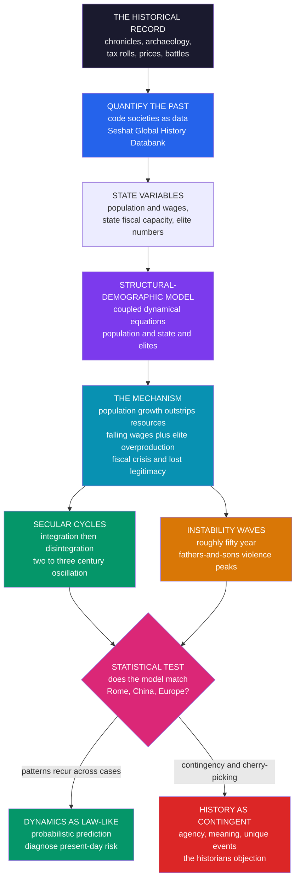

# 📜 Cliodynamics and Quantitative History

> [!abstract] TL;DR
> **Cliodynamics** — *"the dynamics of Clio, the muse of history"* — treats the human past as **data** and as the behavior of complex **dynamical systems**, seeking mathematical laws behind the rise and fall of societies rather than mere narrative. Championed by **Peter Turchin**, it pushes history from a purely **narrative, idiographic** discipline (*"one damned thing after another"*) toward a **nomothetic** science that models quantifiable variables — population, state fiscal capacity, inequality, elite numbers, warfare, instability — as coupled equations. Its flagship framework, the **structural-demographic theory** (building on Goldstone), explains long-run instability as the interaction of **population pressure**, the **state**, and **elite overproduction** (too many elite aspirants competing for limited positions), generating recurring **secular cycles** of integration and disintegration — documented across Rome, China, and Europe — with shorter roughly-50-year *"fathers-and-sons"* violence waves inside them. Powered by massive databases like **Seshat: The Global History Databank** and by the statistical study of war (**Richardson's** power-law of war sizes), cliodynamics controversially diagnoses present-day crisis (rising inequality plus elite overproduction plus declining legitimacy — Turchin's *End Times* forecast). It is a bold, contested attempt to make history a **predictive science** that sharpens the deep debate: is the past **law-governed and forecastable**, or fundamentally **contingent**? — a signature frontier of computational social science extended across millennia.

---

## Intuition

**Analogy:** For centuries, history was told as a story of great men and unique events — one darned thing after another, defying any law. A king chooses war; a plague arrives; an empire falls. Zoom in on the individuals and you see only accident and will. But zoom *out* — from the actors to the **centuries** — and something startling appears: empires rise and fall in rhythmic cycles, waves of violence recur roughly every fifty years, societies boom and then convulse in patterns that repeat across continents and millennia. The individual raindrops are unpredictable, yet the **weather systems** are not.

That is the wager of cliodynamics. A meteorologist cannot tell you whether a specific cloud will rain, but she can read the pressure fronts and forecast the storm; a seismologist cannot name the day of the next quake, but she can map the stress accumulating along the fault. **Cliodynamics asks whether history has its own equivalent of those pressure fronts** — measurable forces (population outrunning resources, elites multiplying faster than the positions that can hold them, a state running out of money and legitimacy) that build until a society convulses, resets, and begins the climb again. Treat the past as data, fit the dynamics, and maybe — like climate, not like a coin flip — you can *predict the pressure* even if you can never predict the raindrop.

---

## How It Works

Cliodynamics is the deliberate move from **narrative** to **model**. Traditional history explains a collapse by narrating *this* rebellion, *that* bad harvest, *this* incompetent ruler. Cliodynamics instead asks whether many collapses share a common **generative mechanism** — a small set of interacting variables whose dynamics produce crisis again and again, regardless of the local story. It does this in four moves.

### 1. Quantify the past

The raw material is the historical record turned into numbers: population estimates, real wages, grain prices, the size of the elite (office-holders, nobles, credentialed aspirants), state revenue and debt, and counts of political violence (riots, assassinations, civil wars). Where the traditional historian reads a chronicle, the cliodynamicist **codes** it into time series. At scale this becomes a database — the **Seshat: Global History Databank** codes hundreds of variables (social complexity, military technology, governance, ritual, money) for hundreds of past polities across millennia, turning "big history" into a testable dataset. (This empirical engine, and what it reveals about the evolution of social complexity, is the subject of the forthcoming *The_Evolution_of_Social_Complexity* and *Long_Run_Economic_and_Population_History*.)

### 2. Fit a dynamical model — structural-demographic theory

Turchin's central framework, the **structural-demographic theory (SDT)** (extending Jack Goldstone's work on early-modern revolutions), models a society as three interacting subsystems — the **general population**, the **state** (fiscal capacity and legitimacy), and the **elites** — whose interaction drives a recurring instability cycle:

1. In a stable phase, population **grows**.
2. Growth eventually **outstrips resources**: real wages fall, the commoners are immiserated, and a surplus is skimmed by those above them.
3. That surplus fuels **elite overproduction** — the number of wealthy, educated, credentialed aspirants to elite status swells faster than the positions and power available to absorb them.
4. Too many elites chasing too few chairs produces intensifying **intra-elite competition and factionalism**, and a state squeezed between elite demands and a shrinking tax base slides into **fiscal crisis and lost legitimacy**.
5. The combination — popular misery *plus* elite conflict *plus* state weakness — erupts as **political instability, violence, and collapse**.
6. The convulsion **culls the population and the elites**, resources become abundant again, and the cycle resets.

### 3. Read the output — secular cycles and instability waves

Run those interacting pressures forward and they generate the theory's flagship pattern: **secular cycles** (Turchin and Nefedov) — recurring **two-to-three-century** oscillations between **integration** (growth, order, rising population) and **disintegration** (crisis, civil war, decline) — documented across Rome, medieval and early-modern England and France, Russia, and China. Inside each secular cycle ride shorter **roughly fifty-year "fathers-and-sons" waves** of violence: a generation that survives bloodshed avoids conflict, its children forget, and violence returns about two generations later.

### 4. Test the "laws" — and argue about them

Coded databases let these claims be **statistically tested** rather than merely asserted: do the predicted variables really move together across independent cases? This is where cliodynamics collides with the historians' objection — that the human past is contingent, meaningful, and singular, and that fitting curves to it courts cherry-picking, spurious pattern, and "physics envy." The debate (nomothetic *"seek laws"* versus idiographic *"honor the particular"*) is genuine and unresolved, and it connects directly to the prediction-versus-explanation tension developed in [[Computation_and_Social_Theory]].



---

## Key Concepts

### Secondary Level

**History might have rhythms, like the seasons.** We usually learn history as a list of names and dates: this king, that war, this revolution. Each one feels like a surprise. **Cliodynamics** is the idea that if you step *way* back and look at hundreds of years at once, you start to see **patterns** — societies grow strong, then get crowded and unequal, then fall into trouble, then recover, and then it happens again. It is a little like how you cannot predict tomorrow's exact weather but you *can* predict that summer will be hotter than winter.

**Why would a society keep hitting the same wall?** Turchin's simple story:

| Stage | What happens |
|---|---|
| Good times | Population grows, things are stable |
| Getting crowded | Too many people, wages fall, life gets harder for ordinary folk |
| Too many chiefs | Too many rich and powerful people fighting over too few top spots |
| Broke government | The state runs out of money and respect |
| Crisis | Violence and breakdown — then a reset, and the cycle starts over |

**The big argument.** Some people find this exciting — maybe we can *warn* societies before a crisis, like a weather forecast. Others think it is too simple and that history is full of surprises and human choices that no equation can capture. Both sides have a point, and that argument is a big part of what makes cliodynamics interesting.

### Undergraduate Level

#### From idiographic to nomothetic history

Philosophers of history distinguish two ambitions. The **idiographic** ambition (the traditional one) is to understand each event in its **particular**, unrepeatable context — the French Revolution as *the* French Revolution. The **nomothetic** ambition (the scientific one) is to find **general laws** that hold across cases. Cliodynamics is a nomothetic bet: that beneath the singular events lie recurring **dynamics** you can model with the same tools used for populations, epidemics, and climate. It is the "quantitative turn" for the deep past, and it inherits an older lineage — **cliometrics** (Fogel and North's Nobel-winning quantitative economic history) and Wallerstein's world-systems analysis (see [[Big_History_and_Cliodynamics]]).

#### The structural-demographic engine

The heart of the theory is a **feedback system**, not a single cause. Population growth is not by itself fatal; it becomes dangerous only because it drives *two* things at once — **immiseration** of commoners (falling real wages as labor becomes abundant) and **elite overproduction** (a surplus that lets more people ascend into, or aspire to, the elite than the structure can hold). The state sits in the middle, taxed from below and pressured from above. Instability is the *interaction term*: high popular misery **and** high elite competition **and** a fiscally exhausted state. Any one alone is survivable; the alignment of all three is the crisis. This is a genuinely **dynamical** claim, in the sense of [[Dynamical_Systems_and_Attractors]] and [[Systems_of_ODEs]].

#### Secular cycles and the two clocks

A **secular cycle** is the long clock: a two-to-three-century swing from integration to disintegration and back, driven by the slow demographic-fiscal machinery above. The **"fathers-and-sons"** wave is the fast clock: violence tends to recur about every **two generations (~50 years)** because collective memory of bloodshed dampens conflict for a while and then fades. Real historical instability series often show *both* — long secular swells with sharper generational spikes riding on top. Turchin and Korotayev argued this two-timescale structure appears in data from ancient China to the modern West.

#### Elite overproduction and the diagnosis of the present

Turchin's most-discussed and most-controversial move is to point the model at the **contemporary United States**. In work published in 2010 (*Nature*) and elaborated in *Ages of Discord* (2016) and *End Times* (2023), he argued that rising inequality, a glut of credentialed elite aspirants (think of the surplus of law and PhD graduates relative to elite jobs), and declining state legitimacy pointed toward a turbulent **2020s** — a concrete, falsifiable, and hotly debated forecast. The mechanism is the same one that (he claims) toppled agrarian empires; the stakes are a diagnosis of societal risk (connected to [[Wealth_and_Income_Inequality_Dynamics]] and [[Social_Movements_and_Revolution]]).

### Graduate Level

#### The mathematics: coupled nonlinear dynamics with delays

Formally, structural-demographic models are **systems of coupled difference or differential equations** for state variables such as population `N`, elite numbers `E`, state resources `S`, and a sociopolitical instability index `W`. Sustained cycles are not accidental: they arise generically from **nonlinear feedback with time delays** (population responds slowly, elite recruitment lags, collective memory of violence decays over a generation). The predator–prey intuition is exact — commoners are a "resource" that elites "consume," and delayed feedback turns a stable equilibrium into an **oscillation** (a limit cycle or a slowly-decaying orbit). This is why the same qualitative rise-and-fall emerges across wildly different societies: it is a property of the *dynamics*, largely independent of the local narrative — the point of [[Non_Equilibrium_and_Out_of_Equilibrium_Dynamics]] and the endogenous-fluctuation view in [[Business_Cycles_and_Endogenous_Fluctuations]].

#### Statistics of warfare and the heavy tail

A parallel tradition quantifies **war and violence** directly. Lewis Fry **Richardson**, in *Statistics of Deadly Quarrels* (1960), found that the frequency of wars falls as a **power law** in their severity (deaths) — many small conflicts, rare catastrophic ones, with no characteristic scale. This links historical dynamics to **heavy-tailed** and self-organized-critical phenomena (see [[Power_Laws_and_Heavy_Tails_in_Economics]]): if war sizes are power-law distributed, the "typical" war is a misleading concept and the mean is dominated by rare extremes. The long-run *trend* in violence is itself contested — Pinker's *Better Angels* thesis (violence has declined) versus critics who note that heavy tails make any "decline" statistically fragile. (This is the subject of the forthcoming *War_Peace_and_the_Statistics_of_Conflict*.)

#### The epistemology: prediction, retrodiction, and falsifiability

The deep methodological problem is that a model **tuned to fit past cycles has not thereby earned the right to forecast**. Retrodiction (explaining the known past) is weak evidence; out-of-sample prediction is the real test, and history offers few clean, independent trials. Cliodynamics defends a **probabilistic, climate-like** notion of prediction (forecast the *pressures and probabilities*, not the exact events), but faces sharp objections: **spurious pattern** (with enough free parameters and case selection, cycles can be manufactured), **data quality** (pre-modern quantitative series are sparse, reconstructed, and coding-dependent — the "garbage-in" problem that haunted *Time on the Cross*), and the humanist charge that quantification erases **agency, meaning, and contingency**. This is the same fault line as the prediction-versus-explanation debate in [[Computation_and_Social_Theory]]: a model can fit brilliantly while explaining nothing, and *generative* fit is not the same as *causal* truth.

#### Cultural evolution as the missing dimension

A frontier response to "you left out culture and agency" is to fold **cultural evolution** into the dynamics — norms, institutions, and cooperation as *evolving* variables subject to selection (Turchin's *Ultrasociety* argues that inter-group competition, especially warfare, selected for large-scale cooperation and "moralizing" institutions). This reframes historical dynamics as **coupled demographic-cultural** evolution rather than pure Malthusian mechanics, and is the bridge to the forthcoming *Cultural_Evolution_and_Historical_Dynamics*. The formal machinery of secular cycles and structural-demographic theory is developed in depth in the forthcoming *Secular_Cycles_and_Structural_Demographic_Theory*; this note is the section-opener the vault's *Computational_Social_Science_Overview* points to.

---

## Python Demo

```python
import numpy as np
import matplotlib
matplotlib.use("Agg")
import matplotlib.pyplot as plt

# =====================================================================
# A STYLIZED STRUCTURAL-DEMOGRAPHIC / SECULAR-CYCLE MODEL (Turchin-type)
#   Coupled dynamics of four historical state variables:
#     N = commoner POPULATION      (grows, then outruns resources)
#     E = ELITE numbers            (recruited from surplus -> overproduction)
#     S = STATE resources          (taxes in, elite upkeep + war costs out)
#     W = sociopolitical INSTABILITY (violence), a generational oscillator
#   Mechanism reproduced:
#     population up -> wages down + elites up -> intra-elite competition +
#     fiscal crisis -> instability -> collapse/reset -> repeat.
#   Output: SECULAR CYCLES (~2-3 century swell) with shorter ~50-year
#     "fathers-and-sons" instability WAVES riding on top.
#   Pure numpy + matplotlib, RK4 integration, deterministic.
# =====================================================================
rng = np.random.default_rng(7)

# --- parameters ------------------------------------------------------
r = 0.03      # commoner intrinsic growth rate
a = 0.03      # elite-commoner interaction (extraction) rate
c = 0.50      # efficiency: extracted surplus -> new elites
m = 0.03      # elite attrition (death, demotion, downward mobility)

N_eq = m / (c * a)     # commoner equilibrium (reference scale) = 2.0
E_eq = r / a           # elite    equilibrium (reference scale) = 1.0

g_in, g_el, g_w, g_dec = 0.08, 0.02, 0.03, 0.03   # state-resource flows
N_cap = 2.0 * N_eq                                 # wellbeing reference
wN, wE, wS, S_ref = 0.60, 0.60, 0.25, 1.0          # structural-pressure weights

period_gen = 50.0                    # generational ("fathers-and-sons") period
omega = 2.0 * np.pi / period_gen     # natural frequency of instability
zeta = 0.12                          # light damping -> underdamped ripples

# --- the coupled vector field ----------------------------------------
def field(y):
    N, E, S, W, V = y
    # (1) commoners vs elites: Lotka-Volterra predator-prey -> SECULAR cycle
    dN = r * N - a * N * E
    dE = c * a * N * E - m * E
    # commoner wellbeing (real wages) falls as population approaches capacity
    w = np.clip(1.0 - N / N_cap, 0.0, 1.0)
    # (2) STATE resources: tax the productive population, pay elites and wars
    dS = g_in * N * w - g_el * E - g_w * max(W, 0.0) - g_dec * S
    # STRUCTURAL PRESSURE: immiseration + elite overproduction - state strength
    P = wN * (N / N_eq) + wE * (E / E_eq) - wS * (S / S_ref)
    P_drive = max(P, 0.0)
    # (3) INSTABILITY as an underdamped generational oscillator driven by P
    dW = V
    dV = omega**2 * (P_drive - W) - 2.0 * zeta * omega * V
    return np.array([dN, dE, dS, dW, dV]), P, w

def rk4_step(y, dt):
    k1, _, _ = field(y)
    k2, _, _ = field(y + 0.5 * dt * k1)
    k3, _, _ = field(y + 0.5 * dt * k2)
    k4, _, _ = field(y + dt * k3)
    return y + (dt / 6.0) * (k1 + 2 * k2 + 2 * k3 + k4)

# --- integrate ~6.5 centuries ----------------------------------------
dt, T = 0.25, 640.0
steps = int(T / dt)
y = np.array([3.0, 0.80, 1.5, 0.20, 0.0])     # start above population equilibrium
t = np.zeros(steps)
N = np.zeros(steps); E = np.zeros(steps); S = np.zeros(steps)
W = np.zeros(steps); P = np.zeros(steps)
for i in range(steps):
    _, Pi, _ = field(y)
    t[i], N[i], E[i], S[i], W[i], P[i] = i * dt, y[0], y[1], y[2], y[3], Pi
    y = rk4_step(y, dt)

# --- (b) stylized "real" historical instability index for comparison --
#     independently built from a secular (~210y) + generational (~50y) rhythm
secular = 0.5 * (1 + np.sin(2 * np.pi * t / 210.0 - 1.2))
gener   = 0.5 * (1 + np.sin(2 * np.pi * t / 50.0 - 0.5))
observed = secular * (0.35 + 0.65 * gener) + rng.normal(0, 0.05, steps)
observed = np.clip(observed, 0, None)

def norm(x):
    return (x - x.min()) / (x.max() - x.min() + 1e-12)

Wn, obs_n = norm(W), norm(observed)
corr = np.corrcoef(Wn, obs_n)[0, 1]

# --- report ----------------------------------------------------------
peak_years = t[1:-1][(W[1:-1] > W[:-2]) & (W[1:-1] > W[2:]) & (W[1:-1] > 0.6 * W.max())]
print("=" * 66)
print("STRUCTURAL-DEMOGRAPHIC SECULAR-CYCLE MODEL")
print("=" * 66)
print(f"simulated span             : {T:.0f} model-years")
print(f"commoner equilibrium N_eq  : {N_eq:.2f}   elite equilibrium E_eq : {E_eq:.2f}")
print(f"secular-cycle length (LV)  : ~{2*np.pi/np.sqrt(r*m):.0f} years  (population/elite swing)")
print(f"generational wave period   : ~{period_gen:.0f} years  (instability ripple)")
print(f"major instability peaks at : {np.round(peak_years).astype(int)}")
print(f"corr(model W, stylized obs) : {corr:+.2f}")

# --- figure ----------------------------------------------------------
fig, ax = plt.subplots(2, 2, figsize=(14, 10))
fig.suptitle("Cliodynamics: a simple structural-demographic model "
             "generates history-like cycles", fontsize=14, fontweight="bold")
cN, cE, cS, cW, cP = "#2563eb", "#dc2626", "#059669", "#7c3aed", "#d97706"

# Panel A: the secular cycle -- population and elites (elites lag -> overproduction)
axA = ax[0, 0]
axA.plot(t, N, color=cN, lw=1.8, label="commoner population N")
axA.plot(t, E, color=cE, lw=1.8, label="elite numbers E")
axA.axhline(N_eq, color=cN, ls=":", lw=0.8); axA.axhline(E_eq, color=cE, ls=":", lw=0.8)
axA.set_title("(a) SECULAR CYCLE\npopulation peaks, then elite overproduction lags behind",
              fontsize=10)
axA.set_xlabel("model-years"); axA.set_ylabel("population / elite size (normalized)")
axA.legend(fontsize=8, loc="upper right")

# Panel B: structural pressure and instability (secular swell + ~50y ripples)
axB = ax[0, 1]
axB.plot(t, P, color=cP, lw=1.6, label="structural pressure P")
axB.plot(t, W, color=cW, lw=1.6, label="instability W")
axB.plot(t, S, color=cS, lw=1.2, ls="--", label="state resources S")
axB.set_title("(b) PRESSURE and INSTABILITY\nlong secular swell with ~50-year violence waves",
              fontsize=10)
axB.set_xlabel("model-years"); axB.set_ylabel("index")
axB.legend(fontsize=8, loc="upper right")

# Panel C: phase portrait -- the closed secular orbit
axC = ax[1, 0]
axC.plot(N, E, color="#0891b2", lw=1.0)
axC.plot(N_eq, E_eq, "k+", ms=12, mew=2)
axC.set_title("(c) PHASE PORTRAIT\ncommoners vs elites trace a recurring cycle", fontsize=10)
axC.set_xlabel("commoner population N"); axC.set_ylabel("elite numbers E")

# Panel D: model instability vs stylized 'real' historical violence series
axD = ax[1, 1]
axD.plot(t, obs_n, color="#9ca3af", lw=1.2, label="stylized 'real' instability")
axD.plot(t, Wn, color=cW, lw=1.8, label="model instability W")
axD.set_title(f"(d) COMPARISON\nsimple dynamics reproduce recurring peaks  "
              f"(corr = {corr:+.2f})", fontsize=10)
axD.set_xlabel("model-years"); axD.set_ylabel("instability (normalized)")
axD.legend(fontsize=8, loc="upper right")

plt.tight_layout(rect=[0, 0, 1, 0.95])
plt.savefig("cliodynamics_secular_cycles.png", dpi=110, bbox_inches="tight")
plt.show()
```

**What the demo shows:**

- **Panel (a) — the secular cycle.** Modeling commoners and elites as a predator–prey system (elites "live off" commoner surplus) produces a **two-to-three-century oscillation**. Crucially, the **elite curve lags the population curve**: elites keep being recruited *after* the population has peaked and wages have fallen — this is **elite overproduction** emerging endogenously, not put in by hand.
- **Panel (b) — pressure and instability.** Structural pressure (immiseration + elite overproduction − state strength) drives an instability variable that shows the signature **two-timescale pattern**: a long secular **swell** with sharper **~50-year "fathers-and-sons" ripples** riding on it. State resources (dashed) deplete during crises — the fiscal side of the collapse.
- **Panel (c) — the phase portrait.** Plotting elites against commoners reveals a **closed orbit**: the system does not settle to equilibrium (the black `+`) but circulates around it forever. *This is what "history has dynamics" looks like* — recurrence as a property of the equations.
- **Panel (d) — comparison to a stylized record.** Overlaying the model's instability on an independently-constructed "real" historical violence series (secular + generational rhythm + noise) shows that **simple coupled dynamics reproduce the qualitative pattern** of recurring crisis peaks. The correlation is *illustrative, not evidential*: matching a rhythm is exactly the kind of retrodiction the field's critics warn can be manufactured — the whole epistemological debate in one panel.

Run it and read the console: the secular-cycle length, the ~50-year wave period, and the list of major instability peaks make concrete how a handful of interacting variables can generate history-like rise, crisis, and reset.

---

## Real-World Applications

> **Explaining the rise and fall of agrarian empires.** Turchin and Nefedov's *Secular Cycles* applies the structural-demographic model to medieval and early-modern **England and France, Rome, and Russia**, matching modeled instability against real series of political violence, elite numbers, and real wages — the field's core empirical program.

> **Diagnosing contemporary societal risk.** *Ages of Discord* (2016) and *End Times* (2023) apply the same machinery to the modern **United States**, arguing that rising inequality, elite overproduction (a glut of credentialed aspirants), and declining state legitimacy signaled elevated instability risk in the **2020s** — a controversial, falsifiable forecast that put cliodynamics in public debate.

> **Testing grand theories with Seshat.** The **Seshat: Global History Databank** enables statistical tests of long-standing hypotheses — e.g. the relationship between warfare, "moralizing gods," and the evolution of **social complexity** (a 2019 *Nature* study and its vigorous rebuttals) — turning sweeping claims about history into checkable data analyses.

> **Quantifying war and conflict.** Richardson's power-law of war sizes, and modern conflict datasets (e.g. Correlates of War), let researchers study the **statistics of violence**: heavy tails, long-run trends (the Pinker "Better Angels" debate), and cyclicity — informing risk models used well beyond academia.

> **Long-run inequality and demography.** Cliodynamic and cliometric methods reconstruct **centuries of wages, prices, and inequality** (feeding into, and drawing from, the long-run data programs associated with Piketty and economic historians), grounding debates about whether inequality itself follows cyclical dynamics.

---

## Common Pitfalls

- **Retrodiction mistaken for prediction.** A model *tuned* to fit past cycles has not proven it can forecast. Out-of-sample success is the real test, and history offers few clean, independent trials — as Panel (d) deliberately dramatizes.
- **Cherry-picking and spurious cycles.** With enough free parameters, flexible period-matching, and selective case choice, "cycles" can be manufactured from noisy data. Pre-registration, held-out cases, and honest reporting of failed fits are the antidotes.
- **The garbage-in problem.** Pre-modern quantitative series (population, wages, elite counts) are sparse, reconstructed, and coding-dependent. Clean-looking variables can encode heroic assumptions — the lesson of the *Time on the Cross* controversy.
- **Erasing agency and contingency.** Reducing "elite overproduction" or "secular cycle" to a law risks flattening the role of choice, culture, ideas, and the singular event that traditional history exists to capture. Dynamics constrain; they do not determine.
- **Confusing generative fit with causal truth.** A model can *grow* history-like patterns from wrong mechanisms. Reproducing a curve is necessary, not sufficient — the prediction-versus-explanation gap of [[Computation_and_Social_Theory]].
- **Ignoring heavy tails in violence data.** War sizes are power-law distributed (Richardson): means and "typical wars" are misleading, and apparent trends (rising or falling violence) can be statistically fragile because rare extremes dominate (see [[Power_Laws_and_Heavy_Tails_in_Economics]]).
- **Over-reading a single forecast.** A public prediction that "roughly comes true" is weak confirmation of an entire theory; base rates, vagueness, and hindsight all inflate perceived accuracy.

---

## Related Concepts

**This section and vault (Computational Social Science):**

- [[Computational_Social_Science_Overview]] — the parent field; cliodynamics is CSS's application of computation and dynamical modeling to the deep past, and this note is the section-opener the overview's map points to.
- [[Computation_and_Social_Theory]] — the prediction-versus-explanation debate that cliodynamics sharpens: can fitting historical data yield laws, or only confounded curves?

*Forthcoming siblings in this section (referenced in prose above):* **Secular Cycles and Structural-Demographic Theory** (the formal model in depth), **The Evolution of Social Complexity** (Seshat and long-run complexity), **War, Peace, and the Statistics of Conflict** (Richardson power laws, violence trends), **Long-Run Economic and Population History** (wages, prices, demography, cliometrics), and **Cultural Evolution and Historical Dynamics** (norms, cooperation, and *Ultrasociety*).

**History (the narrative counterpart):**

- [[Big_History_and_Cliodynamics]] — the History-vault treatment of the same movement (Big History, cliometrics, world-systems); this note is the quantitative-methods deep dive that complements it.
- [[Fall_of_the_Western_Roman_Empire]] — a canonical secular-cycle "disintegration" case cliodynamic models try to reproduce.
- [[The_Roman_Empire]] — the integration-phase counterpart; Rome is a flagship test bed for secular-cycle analysis.
- [[Ancient_Chinese_Dynasties]] — the classic **dynastic cycle**, one of the oldest and clearest examples of recurring rise-and-fall dynamics.
- [[The_Black_Death]] — a demographic shock that resets population and wages, exactly the kind of "reset" the model produces.
- [[Demographic_and_Environmental_History]] — the population-resource dynamics (Malthusian pressure) at the base of structural-demographic theory.

**Systems, dynamics, and complexity:**

- [[Dynamical_Systems_and_Attractors]] — the mathematics of cycles, limit cycles, and orbits that make "history has dynamics" precise.
- [[Systems_of_ODEs]] — the coupled-equation machinery used to model population, state, elites, and instability together.
- [[Non_Equilibrium_and_Out_of_Equilibrium_Dynamics]] — why societies (like economies) oscillate rather than settle, the frame cliodynamics shares with complexity economics.
- [[Nonlinearity_and_Feedback]] — nonlinear feedback with delays is what turns steady pressures into recurring crises.
- [[Feedback_Loops_and_Causality]] — the reinforcing and balancing loops among population, elites, and the state.
- [[Bifurcations_and_Tipping_Points]] — the thresholds at which accumulating pressure flips a stable society into disintegration.
- [[Complex_Adaptive_Systems]] — societies as adaptive systems whose macro-cycles emerge from micro-interactions.
- [[Systems_Failure_and_Wicked_Problems]] — the collapse phase of the cycle as a systemic failure mode.

**Economics and society (the drivers):**

- [[Wealth_and_Income_Inequality_Dynamics]] — rising inequality and immiseration are central instability drivers in structural-demographic theory.
- [[Business_Cycles_and_Endogenous_Fluctuations]] — the economists' version of "cycles from internal dynamics," a close analogue to secular cycles.
- [[Power_Laws_and_Heavy_Tails_in_Economics]] — Richardson's power-law of war sizes and the heavy-tailed statistics of violence.
- [[Social_Movements_and_Revolution]] — the disintegration phase in sociological terms: how elite conflict and popular grievance erupt into upheaval.

---

## Review Questions

### Secondary

1. In your own words, what does it mean to say history might have "cycles" or "rhythms"? Give one everyday example (like weather or seasons) of something you cannot predict exactly but whose pattern you *can* predict.
2. Turchin says trouble comes when there are "too many chiefs" — too many powerful people fighting over too few top positions. Explain this idea (**elite overproduction**) using an example from school, sports, or a job you know.
3. Some people think we could use these patterns to *warn* societies about a coming crisis, like a weather forecast. Others think history is too full of surprises. Which side do you find more convincing, and why?

### Undergraduate

1. Explain the **structural-demographic theory** as a *feedback system* rather than a single cause. Walk through how population growth drives both commoner immiseration and elite overproduction, and why instability requires the *alignment* of population pressure, elite competition, and state weakness.
2. Distinguish a **secular cycle** from a **"fathers-and-sons" wave**. Why does the model produce two different timescales, and what mechanism (in the demo and in Turchin's account) generates the shorter ~50-year rhythm?
3. Cliodynamics claims to move history from an **idiographic** to a **nomothetic** discipline. Explain both terms, and give one strength and one serious objection to treating unique historical events as instances of general dynamical laws.

### Graduate

1. A structural-demographic model is fit to European secular cycles and reproduces them well; its author then forecasts instability for a future decade. Critically assess the **inferential leap** from retrodiction to forecast: what would count as genuine out-of-sample validation, and why do heavy-tailed violence statistics (Richardson) make evaluating such forecasts especially hard?
2. Turchin's US forecast (elite overproduction + inequality + declining legitimacy → 2020s turbulence) is often cited as "roughly correct." Design a rigorous test of whether this vindicates the *theory*: address base rates, forecast vagueness, hindsight bias, and the distinction between predicting *pressures* and predicting *events*. Connect your answer to prediction-versus-explanation in [[Computation_and_Social_Theory]].
3. Sustained secular cycles in these models arise from nonlinear feedback **with delays**. Using the demo's predator–prey core and generational-oscillator instability, explain mathematically why delays and nonlinearity are necessary for persistent oscillation, and discuss how adding a *cultural-evolution* dimension (norms, cooperation) might change the dynamics without collapsing back into pure Malthusian mechanics.

---

## Sources

- [Turchin, P. (2003). *Historical Dynamics: Why States Rise and Fall*. Princeton University Press](https://press.princeton.edu/books/paperback/9780691180779/historical-dynamics)
- [Turchin, P. & Nefedov, S.A. (2009). *Secular Cycles*. Princeton University Press](https://press.princeton.edu/books/paperback/9780691136967/secular-cycles)
- [Turchin, P. (2016). *Ages of Discord: A Structural-Demographic Analysis of American History*. Beresta Books](https://peterturchin.com/ages-of-discord/)
- [Turchin, P. (2023). *End Times: Elites, Counter-Elites, and the Path of Political Disintegration*. Penguin Press](https://peterturchin.com/end-times/)
- [Turchin, P. et al. (2015). "Seshat: The Global History Databank." *Cliodynamics* 6(1)](https://escholarship.org/uc/item/9qx38718)
- [Turchin, P. (2010). "Political instability may be a contributor in the coming decade." *Nature* 463, 608](https://doi.org/10.1038/463608a)
- [Richardson, L.F. (1960). *Statistics of Deadly Quarrels*. Boxwood Press](https://archive.org/details/statisticsofdead0000rich)

---

#computational-social-science #cliodynamics #quantitative-history #secular-cycles #historical-dynamics
