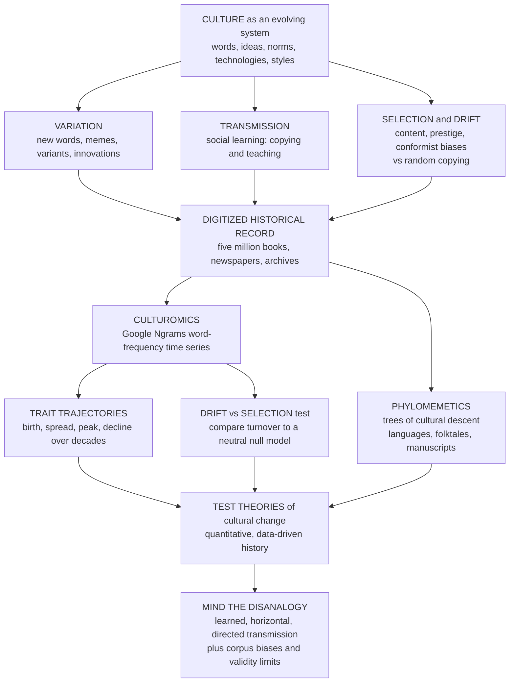

# 🧬 Cultural Evolution and Historical Dynamics

> [!abstract] TL;DR
> **Cultural evolution and historical dynamics** treats **culture** — words, ideas, beliefs, technologies, practices, norms, and styles — as an **evolving system** that changes over history through processes *analogous to* (but distinct from) biological evolution, and it **measures that change quantitatively from the digitized historical record**. The theoretical frame is **cultural-evolution theory** ([[Cultural_Evolution_and_Social_Learning]]): culture is a **second inheritance system** shaped by **variation** (new words, memes, variants), **transmission** (social learning — copying, teaching), and **selection/sorting** (content, prestige, and conformist biases) — the Boyd–Richerson / Mesoudi Darwinian-but-not-genetic view. The data revolution is **culturomics** (Michel, Aiden et al., *Science* 2011): analyzing the **Google Books Ngram** corpus — word and phrase frequencies across roughly **5 million books**, about **4 percent** of every book ever printed, over centuries — lets researchers **watch culture evolve like time-lapse film**: the rise and fall of ideas, **accelerating fame** (celebrities become famous faster and fade quicker each decade), visible **censorship** (names suppressed in Nazi Germany show up as frequency drops), and grammatical change (**irregular verbs regularizing** over time). A central, hard analytical question is distinguishing **selection** (a trait spreads because it is genuinely advantageous, useful, or attractive) from **neutral drift** (pure random copying, which *alone* reproduces realistic power-law popularity and turnover patterns — the Bentley–Hahn–Shennan null, a humbling baseline). **Phylomemetics** applies **phylogenetic** methods to reconstruct the evolutionary **trees** of languages, folktales, and technologies. Despite **corpus biases** and **validity** limits, this data-driven study makes the deep history of ideas, language, and values a **testable, quantitative subject** — the frontier where cultural-evolution theory, text-as-data, and cliodynamics meet.

---

## Intuition

**Analogy:** In 2010, a team fed **5 million digitized books** — roughly **4 percent** of every book ever printed — into a computer and could suddenly **watch culture change like a time-lapse film**. The word *slavery* spikes around the American Civil War. **Fame** arrives faster and fades quicker with each passing decade. Whole ideas get **censored out of existence** in Nazi Germany, visible as an artist's name plunging toward zero exactly when the regime bans him. Irregular verbs slowly **go regular** — *burnt* yielding to *burned* over generations. They called it **"culturomics"**: reading the collective **cultural genome** across centuries. Just as biologists trace the evolution of species through the fossil and genetic record, we can now trace the evolution of **ideas, words, and cultural traits** through the vast digitized archive of human expression.

That is the whole move. Culture is not a static backdrop to history; it is a **population of variants** — words, memes, tunes, tools, norms — that are **born, spread, peak, and die**, competing for the scarce resource of human attention and memory. And for the first time we have the **fossil record** to measure their dynamics: not a metaphor about "the spirit of the age" but a **time series** you can plot, model, and test against a null hypothesis.

---

## How It Works

### 1. Culture as an evolving system — the theoretical frame

The framing comes straight from **cultural-evolution theory** ([[Cultural_Evolution_and_Social_Learning]]; Boyd & Richerson; Mesoudi). Culture is a **second inheritance system** that satisfies the three Darwinian ingredients:

- **Variation** — people coin new words, invent new tools, mutate stories with every retelling. Innovation and copying-error are the cultural analogue of mutation.
- **Transmission (inheritance)** — variants pass between minds by **social learning**: imitation and teaching, not DNA. The "generation" is a *learning event*, so cultural change can outrun genetic change by orders of magnitude.
- **Selection / sorting** — some variants spread and persist, others die, filtered by **transmission biases**: **content bias** (intrinsically catchy ideas), **prestige bias** (copy the admired and successful), and **conformist bias** (over-copy the majority) — plus plain usefulness.

This is the **descriptive engine** of cultural change, and it makes the history of culture a candidate for the same population-dynamic mathematics used for genes (frequencies, drift, selection). It also sits inside the broader gene-culture coevolution / **dual inheritance** picture ([[Evolutionary_Psychology_and_Cultural_Evolution]]).

### 2. Culturomics and Google Ngrams — the measurement revolution

The theory was old; the **data** were new. **Culturomics** (Michel, Aiden et al., *Science* 2011) is the quantitative analysis of culture using **massive digitized text corpora** — above all the **Google Books Ngram** dataset: the frequency of every word and short phrase (an *n-gram*) across roughly **5 million books** over several centuries. Suddenly you could **track any word, name, idea, or phrase over history** — "reading the cultural genome." The landmark paper revealed:

- The **rise and fall** of concepts and the size of the collective **vocabulary** growing over time.
- **Fame dynamics** — successive cohorts of celebrities become famous **faster** and are **forgotten quicker**, an acceleration of the attention cycle.
- **Censorship as data** — the suppression of names (e.g., artists banned in Nazi Germany) appears as a sharp, detectable **frequency drop** relative to uncensored corpora.
- **Grammatical evolution** — irregular verbs **regularizing** over centuries, with **frequent** verbs resisting change longer (the "frequency buffers change" law of Lieberman et al.).

Ngrams turned cultural history into **big data**, complementing the ideology-and-values measures of [[Measuring_Culture_and_Ideology_from_Text]] and the corpus tradition of [[Corpus_Linguistics]].

### 3. Measuring cultural change — trajectories, turnover, and long-run trends

The concrete analyses treat each cultural trait as a **time series**:

- **Trait trajectories** — the frequency of a word/idea over time: **birth, spread (often an S-curve of adoption — see diffusion, below), peak, decline**. The shape itself is diagnostic.
- **Turnover** — the churn of popular items (baby names, fashions, dog breeds, pop songs): how fast the "top-N list" reshuffles.
- **Changing content of discourse** — long-run shifts in values, emotions, moral concepts, and individualism, tracked across centuries of books (the diachronic side of [[Measuring_Culture_and_Ideology_from_Text]]).

The spread of a new word or idea through the population is the same **diffusion** process modeled in [[Contagion_and_Diffusion_in_Social_Networks]] and [[Culture_Dissemination_and_Social_Influence_Models]] — an S-curve when adoption is socially reinforced.

### 4. Neutral vs selective cultural evolution — the central inferential problem

Here is the discipline's sharpest question, borrowed from **population genetics**. When a trait spreads, is it **selection** (a real advantage — it is better, more useful, more attractive, prestigious) or just **neutral drift** — random copying with no advantage at all?

The humbling discovery is **Bentley, Hahn & Shennan's random-copying model**: if people simply **copy each other at random** (with a trickle of innovation), the result is *not* a flat, boring distribution. It is a realistic, **heavy-tailed power-law** distribution of popularity and a characteristic **turnover** — matching what we actually see in baby names, pottery motifs, dog-breed registrations, and pop-music charts. So **much cultural change may be closer to neutral than we assume**: popularity does not imply merit. To claim **selection**, you must show a trait spreads **faster than a neutral null model predicts** — that it **breaks out of the drift envelope**. Distinguishing selection from drift is central, and hard, exactly as it is for genes ([[Population_Genetics]], [[Natural_Selection_and_Adaptation]]).

### 5. Phylomemetics — reconstructing trees of cultural descent

The other great import from biology is **phylogenetics** ([[Phylogenetics_and_the_Tree_of_Life]]): building family trees from shared traits. Applied to culture — **"phylomemetics"** — it reconstructs the **evolutionary trees** of:

- **Languages** — linguistic phylogenetics dating Indo-European origins (Gray & Atkinson), the backbone of [[Language_Families_and_Classification]], [[Historical_Linguistics_Methods]], and [[Proto_Indo_European_and_Reconstruction]].
- **Folktales** — Tehrani's phylogeny of "Little Red Riding Hood" across cultures, tracing lines of narrative descent ([[Oral_Tradition_and_Narrative]]).
- **Manuscripts** (stemmatics), **technologies**, and **material culture** ([[Material_Culture_and_Technology]]).

Culture reconstructed like a biological lineage — the **deep history** of cultural traits.

### 6. The biology–culture analogy and its limits

The analogy is a **rigorous framework, not an identity**. Cultural evolution is **Darwinian in structure** but differs from biological evolution in ways that matter:

- **Lamarckian** — acquired, learned traits *are* inherited (you pass on what you figured out this lifetime).
- **Non-vertical** — transmission is **horizontal and oblique** (you learn from many people, not just parents), allowing rapid blending and spread.
- **Directed / intentional** — people **deliberately innovate and choose** variants; "mutation" is not blind.
- **Faster** — a single learning event, not a generation.

**Dawkins's "meme"** is the vivid but contested framing; modern work mostly drops the strict replicator analogy for population-dynamic models. Use evolution as a **tool**, respecting the disanalogies — not as a loose metaphor.

### Flow: cultural evolution as historical dynamics



---

## Key Concepts

### Secondary Level

Imagine you could **fast-forward through history and watch words like a movie**. Type in *slavery* and you see a big spike around the Civil War. Type in *internet* and it explodes after 1994. Type in a movie star's name and you watch fame appear, blaze, and fade — and newer stars burn out *faster* than old ones. That is **culturomics**: because millions of old books have been scanned, a computer can count **how often any word appears each year** and show you the whole history as a graph.

The big idea underneath: **ideas evolve like living things.** New words and gadgets are "born," they **spread by people copying each other**, they **peak**, and most eventually **die out** — just like species. But here is the twist that keeps scientists honest: things can get popular for **no good reason at all**. If everybody just copies whatever is already popular (a fad, a baby name), you get big hit variants and lots of turnover **without any of them being "better."** So when something spreads, you have to **check** whether it really had an advantage or was just **lucky and copied**.

### Undergraduate Level

- **Culturomics.** Quantitative analysis of culture from large digitized corpora, above all **Google Books Ngram** (word/phrase frequency by year across ~5 million books, ~4 percent of all printed books). The unit of analysis is the **frequency time series** of an n-gram.
- **Cultural trait as time series.** Model a trait's relative frequency `f(t)`: a **rise-and-fall** curve (birth → adoption S-curve → peak → decline). Adoption that is socially reinforced follows a **logistic** curve — the diffusion signature of [[Contagion_and_Diffusion_in_Social_Networks]].
- **Neutral model (random copying).** Bentley–Hahn–Shennan: each learner copies a **randomly chosen** individual from the previous "generation," with innovation rate `mu`. With **no selection**, this produces a **power-law popularity distribution** and steady **turnover** — a quantitative **null hypothesis** for cultural change (the analogue of Wright–Fisher neutral drift in [[Population_Genetics]]).
- **Selection.** A trait whose frequency rises **faster than the neutral drift envelope** allows — evidence of a real content/prestige/payoff advantage. The inferential task is to **reject the neutral null**.
- **Phylomemetics.** Using **phylogenetic** tree-building (from shared traits) to reconstruct cultural lineages — languages, folktales, manuscripts, technologies ([[Phylogenetics_and_the_Tree_of_Life]]).
- **The disanalogy.** Cultural transmission is **Lamarckian, horizontal/oblique, directed, and fast** — so the biology analogy is a scaffold, not an equation.

### Graduate Level

- **The drift–selection identification problem.** Popularity alone is **not** evidence of selection: neutral random-copying reproduces power-law frequency distributions, Zipfian rank-size, and realistic top-list turnover (Bentley 2004; Herzog, Bentley & Hahn). Detecting selection requires a **model-based test** — e.g., the observed **rate of change** or **turnover** exceeding neutral expectation, progeny-distribution tests, or time-series methods (Kandler & Shennan's inference framework; the "Wright–Fisher with selection" likelihood). This is exactly the **neutral-theory** logic of molecular evolution transplanted to culture.
- **Frequency-dependent transmission signatures.** Conformist (anti-novelty) transmission steepens the popularity distribution and accelerates fixation; anti-conformist / novelty bias flattens it and raises turnover. The **shape** of the popularity distribution and its turnover are jointly diagnostic of the underlying bias — but the mapping is **many-to-one**, so identification is fragile (Acerbi & Bentley).
- **Phylogenetic comparative methods on culture.** Beyond tree reconstruction, cultural phylogenies enable **ancestral-state reconstruction** and tests of **correlated evolution** among traits (e.g., co-evolution of social-complexity variables), with the caveats of **horizontal transmission (borrowing)** violating tree-likeness — addressed by network/reticulate models and by testing for **treelikeness** (delta scores).
- **Corpus validity — the Pechenick critique.** Google Ngrams is **not a neutral sample of language or thought**: it is **books**, not speech; corpus **composition shifts** over time (the 20th-century explosion of **scientific** literature inflates technical vocabulary); it counts **types weighted by publication**, not by readership; OCR errors and metadata problems corrupt early data. Pechenick, Hilbe & Dodds (2015) show many "cultural" trends are artefacts of **changing library composition** and the shift from few to many authors. Validity (does a frequency series measure an *attitude* or *idea*, not just a *word*) is the cardinal concern — the theme of [[Measurement_and_Validity_in_Digital_Data]].
- **Defining the "unit."** Cultural evolution has no clean gene: traits are **fuzzy, reconstructive, and context-dependent** (Sperber's attraction theory). Word frequency is a **proxy** for an idea, and over-reading frequency as belief is the field's recurring sin.
- **Integration with cliodynamics.** Cultural dynamics are one axis of broader **historical dynamics** ([[Big_History_and_Cliodynamics]]) — Turchin's structural-demographic and *Seshat* programs quantify the co-evolution of culture, institutions, and social complexity, linking to the forthcoming siblings *Cliodynamics_and_Quantitative_History* and *The_Evolution_of_Social_Complexity*.

---

## Python Demo

```python
# Cultural Evolution and Historical Dynamics: measuring cultural change over time.
# numpy + matplotlib only. Four analyses of "culture as evolving time series":
#   (A) TRAIT TRAJECTORIES  -- birth / spread / peak / decline of several words/ideas.
#   (B) DRIFT vs SELECTION  -- a neutral Wright-Fisher "random-copying" envelope
#       vs a trait under selection that BREAKS OUT of it (the core inferential test).
#   (C) NEUTRAL TURNOVER    -- Bentley's result: pure random-copying yields a
#       heavy-tailed (power-law-like) popularity distribution, while content-biased
#       selection yields a winner-take-all head instead.
#   (D) VERB REGULARIZATION -- a signature culturomics finding: irregular verbs go
#       regular over time as an S-curve, and RARER verbs regularize FASTER.
import numpy as np
import matplotlib
matplotlib.use("Agg")
import matplotlib.pyplot as plt

rng = np.random.default_rng(42)

def sigmoid(x):
    return 1.0 / (1.0 + np.exp(-x))

# ------------------------------------------------------------------
# (A) Rise-and-fall trajectories of cultural traits over decades.
#     f(t) = L * [ sigmoid(k_up*(t-a)) - sigmoid(k_down*(t-b)) ]  birth -> peak -> decline
# ------------------------------------------------------------------
years = np.arange(1900, 2021)
def rise_fall(a, b, k_up, k_down, L):
    return L * (sigmoid(k_up * (years - a)) - sigmoid(k_down * (years - b)))

traits = {
    "'telegraph'":  rise_fall(1900, 1935, 0.20, 0.10, 1.00),
    "'radio'":      rise_fall(1922, 1965, 0.30, 0.06, 0.90),
    "'internet'":   rise_fall(1994, 2040, 0.55, 0.05, 1.10),
    "'automation'": rise_fall(1955, 2005, 0.18, 0.07, 0.70),
}

# ------------------------------------------------------------------
# (B) Neutral drift envelope vs a selected trait (the drift-vs-selection test).
# ------------------------------------------------------------------
N, T, p0 = 1000, 120, 0.10
def wf_neutral(seed):
    r = np.random.default_rng(seed); p = p0; path = [p]
    for _ in range(T):
        p = r.binomial(N, p) / N; path.append(p)      # pure random copying
    return np.array(path)
neutral = np.array([wf_neutral(s) for s in range(400)])          # 400 replicates
lo, mid, hi = np.percentile(neutral, [2.5, 50, 97.5], axis=0)     # neutral envelope

def wf_selection(s_coef, seed):
    r = np.random.default_rng(seed); p = p0; path = [p]
    for _ in range(T):
        p_sel = p * (1 + s_coef) / (1 + p * s_coef)   # replicator-style advantage
        p = r.binomial(N, p_sel) / N; path.append(p)
    return np.array(path)
selected = wf_selection(0.06, seed=7)
breakout = int(np.argmax(selected > hi)) if np.any(selected > hi) else -1

# ------------------------------------------------------------------
# (C) Neutral random-copying (Bentley) vs content-biased selection.
#     -> stationary popularity distribution, plotted rank-frequency (log-log).
# ------------------------------------------------------------------
def copying_model(biased, Npop=2000, gens=400, mu=0.01, seed=1):
    r = np.random.default_rng(seed)
    pop = np.zeros(Npop, dtype=np.int64); nxt = 1        # everyone starts on variant 0
    attract = {0: 1.0}
    for _ in range(gens):
        innovate = r.random(Npop) < mu
        newpop = np.empty(Npop, dtype=np.int64)
        n_new = int(innovate.sum())
        if n_new:                                        # innovations = brand-new variants
            new_ids = np.arange(nxt, nxt + n_new)
            for nid in new_ids:                          # a few innovations are "attractive"
                attract[int(nid)] = (r.uniform(3.0, 8.0)
                                     if (biased and r.random() < 0.03) else 1.0)
            newpop[innovate] = new_ids; nxt += n_new
        copiers = ~innovate; n_copy = int(copiers.sum())
        if n_copy:
            if biased:                                   # copy PROPORTIONAL to attractiveness
                ids, cnt = np.unique(pop, return_counts=True)
                w = np.array([attract.get(int(v), 1.0) for v in ids]) * cnt
                newpop[copiers] = r.choice(ids, size=n_copy, p=w / w.sum())
            else:                                        # copy a UNIFORMLY RANDOM agent
                newpop[copiers] = pop[r.integers(0, Npop, size=n_copy)]
        pop = newpop
    _, counts = np.unique(pop, return_counts=True)
    return np.sort(counts)[::-1]

neut_dist   = copying_model(biased=False, seed=3)
biased_dist = copying_model(biased=True,  seed=3)

# ------------------------------------------------------------------
# (D) Verb regularization S-curves -- rarer verbs regularize faster.
# ------------------------------------------------------------------
cent = np.arange(1500, 2001)
def regularization(midpoint, rate):
    return sigmoid(rate * (cent - midpoint))
verbs = {
    "'burn'  (common)": regularization(2100, 0.010),    # frequency buffers change
    "'smell' (mid)":    regularization(1950, 0.014),
    "'chide' (rare)":   regularization(1720, 0.020),    # long since regularized
}

# ------------------------------- REPORT --------------------------------
print("=" * 68)
print("CULTURAL EVOLUTION AND HISTORICAL DYNAMICS -- measuring change")
print("=" * 68)
print(f"[A] tracked {len(traits)} trait trajectories, 1900-2020 (rise/peak/decline)")
print(f"[B] selected trait (s=0.06) exceeds the neutral 97.5th-pct envelope at "
      f"generation {breakout}  -> REJECT neutral drift, infer SELECTION")
print(f"    a matched neutral trait stays inside the [2.5,97.5] band -> DRIFT")
print(f"[C] neutral random-copying : {len(neut_dist):4d} variants, top share "
      f"{neut_dist[0]/neut_dist.sum():.2f}  (heavy, power-law-like tail)")
print(f"    content-biased select. : {len(biased_dist):4d} variants, top share "
      f"{biased_dist[0]/biased_dist.sum():.2f}  (winner-take-all head)")
print(f"[D] regularization: rare 'chide' done by ~1750; common 'burn' still "
      f"< 50% regular in 2000 (frequency buffers change)")

# ------------------------------- FIGURE --------------------------------
fig, ax = plt.subplots(2, 2, figsize=(15, 10))
fig.suptitle("Cultural Evolution and Historical Dynamics: trait trajectories, "
             "drift vs selection, neutral turnover, verb regularization",
             fontsize=13, fontweight="bold")

# (A) rise-and-fall of cultural traits
for name, y in traits.items():
    ax[0, 0].plot(years, y, lw=2, label=name)
ax[0, 0].set_title("(A) Rise and fall of cultural traits\n"
                   "birth -> spread -> peak -> decline")
ax[0, 0].set_xlabel("year"); ax[0, 0].set_ylabel("relative frequency (stylized)")
ax[0, 0].legend(fontsize=8); ax[0, 0].grid(alpha=0.25)

# (B) drift envelope vs a selected trait
gens = np.arange(T + 1)
ax[0, 1].fill_between(gens, lo, hi, color="#9ca3af", alpha=0.35,
                      label="neutral drift 95% envelope")
for k in range(12):
    ax[0, 1].plot(gens, neutral[k], color="#9ca3af", lw=0.6, alpha=0.5)
ax[0, 1].plot(gens, mid, color="#374151", lw=1.5, ls="--", label="neutral median")
ax[0, 1].plot(gens, selected, color="#dc2626", lw=2.5,
              label="observed trait (selected)")
if breakout > 0:
    ax[0, 1].axvline(breakout, color="#dc2626", ls=":", lw=1)
ax[0, 1].set_title("(B) Drift vs selection test\n"
                   "trait breaks out of the neutral null -> selection")
ax[0, 1].set_xlabel("cultural generation"); ax[0, 1].set_ylabel("trait frequency")
ax[0, 1].legend(fontsize=8); ax[0, 1].grid(alpha=0.25)

# (C) rank-frequency popularity distribution (log-log)
rk_n = np.arange(1, len(neut_dist) + 1)
rk_b = np.arange(1, len(biased_dist) + 1)
ax[1, 0].loglog(rk_n, neut_dist, "o-", ms=3, color="#2563eb",
                label="neutral random-copying (Bentley)")
ax[1, 0].loglog(rk_b, biased_dist, "s-", ms=3, color="#dc2626",
                label="content-biased selection")
ax[1, 0].set_title("(C) Turnover / popularity distribution\n"
                   "neutral = power-law tail; selection = dominant head")
ax[1, 0].set_xlabel("variant rank"); ax[1, 0].set_ylabel("count in population")
ax[1, 0].legend(fontsize=8); ax[1, 0].grid(alpha=0.25, which="both")

# (D) verb regularization S-curves
for name, y in verbs.items():
    ax[1, 1].plot(cent, y, lw=2, label=name)
ax[1, 1].axhline(0.5, color="grey", ls=":", lw=0.8)
ax[1, 1].set_title("(D) Regularization of irregular verbs\n"
                   "rarer verbs go regular faster (a culturomics finding)")
ax[1, 1].set_xlabel("year"); ax[1, 1].set_ylabel("fraction using regular '-ed' form")
ax[1, 1].set_ylim(-0.02, 1.02); ax[1, 1].legend(fontsize=8); ax[1, 1].grid(alpha=0.25)

plt.tight_layout(rect=[0, 0, 1, 0.95])
plt.savefig("cultural_evolution_historical_dynamics.png", dpi=110, bbox_inches="tight")
plt.show()
```

**What the demo shows:**

- **Panel (A) — trait trajectories.** Several words/ideas trace the canonical **birth → spread → peak → decline** arc of a cultural trait — *telegraph* rising and fading, *internet* still climbing at 2020. Culture as a plottable **time series**, exactly what Ngrams delivers.
- **Panel (B) — the drift-vs-selection test.** Four hundred **neutral random-copying** replicates define a grey **envelope**; a matched neutral trait would wander *inside* it (drift). The red trait, given a small selective advantage `s = 0.06`, **breaks out above the 97.5th-percentile band** at a specific generation — the console prints exactly when. Breaking the envelope is the *evidence* that lets you **reject neutrality and infer selection** — you cannot infer it from popularity alone.
- **Panel (C) — neutral turnover is not boring.** The punchline of Bentley's model: **pure random copying** (blue) produces a **heavy-tailed, power-law-like** rank-frequency distribution — many rare variants, a few common ones — *without any selection*. **Content-biased selection** (red) instead concentrates the population in a **winner-take-all head**. The shape of the popularity distribution is a fingerprint of the underlying process, and the neutral shape looks deceptively "meaningful."
- **Panel (D) — a specific finding.** Irregular verbs **regularize** over centuries as **S-curves**, and — as culturomics found — **rarer** verbs (*chide*) complete the change **long before** high-frequency ones (*burn*), because frequency **buffers** grammatical change. A concrete, dated, quantitative claim about the evolution of language.

Run it and read the console: the breakout generation, the top-variant share under neutral vs biased copying, and the regularization timeline are all quantitative.

---

## Real-World Applications

> **The Google Ngram Viewer and culturomics.** The founding application (Michel, Aiden et al., 2011): tracking word/phrase frequency across ~5 million books to measure the growth of vocabulary, the half-life of **fame**, detectable **censorship**, the decay of interest in past years, and grammatical **regularization** — the public **Ngram Viewer** made cultural history a query.

> **Neutral models of fashion and popularity.** Bentley, Hahn & Shennan's random-copying model explains **power-law popularity** and **turnover** in baby names, pottery decoration, dog-breed registrations, and pop-music charts — establishing that much cultural change needs **no selective explanation**, a null against which real biases must be tested.

> **Phylomemetics — cultural family trees.** Gray & Atkinson dated **Indo-European** language origins with Bayesian phylogenetics; Tehrani reconstructed the **phylogeny of "Little Red Riding Hood"**; stemmatics builds **manuscript** trees; and technology/material-culture phylogenies trace tool lineages — feeding [[Language_Families_and_Classification]] and [[Historical_Linguistics_Methods]].

> **Long-run value and emotion trends.** Diachronic corpus analysis tracks shifts in **individualism**, **moral concepts**, **emotional expression**, and attitudes toward gender and race across decades — the historical face of [[Measuring_Culture_and_Ideology_from_Text]] and the forthcoming *Word_Embeddings_and_Semantic_Change*.

> **Cliodynamics and Seshat.** Turchin's **Seshat: Global History Databank** codes cultural, religious, and institutional variables across societies to test theories of the **evolution of social complexity** quantitatively — culture as one strand of [[Big_History_and_Cliodynamics]] and the forthcoming *The_Evolution_of_Social_Complexity*.

> **Semantic change detection in NLP.** **Diachronic word embeddings** ([[Word2Vec]]) quantify how word *meanings* drift (e.g., "gay," "broadcast," "awful"), operationalizing semantic evolution — a computational-linguistics bridge to [[Language_Change_and_Diffusion]].

---

## Common Pitfalls

- **Reading popularity as merit (ignoring the neutral null).** A trait's spread is **not** evidence it is better: random copying alone reproduces power-law popularity and turnover (Bentley). Always compare to a **neutral model** before invoking selection — the single most important discipline in the field.
- **Trusting Google Ngrams as a neutral sample.** It is **books, not thought or speech**; its composition **shifts** over time (the 20th-century flood of **scientific** text inflates technical vocabulary), it weights by **publication not readership**, and early data suffer **OCR** and metadata errors. Pechenick et al. show many apparent "cultural trends" are **corpus-composition artefacts**. Control for corpus change; prefer stable sub-corpora.
- **Over-interpreting word frequency as idea/attitude.** A word is a **proxy** for a concept, and the mapping is loose (polysemy, irony, changing usage). Frequency of *slavery* is not the *prevalence of slavery*. Validate against external measures — the concern of [[Measurement_and_Validity_in_Digital_Data]].
- **Confusing the analogy with identity.** Cultural transmission is **Lamarckian, horizontal, directed, and fast**; forcing a strict gene/replicator model (naive memetics) misdescribes reconstructive, cognition-shaped transmission. Use evolution as a **tool**, not a metaphor.
- **Assuming trees when there is borrowing.** Cultural phylogenies presume tree-like descent, but **horizontal transmission** (loanwords, trade, copying between lineages) violates it. Test for **treelikeness** and use network/reticulate models where borrowing dominates.
- **No agreed "unit" of culture.** Traits are **fuzzy and context-dependent**; choosing n-grams as units is a convenience that can smuggle in artefacts. State the operationalization and its limits.
- **Drift–selection is under-identified.** Different processes can produce **similar** popularity distributions (many-to-one). One matching statistic is weak evidence; use **multiple diagnostics** (rate of change, turnover, progeny distribution) and model-based inference.

---

## Related Concepts

**Cultural-evolution theory and biology (the engine):**

- [[Cultural_Evolution_and_Social_Learning]] — the EGT/dual-inheritance theory this note *measures*: variation, social-learning transmission, and content/prestige/conformist biases.
- [[Evolutionary_Psychology_and_Cultural_Evolution]] — the anthropology companion on gene-culture coevolution and human social learning.
- [[Phylogenetics_and_the_Tree_of_Life]] — the tree-building method that phylomemetics borrows to reconstruct cultural lineages.
- [[Natural_Selection_and_Adaptation]] — the "selection" whose cultural analogue must be distinguished from drift.
- [[Population_Genetics]] — Wright-Fisher drift and neutral theory, the direct template for the drift-vs-selection null model.
- [[The_Evolution_of_Conventions_and_Norms]] — how shared norms crystallize and stabilize, a key class of evolving cultural traits.

**Computational social science and text-as-data:**

- [[Measuring_Culture_and_Ideology_from_Text]] — the values/ideology side of measuring culture from text; the diachronic overlap is direct.
- [[Computational_Social_Science_Overview]] — the parent field; culturomics is its flagship historical-scale application.
- [[Text_as_Data_in_Social_Science]] — the methods umbrella for turning corpora into measures.
- [[Measurement_and_Validity_in_Digital_Data]] — why word frequency is a *proxy*, and the validity discipline that guards against over-reading it.
- [[Big_Data_and_the_Social_Sciences]] — the digitized-record revolution that made culturomics possible.
- [[Contagion_and_Diffusion_in_Social_Networks]] — the diffusion process behind a trait's S-curve of adoption.
- [[Culture_Dissemination_and_Social_Influence_Models]] — agent-based models of how cultural traits spread and homogenize.

**History and language:**

- [[Big_History_and_Cliodynamics]] — the quantitative-history program culture is one axis of; Turchin, Seshat, structural-demographic theory.
- [[Language_Change_and_Diffusion]] — language as cultural evolution in real time (conformist, prestige, and drift dynamics).
- [[Language_Families_and_Classification]] — the phylogenetic classification phylomemetics extends.
- [[Historical_Linguistics_Methods]] — the comparative method and linguistic tree-building.
- [[Proto_Indo_European_and_Reconstruction]] — the canonical dated language phylogeny (Gray-Atkinson).
- [[Corpus_Linguistics]] — the corpus tradition Ngram-scale analysis grows out of.
- [[Oral_Tradition_and_Narrative]] — folktales as evolving lineages (Tehrani's phylogenies).
- [[Material_Culture_and_Technology]] — technologies and artifacts as evolving, tree-buildable traits.
- [[Culture_Norms_Values_and_Ideology]] — the sociology of the values whose long-run change these methods track.
- [[Word2Vec]] — embeddings behind diachronic semantic-change detection.

*Forthcoming siblings in this Cliodynamics section (referenced in prose, not yet written):* **Cliodynamics and Quantitative History** (the umbrella program), **The Evolution of Social Complexity** (Seshat-scale tests of institutional evolution), and **Word Embeddings and Semantic Change** (the NLP method for measuring meaning drift).

---

## Review Questions

### Secondary

1. **Culturomics** lets researchers "watch culture change like a movie" by counting how often words appear in millions of old books each year. Give two examples (from the note) of something surprising this revealed about history — and explain in one sentence why scanning millions of books was necessary to see it.
2. A new slang word spreads through a school and becomes hugely popular. A friend says, "It must be a really *good* word to spread that fast." Using the idea of **random copying**, explain why popularity does **not** prove a word is better.
3. What does it mean to say irregular verbs are "**regularizing**" (like *burnt* becoming *burned*), and why is this an example of culture *evolving*?

### Undergraduate

1. Culture is called an **evolving system**. Identify the three Darwinian ingredients (variation, transmission, selection) in cultural evolution, and for **each** name the cultural mechanism that plays the role mutation, heredity, and natural selection play in biology. Then give **two** ways cultural transmission **differs** from genetic transmission and why each makes cultural change faster.
2. Explain the **neutral (random-copying) model** of Bentley, Hahn & Shennan. What distribution of variant popularity does it produce with **no selection**, and how would you use it as a **null hypothesis** to test whether a real cultural trait (say, a baby name's rise) was driven by **selection** rather than drift?
3. What is **phylomemetics**? Give one concrete example (language, folktale, or manuscript), and explain one reason cultural phylogenies can be **harder** to build than biological ones.

### Graduate

1. You observe that the frequency of a word in Google Ngrams **quadrupled** across the 20th century and want to claim it reflects a rising cultural value. Design a full analysis that (a) tests the rise against a **neutral drift** null, (b) rules out **corpus-composition artefacts** (the Pechenick critique), and (c) addresses whether the **word frequency** validly measures the **attitude**. What would a *negative* result look like at each step?
2. The drift-vs-selection inference problem is **under-identified**: different transmission processes can generate **similar** popularity distributions. Explain why (the many-to-one mapping from process to pattern), and describe how combining **multiple diagnostics** (rate of change, turnover, progeny distribution, time-series likelihood) plus a **model-based** framework (e.g., Kandler-Shennan) strengthens inference. When is neutrality genuinely *unfalsifiable* from the data you have?
3. Critically assess the claim that culturomics makes the history of ideas a "quantitative, testable science." Weigh (a) the power of the digitized record and neutral-null modeling against (b) corpus bias, the fuzzy **unit-of-culture** problem, the biology-culture **disanalogy** (Lamarckian/horizontal/directed transmission), and the gap between **word frequency** and **historical meaning**. What would a methodologically responsible cultural-evolution study report, and where must **qualitative history** remain in the loop?

---

## Sources

- [Michel, J.-B., Shen, Y. K., Aiden, A. P., et al. (2011). "Quantitative Analysis of Culture Using Millions of Digitized Books." *Science* 331(6014), 176-182](https://doi.org/10.1126/science.1199644)
- [Bentley, R. A., Hahn, M. W. & Shennan, S. J. (2004). "Random Drift and Culture Change." *Proceedings of the Royal Society B* 271(1547), 1443-1450](https://doi.org/10.1098/rspb.2004.2746)
- [Gray, R. D. & Atkinson, Q. D. (2003). "Language-Tree Divergence Times Support the Anatolian Theory of Indo-European Origin." *Nature* 426, 435-439](https://doi.org/10.1038/nature02029)
- [Pechenick, E. A., Danforth, C. M. & Dodds, P. S. (2015). "Characterizing the Google Books Corpus: Strong Limits to Inferences of Socio-Cultural and Linguistic Evolution." *PLOS ONE* 10(10), e0137041](https://doi.org/10.1371/journal.pone.0137041)
- [Mesoudi, A. (2011). *Cultural Evolution: How Darwinian Theory Can Explain Human Culture and Synthesize the Social Sciences*. University of Chicago Press](https://press.uchicago.edu/ucp/books/book/chicago/C/bo11674586.html)
- [Lieberman, E., Michel, J.-B., Jackson, J., Tang, T. & Nowak, M. A. (2007). "Quantifying the Evolutionary Dynamics of Language." *Nature* 449, 713-716](https://doi.org/10.1038/nature06137)

---

#computational-social-science #cultural-evolution #culturomics #google-ngrams #historical-dynamics
