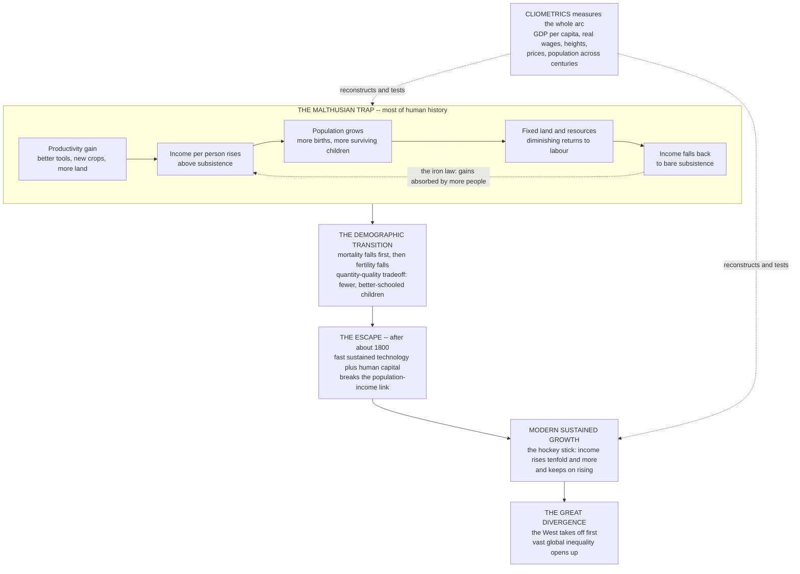

# 📈 Long-Run Economic and Population History

> [!abstract] TL;DR
> **Long-run economic and population history** — the field of **cliometrics** (economic theory plus statistics applied to the past; Fogel and North, Nobel 1993) — reconstructs **GDP per capita, real wages, prices, population, and human heights** across **centuries and millennia** to explain the single most dramatic pattern in human material history: a near-**flat line at bare subsistence for thousands of years**, then an almost-**vertical "hockey stick"** takeoff around **1800**. For most of history humanity was caught in the **Malthusian trap** — because population grows when incomes rise but land is fixed (diminishing returns), every gain in productivity was **absorbed by more mouths** rather than lifting living standards, so the peasant of 1800 lived no better than the peasant of 10,000 BCE (Clark's *A Farewell to Alms*). Escaping required **two things at once**: sustained, accelerating **technological growth** and the **demographic transition** — falling mortality followed by falling **fertility** (the quantity-quality tradeoff toward fewer, better-schooled children) that **broke the link between prosperity and population** so productivity gains finally raised incomes. **Oded Galor's unified growth theory** models the *whole* arc — Malthusian stagnation, the transition, and modern growth — in one framework. The field's central puzzle is the **Great Divergence** (Pomeranz): *why* did modern growth begin in **Western Europe** around 1800 and leave the world so starkly unequal — institutions, geography, culture, coal, colonies, human capital, or contingency? Adjudicated with painstakingly reconstructed data (Maddison Project GDP, Allen's welfare-ratio wages, anthropometric heights, parish demography), long-run economic history is the **material substrate of cliodynamics** and bears directly on the deep origins of prosperity, global inequality, and the drivers of development today.

---

## Intuition

**Analogy:** Plot humanity's living standards over the last **12,000 years** and you get one of the most dramatic graphs in all of science. For millennia the line runs **nearly flat**, hugging bare subsistence — pharaohs commissioned pyramids and Roman senators dined on peacock, yet the *average* person, kings and peasants alike, lived in a world where every hard-won gain in productivity was swiftly **swallowed by more mouths to feed**. A better plough, a new crop from the Americas, a drained marsh: each one bought a few more people, not a richer life. This is the **Malthusian** world — a treadmill where running faster only makes the treadmill longer. Then, around **1800**, the line does something it had never done in all of prior human history: it turns **almost vertical**. A "hockey stick" of soaring wealth lifts average incomes **tenfold, thirtyfold**, in what is, on the scale of the whole human story, a historical **eyeblink**.

**Cliometrics — measuring the economic past — turns history's grandest questions into data.** Instead of arguing over anecdotes and great men, it reconstructs the numbers: what a labourer's daily wage would actually *buy*, how tall people grew (a biological readout of childhood nutrition), how many children survived, what a country produced per person. With those numbers in hand, three questions become answerable and testable rather than merely rhetorical: **Why were we poor for so long? What broke the Malthusian trap? And why did the escape happen where and when it did?**

---

## How It Works

Long-run economic history studies the interplay of **two coupled systems — the economy and the population** — over the deep past, and the astonishing regime change between them. Its explanatory engine is **cliometrics**: reconstruct the quantitative record from archives, then use **economic models plus statistics** to test rival theories of why the record looks as it does. The story has four moving parts.

### 1. The Malthusian trap — why we were poor for so long

Thomas Malthus (1798) saw the tragic logic of every pre-industrial economy. **Population grows geometrically when living standards rise** (well-fed people marry earlier and more of their children survive), but **food comes from land, and land is fixed** — so adding workers runs into **diminishing returns** (the marginal farmer works ever-worse soil). Put the two together and you get an **iron law**: any improvement — a better tool, a new crop, more peace — raises income *temporarily*, which raises population, which pushes income *back down* to the **subsistence floor** where deaths balance births. The gain is **absorbed by population, not converted into prosperity**. Living standards are pinned not by technology but by the **subsistence** level and by mortality — which is why, on Clark's evidence, the English labourer of 1800 was **no richer** than his ancestor of 10,000 BCE, and why the healthiest pre-modern populations were often those repeatedly *culled* by plague, leaving more land per survivor. Prosperity, perversely, bred poverty.

### 2. The flat-then-hockey-stick pattern

The Malthusian mechanism predicts exactly what the reconstructed data show: **income per person nearly flat at subsistence for thousands of years**, fluctuating in **cycles** (population booms, immiseration, collapse, recovery — the raw material of *secular cycles* and structural-demographic theory) but with **no sustained upward trend**. Then, after **1800**, an explosive, self-sustaining takeoff — the **"hockey stick"** of history, the most famous graph in economic history, drawn from Angus Maddison's long-run GDP estimates. This is the escape from the Malthusian trap into the modern regime of **sustained growth**, where technology finally outruns population and incomes rise *decade after decade without limit*.

### 3. The demographic transition — the population side of the escape

Escaping the trap required **breaking the link between prosperity and population**, and that is what the **demographic transition** did. Societies moved from a regime of **high birth AND high death rates** (population held down by mortality) to one of **low birth and low death rates** — but *not simultaneously*. **Mortality fell first** (better nutrition, public health, medicine), producing a phase of **rapid population growth**. Then, crucially, **fertility fell too**: as child mortality dropped, women's status rose, and the **quantity-quality tradeoff** tilted toward investing in **fewer, better-educated children**. Once fertility no longer rose with income, productivity gains could finally flow into **rising living standards instead of extra people** — the demographic precondition for modern growth.

### 4. Unified growth theory and the Great Divergence

**Oded Galor's unified growth theory** is the synthesis: a single model that generates the *entire* arc — Malthusian stagnation, the demographic transition, and the takeoff to modern growth — driven by the **accelerating accumulation of technology and human capital** and the **fertility tradeoff** that releases the population brake. It explains not just *that* growth happened but *why it had to* eventually escape. Yet the field's deepest puzzle remains the **Great Divergence** (Pomeranz): why did the takeoff begin in **Western Europe**, especially **Britain**, around 1800 — and why did the West (then East Asia) pull so far ahead that today's vast global inequality opened up? The candidate causes are economic history's great debate: **institutions** (Acemoglu-Robinson, North), **geography**, **culture**, **coal and colonies** (Pomeranz), **human capital and science**, **demography** (Clark), or sheer **contingency**.



This note is the anchor of the vault's *Cliodynamics_and_Quantitative_History* section: it supplies the **material and demographic substrate** on which the sibling notes build — *Secular_Cycles_and_Structural_Demographic_Theory* (how Malthusian immiseration drives political instability), *The_Evolution_of_Social_Complexity* (how economies scale into states and empires), *Computational_Demography_and_Human_Mobility* (the formal machinery of populations and migration), and *Cultural_Evolution_and_Historical_Dynamics* (the norms and know-how that co-evolve with the economy).

---

## Key Concepts

### Secondary Level

**Why were people poor for almost all of history?** For thousands of years, the *average* person — not the king, the average farmer — lived at the edge of getting by. Even when someone invented a better plough or brought back a new crop like the potato, life did **not** get richer for long. Why? Because when food got a little more plentiful, families had **more children who survived**, and soon there were more mouths sharing the same land. The extra food got eaten up by extra people instead of making everyone better off. This is called the **Malthusian trap**, after Thomas Malthus, who spotted the pattern in 1798.

**The hockey stick.** If you draw a graph of how well-off the average person was over the last 12,000 years, it is almost **flat** for nearly the whole time — and then, around the year **1800**, it suddenly shoots **straight up**. It looks like a **hockey stick** lying on its side: a long flat handle, then a blade pointing to the sky. That sudden takeoff is the **Industrial Revolution** and the modern world of growth it created. In a couple of centuries, average incomes multiplied many times over — something that had *never* happened before.

**How did we escape?** Two things had to happen together. First, technology had to improve **fast and keep improving** (machines, science, factories). Second — and this is the surprising part — **families had to start having fewer children**. Once people had smaller families, the extra wealth from new technology could go into **better lives** instead of just **more people**. That shift to smaller families is called the **demographic transition**.

| The idea | What it means |
|---|---|
| **Subsistence** | Just barely enough to survive |
| **Malthusian trap** | Extra food turns into extra people, not richer people |
| **Hockey stick** | Flat living standards for ages, then a sudden takeoff around 1800 |
| **Demographic transition** | Families shift from many children to few |

### Undergraduate Level

**Cliometrics — history with data.** Cliometrics (named for **Clio**, the muse of history) is the **new economic history**: applying **economic theory and statistics** to the past. Pioneered by **Robert Fogel** and **Douglass North** (Nobel 1993), it replaced storytelling with **measurement** — reconstructing GDP per capita, real wages, prices, population, and even human **heights** to *test* hypotheses about growth and living standards. Fogel's famous studies quantified the (surprisingly modest) contribution of **railroads** to US growth and the economics of **slavery**; the broader program built the long-run data series — Maddison Project GDP, Robert Allen's **welfare-ratio** real wages, anthropometric height histories — that let us *see* the flat-then-hockey-stick pattern for the first time.

**The Malthusian model.** Formally: income per person is `w = A · f(L)` where `A` is technology and `f(L)` is output per worker on **fixed land**, which *falls* as population `L` rises (diminishing returns). Population grows when `w` is above subsistence `w*` and shrinks below it. The system has a stable **subsistence equilibrium**: a one-time rise in `A` raises `w` briefly, but population grows until `w` is pushed **back to `w*`**. Long-run living standards are therefore independent of technology — the **iron law**. Only the *population level*, not income, absorbs technological progress. (The Python demo below makes this happen on screen.)

**The demographic transition and the escape.** The escape breaks the population feedback. The **demographic transition** — mortality falling first, then fertility — passes through a **population explosion** (deaths down, births still high) before stabilizing (births down too). The decisive step is the **fertility decline**, driven by the **quantity-quality tradeoff**: when child mortality falls and skilled work rewards education, parents choose **fewer, more-educated children**. Fertility stops rising with income, so productivity gains raise **living standards** rather than headcount — the demographic key that, alongside sustained technological growth, unlocks the hockey stick.

**The Great Divergence — the big question.** Why did modern growth ignite in **Western Europe** and not China, India, or the Middle East, all of which had been comparably rich? **Kenneth Pomeranz** argued the difference was late and partly lucky — **coal deposits** near English industry and **New World colonies** that relieved land constraints. Others stress **inclusive institutions** securing property and incentives (**Acemoglu-Robinson**, **North**), **human capital and the culture of science**, **geography**, or **demographic** and cultural change (**Clark**). Adjudicating these is the central project of long-run economic history.

### Graduate Level

**The two regimes and the phase transition between them.** Unified growth theory (Galor and Weil) treats history as a transition between two **dynamic regimes**. In the **Malthusian regime**, technology `A` grows slowly, population responds strongly to income, and the economy sits at a **stable subsistence attractor** where `dw/dA ≈ 0` in the long run. Technological progress raises **population density**, which — critically — *raises the rate of technological progress itself* (more people, more ideas; a scale effect). This creates a slow-burning positive feedback: rising density accelerates `A`, which eventually pushes the economy toward a **bifurcation**. Past a threshold, the return to **human capital** rises enough that parents substitute **child quality for quantity**, fertility falls, the population brake releases, and the system jumps to the **modern-growth attractor** where `A` and human capital grow endogenously and income rises without bound. The escape is thus modeled not as an exogenous shock but as an **endogenous phase transition** the Malthusian dynamics eventually *cause* — connecting to [[Bifurcations_and_Tipping_Points]] and [[Endogenous_Growth_Theory]].

**Cliometric method and its evidentiary base.** Rigorous long-run history is a measurement problem. **Real wages** are built as **welfare ratios** (Allen): the annual earnings of a labourer divided by the cost of a subsistence "respectability basket," comparable across centuries and continents. **Anthropometric history** uses **stature** as a biological standard of living — height reflects **net nutrition** (intake minus disease and work) in childhood, capturing welfare that money wages miss (inequality, disease environment, public goods). **GDP per capita** back-projections (Maddison Project, Broadberry) triangulate output from wages, urbanization rates, agricultural productivity, and fragmentary accounts. Demography is reconstructed by **family reconstitution** from parish registers (Wrigley-Schofield) and censuses. Each series carries **large uncertainty** and **selection biases** (who appears in the records), which disciplined cliometrics quantifies rather than ignores.

**Identification and the Divergence debate.** The causes of the Great Divergence are a hard **causal-inference** problem: institutions, geography, culture, human capital, and demography are **deeply endogenous and collinear** over the *longue durée*, and there is effectively **one treated unit** (the West) observed once. The literature leans on **natural experiments** (colonial institutional transplants and the "reversal of fortune"; settler-mortality instruments for institutions, Acemoglu-Johnson-Robinson), **within-region comparisons**, and **structural models** disciplined by the reconstructed data — but the **equifinality** is severe: multiple mechanisms can fit the aggregate trajectory, so claims of *the* cause remain contested. This is the historical-scale version of the identification problem that runs through all of quantitative social science.

**The link to cliodynamics and inequality.** Long-run economic history is the **material substrate of cliodynamics**. Structural-demographic theory (Turchin, Nefedov — the *Secular_Cycles_and_Structural_Demographic_Theory* sibling) makes the Malthusian mechanism **political**: population growth against fixed land depresses **real wages**, **immiserating** the masses while elites overproduce, and the resulting instability drives **secular cycles** of state breakdown. In parallel, the long-run history of **inequality** (Piketty's centuries of wealth and income data; the deep history of the rich-poor gap — [[Wealth_and_Income_Inequality_Dynamics]]) traces how the material gains of growth were **distributed**. Economy, population, technology, and institutions **co-evolve** over the long run — the economic history is one strand of a broader dynamical account of societies.

---

## Python Demo

```python
import numpy as np
import matplotlib
matplotlib.use("Agg")
import matplotlib.pyplot as plt

# =====================================================================
# THE MALTHUSIAN TRAP AND THE ESCAPE
# ---------------------------------------------------------------------
# A minimal long-run model of the coupled ECONOMY + POPULATION system.
#
#   income per person (the "wage"):   w_t = A_t * L_t ** (-BETA)
#     A_t  = level of technology / productivity
#     L_t  = population (labour) on FIXED land  ->  diminishing returns
#     BETA = strength of the land constraint (0 < BETA < 1)
#
#   population law of motion (the Malthusian feedback):
#     L_{t+1} = L_t * (w_t / W_SUB) ** gamma_t
#     gamma_t > 0 : population GROWS when income > subsistence,
#                   SHRINKS when income < subsistence.
#     The DEMOGRAPHIC TRANSITION is modelled as gamma_t FALLING to 0
#     (families stop converting extra income into extra children).
#
# EXPERIMENT (a) THE TRAP: a ONE-TIME productivity shock only RAISES
#   POPULATION -- income returns to subsistence (the iron law).
# EXPERIMENT (b) THE ESCAPE: FAST, SUSTAINED technology growth PLUS a
#   demographic transition lets income BREAK OUT (the hockey stick).
# =====================================================================

W_SUB = 1.0     # subsistence income -- the biological floor
BETA  = 0.30    # land constraint / diminishing returns to labour

def simulate(A, gamma, L0=1.0):
    """Run the coupled economy-population system. gamma may be a scalar
    (constant fertility response) or an array (a demographic transition)."""
    T = len(A)
    w = np.empty(T)
    L = np.empty(T)
    L[0] = L0
    g = np.full(T, gamma) if np.ndim(gamma) == 0 else np.asarray(gamma)
    for t in range(T):
        w[t] = A[t] * L[t] ** (-BETA)          # diminishing returns
        if t + 1 < T:
            L[t + 1] = L[t] * (w[t] / W_SUB) ** g[t]   # Malthusian feedback
    return w, L

# ---- EXPERIMENT (a): THE MALTHUSIAN TRAP ----------------------------
# Start at the subsistence equilibrium (A=1, L=1, w=1). At t=150 a
# permanent productivity SHOCK hits (a new crop / a better plough).
T1 = 400
A_trap = np.ones(T1)
shock = 150
A_trap[shock:] = 1.8                 # one-time +80% technology jump
w_trap, L_trap = simulate(A_trap, gamma=0.20)

# ---- EXPERIMENT (b): THE ESCAPE ------------------------------------
# Same long flat Malthusian era, then at t=200 technology begins to
# grow FAST and forever. TWO worlds are compared:
#   * "trapped"  -> fertility keeps responding (gamma stays 0.20)
#   * "escape"   -> a DEMOGRAPHIC TRANSITION drives gamma -> 0
T2 = 500
takeoff = 200
g_A = 0.013                           # sustained tech growth per period
A_esc = np.ones(T2)
A_esc[takeoff:] = (1 + g_A) ** np.arange(T2 - takeoff)

t = np.arange(T2)
# gamma falls smoothly from 0.20 to ~0 shortly after takeoff:
gamma_transition = 0.20 / (1 + np.exp((t - (takeoff + 45)) / 18.0))

w_trapped, L_trapped = simulate(A_esc, gamma=0.20)             # stays Malthusian
w_escape,  L_escape  = simulate(A_esc, gamma=gamma_transition)  # escapes

# ------------------------------- REPORT ------------------------------
print("=" * 66)
print("THE MALTHUSIAN TRAP AND THE ESCAPE")
print("=" * 66)
print("(a) ONE-TIME tech shock (A: 1.0 -> 1.8):")
print(f"    income  : {w_trap[shock-1]:.2f} -> peak {w_trap[shock]:.2f} "
      f"-> settles {w_trap[-1]:.2f}  (back to subsistence)")
print(f"    population: {L_trap[shock-1]:.2f} -> {L_trap[-1]:.2f}  "
      f"({L_trap[-1]/L_trap[shock-1]:.1f}x -- the gain became PEOPLE)")
print("(b) SUSTAINED tech growth after takeoff:")
print(f"    trapped world income (full fertility) : {w_trapped[-1]:.2f}x "
      f"subsistence  (flat -- absorbed by population)")
print(f"    escape  world income (transition)     : {w_escape[-1]:.1f}x "
      f"subsistence  (the HOCKEY STICK)")
print(f"    escape population stabilises at {L_escape[-1]:.1f} "
      f"(demographic transition), trapped keeps growing to {L_trapped[-1]:.1f}")

# ------------------------------- FIGURE ------------------------------
fig, ax = plt.subplots(2, 2, figsize=(13, 9.5))
fig.suptitle("The Malthusian trap and the escape to modern growth",
             fontsize=14, fontweight="bold")
SUB = "#94a3b8"

# (0,0) TRAP -- income spikes then returns to subsistence
a = ax[0, 0]
a.plot(w_trap, color="#dc2626", lw=2)
a.axhline(W_SUB, color=SUB, ls="--", lw=1.3, label="subsistence")
a.axvline(shock, color="#1e293b", ls=":", lw=1.3)
a.annotate("productivity\nshock", xy=(shock, 1.55), xytext=(shock + 25, 1.6),
           fontsize=9, arrowprops=dict(arrowstyle="->", color="#1e293b"))
a.set_title("(a) THE TRAP -- income", fontsize=11)
a.set_xlabel("time"); a.set_ylabel("income per person")
a.legend(fontsize=9); a.grid(alpha=0.25)

# (0,1) TRAP -- population steps up permanently
a = ax[0, 1]
a.plot(L_trap, color="#7c3aed", lw=2)
a.axvline(shock, color="#1e293b", ls=":", lw=1.3)
a.set_title("(a) THE TRAP -- population absorbs the gain", fontsize=11)
a.set_xlabel("time"); a.set_ylabel("population")
a.grid(alpha=0.25)

# (1,0) ESCAPE -- income: trapped (flat) vs escape (hockey stick)
a = ax[1, 0]
a.plot(w_trapped, color="#2563eb", lw=2,
       label="trapped: full fertility response")
a.plot(w_escape, color="#059669", lw=2.4,
       label="escape: demographic transition")
a.axhline(W_SUB, color=SUB, ls="--", lw=1.3)
a.axvline(takeoff, color="#1e293b", ls=":", lw=1.3)
a.annotate("takeoff\n~1800", xy=(takeoff, 2), xytext=(takeoff + 20, 5),
           fontsize=9, arrowprops=dict(arrowstyle="->", color="#1e293b"))
a.set_title("(b) THE ESCAPE -- income (the hockey stick)", fontsize=11)
a.set_xlabel("time"); a.set_ylabel("income per person")
a.legend(fontsize=8.5, loc="upper left"); a.grid(alpha=0.25)

# (1,1) ESCAPE -- population: transition stabilises vs Malthusian growth
a = ax[1, 1]
a.plot(L_trapped, color="#2563eb", lw=2,
       label="trapped: population keeps growing")
a.plot(L_escape, color="#059669", lw=2.4,
       label="escape: population stabilises")
a.axvline(takeoff, color="#1e293b", ls=":", lw=1.3)
a.set_title("(b) THE ESCAPE -- the demographic transition", fontsize=11)
a.set_xlabel("time"); a.set_ylabel("population")
a.legend(fontsize=8.5, loc="upper left"); a.grid(alpha=0.25)

plt.tight_layout(rect=[0, 0, 1, 0.95])
plt.savefig("long_run_economic_and_population_history.png", dpi=110,
            bbox_inches="tight")
plt.show()
```

**What the demo shows:**

- **Panels (a) — the trap.** The economy starts at the **subsistence equilibrium** (income = 1). At the shock, a permanent **80% jump in technology** sends income spiking upward — for a moment, people are richer. But the higher income drives **population growth**, and more workers on the same fixed land push income **relentlessly back down to subsistence**. When the dust settles, **income is exactly where it started** while **population has multiplied several-fold**. The productivity gain became **extra people, not extra prosperity** — the iron law of the Malthusian trap, generated purely by diminishing returns plus the population feedback.
- **Panels (b) — the escape.** Now technology grows **fast and forever** after the takeoff. In the **trapped world** (blue), fertility still responds fully, so even *sustained* progress is soaked up by population: income creeps to a **modest plateau and flattens** while population explodes. In the **escape world** (green), a **demographic transition** drives the fertility response toward zero — families stop converting income into children — the **population brake releases and stabilizes**, and income **breaks out into the hockey stick**, rising many-fold and continuing to climb. The contrast is the whole thesis in one figure: **sustained technology growth is necessary but not sufficient — you also need the demographic transition to break the population-income link.**

The lesson in one line: **in the Malthusian world, progress makes more people; only when fertility falls does progress finally make people richer.**

---

## Real-World Applications

> **Explaining the deep origins of prosperity and global inequality.** The Great Divergence framework is the master lens for understanding *why some nations are rich and others poor* today. Reconstructed GDP and wage series (Maddison Project, Broadberry, Allen) let economists date the divergence, test institutional versus geographic versus cultural explanations, and trace the roots of modern inequality back to the timing of each region's escape — directly informing [[Development_Economics]] and the [[Solow_Growth_Model]] convergence debate.

> **Lessons for economic development.** If institutions, human capital, technology, and demography drove the historical escape, they are also the levers for developing countries today. Cliometric findings — that **inclusive institutions** protecting property and broad incentives matter (North, Acemoglu-Robinson), that **human capital and the fertility transition** are decisive (Galor) — shape real development policy, foreign aid design, and the debate over what actually causes sustained growth ([[Development_Economics_and_Political_Development]], [[Institutions_Cooperation_and_Norms]]).

> **The demographic transition and today's population challenges.** The same transition that enabled the historical escape is now playing out — in reverse phase — as **aging populations** in the rich and middle-income world and continuing **growth** in parts of Africa and South Asia. Understanding the transition's drivers (child mortality, women's education, the quantity-quality tradeoff) is central to forecasting fertility, dependency ratios, migration, and the sustainability of pension and growth systems ([[Human_Capital_and_Education]]).

> **The long-run history of inequality and living standards.** Anthropometric (height) and real-wage histories reveal what GDP hides: how the *distribution* of welfare moved through plagues, industrialization, and growth. Piketty's centuries-long wealth and income series extend this to the deep history of the rich-poor gap, framing contemporary debates on inequality ([[Wealth_and_Income_Inequality_Dynamics]]).

> **The sustainability of growth.** The hockey stick raises the question of its own limits: is unbounded modern growth a permanent new regime or a transient episode against resource and ecological ceilings? Long-run history frames the debate over whether we have truly escaped **all** Malthusian constraints or merely deferred them — the material backdrop to sustainability and planetary-boundaries thinking.

> **Cliodynamics and political stability.** As the material substrate of the *Secular_Cycles_and_Structural_Demographic_Theory* sibling, wage and population reconstructions feed **structural-demographic** models in which immiseration and elite overproduction drive cycles of instability — turning long-run economic data into a predictor of political crisis ([[Big_History_and_Cliodynamics]]).

---

## Common Pitfalls

- **Reading pre-modern history through modern intuitions about growth.** In a Malthusian world the logic is *inverted*: a new technology raises population, not living standards; a **plague** that kills a third of the population **raises** the survivors' wages (more land each); and a "golden age" of high wages often reflects a prior demographic catastrophe. Applying modern "innovation → prosperity" intuition to the pre-1800 world gets the causality backwards.
- **Treating the reconstructed data as ground truth.** Long-run GDP, wage, and population series are **estimates built on fragmentary records**, heavy assumptions, and selection biases (who appears in parish registers or tax rolls). The famous hockey-stick chart is a triumph of reconstruction, not a direct measurement — the numbers carry wide, often understated, uncertainty bands.
- **Confusing the population explosion with the whole demographic transition.** The transition is **two-staged**: mortality falls first (population surges), *then* fertility falls (population stabilizes). Mistaking the mid-transition population boom for a Malthusian failure — or assuming fertility falls automatically with income — misreads the mechanism that actually breaks the trap.
- **Declaring the Great Divergence "solved."** Institutions, geography, culture, human capital, coal, and colonies are **deeply endogenous and collinear** over centuries, with essentially one Western takeoff to explain. Any single-cause story ("it was just institutions," "it was just coal") overstates what the evidence can identify — **equifinality** is severe and the debate remains genuinely open.
- **Mistaking sufficiency for necessity in unified growth theory.** A model that *can* generate the flat-then-hockey-stick arc demonstrates a **sufficient** mechanism, not the unique historical one. Elegant fit to the aggregate trajectory does not prove the model's channels were what actually operated.
- **Assuming the escape is permanent and universal.** Sustained modern growth is barely two centuries old — an eyeblink. Projecting it as an inevitable, irreversible, everywhere-applicable feature of human societies ignores both the fragility of its institutional preconditions and the possibility of new (ecological, resource) constraints.
- **Ignoring what income per capita conceals.** GDP per capita is an **average**; heights, real wages of labourers, and mortality reveal that early industrialization could depress the *typical* worker's welfare even as aggregate output rose. Cliometrics uses multiple, biologically grounded indicators precisely to avoid the average hiding the experience.

---

## Related Concepts

**The Cliodynamics and Quantitative History section (this vault):**

- [[Computational_Social_Science_Overview]] — the parent field; long-run economic history is CSS applied to the deep past.
- [[Agent_Based_Models_of_Society]] — the generative, bottom-up method that complements cliometrics' aggregate reconstructions.
- **Forthcoming siblings referenced above (planned, not yet written):** *Cliodynamics and Quantitative History* (the section overview), *Secular Cycles and Structural Demographic Theory* (Malthusian immiseration driving political instability), *The Evolution of Social Complexity* (how economies scale into states), *Computational Demography and Human Mobility* (the formal machinery of populations), and *Cultural Evolution and Historical Dynamics* (norms and know-how co-evolving with the economy).

**Growth theory and development (Macroeconomics):**

- [[Solow_Growth_Model]] — the neoclassical growth backbone; long-run history supplies the data on convergence, divergence, and the takeoff it abstracts from.
- [[Endogenous_Growth_Theory]] — technology as an endogenous driver; the modern-growth regime unified growth theory transitions *into*.
- [[Technological_Progress]] — the productivity growth that, once fast and sustained, powers the escape from the trap.
- [[Human_Capital_and_Education]] — the quantity-quality tradeoff and human-capital accumulation at the heart of the demographic transition.
- [[Development_Economics]] — the contemporary field that inherits the Great Divergence's questions about why nations grow.
- [[GDP_and_Measurement]] — the modern accounting whose historical back-projection (Maddison) produces the hockey-stick series.

**Complexity-economics companions (this domain's growth and inequality lens):**

- [[Technological_Change_and_Growth_Dynamics]] — the complexity view of innovation-driven growth that the historical record instantiates.
- [[Wealth_and_Income_Inequality_Dynamics]] — the long-run distribution of the gains from growth (Piketty's centuries of data).
- [[Institutions_Cooperation_and_Norms]] — institutions as a leading candidate cause of the Great Divergence.
- [[Increasing_Returns_and_Path_Dependence]] — why an early lead (Britain) can lock in and compound into divergence.
- [[Evolutionary_Economics_and_Selection]] — the co-evolution of technology, firms, and institutions over the long run.

**History (the substantive record):**

- [[Big_History_and_Cliodynamics]] — the quantitative, data-driven approach to history of which cliometrics is the economic strand.
- [[The_First_Industrial_Revolution]] — the takeoff itself: where and when the hockey stick began.
- [[The_Neolithic_Revolution]] — the agricultural origin of the Malthusian world of fixed land and settled population.
- [[Demographic_and_Environmental_History]] — the historical demography (mortality, fertility, plague) behind the transition.
- [[History_of_Money_and_Trade]] — the commercial institutions and price data that cliometrics reconstructs.
- [[The_Black_Death]] — the archetypal Malthusian shock: mass mortality *raising* survivors' real wages.

**Systems and mathematics (the dynamics):**

- [[Bifurcations_and_Tipping_Points]] — the escape modeled as an endogenous phase transition between two regimes.
- [[Feedback_Loops_and_Causality]] — the population-income feedback that is the engine of the trap.
- [[Dynamical_Systems_and_Attractors]] — the subsistence equilibrium as a stable attractor the system is pulled back toward.
- [[Complex_Adaptive_Systems]] — the coupled economy-population-technology system as a CAS.
- [[First_Order_ODEs]] — the continuous-time version of the population and capital laws of motion.
- [[Exponential_and_Logarithmic_Functions]] — the mathematics of geometric population growth and exponential technological takeoff.

**Political science (institutions and development):**

- [[Development_Economics_and_Political_Development]] — the political-economy sibling of the Great Divergence debate.
- [[State_Formation_and_Political_Development]] — how the growing economy and population underwrite state capacity.
- [[Political_Institutions_and_Constitutions]] — the institutional structures at the center of the institutions-first explanation.

---

## Review Questions

### Secondary

1. For thousands of years, inventing a better plough did **not** make the average person richer for long. Explain, in your own words, where the extra food ended up and why. What is this trap called?
2. Describe the "hockey stick" graph of human living standards. What does the long flat part represent, and what happened around 1800 to create the sudden upward blade?
3. To escape the trap, two things had to happen at once: technology had to keep improving *and* families had to start having fewer children. Why was the second change necessary — why wasn't better technology alone enough?

### Undergraduate

1. Write down the logic of the **Malthusian model** (`income = technology / effect of population on fixed land`, plus population growing when income exceeds subsistence). Explain precisely why a **one-time improvement in technology** leaves long-run **income unchanged** but **population permanently higher** — the "iron law." How does the Python demo demonstrate this?
2. Explain the **demographic transition** and the **quantity-quality tradeoff**. Why is the **fertility decline** (not just falling mortality) the decisive step that lets sustained technological growth translate into rising living standards rather than more people?
3. State the **Great Divergence** puzzle and outline **three** competing explanations (e.g. institutions, geography/coal-and-colonies, human capital/culture). What *kind* of evidence (real wages, heights, GDP back-projections, natural experiments) would help you adjudicate between them?

### Graduate

1. Present **unified growth theory** as an **endogenous phase transition**. How can the *same* Malthusian dynamics that trap an economy at subsistence eventually **cause** the escape — via the scale effect of population on technology and the rising return to human capital that flips the fertility tradeoff? Contrast this with treating the Industrial Revolution as an exogenous shock, and connect it to the [[Bifurcations_and_Tipping_Points]] framing.
2. Cliometric evidence rests on **reconstructed** series (Allen welfare ratios, anthropometric heights, Maddison GDP back-projections, parish-register demography). For **two** of these, explain what they measure, what welfare dimension they capture that the others miss, and the **selection biases and uncertainty** a rigorous analysis must confront. Why use *multiple* indicators rather than GDP alone?
3. The Great Divergence is a hard **causal-inference** problem: deeply endogenous, collinear candidate causes over the *longue durée* with effectively one treated unit. Discuss how **natural experiments** (colonial institutional transplants, settler-mortality instruments, within-region comparisons) and **structural modeling** attempt identification, why **equifinality** keeps the debate open, and how this connects to the same identification challenges in the broader cliodynamic program and [[Wealth_and_Income_Inequality_Dynamics]].

---

## Sources

- [Clark, G. (2007). *A Farewell to Alms: A Brief Economic History of the World*. Princeton University Press](https://press.princeton.edu/books/paperback/9780691141282/a-farewell-to-alms)
- [Galor, O. (2011). *Unified Growth Theory*. Princeton University Press](https://press.princeton.edu/books/hardcover/9780691130026/unified-growth-theory)
- [Pomeranz, K. (2000). *The Great Divergence: China, Europe, and the Making of the Modern World Economy*. Princeton University Press](https://press.princeton.edu/books/paperback/9780691217185/the-great-divergence)
- [Allen, R. C. (2001). "The Great Divergence in European Wages and Prices from the Middle Ages to the First World War." *Explorations in Economic History* 38(4), 411-447](https://doi.org/10.1006/exeh.2001.0775)
- [Acemoglu, D., Johnson, S. & Robinson, J. A. (2001). "The Colonial Origins of Comparative Development: An Empirical Investigation." *American Economic Review* 91(5), 1369-1401](https://doi.org/10.1257/aer.91.5.1369)
- [Bolt, J. & van Zanden, J. L. (2020). "Maddison Project Database 2020: Maddison style estimates of the evolution of the world economy." University of Groningen](https://www.rug.nl/ggdc/historicaldevelopment/maddison/)

---

#computational-social-science #cliometrics #malthusian-trap #economic-history #demographic-transition
