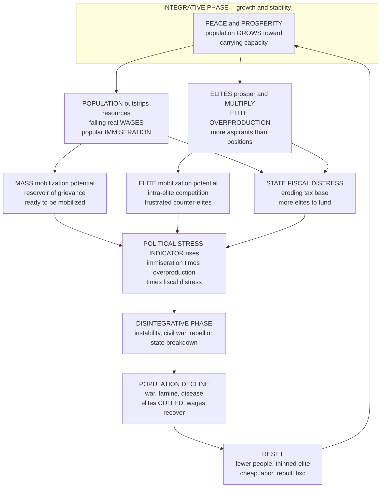

# 🏛️ Secular Cycles and Structural-Demographic Theory

> [!abstract] TL;DR
> **Structural-demographic theory (SDT)** is the flagship theory of **cliodynamics** — first sketched by **Jack Goldstone** and built into a quantitative program by **Peter Turchin** — that explains the recurring **rise and fall**, integration and disintegration, of complex **agrarian societies** as the emergent outcome of three interacting structural components: the general **POPULATION** (its size relative to carrying capacity, and the living standards / immiseration of commoners), the **STATE** (its fiscal health, administrative capacity, and legitimacy), and the **ELITES** (their numbers, wealth, cohesion, and internal competition). The theory's core is a **feedback loop**: in the **integrative phase**, peace and prosperity let population grow, but growth eventually **outstrips resources**, driving down real **wages** and **immiserating** the masses (Malthusian pressure), while elites **prosper and multiply** faster than the positions of power and wealth can absorb them — Turchin's signature diagnosis of **ELITE OVERPRODUCTION** — so a surplus of frustrated **counter-elites** intensifies intra-elite competition and factional conflict; meanwhile the **state**, squeezed between more elites to fund and an eroding tax base, slides into fiscal crisis and loses legitimacy, until the accumulated pressure tips the society into the **disintegrative phase** of civil war, rebellion, state breakdown, and population **decline** (war, famine, disease) — which **resets** the system (fewer people, culled elites, cheaper labor, a rebuilt fisc) and begins a new cycle. The empirical signature is a **secular cycle**: a recurring **~2–3 century** oscillation of integration and disintegration, documented by **Turchin & Nefedov** across ancient **Rome**, medieval and early-modern **England, France, Russia**, and dynastic **China**. Operationalized in Turchin's **Political Stress Indicator (Ψ)** — a composite of mass immiseration, elite overproduction, and state fiscal distress — SDT was controversially turned on the modern **United States**, where in **2010** Turchin forecast a period of rising instability peaking around **2020** (elaborated in *End Times*, 2023). Contested for oversimplification, cherry-picking, and "physics envy," yet defended as a source of **falsifiable, cross-culturally recurrent** predictions, SDT is a bold, quantitative account of why **a society's very success sows the seeds of its recurring breakdown** — the ecology of civilizations.

---

## Intuition

**Analogy — the forest and the fire.** A forest, left undisturbed, grows lush for decades. Trees crowd in, the canopy thickens, and — invisibly, year by year — **dead wood, dry needles, and tangled underbrush accumulate on the floor**. The forest looks healthiest precisely when it is most **combustible**: its very success has quietly stockpiled the *kindling* for its own destruction. Then a single spark — a lightning strike, a careless ember — ignites an **inferno** that sweeps through, clears the accumulated fuel, and leaves scorched, open ground. From that cleared ground, the cycle begins again. Ecologists call this the fire cycle, and the crucial, counterintuitive lesson is that **the fuel load, not the spark, determines whether a fire becomes a catastrophe**. Decades of "success" are what make the eventual blaze so severe.

Agrarian societies, it turns out, work eerily the same way. In good times — peace, good harvests, a competent state — **population swells and elites multiply**. But this very success quietly accumulates its own kindling: **too many mouths** pressing on a fixed supply of land (falling wages, hungrier peasants), **too many rival elites** chasing a limited number of offices and estates, and **a state stretched thin** trying to feed both. The society can look prosperous and mighty at the exact moment its fuel load is highest. Then some spark — a bad harvest, a lost war, a disputed succession — ignites a century of civil war, famine, and collapse that "burns off" the excess population and culls the surplus elites, resetting the clock for a new cycle of growth. **Structural-demographic theory is the ecology of civilizations**: it shows, mechanistically and quantitatively, how the *success* of a society plants the seeds of its own recurring *crisis* — and why, like a fire, the crisis is largely written in the fuel long before the spark arrives.

---

## How It Works

### Core Mechanics

SDT is a **mechanistic, quantitative** theory: it names a small set of structural variables, specifies how they interact, and derives the cyclical behavior as a *consequence* rather than assuming it. Following Goldstone (1991) and Turchin (2003), the moving parts are three, and the dynamics are a **three-body problem of social physics**.

**1. The three structural components.**
- **POPULATION (the commoners).** What matters is not headcount alone but population *relative to carrying capacity* — the ratio that sets the **real wage** and the degree of **immiseration**. When population is low, land is abundant, wages are high, and life is good; as population grows toward the ceiling, land grows scarce, rents rise, wages fall, and the mass of commoners is squeezed. This is the **Malthusian** engine, but SDT adds a *distributional* twist: falling wages are the mirror image of *rising rents*, which flow to landowners — the elites.
- **The STATE.** The state extracts resources (taxes), maintains order (army, courts), and co-opts elites (offices, patronage). Its health is measured by the balance of **revenue versus expenditure**, its **administrative capacity**, and — critically — its **legitimacy**. A solvent, legitimate state can absorb shocks; a bankrupt, discredited one cannot.
- **The ELITES.** The decisive variable in Turchin's version. What matters is elite **numbers**, **wealth**, **cohesion**, and above all their **competition** for a limited pool of elite *positions* (offices, titles, estates, seats). Elites are simultaneously the state's partners and its rivals, and their internal harmony or conflict makes or breaks political order.

**2. The integrative phase — success accumulates the kindling.** A secular cycle opens after a crisis has cleared the ground: few people, cheap land, high wages, a lean elite, a solvent state. Peace and prosperity let **population grow** (the classic logistic climb toward carrying capacity). But growth is self-undermining. As population presses on resources, **real wages fall and the commoners immiserate** (a reservoir of grievance and mobilization potential builds). At the same time, cheap labor and rising rents mean **elites prosper**, and prosperity lets them **multiply** — through biological reproduction *and* upward mobility as ambitious commoners buy their way in. Elite numbers grow **faster than elite positions**, and the fuel load rises.

**3. Elite overproduction — the master variable.** Turchin's signature concept: a society produces **more elite aspirants** (wealthy, educated, credentialed, ambitious people who *expect* power and status) than there are **elite positions** to accommodate them. The result is a structural **surplus of frustrated aspirants** who intensify **intra-elite competition**, factionalism, and eventually open conflict. Disappointed **counter-elites** — those with elite ambitions but no elite berth — become the leadership cadre that mobilizes the immiserated masses. As Turchin puts it, *"the most dangerous product a society can overproduce is elites."* Overproduction is **measurable** (e.g., lawyers or PhDs per available position, the number of aspirants to high office, wealth concentration at the top) and is the strongest leading indicator of crisis.

**4. State fiscal crisis — the squeeze.** The state is caught in a scissors. On one blade, an **expanding elite** demands more offices, salaries, and patronage to buy its loyalty; on the other, **immiserated commoners** yield less tax and require more repression. Revenue erodes as expenditure climbs; deficits mount; the state borrows, debases the currency, or defaults — and **loses legitimacy**. A cash-strapped, discredited state can no longer co-opt elites or suppress unrest.

**5. The disintegrative phase — the fire.** When immiseration, elite overproduction, and state fiscal distress all peak together, the society becomes **combustible**, and almost any spark ignites it: **political instability, civil war, rebellion, coups, and state breakdown**. War, famine, and epidemic drive **population decline**; elites are **culled** (killed, exiled, downwardly mobile) as factions destroy each other; the fisc is either rebuilt by a victor or the polity fragments. This violent contraction **resets** the structural variables — fewer people means cheap land and rising wages again; a thinned elite means competition eases; a reconstituted state can rebuild legitimacy — and a **new integrative phase** begins. Success bred crisis; crisis clears the ground for renewed success.

**6. Secular cycles and the Political Stress Indicator.** The empirical result of this loop is a **secular cycle** — a long, **century-scale** ("secular," from *saeculum*) oscillation of roughly **two to three centuries**, distinct from short economic or business cycles. Turchin operationalizes the crisis risk into a **Political Stress Indicator (PSI, Ψ)**: a composite index that multiplies **Mass Mobilization Potential** (immiseration), **Elite Mobilization Potential** (overproduction and competition), and **State Fiscal Distress**. When all three rise together, Ψ spikes — and historically, instability follows.

### Flow / Architecture



---

## Key Concepts

### Secondary Level

- **Good times store up trouble.** When a country is peaceful and prosperous, more people are born and more rich, ambitious families rise. That sounds great — but slowly it creates **too many people for the land** (so ordinary people get poorer) and **too many powerful people fighting over too few top jobs**. Like dry wood piling up in a forest, the "success" quietly becomes fuel for a fire.
- **Three moving parts.** SDT watches three things at once: **ordinary people** (are they well-fed or squeezed?), the **government** (is it rich and respected, or broke and distrusted?), and the **elites** (are there few and cooperative, or too many and fighting?).
- **Elite overproduction.** The key idea: if a society trains and enriches **more would-be leaders than there are leadership spots**, the leftover, frustrated elites cause trouble — they lead rebellions and split society into warring camps.
- **The cycle.** Growth → crowding and elite infighting → a broke, weak government → a period of war and collapse that thins the population and the elites → recovery → and the whole thing repeats, roughly every **two or three centuries**.
- **Why it matters.** The same pattern shows up in ancient **Rome**, imperial **China**, and medieval **Europe** — and Turchin controversially argues it is happening in the modern **United States** too.

### Undergraduate Level

- **The theory and its lineage.** SDT descends from **Malthus** (population versus resources) but rejects a purely demographic story. **Jack Goldstone**'s *Revolution and Rebellion in the Early Modern World* (1991) showed that the great early-modern upheavals (English Civil War, French Revolution, Ottoman and Ming crises) shared a **demographic-structural** signature: population growth interacting with **elite competition** and **state fiscal crisis**. **Peter Turchin** formalized this into **cliodynamics** — the mathematical modeling of historical dynamics — turning verbal theory into **coupled dynamical equations**.
- **The wage–rent seesaw.** As population rises toward carrying capacity, the **real wage falls** (labor is abundant) while **rents rise** (land is scarce). This single mechanism simultaneously **immiserates commoners** *and* **enriches elites**, which is why mass suffering and elite exuberance coincide at the cycle's peak — and why rising **inequality** is diagnostic of an approaching crisis.
- **Elite overproduction, precisely.** Let elite *aspirants* grow (biology plus upward mobility fueled by surplus) while elite *positions* stay roughly fixed. The **ratio of aspirants to positions** climbs above one; the surplus becomes **counter-elites**. Competition shifts from productive rivalry to zero-sum factional conflict — the political analogue of too many candidates for too few chairs.
- **The state in the middle.** The state mediates: it taxes commoners, pays and co-opts elites, and enforces order. Elite overproduction **raises the cost** of co-optation while immiseration **shrinks the tax base**, producing chronic **fiscal deficits** and a **legitimacy crisis** — the third leg of the stool.
- **Secular cycles, empirically.** Turchin & Nefedov's *Secular Cycles* (2009) reconstruct the pattern in eight cases across **Rome, England, France, Russia, and China**, finding a recurring structure: an **integrative** upswing (~100–150 years) of growth and stability, a **stagflation/crisis** transition, and a **disintegrative** downswing of instability and decline. Each cycle carries embedded shorter **"fathers-and-sons"** (~50-year) waves of violence.

### Graduate Level

- **The demographic-fiscal model.** Turchin's minimal model couples population `N` to state resources `S`: `dN/dt = r N (1 − N/k)` (logistic growth) and `dS/dt = ρ0 N (1 − N/k) − β N`, where the state's carrying capacity `k` can itself depend on `S` (state investment raises `k`). This alone yields a **boom then fiscal exhaustion**; adding an **instability** variable that rises with population pressure and depresses effective carrying capacity converts damped dynamics into **sustained secular cycles** (Turchin 2003; Turchin & Korotayev 2006). The elite-commoner interaction has a natural **predator–prey** reading — elites "graze" on the commoner surplus — which is why relaxation-oscillator and Rosenzweig–MacArthur structures reproduce the observed rise-and-fall.
- **The Political Stress Indicator.** `Ψ = MMP × EMP × SFD`, the product of **Mass Mobilization Potential** (a function of the inverse real wage and urbanization), **Elite Mobilization Potential** (elite numbers relative to positions and elite incomes), and **State Fiscal Distress** (debt relative to GDP, or the inverse of fiscal reserves relative to demand). The multiplicative form encodes that crisis requires **all three** to align: immiserated masses *and* surplus counter-elites to lead them *and* a state too weak to suppress them.
- **Two clocks.** SDT distinguishes the **long secular wave** (population/elite/state, ~2–3 centuries) from an embedded **~50-year violence cycle** ("fathers and sons"): waves of political violence recur about every two generations because the cohort that lived through the last bout of bloodshed ages out, and their memory-free descendants re-escalate. Spectral analysis of U.S. political-violence data (Turchin) shows both signals.
- **Endogeneity versus contingency.** SDT is a theory of **endogenous, structurally-driven** instability: the *spark* (a bad harvest, a lost war, an assassination) is treated as exogenous and near-inevitable, while the *fuel load* (the structural pressures) is what the theory predicts. Critics counter that this makes the theory hard to falsify (the spark is always available) and neglects **agency, culture, geography, and genuine contingency**; defenders reply that the theory predicts *when* sparks catch — high-Ψ periods burn, low-Ψ periods do not.
- **Empirical operationalization and data.** Testing SDT requires reconstructing centuries-long time series of **real wages**, **stature/skeletal health** (biological standard of living), **elite marker counts** (coin hoards, elite tomb/monument frequencies, university enrollments, numbers of aristocrats), **inequality**, and **socio-political instability** (counts of civil wars, revolts, urban riots, assassinations). Turchin's **CrisisDB** and the broader **Seshat: Global History Databank** aim to make such tests systematic and cross-cultural.

---

## Python Demo

We build a small **structural-demographic model** and watch it generate **secular cycles**. Four variables evolve over "historical" time: commoner **population** `N` (growing logistically toward carrying capacity), **elite** numbers `E` (a "predator" that lives off the commoner surplus — Turchin's own predator–prey reading), **state resources** `S` (taxes production, pays elites, funds repression), and **political instability** `W` (driven by Turchin's **Political Stress Indicator** = immiseration × elite-overproduction × fiscal-distress). The `N`–`E` core is a **Rosenzweig–MacArthur** predator–prey system tuned *past* the "paradox of enrichment" threshold, so it settles onto a **limit cycle** — the mathematical secular cycle — while `S` and `W` are slaved to it: the state **builds a surplus then goes bankrupt**, and instability **spikes at each peak**. Part (b) then plots the **elite-overproduction driver** explicitly and shows how a **policy that curbs overproduction** (raising elite attrition — wealth taxes, more positions, channels for surplus aspirants) **tames** the later crises. `numpy` and `matplotlib` only.

```python
# Secular cycles from a structural-demographic model: population, state, and
# instability oscillate over centuries, driven by elite overproduction.
# numpy + matplotlib only.
import numpy as np
import matplotlib
matplotlib.use("Agg")
import matplotlib.pyplot as plt

# ---------------------------------------------------------------------
# MODEL. Four coupled variables integrated with RK4:
#   N  commoner POPULATION  -> logistic growth toward carrying capacity K,
#                              "grazed" by elites (Holling type-II response)
#   E  ELITE numbers        -> a predator living off the commoner surplus
#   S  STATE resources/fisc -> tax on production - elite upkeep - war cost
#   W  political INSTABILITY-> tracks the Political Stress Indicator (PSI)
# The N-E pair is a Rosenzweig-MacArthur system past the paradox-of-
# enrichment threshold, so it LIMIT-CYCLES: the secular cycle. S and W ride it.
# ---------------------------------------------------------------------
cfg = dict(
    r=0.5, K=1.0,                 # commoner logistic growth, carrying capacity
    alpha=3.0, h=1.0,             # elite extraction: attack rate, handling time
    chi=0.5, m0=0.15,             # elite conversion efficiency, baseline attrition
    tau=1.2, phi=0.5, omega=0.6,  # state: tax rate, elite upkeep, war cost
    E_ref=0.20, S_ref=2.0,        # "healthy" elite level, full-treasury scale
    rho=0.8, eta=0.3,             # instability: stress gain, decay in peacetime
)

def stress(N, E, S, cfg):
    """Turchin's PSI = immiseration x elite-overproduction x fiscal-distress."""
    immiseration   = N / cfg["K"]                              # mass mobilization potential
    overproduction = E / cfg["E_ref"]                          # aspirants per "position"
    fiscal_distress = np.clip(1.0 - S / cfg["S_ref"], 0.0, 1.0)
    return immiseration * overproduction * fiscal_distress, overproduction

def derivs(state, cfg, m):
    N, E, S, W = state
    N = max(N, 1e-9); E = max(E, 1e-9)
    f    = cfg["alpha"] * N / (1.0 + cfg["alpha"] * cfg["h"] * N)  # extraction per elite
    prod = N * (1.0 - N / cfg["K"])                               # production (hump at N=K/2)
    psi, _ = stress(N, E, S, cfg)
    dN = cfg["r"] * N * (1.0 - N / cfg["K"]) - f * E              # growth minus elite predation
    dE = cfg["chi"] * f * E - m * E                              # elites grow on surplus, decay
    dS = cfg["tau"] * prod - cfg["phi"] * E - cfg["omega"] * W * N  # fisc: tax - upkeep - war
    dW = cfg["rho"] * psi - cfg["eta"] * W                       # instability tracks stress
    return np.array([dN, dE, dS, dW])

def run(cfg, T=600.0, dt=0.05, m_policy=None, t_policy=1e9,
        N0=0.30, E0=0.05, S0=1.0):
    steps = int(T / dt)
    state = np.array([N0, E0, S0, 0.0], dtype=float)
    H = np.empty((steps, 4)); PSI = np.empty(steps); OVER = np.empty(steps)
    for i in range(steps):
        t = i * dt
        m = cfg["m0"] if (m_policy is None or t < t_policy) else m_policy
        k1 = derivs(state, cfg, m)
        k2 = derivs(state + 0.5 * dt * k1, cfg, m)
        k3 = derivs(state + 0.5 * dt * k2, cfg, m)
        k4 = derivs(state + dt * k3, cfg, m)
        state = state + (dt / 6.0) * (k1 + 2 * k2 + 2 * k3 + k4)
        state[0] = max(state[0], 1e-9); state[1] = max(state[1], 1e-9)
        H[i] = state
        PSI[i], OVER[i] = stress(state[0], state[1], state[2], cfg)
    return np.arange(steps) * dt, H, PSI, OVER

YR = 6.0   # illustrative: 1 model time-unit ~ 6 years, so a cycle ~ 2-3 centuries
t,  H,  PSI,  OVER  = run(cfg, T=600, dt=0.05)                        # baseline history
tp, Hp, PSIp, OVERp = run(cfg, T=600, dt=0.05, m_policy=0.24, t_policy=300.0)  # + policy

N, E, S, W = H[:, 0], H[:, 1], H[:, 2], H[:, 3]
years = t * YR
thr    = 0.35 * W.max()          # threshold marking "disintegrative" (crisis) intervals
crisis = W > thr

# ---- crisis-episode bookkeeping for the printed report --------------------
idx = np.where(crisis)[0]
episodes = 0 if idx.size == 0 else 1 + int(np.count_nonzero(np.diff(idx) > 1))
print("=" * 66)
print("SECULAR CYCLES from a structural-demographic model")
print("=" * 66)
print(f"  simulated span ~ {years[-1]:.0f} model-years")
print(f"  disintegrative (crisis) episodes detected : {episodes}")
print(f"  peak population N ~ {N.max():.2f} of carrying capacity")
print(f"  peak elite overproduction ~ {OVER.max():.1f}x available positions")
print(f"  deepest state deficit S ~ {S.min():.2f} (fiscal bankruptcy)")
print(f"  peak instability W ~ {W.max():.2f}")
print("  -> success (growth + elite multiplication) accumulates the 'kindling';")
print("     immiseration + elite overproduction + fiscal distress ignite the crisis.")

# ---- figure ---------------------------------------------------------------
def shade(ax, xs, mask, color="#dc2626", alpha=0.12):
    ix = np.where(mask)[0]
    if ix.size == 0:
        return
    for g in np.split(ix, np.where(np.diff(ix) > 1)[0] + 1):
        ax.axvspan(xs[g[0]], xs[g[-1]], color=color, alpha=alpha, lw=0)

fig, ax = plt.subplots(2, 3, figsize=(17, 9.5))
fig.suptitle("Structural-Demographic Theory: how a society's success breeds its "
             "recurring crisis", fontsize=14, fontweight="bold")

axA = ax[0, 0]                                        # (A) the secular cycle
axA.plot(years, N, color="#2563eb", lw=2, label="population N")
axA.plot(years, E, color="#b45309", lw=2, label="elites E")
shade(axA, years, crisis)
axA.set_title("(A) Secular cycle: population and elites")
axA.set_xlabel("time (approx. years)"); axA.set_ylabel("scaled size")
axA.legend(fontsize=8); axA.grid(alpha=0.25)

axB = ax[0, 1]                                        # (B) state fisc
axB.plot(years, S, color="#059669", lw=2)
axB.axhline(0, color="black", lw=1)
axB.fill_between(years, S, 0, where=(S < 0), color="#dc2626", alpha=0.25)
shade(axB, years, crisis)
axB.set_title("(B) State resources: surplus then bankruptcy")
axB.set_xlabel("time (approx. years)"); axB.set_ylabel("state fisc S")
axB.grid(alpha=0.25)

axC = ax[0, 2]                                        # (C) instability
axC.plot(years, W, color="#dc2626", lw=2)
shade(axC, years, crisis)
axC.set_title("(C) Political instability spikes at each crisis")
axC.set_xlabel("time (approx. years)"); axC.set_ylabel("instability W")
axC.grid(alpha=0.25)

axD = ax[1, 0]                                        # (D) elite overproduction driver
axD.plot(years, OVER, color="#7c3aed", lw=2, label="elite overproduction  E / E_ref")
axD.axhline(1.0, color="black", ls="--", lw=1, label="positions available")
axD2 = axD.twinx()
axD2.plot(years, W, color="#dc2626", lw=1.1, alpha=0.55)
axD2.set_ylabel("instability W", color="#dc2626")
axD.set_title("(D) Elite OVERPRODUCTION leads instability")
axD.set_xlabel("time (approx. years)"); axD.set_ylabel("aspirants per position")
axD.legend(fontsize=7, loc="upper left"); axD.grid(alpha=0.25)

axE = ax[1, 1]                                        # (E) policy tames the crises
axE.plot(t * YR,  W,        color="#dc2626", lw=1.6, label="baseline")
axE.plot(tp * YR, Hp[:, 3], color="#2563eb", lw=1.6,
         label="with elite-overproduction policy")
axE.axvline(300 * YR, color="gray", ls=":", lw=1.5)
axE.text(300 * YR, W.max() * 0.92, " policy on", fontsize=8, color="gray")
axE.set_title("(E) Curbing elite overproduction tames instability")
axE.set_xlabel("time (approx. years)"); axE.set_ylabel("instability W")
axE.legend(fontsize=8); axE.grid(alpha=0.25)

axF = ax[1, 2]                                        # (F) the attractor
axF.plot(N, E, color="#334155", lw=0.8)
axF.plot(N[-1], E[-1], "o", color="#dc2626")
axF.set_title("(F) Phase portrait: the secular-cycle attractor")
axF.set_xlabel("population N"); axF.set_ylabel("elites E")
axF.grid(alpha=0.25)

plt.tight_layout(rect=[0, 0, 1, 0.95])
plt.savefig("secular_cycles_structural_demographic.png", dpi=110, bbox_inches="tight")
plt.show()
```

**What the demo shows.** Nothing in the model is *told* to cycle: identical rules and a fixed carrying capacity produce, endogenously, a recurring rise-and-fall.

- **Panel A (the secular cycle).** Population climbs during the **integrative phase**, elites lag then surge (living off the growing surplus), and both **crash** together in the shaded **disintegrative** intervals — the boom-and-bust of a complex society, repeating every couple of "centuries."
- **Panel B (state fisc).** The treasury **builds a surplus** while the economy is productive and elites are few, then **drains into deficit** (red) as elite upkeep and war costs mount — Turchin's fiscal crisis, arriving just as the society most needs a strong state.
- **Panel C (instability).** The **Political Stress Indicator** stays low through prosperity and then **spikes** precisely when population pressure, elite overproduction, and fiscal distress align — the crisis, written in the fuel before the spark.
- **Panel D (elite overproduction, the driver).** The ratio of elite aspirants to available positions rises **above one** (the dashed line) in the run-up to each crisis and **leads** the instability curve — the mechanistic heart of the theory: overproduced elites are the leading indicator of breakdown.
- **Panel E (policy).** A counterfactual in which, midway through history, a policy **raises elite attrition** (wealth taxes, expanded positions, channels for surplus aspirants) **flattens the overproduction peaks and tames the later instability** — the model's version of "reduce the fuel load and the fires get smaller."
- **Panel F (the attractor).** In the population–elite plane the trajectory settles onto a **closed loop** — a **limit cycle**, the dynamical-systems object *behind* the recurring history (see [[Dynamical_Systems_and_Attractors]]).

The takeaway is the theory in one image: **a society's very success — growth and elite multiplication — is what accumulates the structural pressures that ignite its recurring collapse.**

---

## Real-World Applications

> **Example — dynastic China and the "dynastic cycle."** The classic Chinese pattern of dynasties that founded on cheap land and lean bureaucracies, grew through a golden age, then decayed into factionalism, peasant rebellion, fiscal collapse, and conquest is a textbook secular cycle. Turchin & Nefedov analyze Han and Tang China as cases where population growth, a swelling gentry and official class (**elite overproduction**), and imperial fiscal exhaustion aligned before dynastic breakdown — the deep structure beneath the traditional "Mandate of Heaven" narrative. See [[Ancient_Chinese_Dynasties]].

- **Rome, republican and imperial.** The crisis of the late Roman Republic (Gracchi to Augustus) and the third-century imperial crisis are analyzed as disintegrative phases: land concentration immiserating the citizen-farmer base, a glut of ambitious senatorial and equestrian aspirants competing violently for a fixed number of magistracies, and fiscal/monetary breakdown (currency debasement). SDT reframes the [[Fall_of_the_Western_Roman_Empire|fall of Rome]] as the trough of a structural cycle rather than a singular catastrophe.
- **Early-modern Europe and Goldstone's revolutions.** Goldstone's original demographic-structural analysis explains the clustering of upheavals — the English Civil War, the Fronde and ultimately the [[The_French_Revolution|French Revolution]], Ottoman and Ming crises — as products of simultaneous population pressure, elite competition, and state fiscal crisis, tying directly to the study of [[Social_Movements_and_Revolution|revolution and rebellion]].
- **The [[The_Black_Death|Black Death]] as a cycle reset.** The fourteenth-century plague is the vivid empirical test: a massive population crash sent **real wages soaring** and rents collapsing, easing elite competition and inverting the wage–rent seesaw — exactly the "reset" SDT predicts, and a natural experiment linking demography to the structural variables (see [[Demographic_and_Environmental_History]]).
- **Contemporary United States — the controversial forecast.** In a 2010 *Nature* commentary, Turchin predicted the U.S. was entering a period of rising instability likely to **peak around 2020**, driven by stagnant real wages (immiseration), surging **elite overproduction** (a glut of law and PhD graduates, extreme wealth concentration, intensifying intra-elite conflict), and declining state fiscal health and legitimacy. *Ages of Discord* (2016) and *End Times* (2023) elaborate the case, making SDT a live, testable diagnostic of present-day polarization and instability — connected to inequality dynamics in [[Wealth_and_Income_Inequality_Dynamics]].
- **Early warning and the cliodynamics program.** SDT motivates the ambition of the broader *Cliodynamics_and_Quantitative_History* program and databank projects (CrisisDB, Seshat) to build **quantitative early-warning indicators** of societal instability from measurable structural pressures — with the aspirational policy payoff of *reducing* those pressures (curbing inequality and elite overproduction) before the spark arrives.

---

## Common Pitfalls

- **Reading SDT as demographic determinism / Malthus redux.** The population variable matters only through its effect on **wages, elites, and the state**. Immiseration alone rarely causes collapse; it is the *combination* with **elite overproduction** and **state fiscal crisis** that ignites. Treating SDT as "too many people → collapse" misses the entire structural apparatus that distinguishes it from crude Malthusianism.
- **Mistaking the spark for the cause.** SDT explains the **fuel load** (structural pressure), not the specific **spark** (which harvest fails, which war is lost, which leader is assassinated). Attributing a crisis to its trigger — "the revolution happened because of the bread price" — inverts the theory: high-Ψ societies are combustible and *some* spark is near-certain, while low-Ψ societies absorb the same shocks. Confusing trigger with structure is the most common misreading.
- **Overproduction is not "too many educated people are bad."** Elite overproduction is a **ratio** — aspirants relative to *positions* — not an absolute level of education or ambition. The pathology is the **mismatch and the resulting zero-sum competition**, which policy can ease by *expanding* positions or *channeling* surplus aspirants, not only by producing fewer of them. Reading it as anti-education or anti-mobility distorts the concept.
- **Cherry-picking and post-hoc fitting.** The sharpest critique: with enough free parameters and proxy choices, one can "find" a cycle almost anywhere, and dating phases after the fact risks confirmation. Rigorous tests demand **pre-registered proxies**, **out-of-sample** cases, and explicit **null models** (would random data show the same "cycles"?). Presenting a fitted narrative as a validated prediction is the field's cardinal sin.
- **Ignoring contingency, agency, culture, and geography.** SDT abstracts away the very things historians prize — individual decisions, ideology, institutions, ecology, external conquest. The pressures set the *odds*; they do not script the outcome. Treating a structural model as a deterministic forecast of *specific* events (as opposed to elevated *risk*) both overclaims and invites the "physics envy" charge.
- **Conflating secular cycles with business cycles.** The **secular** (century-scale, structural) rhythm is distinct from short economic fluctuations (see [[Business_Cycles_and_Endogenous_Fluctuations]]). Applying SDT to explain a recession, or expecting a "cycle" on a decadal clock, is a category error — the relevant timescale is generations to centuries.
- **Assuming the model applies unchanged to modern industrial societies.** SDT was built for **agrarian** societies with a hard **land** carrying capacity. Industrial and post-industrial economies loosen the Malthusian ceiling (technology raises `k`), so applying the framework to the modern U.S. requires re-specifying "immiseration" (relative wages, precarity) and "carrying capacity" — a live methodological debate, not a settled transfer.

---

## Related Concepts

**Cliodynamics and quantitative history (this vault and History):**

- [[Big_History_and_Cliodynamics]] — the parent program: the mathematical, model-driven study of long-run historical dynamics of which SDT is the flagship theory.
- [[Fall_of_the_Western_Roman_Empire]] — a canonical disintegrative phase reinterpreted as the trough of a structural-demographic cycle.
- [[Ancient_Chinese_Dynasties]] — the dynastic cycle as a recurring secular cycle of growth, elite overproduction, and fiscal collapse.
- [[The_French_Revolution]] — Goldstone's founding demographic-structural case: population pressure plus elite competition plus fiscal crisis.
- [[The_Black_Death]] — the natural experiment of a population crash resetting the wage–rent seesaw and easing elite competition.
- [[Demographic_and_Environmental_History]] — the long-run population and resource series that SDT's population variable formalizes.

**Complexity economics and inequality (the distributional engine):**

- [[Wealth_and_Income_Inequality_Dynamics]] — the rising inequality (falling wages, concentrating elite wealth) that is SDT's leading indicator of crisis; the distributional core of the theory.
- [[Non_Equilibrium_and_Out_of_Equilibrium_Dynamics]] — SDT is an explicitly out-of-equilibrium account: societies never rest at a steady state but perpetually cycle.
- [[Business_Cycles_and_Endogenous_Fluctuations]] — the economic analogue of endogenously-generated oscillations, on a much shorter clock than the secular cycle.
- [[Institutions_Cooperation_and_Norms]] — the institutional and cooperative capacity that erodes as elite cohesion breaks down in the disintegrative phase.

**Systems thinking and dynamical systems (the mechanism):**

- [[Feedback_Loops_and_Causality]] — SDT is a structure of coupled feedback loops (growth → immiseration + overproduction → instability → reset).
- [[Nonlinearity_and_Feedback]] — the nonlinear interactions that turn smooth structural pressure into abrupt crisis.
- [[Dynamical_Systems_and_Attractors]] — the secular cycle *is* a limit-cycle attractor, as the demo's phase portrait shows.
- [[Bifurcations_and_Tipping_Points]] — the threshold at which accumulated stress tips a society from integration into disintegration.
- [[Complex_Adaptive_Systems]] — society as a CAS whose macro-dynamics (cycles) emerge from interacting populations, elites, and the state.
- [[Systems_of_ODEs]] — the coupled ordinary differential equations that formalize the demographic-fiscal model.

**Sociology (the human stakes):**

- [[Social_Movements_and_Revolution]] — the revolts and revolutions that constitute the disintegrative phase; counter-elites mobilizing the immiserated.
- [[Social_Class_and_Stratification]] — the elite/commoner divide and the class dynamics that SDT tracks structurally.
- [[Collective_Behavior_and_Crowds]] — the mass mobilization that turns structural stress into overt instability.
- [[Political_Sociology_and_Social_Power]] — the contest over state power that intensifies under elite overproduction.

**Method neighbors in this vault:**

- [[Computational_Social_Science_Overview]] — the field-level home of cliodynamics as computational, model-driven social science.
- [[Agent_Based_Models_of_Society]] — the complementary bottom-up simulation approach to the same long-run social dynamics.
- [[Opinion_Dynamics_and_Polarization]] — the polarization mechanisms that accompany elite fragmentation in the modern application of SDT.

**Planned siblings in this section (referenced above in prose, not yet written):** *Cliodynamics and Quantitative History* (the section overview), *The Evolution of Social Complexity* (why complex hierarchical societies arise in the first place), *War, Peace, and the Statistics of Conflict* (the empirical patterns of the violence that marks disintegrative phases), *Long-Run Economic and Population History* (the wage, price, and demographic series SDT is tested against), and *Cultural Evolution and Historical Dynamics* (how norms and institutions co-evolve with the structural cycle).

---

## Review Questions

### Secondary

1. Explain the "forest and fire" analogy in your own words: what is the "kindling" that a successful society quietly piles up, and what is the "spark"?
2. What does **elite overproduction** mean, and why is a *surplus* of ambitious, well-off people dangerous for social stability?
3. Name the three things structural-demographic theory watches (population, the state, the elites) and give a one-sentence description of what can go wrong with each near the peak of a cycle.

### Undergraduate

1. Trace the full **feedback loop** of a secular cycle from the start of an integrative phase to the reset, naming at each step what happens to **wages**, **elite numbers relative to positions**, and the **state's fiscal balance**. Why do mass immiseration and elite prosperity coincide?
2. Turchin's **Political Stress Indicator** is a *product* `Ψ = MMP × EMP × SFD`, not a sum. Explain why the multiplicative form matters: what does it imply about whether immiseration *alone* — or elite overproduction *alone* — is enough to cause a crisis?
3. The Black Death caused a huge population crash in fourteenth-century Europe. Using the wage–rent seesaw and the three structural components, predict what should have happened to commoner wages, elite competition, and the structural pressure toward crisis — and explain why this makes the plague a useful natural experiment for SDT.

### Graduate

1. In the Python demo, the population–elite core is a Rosenzweig–MacArthur predator–prey system tuned past the paradox-of-enrichment threshold, so it settles onto a **limit cycle**. Explain the analogy between "elites grazing on the commoner surplus" and predator–prey dynamics, and discuss what it means, methodologically, that a secular cycle can be represented as a **limit-cycle attractor** rather than a sequence of unique historical events.
2. SDT treats the **spark** of a crisis as exogenous and the **fuel load** (structural pressure) as what the theory predicts. Construct the strongest version of the **falsifiability critique** (that this makes the theory unfalsifiable and prone to post-hoc fitting), and then the strongest **defense** (out-of-sample cases, pre-registered proxies, null models, the 2010 U.S. forecast). Where do you come down, and what evidence would change your mind?
3. Turchin applies a theory built for **agrarian** societies (hard land carrying capacity) to the modern **industrial** United States. Identify precisely which model assumptions break when technology raises carrying capacity, how "immiseration," "carrying capacity," and "elite positions" must be re-operationalized for a post-industrial economy, and whether the re-specified theory still yields **testable** predictions or becomes an untestable metaphor.

---

## Sources

- [Turchin, P. (2003). *Historical Dynamics: Why States Rise and Fall*. Princeton University Press](https://press.princeton.edu/books/paperback/9780691180779/historical-dynamics) — the foundational formalization of cliodynamics and the demographic-fiscal model.
- [Turchin, P. & Nefedov, S. A. (2009). *Secular Cycles*. Princeton University Press](https://press.princeton.edu/books/paperback/9780691136967/secular-cycles) — the eight-case empirical study across Rome, England, France, and Russia.
- [Goldstone, J. A. (1991). *Revolution and Rebellion in the Early Modern World*. University of California Press](https://www.google.com/books/edition/Revolution_and_Rebellion_in_the_Early_Mo/w1Rf9E5nQ8kC) — the original demographic-structural theory of state breakdown.
- [Turchin, P. (2010). "Political instability may be a coming attraction." *Nature* 463, 608](https://doi.org/10.1038/463608a) — the 2010 forecast of rising U.S. instability peaking around 2020.
- [Turchin, P. (2023). *End Times: Elites, Counter-Elites, and the Path of Political Disintegration*. Penguin Press](https://www.google.com/books/edition/End_Times/y1J1EAAAQBAJ) — elite overproduction and the contemporary structural-demographic diagnosis.
- [Turchin, P. & Korotayev, A. (2006). "Population Dynamics and Internal Warfare: A Reconsideration." *Social Evolution & History* 5(2), 112–147](http://www.sociostudies.org/journal/articles/126425/) — the coupled population–instability model that generates sustained secular cycles.

---

#computational-social-science #secular-cycles #structural-demographic-theory #elite-overproduction #cliodynamics
