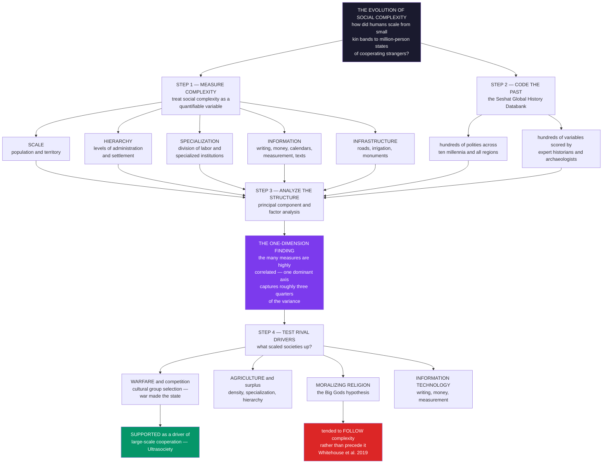

# 🏛️ The Evolution of Social Complexity

> [!abstract] TL;DR
> **The evolution of social complexity** asks the biggest question in the human story: how did our species scale up from small, egalitarian **kin bands** of a few dozen people — cooperating only with those they knew — to vast **states and empires** of *millions of cooperating strangers*, all within the last ~10,000 years? For most of history this was a matter of grand narrative and armchair theory. Now it is becoming a **quantitative science**. The move is to treat **"social complexity"** as a *measurable variable* — operationalized through **scale** (population, territory), **hierarchy** (levels of administration and settlement), functional **specialization** (division of labor, specialized institutions), and **information systems** (writing, money, calendars, measurement, texts) — and then to **code hundreds of past societies on hundreds of variables** into a giant database, the **Seshat Global History Databank**, so that rival theories of what drove the scaling-up can be **statistically tested**. Two landmark results define the young field: **Turchin et al. (2018, PNAS)** found that the many facets of complexity are so tightly correlated that they largely capture a **single dominant dimension** — the first principal component explains roughly **three-quarters** of the variance, so societies rise (or fall) in complexity across *all* dimensions together, justifying a scalar "complexity axis." And the debate over **drivers** is now data-driven: Turchin's **"Ultrasociety"** thesis argues that intense inter-group **warfare** — via **cultural multilevel selection** — forged large-scale cooperation and the state ("war made the state"), while the high-profile **Whitehouse–François–Turchin (2019)** analysis found that **moralizing "Big Gods" religion tended to *follow* rather than precede** the rise of complexity. Amid serious challenges of **data quality, causal direction, and Western/normative bias**, this is a genuine landmark of computational social science: it makes the **deep human past a testable, quantitative subject**.

---

## Intuition

**Analogy:** Ten thousand years ago, *every* human being who ever lived belonged to a small band of a few dozen kin. You cooperated only with people you knew personally — your family, your foragers, your camp. Trust ran on faces and memory. A "stranger" was, almost by definition, a potential threat. Now look around you: billions of people cooperate daily with *total strangers* they will never meet — buying bread baked by someone in another city, obeying laws written by people long dead, praying with millions who share a faith, paying taxes to a bureaucracy spanning a continent. Somehow humanity performed one of the most staggering feats in the history of life on Earth: it **scaled cooperation from the band to the empire**, from dozens to millions, in a geological blink.

The old way to study this leap was to *tell a story* — a philosopher's just-so tale about the origins of the state, chosen by taste and rhetoric. The new way is to turn it into a **data problem**. Just as a biologist measures body mass or metabolic rate across thousands of species to find the laws of life, a new breed of quantitative historian **scores hundreds of past societies** — Sumerian city-states, the Roman Empire, medieval kingdoms, steppe confederations — on the *same* battery of variables: how big, how hierarchical, how specialized, how information-rich. With that giant matrix in hand you can finally *ask the data*: does complexity rise on all fronts at once, or piecemeal? Did warfare come before the state, or after? Did belief in punishing gods *cause* large-scale cooperation, or merely *accompany* it once societies were already huge? **The rise of civilization stops being a legend and becomes a hypothesis you can test.**

---

## How It Works

The evolution of social complexity, attacked quantitatively, proceeds in four moves: **(1)** define complexity as a *measurable quantity*, **(2)** *code the historical record* into a systematic database, **(3)** *analyze its structure* to see whether "complexity" is even one coherent thing, and **(4)** *statistically adjudicate* rival theories of what drove the scaling-up. This is the empirical core of **cliodynamics** — the mathematical, data-driven study of history pioneered by Peter Turchin — and it sits at the crossroads of **big history**, **cultural evolution**, and **computational social science**. (The vault's forthcoming *Cliodynamics_and_Quantitative_History* note frames the broader program.)

### 1. Measuring social complexity — turning "how complex?" into numbers

The foundational move is **operationalization**: treating **social complexity** not as a vague honorific but as a *quantifiable variable* with concrete components you can score for any society, ancient or modern:

- **SCALE** — the sheer size of the social unit: **population** of the polity, population of its largest **settlement** (capital), and **territory** controlled. The band-to-empire axis in its rawest form.
- **HIERARCHY** — the number of **levels** of control: administrative tiers, settlement hierarchy (hamlet → village → town → city → capital), military command levels, religious hierarchy. Deep chains of command are the skeleton of large-scale coordination.
- **SPECIALIZATION** — functional **division of labor** and the presence of **specialized institutions**: full-time bureaucrats, professional soldiers, priests, judges, merchants, engineers. Complexity means differentiation.
- **INFORMATION SYSTEMS** — the technologies of large-scale coordination: **writing** and record-keeping, **money** and coinage, standardized **weights and measures**, **calendars**, and bodies of formal **texts** (laws, scriptures, histories, sacred texts). You cannot run a million-person society on memory alone.
- **INFRASTRUCTURE** — the physical scaffolding: roads, irrigation, ports, monuments, public buildings, bridges.

Scoring a society on these axes converts "how complex is this civilization?" into a **vector of numbers** you can compare across time and place — the measurement basis for a *science* of social evolution.

### 2. The Seshat databank — big data for the deep past

The empirical engine is **Seshat: The Global History Databank** (named for the Egyptian goddess of record-keeping), a large collaborative project that **codes the historical and archaeological record** into structured data. Teams of research assistants, guided by domain-expert historians and archaeologists, score **hundreds of variables** — social scale, hierarchy, governance, economy, warfare and military technology, ritual and religion, information technology, agriculture — for **hundreds of past "polities"** (bounded societies at a place and time) spanning roughly **10,000 years** and drawn from all major world regions. Crucially, every value carries **provenance and uncertainty** (expert citations, confidence, disagreement flags), because the deep past is *known imperfectly*. The result is a systematic, quantitative dataset of the human past that makes **statistical analysis of social evolution** possible for the first time — the infrastructure on which the whole science rests.

### 3. The "one dimension" finding — is complexity a single thing?

Before you can have a science of *the* evolution of *complexity*, you must check that "complexity" is a coherent quantity and not a bag of unrelated traits. **Turchin et al. (2018, PNAS)** ran this test: they reduced Seshat's variables to **nine "complexity characteristics"** (polity population, territory, capital population, hierarchy, government, infrastructure, writing, texts, money) for hundreds of polities and asked how they co-vary. The striking result: the nine are so **highly correlated** that they largely collapse onto a **single dominant dimension** — the **first principal component explains roughly three-quarters (~77%) of the total variance**. Societies do not become complex piecemeal; they tend to rise (and fall) on **all facets together** — scale, hierarchy, specialization, and information move *in concert*. This empirically **justifies treating "social complexity" as a scalar quantity** that societies move along, and it is a genuine unifying finding: the leap from band to empire is, statistically, movement along *one* axis.

### 4. Testing rival drivers — what scaled societies up?

With complexity measured and shown to be one-dimensional, the grand theories become **testable hypotheses**. The leading candidates:

1. **WARFARE / competition** — Turchin's **"Ultrasociety"** thesis: intense inter-group **warfare**, especially once amplified by military technologies (cavalry, iron weapons, later gunpowder), **selected** for larger, better-organized, more cooperative societies. Groups that could field big, disciplined, well-provisioned armies out-competed and *replaced* those that could not. War is destructive, yet paradoxically it forged **large-scale cooperation** — "war made the state, and the state made war" (echoing Carneiro's *circumscription* theory and Tilly's state-formation sociology).
2. **AGRICULTURE / surplus** — the Neolithic foundation: farming enabled **density, storable surplus, sedentism, specialization, and hierarchy**. No surplus, no full-time priests, soldiers, or kings.
3. **MORALIZING RELIGION** — the **"Big Gods"** hypothesis (Norenzayan): belief in moralizing, punishing high gods who monitor behavior extended **prosociality beyond kin and face-to-face reciprocity**, letting strangers trust strangers under the eye of a supernatural enforcer.
4. **INFORMATION TECHNOLOGY** — writing, money, and standardized measurement as the *coordination* technologies that make large-scale administration mechanically possible.
5. **Geography, trade, and disease** — circumscription, connectivity, and the differential ecology of regions.

Seshat's payoff is that these can be **statistically adjudicated** rather than merely argued. Turchin's analyses find strong support for **warfare and military technology** as drivers of the *spread* of complex, cooperative societies. And the **Whitehouse–François–Turchin (2019, *Nature*)** study, testing the Big Gods hypothesis against the time-ordered Seshat record, reached a **counterintuitive, contested conclusion**: moralizing religion tended to **follow** rather than **precede** the rise of complexity (complexity → Big Gods, not the reverse) — a landmark example of *data-driven hypothesis testing on history* itself.

### The evolution of social complexity, in one picture



---

## Key Concepts

### Secondary Level

**The big story.** For almost all of human history, people lived in tiny groups of a few dozen relatives and friends. You only ever cooperated with people you *knew*. Then, over the last ten thousand years, something amazing happened: humans built villages, then cities, then kingdoms, then empires — societies where **millions of strangers** work together without ever meeting. How did we pull off that leap? That is the question of the **evolution of social complexity**.

**Turning it into numbers.** Instead of just telling a story, researchers now *measure* how complex a past society was, using a checklist:

| Ingredient of complexity | What it means |
|---|---|
| **Scale** | How many people, how much land |
| **Hierarchy** | How many levels of bosses and cities |
| **Specialization** | Are there full-time priests, soldiers, bureaucrats? |
| **Information** | Do they have writing, money, calendars? |

**Coding the past.** A giant project called **Seshat** scores hundreds of past societies on hundreds of such questions, building a **database of the human past** ten thousand years deep. With it, you can *test* ideas: for example, did huge societies grow because of **war**, because of **farming**, or because of **religion**? A surprising finding is that societies tend to grow complex in **all these ways at once** — a small society is simple in every way, a big one is complex in every way.

### Undergraduate Level

#### Complexity as a measured variable

The methodological heart is **operationalization**: define social complexity through concrete, codable components — **scale** (polity and capital population, territory), **hierarchy** (administrative, settlement, military, and religious levels), **specialization/government** (specialized institutions and full-time roles), **information** (writing, money, measurement systems, texts), and **infrastructure**. Each society becomes a **vector of scores**, making complexity *comparable* across a Sumerian city-state, Han China, and medieval France.

#### The Seshat Global History Databank

**Seshat** is the empirical engine — a collaborative effort coding the archaeological and historical record for hundreds of **polities** across ~10,000 years and all inhabited continents, on hundreds of variables (with expert citations and uncertainty attached). It transforms narrative history into a **structured dataset** amenable to statistics. This is the same "found/curated data" turn that defines computational social science broadly, applied to the *deep* past (see [[Computational_Social_Science_Overview]] and [[Big_Data_and_the_Social_Sciences]]).

#### The single dimension of complexity

Running **principal component analysis / factor analysis** on the complexity characteristics, **Turchin et al. (2018)** found the first principal component explains **~three-quarters of the variance** — the many measures are highly intercorrelated and largely capture **one latent axis**. Practically: you can meaningfully rank societies on a single "how complex" scale, and the leap from band to empire is movement along that axis. (The statistical tool is the same **PCA** used across data science — see [[PCA]] — and factor analysis as in psychometrics, see [[Factor_Analysis_and_Test_Construction]].)

#### Warfare and the scaling of cooperation — "Ultrasociety"

Turchin's central thesis is a paradox: **war built cooperation**. Under **cultural multilevel selection**, groups compete; those with institutions, norms, and technologies enabling *larger-scale internal cooperation* (disciplined armies, taxation, bureaucracy, unifying religion) **out-compete and replace** less-cooperative rivals. Intense, existential **warfare** — sharpened by military revolutions (chariots, cavalry, iron, gunpowder) — was thus a **crucible forging the state**. This directly extends evolutionary theories of cooperation to whole societies (see [[Group_and_Multilevel_Selection]] and [[Cultural_Evolution_and_Social_Learning]]). The vault's forthcoming *War_Peace_and_the_Statistics_of_Conflict* and *Cultural_Evolution_and_Historical_Dynamics* notes develop this thread.

#### The "Big Gods" debate

Did **moralizing religion** cause large-scale cooperation? Norenzayan's **"Big Gods"** argues that belief in punishing, all-seeing high gods extended trust beyond kin by installing a **supernatural monitor** — solving the stranger-cooperation problem religiously. The **Whitehouse–François–Turchin (2019)** Seshat test, however, found moralizing gods tended to **appear *after* societies crossed a complexity threshold** (roughly a million people), suggesting **complexity → Big Gods**, not the reverse. Because it *inverted* a popular causal story using time-ordered data, this became one of the most-discussed — and most-contested — results in the field.

### Graduate Level

#### Cultural multilevel selection as the mechanism

The Ultrasociety argument is formally a **cultural group selection / multilevel selection** model: variation exists *between* groups in institutions and norms; **between-group competition** (warfare, differential survival, imitation of successful rivals) favors group-beneficial "prosocial" traits even when they are individually costly, provided between-group selection outweighs within-group free-riding. Warfare is the between-group selective pressure with the sharpest teeth. This connects the deep-history literature to the mathematics of cooperation — the **Price equation** decomposition, and models of [[Group_and_Multilevel_Selection]], [[Indirect_Reciprocity_and_Reputation]], and [[The_Prisoners_Dilemma_and_Cooperation]]. Norms and institutions are the *heritable* group-level traits; culture, not genes, is the fast replicator (see [[Institutions_Cooperation_and_Norms]] and [[The_Evolution_of_Conventions_and_Norms]]).

#### The causal-direction problem and the Big Gods controversy

The moralizing-religion finding is the field's sharpest methodological cautionary tale. Establishing **temporal precedence** (did A precede B?) in coded historical data is treacherous: variables **co-evolve**, coding is uneven, and — critically — **missing data are not missing at random** (writing appears when writing is *recorded*, so absence of evidence conflates with evidence of absence). A prominent **re-analysis (Beheim et al. 2021)** argued that the Whitehouse et al. conclusion was sensitive to how *unknown/missing* values were coded — recoding "no evidence" cases could weaken or reverse the "religion follows complexity" result. The exchange is a live demonstration that in cliodynamics, **conclusions can hinge on data-handling conventions**, and that precedence claims demand explicit sensitivity analysis. (My Python demo below deliberately illustrates the *idealized* precedence test — a lagged cross-correlation — precisely so its assumptions are visible.)

#### Scaling laws of societies

A complexity-science strand imports **urban scaling theory** (Bettencourt–West): many features of cities scale as **power laws** of population — infrastructure sub-linearly (economies of scale, exponent < 1), socioeconomic output and innovation super-linearly (increasing returns, exponent > 1). Applied to *historical* societies, this reframes social evolution as **quantitative scaling regularities** in how energy use, information, and complexity grow with population — a "physics of society." This links directly to the heavy-tailed size distributions of settlements and firms (see [[Firm_Size_and_City_Size_Distributions]]) and to complexity economics' increasing-returns dynamics (see [[Complexity_Economics_Overview]]).

#### The honest reckoning — data quality, causation, and normativity

Three deep critiques temper the enthusiasm. **(1) Data quality:** coding the archaeological record is *hard* — sparse evidence, expert disagreement, interpretation, and the missing-not-at-random problem make many cells uncertain; Seshat's own uncertainty flags are essential, not decorative. **(2) Causal identification:** with a few hundred co-evolving polities and no experiments, disentangling warfare vs agriculture vs religion vs information as *causes* (versus correlated symptoms) is genuinely difficult — the Big Gods dispute is the emblem. **(3) Normative loading:** the very concept of "complexity" risks a **Western, state-centric, progressivist bias** — treating hierarchical agrarian states as the *telos* of social evolution and mislabeling large, sophisticated *non-state* societies (egalitarian confederacies, heterarchies) as "simple." Graeber and Wengrow's *The Dawn of Everything* presses exactly this point: history is *not* a single ladder from band to state, and "more complex" is not "more advanced." A mature science of social complexity must hold the **quantitative patterns** and the **historical particularity** in tension — and resist reading its scalar axis as a moral one. These debates connect to *Secular_Cycles_and_Structural_Demographic_Theory* and *Long_Run_Economic_and_Population_History* (forthcoming siblings) on the *rise-and-fall*, not just the rise, of complex societies.

---

## Python Demo

```python
import numpy as np
import matplotlib
matplotlib.use("Agg")
import matplotlib.pyplot as plt

# =====================================================================
# MEASURING THE EVOLUTION OF SOCIAL COMPLEXITY  (numpy + matplotlib only)
#
# PART A -- IS "SOCIAL COMPLEXITY" ONE DIMENSION?
#   Build a Seshat-style dataset: many past "polities" scored on 9
#   complexity characteristics (population, territory, capital size,
#   hierarchy, government, infrastructure, writing, texts, money). Each
#   is a noisy reflection of a hidden LATENT complexity. Run PCA from
#   scratch and show the FIRST principal component captures the large
#   majority of variance -- a single "social complexity" axis
#   (Turchin et al. 2018, PNAS, found PC1 ~ 77%).
#
# PART B -- DID A DRIVER PRECEDE COMPLEXITY?
#   Build a time-ordered trajectory for one region over ~10,000 years.
#   Warfare intensity drives LATER gains in complexity, with a lag.
#   A lagged cross-correlation shows the peak at a POSITIVE lag:
#   warfare PRECEDES the rise in complexity (Granger-style precedence).
# =====================================================================
rng = np.random.default_rng(7)

# ---------------------------------------------------------------------
# PART A: SESHAT-STYLE COMPLEXITY MATRIX  (societies x characteristics)
# ---------------------------------------------------------------------
n_soc = 250
cc_names = ["Population", "Territory", "Capital", "Hierarchy",
            "Government", "Infrastructure", "Writing", "Texts", "Money"]
p = len(cc_names)

# hidden "true" latent complexity of each society (standard normal)
latent = rng.normal(0, 1, n_soc)

# each characteristic loads POSITIVELY on the latent axis + its own noise
loadings = rng.uniform(0.85, 1.15, p)
noise_sd = 0.60
X = (latent[:, None] * loadings[None, :]
     + rng.normal(0, noise_sd, size=(n_soc, p)))

# standardize columns (z-scores) -> PCA on the CORRELATION matrix
Xz = (X - X.mean(0)) / X.std(0)
corr = np.corrcoef(Xz, rowvar=False)

# PCA from scratch: eigendecomposition of the correlation matrix
eigval, eigvec = np.linalg.eigh(corr)
idx = np.argsort(eigval)[::-1]
eigval, eigvec = eigval[idx], eigvec[:, idx]
var_explained = eigval / eigval.sum()
pc1_scores = Xz @ eigvec[:, 0]            # each society's position on PC1
pc1_loadings = eigvec[:, 0]

# sign convention: make PC1 point toward "more complex"
if np.corrcoef(pc1_scores, latent)[0, 1] < 0:
    pc1_scores, pc1_loadings = -pc1_scores, -pc1_loadings

# ---------------------------------------------------------------------
# PART B: TIME-ORDERED TRAJECTORY -- does warfare PRECEDE complexity?
# ---------------------------------------------------------------------
T = 60                                    # ~time steps over 10,000 years
lag = 4                                   # warfare leads complexity by 4 steps

# warfare intensity: an autocorrelated, bursty, positive series
shocks = rng.gamma(2.0, 0.5, T)
warfare = np.zeros(T)
for t in range(1, T):
    warfare[t] = 0.6 * warfare[t - 1] + shocks[t]
warfare = (warfare - warfare.min()) / np.ptp(warfare)   # normalize 0..1

# complexity RATCHETS UP, its gains driven by LAGGED warfare
complexity = np.zeros(T)
for t in range(1, T):
    drive = warfare[t - lag] if t - lag >= 0 else 0.0
    complexity[t] = complexity[t - 1] + 0.30 * drive + rng.normal(0, 0.02)
complexity = np.maximum.accumulate(complexity)          # non-decreasing scale-up

# lagged cross-correlation between warfare and complexity GAINS
d_complexity = np.diff(complexity, prepend=complexity[0])
lags = np.arange(-10, 11)
xcorr = []
for k in lags:
    if k >= 0:
        a, b = warfare[:T - k], d_complexity[k:]
    else:
        a, b = warfare[-k:], d_complexity[:T + k]
    xcorr.append(np.corrcoef(a, b)[0, 1] if len(a) > 3 else np.nan)
xcorr = np.array(xcorr)
best_lag = lags[np.nanargmax(xcorr)]

# ------------------------------- REPORT --------------------------------
print("=" * 66)
print("THE EVOLUTION OF SOCIAL COMPLEXITY -- measuring it from data")
print("=" * 66)
print(f"PART A: {n_soc} polities x {p} complexity characteristics")
print(f"  mean pairwise correlation among characteristics = "
      f"{corr[np.triu_indices(p, 1)].mean():.2f}")
print(f"  PC1 variance explained = {var_explained[0]:.0%}  "
      f"(a single 'social complexity' axis)")
print(f"  PC2 variance explained = {var_explained[1]:.0%}")
print(f"PART B: warfare drives complexity gains; lagged cross-correlation")
print(f"  peaks at lag = +{best_lag} steps (positive => warfare PRECEDES)")

# ------------------------------- FIGURE --------------------------------
fig, axes = plt.subplots(2, 2, figsize=(14, 11))
fig.suptitle("The Evolution of Social Complexity: one dominant dimension, "
             "and a driver that precedes it", fontsize=13, fontweight="bold")

# Panel A: correlation heatmap of the 9 complexity characteristics
axA = axes[0, 0]
im = axA.imshow(corr, cmap="YlOrRd", vmin=0, vmax=1)
axA.set_xticks(range(p)); axA.set_yticks(range(p))
axA.set_xticklabels(cc_names, rotation=45, ha="right", fontsize=7.5)
axA.set_yticklabels(cc_names, fontsize=7.5)
for i in range(p):
    for j in range(p):
        axA.text(j, i, f"{corr[i, j]:.2f}", ha="center", va="center",
                 fontsize=6, color="black")
axA.set_title("(A) Complexity characteristics are highly correlated\n"
              "societies rise on ALL facets together", fontsize=10)
fig.colorbar(im, ax=axA, fraction=0.046, pad=0.04)

# Panel B: variance explained (scree) -- PC1 dominates
axB = axes[0, 1]
axB.bar(range(1, p + 1), var_explained, color="#7c3aed",
        edgecolor="black", alpha=0.85)
axB.text(1, var_explained[0] + 0.02, f"PC1 = {var_explained[0]:.0%}",
         ha="center", fontsize=9, fontweight="bold", color="#7c3aed")
axB.set_title("(B) One axis of social complexity\n"
              "the first principal component captures most variance",
              fontsize=10)
axB.set_xlabel("principal component"); axB.set_ylabel("fraction of variance")
axB.set_xticks(range(1, p + 1)); axB.grid(alpha=0.25, axis="y")

# Panel C: complexity and warfare over ~10,000 years
axC = axes[1, 0]
tt = np.arange(T)
axC.plot(tt, complexity / complexity.max(), "-o", color="#059669", lw=2,
         ms=3, label="social complexity (PC1 scale-up)")
axC.bar(tt, warfare, color="#dc2626", alpha=0.30, width=0.9,
        label="warfare intensity (candidate driver)")
axC.set_title("(C) The scaling-up of complexity over deep time\n"
              "warfare bursts; complexity ratchets up afterward", fontsize=10)
axC.set_xlabel("time step  (deep history ->)")
axC.set_ylabel("normalized level")
axC.legend(fontsize=8, loc="upper left"); axC.grid(alpha=0.25)

# Panel D: lagged cross-correlation -- does warfare PRECEDE complexity?
axD = axes[1, 1]
bar_c = ["#059669" if lg == best_lag else "#9ca3af" for lg in lags]
axD.bar(lags, xcorr, color=bar_c, edgecolor="black")
axD.axvline(0, color="black", lw=1.0, ls="--")
axD.annotate(f"peak at lag +{best_lag}\nwarfare PRECEDES complexity",
             xy=(best_lag, np.nanmax(xcorr)),
             xytext=(best_lag + 1.2, np.nanmax(xcorr) * 0.72),
             fontsize=8, color="#059669",
             arrowprops=dict(arrowstyle="->", color="#059669"))
axD.set_title("(D) Testing precedence (Granger-style)\n"
              "lagged correlation of warfare with complexity gains",
              fontsize=10)
axD.set_xlabel("lag  (positive = warfare leads complexity)")
axD.set_ylabel("correlation")
axD.grid(alpha=0.25, axis="y")

plt.tight_layout(rect=[0, 0, 1, 0.95])
plt.savefig("evolution_of_social_complexity.png", dpi=110, bbox_inches="tight")
plt.show()
```

**What the demo shows:**

- **Panel A (correlation heatmap).** The nine "complexity characteristics" of the synthetic polities are **strongly, uniformly positively correlated** — because each is a noisy reflection of one hidden latent complexity. This reproduces the empirical fact behind Seshat: **scale, hierarchy, specialization, and information rise together**, so a society is rarely complex on one axis and simple on another.
- **Panel B (variance explained / scree).** PCA from scratch (eigendecomposition of the correlation matrix) shows the **first principal component captures the large majority — around three-quarters — of the total variance**, with all later components small. This is the quantitative justification for treating **"social complexity" as a single scalar axis**, exactly as Turchin et al. (2018) reported (PC1 ~ 77%).
- **Panel C (scaling-up over deep time).** A single region's trajectory over ~10,000 years: **warfare intensity** arrives in bursts (red), and **social complexity** (green) **ratchets upward afterward** — a monotone climb from small-scale simplicity toward large-scale complexity, the band-to-empire scale-up made visible.
- **Panel D (precedence test).** The **lagged cross-correlation** between warfare and *complexity gains* peaks at a **positive lag** — warfare at earlier times predicts complexity increases later, i.e. **warfare PRECEDES complexity** (a Granger-style precedence signal). This is the *idealized* version of exactly the test the Big Gods debate turned on; in real Seshat data, missing-data conventions and co-evolution make such precedence claims far harder and hotly contested.

The takeaway: with data, "how complex is a society and what drove it?" becomes a **measurement-and-inference problem** — establish that complexity is one coherent dimension, then test which candidate driver *precedes* its rise.

---

## Real-World Applications

> **Cliodynamics and the Seshat program.** The flagship application: Peter Turchin's **cliodynamics** uses Seshat to test grand theories of social evolution — the rise of complex societies, the role of warfare and military technology, and (via *structural-demographic theory*) the cyclical rise and fall of states. It turns "the rise of civilization" into a research program with datasets, models, and falsifiable predictions — the empirical backbone of [[Big_History_and_Cliodynamics]].

> **The evolution of cooperation at civilizational scale.** The Ultrasociety thesis extends the biology of cooperation — kin selection, reciprocity, group selection — to *whole societies*, formalizing how large-scale prosocial institutions could evolve under cultural multilevel selection. It gives historical teeth to the abstract cooperation models of [[Group_and_Multilevel_Selection]] and [[Cultural_Evolution_and_Social_Learning]].

> **Origins of states, cities, and religions.** Quantitative social-evolution research informs archaeology and anthropology's deepest questions — how the first states and cities formed, and why moralizing "world religions" arose when they did — connecting to [[State_Formation_and_Early_Civilizations]] and the debate over religion's role in [[Religion_Magic_and_Ritual]].

> **Scaling laws and the physics of society.** Urban-scaling analysis (Bettencourt–West) applied to historical settlements treats social complexity as a **power-law function of population**, linking the study of ancient societies to the heavy-tailed size distributions studied in [[Firm_Size_and_City_Size_Distributions]] and the increasing-returns dynamics of [[Complexity_Economics_Overview]].

> **Testing "grand narratives" of history.** Perhaps the broadest stake: Seshat lets scholars *statistically adjudicate* sweeping claims — Diamond's geography, Carneiro's circumscription, Norenzayan's Big Gods — that were previously settled by rhetoric. It is a proof-of-concept that **big history** can be made cumulative and testable, the shared aspiration of [[Computational_Social_Science_Overview]].

---

## Common Pitfalls

- **Reading the complexity axis as a *moral* ladder.** The single "complexity" dimension is a *statistical* summary, not a scale of virtue or progress. Treating hierarchical agrarian states as the "advanced" endpoint and egalitarian or non-state societies as "primitive" imports a **Western, progressivist bias** (the critique pressed by Graeber and Wengrow). More complex ≠ better, freer, or more advanced.
- **Confusing correlation among co-evolving variables with causation.** Because scale, hierarchy, specialization, and information all rise *together*, it is dangerously easy to declare one the "cause." The whole point of the one-dimension finding is that they're entangled — teasing out which *drives* which requires temporal ordering and sensitivity analysis, not just correlation.
- **Ignoring missing-not-at-random data.** The archaeological record is sparse and **biased in *what survives*** (writing is recorded where writing exists; absence of evidence masquerades as evidence of absence). The Big Gods controversy turned precisely on how "unknown" cells were coded — a reminder that in cliodynamics, **data-handling conventions can flip conclusions**.
- **Over-reading precedence tests.** A lagged correlation or Granger-style result (like the demo's Panel D) shows *temporal precedence* under strong assumptions; with a few hundred co-evolving, unevenly-coded polities it is **not proof of mechanism**. Precedence is necessary for causation, not sufficient.
- **Treating Seshat scores as objective ground truth.** Every value is an **expert interpretation with uncertainty**, and different coders/experts disagree. Analyses that ignore the provenance and confidence metadata overstate precision. Coding the deep past is inference, not measurement of a dial.
- **Assuming complexity only ever *rises*.** The band-to-empire story is a *net* upward trend, but complex societies also **collapse** (Tainter, secular cycles). Focusing solely on the scaling-*up* misses the equally quantitative science of decline — the domain of *Secular_Cycles_and_Structural_Demographic_Theory*.

---

## Related Concepts

**Cliodynamics, big history, and state formation:**

- [[Big_History_and_Cliodynamics]] — the parent program: the quantitative, model-driven study of long-run historical dynamics in which Seshat is the empirical engine.
- [[State_Formation_and_Early_Civilizations]] — the archaeological question this quantifies: how the first hierarchical, specialized states arose.
- [[The_Neolithic_Revolution]] — the agricultural foundation that first made surplus, density, and specialization possible.
- [[Rise_of_Agriculture_and_Settlement]] — the transition to farming and sedentism that seeded the scaling-up of society.
- [[Neolithic_Revolution_and_Agriculture]] — the anthropological view of the same foundational transition.
- [[Sumer_and_the_First_Cities]] — a canonical early data point: writing, hierarchy, and information systems appearing together.

**Cooperation, culture, and multilevel selection (Evolutionary Game Theory):**

- [[Group_and_Multilevel_Selection]] — the formal mechanism behind Ultrasociety: between-group competition selecting group-beneficial cooperation.
- [[Cultural_Evolution_and_Social_Learning]] — culture as the fast-evolving, heritable substrate on which norms and institutions are selected.
- [[The_Prisoners_Dilemma_and_Cooperation]] — the core cooperation problem that large societies must solve to bind strangers together.
- [[Indirect_Reciprocity_and_Reputation]] — a non-religious route to stranger cooperation, an alternative/complement to "Big Gods."
- [[The_Evolution_of_Conventions_and_Norms]] — how the shared norms and institutions coding complexity emerge and stabilize.

**Institutions, religion, and society (Anthropology, Sociology, Complexity Economics):**

- [[Institutions_Cooperation_and_Norms]] — the institutional scaffolding that enables cooperation at scale, an economic-complexity lens on the same problem.
- [[Religion_Magic_and_Ritual]] — the anthropology of religion behind the "Big Gods" debate over moralizing high gods and prosociality.
- [[Religion_Sacred_and_Secular]] — the sociology of religion and its role in binding large-scale societies.
- [[Political_Anthropology_and_Power]] — how hierarchy, authority, and the state are studied ethnographically.
- [[Work_Organizations_and_Bureaucracy]] — bureaucracy as the specialized institution that runs million-person societies.
- [[Evolutionary_Psychology_and_Cultural_Evolution]] — the evolved cognition and cultural dynamics underlying large-scale cooperation.

**Scaling, methods, and the computational toolkit:**

- [[Firm_Size_and_City_Size_Distributions]] — the heavy-tailed scaling of settlements and firms; urban-scaling laws applied to historical complexity.
- [[Complexity_Economics_Overview]] — the sibling complexity science sharing increasing returns, scaling, and emergence.
- [[PCA]] — the dimensionality-reduction method that reveals the single "social complexity" axis.
- [[Factor_Analysis_and_Test_Construction]] — the latent-variable modeling behind treating complexity as one underlying factor.
- [[Computational_Social_Science_Overview]] — the parent field: studying society, including its deep past, with data and computation.
- [[Big_Data_and_the_Social_Sciences]] — the "found/curated data" turn that Seshat brings to history.
- [[Agent_Based_Models_of_Society]] — the bottom-up simulation approach complementary to Seshat's data-driven analysis of social evolution.

**Forthcoming siblings in this section (planned, not yet written):** *Cliodynamics and Quantitative History*, *Secular Cycles and Structural-Demographic Theory*, *War, Peace, and the Statistics of Conflict*, *Cultural Evolution and Historical Dynamics*, and *Long-Run Economic and Population History*. This note supplies the *measurement-and-drivers* foundation on which those build.

---

## Review Questions

### Secondary

1. Ten thousand years ago everyone lived in small bands of kin. Describe, in your own words, what changed — and why cooperating with **strangers** (not just relatives) is such a big deal.
2. Name the four main ingredients researchers use to measure how "complex" a society is (scale, hierarchy, specialization, information) and give one everyday example of each.
3. Researchers found that societies tend to grow complex in **all** these ways at once, rather than one at a time. Why does that make it reasonable to talk about a single "how complex" score for a society?

### Undergraduate

1. Explain the **"one dimension" finding** (Turchin et al. 2018): what did PCA reveal about the nine complexity characteristics, roughly how much variance did the first component explain, and why does this justify a *scalar* measure of social complexity?
2. Compare **warfare** and **moralizing religion** as proposed drivers of social complexity. State each hypothesis, and summarize what the Seshat-based analyses concluded about each — including the surprising **direction** of the religion–complexity relationship.
3. What is the **Seshat databank**, and why is it necessary infrastructure for a *science* (rather than a narrative) of social evolution? Identify two features that make it more than "a spreadsheet of history."

### Graduate

1. The **Big Gods** finding (Whitehouse et al. 2019) claimed moralizing religion *followed* complexity, but a re-analysis (Beheim et al. 2021) disputed it on **missing-data** grounds. Explain the methodological issue (missing-not-at-random, coding "unknown" as "absent"), why it can flip a precedence conclusion, and what sensitivity analyses you would demand before believing *any* precedence claim in coded historical data.
2. Formalize the **Ultrasociety / cultural multilevel selection** argument that "war made the state." What are the group-level heritable traits, the source of between-group variation, and the selective pressure? Under what conditions does between-group selection for costly cooperation overcome within-group free-riding, and how does this connect to the Price-equation view of [[Group_and_Multilevel_Selection]]?
3. Critically evaluate the claim that "social complexity is one dimension." Consider: (a) whether a high first-PC share is partly an *artifact* of how the characteristics were chosen and aggregated; (b) the **normative** risk of a scalar "complexity" axis (Graeber–Wengrow's non-linear history); and (c) how **scaling-law** approaches (Bettencourt–West) either support or complicate the single-axis picture. Where does the quantitative program remain most vulnerable?

---

## Sources

- [Turchin, P. et al. (2018). "Quantitative historical analysis uncovers a single dimension of complexity that structures global variation in human social organization." *PNAS* 115(2), E144–E151](https://doi.org/10.1073/pnas.1708800115)
- [Whitehouse, H., François, P., Turchin, P. et al. (2019). "Complex societies precede moralizing gods throughout world history." *Nature* 568, 226–229](https://doi.org/10.1038/s41586-019-1043-4)
- [Turchin, P. (2016). *Ultrasociety: How 10,000 Years of War Made Humans the Greatest Cooperators on Earth*. Beresta Books](https://www.goodreads.com/book/show/25733533-ultrasociety)
- [Norenzayan, A. (2013). *Big Gods: How Religion Transformed Cooperation and Conflict*. Princeton University Press](https://press.princeton.edu/books/paperback/9780691169743/big-gods)
- [Bettencourt, L. M. A. et al. (2007). "Growth, innovation, scaling, and the pace of life in cities." *PNAS* 104(17), 7301–7306](https://doi.org/10.1073/pnas.0610172104)
- [Beheim, B. et al. (2021). "Treatment of missing data determined conclusions regarding moralizing gods." *Nature* 595, E29–E34](https://doi.org/10.1038/s41586-021-03655-4)

---

#computational-social-science #social-complexity #seshat #cultural-evolution #big-history
