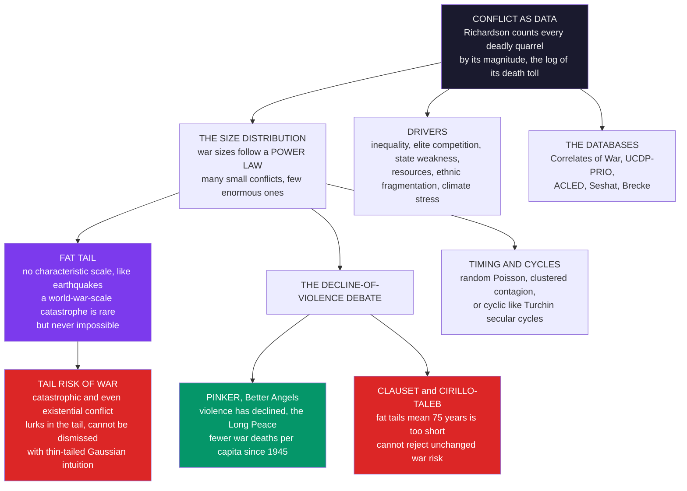

# ⚔️ War, Peace, and the Statistics of Conflict

> [!abstract] TL;DR
> **The statistics of conflict** is the *quantitative, computational study of war* — treating deadly conflicts as **data** to find distributions, trends, cycles, and drivers, and it reveals that war, seemingly the most chaotic of human affairs, has a startling **statistical order**. The field was founded by **Lewis Fry Richardson** (1881–1953), a Quaker meteorologist and pacifist who, horrified by the World Wars, applied his weather-forecaster's statistical mind to war itself: in *Statistics of Deadly Quarrels* he catalogued every conflict by its **magnitude** — the base-10 logarithm of its death toll — and made a landmark discovery. **War sizes follow a POWER LAW**: many small skirmishes, few enormous wars, with a **heavy / fat tail** and *no characteristic scale* — the very same scale-free statistics as **earthquakes**, **avalanches**, and **financial crashes** (see [[Power_Laws_and_Heavy_Tails_in_Economics]], [[Self_Organized_Criticality_in_Economics]]). The fat tail carries a sobering implication: a **world-war-scale (or worse) catastrophe is rare but never impossible** — it lives in the tail and cannot be dismissed with thin-tailed **Gaussian** intuition, making the **tail risk of catastrophic and even existential war** an object of serious study. This same statistics fuels the field's central debate. Steven **Pinker's** *Better Angels of Our Nature* argues violence has **declined dramatically** — fewer war deaths per capita, the post-1945 "**Long Peace**." The **statistical critique** (Aaron **Clauset**; Pasquale **Cirillo** and Nassim **Taleb**) counters that *because war sizes are so fat-tailed*, roughly 75 years of relative peace is simply **too short a sample** to statistically conclude that the war-generating process has changed: the data are consistent with **unchanged risk**, a great war is "overdue-able," and its absence for decades is *expected* even if nothing has improved. Grounded in modern conflict databases — the **Correlates of War** project, **UCDP/PRIO**, **ACLED**, **Seshat** — the statistics of war sharpens questions about **cycles and timing**, the **drivers** of conflict, and the **limited predictability** of rare human events, making it a sobering, high-stakes strand of computational social science and of the quantitative-history programs surveyed in *Cliodynamics_and_Quantitative_History*.

---

## Intuition

**Analogy — a weatherman decides to forecast war.** In the 1940s, a Quaker meteorologist named **Lewis Fry Richardson** — a man so opposed to violence that he had driven ambulances rather than fight, and later abandoned meteorology when he learned his equations were being used for chemical-weapons dispersal — did something that had never been done. He resolved to study war the way he studied *weather*: not as a moral drama or a chain of great-man decisions, but as a **statistical phenomenon**, something you could **count, tabulate, and find laws in**. So he sat down and catalogued every "**deadly quarrel**" in modern history — from a two-person murder to the World Wars — sorting each one by its **death toll**.

What he found was as startling as it was unsettling. War, that most human and chaotic of horrors, obeys the **same mathematical law as earthquakes**. Most conflicts are small; a few are catastrophic; and their sizes fall on a **power law** — a *scale-free*, heavy-tailed distribution in which there is no "typical" war, and the record-holder is not twice the runner-up but a hundred or a thousand times larger. Just as a magnitude-9 earthquake is rare but built into the geology, a **world-war-scale catastrophe is rare but never impossible** — it lurks in the **fat tail**, waiting.

The reframing is profound. Beneath the chaos of individual wars — each with its own causes, villains, and accidents — sits a **hidden statistical order**, a regularity in the *aggregate* that no single history reveals. And understanding that order — how fat the tail is, whether the "long peace" since 1945 truly means war is fading or is just a lucky lull — may be our **best hope of anticipating, and preventing, the next great one**.

---

## How It Works

The field turns organized violence into a **statistical object**. Instead of asking "why did *this* war happen?", it asks: across *all* wars, what is the **distribution** of their sizes? Is their **timing** random, clustered, or cyclic? What structural **drivers** raise the risk? And — grounded in the answers — how much of the future of war is **predictable**? Four interlocking findings organize the whole enterprise.

### 1. Richardson's law — war sizes are a power law

Richardson defined a conflict's **magnitude** as $M = \log_{10}(\text{deaths})$, exactly as a seismologist defines an earthquake's magnitude as the log of its energy. Plotting the **number of wars of each magnitude**, he found not a bell curve but a **straight line on log axes** — the fingerprint of a **power law**:

$$P(\text{deaths} > x) \propto x^{-\xi}.$$

There are *many* tiny conflicts, *fewer* medium wars, and a *handful* of civilization-scarring catastrophes, with the frequency falling as a smooth **power of size**. The distribution is **scale-free**: it looks statistically the same whether you zoom in on skirmishes or out to world wars, so there is **no characteristic scale** — no "typical size of a war." Modern re-analyses on far better data (Lars-Erik **Cederman**; Aaron **Clauset**, 2018) *confirm* the power law across interstate wars; Cirillo and Taleb argue the tail is so heavy that the mean is effectively **infinite** ($\xi < 1$), meaning the *average* war size is dominated by whichever catastrophe happened to be largest and is not a stable number.

### 2. Fat tails — the tail risk of catastrophic war

The power law's defining feature is its **fat tail**, and the consequence is sobering. Under a **thin-tailed** distribution (Gaussian or exponential), an event ten times larger than anything yet seen is *astronomically* improbable — essentially impossible. Under a **power law**, it is merely **rare**. This means **extreme wars — world-war scale, or worse — cannot be dismissed as impossible**; they are a *predictable* feature of the distribution, expected to occur *occasionally*, living permanently in the tail. Intuitions built on the bell curve — "a war that kills a hundred million people is unthinkable" — are exactly the intuitions that fail here, the same failure that makes Gaussian models underprice financial crashes (see [[Fat_Tails_and_Financial_Market_Statistics]]). The statistics of war therefore bear directly on **existential-risk assessment**: the tail is where civilization-threatening conflict lives, and a fat tail means that risk is real, quantifiable, and *not* negligible.

### 3. The decline-of-violence debate — is the world truly safer?

This fat-tailed statistics powers the field's most consequential argument. Steven **Pinker** (*The Better Angels of Our Nature*, 2011) marshals data for a hopeful thesis: **violence has declined** across history — homicide rates have plummeted, war deaths *per capita* have fallen, and no great powers have fought each other directly since 1945, the "**Long Peace**." The **statistical critique** (Clauset 2018; Cirillo–Taleb 2016) does not dispute the *data* but the *inference*: because war sizes and inter-war waiting times are so **fat-tailed**, a ~75-year quiet spell is **statistically insufficient** to conclude the underlying war-generating process has changed. Under a **null hypothesis of unchanged risk**, a gap this long is *unsurprising* — you would expect to see stretches of calm this long even with **constant** risk — so the "Long Peace" **cannot reject** the null. We may be genuinely safer, or we may simply be in a **lucky lull** before a tail event. The honest verdict is *we cannot yet tell*, and that uncertainty is the whole point.

### 4. Timing, drivers, and databases

Beyond *sizes*, the field studies **timing**: are wars a memoryless **Poisson** process (random arrivals), or do they **cluster** (contagion of conflict) or follow **cycles**? Peter **Turchin's** structural-demographic theory posits ~50-year "**fathers-and-sons**" instability waves and longer secular cycles (the subject of the sibling *Secular_Cycles_and_Structural_Demographic_Theory*), while Joshua **Goldstein** studied long war cycles. On **drivers**, quantitative conflict research links war and civil violence to **inequality and grievance**, **elite overproduction and competition**, **state weakness**, **resource and ethnic fractionalization**, and **climate/environmental stress**. And all of it rests on **data infrastructure** — the **Correlates of War** project, **UCDP/PRIO** (Uppsala/Oslo) armed-conflict data, event-level **ACLED**, and historical datasets like **Seshat** and **Brecke** — each wrestling with hard measurement problems (how to *define* a war, how to *count* the dead). The (limited) **predictability** of conflict — early-warning systems, machine-learning forecasting of civil war — is the frontier, and its difficulty is precisely what a fat-tailed, human process would predict (see *Prediction_and_Machine_Learning_in_Social_Science*).



---

## Key Concepts

### Secondary Level

**Counting wars like earthquakes.** A scientist named **Lewis Fry Richardson** wondered: if you list *every* war in history by how many people died, what pattern shows up? The answer surprised him. Most wars are **small**. A few are **huge**. And the way small and huge wars are spread out is the **same pattern you see in earthquakes** — lots of little tremors, a rare giant quake.

**What a "fat tail" means.** In a fat-tailed pattern, the biggest event isn't just a little bigger than the others — it's *enormously* bigger, like one skyscraper among houses. This means a **giant war** is uncommon but **always possible**; you can never say "that could never happen." A bell-curve way of thinking would call a catastrophe impossible, and be *wrong*.

**Is the world getting more peaceful?** Some argue **yes** — there have been no huge wars between big powers since 1945. Others reply: 75 quiet years *sounds* like a lot, but for something as fat-tailed as war, it may be **too short to prove anything**. A big war is rare, so going decades without one is *normal* even if the danger hasn't really dropped. We might be safer — or just lucky, for now.

| Idea | Plain meaning |
|---|---|
| Power law | Many small wars, few gigantic ones, no "normal" size |
| Fat tail | A catastrophe is rare but never impossible |
| The Long Peace | No great-power war since 1945 — real progress, or luck? |

### Undergraduate Level

**Richardson's magnitude.** Richardson measured a conflict by $M = \log_{10}(\text{deaths})$ — a two-person murder is $M \approx 0.3$, WW2 is $M \approx 7.5$. Binning conflicts by magnitude gives a distribution that is **approximately log-linear**: the count of wars falls by a roughly constant factor for each unit of magnitude, the hallmark of a **power law** $P(\text{deaths} > x) \propto x^{-\xi}$.

**Reading the tail correctly.** The clean way to *see* a power law is the **complementary CDF** (survival function) $P(X > x)$ on **log-log axes**, where it appears as a **straight line of slope $-\xi$**; the raw histogram is noisy in the tail and biases naive fits. The exponent is estimated by **maximum likelihood** (the **Hill estimator**), not by eyeballing a line — a straightish log-log plot is *not* proof of a power law (Clauset–Shalizi–Newman).

**Why fat tails break intuition.** Contrast the tail decay: a **Gaussian** falls like $e^{-x^2}$, an **exponential** like $e^{-\lambda x}$, a **power law** only like $x^{-\xi}$. At extreme sizes the power law is **orders of magnitude** above the thin-tailed curves — so a WW2-scale war that an exponential model rates "impossible" ($\sim 10^{-20}$) the power law rates merely "rare" ($\sim 10^{-2}$). This is why **thin-tailed risk models systematically miss the events that matter**.

**The Long Peace as a hypothesis test.** Frame Pinker's claim statistically: is the post-1945 lull evidence that the war rate $\lambda$ or the size distribution has *changed*? Under a **constant-risk null** (great wars as a Poisson process with historical rate), the **waiting time** between great wars is **exponential**; a 75-year gap has a substantial probability of occurring *by chance*. Clauset (2018) computes that the peace is **not yet statistically significant** — you would need roughly *another century* of calm to reject the null at conventional levels.

**The data.** The empirical base is a set of curated databases: **Correlates of War** (interstate/intrastate wars since 1816, 1000-battle-death threshold), **UCDP/PRIO** (armed conflicts since 1946), **ACLED** (georeferenced *events*), and historical compilations (**Brecke**'s conflict catalog, **Seshat**'s cross-cultural history bank). Casualty figures are **uncertain**, and definitions of "war" materially change the statistics — a core measurement challenge.

### Graduate Level

**The tail exponent and the infinite-mean question.** For interstate war *severity* (battle deaths, optionally normalized by world population), estimates cluster around a **survival exponent $\xi \approx 0.5$–$0.7$** on absolute counts. If $\xi \le 1$ the **mean is undefined** and if $\xi \le 2$ the **variance is infinite** (see the moment-divergence logic in [[Power_Laws_and_Heavy_Tails_in_Economics]]). Cirillo and Taleb (2016), fitting a **dual/log-transformed** distribution bounded by world population, argue the *effective* tail is so heavy that **sample means and trends are statistically unreliable** — the observed "decline" could be an artifact of a fat-tailed process whose sample average is dominated by a few extremes.

**Clauset's significance analysis.** Modeling interstate wars 1823–2003 as a process with a **power-law size distribution** and roughly **Poisson onsets**, Clauset (2018, *Science Advances*) asks whether the post-1945 record is inconsistent with the pre-1945 generating process. It is **not**: the "Long Peace" falls **within the expected fluctuations** of a stationary model, and the *time required to detect a genuine change* in war risk — given the fat tail — is on the order of **100–150 years**. The provocative conclusion: with the data in hand, **we cannot statistically distinguish "war is declining" from "we have been lucky."**

**Self-organized criticality and mechanism.** Why a power law at all? One family of explanations invokes **self-organized criticality**: coupled geopolitical systems self-tune to a critical state that emits **scale-free avalanches** of conflict (analogous to Bak's sandpile and to [[Self_Organized_Criticality_in_Economics]]). Cederman (2003) reproduced Richardson's exponent in an **agent-based** model of states competing on a lattice, where wars cascade through alliance/territory dynamics. Roberts and Turcotte linked war sizes to a **forest-fire / percolation** picture. The mechanism is contested, but the *statistics* are robust.

**Timing: Poisson vs cycles vs clustering.** Whether war **onsets** are memoryless is empirically fraught. Richardson's own analysis of *outbreak* frequencies is roughly consistent with a **Poisson** process (war timing looks close to random), yet **severity** is emphatically non-Gaussian. Against pure randomness, Turchin's **structural-demographic theory** finds ~50-year instability spikes and ~2–3 century **secular cycles** driven by **elite overproduction** and popular immiseration (the sibling *Secular_Cycles_and_Structural_Demographic_Theory*), and Goldstein detected long cycles in great-power war severity. Distinguishing genuine periodicity from the illusory patterns a fat-tailed random process *manufactures* is a live methodological problem.

**Prediction and its limits.** Quantitative drivers — **inequality**, **anocracy/state weakness**, **ethnic exclusion** (Cederman, Wimmer), **commodity dependence** (Collier–Hoeffler), **prior conflict**, and **climate stress** — feed statistical and machine-learning **forecasts** of civil war (e.g., ViEWS, the Political Instability Task Force). Skill is **modest**: base rates are low, the outcomes are **rare and fat-tailed**, and reflexivity (forecasts that alter behavior) confounds evaluation. The deep lesson mirrors the Fragile Families result in the broader field — *social prediction is hard*, and hardest precisely for the **rare, extreme events** we most want to foresee (see *Prediction_and_Machine_Learning_in_Social_Science*).

---

## Python Demo

```python
import numpy as np
import matplotlib
matplotlib.use("Agg")
import matplotlib.pyplot as plt

# =====================================================================
# THE STATISTICS OF WAR, in two acts (numpy + matplotlib only):
#   (a) RICHARDSON'S LAW -> war death tolls follow a POWER LAW.
#       Plot the complementary CDF (survival function) on log-log:
#       a straight, heavy tail. Fit the tail exponent (Hill MLE) and
#       contrast an EXPONENTIAL "thin tail", under which a WW2-scale
#       war is essentially impossible -- yet such wars happen.
#   (b) THE LONG PEACE -> is the post-1945 calm real, or luck?
#       Because great-war waiting times are heavy-tailed, a ~75-year
#       gap is NOT statistically sufficient to reject the null of
#       UNCHANGED war risk (Clauset; Cirillo-Taleb).
# =====================================================================
rng = np.random.default_rng(1918)

# ---------------------------------------------------------------------
# (a) RICHARDSON'S LAW: sample war death tolls from a fat-tailed power
#     law. Threshold xmin = 1000 battle deaths (the Correlates of War
#     definition of a "war"). Survival exponent xi = 0.5 -> an
#     essentially INFINITE-mean tail (the Cirillo-Taleb regime).
# ---------------------------------------------------------------------
xmin   = 1_000.0
xi     = 0.5                                  # CCDF exponent: P(X > x) ~ x^-xi
n_wars = 95                                   # ~ interstate wars, 1823-2003
# inverse-transform sampling of a Pareto tail: x = xmin * U^(-1/xi)
deaths = np.sort(xmin * rng.random(n_wars) ** (-1.0 / xi))
WW2 = deaths.max()                            # the extreme event in the sample

# empirical complementary CDF (survival) P(X >= x)
ccdf = 1.0 - np.arange(n_wars) / n_wars

# Hill maximum-likelihood estimate of the tail exponent (top 40% of wars)
k        = int(0.4 * n_wars)
tail     = deaths[-k:]
xmin_fit = tail[0]
xi_hat   = k / np.sum(np.log(tail / xmin_fit))    # survival-index estimate

# THIN-TAILED CONTRAST: an exponential matched to the data's MEDIAN, so
# the two models agree for typical wars but diverge violently in the tail.
median = np.median(deaths)
lam    = np.log(2.0) / (median - xmin)            # exp rate, shifted to xmin
def exp_sf(x):                                    # exponential survival function
    return np.exp(-lam * (np.asarray(x) - xmin))

p_exp_ww2 = float(exp_sf(WW2))                    # thin-tailed P(war >= WW2)
p_pl_ww2  = (xmin / WW2) ** xi                    # power-law  P(war >= WW2)

# ---------------------------------------------------------------------
# (b) THE LONG PEACE: great wars (deaths >= ~1 million) as a Poisson
#     process. History shows ~6 such wars across ~200 years, so the
#     constant-risk null rate is lam_g ~ 6/200 per year (mean gap ~ 33 yr).
#     Monte-Carlo the LONGEST peaceful gap in a 200-year record and ask:
#     is the observed ~78-year "Long Peace" surprising under constant risk?
# ---------------------------------------------------------------------
years          = 200
lam_g          = 6.0 / years                      # great wars per year
observed_peace = 78.0                             # 1945 -> 2023, no great-power war
mean_gap       = 1.0 / lam_g

n_mc         = 40_000
longest_gaps = np.empty(n_mc)
for m in range(n_mc):
    n_ev  = rng.poisson(lam_g * years)            # Poisson number of great wars
    t     = np.sort(rng.uniform(0, years, n_ev))  # their onset times
    edges = np.concatenate(([0.0], t, [years]))
    longest_gaps[m] = np.diff(edges).max()        # longest peaceful stretch

p_single  = np.exp(-observed_peace / mean_gap)    # P(one gap >= 78 yr), exact
p_longest = float(np.mean(longest_gaps >= observed_peace))  # P(longest gap >= 78)

# ------------------------------- REPORT --------------------------------
print("=" * 68)
print("THE STATISTICS OF WAR")
print("=" * 68)
print(f"(a) RICHARDSON'S LAW  --  {n_wars} wars, threshold {xmin:,.0f} deaths")
print(f"    largest war in sample (WW2-scale) : {WW2:,.0f} battle deaths")
print(f"    fitted tail exponent  xi_hat = {xi_hat:.2f}   "
      f"(xi < 1  =>  INFINITE-mean tail)")
print(f"    P(a war is at least WW2-scale):")
print(f"        power law  (fat tail) = {p_pl_ww2:.2e}   rare, but real")
print(f"        exponential (thin)    = {p_exp_ww2:.2e}   essentially IMPOSSIBLE")
print(f"        the fat tail makes WW2 about {p_pl_ww2 / p_exp_ww2:.1e}x more likely")
print()
print(f"(b) THE LONG PEACE  --  observed calm since 1945 = {observed_peace:.0f} years")
print(f"    constant-risk null: 6 great wars / {years} yr, mean gap {mean_gap:.0f} yr")
print(f"    P(a single inter-war gap >= {observed_peace:.0f} yr) = {p_single:.2f}")
print(f"    P(longest gap in {years} yr >= {observed_peace:.0f} yr) = {p_longest:.2f}")
print(f"    => the Long Peace is NOT significant: cannot reject unchanged risk")

# ------------------------------- FIGURE --------------------------------
fig, ax = plt.subplots(2, 2, figsize=(14, 10.5))
fig.suptitle("War, Peace, and the Statistics of Conflict: "
             "the power law of war sizes and the Long Peace debate",
             fontsize=13, fontweight="bold")

# Panel A: log-log survival function -- the power law vs the thin tail
axA = ax[0, 0]
axA.loglog(deaths, ccdf, "o", ms=5, color="#7c3aed", alpha=0.8,
           label="war sizes (empirical)")
xx = np.logspace(np.log10(xmin_fit), np.log10(WW2), 100)
axA.loglog(xx, (k / n_wars) * (xx / xmin_fit) ** (-xi_hat), "--", color="black",
           lw=2, label=f"power-law fit  xi = {xi_hat:.2f}")
axA.loglog(xx, exp_sf(xx), ":", color="#dc2626", lw=2.2,
           label="exponential (thin tail)")
axA.scatter([WW2], [ccdf[-1]], s=170, facecolors="none", edgecolors="#dc2626",
            linewidths=2.2, zorder=5, label="WW2-scale extreme")
axA.set_title("(a) Richardson's law: log-log survival of war sizes\n"
              "straight heavy tail = power law; thin tail plunges", fontsize=10)
axA.set_xlabel("war size x  (battle deaths)")
axA.set_ylabel("P(size > x)")
axA.legend(fontsize=8, loc="lower left")
axA.grid(True, which="both", alpha=0.3)

# Panel B: Richardson magnitude M = log10(deaths) -- from skirmish to world war
axB = ax[0, 1]
mag = np.log10(deaths)
axB.hist(mag, bins=12, color="#2471a3", alpha=0.85, edgecolor="black")
axB.axvline(mag.max(), color="#dc2626", ls="--", lw=2,
            label=f"WW2-scale  M = {mag.max():.1f}")
axB.set_title("(b) Distribution of Richardson MAGNITUDES\n"
              "M = log10(deaths): most wars small, a fat right tail", fontsize=10)
axB.set_xlabel("magnitude M = log10(battle deaths)")
axB.set_ylabel("number of wars")
axB.legend(fontsize=8)
axB.grid(alpha=0.25)

# Panel C: a real-style time series of conflict deaths -- the Long Peace
axC = ax[1, 0]
decade = np.arange(1810, 2020, 10)
# stylized battle deaths per decade, in millions (real-style, not exact):
# spikes at the 1860s, WW1 (1910s), WW2 (1940s); a quiet tail after 1945
deaths_dec = np.array([0.3, 0.5, 0.4, 0.6, 1.0, 2.5, 1.0, 0.8, 0.9, 1.2,
                       15.0, 2.0, 1.5, 25.0, 1.2, 0.9, 1.5, 0.7, 0.5, 0.4, 0.3])
axC.bar(decade, deaths_dec, width=8, color="#5d6d7e", edgecolor="black")
axC.bar(decade[[10, 13]], deaths_dec[[10, 13]], width=8, color="#dc2626",
        edgecolor="black", label="World Wars")
axC.axvspan(1945, 2020, color="#059669", alpha=0.15)
axC.text(1982, 20, "the\n'Long Peace'", ha="center", color="#0b6b3a",
         fontsize=9, fontweight="bold")
axC.set_title("(c) Conflict deaths over time (real-style)\n"
              "no great-power war since 1945 -- real decline, or a lull?",
              fontsize=10)
axC.set_xlabel("decade")
axC.set_ylabel("battle deaths (millions)")
axC.legend(fontsize=8, loc="upper left")
axC.grid(alpha=0.25, axis="y")

# Panel D: is the Long Peace statistically significant? Monte-Carlo null
axD = ax[1, 1]
axD.hist(longest_gaps, bins=50, color="#7c3aed", alpha=0.75, edgecolor="white")
axD.axvline(observed_peace, color="#dc2626", ls="--", lw=2.4,
            label=f"observed peace = {observed_peace:.0f} yr")
axD.set_title("(d) Longest peaceful gap under CONSTANT war risk\n"
              f"P(gap >= {observed_peace:.0f} yr) = {p_longest:.2f}  "
              "=> cannot reject 'no change'", fontsize=10)
axD.set_xlabel("longest peaceful gap in a 200-year record (years)")
axD.set_ylabel("frequency across simulations")
axD.legend(fontsize=8)
axD.grid(alpha=0.25)

fig.tight_layout(rect=[0, 0, 1, 0.95])
plt.savefig("war_statistics_of_conflict.png", dpi=120, bbox_inches="tight")
print("\nSaved figure -> war_statistics_of_conflict.png")
plt.show()
```

**What the demo shows.** *Panel (a) — Richardson's law.* On **log-log** axes the empirical survival function $P(\text{size} > x)$ of war death tolls is a nearly **straight heavy tail** — the signature of a **power law** — with the fitted exponent $\hat{\xi} < 1$ signalling an *infinite-mean* tail. Overlaid, an **exponential** thin-tail model calibrated to the *same typical war* **plunges off a cliff**: it and the power law agree for ordinary conflicts but part company by many orders of magnitude in the tail. The punchline is printed — the thin-tailed model rates a **WW2-scale war** as essentially *impossible* (probability $\sim 10^{-\text{many}}$), while the power law rates it merely *rare* — **yet such wars happen**, which is exactly why Gaussian/exponential intuition is dangerous. *Panel (b)* shows Richardson's **magnitude** distribution ($M = \log_{10}\text{deaths}$): the bulk of conflicts are small, with a long right tail reaching the world-war extreme. *Panel (c)* is a real-style time series of conflict deaths by decade — the World Wars tower over everything, and the shaded post-1945 stretch is the **"Long Peace."** *Panel (d)* is the statistical rebuttal to reading that peace as proof of progress: simulating great wars as a **constant-risk Poisson process**, the distribution of the **longest peaceful gap** in a two-century record routinely reaches or exceeds the observed ~78 years — so $P(\text{gap} \ge 78) $ is *substantial*, not tiny. **We cannot reject the null of unchanged war risk**: the Long Peace is *consistent* with genuine decline *and* with a fat-tailed process that simply hasn't rolled its next catastrophe yet.

---

## Real-World Applications

> **Existential and catastrophic-risk assessment.** The fat-tailed statistics of war is a central input to how institutions (the Global Priorities and existential-risk research community, defense planners) reason about **worst-case conflict** — great-power and nuclear war. Because the tail is heavy, "it hasn't happened, so it won't" is *statistically invalid*; the tail risk of civilization-scale violence is real and must be priced in, connecting directly to [[Nuclear_Strategy_and_Arms_Control]].

> **The Better Angels debate in public policy.** Pinker's decline-of-violence thesis has shaped optimistic narratives about progress and the durability of the liberal order. The Clauset / Cirillo–Taleb statistical critique is a direct policy caution against **complacency**: mistaking a fat-tailed lull for permanent safety could rationalize under-investment in conflict prevention and arms control precisely when the tail is fattest.

> **Conflict early-warning and atrocity prevention.** UN, EU, and NGO **early-warning systems** and academic forecasting projects (ViEWS in Uppsala; the former Political Instability Task Force) use the drivers identified by quantitative conflict research — inequality, state fragility, ethnic exclusion, prior violence — to flag rising risk of civil war and mass atrocity, feeding peacekeeping and preventive diplomacy (see [[War_Conflict_and_Security]], [[Global_Security_and_Terrorism]]).

> **The conflict-data infrastructure.** The **Correlates of War**, **UCDP/PRIO**, and **ACLED** databases are used daily by researchers, journalists, NGOs, and governments to measure trends in organized violence — ACLED's near-real-time event data, for instance, tracks ongoing wars and unrest and underpins humanitarian response and risk analytics.

> **Cliodynamic instability forecasting.** Turchin's structural-demographic models — quantifying **elite overproduction** and popular well-being to anticipate waves of political violence — were used to forecast rising U.S. instability into the 2020s, an applied extension of the war-timing question into general societal breakdown (the sibling *Secular_Cycles_and_Structural_Demographic_Theory* and *The_Evolution_of_Social_Complexity*).

---

## Common Pitfalls

- **Assuming thin tails "to be safe."** Treating war sizes as Gaussian or exponential is the *least* safe choice, not the most: it makes the ruinous events look impossible and hides exactly the tail risk that matters. "No war that big has ever happened" is a statement about a *sample*, not about the *distribution*.
- **Reading the Long Peace as proof of decline.** The most consequential error. ~75 years of calm *feels* decisive, but for a fat-tailed process it is a **small sample**. Absence of a great war for decades is fully consistent with **unchanged risk** — you cannot infer that the war-generating process has changed without far more data (Clauset's ~century-scale detection horizon).
- **Declaring a power law from a straightish log-log plot.** War-size data are limited and noisy; many heavy-tailed families (lognormal, truncated power law) mimic a power law over a decade or two. Use **maximum-likelihood** fitting and **goodness-of-fit** testing (Clauset–Shalizi–Newman), and be honest that the *exact* form is often undecidable — while the *qualitative* fat-tail conclusions remain robust.
- **Trusting the sample mean of war sizes.** If the tail exponent $\xi \le 1$, the **mean is undefined** and the sample average is dominated by the largest war observed — so "average deaths per war" and "war deaths per capita" trends can be **statistically unstable**, a core Cirillo–Taleb warning against over-reading such time series.
- **Confusing per-capita decline with reduced tail risk.** Even if deaths *per capita* have fallen, the **absolute** severity of a possible great war has grown with population and weaponry. A declining rate does not shrink the *tail* — the two are different claims, and only the tail governs catastrophe.
- **Mistaking fat-tailed randomness for genuine cycles.** Fat-tailed, clustered processes *manufacture* apparent patterns and "overdue" narratives. Claims of strict war cycles (50-year, long waves) must be tested against the null that a heavy-tailed *random* process would produce similar-looking rhythms by chance.
- **Over-trusting conflict forecasts.** War is **rare, fat-tailed, and reflexive**; even good driver models have modest skill and fail hardest on the extreme events. Presenting probabilistic early-warning as precise prediction invites both false alarms and dangerous false reassurance.

---

## Related Concepts

**The founding statistics (Complexity Economics — the power-law and fat-tail machinery):**

- [[Power_Laws_and_Heavy_Tails_in_Economics]] — the general theory of scale-free, heavy-tailed distributions that Richardson's law of war sizes instantiates; the same mathematics of tails, exponents, and unstable moments.
- [[Fat_Tails_and_Financial_Market_Statistics]] — the sister case in finance: crashes, like wars, live in a fat tail that Gaussian models catastrophically underprice.
- [[Self_Organized_Criticality_in_Economics]] — the leading *mechanistic* story for power-law war sizes: geopolitics as a critical system emitting scale-free conflict avalanches.
- [[Cascades_Contagion_and_Financial_Crises]] — cascade and avalanche dynamics whose event-size statistics parallel the contagion and clustering of conflict.

**The complexity foundations (Systems Thinking):**

- [[Criticality_and_Phase_Transitions]] — the critical-point physics that produces scale-free fluctuations, the prototype for self-organized criticality in war.
- [[Cascades_and_Systemic_Risk]] — how local failures cascade into system-scale catastrophes; the structural analogue of escalating conflict.
- [[Small_World_and_Scale_Free_Networks]] — heavy-tailed network structure (alliance and rivalry networks) implicated in how wars spread and scale.
- [[Chaos_Theory_and_Sensitive_Dependence]] — the limits on predicting nonlinear human systems, sharpening why conflict forecasting is so hard.

**The substance and stakes (Political Science, History):**

- [[War_Conflict_and_Security]] — the international-relations theory of why wars occur, which the statistics of conflict complements with distributions and trends.
- [[Nuclear_Strategy_and_Arms_Control]] — where the tail risk of catastrophic war becomes an existential-policy problem.
- [[Global_Security_and_Terrorism]] — modern organized violence and the early-warning applications of quantitative conflict research.
- [[World_War_II]] — the extreme event that anchors the tail of Richardson's distribution and dominates every war-size statistic.
- [[Big_History_and_Cliodynamics]] — the quantitative-history program (Turchin) in which the statistics of war, secular cycles, and structural-demographic theory sit.

**The methodological toolkit (Computational Social Science, Mathematics):**

- [[Computational_Social_Science_Overview]] — the parent field: treating society, including war, as data for computational analysis.
- [[Contagion_and_Diffusion_in_Social_Networks]] — the spreading dynamics that inform models of conflict contagion and clustering in time and space.
- [[Agent_Based_Models_of_Society]] — bottom-up simulation (as in Cederman's models) that *reproduces* Richardson's power-law exponent from local interaction rules.
- [[Common_Probability_Distributions]] — situates the Pareto/power law against the Gaussian and exponential benchmarks central to the fat-tail argument.
- [[Statistical_Inference]] — the hypothesis-testing framework behind "the Long Peace is not statistically significant."
- [[Probability_Theory]] — the Poisson processes and survival functions underlying the timing and waiting-time analysis of war.

**Forthcoming siblings in this section (planned, referenced in prose above, not yet written):** *Cliodynamics_and_Quantitative_History* (the section-opener framing mathematical history), *Secular_Cycles_and_Structural_Demographic_Theory* (Turchin's cycles of instability and elite overproduction), *The_Evolution_of_Social_Complexity* (the long-run rise of large-scale societies), *Prediction_and_Machine_Learning_in_Social_Science* (forecasting rare social events and its limits), and *Long_Run_Economic_and_Population_History* (the demographic and economic backdrop to conflict). This note is the statistics-of-war pillar those notes will link back to.

---

## Review Questions

### Secondary

1. Richardson found that wars follow the "same law as earthquakes." In your own words, what does that mean about the *sizes* of wars — are most wars big or small, and what does a "fat tail" say about the possibility of a giant war?
2. Some people say the world is much more peaceful now because there has been no huge war between great powers since 1945. Give one reason to believe them and one reason to be cautious about that conclusion.
3. Why is it dangerous to assume a catastrophe "could never happen" when the underlying pattern is a power law rather than a bell curve?

### Undergraduate

1. Explain why the **complementary CDF on log-log axes** is the right way to detect a power law in war sizes, and what the **slope** of that line represents. Why is a straight log-log plot alone *not* sufficient proof of a power law?
2. Frame the "Long Peace" as a **hypothesis test**. State the null hypothesis, explain why a ~75-year gap is consistent with it, and describe what the Python demo's Monte Carlo shows about the significance of the observed peace.
3. Contrast how a **Gaussian/exponential** and a **power law** each assign probability to a WW2-scale war. Using the idea of tail decay, explain why the two models can agree for ordinary wars yet differ by many orders of magnitude in the tail.

### Graduate

1. Cirillo and Taleb argue that if the tail exponent satisfies $\xi \le 1$, then per-war and per-capita **trend statistics** for war are unreliable. Explain the connection between an **undefined mean**, sample-average instability, and the claim that we "cannot yet conclude violence has permanently declined." What would it take, statistically, to change that verdict?
2. Compare **self-organized criticality**, **agent-based lattice models** (Cederman), and **preferential-attachment / percolation** accounts as generative explanations for Richardson's power law. What empirical signatures might distinguish a genuinely *critical* geopolitics from a merely heavy-tailed one, and why is the mechanism harder to pin down than the distribution?
3. Turchin's structural-demographic theory posits ~50-year and secular **cycles** of political violence, while Richardson's outbreak analysis is roughly **Poisson** (random timing). Design an analysis to test whether apparent war *cycles* are real or are artifacts a fat-tailed, clustered random process would produce. What are the stakes of getting this wrong for conflict forecasting and existential-risk assessment?

---

## Sources

- [Richardson, L. F. (1960). *Statistics of Deadly Quarrels.* Boxwood Press / Quadrangle Books.](https://archive.org/details/statisticsofdead0000rich) — the founding work of quantitative conflict research; war magnitudes and the power-law distribution of war sizes.
- [Clauset, A. (2018). "Trends and fluctuations in the severity of interstate wars." *Science Advances* 4(2), eaao3580.](https://doi.org/10.1126/sciadv.aao3580) — modern re-analysis confirming the power law and showing the post-1945 "Long Peace" is not yet statistically significant.
- [Cirillo, P., & Taleb, N. N. (2016). "On the statistical properties and tail risk of violent conflicts." *Physica A* 452, 29–45.](https://doi.org/10.1016/j.physa.2016.01.050) — the fat-tail / infinite-mean critique of decline-of-violence trend claims.
- [Pinker, S. (2011). *The Better Angels of Our Nature: Why Violence Has Declined.* Viking.](https://stevenpinker.com/publications/better-angels-our-nature) — the empirical case that violence, including war, has declined over history.
- [Cederman, L.-E. (2003). "Modeling the Size of Wars: From Billiard Balls to Sandpiles." *American Political Science Review* 97(1), 135–150.](https://doi.org/10.1017/S0003055403000571) — an agent-based / self-organized-criticality account reproducing Richardson's power-law exponent.
- [Sundberg, R., & Melander, E. (2013). "Introducing the UCDP Georeferenced Event Dataset." *Journal of Peace Research* 50(4), 523–532.](https://doi.org/10.1177/0022343313484347) — a foundational modern conflict-event database underpinning quantitative conflict research.

---

#computational-social-science #statistics-of-war #power-laws #richardson #conflict
