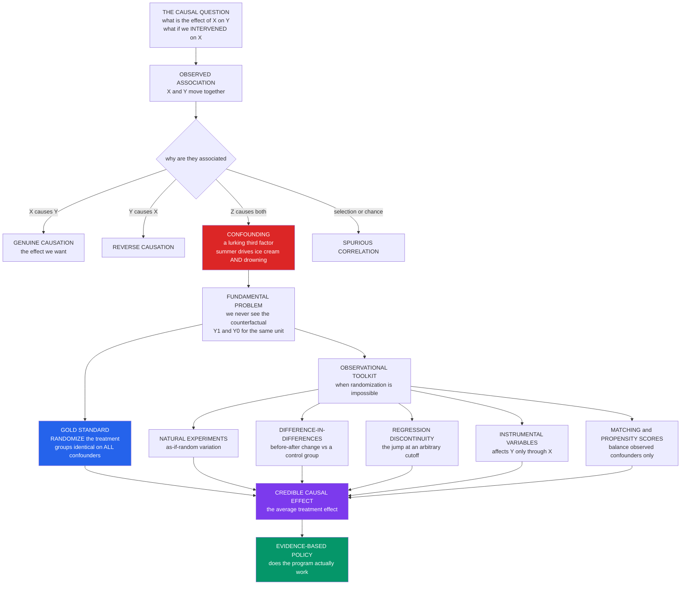

# 🔀 Causal Inference from Observational and Digital Data

> [!abstract] TL;DR
> **Causal inference** is the science of inferring **cause-and-effect** relationships — not mere correlations — from data: answering *"what is the effect of X on Y?"* and *"what would happen if we **intervened** to change X?"* It is the single most important and difficult problem in empirical social science, because a raw **association** between X and Y can arise four ways — X causes Y, Y causes X (reverse causation), a **confounder** Z causes both (spurious correlation, like summer driving *both* ice cream sales *and* drownings), or chance/selection — and mistaking correlation for causation produces disastrous policy (observational studies "showed" hormone therapy protected hearts while randomized trials proved it **harmed**). The modern **potential-outcomes** framework (Rubin) formalizes the causal effect as the difference between a unit's treated and untreated outcomes, one of which is *always* unobserved — the **fundamental problem of causal inference** — while **Pearl's causal graphs (DAGs)** make assumptions explicit and reveal which variables to control (confounders) and which *not* to (colliders). Causation is cleanest when treatment can be **randomized** (the RCT gold standard), but most social questions can't be, so the **credibility revolution** (Angrist–Pischke) built a quasi-experimental toolkit — **natural experiments, difference-in-differences, regression discontinuity, instrumental variables, and matching** — to extract cause from confounded observational data. In an era of vast but correlational **digital data**, combining these designs with machine learning (double ML, causal forests) while resisting the fatal **conflation of prediction with causation** is a defining, high-stakes frontier of computational social science and evidence-based policy.

---

## Intuition

**Analogy:** Every summer, ice cream sales rise — and so do drownings. Plot them together and the correlation is almost perfect. So should we ban ice cream to save swimmers? Obviously not: a **lurking third factor**, hot weather, drives *both*. People eat more ice cream *and* swim more when it's hot; the ice cream and the drownings never touch each other. Banning ice cream would leave the drownings untouched and the beaches just as crowded.

This is the oldest and deadliest trap in social science: **correlation is not causation**, and confusing them can kill. It is not a textbook curiosity — hormone-replacement therapy "prevented" heart disease in observational studies for a generation, until randomized trials revealed it did the *opposite* and raised cardiac risk. The single hardest, most important question in social science is **causal**: not *"what goes with what?"* but *"what would happen if we **intervened**?"* And in an age flooded with big observational data — brimming with correlations but starved of experiments — getting causation right has never been more urgent, or more perilous.

---

## How It Works

### The question, and why association is not enough

Prediction asks *"given what I see, what is Y likely to be?"* Causation asks something fundamentally different: *"if I **reach in and change** X, how does Y respond?"* These are not the same question, and a model can nail the first while being catastrophically wrong about the second. The whole enterprise begins with a warning: an observed **association** between X and Y is consistent with **four** distinct stories:

1. **X causes Y** — the genuine causal effect we usually want.
2. **Y causes X** — *reverse causation* (does police presence cause crime, or crime cause police presence?).
3. **A confounder Z causes both** — *spurious correlation* (summer drives ice cream *and* drowning; health-consciousness drives *both* taking a supplement *and* living longer).
4. **Chance or selection** — sampling flukes, or conditioning on a variable that manufactures a fake link.

Naively reading correlation as causation licenses **wrong conclusions and ruinous policy**. The graveyard of "obvious" interventions is vast: the hormone-therapy reversal, countless nutrition claims that flipped under trial, and job-training programs that "worked" only because motivated people selected into them. **Confounding is ubiquitous**, and it is the central enemy.

### The counterfactual and the fundamental problem

To make "cause" rigorous, the **potential-outcomes** framework (the **Rubin Causal Model**) imagines that each unit has *two* potential outcomes: `Y₁`, what happens **if treated**, and `Y₀`, what happens **if not treated**. The **causal effect** for that unit is the difference `Y₁ − Y₀`. The catch — the **fundamental problem of causal inference** — is that you only ever observe **one** of them. A patient who took the drug reveals `Y₁`; their `Y₀` (what *would* have happened untreated) is forever hidden. Causal inference is therefore a **missing-data / counterfactual problem**: we must estimate what *would* have happened to the treated group had they **not** been treated. Since we cannot see individual counterfactuals, we settle for population averages — the **Average Treatment Effect (ATE)**, `E[Y₁ − Y₀]`.

### Confounding, selection bias, and the comparison group

To estimate the missing counterfactual we need a **valid comparison group** — units that stand in for what the treated group *would* have looked like untreated. The threat is **selection bias**: treated and untreated units differ **systematically** for reasons other than the treatment. A **confounder** is a variable that causes *both* the treatment *and* the outcome, opening a spurious "backdoor" path between them. Sicker patients get more aggressive treatment (confounding by indication), so treated patients look *worse* even if the treatment helps; health-conscious people take the supplement *and* exercise, so the supplement looks miraculous. The entire game is making treated and control groups **comparable — "apples to apples"** — so that the only systematic difference between them is the treatment itself.

### The gold standard: randomization

**Randomly** assigning treatment solves confounding at a stroke. Because the coin flip is independent of everything about the unit, the treated and control groups become — *on average* — statistically **identical** on **all** confounders, observed *and unobserved*. Age, motivation, severity, unmeasured genes: randomization balances them all in expectation. So the simple **difference in average outcomes IS the causal effect**, with no confounding to subtract. This is why the **randomized controlled trial (RCT)** is the cleanest causal design (the logic behind *Online_Experiments_and_Digital_Field_Experiments* and platform A/B tests). But experiments are frequently **impossible, unethical, or prohibitively costly** for social questions: you cannot randomize war, recession, race, a minimum-wage hike, or a democracy. Hence the need for observational methods.

### Causal graphs: what to control, and what NOT to

Judea **Pearl's causal diagrams** — **Directed Acyclic Graphs (DAGs)** — encode causal assumptions as a picture: an arrow `Z → X` means Z causally influences X. The graph tells you exactly which variables you **must** adjust for (**confounders**, to block backdoor paths) and — crucially — which you **must not**. A **collider** is a variable caused by *two* others (`X → C ← Y`); conditioning on a collider **creates** a spurious association where none existed. This subtle, common error (a form of selection bias) means "control for everything you have" is *wrong*: adjusting for the incorrect variable manufactures bias. Pearl's **"ladder of causation"** (from his *Book of Why*) climbs three rungs — **association** (seeing), **intervention** (doing, the *do*-operator), and **counterfactuals** (imagining) — and pure data only ever lives on the bottom rung. The **do-calculus** formalizes when an interventional effect `P(Y | do(X))` is identifiable from observational data plus a graph. The graph's real gift: it forces you to make your **causal assumptions explicit**.

### The quasi-experimental toolkit

When you cannot randomize, the **credibility revolution** (Angrist & Pischke, *Mostly Harmless Econometrics*; recognized in the 2021 Nobel to Card, Angrist, Imbens) offers a workhorse toolkit, each design finding or engineering **as-if-random** variation:

1. **Natural experiments** — exploit as-if-random variation thrown up by nature, policy, or history: lotteries, arbitrary administrative boundaries, weather shocks, or a policy that switched on at a date (the raw material of *Online_Experiments_and_Digital_Field_Experiments* when it happens on a platform).
2. **Difference-in-differences (DiD)** — compare the *before-after change* in a treated group to the change in a control group; subtracting the two **differences out** any *time-invariant* confounder and any common trend.
3. **Regression discontinuity (RD)** — when a treatment is assigned by a sharp **cutoff** (a test score for a scholarship, a vote share for winning office), units *just above* and *just below* the threshold are essentially comparable, so the **jump** in the outcome at the cutoff is the causal effect.
4. **Instrumental variables (IV)** — find an **instrument** that affects the outcome *only through* the treatment and is otherwise as-if-random (a lottery draft number for military service); it isolates the causal path.
5. **Matching / propensity scores** — build comparable treated/control groups by balancing **observed** confounders — but, unlike randomization, matching is powerless against **unobserved** confounding.

Each design buys credibility with an **assumption** (parallel trends for DiD, continuity at the cutoff for RD, the exclusion restriction for IV, ignorability for matching) that must be argued and probed, not assumed.

### Causal inference meets big and digital data

This is the **CSS frontier**. Digital data offers unprecedented scale and a wealth of naturally occurring quasi-experiments (a platform ranking change, a staggered feature rollout, a policy threshold in an online system) — but it is fundamentally **observational and confounded** (algorithmic confounding, selection into platforms; see *Big_Data_and_the_Social_Sciences* and [[Measurement_and_Validity_in_Digital_Data]]). Networks add a specially hard case: the **homophily-versus-influence** problem, where "your friends' behavior predicts yours" is confounded by shared traits (see [[Homophily_Selection_and_Influence]]). The modern response is **double / debiased machine learning** (Chernozhukov et al.) and **causal forests** (Wager & Athey): use ML's flexibility to **control high-dimensional confounders** *inside* a valid causal framework, and to estimate **heterogeneous treatment effects** — *who* the effect helps — for personalization. ML **aids** identification; it does not **replace** the design and assumptions that make an estimate causal.

### The map



---

## Key Concepts

### Secondary Level

**Correlation is not causation.** When two things rise and fall together, it does *not* mean one causes the other. Ice cream sales and drownings both go up in summer, but ice cream doesn't cause drowning — **hot weather** causes both. That hidden shared cause is called a **confounder**.

**The "what if" question.** The important question is usually not *"do these go together?"* but *"if we **changed** one, would the other change?"* To know if a medicine works, you don't ask whether people who take it are healthier — the healthiest people might be the ones who take it. You ask what *would have happened* to those same people if they *hadn't* taken it.

**Why experiments are the gold standard.** The cleanest way to find a real cause is a **randomized experiment**: flip a coin to decide who gets the treatment. Because the coin doesn't care who is rich, sick, or motivated, the two groups end up basically the same in every other way — so any difference in the result must be the treatment. When you *can't* flip a coin (you can't randomly assign a war or a recession), scientists use clever tricks to find "**as-if-random**" comparisons in the world.

| Idea | Plain meaning |
|---|---|
| **Confounder** | a hidden factor that causes *both* things you see linked |
| **Counterfactual** | what *would* have happened under the other choice |
| **Randomization** | a coin flip that makes the groups fairly comparable |

### Undergraduate Level

#### Potential outcomes and the ATE

Each unit *i* has two potential outcomes, `Yᵢ(1)` and `Yᵢ(0)`; the individual causal effect is `Yᵢ(1) − Yᵢ(0)`. We observe `Yᵢ = Tᵢ·Yᵢ(1) + (1−Tᵢ)·Yᵢ(0)` — only the potential outcome corresponding to the treatment actually received. The **Average Treatment Effect** is `ATE = E[Y(1) − Y(0)]`. The **naive** estimator, `E[Y | T=1] − E[Y | T=0]`, equals the ATE *only* when treatment is independent of potential outcomes (**ignorability**), which randomization guarantees and observational data does not.

#### Confounding as a bias term

Decompose the naive difference: `E[Y|T=1] − E[Y|T=0] = ATT + selection bias`, where **selection bias** = `E[Y(0)|T=1] − E[Y(0)|T=0]` — the difference in *untreated* potential outcomes between the two groups. If sicker people select into treatment, their `Y(0)` is worse, and the bias term contaminates the estimate. **Confounding is exactly this failure of the control group to represent the treated group's counterfactual.** Related in spirit to [[Omitted_Variable_Bias]] in regression: leaving out a variable correlated with both regressor and outcome biases the coefficient.

#### DAGs, backdoors, and colliders

Draw the assumed causal graph. A **backdoor path** from X to Y through a confounder Z (`X ← Z → Y`) creates spurious association; you **close** it by conditioning on Z. A **collider** (`X → C ← Y`) is *already blocked* — but conditioning on C **opens** it, injecting bias. Hence the golden rule: adjust for **confounders**, never for **colliders** or **mediators** (variables on the causal path you want to measure). "Control for more variables" is not automatically safer.

#### The five quasi-experimental designs

- **Natural experiment** — an as-if-random shock (lottery, boundary, policy date) creates comparable groups.
- **DiD** — assumes **parallel trends**: absent treatment, treated and control would have moved the same way; the differential change is the effect (see [[Difference_in_Differences]]).
- **RD** — assumes **continuity** at the cutoff: everything except treatment varies smoothly across the threshold, so the discontinuous **jump** is causal (see [[Regression_Discontinuity]]).
- **IV** — needs **relevance** (instrument affects treatment) and the **exclusion restriction** (instrument affects outcome *only* through treatment); estimates a **local** effect (LATE) for compliers (see [[Instrumental_Variables]]).
- **Matching / propensity scores** — assumes **selection on observables**; balances measured confounders but cannot touch unobserved ones (see [[Propensity_Score_Matching]]).

### Graduate Level

#### Identification vs estimation

The deep divide is **identification** (can the causal effect be recovered from the population distribution *in principle*, given the assumptions?) versus **estimation** (given identification, how well do we recover it from a finite, possibly high-dimensional sample?). Randomization and quasi-experiments are about **identification**; machine learning is about **estimation**. Conflating them is the field's signature error: a flexible ML model with a huge R² does not identify a causal effect if the design is confounded. The **credibility revolution** shifted the field's center of gravity from ever-fancier estimation onto **design-based identification** — "what is your source of exogenous variation?"

#### Double / debiased machine learning

Standard regression adjustment for many confounders suffers **regularization bias**: ML nuisance estimates (of the outcome model and the propensity model) bias the treatment coefficient. **Double ML** (Chernozhukov et al., 2018) restores valid inference via two devices: **Neyman-orthogonal** (doubly robust) moment conditions that are *first-order insensitive* to nuisance errors, and **cross-fitting** (sample-splitting) to remove overfitting bias. The payoff: use arbitrary ML (gradient boosting, forests, nets) to flexibly control high-dimensional confounders while retaining √n-consistent, asymptotically normal treatment-effect estimates — provided the identifying assumption (unconfoundedness given the controls) actually holds. **Causal forests** (Wager & Athey, 2018) extend this to estimate **conditional** treatment effects `τ(x) = E[Y(1) − Y(0) | X=x]` with valid confidence intervals, powering **heterogeneous-effect** and personalization analyses.

#### Sensitivity and the limits of observational causal claims

Every observational design rests on an **untestable** assumption (no unobserved confounding; parallel trends; exclusion). Credible work therefore reports **sensitivity analysis** — how strong would an unmeasured confounder have to be to overturn the result (Rosenbaum bounds; E-values)? — and **falsification tests** (pre-trends for DiD, placebo cutoffs for RD, over-identification for IV). The honest posture: causal estimates from observational data are **conditional on a design argument**, and the burden is to make that argument, probe it, and quantify its fragility. The Shalizi–Thomas result on networks (see [[Homophily_Selection_and_Influence]]) is a sharp reminder that some confounding — latent homophily — cannot be closed by adjusting for any observed covariates at all.

#### Prediction versus causation, precisely

A predictive model learns `P(Y | X)`; a causal model targets `P(Y | do(X))`. These coincide only when there is no confounding (or under intervention). A model can predict Y from X *perfectly* using a **confounded proxy** without X causing Y — hospitals that predicted lower pneumonia risk for asthmatics because asthmatics received *more aggressive care* (Caruana et al.). Deploying a predictive model for a **policy/intervention** question is a serious category error: acting on `P(Y|X)` as if it were `P(Y|do(X))` optimizes the wrong quantity. This is the crucial distinction between *Prediction_and_Machine_Learning_in_Social_Science* and this note — ML and causal inference are **complements**, and their **conflation** is the danger.

---

## Python Demo

Two self-contained experiments, using only `numpy` and `matplotlib`. **Part (a)** shows how a **confounder** makes the naive treatment–outcome correlation *misleading* — here the treatment is actually **harmful**, yet naively appears *beneficial* (the "healthy-user" bias that fooled the hormone-therapy studies) — and how **adjusting for the confounder** recovers the true effect. **Part (b)** implements **difference-in-differences**, showing it **recovers** the true causal effect from observational-style before/after data where a naive post-period comparison is badly biased by a time-invariant group difference.

```python
# Causal inference: (a) confounding bias and its fix, (b) difference-in-differences.
# Pure numpy + matplotlib. Shows why the NAIVE observational estimate misleads,
# and how CONTROLLING for structure recovers the TRUE causal effect.
import numpy as np
import matplotlib
matplotlib.use("Agg")
import matplotlib.pyplot as plt

rng = np.random.default_rng(7)

# =====================================================================
# PART (a) CONFOUNDING.  A confounder Z ("health-conscious lifestyle")
# drives BOTH who takes the treatment T AND the outcome Y.  The TRUE
# causal effect of T on Y is NEGATIVE (the treatment is mildly HARMFUL),
# but because healthy people (high Z) both take T and do well anyway,
# the NAIVE difference-in-means makes T look strongly BENEFICIAL.
# Controlling for Z (regression adjustment) recovers the true effect.
# =====================================================================
N = 4000
TRUE_EFFECT = -1.5            # ground-truth causal effect of T on Y (harmful)
BETA_Z      =  6.0            # how strongly the confounder lifts the outcome

Z = rng.normal(0, 1, N)                               # confounder (lifestyle)
p_treat = 1 / (1 + np.exp(-2.0 * Z))                  # healthy people self-select into T
T = (rng.random(N) < p_treat).astype(float)           # treatment assignment
Y = 50 + TRUE_EFFECT * T + BETA_Z * Z + rng.normal(0, 2, N)   # outcome

# NAIVE estimate: just compare treated vs untreated (ignores the confounder)
naive = Y[T == 1].mean() - Y[T == 0].mean()

# ADJUSTED estimate: OLS of Y on [1, T, Z] -> coefficient on T controls for Z
X = np.column_stack([np.ones(N), T, Z])
beta, *_ = np.linalg.lstsq(X, Y, rcond=None)
adjusted = beta[1]

print("=" * 62)
print("PART (a)  CONFOUNDING")
print("=" * 62)
print(f"TRUE causal effect of T on Y        : {TRUE_EFFECT:+.2f}  (harmful)")
print(f"NAIVE difference-in-means           : {naive:+.2f}  (looks BENEFICIAL!)")
print(f"CONFOUNDER-ADJUSTED (OLS on Z)      : {adjusted:+.2f}  (recovers truth)")
print("-> the naive sign is WRONG: confounding reverses the apparent effect.")

# =====================================================================
# PART (b) DIFFERENCE-IN-DIFFERENCES.  A treated group and a control
# group are observed BEFORE and AFTER an intervention.  The treated
# group has a higher (time-invariant) baseline -> a naive post-period
# comparison is biased.  DiD subtracts each group's own before/after
# change, cancelling the fixed group gap AND the common time trend,
# and recovers the true effect.
# =====================================================================
n = 3000
ALPHA, GAMMA, DELTA, TAU = 10.0, 3.0, 2.0, 4.0   # base, group gap, trend, TRUE effect
G = np.r_[np.ones(n), np.zeros(n)]               # 1 = treated group, 0 = control
def outcome(post):                               # potential outcomes each period
    return (ALPHA + GAMMA * G + DELTA * post + TAU * (G * post)
            + rng.normal(0, 1.2, 2 * n))
Y_pre, Y_post = outcome(0.0), outcome(1.0)

def cell(y, g):  # mean outcome for a group in one period
    return y[G == g].mean()

t1_pre,  t1_post = cell(Y_pre, 1), cell(Y_post, 1)   # treated
c0_pre,  c0_post = cell(Y_pre, 0), cell(Y_post, 0)   # control

naive_post = t1_post - c0_post                        # cross-section AFTER: biased
did = (t1_post - t1_pre) - (c0_post - c0_pre)         # difference-in-differences

print("\n" + "=" * 62)
print("PART (b)  DIFFERENCE-IN-DIFFERENCES")
print("=" * 62)
print(f"TRUE causal effect (tau)            : {TAU:+.2f}")
print(f"NAIVE post-period comparison        : {naive_post:+.2f}  (biased by group gap)")
print(f"DIFFERENCE-IN-DIFFERENCES estimate  : {did:+.2f}  (recovers truth)")

# ------------------------------- FIGURE --------------------------------
fig, ax = plt.subplots(2, 2, figsize=(13.5, 10))
fig.suptitle("Correlation is not causation: a confounder misleads, a design recovers the truth",
             fontsize=13, fontweight="bold")
c_treat, c_ctrl, c_true = "#dc2626", "#2563eb", "#059669"

# Panel A: the confounding structure -- treated (red) cluster at high Z & high Y
a = ax[0, 0]
a.scatter(Z[T == 0], Y[T == 0], s=6, alpha=0.35, color=c_ctrl, label="untreated")
a.scatter(Z[T == 1], Y[T == 1], s=6, alpha=0.35, color=c_treat, label="treated")
a.set_title("(a) CONFOUNDING: treated units cluster at high Z\n"
            "high-Z people both take T and score high on Y")
a.set_xlabel("confounder Z  (healthy lifestyle)"); a.set_ylabel("outcome Y")
a.legend(fontsize=8, loc="upper left"); a.grid(alpha=0.25)

# Panel B: naive vs adjusted vs true effect -- naive has the WRONG SIGN
b = ax[0, 1]
bars = b.bar(["naive\n(ignores Z)", "adjusted\n(controls Z)", "TRUE\neffect"],
             [naive, adjusted, TRUE_EFFECT],
             color=["#f59e0b", c_true, "#111827"], edgecolor="black")
b.axhline(0, color="black", lw=0.8)
b.set_title("(b) The naive estimate is BIASED (wrong sign)\n"
            "adjusting for the confounder recovers the truth")
b.set_ylabel("estimated effect of T on Y"); b.grid(alpha=0.25, axis="y")
for rect, v in zip(bars, [naive, adjusted, TRUE_EFFECT]):
    b.text(rect.get_x() + rect.get_width()/2, v + (0.3 if v >= 0 else -0.6),
           f"{v:+.2f}", ha="center", fontsize=9, fontweight="bold")

# Panel C: difference-in-differences with the counterfactual line
c = ax[1, 0]
xs = [0, 1]
c.plot(xs, [t1_pre, t1_post], "-o", color=c_treat, lw=2, label="treated (observed)")
c.plot(xs, [c0_pre, c0_post], "-o", color=c_ctrl, lw=2, label="control (observed)")
cf_post = t1_pre + (c0_post - c0_pre)                 # treated counterfactual
c.plot(xs, [t1_pre, cf_post], "--o", color="gray", lw=2,
       label="treated counterfactual\n(parallel trend)")
c.annotate("", xy=(1, t1_post), xytext=(1, cf_post),
           arrowprops=dict(arrowstyle="<->", color=c_true, lw=2))
c.text(1.02, (t1_post + cf_post) / 2, f"DiD = {did:+.2f}",
       color=c_true, fontsize=10, fontweight="bold", va="center")
c.set_xticks(xs); c.set_xticklabels(["BEFORE", "AFTER"])
c.set_title("(c) DIFFERENCE-IN-DIFFERENCES\nthe gap to the counterfactual is the causal effect")
c.set_ylabel("mean outcome"); c.legend(fontsize=8, loc="upper left"); c.grid(alpha=0.25)

# Panel D: naive post comparison vs DiD vs true
d = ax[1, 1]
bars2 = d.bar(["naive\n(post cross-section)", "diff-in-diff", "TRUE\neffect"],
              [naive_post, did, TAU],
              color=["#f59e0b", c_true, "#111827"], edgecolor="black")
d.set_title("(d) Naive AFTER-comparison OVERSTATES the effect\n"
            "diff-in-diff removes the fixed group gap")
d.set_ylabel("estimated treatment effect"); d.grid(alpha=0.25, axis="y")
for rect, v in zip(bars2, [naive_post, did, TAU]):
    d.text(rect.get_x() + rect.get_width()/2, v + 0.15,
           f"{v:+.2f}", ha="center", fontsize=9, fontweight="bold")

plt.tight_layout(rect=[0, 0, 1, 0.95])
plt.savefig("causal_inference_demo.png", dpi=110, bbox_inches="tight")
plt.show()
```

**What the demo shows:**

- **Panel (a) — the confounding structure.** Treated units (red) pile up at **high Z** (health-conscious lifestyle) and therefore at **high Y**, not because the treatment helped but because health-conscious people both *chose* the treatment *and* had good outcomes anyway. The treatment and the outcome are correlated *through* Z.
- **Panel (b) — the naive estimate has the wrong sign.** The naive difference-in-means says the treatment is **strongly beneficial**, but the true effect is **harmful** (`−1.5`). Adding Z to the regression **closes the backdoor path** and recovers the true, negative effect — the computational analogue of the hormone-therapy reversal.
- **Panel (c) — difference-in-differences.** The treated group starts higher (a time-invariant confounder) and both groups drift upward (a common trend). The **dashed counterfactual** projects where the treated group *would* have gone under parallel trends; the **gap** between the actual treated outcome and that counterfactual is the causal effect — exactly `τ`.
- **Panel (d) — DiD beats the naive comparison.** Simply comparing the two groups *after* the intervention **overstates** the effect (it includes the fixed group gap `γ`); differencing out each group's own before/after change **recovers the truth** (`+4`).

The lesson in one line: **the naive number is confidently, dangerously wrong — and only structure (a control variable, or a research design) makes it right.**

---

## Real-World Applications

> **Development economics and program evaluation (the RCT movement).** Banerjee, Duflo, and Kremer won the 2019 Nobel for making the **randomized field experiment** the workhorse of anti-poverty policy — testing microcredit, deworming, teacher incentives, and cash transfers head-to-head. The whole logic of **evidence-based policy** is *"does this program actually cause the outcome, or do participants just differ?"* — the naive-versus-adjusted gap of Panel (b).

> **Card & Krueger's minimum-wage natural experiment.** New Jersey raised its minimum wage while neighboring Pennsylvania did not; comparing fast-food employment before/after in both states is a canonical **difference-in-differences**, and its finding (no employment drop) helped launch the credibility revolution and the 2021 Nobel to Card, Angrist, and Imbens.

> **Regression discontinuity in scholarships and elections.** Students *just above* a test-score cutoff for a scholarship, or candidates who *barely* won versus barely lost an election, are nearly identical — so the **jump** at the threshold cleanly identifies the causal effect of the scholarship or of incumbency, with no need to randomize.

> **Tech platforms and A/B tests.** Every major platform runs thousands of **randomized experiments** to measure the *causal* effect of a ranking tweak, a button, or a notification on engagement — because a naive correlation (users who saw feature X are more active) is confounded by *who* sees X. When randomization is impossible, platforms mine **natural experiments** (staggered rollouts, ranking discontinuities) — the theme of *Online_Experiments_and_Digital_Field_Experiments*.

> **Medicine and public health.** The hormone-replacement-therapy reversal — observational studies said it protected the heart; the Women's Health Initiative RCT proved it raised risk — is the field's cautionary monument, and the reason drug efficacy is settled by trials, not by comparing who happens to take a drug.

---

## Common Pitfalls

- **Reading causation off correlation.** The headline sin: "X and Y are associated, therefore X causes Y." It is equally consistent with reverse causation, confounding, and selection. Ice cream does not drown swimmers; the WHI trial buried the hormone-therapy correlation. Never state a policy conclusion from a raw association.
- **The healthy-user / selection bias.** People who *choose* a treatment differ systematically from those who don't (healthier, richer, more motivated). Comparing choosers to non-choosers measures the *choosers*, not the treatment — exactly the confounding of Panel (a).
- **Controlling for a collider (or a mediator).** "Adjust for everything" is wrong. Conditioning on a **collider** (`X → C ← Y`) *creates* bias; conditioning on a **mediator** on the causal path *removes* part of the effect you want. Draw the DAG first; adjust only for confounders.
- **Confusing prediction with causation.** A model can predict Y from X flawlessly via a confounded proxy while X has zero causal effect. Deploying `P(Y|X)` to answer a `do(X)` policy question optimizes the wrong target — a category error, not a tuning issue.
- **Assuming parallel trends (or continuity, or exclusion) without checking.** Every quasi-experiment rests on an untestable identifying assumption. DiD fails if the groups were already diverging; RD fails if units manipulate their position at the cutoff; IV fails if the instrument has any other pathway. Always run the falsification tests (pre-trends, density/placebo, over-identification).
- **Trusting big data to solve confounding.** Scale reduces *variance*, not *bias*. A million confounded observations give a very *precise* wrong answer. "Big data ≠ identified data" (see *Big_Data_and_the_Social_Sciences*).
- **Believing ML control fixes unobserved confounding.** Double ML and causal forests flexibly adjust for the confounders you *measured*; they are helpless against the ones you *didn't*. No estimator recovers an effect the design cannot identify.

---

## Related Concepts

**Within Computational Social Science (this vault):**

- [[Computational_Social_Science_Overview]] — the parent field; causal inference is its most important and most abused inferential goal.
- [[Homophily_Selection_and_Influence]] — the network-specific confounding problem (selection vs influence), a hard instance of the identification challenge treated here.
- [[Big_Data_and_the_Social_Sciences]] — scale amplifies correlations without solving confounding; the reason causal design matters *more* with digital data, not less.
- [[Digital_Traces_and_Found_Data]] — the observational, self-selected data in which confounding is pervasive; the raw material this note learns to interrogate.
- [[Measurement_and_Validity_in_Digital_Data]] — measurement error and selection into platforms are confounds that threaten any causal claim from traces.
- [[Computation_and_Social_Theory]] — the theory side of the prediction-vs-explanation debate that causal inference operationalizes.
- [[Ethics_and_Privacy_in_Computational_Social_Science]] — running field experiments and mining natural experiments on people raises the consent and harm questions this vault flags.

**Causal inference toolkit (Econometrics vault):**

- [[Potential_Outcomes_Framework]] — the Rubin causal model formalized: Y(1), Y(0), the fundamental problem, and the ATE.
- [[Difference_in_Differences]] — the before-after-vs-control design implemented in Part (b) of the demo.
- [[Regression_Discontinuity]] — identifying the causal jump at an arbitrary cutoff.
- [[Instrumental_Variables]] — isolating the causal path via as-if-random variation that affects Y only through X.
- [[Propensity_Score_Matching]] — balancing observed confounders to build comparable groups (and its unobserved-confounding limit).
- [[Omitted_Variable_Bias]] — the regression face of confounding: the bias from leaving out a variable correlated with both treatment and outcome.

**Reasoning, probability, and statistics (Logic & Critical Thinking, Mathematics):**

- [[Causal_Reasoning]] — the philosophy and logic of causation, Mill's methods, and Pearl's ladder, upstream of the statistical machinery.
- [[Scientific_Reasoning_and_Method]] — experiments, controls, and hypothesis testing as the scientific frame for causal claims.
- [[Statistical_Inference_and_Hypothesis_Testing]] — the inferential logic beneath estimating and testing treatment effects.
- [[Regression_and_Correlation]] — the association machinery that causal inference disciplines; correlation as the thing that is *not* causation.
- [[Statistical_Inference]] — estimation and uncertainty, the layer on which causal identification sits.
- [[Bayesian_Statistics]] — an alternative inferential lens for causal models and priors over effects.
- [[Bayesian_Reasoning]] — updating beliefs about causes given evidence.

**Planned siblings in this section (not yet written):** *Prediction_and_Machine_Learning_in_Social_Science* (the prediction-vs-causation counterpart), *Online_Experiments_and_Digital_Field_Experiments* (the randomized gold standard on platforms), *Homophily_Selection_and_Influence* (already written, the network confounding case), *Computation_and_Social_Theory*, and *Big_Data_and_the_Social_Sciences* — this note is the causal-identification hub they connect back to.

---

## Review Questions

### Secondary

1. Ice cream sales and drownings rise and fall together every year. Explain why banning ice cream would **not** reduce drownings, and name the hidden factor that causes both. What is this hidden factor called?
2. To find out whether a new tutoring program helps students, why is it a bad idea to simply compare students who *signed up* for it with students who *didn't*? What kind of students might sign up, and how could that fool you?
3. What does it mean to "flip a coin" to decide who gets a treatment, and why does that make the comparison fair? Give one real situation where you *couldn't* flip a coin even if you wanted to.

### Undergraduate

1. Define the **potential outcomes** `Y(1)` and `Y(0)` and state the **fundamental problem of causal inference**. Using them, write the **selection bias** term and explain why the naive difference-in-means fails when sicker patients select into treatment.
2. In the demo's Part (a) the naive estimate had the *wrong sign*. Explain, using a causal graph (`Z → T`, `Z → Y`, `T → Y`), why adjusting for Z recovers the true effect — and explain why adjusting for a **collider** would instead *introduce* bias.
3. Compare **difference-in-differences** and **regression discontinuity**: what as-if-random variation does each exploit, what is each design's key identifying assumption, and what falsification test would you run to probe it?

### Graduate

1. Distinguish **identification** from **estimation**, and use the distinction to explain precisely why a machine-learning model with excellent predictive accuracy can still deliver a badly biased causal estimate. Where does **double machine learning** help, and where is it powerless?
2. State the identifying assumptions of **instrumental variables** (relevance, exclusion, monotonicity) and explain what **LATE** estimates and why it may differ from the ATE. Then describe a digital natural experiment (e.g., a platform ranking discontinuity) and argue whether its instrument plausibly satisfies the exclusion restriction.
3. The Shalizi–Thomas result shows homophily and contagion are *generically confounded* in observational network data. Relate this to the general confounding framework of this note: why can no adjustment for *observed* covariates identify influence, and what design (longitudinal, experimental) would be required? Contrast with why an RCT would resolve it.

---

## Sources

- [Angrist, J. D., & Pischke, J.-S. (2009). *Mostly Harmless Econometrics: An Empiricist's Companion*. Princeton University Press](https://press.princeton.edu/books/paperback/9780691120355/mostly-harmless-econometrics)
- [Pearl, J., & Mackenzie, D. (2018). *The Book of Why: The New Science of Cause and Effect*. Basic Books](https://basicbooks.com/titles/judea-pearl/the-book-of-why/9780465097609/)
- [Imbens, G. W., & Rubin, D. B. (2015). *Causal Inference for Statistics, Social, and Biomedical Sciences*. Cambridge University Press](https://doi.org/10.1017/CBO9781139025751)
- [Chernozhukov, V., et al. (2018). "Double/Debiased Machine Learning for Treatment and Structural Parameters." *The Econometrics Journal* 21(1), C1–C68](https://doi.org/10.1111/ectj.12097)
- [Athey, S., & Imbens, G. W. (2017). "The State of Applied Econometrics: Causality and Policy Evaluation." *Journal of Economic Perspectives* 31(2), 3–32](https://doi.org/10.1257/jep.31.2.3)

---

#computational-social-science #causal-inference #confounding #natural-experiments #potential-outcomes
