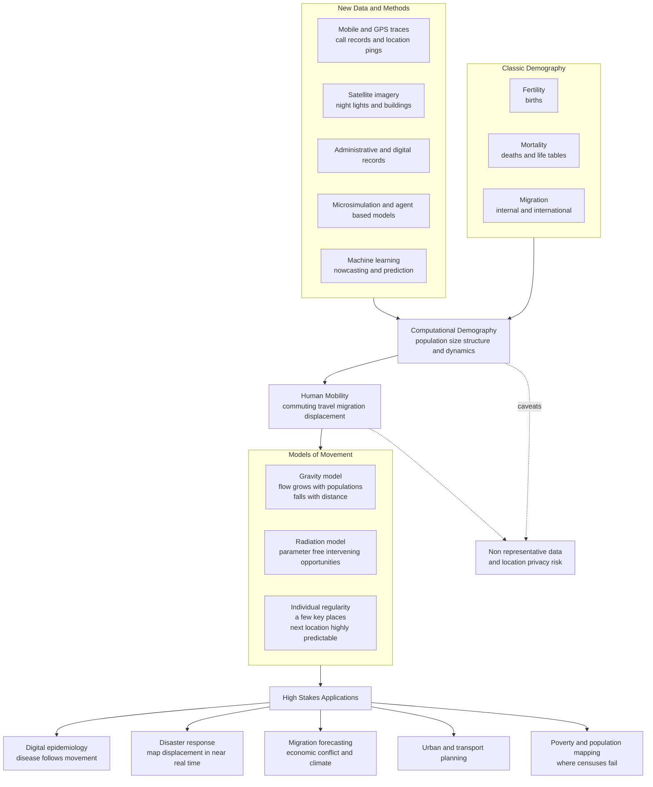

# 🛰️ Computational Demography and Human Mobility

> [!abstract] TL;DR
> **Computational demography** supercharges one of the oldest quantitative social sciences — the study of human **populations**, their size, structure, and the three engines that change them (**fertility, mortality, migration**) — with **new data** (mobile-phone and GPS traces, satellite imagery, administrative and digital records), **simulation** (microsimulation and agent-based models), and **machine learning** (nowcasting, prediction). Its flagship domain, **human mobility**, turns billions of location pings into a near-real-time portrait of how people move — daily commuting, travel, migration, and crisis displacement. The striking empirical lesson is that human movement, though it *feels* spontaneous, is highly **regular and predictable**: people spend most of their time at a **few** key places (home, work), the number of distinct places they visit is **heavy-tailed**, and the *next* location is guessable with remarkable accuracy — Song et al. estimated a theoretical ceiling near **93 percent**. Aggregate flows between places obey simple laws — the **gravity model** (flow grows with the two populations and falls with distance) and the parameter-free **radiation model** — that reproduce the structure of migration, commuting, and travel. This transforms high-stakes applications: **digital epidemiology** (disease follows movement — central to COVID-19 modeling), **disaster response and humanitarian aid** (mapping displacement and vulnerable populations from phone data), **migration forecasting** (economic, conflict, and climate-driven), and **poverty mapping** from satellites and phones where censuses fail. It also raises acute problems — mobility data is **non-representative** (the digital divide) and **privacy-corrosive** (location is uniquely re-identifiable and surveillance-prone) — making the computational study of where people are, move, and how populations change a powerful, life-saving, and ethically fraught frontier of computational social science.

---

## Intuition

**Analogy:** When a hurricane bears down on a coast, an epidemic erupts in a city, or a famine looms over a region, the single most urgent question is deceptively simple — *where are the people, and where are they moving?* For almost all of human history the only answer came from the **census**: a slow, expensive, once-a-decade snapshot that was already stale the day it was published. Trying to steer a disaster response with a ten-year-old census is like trying to navigate a storm with last decade's weather map. But every modern person now carries a small radio beacon in their pocket, and the billions of location pings those phones emit can be aggregated into something no census could ever provide: the **pulse of an entire population in near-real-time** — a coastline emptying out the night before a storm, a disease climbing the commuter rail line into a suburb, refugees streaming across a border in the hours after shells fall.

Computational demography turns these **digital breadcrumbs** — the same found data studied in [[Digital_Traces_and_Found_Data]] — into a living, high-resolution portrait of humanity's oldest patterns: how we are **born, move, and die**. And it inherits the same warning built into every footprint: the ping tells you *where feet went*, not *why they went there*, and only for the feet that happen to carry a phone.

---

## How It Works

Computational demography is classical demography with a new engine. **Demography** has *always* been quantitative — John Graunt counting London's bills of mortality in 1662, the actuarial **life table**, Malthus on population and resources, national **censuses** and **vital-statistics** registries, cohort **population projections**. What changes is the *measurement instrument* and the *modeling toolkit*.

### 1. The three demographic drivers

A population changes through exactly three flows. **Fertility** (births) adds people; **mortality** (deaths) removes them; **migration** (moves in and out) redistributes them across space. The classic **balancing equation** —

> population next year = population now + births − deaths + in-migration − out-migration —

is the accounting identity beneath the whole field. Fertility and mortality are relatively slow and smooth; **migration** is the fast, spatial, and hardest-to-measure driver, which is exactly why the digital revolution has hit it hardest.

### 2. New data sources

Where a census asks everyone once a decade, digital sources *observe* behavior continuously:

1. **Mobile-phone and GPS traces** — anonymized **call-detail records (CDRs)** and app location pings map where people are and how they move at national scale, day by day. This is the empirical backbone of mobility research.
2. **Satellite imagery** — night-time lights, building footprints, and land use estimate population density and settlement where no reliable census exists (WorldPop, Meta/Facebook population maps).
3. **Administrative and digital records** — tax, health, voter, and social-media data provide register-based demography and migration signals faster than surveys.

### 3. New methods

- **Microsimulation and agent-based models** simulate synthetic populations person-by-person to project fertility, aging, households, and migration under policy scenarios — the demographic cousin of [[Agent_Based_Models_of_Society]].
- **Machine learning** turns these signals into **nowcasts** and forecasts of population, migration, and poverty.

### 4. Human mobility — the flagship application

Feeding phone and GPS traces into demography yields **human mobility science**, which has produced two robust laws. First, **aggregate flows** between places follow the **gravity model** (movement between two locations grows with the product of their populations and falls with the distance between them — a Newtonian analogy) or the parameter-free **radiation model** (flow is governed by *intervening opportunities* — the population you would encounter closer than the destination). Second, **individual movement** is astonishingly **regular**: people are localized to a few key places, visit a **heavy-tailed** number of locations, and are **highly predictable** — the surprising order in where we go.



The left-to-right logic is the field's promise: an ancient accounting of births, deaths, and moves, re-instrumented with digital sensors and simulation, flows into a mobility science whose laws power life-and-death applications — shadowed always by the caveat box of bias and surveillance.

---

## Key Concepts

### Secondary

- **Demography is the study of populations.** How many people there are, how old they are, and how the number changes. It changes in only three ways: **births**, **deaths**, and people **moving** in or out.
- **The old way vs the new way.** For centuries the only way to count everyone was a **census** — a giant survey done once every ten years. It is accurate but slow and out of date fast. Now, the **phones** people carry leave location traces that can show, roughly and anonymously, where people are *today*.
- **Movement feels random but isn't.** It feels like you could go anywhere, but in fact almost everyone spends nearly all their time in a **handful of places** — mostly home and work or school. If someone watched your phone for a month, they could guess where you'll be next with surprising accuracy.
- **Bigger, closer places trade more people.** Two large cities close together send lots of commuters and migrants back and forth; two small, faraway towns barely exchange anyone. That simple rule — the **gravity model** — predicts a lot.
- **Why it matters.** Knowing where people are and where they move helps stop **disease**, respond to **disasters**, plan **cities**, and understand **migration**.

### Undergraduate

- **The balancing equation.** Population change decomposes exactly into fertility, mortality, and net migration. Computational demography does not replace this identity; it re-measures its terms — especially the spatial, fast-moving **migration** term — with digital data.
- **Call-detail records (CDRs) and the "found data" turn.** A CDR exists so a telecom can bill a call, not so a researcher can study migration. Repurposing it is the same *found-data* move analyzed in [[Digital_Traces_and_Found_Data]]: unobtrusive, timestamped, relational, continuous — and non-representative.
- **The gravity model.** Borrowed from Newtonian physics and formalized for social flows by Zipf and Stouffer, it predicts the flow between places `i` and `j` as `T_ij ∝ P_i · P_j / d_ij^γ`. It is the workhorse of migration, commuting, trade, and travel modeling — the demand-side sibling of the network structure in [[Trade_and_Supply_Chain_Networks]].
- **The radiation model (Simini et al., 2012).** A **parameter-free** alternative: the flow from `i` to `j` depends on the population of *intervening opportunities* — everyone living closer to `i` than `j` is — capturing the intuition that migrants stop at the nearest adequate opportunity. It often out-predicts gravity for commuting without any fitted distance exponent.
- **Regularity and burstiness.** González, Hidalgo & Barabási (2008), tracking 100,000 anonymized phone users, found that individual trajectories collapse onto a **single spatial distribution** after rescaling by a personal **radius of gyration**, and that movement is **bursty** — long stays punctuated by rare long jumps — echoing the heavy-tailed dynamics in [[Digital_Traces_and_Found_Data]].
- **The ~93 percent predictability.** Song, Qu, Blumm & Barabási (2010) measured the **entropy** of each user's location sequence and, via **Fano's inequality**, bounded how predictable the next location is. Despite wide differences in how far people travel, the *maximum predictability* clustered near **93 percent** — the famous "Limits of Predictability in Human Mobility."

### Graduate

- **Exploration and Preferential Return (EPR).** The generative model behind the regularities (Song et al., 2010): with probability `ρ·S^(−γ)` an agent *explores* a brand-new location (the more places already visited `S`, the rarer exploration becomes), otherwise it *preferentially returns* to a past location with probability proportional to its prior visit frequency. This single rule reproduces the sub-linear growth of distinct places `S(t) ∼ t^μ`, the **Zipf-like** visitation-frequency law, and the bounded radius of gyration — the balance of **routine and novelty** in human movement.
- **Entropy, Fano, and predictability.** Predictability is upper-bounded by inverting Fano's inequality: `S = H(Π) + (1−Π)·log₂(N−1)`, where `S` is the trajectory entropy and `N` the number of visited locations. The **temporal-uncorrelated** entropy (from visitation frequencies) yields a conservative bound `Π_unc`; the **actual** entropy (which credits temporal order and periodicity) yields the higher `Π_max ≈ 0.93`. Random entropy would give far lower predictability — the gap *is* the regularity.
- **Digital epidemiology and metapopulation models.** Mobility networks are the substrate of spatial epidemic spread: **metapopulation** models seed a compartmental (SIR/SEIR) process in each location and couple locations by mobility flows, so the pathogen's spatial invasion tracks human movement. During COVID-19, aggregated mobility (Google/Apple/Meta reports, Cuebiq, SafeGraph) drove reproduction-number estimation, lockdown evaluation, and importation-risk forecasting — the applied core linked to [[Contagion_and_Diffusion_in_Social_Networks]] and [[Public_Health_and_Epidemiology]].
- **Nowcasting, small-area estimation, and satellite ML.** Blumenstock, Cadamuro & On (2015, *Science*) predicted individual wealth and regional poverty in Rwanda from phone metadata; Jean et al. (2016, *Science*) predicted consumption and asset wealth from **satellite imagery** using transfer learning on night-lights. WorldPop and Meta's high-resolution population maps fuse census, satellite, and survey data for **small-area estimation** where censuses are absent or a decade stale — timely, granular demography, and a flagship of the toolkit in [[Prediction_and_Machine_Learning_in_Social_Science]].
- **Representativeness, bias correction, and privacy.** Phone ownership skews by wealth, gender, age, and urbanicity — the **digital divide** (see [[Big_Data_and_the_Social_Sciences]]) — so raw counts must be **post-stratified** and validated against ground truth. Simultaneously, location traces are the most re-identifiable data we produce (de Montjoye et al.: four spatiotemporal points identify 95 percent of people), making aggregation, differential privacy, and access control non-negotiable — the crux of [[Ethics_and_Privacy_in_Computational_Social_Science]]. The tension between humanitarian/pandemic use and mass surveillance is the field's defining ethical fault line.

---

## Python Demo

```python
# Human mobility has TWO striking regularities that this demo makes visible:
#   (A) AGGREGATE FLOWS obey a GRAVITY / RADIATION law -- bigger, closer places
#       exchange more people (migration, commuting, travel).
#   (B) INDIVIDUAL movement is HEAVY-TAILED and HIGHLY PREDICTABLE -- people
#       spend most time at a few places (home, work), visit a heavy-tailed
#       number of locations, and their NEXT location is guessable with high
#       accuracy (Gonzalez et al. 2008; Song et al. 2010, "~93% predictable").
#
# numpy + matplotlib only.

import numpy as np
import matplotlib.pyplot as plt

rng = np.random.default_rng(42)

# =====================================================================
# PART A -- GRAVITY & RADIATION MODELS OF FLOWS BETWEEN PLACES
# =====================================================================
n = 14                                        # number of cities
pos = rng.uniform(0, 100, size=(n, 2))        # 2D city locations
pop = np.exp(rng.normal(11.5, 1.1, size=n))   # heavy-tailed populations (few big)

# pairwise distances (no self-flow -> diagonal = inf)
diff = pos[:, None, :] - pos[None, :, :]
dist = np.sqrt((diff ** 2).sum(-1))
np.fill_diagonal(dist, np.inf)

# ---- GRAVITY model:  T_ij = K * P_i * P_j / d_ij^gamma ----
gamma, K = 2.0, 1e-4
grav = K * (pop[:, None] * pop[None, :]) / (dist ** gamma)
np.fill_diagonal(grav, 0.0)

# ---- RADIATION model (parameter-free; Simini et al. 2012) ----
# s_ij = population of "intervening opportunities": everyone closer to i than j
O = pop * 0.1                                 # outflow proportional to population
radi = np.zeros((n, n))
idx = np.arange(n)
for i in range(n):
    for j in range(n):
        if i == j:
            continue
        s = pop[(dist[i] < dist[i, j]) & (idx != i) & (idx != j)].sum()
        radi[i, j] = O[i] * (pop[i] * pop[j]) / ((pop[i] + s) * (pop[i] + pop[j] + s))

# Treat RADIATION flows (+ multiplicative noise) as a stylized "OBSERVED" pattern
observed = radi * np.exp(rng.normal(0, 0.35, size=(n, n)))
np.fill_diagonal(observed, 0.0)

# How well does the GRAVITY prediction capture the observed structure?
mask = (grav > 0) & (observed > 0)
corr = np.corrcoef(np.log10(grav[mask]), np.log10(observed[mask]))[0, 1]

# =====================================================================
# PART B -- INDIVIDUAL MOBILITY: heavy-tailed visits + high predictability
#   EPR model (Exploration & Preferential Return; Song et al. 2010):
#     with prob rho * S^(-alpha) EXPLORE a new place; else RETURN to an old
#     place with prob proportional to how often it was already visited.
# =====================================================================
def simulate_agent(steps=600, rho=0.6, alpha=0.21):
    coords, counts = [np.array([0.0, 0.0])], [1]     # location 0 = "home"
    for _ in range(steps):
        S = len(counts)
        if rng.random() < rho * S ** (-alpha):        # EXPLORE a new location
            r = rng.pareto(1.6) * 3.0                  # heavy-tailed jump length
            th = rng.uniform(0, 2 * np.pi)
            coords.append(np.array([r * np.cos(th), r * np.sin(th)]))
            counts.append(1)
        else:                                          # PREFERENTIAL RETURN
            p = np.asarray(counts, float); p /= p.sum()
            counts[rng.choice(len(counts), p=p)] += 1
    return np.asarray(counts), np.asarray(coords)

def predictability_bound(counts):
    """Fano upper bound on next-location predictability from visitation entropy."""
    p = counts / counts.sum()
    N = len(p)
    if N <= 1:
        return 1.0
    S = -(p * np.log2(p)).sum()                        # temporal-uncorrelated entropy
    lo, hi = 1.0 / N, 1.0 - 1e-12
    fano = lambda Pi: (-Pi * np.log2(Pi) - (1 - Pi) * np.log2(1 - Pi)
                       + (1 - Pi) * np.log2(N - 1))
    for _ in range(60):                                # bisection (fano decreasing in Pi)
        mid = 0.5 * (lo + hi)
        lo, hi = (mid, hi) if fano(mid) > S else (lo, mid)
    return 0.5 * (lo + hi)

n_agents = 400
pred, rgyr, top2 = [], [], []
example = None
for a in range(n_agents):
    counts, coords = simulate_agent()
    pred.append(predictability_bound(counts))
    w = counts / counts.sum()
    cm = (w[:, None] * coords).sum(0)
    rgyr.append(np.sqrt((w * ((coords - cm) ** 2).sum(1)).sum()))   # radius of gyration
    top2.append(np.sort(counts)[::-1][:2].sum() / counts.sum())
    if a == 0:
        example = np.sort(counts)[::-1]
pred, rgyr, top2 = map(np.asarray, (pred, rgyr, top2))

print("=" * 62)
print("GRAVITY / RADIATION FLOWS")
print("=" * 62)
print(f"cities                          : {n}")
print(f"corr(log gravity, log observed) : {corr:+.2f}")
print("=" * 62)
print("INDIVIDUAL MOBILITY REGULARITY")
print("=" * 62)
print(f"agents simulated                : {n_agents}")
print(f"median predictability (Fano UB) : {np.median(pred):.2f}")
print(f"median share of time at top 2   : {np.median(top2):.2f}")
print(f"median radius of gyration       : {np.median(rgyr):.1f}")

# =====================================================================
# FIGURE
# =====================================================================
fig, ax = plt.subplots(2, 2, figsize=(14, 11))
fig.suptitle("Human mobility: gravity/radiation flows and individual regularity",
             fontsize=14, fontweight="bold")

# (a) GRAVITY FLOW MAP -------------------------------------------------
axA = ax[0, 0]
thr = np.sort(grav.ravel())[::-1][int(0.15 * n * n)]     # keep strongest ~15% flows
for i in range(n):
    for j in range(i + 1, n):
        f = grav[i, j] + grav[j, i]
        if f >= thr:
            axA.plot([pos[i, 0], pos[j, 0]], [pos[i, 1], pos[j, 1]],
                     color="#2471a3", alpha=0.5, lw=0.4 + 3.0 * f / (2 * grav.max()))
axA.scatter(pos[:, 0], pos[:, 1], s=pop / pop.max() * 600 + 40,
            color="#e67e22", edgecolor="k", zorder=3)
axA.set_title("(a) Gravity-model flow map\nnode size = population, edge width = predicted flow",
              fontsize=10)
axA.set_xlabel("x"); axA.set_ylabel("y")

# (b) GRAVITY vs OBSERVED ---------------------------------------------
axB = ax[0, 1]
axB.scatter(grav[mask], observed[mask], s=18, alpha=0.6, color="#8e44ad")
lims = [min(grav[mask].min(), observed[mask].min()),
        max(grav[mask].max(), observed[mask].max())]
axB.plot(lims, lims, "k--", lw=1)
axB.set_xscale("log"); axB.set_yscale("log")
axB.set_title(f"(b) Gravity prediction vs observed flows\ncorr(log-log) = {corr:+.2f}",
              fontsize=10)
axB.set_xlabel("gravity-predicted flow"); axB.set_ylabel("observed flow (radiation + noise)")

# (c) HEAVY-TAILED VISITATION -----------------------------------------
axC = ax[1, 0]
ranks = np.arange(1, len(example) + 1)
axC.loglog(ranks, example / example.sum(), "o-", ms=4, color="#c0392b", label="one agent")
axC.set_title("(c) Heavy-tailed visitation\na few places (home, work) dominate", fontsize=10)
axC.set_xlabel("location rank (most visited = 1)"); axC.set_ylabel("share of visits")
axC.legend(fontsize=9)

# (d) PREDICTABILITY DISTRIBUTION -------------------------------------
axD = ax[1, 1]
axD.hist(pred, bins=25, color="#16a085", edgecolor="k", alpha=0.85)
axD.axvline(0.93, color="#c0392b", lw=2, ls="--", label="Song et al. ~0.93 (real entropy)")
axD.axvline(np.median(pred), color="k", lw=1.5, label=f"median = {np.median(pred):.2f}")
axD.set_title("(d) Predictability of next location\nupper bound from visitation entropy",
              fontsize=10)
axD.set_xlabel("predictability"); axD.set_ylabel("number of agents")
axD.legend(fontsize=8)

plt.tight_layout(rect=[0, 0, 1, 0.96])
plt.show()
```

**What the demo shows:**

- **Panel (a) — the gravity flow map.** Cities are sized by population and joined by their strongest predicted flows. The eye immediately sees the law: **big, nearby** cities are thickly connected, while small or distant ones barely exchange anyone — the visual signature of `T_ij ∝ P_i·P_j / d_ij²`.
- **Panel (b) — gravity captures real structure.** The **gravity** prediction is plotted against a stylized "observed" pattern that we generated from the *entirely different* **radiation** model plus noise. They still line up tightly along the diagonal (the printed log-log correlation is strongly positive), demonstrating that both classic models capture the same first-order truth: flows scale with population and decay with distance.
- **Panel (c) — heavy-tailed visitation.** Ranking one agent's locations by how often they are visited yields a near-straight line on log-log axes: the **top one or two places (home, work) absorb most visits**, and a long tail of places is visited only rarely. The console prints the median share of time spent at just the top two locations.
- **Panel (d) — predictability.** Inverting Fano's inequality on each agent's visitation entropy gives an **upper bound** on how well the next location can be guessed. The distribution sits high; the dashed line marks the famous Song et al. **~0.93** from the *actual* (temporal) entropy. The gap between our conservative *uncorrelated* bound and the 0.93 line is precisely the extra regularity that **temporal order and daily periodicity** contribute — accounting for *when*, not just *how often*, pushes predictability toward the 93 percent ceiling.

Run it and read the console: the log-log flow correlation, the median predictability, the top-two-location share, and the median radius of gyration together quantify how much order hides inside movement that feels free.

---

## Real-World Applications

> **Digital epidemiology and pandemic response.** Anonymized mobility (call-detail records; Google, Apple, Meta, Cuebiq, and SafeGraph movement reports) became a primary instrument during **COVID-19** — estimating reproduction numbers, evaluating lockdown compliance, forecasting importation risk between regions, and seeding metapopulation SEIR models. The same approach mapped malaria importation in Kenya (Wesolowski et al.) and Ebola movement in West Africa, operationalizing the diffusion mechanics of [[Contagion_and_Diffusion_in_Social_Networks]] on real human networks.

> **Disaster response and humanitarian mapping.** After the 2010 Haiti earthquake, Bengtsson et al. tracked population **displacement** from SIM-card locations within days — far faster than any survey — to direct relief. Flowminder, the WorldPop group, and UN agencies now routinely map post-disaster movement (floods, cyclones, conflict) in near-real-time to answer the only questions that matter in a crisis: *where did people go, and where is help needed?*

> **Migration measurement and forecasting.** Phone and geotagged social-media data measure internal and international **migration** faster than censuses, while models incorporate economic, conflict, and **climate** drivers to forecast displacement (linking to the drivers studied in [[Migration_and_Diaspora]] and [[Climate_Politics_and_Environmental_Governance]]). Facebook's "Coordinated Migration" estimates and the EU's forecasting pilots exemplify a policy-critical, data-enhanced field.

> **Poverty and population mapping where surveys fail.** Blumenstock et al. predicted wealth from phone metadata in Rwanda; Jean et al. estimated consumption from **satellite imagery** via transfer learning; WorldPop and Meta produce building-level population maps for low-income countries with old or absent censuses — supplying the fine-grained denominators that development and public-health planning (see [[Global_Health_and_Health_Systems]] and [[Development_Economics_and_Political_Development]]) depend on.

> **Urban and transport planning.** Commuting flows extracted from CDRs and GPS calibrate transport demand, delineate functional urban areas, and reveal the pulse of the city — the empirical complement to [[Urban_Sociology_and_the_City]] and [[Urban_and_Infrastructure_Systems]].

---

## Common Pitfalls

- **The "n = all" representativeness trap.** A national CDR dataset can cover tens of millions of people and *still* misrepresent the population: phone owners skew wealthier, more male, more urban, and older. Big-N removes sampling variance but not **coverage bias** — the digital divide is baked into the frame, and no volume of data fixes a skewed sampling process. Always post-stratify and validate against a census or survey ground truth.
- **Confusing presence with people.** One SIM is not one person (people share, own multiples, or churn devices), and a ping is a *device*, not an *individual*. Naive person-counts double- or under-count without device-to-person adjustment.
- **Treating anonymized location data as safe.** Mobility traces are the *most* re-identifiable data we generate — four spatiotemporal points uniquely fingerprint 95 percent of people (de Montjoye et al.). "De-identified" location data is routinely re-linked; only aggregation, differential privacy, or strict access control genuinely protect subjects.
- **Over-reading the gravity exponent.** A gravity model fit on one region's distance exponent rarely transfers to another; commuting, migration, and trade have *different* effective exponents, and a mis-specified distance term silently distorts every predicted flow. The parameter-free radiation model exists partly to escape this fragility.
- **Ignoring drift and platform effects.** Mobility signals shift with device penetration, app policies, and operator market share (the same **algorithmic confounding** that broke Google Flu Trends). A mobility-based indicator needs continual recalibration, not a one-time fit.
- **Predictability is not determinism.** A 93-percent *ceiling* on predictability describes a statistical regularity across a population's routines; it does not mean any individual's every move is foreordained, and using it to justify individual-level surveillance or profiling is both a statistical and an ethical error.
- **Mistaking the ping for the reason.** Mobility data gives *where* and *when* with unprecedented resolution but is silent on *why* someone moved — economic opportunity, coercion, flight, or leisure look identical in the trace. Motive requires the designed data and theory this note's siblings supply.

---

## Related Concepts

**This vault (Computational Social Science):**

- [[Digital_Traces_and_Found_Data]] — the found-data foundation; mobile-phone and GPS traces are the exact digital breadcrumbs computational demography repurposes, and burstiness/heavy tails reappear here as movement regularity.
- [[Big_Data_and_the_Social_Sciences]] — the representativeness, "n = all," and digital-divide problems that make raw mobility counts biased without post-stratification.
- [[Contagion_and_Diffusion_in_Social_Networks]] — mobility networks are the substrate on which disease and information diffuse; digital epidemiology couples this diffusion to real movement flows.
- [[Ethics_and_Privacy_in_Computational_Social_Science]] — location data is uniquely re-identifiable and surveillance-prone; the pandemic-vs-surveillance tension is this field's defining ethical fault line.
- [[Prediction_and_Machine_Learning_in_Social_Science]] — the nowcasting and forecasting toolkit this note applies to population, migration, and poverty data.
- [[Long_Run_Economic_and_Population_History]] — the deep-time counterpart: centuries of demography, wages, prices, and migration that this near-real-time field extends into the present.
- [[Agent_Based_Models_of_Society]] — microsimulation and agent-based demography simulate synthetic populations person-by-person, the modeling engine behind projection and the EPR mobility model.

**Cross-vault connections:**

- [[Migration_and_Diaspora]] — the sociological theory of migration drivers and diasporas that computational methods now measure faster than censuses.
- [[Urban_Sociology_and_the_City]] — commuting and mobility flows are the empirical pulse of the city this note maps from digital traces.
- [[Public_Health_and_Epidemiology]] — the epidemiological backbone (SIR/SEIR, reproduction numbers) that mobility data feeds in digital epidemiology.
- [[Infectious_Disease_Vaccines_and_Immunity]] — the pathogens whose spatial spread tracks human movement, central to COVID-19 mobility modeling.
- [[Small_World_and_Scale_Free_Networks]] — travel and mobility networks show heavy-tailed, small-world structure; the gravity/radiation flow matrix is a weighted spatial network.
- [[Network_Dynamics_and_Contagion]] — how disease, information, and behavior cascade over the mobility-derived contact network.
- [[Trade_and_Supply_Chain_Networks]] — the gravity model is the shared workhorse of migration, commuting, and trade flows; goods and people obey the same population-and-distance law.
- [[Economic_Networks_and_Interaction_Structure]] — the broader network view of spatial economic interaction that mobility flows help populate.
- [[Firm_Size_and_City_Size_Distributions]] — the heavy-tailed city-size (Zipf) distribution that supplies the population masses driving gravity-model flows.
- [[Power_Laws_and_Heavy_Tails_in_Economics]] — the heavy-tailed statistics (visitation frequency, jump lengths, city sizes) that pervade mobility data.
- [[Global_Inequality_and_Development]] — poverty and development mapping from satellite and phone data serves exactly the low-data settings this literature studies.
- [[Development_Economics_and_Political_Development]] — where censuses fail, mobility- and satellite-based estimation supplies the population and poverty denominators policy needs.
- [[Climate_Politics_and_Environmental_Governance]] — climate-driven displacement is a fast-growing target of migration forecasting.
- [[Common_Probability_Distributions]] — the heavy-tailed (power-law, lognormal) versus thin-tailed distributions that distinguish real mobility from random-walk nulls.
- [[Regression_and_Correlation]] — the log-log calibration of gravity/radiation models and of nowcasting relationships against ground truth.

---

## Review Questions

### Secondary

1. Explain, in your own words, why a census is not enough to respond to a fast-moving disaster like a flood, and how location data from phones can help fill the gap. What is one thing the phone data *cannot* tell you?
2. Someone says "human movement is totally unpredictable — people go wherever they want." Using the ideas of *home*, *work*, and *a few key places*, argue why this is mostly false. Roughly what share of time do people spend at their top couple of locations?
3. The **gravity model** says bigger, closer places exchange more people. Give one real example of two places that would have a large flow between them and two that would have almost none, and explain why.

### Undergraduate

1. Write down the demographic **balancing equation** and explain why **migration** — rather than fertility or mortality — is the term most transformed by digital data. What makes migration harder to measure with a traditional census?
2. Contrast the **gravity** and **radiation** models of flows. State the radiation model's notion of *intervening opportunities*, and explain one situation where it would predict a very different flow than a gravity model with a fixed distance exponent.
3. Song et al. reported human mobility is up to ~93 percent predictable. Explain how **entropy** and **Fano's inequality** turn an observed trajectory into a *predictability bound*, and why the *uncorrelated* entropy gives a lower bound than the *actual* entropy.

### Graduate

1. You are handed a national telecom's anonymized CDR dataset and asked to produce a real-time internal-migration nowcast. Design the pipeline end to end: how you infer "home" locations and moves, how you correct for **non-representativeness** (device ownership, SIM-to-person ratios, operator market share), how you **validate** against ground truth, and what **privacy** safeguards you impose before anything is published. Justify each choice.
2. During an epidemic, a public-health agency wants to use mobility data to target a lockdown. Lay out the **metapopulation** modeling approach that couples an SEIR process to mobility flows, identify the two biggest sources of bias in the mobility signal, and state the ethical guardrails that distinguish legitimate public-health use from mass surveillance — referencing [[Ethics_and_Privacy_in_Computational_Social_Science]].
3. The **EPR** model reproduces heavy-tailed visitation and bounded radius of gyration from just *exploration* and *preferential return*. Explain mathematically why this rule yields sub-linear growth of distinct locations `S(t) ∼ t^μ` and a Zipf-like visitation law, and discuss what the model *omits* (motive, social ties, temporal periodicity) that limits its use for forecasting an individual's next move.

---

## Sources

- [González, M.C., Hidalgo, C.A. & Barabási, A.-L. (2008). "Understanding individual human mobility patterns." *Nature*, 453, 779–782.](https://doi.org/10.1038/nature06958) — 100,000 phone users; rescaled trajectories, radius of gyration, burstiness.
- [Song, C., Qu, Z., Blumm, N. & Barabási, A.-L. (2010). "Limits of Predictability in Human Mobility." *Science*, 327(5968), 1018–1021.](https://doi.org/10.1126/science.1177170) — entropy, Fano bound, and the ~93 percent predictability ceiling; the EPR model.
- [Simini, F., González, M.C., Maritan, A. & Barabási, A.-L. (2012). "A universal model for mobility and migration patterns." *Nature*, 484, 96–100.](https://doi.org/10.1038/nature10856) — the parameter-free radiation model of flows.
- [Blumenstock, J., Cadamuro, G. & On, R. (2015). "Predicting poverty and wealth from mobile phone metadata." *Science*, 350(6264), 1073–1076.](https://doi.org/10.1126/science.aac4420) — phone-based poverty and wealth mapping.
- [Bengtsson, L. et al. (2011). "Improved response to disasters and outbreaks by tracking population movements with mobile phone network data: A post-earthquake geospatial study in Haiti." *PLoS Medicine*, 8(8), e1001083.](https://doi.org/10.1371/journal.pmed.1001083) — displacement mapping from SIM locations after the Haiti earthquake.
- [Jean, N. et al. (2016). "Combining satellite imagery and machine learning to predict poverty." *Science*, 353(6301), 790–794.](https://doi.org/10.1126/science.aaf7894) — transfer learning on satellite imagery for small-area poverty estimation.

---

#computational-social-science #computational-demography #human-mobility #migration #mobile-data
