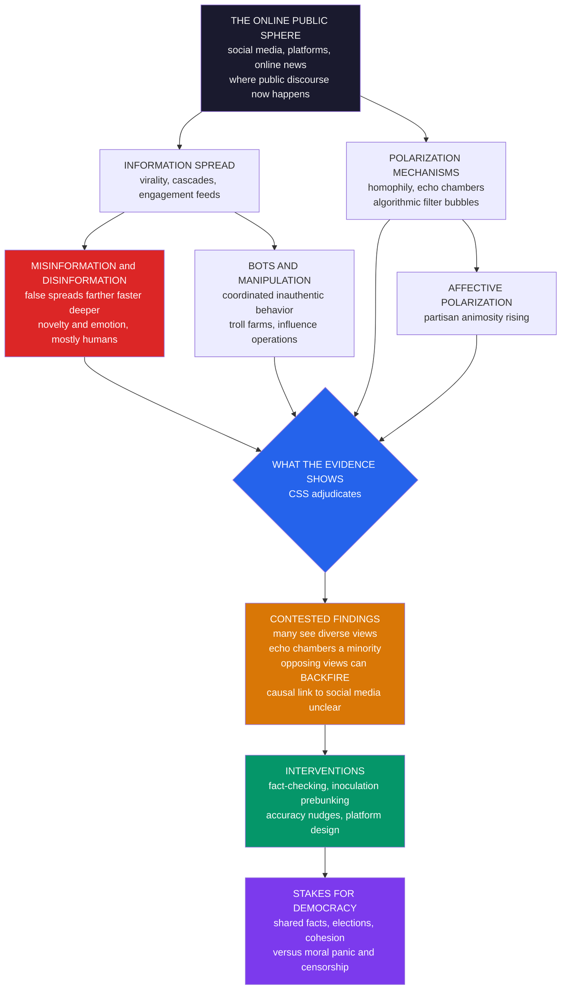

# 🗣️ Misinformation, Polarization, and the Online Public Sphere

> [!abstract] TL;DR
> The **online public sphere** is the digital arena — social media, platforms, online news — where public discourse, journalism, and political communication now largely occur: a transformation of Habermas's **public sphere** with profound stakes for democracy, and a flagship, high-stakes object of computational social science. Digital communication is **dual-natured**: it connected the world, democratized information, and powered movements and accountability (Arab Spring, #MeToo, citizen journalism), yet is feared to have amplified **misinformation**, **polarization**, echo chambers, manipulation, and the erosion of a shared reality. CSS uses big data, network analysis, and text-as-data to move past both techno-utopian and doom-monger narratives to what the evidence *actually* shows — and the findings are surprising. **Misinformation** (false, spread without intent) and **disinformation** (deliberately false — propaganda, influence operations) genuinely spread **farther, faster, and deeper** than truth (Vosoughi, Roy & Aral, *Science* 2018), driven by **novelty and emotion**, and spread mostly by **humans, not bots**. **Homophily** and engagement-optimizing **algorithms** can forge **echo chambers** and **filter bubbles** (Pariser). Yet the popular story — social media inevitably traps everyone in bubbles and drives polarization — is **strikingly contested**: many users encounter *more* diverse views online than off, echo chambers grip only a **minority**, exposure to opposing views can **backfire** and *increase* extremity (Bail's "social media prism"), and rising **affective polarization**'s causal link to social media is unclear (it rose fastest among the least-online). Because the health of this information environment underpins democracy — informed citizens, legitimate elections, public health — CSS is essential both to weigh real harms (misinformation, manipulation, algorithmic amplification) against overstated **moral panics**, and to design evidence-based **interventions** (fact-checking, **inoculation**/prebunking, accuracy nudges, platform design). It is one of the field's most consequential and most nuanced frontiers.

---

## Intuition

**Analogy:** The **printing press** gave us the Reformation and the Enlightenment — the democratization of knowledge, the scientific revolution, the modern public. It also gave us a century and a half of religious war, witch-hunt manuals that outsold almost everything else, and propaganda at industrial scale. Every revolution in how humans communicate — writing, print, radio, television — reshapes society **for good and ill at once**, and it takes generations to learn which levers to pull. Radio informed democracies and also broadcast Nuremberg. Social media is the latest and by far the **fastest** of these revolutions. It connected the planet, put a printing press in every pocket, and helped topple dictators — and it is feared to have drowned us in falsehood, sorted us into hostile tribes, and hollowed out the shared reality that democracy needs to function.

But **is that story true?** This is exactly where the alarmist headline meets the hard data. When you actually measure how misinformation spreads, who is trapped in echo chambers, and whether showing people "the other side" cools them down or lights them up, the answers are **more surprising, more nuanced, and more important** than either the techno-utopians or the doom-mongers claim. Computational social science is the instrument that adjudicates the fight — and its verdict is rarely the simple one. Misinformation *does* travel faster than truth; echo chambers *are* real but *narrower* than feared; and the well-meaning cure of cross-partisan exposure can be *worse* than the disease.

---

## How It Works

The online public sphere is where public opinion is now formed, contested, and manipulated — the digital successor to the coffee-house, the newspaper, and the town square. CSS studies it as a **coupled human-algorithm system**: human psychology (novelty-seeking, identity, motivated reasoning) interacting with **network structure** (homophily, hubs, communities) and **platform machinery** (feeds, recommenders, share buttons tuned to maximize engagement). Four questions organize the field: how information and *mis*information **spread**; what **mechanisms** drive polarization; what the **evidence** actually finds versus the popular narrative; and what **interventions** work.

### How misinformation spreads

- **Misinformation vs disinformation.** *Misinformation* is false or misleading information spread **without intent to deceive** (an honest share of a wrong rumor). *Disinformation* is **deliberately** false — propaganda, coordinated influence operations, state-sponsored campaigns. The line is intent, and it matters for both diagnosis and remedy.
- **The landmark finding.** Vosoughi, Roy & Aral analyzed ~126,000 rumor cascades on Twitter and found that **false news spread significantly farther, faster, deeper, and more broadly than the truth** — false political stories reached 1,500 people about six times faster than true ones. The driver was **novelty and emotion**: false stories were more novel and evoked more surprise, fear, and disgust. Crucially, **bots accelerated true and false news equally** — so the asymmetry was produced by **humans**, not automation. Falsehood is more viral because it is built to be more shareable.
- **The virality of falsehood.** Because engagement-optimizing feeds reward exactly the high-arousal, surprising content that misinformation supplies, the platform's objective function has a **structural bias toward the provocative** — the diffusion machinery detailed in [[Contagion_and_Diffusion_in_Social_Networks]] and [[Online_Social_Networks_and_Platforms]].

### Bots, trolls, and manipulation — the adversarial dimension

Beyond organic spread sits a **weaponized** layer: automated accounts (**bots**), **coordinated inauthentic behavior**, troll farms, and state influence operations — most infamously Russia's **Internet Research Agency** around the 2016 U.S. election ("computational propaganda," Woolley & Howard). CSS detects bots and coordination computationally (temporal signatures, content similarity, network structure), and studies **astroturfing** — fake grassroots. But a key nuance: the **measured effects are often smaller than feared**. Studies of IRA activity found exposure concentrated among already-partisan users and little evidence of large attitude or vote change. The adversarial threat is real; its **magnitude is frequently overstated**.

### Mechanisms of polarization

- **Homophily** — we associate with the like-minded (the selection-versus-influence story of [[Homophily_Selection_and_Influence]]), so partisan communities cluster.
- **Echo chambers** — interacting mostly with congenial others, reinforcing existing beliefs.
- **Filter bubbles** (Pariser) — **algorithms** curating congenial content, narrowing exposure without the user's awareness.
- **Affective polarization** — the growth of partisan **animosity** and out-group distrust, often outrunning issue disagreement (the mechanism modeled in [[Opinion_Dynamics_and_Polarization]]).

### The contested evidence — where CSS earns its keep

Here the data breaks the popular narrative:

1. **More diversity than assumed.** Bakshy, Messing & Adamic's Facebook study found individual choice and the algorithm both reduce cross-cutting exposure, but users still encounter a **substantial** share of opposing views — and individual choices matter more than the feed.
2. **Echo chambers are a minority phenomenon.** Most users have politically **mixed** information diets; hardened echo chambers concentrate among a small, highly engaged partisan slice.
3. **Exposure can backfire.** Bail's field experiment paid Twitter users to follow an opposing-party bot for a month; being exposed to the other side made Republicans **more** conservative and Democrats slightly more liberal. Contact is not automatically corrective — *Breaking the Social Media Prism*.
4. **Causation is unclear.** Boxell, Gentzkow & Shapiro found affective polarization rose **fastest among the oldest, least-online** Americans, and it has risen at different rates across countries with similar media — awkward for a pure algorithm story.

The lesson is not "social media is harmless," but that reality is **nuanced, heterogeneous, and resists simple stories** — the value of data over narrative.

### Algorithms — the platform's hand

Recommendation and feed **algorithms** shape what people see by optimizing for engagement, plausibly amplifying emotional, outrage, and extreme content, and are blamed for radicalization "rabbit holes" (the YouTube debate — also contested; several studies find recommendation-driven radicalization is rarer than assumed and demand-driven viewing dominates). Studying algorithmic effects is genuinely **hard**: **algorithmic confounding** (you observe the human-algorithm system, not "natural" behavior), lack of researcher access, and the entanglement of supply and demand — the measurement problems of [[Measurement_and_Validity_in_Digital_Data]] and the machinery of the [[Recommendation_System]]. Large 2020 platform experiments found feeds shape **exposure** strongly but move **attitudes** modestly.

### Interventions — the toolkit and its limits

- **Fact-checking** — limited reach, some backfire concern (mostly overstated), but modest corrective effect.
- **Inoculation / prebunking** (van der Linden) — pre-emptively exposing people to *weakened* misinformation techniques to build resistance; among the most **promising** approaches, scalable via short videos.
- **Accuracy nudges** (Pennycook & Rand) — simply prompting people to consider accuracy before sharing **reduces** the sharing of falsehoods; much false sharing is **inattention**, not conviction — a design cousin of [[Nudges_and_Choice_Architecture]].
- **Media literacy**, **platform design** (friction, labels, downranking), and **content moderation** — the last in permanent tension with free expression.

### The stakes for democracy

The online public sphere's health is tied to **democracy**: informed citizens, shared facts, legitimate elections, and social cohesion. Misinformation can undermine trust and public health (COVID and vaccine falsehoods proved **deadly**), and polarization can threaten democratic stability (the concern of [[Democratic_Backsliding_and_Polarization]]). But there is a symmetric risk: **overstating** harms fuels **moral panic**, and heavy-handed "solutions" (censorship) threaten free expression. Governing the digital public sphere means weighing real harms against overstated ones — democracy's information problem.

### The online public sphere, in one picture



---

## Key Concepts

### Secondary Level

**Why do lies travel faster than the truth online?** Imagine a rumor and a boring true fact racing through a school. The rumor is juicy, shocking, and new, so everyone wants to be the first to pass it on. The true fact is dull, so it fizzles. Online, the same thing happens at enormous speed: **false, surprising, emotional stories get shared far more** than careful true ones — and mostly by ordinary people, not robots.

**What is an echo chamber?** It is when you mostly hear from people who **already agree with you**, so your side sounds like the whole world and the other side sounds crazy. Two things push you into one: you **choose** friends like yourself (homophily), and the app's **feed** shows you more of what you already like.

**The surprising twist.** You might think the fix is easy: just show people the other side. But experiments found that forcing people to read the opposing team's posts often made them **dig in harder**, not change their minds. And most people online actually see a *mix* of views, not a sealed bubble. The real story is more complicated than "social media rots your brain" — which is exactly why we study it with data instead of guessing.

### Undergraduate Level

- **Public sphere (Habermas), digitized.** The arena of public reasoning that legitimizes democratic authority. Platforms have **privatized and algorithmically mediated** it: a corporate, engagement-optimized square rather than open air.
- **Misinformation vs disinformation.** False/misleading *without* intent vs *deliberately* false. Related terms: **malinformation** (true information shared to harm), **rumor**, **propaganda**.
- **The Vosoughi-Roy-Aral result.** False news reached more people, spread faster, and formed **deeper** cascades than true news; novelty and emotional content explained the gap; **bots** amplified both equally, so **humans** drove the asymmetry.
- **Cascades and virality.** A cascade is a share-of-a-share tree. Most cascades are **small and shallow**; a heavy-tailed minority go huge — the power-law statistics of [[Contagion_and_Diffusion_in_Social_Networks]] and complex/simple contagion.
- **Echo chamber vs filter bubble.** Echo chamber = *social* self-selection (homophily); filter bubble = *algorithmic* curation. They overlap but have different causes and different fixes.
- **Cross-cutting exposure.** The share of one's information diet from the *other* side. Homophily and algorithmic filtering both **lower** it; measuring it is central to the echo-chamber debate.
- **Affective vs issue polarization.** Growing **dislike** of the out-party vs diverging **positions**. Affective polarization has risen sharply; its tie to social media is disputed.
- **Bots and coordinated inauthentic behavior.** Automated or centrally-directed accounts that fake grassroots activity; detectable but with frequently **overstated** persuasive effects.
- **Interventions.** Fact-checking, **inoculation/prebunking**, **accuracy nudges**, labels, friction, downranking, media literacy, moderation.

### Graduate Level

- **The identification problem.** The headline causal question — *does social media cause polarization and misinformation-driven harm?* — is bedeviled by **selection** (who joins/uses platforms), **algorithmic confounding** (exposure is endogenous to the ranking model), and **reverse causality** (partisans seek congenial content). Observational cascade data cannot settle it; the field increasingly relies on **field and platform experiments** (the concern of the forthcoming sibling *Online_Experiments_and_Digital_Field_Experiments*).
- **The backfire / boomerang mechanism.** Bail's result contradicts naive **contact theory**. Under **identity-protective cognition** and **motivated reasoning** ([[Confirmation_Bias_and_Motivated_Reasoning]]), cross-partisan exposure is processed as **threat**, triggering counter-arguing and *increased* extremity among strong identifiers — a genuine boomerang, not mere non-response.
- **Decomposing exposure (Bakshy et al.).** Reduction in cross-cutting content can be attributed to (i) the **available pool** (network homophily), (ii) **individual choice** (what users click), and (iii) the **algorithm** (feed ranking). Bakshy et al. found individual choice mattered *more* than the algorithm — reframing the filter-bubble debate as partly about demand, not just supply.
- **The elusive algorithmic effect.** The 2020 U.S. 2020 Facebook/Instagram collaboration (Guess et al., Nyhan et al., *Science*/*Nature* 2023) randomized chronological vs algorithmic feeds and reduced-reshare conditions: feeds strongly changed **exposure** (e.g., far more untrustworthy and like-minded content in the algorithmic feed) but changed **attitudes and affective polarization** little over the study window — a template for the exposure-versus-persuasion distinction.
- **Measurement of polarization from traces.** Estimated via community detection on retweet/follow graphs (Conover et al.; Barberá's ideal-point scaling), stance detection (the toolkit of [[Sentiment_Emotion_and_Stance_Analysis]]), and surveys (feeling thermometers) — each with validity caveats that can flip conclusions.
- **Inoculation theory, formalized.** Prebunking builds resistance by exposing a **weakened** form of a manipulation technique plus a refutation, conferring **cross-topic** protection against the *technique* (emotional manipulation, false dilemma, scapegoating) rather than any single claim — the psychological-vaccine logic (van der Linden), scalable and technique-general.
- **The heterogeneity imperative.** Effects vary by **person** (strong vs weak partisans), **platform** (Twitter is not TikTok is not WhatsApp), and **outcome** (exposure vs belief vs behavior vs affect). Average treatment effects hide the concentration of harm in small, highly engaged subpopulations — the crux of the "moral panic vs real harm" debate.

---

## Python Demo

```python
import numpy as np
import matplotlib
matplotlib.use("Agg")
import matplotlib.pyplot as plt

# =====================================================================
# MISINFORMATION SPREAD and ECHO CHAMBERS  (numpy + matplotlib only)
#
# PART A -- MISINFORMATION CASCADES (Vosoughi-Roy-Aral, Science 2018):
#   Independent-cascade diffusion on a random social network. FALSE items
#   have HIGHER per-edge transmissibility than TRUE items (they are more
#   novel/emotional/shareable). We run many cascades of each and show that
#   FALSE news spreads FARTHER (bigger), FASTER, and DEEPER than TRUE news.
#
# PART B -- ECHO CHAMBERS, FILTERING, and the BACKFIRE effect (Bail):
#   (1) Build a partisan network with tunable HOMOPHILY and measure
#       CROSS-CUTTING exposure with vs without homophily + an algorithmic
#       filter that further down-ranks opposing content.
#   (2) Simulate a cross-partisan EXPOSURE intervention: weak partisans are
#       mildly persuaded toward the other side, but STRONG partisans are
#       identity-threatened and move AWAY (backfire) -- so net POLARIZATION
#       can INCREASE, reflecting the contested evidence.
# =====================================================================
rng = np.random.default_rng(7)

# ---------------------------------------------------------------------
# A random undirected social network as neighbor lists (no networkx).
# ---------------------------------------------------------------------
def build_network(n, mean_degree, seed):
    r = np.random.default_rng(seed)
    p = mean_degree / (n - 1.0)                 # Erdos-Renyi edge probability
    adj = [[] for _ in range(n)]
    # sample edges in blocks to stay memory-light
    for i in range(n):
        # each i connects forward to j>i with prob p
        js = np.nonzero(r.random(n - i - 1) < p)[0] + i + 1
        for j in js:
            adj[i].append(j)
            adj[j].append(i)
    return [np.array(a, dtype=np.int64) for a in adj]

# ---------------------------------------------------------------------
# PART A: independent-cascade diffusion, returns size, depth, growth curve
# ---------------------------------------------------------------------
def cascade(adj, p_transmit, seed_node, r, max_gen=25):
    n = len(adj)
    infected = np.zeros(n, dtype=bool)
    infected[seed_node] = True
    frontier = [seed_node]
    per_gen = [1]                               # newly-infected count by generation
    gen = 0
    while frontier and gen < max_gen:
        nxt = []
        for u in frontier:
            nb = adj[u]
            if nb.size == 0:
                continue
            hits = nb[(r.random(nb.size) < p_transmit) & (~infected[nb])]
            for v in np.unique(hits):
                if not infected[v]:
                    infected[v] = True
                    nxt.append(v)
        if nxt:
            per_gen.append(len(nxt))
        frontier = nxt
        gen += 1
    size = int(infected.sum())
    depth = len(per_gen) - 1                     # generations reached
    return size, depth, per_gen

def run_many(adj, p_transmit, n_runs, seed):
    r = np.random.default_rng(seed)
    n = len(adj)
    sizes, depths = [], []
    growth = np.zeros(26)                        # cumulative infected by generation
    for _ in range(n_runs):
        s0 = int(r.integers(n))
        size, depth, per_gen = cascade(adj, p_transmit, s0, r)
        sizes.append(size); depths.append(depth)
        cum = np.cumsum(per_gen)
        growth[:cum.size] += cum
        growth[cum.size:] += cum[-1]             # hold final value
    return np.array(sizes), np.array(depths), growth / n_runs

N, KBAR, RUNS = 3000, 8, 400
adj = build_network(N, KBAR, seed=1)
# FALSE has higher transmissibility (novelty/emotion) -> supercritical spread;
# TRUE is near/below the epidemic threshold -> small cascades.
P_TRUE, P_FALSE = 0.085, 0.16
size_t, depth_t, grow_t = run_many(adj, P_TRUE,  RUNS, seed=10)
size_f, depth_f, grow_f = run_many(adj, P_FALSE, RUNS, seed=20)

# ---------------------------------------------------------------------
# PART B (1): homophily network + cross-cutting exposure
# ---------------------------------------------------------------------
def cross_cutting(n, mean_degree, homophily, seed):
    """Return mean fraction of OPPOSITE-party neighbours (raw and filtered)."""
    r = np.random.default_rng(seed)
    party = (r.random(n) < 0.5).astype(int)     # 0 = blue, 1 = red
    p_base = mean_degree / (n - 1.0)
    same_frac, opp_frac = [], []
    filt_opp_frac = []
    W_SAME, W_OPP = 1.0, 0.25                    # algorithmic feed weights (down-rank opposing)
    for i in range(n):
        same = party == party[i]
        # tie probability boosted for same-party by homophily, suppressed for opposite
        prob = np.where(same, p_base * (1 + homophily * 3), p_base * (1 - homophily))
        prob[i] = 0.0
        nb = np.nonzero(r.random(n) < prob)[0]
        if nb.size == 0:
            continue
        n_opp = np.sum(party[nb] != party[i])
        n_same = nb.size - n_opp
        opp_frac.append(n_opp / nb.size)
        # algorithmic filter: expected opposite share AFTER down-ranking
        denom = n_same * W_SAME + n_opp * W_OPP
        filt_opp_frac.append((n_opp * W_OPP) / denom if denom > 0 else 0.0)
    return np.mean(opp_frac), np.mean(filt_opp_frac)

cc_random, _          = cross_cutting(2000, 8, homophily=0.0, seed=2)   # no homophily
cc_homophily, cc_filt = cross_cutting(2000, 8, homophily=0.9, seed=2)   # homophily (+filter)

# ---------------------------------------------------------------------
# PART B (2): cross-partisan exposure -> persuasion vs BACKFIRE
# ---------------------------------------------------------------------
def polarization_index(x):
    return float(np.mean(np.abs(x)))            # mean distance from center (0)

M = 4000
party = np.where(rng.random(M) < 0.5, -1.0, 1.0)
# opinions correlated with party, spread out; some weak, some strong partisans
x0 = np.clip(party * rng.uniform(0.1, 0.95, M) + rng.normal(0, 0.15, M), -1, 1)

# Each agent is shown the OPPOSING side's mean opinion (a cross-exposure "treatment")
msg = np.where(party > 0, np.mean(x0[party < 0]), np.mean(x0[party > 0]))
strong = np.abs(x0) > 0.5                        # committed partisans -> identity threat
BETA, GAMMA = 0.12, 0.35                          # persuasion pull, backfire push
# weak agents drift toward message (+BETA); strong agents recoil away (BETA-GAMMA < 0)
coef = np.where(strong, BETA - GAMMA, BETA)
x1 = np.clip(x0 + coef * (msg - x0), -1, 1)

pol_before, pol_after = polarization_index(x0), polarization_index(x1)

# ------------------------------ REPORT --------------------------------
print("=" * 66)
print("MISINFORMATION vs TRUTH  (independent-cascade diffusion)")
print("=" * 66)
print(f"  mean cascade SIZE   true {size_t.mean():6.1f}   false {size_f.mean():6.1f}"
      f"   ->  false x{size_f.mean()/max(size_t.mean(),1e-9):.1f} FARTHER")
print(f"  mean cascade DEPTH  true {depth_t.mean():6.2f}   false {depth_f.mean():6.2f}"
      f"   ->  false DEEPER")
print(f"  gens to reach 50 p> true {np.argmax(grow_t>=50):6d}   "
      f"false {np.argmax(grow_f>=50):6d}   ->  false FASTER")
print("-" * 66)
print("ECHO CHAMBERS  (cross-cutting exposure = share of OPPOSITE-party diet)")
print(f"  no homophily            : {cc_random:.2f}")
print(f"  with homophily          : {cc_homophily:.2f}")
print(f"  homophily + feed filter : {cc_filt:.2f}   (algorithm narrows further)")
print("-" * 66)
print("BACKFIRE  (cross-partisan exposure intervention)")
print(f"  polarization BEFORE {pol_before:.3f}  ->  AFTER {pol_after:.3f}"
      f"   ({'INCREASED -- backfire' if pol_after>pol_before else 'decreased'})")

# ------------------------------ FIGURE --------------------------------
fig, ax = plt.subplots(2, 3, figsize=(16, 9))
fig.suptitle("The Online Public Sphere: misinformation spreads farther/faster/deeper; "
             "homophily + filtering build echo chambers; exposure can BACKFIRE",
             fontsize=13, fontweight="bold")

# (a) cascade-size distribution: false vs true
ax[0, 0].hist(size_t, bins=40, color="#2563eb", alpha=0.65, label="true")
ax[0, 0].hist(size_f, bins=40, color="#dc2626", alpha=0.65, label="false")
ax[0, 0].axvline(size_t.mean(), color="#2563eb", ls="--", lw=1.5)
ax[0, 0].axvline(size_f.mean(), color="#dc2626", ls="--", lw=1.5)
ax[0, 0].set_title("(a) FALSE spreads FARTHER\ncascade size distribution")
ax[0, 0].set_xlabel("cascade size (people reached)"); ax[0, 0].set_ylabel("count")
ax[0, 0].legend(); ax[0, 0].set_yscale("log"); ax[0, 0].grid(alpha=0.2)

# (b) growth curves: false rises faster and higher (speed + reach)
g = np.arange(grow_t.size)
ax[0, 1].plot(g, grow_t, color="#2563eb", lw=2, marker="o", ms=3, label="true")
ax[0, 1].plot(g, grow_f, color="#dc2626", lw=2, marker="o", ms=3, label="false")
ax[0, 1].set_title("(b) FALSE spreads FASTER\ncumulative reach by generation")
ax[0, 1].set_xlabel("generation (hops from source)")
ax[0, 1].set_ylabel("cumulative people reached")
ax[0, 1].legend(); ax[0, 1].grid(alpha=0.2)

# (c) depth comparison
ax[0, 2].bar(["true", "false"], [depth_t.mean(), depth_f.mean()],
             color=["#2563eb", "#dc2626"], alpha=0.8)
ax[0, 2].set_title("(c) FALSE spreads DEEPER\nmean cascade depth")
ax[0, 2].set_ylabel("generations reached"); ax[0, 2].grid(alpha=0.2, axis="y")

# (d) cross-cutting exposure: homophily + filtering shrink it
labels = ["no\nhomophily", "with\nhomophily", "homophily\n+ filter"]
vals = [cc_random, cc_homophily, cc_filt]
ax[1, 0].bar(labels, vals, color=["#059669", "#d97706", "#dc2626"], alpha=0.85)
ax[1, 0].axhline(0.5, color="black", ls=":", lw=1, label="balanced diet")
ax[1, 0].set_title("(d) ECHO CHAMBERS\ncross-cutting (opposite-side) exposure")
ax[1, 0].set_ylabel("share of diet from other side")
ax[1, 0].set_ylim(0, 0.6); ax[1, 0].legend(fontsize=8); ax[1, 0].grid(alpha=0.2, axis="y")

# (e) opinion distribution before vs after exposure -> backfire widens it
ax[1, 1].hist(x0, bins=30, range=(-1, 1), color="#9ca3af", alpha=0.7,
              edgecolor="black", label="before exposure")
ax[1, 1].hist(x1, bins=30, range=(-1, 1), color="#dc2626", alpha=0.6,
              edgecolor="black", label="after exposure")
ax[1, 1].set_title("(e) BACKFIRE effect (Bail)\nseeing the other side hardens the poles")
ax[1, 1].set_xlabel("opinion  (-1 blue  ...  +1 red)"); ax[1, 1].set_ylabel("count")
ax[1, 1].legend(fontsize=8); ax[1, 1].grid(alpha=0.2, axis="y")

# (f) polarization index before vs after
ax[1, 2].bar(["before", "after"], [pol_before, pol_after],
             color=["#9ca3af", "#dc2626"], alpha=0.85)
ax[1, 2].set_title("(f) Net POLARIZATION rose\nexposure was not corrective")
ax[1, 2].set_ylabel("mean distance from center"); ax[1, 2].grid(alpha=0.2, axis="y")

plt.tight_layout(rect=[0, 0, 1, 0.94])
plt.savefig("misinformation_polarization_online_public_sphere.png", dpi=110,
            bbox_inches="tight")
plt.show()
```

**What the demo shows:**

- **Panels (a)-(c) — misinformation outruns truth.** The *only* difference between the true and false items is a higher per-edge **transmissibility** for false content (its novelty and emotion make it more shareable). That single change pushes false items across the **epidemic threshold**: false cascades are **larger** (a, note the log axis and the heavy tail of huge false cascades), reach people in **fewer generations** (b, the red curve rises faster and higher), and go **deeper** into the network (c). This reproduces the qualitative Vosoughi-Roy-Aral finding — **false news spreads farther, faster, and deeper** — from diffusion mechanics alone, with no bots required.
- **Panel (d) — echo chambers are built by homophily *and* the algorithm.** With no homophily, roughly half of each person's diet comes from the other side. Turn on **homophily** and cross-cutting exposure collapses; layer an **engagement feed that down-ranks opposing content** and it shrinks further. Structure plus curation manufactures the chamber.
- **Panels (e)-(f) — the contested nuance: exposure can backfire.** The intuitive cure — show partisans the other side — is applied to everyone. Weak partisans drift slightly toward the message, but **strong, identity-threatened partisans recoil**, moving *away*. The aggregate opinion distribution grows **more bimodal** (e) and the polarization index **rises** (f): the intervention made things **worse**, echoing Bail. The demo thus encodes both the harm *and* the reason simple fixes fail.

Read the console: the size/depth/speed ratios and the before/after polarization numbers make every claim quantitative. (Tune `P_TRUE`, `P_FALSE`, `homophily`, `BETA`, and `GAMMA` to explore when each effect appears or vanishes — the real evidence is exactly this parameter-dependent.)

---

## Real-World Applications

> **Platform governance and regulation.** CSS evidence on amplification, virality, and echo chambers underpins content-moderation policy, recommender audits, transparency mandates, and law — the EU **Digital Services Act**'s data-access and risk-assessment provisions, and the U.S. **Section 230** debates. The applied face of [[Online_Social_Networks_and_Platforms]] and the [[Recommendation_System]] that ranks the feed.

> **Election integrity and disinformation defense.** Detecting coordinated inauthentic behavior, mapping influence operations, and stress-testing information environments before elections — informed by IRA research and by the sobering finding that measured persuasive effects are often small, guarding against both real interference and overreaction. Connects to [[Media_Propaganda_and_Political_Communication]].

> **Public-health communication.** COVID and vaccine misinformation made the stakes literal. Agencies use online-network structure and [[Sentiment_Emotion_and_Stance_Analysis]] to detect emerging health rumors and deploy **prebunking** and accuracy nudges — a domain where falsehood is measurably **deadly**.

> **Misinformation countermeasures at scale.** **Inoculation** videos (van der Linden's work, deployed by Google/Jigsaw on YouTube), **accuracy-nudge** prompts (adopted by Twitter/X and others), fact-check labels, friction, and downranking — evidence-based tools whose effect sizes CSS quantifies, drawing on [[Confirmation_Bias_and_Motivated_Reasoning]] and [[Nudges_and_Choice_Architecture]].

> **Understanding polarization's drivers.** Distinguishing homophily from algorithmic curation, issue from affective polarization, and supply from demand — feeding the models of [[Opinion_Dynamics_and_Polarization]] and the democratic diagnosis in [[Democratic_Backsliding_and_Polarization]], and grounding the design of depolarizing "bridging" feeds.

> **Studying movements and the good side.** The same tools that trace misinformation trace **mobilization** — the Arab Spring, #MeToo, #BLM — documenting how the platformed public sphere also enables accountability, coordination, and voice, the collective action of [[Collective_Behavior_and_Crowds]].

---

## Common Pitfalls

- **Taking the moral panic at face value.** "Social media traps everyone in bubbles and causes polarization" is a **hypothesis under active test**, not a settled fact. Most users see mixed diets, echo chambers grip a minority, and affective polarization rose fastest among the *least* online. Repeating the panic uncritically is the field's most common error — in either direction.
- **Confusing correlation with causation.** Partisans *choose* congenial content (selection), the feed is endogenous (algorithmic confounding), and reverse causality abounds. Observational cascade data cannot establish that the platform *caused* an attitude change; only experiments and clever quasi-experiments can.
- **Assuming exposure is corrective.** Naive contact theory fails online: cross-partisan exposure can **backfire** among strong identifiers (Bail). Designing a "just show them the other side" intervention without accounting for identity threat can *increase* polarization.
- **Overstating bots and manipulation.** Bots and troll farms are real and detectable, but their measured **persuasive** effects are frequently small and concentrated among the already-committed. Attributing electoral outcomes to a handful of Russian ads outruns the evidence.
- **Ignoring heterogeneity.** Average treatment effects mask that harm concentrates in **small, highly engaged** subpopulations, and that platforms, people, and outcomes (exposure vs belief vs behavior vs affect) differ enormously. A single "effect of social media" number is almost always misleading.
- **Single-platform, single-window generalization.** Findings from open-API-era Twitter/X (the "streetlight effect") transfer poorly to TikTok, WhatsApp, or Reddit; and product changes mid-study invalidate longitudinal claims. Twitter is not the internet, and last year's algorithm is not this year's.
- **Treating censorship as a costless cure.** Content moderation trades off against free expression and can itself erode trust and legitimacy. "Solutions" carry their own democratic risks, which the analysis must weigh, not ignore.

---

## Related Concepts

**This vault (Computational Social Science):**

- [[Online_Social_Networks_and_Platforms]] — the structural substrate: heavy-tailed follower graphs, algorithmic feeds, and the algorithmic confounding that make the online public sphere so hard to study cleanly.
- [[Opinion_Dynamics_and_Polarization]] — the mechanistic models (bounded confidence, repulsion, biased assimilation) behind the consensus-fragmentation-polarization outcomes this note observes empirically.
- [[Homophily_Selection_and_Influence]] — the selection-versus-influence engine of echo chambers, and the confound at the heart of "does the network cause the clustering."
- [[Contagion_and_Diffusion_in_Social_Networks]] — the cascade and contagion machinery governing how (mis)information spreads, farther and faster for the novel and emotional.
- [[Sentiment_Emotion_and_Stance_Analysis]] — the text-as-data toolkit for measuring emotion, outrage, stance, and polarization from online discourse.
- [[Social_Network_Analysis_Foundations]] — the community detection and structural measures used to quantify echo chambers and partisan segregation.
- [[Measurement_and_Validity_in_Digital_Data]] — algorithmic confounding, non-representativeness, and access limits: why trace-based claims about the public sphere need caution.
- [[Computational_Social_Science_Overview]] — the parent field; this is one of its flagship, highest-stakes application domains.

*Forthcoming sibling referenced in prose: **Online Experiments and Digital Field Experiments** — the experimental methods (Bail-style field experiments, the 2020 Facebook/Instagram collaboration) that alone can resolve the causal questions here.*

**Political science and the democratic stakes:**

- [[Democratic_Backsliding_and_Polarization]] — what mass and elite polarization do to democratic stability, the ultimate stake of the online public sphere.
- [[Media_Propaganda_and_Political_Communication]] — agenda-setting, framing, propaganda, and influence operations in the platformed media environment.
- [[Public_Opinion_and_Political_Socialization]] — how the opinions circulating in the public sphere are formed and transmitted.
- [[Political_Psychology_and_Ideology]] — identity, motivated reasoning, and the affect that fuels affective polarization and backfire.

**Cognitive and behavioral mechanisms:**

- [[Confirmation_Bias_and_Motivated_Reasoning]] — the cognitive engine of biased assimilation and identity-protective backfire.
- [[Nudges_and_Choice_Architecture]] — the design logic behind accuracy nudges, friction, and prebunking interventions.
- [[Social_Norms_and_Conformity]] — the conformity pressures that make sharing and belief socially contagious.
- [[Herding_Bubbles_and_Crashes]] — cascades and herding in markets, the financial cousin of viral misinformation.

**Sociology, networks, and complexity:**

- [[Digital_Society_and_Online_Communities]] — the sociological account of platform society, datafication, and online community.
- [[Media_Culture_and_Cultural_Industries]] — the older media-and-culture tradition the digital public sphere extends and disrupts.
- [[Collective_Behavior_and_Crowds]] — the emergent mobilization (movements, virality) that the same tools illuminate.
- [[Network_Dynamics_and_Contagion]] — the general contagion dynamics on which misinformation spread and echo-chamber reinforcement run.
- [[Cascades_and_Systemic_Risk]] — the heavy-tailed cascade statistics (mostly small, a few enormous) that describe viral spread.
- [[Recommendation_System]] — the algorithmic feed and recommender that curates exposure and drives algorithmic confounding.

---

## Review Questions

### Secondary

1. Give an everyday reason a shocking false rumor might spread through a school faster than a boring true fact. How does this connect to why "fake news" spreads fast online?
2. What is an **echo chamber**, and name the two different things that push someone into one (one about the friends you pick, one about the app).
3. Someone says, "If we just made people read the other side's posts, everyone would calm down." Using what you learned, explain why this simple fix sometimes makes things **worse**.

### Undergraduate

1. State the Vosoughi-Roy-Aral finding precisely (farther, faster, deeper, broader) and explain the roles of **novelty/emotion** and of **bots** in producing — or *not* producing — the true-vs-false asymmetry. Why does the bot result matter for policy?
2. Distinguish an **echo chamber** from a **filter bubble** by their *cause*, and explain how Bakshy et al. decomposed reduced cross-cutting exposure into the available pool, individual choice, and the algorithm. Which mattered most, and why does that reframe the "filter bubble" debate?
3. Explain the difference between **issue** and **affective** polarization, and give one empirical reason (e.g., Boxell-Gentzkow-Shapiro age patterns) that complicates the claim that social media is the primary cause of rising affective polarization.

### Graduate

1. You must estimate the *causal* effect of algorithmic feed ranking on affective polarization. Explain why observational cascade data cannot identify this (selection, algorithmic confounding, reverse causality), and design a study — invoking the 2020 Facebook/Instagram experiments — that could. What would you conclude if exposure changed sharply but attitudes barely moved?
2. Bail's field experiment found cross-partisan exposure *increased* extremity. Model the mechanism: specify how identity-protective cognition and motivated reasoning turn "contact" into a **boomerang** for strong identifiers, predict for whom the intervention should help versus backfire, and describe how you would test that prediction and design a *non*-backfiring intervention.
3. Critically weigh the "moral panic versus real harm" framing. Marshal specific evidence on **both** sides (misinformation virality; overstated bot effects; minority echo chambers; deadly health misinformation; the free-speech costs of moderation) and state what a **defensible, heterogeneity-aware** conclusion about the online public sphere's threat to democracy would require.

---

## Sources

- [Vosoughi, S., Roy, D., & Aral, S. (2018). "The spread of true and false news online." *Science*, 359(6380), 1146–1151.](https://doi.org/10.1126/science.aap9559) — false news spreads farther, faster, deeper, and more broadly than truth; novelty and emotion drive it; humans, not bots, do most of the spreading.
- [Bail, C. A., et al. (2018). "Exposure to opposing views on social media can increase political polarization." *PNAS*, 115(37), 9216–9221.](https://doi.org/10.1073/pnas.1804840115) — the backfire field experiment behind *Breaking the Social Media Prism*.
- [Bakshy, E., Messing, S., & Adamic, L. A. (2015). "Exposure to ideologically diverse news and opinion on Facebook." *Science*, 348(6239), 1130–1132.](https://doi.org/10.1126/science.aaa1160) — decomposing cross-cutting exposure into pool, individual choice, and algorithm.
- [Guess, A. M., Malhotra, N., Pan, J., et al. (2023). "How do social media feed algorithms affect attitudes and behavior in an election campaign?" *Science*, 381(6656), 398–404.](https://doi.org/10.1126/science.abp9364) — the 2020 Facebook/Instagram experiment: feeds shift exposure strongly, attitudes little.
- [Roozenbeek, J., van der Linden, S., et al. (2022). "Psychological inoculation improves resilience against misinformation on social media." *Science Advances*, 8(34), eabo6254.](https://doi.org/10.1126/sciadv.abo6254) — scalable prebunking against manipulation techniques.
- [Pennycook, G., & Rand, D. G. (2021). "The Psychology of Fake News." *Trends in Cognitive Sciences*, 25(5), 388–402.](https://doi.org/10.1016/j.tics.2021.02.007) — inattention, not just partisanship, drives false sharing; accuracy nudges work.

---

#computational-social-science #misinformation #polarization #echo-chambers #public-sphere
