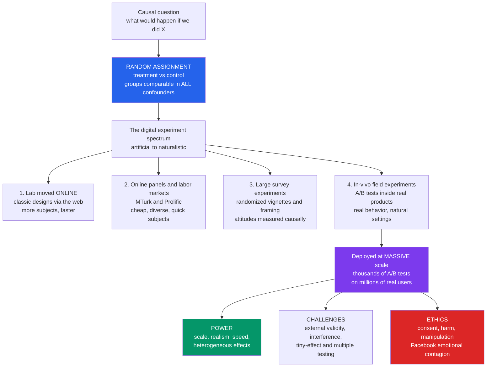

# 🧪 Online Experiments and Digital Field Experiments

> [!abstract] TL;DR
> Digital technology has **revolutionized experimentation** in social science, deploying the causal **gold standard — randomization** — at a scale and realism its founders could scarcely have imagined. Random assignment to **treatment vs control** makes the groups comparable in *all* confounders, observed and unobserved, so the difference in outcomes *is* the causal effect: experiments answer **"what would happen if we did X?"** directly. The digital era stretches this across a **spectrum** — classic lab studies moved online, cheap diverse **online panels** (Amazon Mechanical Turk, Prolific), large **survey experiments** with randomized vignettes, and, most powerfully, **in-vivo field experiments** (**A/B tests**) embedded in real products. Tech platforms (Google, Meta, Amazon, Netflix, Microsoft) run **thousands of A/B tests continuously on millions of real users** — the largest experimental apparatus in history, occasionally repurposed for research (the 61-million-person **Facebook voter-mobilization** study). The power is immense — **scale** makes tiny effects detectable, **realism** captures real behavior, plus speed and **heterogeneous-effect** estimation — but so are the perils: **external validity** (do platform results generalize?), **interference / network spillovers** (the SUTVA violation that plagues social experiments), **statistical-vs-practical significance** and multiple-testing traps of huge samples, and acute **ethics** of experimenting on people without meaningful consent (the **Facebook emotional-contagion** controversy). A defining, powerful, and contested capability of computational social science.

---

## Intuition

**Analogy:** Every single time you use Google, Facebook, or Amazon, you are almost certainly an unwitting subject in several experiments *at once*. The exact shade of blue on a button, the order of the items in your feed, the wording of a notification, the position of the "buy" prompt — each is being **randomly varied across millions of users** to see which version changes your behavior. You never signed up. You never noticed. But you are in the treatment group for some tests and the control group for others, and the difference between your clicks and a stranger's is another data point in a machine that is quietly learning what makes people act.

Now hold that image against the way social science was done for a century. To study behavior, a researcher recruited a few dozen undergraduates into a windowless lab, paid them in course credit, and had them perform some artificial task while a stopwatch ran. What once required **recruiting dozens of students into a room** can now be run on **millions of real people, in their natural environment, at the click of a button**. That is the experimental revolution of computational social science: the cleanest tool we have for causal inference — **randomization** — deployed at a scale, speed, and realism the founders of the field could scarcely have dreamed of. And because that same power lets a company or a researcher *manipulate* the behavior of millions without their knowledge, it raises ethical questions just as vast as its promise.

---

## How It Works

### Why experiments: the logic of randomization

The whole reason experiments are prized is a single, almost magical, property of **random assignment**. Take a large pool of people and flip a coin for each: heads goes to **treatment** (gets the new feature, the message, the nudge), tails goes to **control** (business as usual). Because the coin is blind to *everything* about each person — their age, income, mood, past behavior, and every unmeasured trait — the two groups end up, on average, **identical in all confounders, observed and unobserved**. They are *exchangeable*. So when the outcome differs between them, there is only one thing left that could have caused it: the treatment. The difference in outcomes *is* the **causal effect**.

This is what makes an experiment the **gold standard** and the cleanest form of causal inference. Observational studies must *argue* that they have controlled for confounders and always fear the lurking variable they forgot; an experiment **designs the confounders away**. It answers the counterfactual question directly — *what would happen if we did X?* — rather than inferring it from correlations. (The observational alternatives, and the assumptions they need to approximate this ideal, are the subject of the planned sibling *Causal_Inference_from_Observational_and_Digital_Data*.) The digital era did not change this logic; it changed the **scale and realism** at which the logic can be applied.

### The spectrum of digital experiments

Digital experiments are not one thing but a **ladder from artificial to naturalistic**, and matching the rung to the question is half the craft:

1. **Lab experiments moved online.** Classic designs — economic games, framing manipulations, reaction-time tasks — run through the browser. More subjects, faster turnaround, lower cost, but still somewhat artificial tasks.
2. **Online labor markets and panels.** **Amazon Mechanical Turk (MTurk)** and **Prolific** let researchers recruit thousands of diverse subjects cheaply and within hours, *democratizing* experimentation. The caveat is the **subject pool**: MTurk workers are not the general population, and "professional" participants and inattention are real threats.
3. **Large-scale survey experiments.** Randomized treatments — **vignettes, framing, information provision, conjoint choices** — are embedded inside online surveys to measure **attitudes and opinion causally**. Did the framing change stated support? Did the information move beliefs? Cheap, scalable, and the workhorse of modern political science.
4. **Field experiments in vivo.** **A/B tests** embedded directly in a real product or service. This is the most **realistic** rung: real users, real stakes, real behavior in a natural setting, with no awareness that a study is happening. What you lose in control you gain in **ecological validity**.

### A/B testing at industrial scale

At the naturalistic end, experimentation has become **infrastructure**. Google, Meta, Amazon, Netflix, and Microsoft run **thousands of A/B tests continuously**, randomly varying features, layouts, ranking algorithms, prices, and messages across **millions of users** and measuring causal effects on clicks, engagement, purchases, and retention. "Everyone is in experiments all the time" is a literal description of the modern web — collectively **the largest experimental apparatus in human history**.

The same machinery serves two masters. Its day job is **product optimization**. But when repurposed or opened to researchers, it becomes an instrument for **social science**: the canonical example is **Bond et al. (2012)**, a get-out-the-vote experiment on **61 million** Facebook users during the 2010 US election that measured, causally, how a social "I voted" message and friends' faces increased real-world turnout. One button, sixty-one million randomized subjects, a measurable effect on a real election.

### The power, and the challenges



**The power** of digital experiments comes from four levers. **Scale** — millions of subjects shrink the standard error toward zero, so *tiny* effects become detectable with precise estimates (a 0.1% lift in a checkout flow is worth millions and is now measurable). **Realism / ecological validity** — real behavior in a natural setting, not a contrived lab task. **Speed and low cost** — spin up, run, and iterate in days. **Heterogeneous effects** — enough data to see *who* the effect helps or hurts, enabling personalization and connecting experiments to machine learning (the theme of the planned sibling *Prediction_and_Machine_Learning_in_Social_Science*). Together they let researchers test things impossible in a lab: real social networks, real money, real elections.

**The challenges** are equally deep. **(1) External validity** — do results from *this* platform, population, and moment **generalize** beyond it? The MTurk pool and the Facebook user base are specific and non-representative, the same non-representativeness that haunts all found data (see [[Big_Data_and_the_Social_Sciences]]). **(2) Interference / network spillovers** — the **SUTVA** ("stable unit treatment value") assumption says one unit's treatment must not affect another's outcome. On a social network this is routinely **false**: treat some users and their untreated friends are affected too (they see the new feature, the shared post), so treatment and control are no longer independent and the naive estimate is **biased** (Aronow & Samii; Ugander et al.). Fixing it demands **cluster-randomized** or **graph-based** designs. **(3) Tiny effects and multiple testing** — huge `n` makes *trivial* effects "statistically significant," so **statistical significance is not practical significance**; and running thousands of tests (or **peeking** at a running test and stopping when it crosses the line) inflates **false positives**. **(4) Heterogeneity and moving targets** — platforms and populations change under you. **(5)** The unavoidable **artificial-vs-natural tradeoff** that the spectrum embodies.

### The ethics of experimenting on millions

Online experiments carry an acute ethical charge because they often lack meaningful **informed consent** — users do not know they are subjects; the "agreement" is buried in a terms-of-service nobody reads. They can **cause harm or manipulate**: the **Facebook emotional-contagion** study (Kramer et al., 2014) altered nearly 700,000 users' news feeds to show more positive or negative posts and measured the effect on their *own* posting mood — deliberately manipulating emotions without consent, igniting a firestorm. The voter-turnout experiment raised the specter of a platform quietly **influencing an election**. These cases expose the core tension: the very power to change behavior at scale, wielded for corporate or research ends on people who never agreed, is precisely what demands scrutiny — consent, harm, and manipulation, all at scale (see [[Ethics_and_Privacy_in_Computational_Social_Science]] and [[Research_Ethics_and_Human_Subjects]]).

### Doing it right: design and analysis

Credible large-scale experimentation is a discipline. **Proper randomization** and up-front **power analysis** (how large must `n` be to detect the smallest effect you care about?). **Pre-registration** — committing to hypotheses and analysis *before* seeing the data, to prevent p-hacking and the file-drawer problem (a lesson hard-won in the [[The_Replication_Crisis_and_Critiques_of_Behavioral_Economics|replication crisis]]). **Handling interference** with cluster- or graph-randomized designs. **Correcting for multiple testing** and using **sequential / always-valid** methods instead of naive peeking. Estimating **heterogeneous effects** honestly rather than hunting subgroups post hoc. And thinking through **external validity and ethics** before, not after. Rigor at scale is what separates a trustworthy causal claim from an expensive coincidence.

---

## Key Concepts

### Secondary (plain language)

- **Experiment.** To find out if something *causes* a change, split people at random into two groups — one gets the new thing (**treatment**), one doesn't (**control**) — and compare. Because the coin flip decides, the groups are alike in every other way, so any difference must be *caused* by the new thing.
- **A/B test.** The web version of this: show design **A** to half the users and design **B** to the other half, and see which gets more clicks. Companies run thousands of these every day — you are in them constantly without knowing.
- **Why it is so powerful now.** In the old days you tested a few dozen students in a lab. Online, you can test **millions of real people doing real things** — bigger, faster, cheaper, and truer to life.
- **The catches.** The people on one website are not "everyone," so a result there may not hold elsewhere. On a social network, treating your friends can change *you* even if you were in the "control" group. And experimenting on people who never agreed can be an **ethical minefield**.

### Undergraduate (some rigor)

- **The causal logic.** Random assignment makes treatment and control **exchangeable** in expectation, so `E[Y | treated] − E[Y | control]` is an unbiased estimate of the **average treatment effect (ATE)**. This is why randomization is the gold standard: it neutralizes confounders you never even measured.
- **The spectrum.** Lab-online → online panels (MTurk/Prolific) → survey experiments (vignette / framing / information / conjoint) → in-vivo field experiments (A/B tests). Trades **control** for **ecological validity** as you descend.
- **Power and precision.** The standard error of a proportion falls like `1/sqrt(n)`. Massive `n` yields razor-thin confidence intervals — the **minimum detectable effect** shrinks — so tiny effects become significant. The flip side: **statistical significance ≠ practical significance** (see [[Statistical_Inference]]).
- **SUTVA and interference.** The standard estimator assumes **no interference between units**. Social settings violate this: a control user's outcome depends on how many neighbors were treated, biasing the naive difference-in-means. Requires cluster or ego-network randomization.
- **Multiple testing and peeking.** Run enough tests and some cross `p < 0.05` by chance; check a live test repeatedly and stop at the first significant reading (**optional stopping**) and false positives explode. Fixes: corrections, and **sequential / always-valid** inference.
- **External validity.** A clean **internal** causal estimate on a specific platform/population may not **generalize** — the non-representativeness problem in experimental clothing.

### Graduate (advanced)

- **Potential outcomes and estimands.** Under Rubin's framework, unit `i` has potential outcomes `Y_i(1), Y_i(0)`; the ATE is `E[Y_i(1) − Y_i(0)]`. Under interference this collapses because `Y_i` depends on the *whole* treatment vector `z`, i.e. `Y_i(z)`. One then targets **exposure-mapping** estimands (direct effect, spillover effect, global/total effect) rather than a single ATE.
- **Interference estimators.** Under Bernoulli assignment with spillover, the naive contrast identifies (roughly) the **direct** effect but *misses* the spillover, so it is biased for the **global rollout** effect. **Horvitz–Thompson / inverse-probability** estimators under an exposure model, **cluster-randomized** designs, **graph cluster randomization** (Ugander et al.), and network-exposure estimators (Aronow & Samii) recover total or spillover effects, at the cost of statistical power (effective `n` is the number of clusters).
- **Heterogeneous treatment effects.** With enough data, estimate the **conditional average treatment effect (CATE)** `τ(x) = E[Y(1) − Y(0) | X = x]` via causal forests, meta-learners, or double/debiased ML — the bridge to personalization and *Prediction_and_Machine_Learning_in_Social_Science*.
- **Sequential inference.** Fixed-sample p-values are invalid under continuous monitoring. **Always-valid p-values**, mixture sequential probability ratio tests, and **alpha-spending** (group sequential) preserve Type-I error under peeking — now standard in commercial experimentation platforms.
- **The winner's curse and Type-M/S errors.** When power is low, statistically significant effects are systematically **overestimated in magnitude** (Type-M) and sometimes **wrong in sign** (Type-S) — a hidden hazard of chasing small effects even with corrections.
- **Ethics as a design constraint.** The Common Rule, IRB oversight, and the Menlo Report frame consent, minimal risk, and beneficence; the emotional-contagion and voter-mobilization cases show why "the data already exist / the feature was going to ship anyway" does **not** dissolve the consent question when the *purpose* is generalizable knowledge or behavior change at scale.

---

## Python Demo

We build the two things every practitioner must understand: **(a)** a large randomized A/B test, its effect estimate, confidence interval, statistical significance, and how huge `n` makes even *practically trivial* effects "significant"; and **(b)** the **interference / network-spillover** pitfall — the SUTVA violation in which treating some users on a social network contaminates their untreated neighbors, so the naive difference-in-means silently under-measures the true rollout effect. Uses only `numpy` and `matplotlib`.

```python
import numpy as np
import matplotlib
matplotlib.use("Agg")
import matplotlib.pyplot as plt
from math import erf, sqrt

rng = np.random.default_rng(42)

def two_sided_p(z):
    """Two-sided p-value from a z-statistic via the normal CDF (no scipy)."""
    return 2.0 * (1.0 - 0.5 * (1.0 + erf(abs(z) / sqrt(2.0))))

# =====================================================================
# PART (a): A LARGE RANDOMIZED A/B TEST.
#   Users are split at random into CONTROL (old design) and TREATMENT
#   (new feature). We measure a binary CONVERSION (clicked / bought /
#   returned). Randomization makes the groups comparable in ALL
#   confounders, so the DIFFERENCE in conversion rates is the CAUSAL
#   effect of the feature.
# =====================================================================
p_control = 0.100                 # true control conversion rate
lift      = 0.004                 # true effect: +0.4 percentage points
p_treat   = p_control + lift
N         = 100_000               # users PER ARM

conv_c = rng.binomial(1, p_control, N)   # 0/1 outcomes
conv_t = rng.binomial(1, p_treat,   N)

phat_c, phat_t = conv_c.mean(), conv_t.mean()
effect = phat_t - phat_c
se_c   = sqrt(phat_c * (1 - phat_c) / N)
se_t   = sqrt(phat_t * (1 - phat_t) / N)
se_eff = sqrt(se_c**2 + se_t**2)          # SE of the difference
z      = effect / se_eff
pval   = two_sided_p(z)
ci     = (effect - 1.96 * se_eff, effect + 1.96 * se_eff)

print("=" * 64)
print("PART (a)  LARGE-SCALE A/B TEST")
print("=" * 64)
print(f"control rate    = {phat_c*100:6.3f} %")
print(f"treatment rate  = {phat_t*100:6.3f} %")
print(f"effect estimate = {effect*100:+.3f} pp   "
      f"95% CI [{ci[0]*100:+.3f}, {ci[1]*100:+.3f}] pp")
print(f"z = {z:5.2f}   p = {pval:.2e}   "
      f"-> {'SIGNIFICANT' if pval < 0.05 else 'not significant'}")

# Precision vs sample size: the 95% CI half-width (margin) shrinks like
# 1/sqrt(n).  A truly TINY effect (0.05 pp) is invisible at small n but
# becomes 'significant' once n is huge -> statistical != practical.
ns      = np.logspace(2, 7.3, 60)                       # 100 ... 20,000,000
margin  = 1.96 * np.sqrt(2 * p_control * (1 - p_control) / ns)
tiny    = 0.0005                                        # 0.05 pp: trivial
detect_n = ns[np.argmax(margin < tiny)]                # first n that detects it

# =====================================================================
# PART (b): INTERFERENCE / NETWORK SPILLOVER (a SUTVA violation).
#   On a social network, treating some users spills over to their
#   UNTREATED neighbors (they see a friend's new feature/shared post).
#   So a control user's outcome depends on how many of ITS neighbors
#   were treated -> units are NOT independent, and the naive
#   difference-in-means no longer equals the effect of a full rollout.
# =====================================================================
M       = 3000
avg_deg = 12
p_edge  = avg_deg / (M - 1)
upper   = np.triu(rng.random((M, M)) < p_edge, 1)       # Erdos-Renyi graph
A       = (upper | upper.T).astype(float)               # symmetric adjacency
deg     = A.sum(1)

T = (rng.random(M) < 0.5)                               # Bernoulli(0.5) assign
treated_nbr_frac = (A @ T) / np.maximum(deg, 1)         # exposure of each node

base, direct, spill = 0.10, 0.04, 0.06                  # baseline / direct / spillover
noise = rng.normal(0, 0.02, M)
# Realized outcome depends on OWN treatment AND neighbors' treatment:
y = base + direct * T + spill * treated_nbr_frac + noise

naive = y[T].mean() - y[~T].mean()                      # difference-in-means

# TRUE global rollout effect: everyone treated (exposure=1) minus no one (0)
global_effect = (base + direct * 1 + spill * 1.0) - (base + direct * 0 + spill * 0.0)

print("\n" + "=" * 64)
print("PART (b)  INTERFERENCE / NETWORK SPILLOVER")
print("=" * 64)
print(f"naive difference-in-means    = {naive*100:+.2f} pp   (what the A/B test reports)")
print(f"true global rollout effect   = {global_effect*100:+.2f} pp   (direct + spillover)")
print(f"HIDDEN spillover bias        = {(global_effect - naive)*100:+.2f} pp   "
      f"(the A/B test silently misses this)")

# Control-group outcome vs fraction of TREATED neighbors: the contamination.
ctrl_frac = treated_nbr_frac[~T]
ctrl_y    = y[~T]
bins      = np.linspace(0, 1, 9)
idx       = np.digitize(ctrl_frac, bins) - 1
bx, by    = [], []
for b in range(len(bins) - 1):
    m = idx == b
    if m.sum() > 5:
        bx.append(0.5 * (bins[b] + bins[b + 1]))
        by.append(ctrl_y[m].mean())

# ------------------------------- FIGURE --------------------------------
fig, ax = plt.subplots(2, 2, figsize=(13.5, 10))
fig.suptitle("Online experiments: precise causal effects at scale — and the "
             "pitfalls that mislead naive analysis", fontsize=13, fontweight="bold")
c_ctrl, c_treat = "#6b7280", "#2563eb"

# Panel A: the A/B test result with 95% CIs
a = ax[0, 0]
a.bar(["control\n(old design)", "treatment\n(new feature)"],
      [phat_c * 100, phat_t * 100],
      yerr=[1.96 * se_c * 100, 1.96 * se_t * 100],
      capsize=8, color=[c_ctrl, c_treat], edgecolor="black")
a.set_title(f"(a) A/B test result\neffect = {effect*100:+.3f} pp, "
            f"p = {pval:.1e} (SIGNIFICANT)")
a.set_ylabel("conversion rate (%)")
a.set_ylim(9.6, 10.8)
a.grid(alpha=0.25, axis="y")

# Panel B: precision vs n -> tiny effects become 'significant' at huge n
b = ax[0, 1]
b.loglog(ns, margin * 100, "-", color="#7c3aed", lw=2,
         label="95% CI half-width (margin)")
b.axhline(tiny * 100, ls="--", color="#dc2626",
          label=f"a TRIVIAL true effect = {tiny*100:.2f} pp")
b.axvline(detect_n, ls=":", color="black")
b.set_title("(b) Scale buys precision\nhuge n makes even TRIVIAL effects "
            "'significant'")
b.set_xlabel("sample size per arm (n)")
b.set_ylabel("margin of error (pp)")
b.annotate("detectable\nbeyond here", xy=(detect_n, tiny * 100),
           xytext=(detect_n * 2, tiny * 100 * 6), fontsize=8,
           arrowprops=dict(arrowstyle="->"))
b.legend(fontsize=8, loc="lower left")
b.grid(True, which="both", alpha=0.25)

# Panel C: interference bias -> naive estimate misses the spillover
c = ax[1, 0]
c.bar(["naive\ndiff-in-means", "true global\nrollout effect"],
      [naive * 100, global_effect * 100],
      color=["#f59e0b", "#059669"], edgecolor="black")
c.set_title("(c) INTERFERENCE biases the naive estimate\nSUTVA violation: "
            "spillover is invisible to A/B")
c.set_ylabel("treatment effect (pp)")
c.set_ylim(0, global_effect * 100 * 1.25)
c.grid(alpha=0.25, axis="y")
c.annotate("", xy=(1, global_effect * 100), xytext=(1, naive * 100),
           arrowprops=dict(arrowstyle="<->", color="#dc2626", lw=2))
c.text(1.05, (naive + global_effect) * 50, "hidden\nspillover",
       color="#dc2626", fontsize=9, va="center")

# Panel D: the contamination -> control outcomes rise with treated neighbors
d = ax[1, 1]
d.plot(bx, np.array(by) * 100, "-o", color=c_ctrl, ms=5)
d.set_title("(d) Why: CONTROL users are contaminated\ntheir outcome rises with "
            "treated-neighbor share")
d.set_xlabel("fraction of a control user's neighbors that were treated")
d.set_ylabel("control-group conversion (%)")
d.grid(alpha=0.25)

plt.tight_layout(rect=[0, 0, 1, 0.95])
plt.savefig("online_experiments_ab_and_interference.png", dpi=110,
            bbox_inches="tight")
plt.show()
```

**What the demo shows:**

- **Panel (a) — the A/B test.** Two randomized arms, a +0.4 percentage-point lift, tight 95% confidence intervals, and a vanishingly small `p`-value: with 100,000 users per arm the effect is unambiguously **significant**. Randomization did the causal work; scale did the precision.
- **Panel (b) — scale buys precision, and a trap.** The margin of error falls like `1/sqrt(n)`. Past the dotted line, a **practically trivial** 0.05 pp effect crosses into "statistical significance." At platform scale, *everything* becomes significant — which is exactly why **statistical significance is not practical significance**, and why huge samples demand effect-size thinking, not `p`-value worship.
- **Panel (c) — interference bites.** The **naive difference-in-means** (orange) recovers only the *direct* effect and **silently misses the spillover**, badly under-stating the **true global rollout effect** (green). Decide on a full launch using the naive number and you will systematically mis-value the feature — the **SUTVA violation** in one bar chart.
- **Panel (d) — the mechanism.** Control users are not clean: their conversion **rises with the fraction of their neighbors who were treated**. The "untreated" group has been *contaminated* by the treatment leaking across the network — precisely why independent-unit statistics break, and why social experiments need **cluster or graph-based randomization**.

---

## Real-World Applications

> **Product and platform optimization.** The tech-industry backbone. Google's "41 shades of blue," Netflix artwork and recommendation tests, Amazon checkout flows, Microsoft's ExP platform — thousands of concurrent A/B tests turning design decisions into measured causal effects on engagement, retention, and revenue. Experimentation is treated as **infrastructure**, not a one-off study.

> **Social-science field experiments.** The **Bond et al. (2012)** 61-million-person Facebook get-out-the-vote study measured real turnout effects of social mobilization messages. Broader audit and field experiments test **discrimination** (résumé-callback studies), **cooperation**, and **health behavior** — real stakes, real settings, causal identification.

> **Survey experiments on attitudes.** Randomized **vignettes, framing, and information-provision** experiments (often on MTurk, Prolific, or platform panels) measure how wording or facts causally shift opinion — the workhorse of modern political science and communication research.

> **Network experiments on influence.** Randomizing *exposure* or *ties* is the cleanest way to test **social influence** versus mere homophily — the identification problem at the heart of [[Homophily_Selection_and_Influence]]. Product-adoption and information-diffusion trials on [[Online_Social_Networks_and_Platforms]] estimate contagion causally, where observation alone is confounded.

> **Policy evaluation and nudges.** Governments and NGOs run **randomized controlled trials** of interventions — development programs, tax reminders, savings defaults — and digital **nudges** at scale, connecting directly to [[Nudges_and_Choice_Architecture]] and [[Behavioral_Public_Policy_and_Libertarian_Paternalism]].

> **Misinformation interventions.** Large online experiments test **corrections, accuracy prompts, and "inoculation"** against false content — feeding the planned sibling *Misinformation_Polarization_and_the_Online_Public_Sphere* — measuring which interventions causally reduce belief in or sharing of misinformation.

---

## Common Pitfalls

- **Confusing statistical with practical significance.** At platform scale, `p < 0.05` is nearly automatic; a "highly significant" 0.02% lift may be worthless. Always report and reason about **effect size and confidence interval**, not just the star next to the `p`-value.
- **Ignoring interference (SUTVA violation).** Assuming units are independent when treatment spills across a social network. The naive difference-in-means is **biased** for the rollout effect. Use **cluster-randomized** or **graph-cluster** designs and exposure-mapping estimators.
- **Peeking and optional stopping.** Watching a live test and stopping the moment it crosses significance massively inflates false positives. Use **pre-committed sample sizes** or **sequential / always-valid** methods designed for continuous monitoring.
- **Multiple testing without correction.** Running thousands of variants or metrics guarantees spurious "winners." Apply corrections (Bonferroni, Benjamini–Hochberg) or hierarchical modeling; pre-specify the primary metric.
- **Assuming external validity.** A clean effect on MTurk or one platform's users need not generalize to other populations, contexts, or moments. Internal validity is not external validity — the non-representativeness of found data in experimental form (see [[Big_Data_and_the_Social_Sciences]]).
- **P-hacking and post-hoc subgroups.** Hunting for a significant subgroup after the fact manufactures false discoveries. **Pre-register** hypotheses and analyses; treat exploratory heterogeneity as hypothesis-generating, not confirmatory.
- **The winner's curse.** Underpowered tests overstate the magnitude of the effects they do detect (Type-M) and can even get the sign wrong (Type-S). Power up; distrust large effects from small samples.
- **Skipping the ethics.** Treating "the feature was shipping anyway" or "it's in the ToS" as consent. Manipulation and harm at scale (the **emotional-contagion** case) demand genuine ethical review — see [[Research_Ethics_and_Human_Subjects]] and [[Informed_Consent_and_Autonomy]].

---

## Related Concepts

**Within Computational Social Science (this vault):**

- [[Computational_Social_Science_Overview]] — the parent field; large-scale experimentation is one of its four defining capabilities (alongside big data, simulation, and text-as-data).
- [[Big_Data_and_the_Social_Sciences]] — the non-representativeness that reappears here as the **external-validity** problem; experiments are internally valid but drawn from specific platform populations.
- [[Homophily_Selection_and_Influence]] — experiments are the cleanest way to break the **selection-vs-influence** confound by randomizing exposure; this note is the method that identifies influence causally.
- [[Online_Social_Networks_and_Platforms]] — the substrate on which in-vivo A/B tests run and where **interference / spillover** is unavoidable.
- [[Contagion_and_Diffusion_in_Social_Networks]] — network experiments measure contagion causally, where the diffusion patterns alone are confounded.
- [[Social_Network_Analysis_Foundations]] — supplies the graph structure that both enables spillover and motivates cluster/graph-based randomization.
- [[Ethics_and_Privacy_in_Computational_Social_Science]] — the vault's home for consent, harm, and manipulation, dramatized by the emotional-contagion and voter-turnout controversies.
- [[Digital_Traces_and_Found_Data]] — the observational alternative; experiments are the interventional complement that traces alone cannot deliver.
- [[Measurement_and_Validity_in_Digital_Data]] — an experiment is only as good as the outcome metric it moves; construct validity still bites.

**Statistics and methods (Mathematics):**

- [[Statistical_Inference]] — hypothesis testing, confidence intervals, power, and the significance machinery the demo exercises.
- [[Probability_Theory]] — sampling variance and the `1/sqrt(n)` law behind experimental precision.
- [[Regression_and_Correlation]] — the workhorse for covariate adjustment, CUPED variance reduction, and heterogeneous-effect models.
- [[Bayesian_Statistics]] — Bayesian A/B testing and the sequential/always-valid inference that tames peeking.

**Applications and adjacent fields:**

- [[AB_Testing_for_ML]] — the engineering practice of online experimentation for machine-learning systems.
- [[Nudges_and_Choice_Architecture]] — the interventions most often evaluated by online and field experiments.
- [[Behavioral_Public_Policy_and_Libertarian_Paternalism]] — the policy program that RCTs and digital nudges serve.
- [[The_Replication_Crisis_and_Critiques_of_Behavioral_Economics]] — why pre-registration, power, and honest reporting became non-negotiable.
- [[Behavioral_Economics_and_Machine_Learning]] — heterogeneous-effect estimation and personalization, the ML bridge from experiments.
- [[Research_Ethics_and_Human_Subjects]] — the IRB / Common Rule framework strained by online experiments.
- [[Informed_Consent_and_Autonomy]] — the consent principle that terms-of-service "agreement" fails to satisfy.
- [[Privacy_Surveillance_and_Data_Ethics]] — experimenting on behavioral data as a data-ethics problem.
- [[Sociological_Research_Methods]] — the broader experimental and quasi-experimental toolkit this note extends to the digital scale.

**Planned siblings in this section (not yet written):** *Causal_Inference_from_Observational_and_Digital_Data* (the observational counterpart when randomization is impossible), *Prediction_and_Machine_Learning_in_Social_Science* (heterogeneous effects and personalization), and *Misinformation_Polarization_and_the_Online_Public_Sphere* (a flagship application of online experiments).

---

## Review Questions

### Secondary

1. Explain, using the "shade of blue on a button" example, what an **A/B test** is and why splitting users **at random** lets a company conclude that the new design *caused* more clicks (rather than just being correlated with them).
2. Give one advantage and one worry of testing a new feature on **a million real users of an app** instead of **fifty students in a psychology lab**.
3. Facebook once changed some users' feeds to be more positive or negative to study their moods, without telling them. In your own words, why did people find this troubling? What is missing that a normal research study would have?

### Undergraduate

1. Define the **average treatment effect** and explain why random assignment identifies it without needing to measure confounders. Then explain, using the demo, why a huge sample size can make a **practically meaningless** effect **statistically significant** — and what you should report instead of just a `p`-value.
2. State the **SUTVA / no-interference** assumption. On a social network, describe a concrete mechanism by which it is violated, and explain why the naive difference-in-means then **under-estimates** the effect of rolling the treatment out to everyone. What design would fix it?
3. Place the four rungs of the **digital experiment spectrum** (lab-online, panels, survey experiments, in-vivo field experiments) on an axis from *artificial* to *naturalistic*, and give one research question best suited to each. What is traded off as you move down the ladder?

### Graduate

1. Under interference, the single ATE dissolves into multiple estimands. Using potential outcomes `Y_i(z)`, define the **direct**, **spillover**, and **global** effects, show why a Bernoulli-randomized difference-in-means is biased for the global effect, and describe how **graph-cluster randomization** (Ugander et al.) or a Horvitz–Thompson network-exposure estimator (Aronow & Samii) recovers it — and what statistical price you pay.
2. A product team continuously monitors a running A/B test and ships the variant the moment `p < 0.05`. Explain precisely why this inflates the false-positive rate, and compare **alpha-spending (group-sequential)** methods with **always-valid p-values** as remedies. How does this connect to the multiple-testing problem across thousands of concurrent experiments?
3. The Facebook emotional-contagion study was internally valid, ethically approved by the company, and arguably within its terms of service — yet drew intense criticism. Construct the ethical argument on both sides (consent, harm, beneficence, the "would-have-happened-anyway" defense) and state the conditions under which you believe a large-scale platform experiment on unconsenting users is, and is not, justifiable for generalizable research.

---

## Sources

- [Salganik, M. J. (2018). *Bit by Bit: Social Research in the Digital Age*, Chapter 4: Running Experiments. Princeton University Press](https://www.bitbybitbook.com/en/1st-ed/running-experiments/)
- [Bond, R. M., Fariss, C. J., Jones, J. J., et al. (2012). "A 61-Million-Person Experiment in Social Influence and Political Mobilization." *Nature* 489, 295–298](https://doi.org/10.1038/nature11421)
- [Kramer, A. D. I., Guillory, J. E., & Hancock, J. T. (2014). "Experimental Evidence of Massive-Scale Emotional Contagion through Social Networks." *PNAS* 111(24), 8788–8790](https://doi.org/10.1073/pnas.1320040111)
- [Kohavi, R., Tang, D., & Xu, Y. (2020). *Trustworthy Online Controlled Experiments: A Practical Guide to A/B Testing*. Cambridge University Press](https://experimentguide.com/)
- [Aronow, P. M., & Samii, C. (2017). "Estimating Average Causal Effects under General Interference, with Application to a Social Network Experiment." *Annals of Applied Statistics* 11(4), 1912–1947](https://doi.org/10.1214/16-AOAS1005)
- [Ugander, J., Karrer, B., Backstrom, L., & Kleinberg, J. (2013). "Graph Cluster Randomization: Network Exposure to Multiple Universes." *KDD 2013*](https://doi.org/10.1145/2487575.2487695)

---

#computational-social-science #online-experiments #ab-testing #field-experiments #causal-inference
