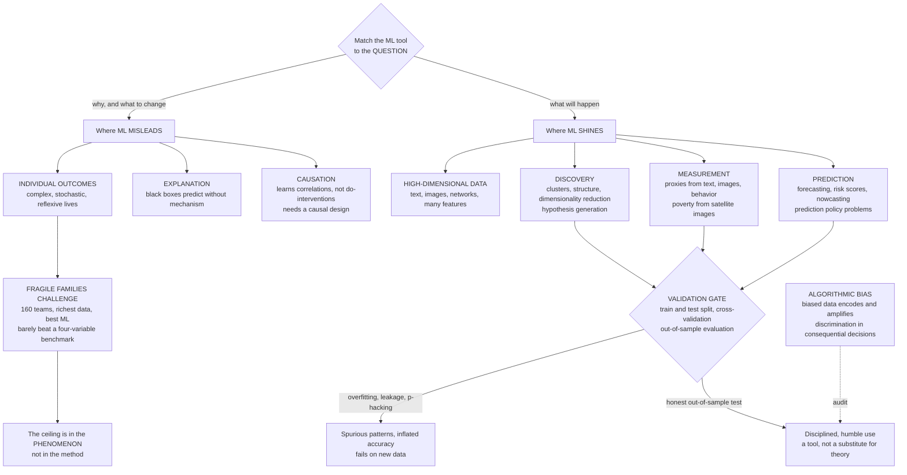

# 🔮 Prediction and Machine Learning in Social Science

> [!abstract] TL;DR
> **Machine learning** gives computational social science genuinely powerful new capabilities — but its value depends entirely on **matching the tool to the question**. ML is *excellent* at three things: **PREDICTION** where forecasting is the goal ("prediction policy problems" — bail decisions, medical triage, nowcasting unemployment or disease from digital traces); **MEASUREMENT**, turning unstructured text, images, and behavior into social variables (sentiment from tweets, poverty from satellite images); and **pattern DISCOVERY** in high-dimensional data (clusters, structure, dimensionality reduction) where classical statistics struggle. But ML by itself is *not* good at three other things: it does **not** establish **CAUSATION** (high predictive accuracy is not knowing what to change — it learns correlations, and answering "what if we intervene?" requires a causal design, not a better fit); it does **not** provide **EXPLANATION** (deep models are black boxes that predict without revealing mechanism — the prediction-versus-explanation distinction); and, strikingly, it often **cannot predict complex individual social outcomes at all**. The landmark evidence is the **Fragile Families Challenge** (Salganik et al., 2020): 160 teams, the richest longitudinal dataset ever assembled (thousands of variables on thousands of children over fifteen years), and the best ML methods available, could **barely beat a simple four-variable benchmark** at predicting life outcomes like GPA and eviction — and predicted them **poorly in absolute terms**. The ceiling on predictability lay in the **phenomenon** — social systems are complex, stochastic, and reflexive — **not in the methods**. Add the non-negotiable discipline of **validation against overfitting** (train and test splits, cross-validation, out-of-sample evaluation) and vigilance against **encoded algorithmic bias**, and the mature view emerges: ML is a **powerful tool, not a substitute for social-science thinking** — one that must be matched to the question, rigorously validated, audited for fairness, and never over-claimed.

---

## Intuition

**Analogy — the contest that humbled the machines.** In 2017, hundreds of research teams were given something no social scientist had ever had: the richest picture of human lives ever assembled — thousands of variables tracking thousands of children from birth, through their families, schools, neighborhoods, and health — plus the most powerful machine-learning tools money could buy. Their task sounded almost easy for modern AI: *predict how these kids' lives would turn out* — their grade-point average, whether their family would be evicted, whether they would face material hardship. The same class of algorithms that beats grandmasters at chess and predicts, to the click, which advertisement you will tap. The result was humbling. Even the **winning** models predicted life outcomes barely better than a coin-flip-plus-a-few-basics — and **no better than a simple four-variable benchmark** a first-year student could build in an afternoon. Machine learning can crush humans at Go and forecast your next purchase, but predicting the **arc of a single human life** defeated everyone.

This is the paradox at the heart of computational social science: **unprecedented data and prediction power, yet the deepest social questions resist forecasting**. The lesson is not that ML is useless for society — it is transformative for the *right* questions. The lesson is that its power is **shaped like a specific tool**, sharp for some cuts and useless for others. It excels at forecasting *aggregate* patterns, at *measuring* things we could never measure before, and at *discovering* structure in oceans of text and images. It fails when we ask it to reveal **causes**, to **explain** mechanisms, or to foretell the **unforecastable** trajectory of an individual life. Knowing the difference — and staying honest about it through validation and fairness audits — is what separates disciplined computational social science from over-claiming with a black box.

---

## How It Works

Machine learning is the study of algorithms that **learn patterns from data** to make predictions, without being explicitly programmed with the rules. In computational social science it arrives on a wave of enthusiasm — supervised learning, ensembles, and deep learning are powerful, and "found" digital data is abundant (see [[Big_Data_and_the_Social_Sciences]] and [[Digital_Traces_and_Found_Data]]). The crucial, discipline-defining question is not *whether* to use ML but **where it helps and where it misleads** in the study of society — a question worked out by Molina and Garip ("Machine Learning for Sociology," 2019), Susan Athey ("Beyond prediction," 2017), and Kleinberg and colleagues ("Prediction Policy Problems," 2015). This note is the section-opener for *Prediction, Causality, Policy, and Frontiers*; it maps the terrain that the causal, experimental, and future notes then explore in depth.

### What ML is GOOD for in social science

Four appropriate, high-value uses, where ML genuinely advances the field:

1. **PREDICTION where prediction is the goal.** Some tasks are *intrinsically* about forecasting an outcome accurately, not about understanding it. Risk scores, nowcasting unemployment or influenza from search queries, forecasting which cases need intervention, targeting scarce resources — here the whole point is an accurate guess about the future, and ML's predictive machinery is exactly the right tool. Kleinberg et al. call these **"prediction policy problems,"** and they are where ML delivers the most unambiguous value (detailed below).
2. **MEASUREMENT — creating proxies from unstructured data.** This may be ML's single most transformative contribution to social science. Classifiers turn raw, unstructured signals into **social variables**: sentiment and topic from text (see [[Text_as_Data_in_Social_Science]] and [[Topic_Models_and_Document_Classification]]), **poverty from satellite images** (Jean et al., 2016, predicting local consumption from daytime and nighttime imagery), protest activity from photos, occupation from résumés, health from wearables. ML turns things we *could not measure at scale* into things we can — subject to the full discipline of [[Measurement_and_Validity_in_Digital_Data]], because a proxy is only as good as its validation.
3. **Pattern DISCOVERY and dimensionality reduction.** Unsupervised methods — clustering ([[KMeans]]), [[PCA]], topic models, embeddings — surface structure, clusters, and unexpected regularities in high-dimensional data. This is **exploratory and hypothesis-generating**: ML finds the pattern; theory and causal design must then explain and test it (the abductive loop of [[Computation_and_Social_Theory]]).
4. **Handling HIGH-DIMENSIONAL and complex data.** Text, images, networks, and datasets with thousands of features are where classical statistics buckle and ML thrives — flexible function approximation, regularization to tame the curse of dimensionality, and representations that make messy data tractable.

### What ML is NOT (by itself) good for

Three crucial limits, each a common and costly error when ignored:

1. **CAUSAL INFERENCE.** ML **predicts** but does not **identify causes**. A model can achieve superb accuracy through a *confounded proxy* — high `P(Y | X)` while telling you nothing about `P(Y | do(X))`, the effect of actually *intervening*. Using ML predictions as causal claims is a major error: to answer "what happens if we change X?" you need a **causal framework or design** (a randomized experiment, or an identification strategy) layered on top of the prediction machinery — the subject of the forthcoming sibling *Causal Inference from Observational and Digital Data*. Prediction finds correlations; causation requires structure.
2. **EXPLANATION and understanding.** ML models, especially deep ones, are frequently **black boxes** — they predict without revealing the *mechanism*. This is the **prediction-versus-explanation** distinction that anchors [[Computation_and_Social_Theory]]: high accuracy does not equal understanding, and interpretability tools ([[Explainable_AI]]) describe what a model *used*, not what *causes* the outcome in the world.
3. **Predicting complex individual social OUTCOMES.** Often — and this surprises newcomers — ML simply **cannot** forecast how an individual life will unfold, even with vast data (see the Fragile Families lesson below). The boundary is not a failure of engineering; it is a property of the social world.

### The Fragile Families lesson — a ceiling in the phenomenon

The **Fragile Families Challenge** (Salganik et al., *PNAS* 2020) is the field's most important humbling result. It was a **mass collaboration**: 160 teams were given the **Fragile Families and Child Wellbeing Study** — thousands of variables on thousands of children followed from birth over fifteen years — and asked to **predict six life outcomes** (child GPA, grit, material hardship, eviction, job training, and layoff) using any machine-learning method they liked. The stunning finding: even the **best** submissions predicted only **slightly** better than a simple **four-variable linear benchmark**, and predicted the outcomes **poorly in absolute terms** (low out-of-sample R-squared). No amount of features, model complexity, or ML sophistication broke through.

The profound implication: the **ceiling on predictability was in the phenomenon, not the method**. When hundreds of expert teams with the richest data and best tools all hit the same low wall, the limit is not their skill — it is the **irreducible unpredictability of complex human lives**. This reframes the goal of computational social science away from oracle-like individual point forecasts and toward mechanisms, distributions, and aggregate patterns.

### Why social outcomes are hard to predict

Social systems resist forecasting for structural reasons, not fixable ones:

- **Complexity** — many interacting causes, feedbacks, and nonlinearities (the theme of [[Complexity_Economics_and_Machine_Learning]] and [[Non_Equilibrium_and_Out_of_Equilibrium_Dynamics]]); small differences amplify.
- **Stochasticity** — genuine randomness and *luck* shape life trajectories; a chance meeting, an illness, a layoff.
- **Reflexivity** — predictions and knowledge **change behavior** (people react to forecasts and to being scored), so the target moves; physical systems do not read the forecast, social ones do.
- **Heterogeneity** — the same input means different things for different people in different contexts.
- **Unmeasured and unmeasurable factors** — motivation, relationships, contingent events that no dataset captures.

Duncan Watts (*Everything Is Obvious: Once You Know the Answer*) names the trap: hindsight manufactures an **illusion of predictability** — outcomes look obvious *after* the fact, so we overestimate how forecastable they were *before*. A key corollary: predicting **aggregate** patterns (turnout rates, disease waves, average trends) is sometimes very doable, while predicting **individual** outcomes (this person's GPA, this family's eviction) is often not. Humility about social prediction is a scientific finding, not a lack of nerve.

### Overfitting and validation — the methodological essentials

Because ML fits flexible models to data, it can **overfit** — memorizing noise and spurious patterns that vanish on new data, a danger that grows with many features and flexible models (the [[Bias_Variance_Tradeoff]]). ML in social science therefore *requires* rigorous **validation**: **train and test splits**, **cross-validation** ([[Cross_Validation]]), and honest **out-of-sample evaluation** — predicting on held-out or future data as the real test. Guard against **data leakage** ([[Data_Leakage]]) and use **regularization** ([[Regularization]]) to control complexity. The reproducibility perils here mirror **p-hacking** and the replication struggles documented in [[The_Replication_Crisis_and_Critiques_of_Behavioral_Economics]]: search a large enough space of features and models and you will find something that looks significant and fails to replicate. The discipline of *honest prediction* — reporting the out-of-sample number, not the training-set fantasy — is the entry ticket.

### Prediction policy problems — where ML prediction legitimately helps

Kleinberg, Ludwig, Mullainathan, and Obermeyer's **"Prediction Policy Problems"** offers a productive framing: some policy decisions are **fundamentally prediction problems, not causal ones**. Deciding whom to release on bail (predict re-offense), which patients to treat (predict who will benefit), which infrastructure to inspect (predict failure), which students need support (predict dropout) — in each, **accurate prediction directly improves the decision** *without needing a causal effect*. Their "umbrella" metaphor: to decide whether to bring an umbrella you need a good rain *forecast*, not the *causes* of rain. Distinguishing **prediction-policy** problems (where ML shines) from **causal-policy** problems (where you must know the effect of intervening) is one of the most useful clarifications the field has produced.

### Algorithmic bias and fairness — the ethical dimension

ML models trained on biased social data **encode and amplify** discrimination. Recidivism-prediction tools (the COMPAS controversy), hiring, lending, and predictive-policing systems can entrench racial and other injustice while wearing a veneer of objectivity — an "objective"-seeming algorithm can launder bias into consequential decisions about people. **Fairness, accountability, and transparency** are therefore non-negotiable when ML informs decisions about human beings (see [[AI_Bias_and_Fairness]], [[Algorithmic_Fairness_and_Bias]], and [[AI_Ethics_Overview]]). This is both a validity problem (the model measures the wrong thing) and a justice problem (real people are harmed).

### The mature view

Match the tool to the question, validate ruthlessly, audit for bias, and do not over-claim. ML is a **complement** to social-science thinking — increasingly even inside causal frameworks (double machine learning, causal forests use ML for flexible estimation *within* a causal design) — not a replacement for it.

### Flow / Architecture



---

## Key Concepts

### Secondary

- **Guessing the future is a special skill.** A computer that is amazing at predicting which video you will watch next can be *terrible* at predicting whether a child will do well in school. Being good at one kind of guess does not make you good at every kind.
- **The big contest that surprised everyone.** Scientists once gave hundreds of teams a huge amount of information about thousands of children and the best "smart" computer programs, and asked them to predict how the kids' lives would go. The programs did *badly* — barely better than a simple rule using just four facts. Some things about people's lives are just very hard to predict, no matter how much data you have.
- **Predicting is not the same as understanding.** A program might notice that kids who own more books get better grades, and predict grades from bookshelves. But that does not mean *buying books* causes good grades. To know what actually helps, you have to do more than guess.
- **Cheating on the test.** If you let a program peek at the answers while it studies, it looks brilliant — until you give it a *new* test it has never seen. That is why scientists always keep a hidden set of data to check whether the program *really* learned or just memorized.
- **Computers can be unfair.** If a program learns from data that already treats some groups unfairly, it will copy that unfairness — and worse, it can *hide* it behind a screen that looks neutral and scientific.

### Undergraduate

- **Prediction versus causation.** ML estimates `P(Y | X)` — the outcome given what we observe. Policy usually needs `P(Y | do(X))` — the outcome if we *intervene*. A model can predict brilliantly through a confounded proxy while being useless as a lever; "accuracy" and "knowing what to change" are different achievements.
- **The three good uses.** (1) **Prediction** when forecasting *is* the goal; (2) **measurement**, building proxies from text, images, and behavior; (3) **discovery**, finding structure in high-dimensional data. Plus a fourth strength: handling data (text, images, networks) that classical statistics cannot.
- **Prediction policy problems (Kleinberg et al.).** Some decisions are *purely* prediction: bail (predict re-offense), triage (predict who benefits), inspection (predict failure). Here accurate prediction directly improves the decision without a causal estimate — the "umbrella" case. Distinguish these from causal-policy problems.
- **The Fragile Families Challenge.** A mass collaboration where 160 teams, given an exceptionally rich longitudinal dataset and free rein over ML methods, could barely beat a four-variable benchmark and predicted six life outcomes poorly. The predictability ceiling was in the phenomenon, not the tools.
- **Why individual social outcomes resist prediction.** Social systems are complex, stochastic, reflexive, and heterogeneous, shaped by unmeasured and contingent factors. Aggregate patterns are sometimes forecastable; individual trajectories often are not.
- **Overfitting and validation.** Flexible models can fit noise. Defenses: train and test splits, cross-validation, regularization, avoiding data leakage, and reporting out-of-sample performance — the ML analogue of guarding against p-hacking.
- **Algorithmic bias.** Models trained on biased data encode and amplify discrimination (COMPAS, hiring, lending). Fairness, accountability, and transparency are essential whenever ML scores people.

### Graduate

- **The estimand determines the method.** Predictive modeling targets the conditional expectation `E[Y | X]` and minimizes out-of-sample loss, freely trading bias for variance ([[Bias_Variance_Tradeoff]]); causal modeling targets an interventional quantity such as an average treatment effect and prioritizes *identification* over fit. Optimizing predictive loss on observational data does not, in general, recover any causal parameter — the divergence made quantitative in [[Computation_and_Social_Theory]].
- **The predictability ceiling as an information bound.** Fragile Families implies a low information-theoretic upper bound on the forecastability of individual outcomes in reflexive systems: `R-squared` is capped by the ratio of signal variance to total variance, and when irreducible variance dominates, *no* estimator — however flexible — can exceed the ceiling. The small gap between elite ML and a four-variable benchmark is diagnostic of a low-signal regime, not of underfitting.
- **Prediction policy problems, formally.** Kleinberg et al. decompose the payoff from a decision into a term requiring a causal effect and a term requiring only an accurate prediction; when the prediction term dominates (the outcome is realized regardless of the action's effect, e.g. whether it rains), ML prediction is *sufficient* for optimal decisions. Recognizing which regime a problem occupies is the key analytic step.
- **ML inside causal designs.** Modern practice embeds ML *within* identification, not as a substitute for it: double/debiased machine learning (Chernozhukov et al.) uses flexible learners for nuisance functions with Neyman-orthogonal moments to preserve valid inference on a low-dimensional causal target; causal forests (Wager and Athey) estimate heterogeneous treatment effects with honest sample-splitting. ML supplies flexibility; the causal framework supplies the estimand.
- **Overfitting, multiplicity, and the garden of forking paths.** With `p` features and flexible model classes, the effective hypothesis space is enormous; naive model search inflates optimism and manufactures spurious out-of-sample-looking results unless controlled by nested cross-validation, pre-registration of the pipeline, or a genuinely held-out final set. This is the ML face of the replication crisis in [[The_Replication_Crisis_and_Critiques_of_Behavioral_Economics]].
- **Fairness impossibility results.** Multiple reasonable fairness criteria (calibration within groups, equal false-positive rates, equal false-negative rates) are mutually incompatible except in degenerate cases (Kleinberg, Mullainathan, Raghavan; Chouldechova) whenever base rates differ. "Debiasing" is therefore a choice among incommensurable notions of fairness, not a purely technical fix — the substance of [[Algorithmic_Fairness_and_Bias]].
- **Prediction as a discipline on explanation.** Following Watts and Hofman et al. (*Nature* 2021), out-of-sample predictive checks are a demarcation criterion on explanatory claims: a theory consistent with any outcome has no predictive content. Integrating prediction and explanation — rather than choosing one — is the field's synthesis.

---

## Python Demo

Two demonstrations of the promise **and** the limits of prediction in social science, in `numpy` + `matplotlib` only (no external dependencies). We build a flexible nonlinear learner from **random Fourier features + ridge regression** — a genuine, powerful model whose complexity we can dial up. **Panel A** shows ML working *well* where it should: the outcome is strongly predictable from the features, the model reaches high out-of-sample accuracy, and proper practice (a train/test split and cross-validation) reveals the **overfitting gap** as complexity grows. **Panel B** is the **Fragile Families lesson**: a "life outcome" that is only *weakly* predictable from even rich features (irreducible noise dominates), where even a powerful flexible model hits a **low predictive ceiling**, barely beats a simple four-variable baseline, and *cannot* be rescued by more complexity or more features — because the ceiling lives in the **phenomenon**, not the method.

```python
# The promise and the limits of prediction in social science. numpy + matplotlib only.
import numpy as np
import matplotlib
matplotlib.use("Agg")
import matplotlib.pyplot as plt

rng = np.random.default_rng(0)

# ----------------------------- helpers -------------------------------
def r2(y, yhat):
    ss_res = np.sum((y - yhat) ** 2)
    ss_tot = np.sum((y - y.mean()) ** 2)
    return 1.0 - ss_res / ss_tot

def ridge_fit(Phi, y, lam):                       # ridge regression, closed form
    d = Phi.shape[1]
    return np.linalg.solve(Phi.T @ Phi + lam * np.eye(d), Phi.T @ y)

class RFF:                                        # random Fourier features = flexible learner
    def __init__(self, K, gamma, d, rng):
        self.W = rng.normal(0.0, np.sqrt(2.0 * gamma), size=(d, K))
        self.b = rng.uniform(0.0, 2.0 * np.pi, size=K)
        self.K = K
    def transform(self, X):
        Phi = np.sqrt(2.0 / self.K) * np.cos(X @ self.W + self.b)
        return np.column_stack([np.ones(len(X)), Phi])     # + intercept column

def kfold_cv(Phi, y, lam, folds, rng):            # honest cross-validated R^2
    n = len(y); idx = rng.permutation(n); fs = n // folds; sc = []
    for f in range(folds):
        val = idx[f * fs:(f + 1) * fs]
        fit = np.setdiff1d(np.arange(n), val)
        w = ridge_fit(Phi[fit], y[fit], lam)
        sc.append(r2(y[val], Phi[val] @ w))
    return float(np.mean(sc))

# =====================================================================
# PANEL A -- ML WORKS WHERE THE OUTCOME IS PREDICTABLE.
# A strong nonlinear signal + small noise -> high predictability ceiling.
# We show train R^2 climbing toward 1 while test R^2 peaks and then the
# OVERFITTING GAP opens; cross-validation picks a sensible complexity.
# =====================================================================
nA, dA = 2000, 5
XA = rng.normal(size=(nA, dA))
fA = (2.0 * np.sin(1.5 * XA[:, 0]) + 1.5 * XA[:, 1] * XA[:, 2]
      + 0.9 * XA[:, 3] ** 2 - 1.2 * XA[:, 4])
fA = (fA - fA.mean()) / fA.std()                  # unit-variance signal
sigmaA = np.sqrt(0.05 / 0.95)                     # ceiling R^2 ~ 0.95
yA = fA + sigmaA * rng.normal(size=nA)
ceilA = 1.0 / (1.0 + sigmaA ** 2)

permA = rng.permutation(nA); cutA = nA // 2
trA, teA = permA[:cutA], permA[cutA:]

Ks = [2, 4, 8, 16, 32, 64, 128, 256, 512]
trR, teR, cvR, rffs = [], [], [], {}
for K in Ks:
    rff = RFF(K, gamma=0.4, d=dA, rng=rng); rffs[K] = rff
    Phi = rff.transform(XA)
    w = ridge_fit(Phi[trA], yA[trA], lam=1e-3)
    trR.append(r2(yA[trA], Phi[trA] @ w))
    teR.append(r2(yA[teA], Phi[teA] @ w))
    cvR.append(kfold_cv(Phi[trA], yA[trA], lam=1e-3, folds=5, rng=rng))

bestK = Ks[int(np.argmax(cvR))]                   # cross-validated model choice
PhiB = rffs[bestK].transform(XA)
wB = ridge_fit(PhiB[trA], yA[trA], lam=1e-3)
yhatA = PhiB[teA] @ wB

# =====================================================================
# PANEL B -- THE FRAGILE-FAMILIES CEILING.
# A "life outcome" with only a WEAK signal buried in large irreducible
# noise. Even a powerful flexible model, more complexity, and more
# features cannot break the low ceiling, and barely beat a 4-variable
# linear benchmark. The limit is in the PHENOMENON, not the method.
# =====================================================================
nB, dB = 3000, 30
XB = rng.normal(size=(nB, dB))
beta = np.zeros(dB); beta[:6] = rng.normal(0, 1, 6)          # 6 weak true predictors
gB = XB @ beta + 0.5 * np.sin(XB[:, 0] * XB[:, 1])           # tiny nonlinear part
gB = (gB - gB.mean()) / gB.std()                            # unit-variance signal
ceilB = 0.16                                                 # target predictability ceiling
sigmaB = np.sqrt((1 - ceilB) / ceilB)                       # noise swamps the signal
yB = gB + sigmaB * rng.normal(size=nB)

permB = rng.permutation(nB); cutB = nB // 2
trB, teB = permB[:cutB], permB[cutB:]

# (B-i) simple FOUR-VARIABLE linear benchmark (the Fragile Families baseline)
order = np.argsort(-np.abs(beta)); base4 = order[:4]
Pb = np.column_stack([np.ones(nB), XB[:, base4]])
wb = ridge_fit(Pb[trB], yB[trB], lam=1e-6)
base_te = r2(yB[teB], Pb[teB] @ wb)

# (B-ii) a POWERFUL flexible model on ALL features, complexity swept
KsB = [2, 4, 8, 16, 32, 64, 128, 256]
teB_flex = []
for K in KsB:
    rff = RFF(K, gamma=1.0 / (2 * dB), d=dB, rng=rng)
    Phi = rff.transform(XB)
    w = ridge_fit(Phi[trB], yB[trB], lam=1.0)
    teB_flex.append(r2(yB[teB], Phi[teB] @ w))

# (B-iii) diminishing returns to MORE FEATURES (6 real, then pure noise)
ps = [1, 2, 3, 4, 6, 8, 12, 16, 20, 30]
teB_feat = []
for p in ps:
    Phi = np.column_stack([np.ones(nB), XB[:, :p]])          # first p columns
    w = ridge_fit(Phi[trB], yB[trB], lam=1.0)
    teB_feat.append(r2(yB[teB], Phi[teB] @ w))

# ------------------------------- report ------------------------------
print("=" * 68)
print("PANEL A  -- ML WORKS: a predictable outcome")
print(f"  predictability ceiling R^2 ~ {ceilA:.2f}")
print(f"  cross-validated best complexity K = {bestK}")
print(f"  train R^2 = {r2(yA[trA], PhiB[trA] @ wB):.3f}   "
      f"test R^2 = {r2(yA[teA], yhatA):.3f}")
print(f"  most complex model: train R^2 = {trR[-1]:.3f}  test R^2 = {teR[-1]:.3f}"
      f"   (overfitting gap = {trR[-1] - teR[-1]:.3f})")
print("-" * 68)
print("PANEL B  -- THE CEILING: a weakly predictable 'life outcome'")
print(f"  predictability ceiling R^2 ~ {ceilB:.2f}")
print(f"  simple 4-variable benchmark  test R^2 = {base_te:.3f}")
print(f"  powerful flexible model best test R^2 = {max(teB_flex):.3f}")
print(f"  gain from all that ML machinery      = {max(teB_flex) - base_te:+.3f}")
print("=" * 68)

# ------------------------------- figure ------------------------------
fig, ax = plt.subplots(2, 2, figsize=(14, 10))
fig.suptitle("The promise and the limits of prediction in social science",
             fontsize=14, fontweight="bold")

# (A1) overfitting curve: train vs test R^2 vs complexity
a = ax[0, 0]
a.plot(Ks, trR, "o-", color="#dc2626", label="train R^2")
a.plot(Ks, teR, "s-", color="#2563eb", label="test R^2 (out-of-sample)")
a.axhline(ceilA, ls="--", color="#059669", label=f"predictability ceiling ~ {ceilA:.2f}")
a.axvline(bestK, ls=":", color="gray", label=f"cross-validated K = {bestK}")
a.set_xscale("log", base=2); a.set_xlabel("model complexity  (random features K)")
a.set_ylabel("R^2"); a.set_ylim(0, 1.05); a.legend(fontsize=8)
a.set_title("(A1) ML WORKS: high test accuracy,\nbut watch the overfitting gap")

# (A2) predicted vs actual for the cross-validated model
b = ax[0, 1]
b.scatter(yA[teA], yhatA, s=8, alpha=0.4, color="#2563eb")
lo, hi = yA[teA].min(), yA[teA].max()
b.plot([lo, hi], [lo, hi], "--", color="black", lw=1)
b.set_xlabel("actual outcome"); b.set_ylabel("predicted outcome")
b.set_title(f"(A2) Good predictions when the outcome\n"
            f"IS predictable  (test R^2 = {r2(yA[teA], yhatA):.2f})")

# (B1) the ceiling: flexible model vs complexity, with baseline and ceiling
c = ax[1, 0]
c.plot(KsB, teB_flex, "o-", color="#7c3aed", label="powerful flexible model")
c.axhline(base_te, ls="-", color="#9ca3af", lw=2,
          label=f"4-variable benchmark = {base_te:.2f}")
c.axhline(ceilB, ls="--", color="#059669",
          label=f"predictability ceiling ~ {ceilB:.2f}")
c.set_xscale("log", base=2); c.set_xlabel("model complexity  (random features K)")
c.set_ylabel("test R^2 (out-of-sample)"); c.set_ylim(0, 0.6); c.legend(fontsize=8)
c.set_title("(B1) THE FRAGILE-FAMILIES CEILING:\ncomplexity cannot break it")

# (B2) diminishing returns to more features
d = ax[1, 1]
d.plot(ps, teB_feat, "D-", color="#d97706", label="linear model, p features")
d.axhline(base_te, ls="-", color="#9ca3af", lw=2,
          label=f"4-variable benchmark = {base_te:.2f}")
d.axhline(ceilB, ls="--", color="#059669",
          label=f"predictability ceiling ~ {ceilB:.2f}")
d.axvline(6, ls=":", color="gray", label="only 6 features carry real signal")
d.set_xlabel("number of features included  (6 real, rest noise)")
d.set_ylabel("test R^2 (out-of-sample)"); d.set_ylim(0, 0.6); d.legend(fontsize=8)
d.set_title("(B2) Diminishing returns:\nmore features do not help past the ceiling")

plt.tight_layout(rect=[0, 0, 1, 0.95])
plt.savefig("prediction_and_machine_learning_in_social_science.png",
            dpi=110, bbox_inches="tight")
plt.show()
```

**What you see.**

- **Panel (A1) — ML works, with a warning.** When the outcome genuinely depends on the features, the flexible model reaches **high out-of-sample R-squared**, near the ceiling. But as complexity `K` grows, **train R-squared climbs toward 1 while test R-squared peaks and then flattens or dips** — the classic **overfitting gap**. Cross-validation (dotted line) picks a sensible complexity *without* peeking at the test set, the core of honest ML practice.
- **Panel (A2) — good predictions when the outcome is predictable.** Predicted-versus-actual points hug the diagonal. This is ML doing exactly what it is good at: high-accuracy forecasting of a forecastable quantity.
- **Panel (B1) — the Fragile Families ceiling.** Now the outcome is only weakly tied to even *rich* features. The **powerful flexible model tops out at a low ceiling** (near `R-squared` ~ 0.16) and **barely beats the simple four-variable benchmark**. Cranking up complexity does **nothing** — the wall is not the model's fault.
- **Panel (B2) — diminishing returns to data.** Adding features helps only until the real signal is captured (the first six), then piling on more features yields **no gain**: the ceiling is set by the **phenomenon's irreducible noise**, not by how much you throw at it. This is the Fragile Families result in miniature — *the ceiling is in the world, not the method*.

Run it and read the console: Panel A shows a large overfitting gap and high test accuracy; Panel B shows a powerful model beating a four-variable baseline by only a hair, exactly the humbling pattern of the real challenge.

---

## Real-World Applications

> **The Fragile Families Challenge as the field's reference point.** Salganik and 160 collaborating teams turned the question "can we predict a life?" into a rigorous mass collaboration, and answered it with disciplined humility: even the best ML on the richest data barely beat a four-variable benchmark and predicted GPA, eviction, and hardship poorly. The lesson for computational social science is not defeatism but **calibration** — aim ML at mechanisms, distributions, measurement, and aggregate prediction rather than oracle-like individual forecasts, and treat *low predictability itself* as a finding about the social world. This directly informs the section's causal and experimental siblings.

- **Nowcasting and forecasting.** ML nowcasts unemployment, inflation, and disease from digital traces (search queries, mobility, transactions). Google Flu Trends is the cautionary twin: strong early prediction that **drifted**, because it had learned correlates of flu-season searches, not epidemiology — prediction without a mechanism is brittle.
- **Measurement from unstructured data.** Predicting **poverty from satellite imagery** (Jean et al.), estimating economic activity from nighttime lights, coding protest events from images, and inferring attitudes from text (see [[Text_as_Data_in_Social_Science]]) turn the unmeasurable into social variables — an appropriate, high-value ML use governed by [[Measurement_and_Validity_in_Digital_Data]].
- **Prediction policy problems.** Bail and pretrial risk, medical triage, child-welfare screening, and infrastructure inspection are decisions where accurate prediction *directly* improves outcomes (Kleinberg et al.) — provided the predictions are validated, monitored for drift, and audited for fairness.
- **Algorithmic decision systems and their harms.** COMPAS recidivism scores, automated hiring, and predictive policing show the dark side: models trained on biased data **encode and amplify** discrimination behind a scientific veneer (see [[AI_Bias_and_Fairness]], [[Algorithmic_Fairness_and_Bias]]). Fairness impossibility results mean "debiasing" is a value choice, not a mere technical patch.
- **ML inside causal designs.** Double machine learning and causal forests use flexible ML for *estimation within* a causal framework — the productive marriage of prediction and causation that the forthcoming *Causal Inference from Observational and Digital Data* and *Online Experiments and Digital Field Experiments* develop, and that keeps ML honest about what it can and cannot claim.

---

## Common Pitfalls

- **Mistaking prediction for causation.** A high R-squared or AUC certifies forecasting, not a lever. A model that rides a confounded proxy predicts `P(Y | X)` well and collapses under intervention `do(X)`. Never read feature importance or accuracy as a causal claim; to act, you need a causal design.
- **Over-claiming predictability of individual lives.** Fragile Families shows a low ceiling on individual social forecasting. Promising oracle-like predictions of who will succeed, reoffend, or drop out invites both scientific embarrassment and real-world harm when brittle models are deployed on people.
- **Overfitting and leakage.** Flexible models fit noise; leakage (peeking at test data, using future information, target leakage) inflates accuracy that evaporates in deployment. Always use train/test splits, cross-validation ([[Cross_Validation]]), and a genuinely held-out final set; watch for [[Data_Leakage]].
- **Model-and-feature p-hacking.** With many features and model classes, searching until something "works out of sample" manufactures spurious findings — the ML face of the replication crisis. Pre-register the pipeline or use nested cross-validation; report the honest out-of-sample number.
- **Treating ML measurement as ground truth.** A classifier's output is a *proxy* with its own error; using it downstream without validating against human judgment and correcting for measurement error propagates bias (see [[Measurement_and_Validity_in_Digital_Data]]).
- **Ignoring encoded bias.** "Objective"-seeming models trained on biased data entrench injustice. Audit for disparate error rates, recognize that fairness criteria can be mutually incompatible, and treat fairness as a design constraint, not an afterthought ([[Algorithmic_Fairness_and_Bias]]).
- **Confusing aggregate and individual predictability.** Turnout rates or disease waves may be forecastable while any single person's outcome is not. Reporting aggregate success as if it licensed individual prediction is a category error.
- **Reifying the black box as understanding.** Interpretability tools ([[Explainable_AI]]) describe what a model *used*, which reflects training-distribution associations, not mechanism. High accuracy plus a saliency map is still not an explanation.

---

## Related Concepts

**This section and vault (Computational Social Science):**

- [[Computation_and_Social_Theory]] — the prediction-versus-explanation distinction and the "End of Theory" debate; this note is the applied, ML-focused companion to that epistemological anchor.
- [[Measurement_and_Validity_in_Digital_Data]] — the measurement backbone: ML-built proxies (sentiment, poverty from images) are only as good as their construct validity.
- [[Text_as_Data_in_Social_Science]] — the flagship ML-as-measurement pillar: turning the written record into social variables.
- [[Topic_Models_and_Document_Classification]] — supervised and unsupervised ML for classifying and discovering themes in social text.
- [[Big_Data_and_the_Social_Sciences]] — why data abundance is not knowledge; the substrate ML operates on.
- [[Digital_Traces_and_Found_Data]] — the found, non-designed data that fuels social ML, with its selection biases.
- [[Computational_Social_Science_Overview]] — the parent field this section-opener sits within.
- [[Generative_Social_Science_and_Model_Validation]] — the mechanism-based, "grow it to explain it" alternative to pure prediction.

*Forthcoming siblings in this section (referenced in prose above):* **Causal Inference from Observational and Digital Data** (identifying effects, not just predicting), **Online Experiments and Digital Field Experiments** (the causal gold standard at scale), and **The Reach and Future of Computational Social Science** (where prediction, causation, and policy converge).

**Machine-learning foundations (AI-ML vault):**

- [[Cross_Validation]] — the out-of-sample validation discipline at the heart of honest social ML.
- [[Bias_Variance_Tradeoff]] — why flexible models overfit and why predictive and explanatory modeling optimize different things.
- [[Regularization]] — controlling complexity to combat overfitting in high-dimensional social data.
- [[Data_Leakage]] — the silent inflator of accuracy that ruins deployment.
- [[Random_Forests]] — a workhorse flexible predictor and the basis of causal forests.
- [[Gradient_Boosting]] — the high-accuracy ensemble typical of prediction-policy applications.
- [[Linear_Regression]] — the simple benchmark that Fragile Families showed is remarkably hard to beat.
- [[Regression_Metrics]] — R-squared and error measures for judging predictive skill.
- [[Classification_Metrics]] — precision, recall, and error rates central to fairness auditing.
- [[PCA]] — dimensionality reduction for discovery in high-dimensional social data.
- [[KMeans]] — clustering for exploratory pattern discovery.
- [[Feature_Engineering]] — turning raw signals into predictors, and where leakage often creeps in.
- [[Probability_and_Statistics]] — the inferential foundation beneath prediction and validation.
- [[Explainable_AI]] — interpretability tools and their limits as a substitute for mechanism.
- [[AI_Bias_and_Fairness]] — how models encode and amplify discrimination in consequential decisions.

**Ethics and cross-vault connections:**

- [[Algorithmic_Fairness_and_Bias]] — fairness criteria, impossibility results, and justice stakes when ML scores people.
- [[AI_Ethics_Overview]] — the broader ethical frame for consequential automated decisions.
- [[The_Replication_Crisis_and_Critiques_of_Behavioral_Economics]] — the p-hacking and reproducibility perils that ML model search reproduces.
- [[Behavioral_Economics_and_Machine_Learning]] — ML as a tool for behavioral prediction and its limits, a parallel debate in economics.
- [[Complexity_Economics_and_Machine_Learning]] — prediction versus mechanism inside complex economic systems.
- [[Non_Equilibrium_and_Out_of_Equilibrium_Dynamics]] — why complex, out-of-equilibrium social systems resist forecasting.
- [[Sociological_Research_Methods]] — the measurement-and-inference tradition ML must integrate with, not bypass.

---

## Review Questions

### Secondary

1. Scientists gave hundreds of teams a huge amount of data about thousands of children and the best computer programs, and asked them to predict how the kids' lives would turn out. The programs did badly. What does this tell you about how predictable a person's life is, even with lots of data?
2. A program predicts good grades from how many books a child owns. Why does that *not* prove that buying more books would improve grades? What is the difference between guessing and understanding?
3. Why do scientists always keep a hidden set of data that the program never sees while it learns? What would go wrong if they let it "study the answers"?

### Undergraduate

1. Explain the difference between a **prediction policy problem** and a **causal policy problem**, with one example of each. For your prediction-policy example, why is accurate forecasting sufficient to improve the decision *without* a causal estimate?
2. The Fragile Families Challenge found that elite ML barely beat a four-variable benchmark. Give three structural reasons why complex individual social outcomes are hard to predict, and explain the claim that "the ceiling is in the phenomenon, not the method." Why can aggregate patterns be more predictable than individual outcomes?
3. Describe how you would validate a machine-learning model built to measure a social construct (say, sentiment) from text. What roles do train/test splits, cross-validation, data-leakage checks, and comparison to human labels play, and how is this related to guarding against p-hacking?

### Graduate

1. A team reports a model predicting recidivism with high AUC and proposes using it for pretrial detention decisions. Using the distinction between `P(Y | X)` and `P(Y | do(X))`, the prediction-policy framing, and fairness impossibility results, analyze (a) whether high accuracy justifies the deployment, (b) which fairness criteria could and could not be simultaneously satisfied given unequal base rates, and (c) what causal or experimental evidence would be needed before acting on the scores.
2. The Fragile Families ceiling suggests a low information-theoretic bound on individual-outcome forecastability in reflexive systems. Formalize why no estimator can exceed the signal-to-total-variance ratio, and discuss what this implies for the goals of computational social science: should the field pursue point forecasts, predictive distributions, mechanisms, or comparative statics — and why?
3. Double machine learning and causal forests embed flexible ML *inside* causal identification. Explain how ML is used there without conflating prediction and causation (nuisance estimation, orthogonality, honest sample-splitting), and argue whether this "ML as a complement to causal design" resolves or merely relocates the prediction-versus-explanation tension.

---

## Sources

- [Salganik, M. J., et al. (2020). "Measuring the predictability of life outcomes with a scientific mass collaboration." *PNAS* 117(15), 8398–8403](https://doi.org/10.1073/pnas.1915006117) — the Fragile Families Challenge; the landmark result on the limits of social prediction.
- [Molina, M. & Garip, F. (2019). "Machine Learning for Sociology." *Annual Review of Sociology* 45, 27–45](https://doi.org/10.1146/annurev-soc-073117-041106) — a definitive map of what ML is and is not good for in social research.
- [Kleinberg, J., Ludwig, J., Mullainathan, S. & Obermeyer, Z. (2015). "Prediction Policy Problems." *American Economic Review* 105(5), 491–495](https://doi.org/10.1257/aer.p20151023) — the framing of policy problems that are fundamentally prediction, not causation.
- [Athey, S. (2017). "Beyond prediction: Using big data for policy problems." *Science* 355(6324), 483–485](https://doi.org/10.1126/science.aal4321) — where prediction helps and where causal inference is required for policy.
- [Hofman, J. M., et al. (2021). "Integrating explanation and prediction in computational social science." *Nature* 595, 181–188](https://doi.org/10.1038/s41586-021-03659-0) — the modern synthesis reconciling prediction and explanation.
- [Jean, N., et al. (2016). "Combining satellite imagery and machine learning to predict poverty." *Science* 353(6301), 790–794](https://doi.org/10.1126/science.aaf7894) — the canonical ML-as-measurement application.

---

#computational-social-science #machine-learning #prediction #fragile-families #limits-of-prediction
