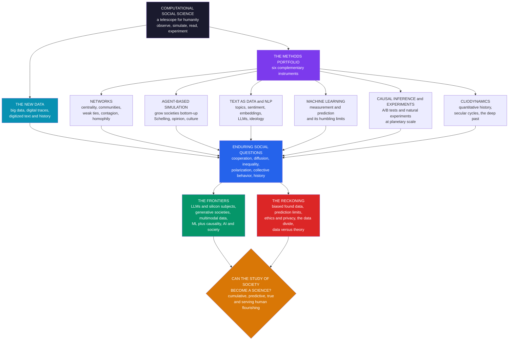

# 🔭 The Reach and Future of Computational Social Science

> [!abstract] TL;DR
> This is the **capstone** of the vault: **computational social science (CSS)** has emerged, in the ~15 years since **Lazer et al.'s 2009 *Science* manifesto**, as a transformative field that brings **data, computation, and complexity science** to the study of society — a **"telescope for humanity"** that lets us *observe* real behavior at planetary scale, *simulate* whole societies bottom-up, *read* the collective written mind across centuries, and *experiment* on millions. Its power rests on a synthesis: the **new DATA** (big data, **digital traces**, digitized **text and history**), a **methods portfolio** of six complementary instruments — **social network analysis** (structure and contagion), **agent-based simulation** (emergence from interaction), **text-as-data and NLP** (measuring meaning, culture, and ideology), **machine learning** (measurement and prediction — and its humbling limits), **causal inference and online experiments** (cause at scale), and **cliodynamics** (quantitative history) — all trained on the **enduring social questions** of cooperation, diffusion, inequality, polarization, collective behavior, and historical dynamics. It has already reshaped **public health, democracy, the economy, development, culture, and the deep past**. Yet its promise is tempered by a hard, mature **reckoning**: biased and non-representative **"found" data** ("big data ≠ good data"), the sobering **limits of predicting** complex human lives (the **Fragile Families** lesson), acute **ethics and privacy** crises (consent, re-identification, manipulation — Facebook contagion, Cambridge Analytica), the **data divide** of corporate-controlled data, and the enduring need to pair **prediction with explanation** and **data with theory**. As CSS increasingly studies a world reshaped by the very **AI** it wields — **LLMs** as text engines and "silicon subjects," generative simulated societies — the disciplined, ethical, theory-informed, **human-centered** practice of computation to *understand and improve* the social world stands among the most consequential scientific frontiers of our age. The question the field is living through: can the study of society become a **cumulative, predictive, true** science — or is society too complex, reflexive, and precious to fit in any telescope?

---

## Intuition

**Analogy:** Galileo's telescope did not merely let astronomers see *farther*. It **transformed astronomy from philosophy into science** — revealing the moons of Jupiter, the phases of Venus, the craters of the Moon, and in doing so overturning centuries of confident assumption about the shape of the cosmos. The instrument did not just extend the old way of knowing; it *changed what counted as knowing*, replacing authority and armchair reasoning with observation, measurement, and testable prediction.

**Computational social science is the telescope moment for the study of humanity.** For the first time, we can *observe* society at **planetary scale and microscopic detail** at once — every message, movement, purchase, friendship, and search a recorded data point; we can *simulate* whole civilizations from the bottom up and watch segregation, polarization, and revolution emerge from simple rules; we can *read the collective written mind* across centuries of digitized text; and we can *experiment* on millions in a single afternoon. Society has moved onto digital infrastructure, and that infrastructure is a telescope pointed back at us.

The open question — the one the field is *living through* — is whether this new instrument will make the study of society a **genuine science**: cumulative (each result building on the last), predictive (able to forecast, not just narrate), and true (revealing real mechanisms, not artifacts of the data). Or whether human society will prove too **complex, reflexive, and precious** to be captured by any telescope — too full of agency, meaning, and feedback loops in which the observed change *because* they are observed. Galileo's generation got its answer within a lifetime. Ours is being written now.

---

## How It Works

This note **synthesizes the whole vault**. Computational social science is not one method but a **fusion**: enduring social questions, attacked with a new methods portfolio, powered by a new kind of data. To see the field whole, follow the four layers — DATA, METHODS, QUESTIONS, and FRONTIERS/reckoning — and how each vault section fills them in.

### Layer 1 — The new DATA: the raw material

The foundational shift is in *what we can observe*. Classical social science was **theory-rich but data-poor** — a few thousand survey respondents, painstakingly collected. CSS is **data-rich**: it works with the behavioral exhaust of entire populations. Three streams feed it. **Big data** — the sheer volume, velocity, and variety of records (the subject of [[Big_Data_and_the_Social_Sciences]]). **Digital traces** — *naturally-occurring* "found" data from phones, platforms, transactions, and sensors, which trade the control of a survey for enormous scale, granularity, and non-reactivity ([[Digital_Traces_and_Found_Data]]). And **digitized text and history** — centuries of newspapers, books, and archives turned machine-readable. The catch, developed in [[Measurement_and_Validity_in_Digital_Data]], is that scale is not validity: *does the trace measure the construct you care about?* A "like" is not endorsement.

### Layer 2 — The METHODS portfolio: six complementary instruments

The heart of the field, and the map of the vault. Each is a distinct instrument for a distinct kind of question:

1. **Social network analysis** — relational *structure*. Represent people as nodes and ties as edges, then measure **centrality** (who is influential), detect **communities** (who clusters), and model **contagion** and **diffusion** (how things spread). The vault develops this across [[Social_Network_Analysis_Foundations]], [[Centrality_Community_and_Structure]], [[The_Strength_of_Weak_Ties_and_Social_Capital]], [[Contagion_and_Diffusion_in_Social_Networks]], [[Homophily_Selection_and_Influence]], and [[Online_Social_Networks_and_Platforms]].
2. **Agent-based simulation** — *emergence* from interaction. Specify simple micro-rules for many heterogeneous agents, run, and watch macro-patterns appear that no one designed. Schelling's segregation, opinion dynamics, and cultural spread live here: [[Agent_Based_Models_of_Society]], [[Segregation_and_Emergent_Social_Order]], [[Opinion_Dynamics_and_Polarization]], [[Culture_Dissemination_and_Social_Influence_Models]], [[Generative_Social_Science_and_Model_Validation]], [[Simulating_Collective_Behavior_and_Social_Movements]].
3. **Text as data and NLP** — the *written mind*. Turn language into quantitative measures of topics, sentiment, meaning, and ideology: [[Text_as_Data_in_Social_Science]], [[Topic_Models_and_Document_Classification]], [[Sentiment_Emotion_and_Stance_Analysis]], [[Word_Embeddings_and_Semantic_Change]], [[Measuring_Culture_and_Ideology_from_Text]], and — the frontier — [[Large_Language_Models_in_Social_Science]].
4. **Machine learning and prediction** — *measurement and forecasting*, and a signature humility about their limits. This is the forthcoming *Prediction and Machine Learning in Social Science*, whose central lesson (the Fragile Families Challenge) is that complex human outcomes resist forecasting.
5. **Causal inference and online experiments** — establishing *what causes what* at scale, from natural experiments in trace data to randomized A/B tests on millions. These are the forthcoming *Causal Inference from Observational and Digital Data* and *Online Experiments and Digital Field Experiments*.
6. **Cliodynamics and quantitative history** — the *deep past* as dynamical system: secular cycles, social complexity, and the statistics of war, in [[Cliodynamics_and_Quantitative_History]], [[The_Evolution_of_Social_Complexity]], [[War_Peace_and_the_Statistics_of_Conflict]], and [[Long_Run_Economic_and_Population_History]] (with the forthcoming *Secular Cycles and Structural-Demographic Theory* and *Cultural Evolution and Historical Dynamics*).

These are a **portfolio, not a hierarchy** — each has an appropriate domain, and the strongest CSS combines them (networks *plus* experiments to separate influence from homophily; ML *plus* causal design to move from prediction to explanation).

### Layer 3 — The enduring QUESTIONS: the substance

The methods are new; the questions are old and big. CSS trains its instruments on **cooperation and collective action**, the **diffusion** of information and behavior, social **influence** through networks, **inequality** and stratification, **collective behavior** (crowds, movements, panics), **polarization** and the online public sphere (the forthcoming *Misinformation, Polarization, and the Online Public Sphere*), the evolution of **culture**, and the long-run **dynamics of societies**. The point of [[Computation_and_Social_Theory]] is that computation is most powerful when it *serves* these questions and their theories — not when it pretends to replace them.

### Layer 4 — The FRONTIERS and the reckoning

Where the field is going, and what it is grappling with. The **frontiers**: LLMs transforming text analysis and enabling "silicon subjects"; **generative AI** and simulated societies; **multimodal** data (images, video, audio, sensors); better **causal inference** from observational digital data (ML + causality); privacy-preserving methods (differential privacy); the study of **AI's own societal effects** (the economy of algorithms — see [[Complexity_Economics_and_Machine_Learning]]); and deeper integration with complexity and the natural sciences. The **reckoning**: data bias, prediction limits, the ethics crisis ([[Ethics_and_Privacy_in_Computational_Social_Science]]), and the data divide. Both, together, define the mature discipline.

### The field, in one picture



---

## Key Concepts

### Secondary Level

**What the whole field adds up to.** For most of history, studying society meant asking a few people questions and guessing about the rest. Now, because so much of life happens on phones and computers, we can actually *see* what billions of people do — and we have computers powerful enough to make sense of it. **Computational social science** is the science that does this. Like Galileo's telescope changed astronomy from guessing to *seeing*, digital data is changing the study of people.

**Its toolkit, in plain words:**

| Tool | What it does |
|---|---|
| **Networks** | Maps who is connected to whom, and how things spread between people |
| **Simulation** | Builds a tiny pretend society on a computer to see what patterns appear |
| **Text tools** | Reads huge piles of writing to measure moods, topics, and ideas |
| **Prediction** | Tries to forecast what people will do (and often finds it is hard) |
| **Experiments** | Tries things on lots of people to find out what really *causes* what |
| **History tools** | Looks for repeating patterns across centuries of the past |

**Why it matters, and why to be careful.** These tools have helped fight disease, understand elections, and study inequality. But the data can be **biased** (not everyone shows up equally online), people are **hard to predict**, and using personal data raises big **privacy** questions. The field is powerful *and* it has to be used responsibly — because every "data point" is a real person.

### Undergraduate Level

#### The grand arc: from manifesto to mature discipline

CSS was crystallized by **Lazer et al.'s 2009 *Science* article**, which argued that digital footprints had created an unprecedented opportunity and that social science needed to reorganize to seize it. The intervening years traced a familiar arc: early **hype** (breathless claims that "big data" would reveal everything), a **reckoning** (Google Flu Trends failing, the Fragile Families Challenge humbling predictors, the Cambridge Analytica scandal exposing the ethics gap), and a **maturation** into a more rigorous, self-aware discipline — captured in the field's own 2020 retrospective, tellingly subtitled *"Obstacles and Opportunities."* The mature CSS is neither utopian nor cynical: it knows its instruments are powerful *and* that they distort.

#### The methods as a portfolio, and their appropriate uses

The single most useful synthesis is to see the six methods as **complementary tools with different jobs**:

- **Networks** answer *structural* questions — who is central, which groups cluster, how far and fast something spreads. Best when relationships are the phenomenon.
- **Simulation (ABMs)** answers *emergence* questions — how macro-patterns (segregation, polarization, cooperation) arise from micro-rules. Best for "how could this pattern come about?" and counterfactual worlds.
- **Text as data** answers *meaning* questions — what people are talking about, how they feel, which ideology a document reflects, how culture shifts over time.
- **Machine learning** answers *measurement and prediction* questions — estimating a hard-to-observe trait from behavior, or forecasting an outcome — while teaching **humility** about how far prediction can go.
- **Causal inference and experiments** answer *why* and *what if* — the only tools that reliably separate correlation from cause at scale.
- **Cliodynamics** answers *long-run* questions — do societies rise and fall in patterned cycles across millennia?

#### The vast reach

CSS is a **bridge discipline** whose reach spans society. **Public health** (digital epidemiology, disease spread, behavior change). **Politics and democracy** (polarization, misinformation, elections, the public sphere). **The economy** (behavior, networks, "nowcasting" — sharing agent-based and network methods with [[Complexity_Economics_Overview]]). **Inequality and mobility** (measuring stratification from administrative and trace data). **Development** (poverty mapping from satellites and phones, humanitarian response). **Urban dynamics** (cities as instrumented systems). **Culture and history** (culturomics, cliodynamics, the deep past). And **business** (A/B testing, recommendation, marketing). Few scientific fields touch so many domains.

#### The honest reckoning, in four parts

A mature undergraduate account of CSS is inseparable from its self-critique. **Data problems**: found data is biased and non-representative — "big data ≠ good data," the WEIRD/platform skew, and shaky measurement validity. **Prediction limits**: the Fragile Families Challenge showed even massive data plus top ML predicts individual life outcomes poorly. **Ethics**: consent, privacy, re-identification, and manipulation are live harms, not hypotheticals. **The data divide**: the most valuable data is locked inside corporations and states, creating deep inequities in who can do this science and whether it can be reproduced.

### Graduate Level

#### The unifying epistemology: prediction, explanation, and the reflexive object

The deepest synthesis concerns *what kind of knowledge CSS produces*. It inherits a tension between the **predictive** culture of ML and the **explanatory** culture of social science. Anderson's provocative "**end of theory**" — correlation supersedes causal models given enough data — has been broadly rejected: prediction without mechanism is fragile (Google Flu), non-transportable, and cannot answer *why* or *what if*. The mature position, developed in [[Computation_and_Social_Theory]], is **complementarity**: ML for measurement and forecasting; **causal inference** and **generative models** for explanation. Watts argues CSS's real promise is a **more cumulative and predictive** social science *precisely by* fusing large-scale observation with theory and experiment. Compounding this is **reflexivity** — a feature astronomy never faced: the objects of study *read the findings and change*. Predictions become interventions; a published contagion model alters the contagion; a polarization metric becomes a political weapon. The telescope, pointed at people, is also seen by them.

#### The measurement crisis and algorithmic confounding

Beyond volume, the binding constraint is **construct validity**. Found data are **operationalizations of convenience**, and rigorous CSS is largely the work of validating that a computational measure (a sentiment score, an ideology estimate, a mobility metric) tracks the latent construct — by triangulating against gold-standard surveys or hand-coded ground truth. Worse, the platform is an **active confounder**: recommendation algorithms shape what is observed, so the data reflect the *system*, not just its users (**algorithmic confounding**). And as the platforms increasingly run on the same ML the researcher uses, the observed society is partly a *product* of algorithms — the "economy of algorithms" that CSS must now study as an object, not just wield as a tool (see [[Complexity_Economics_and_Machine_Learning]]).

#### Causal inference at scale — power and peril

Observational trace data invites spurious inference; the canonical trap is **homophily versus influence** (do friends behave alike because they influence one another, or because similar people befriend one another?). CSS answers with **large-scale randomized experiments** (the 61-million-person Facebook voter-mobilization study; emotional-contagion manipulations) and **quasi-experimental** designs mining natural discontinuities in digital data. This is where CSS's scale is genuinely transformative — statistical power to detect tiny-but-consequential population effects — *and* where its ethics are most fraught, because experimenting on millions without meaningful consent is exactly what the Facebook contagion study did.

#### The frontier: LLMs, generative societies, and studying an AI-shaped world

The current frontier is **generative AI**. **LLMs** are transforming [[Text_as_Data_in_Social_Science]] — annotating, classifying, and measuring text at near-human quality with almost no labeled data — and enabling controversial new designs: **"silicon subjects"** (using an LLM to *simulate* survey respondents or experimental participants) and **LLM-agent** societies (populations of generative agents whose interactions are simulated). The pitfalls, developed in [[Large_Language_Models_in_Social_Science]], are severe: LLMs encode training-data bias, can fabricate plausible-but-false patterns, are non-transparent, and may *homogenize* the very human variation CSS exists to study. Simultaneously, CSS must increasingly study a world *reshaped by AI* — algorithmic feeds, recommender-driven polarization, generative misinformation — meaning the field's object and its instruments are converging. The disciplined path forward pairs generative power with validation, causal design, ethics, and theory.

#### The grand open questions

The field's future turns on a handful of unresolved questions. **Can CSS make social science cumulative, predictive, and unified** — a real science of society — *or* are social systems too complex, reflexive, and contingent (the limits-of-prediction lesson)? **How to combine prediction and explanation, data and theory, big data and rigorous causal/experimental design** without collapsing into either atheoretical curve-fitting or dataless theorizing? **How to democratize data access and do CSS ethically**, given corporate gatekeeping and the manipulation risks? **How to study a society increasingly shaped by the very AI/algorithms CSS uses?** And, most importantly, **how to ensure CSS serves human flourishing and democracy** rather than surveillance and manipulation? The answers will determine whether the telescope reveals a lawful cosmos or an irreducibly human one — and whether the field remembers that its data points are people.

---

## Python Demo

```python
import numpy as np
import matplotlib
matplotlib.use("Agg")
import matplotlib.pyplot as plt

# =====================================================================
# THE CSS DASHBOARD -- the whole field's signature methods & findings in
# ONE capstone figure, on toy data (numpy + matplotlib only):
#   (1) NETWORKS      -> a social network with COMMUNITY structure;
#                        spectral layout + modularity of the partition
#   (2) SIMULATION    -> AGENT-BASED opinion dynamics (bounded confidence)
#                        -> polarization/consensus EMERGES from local rules
#   (3) TEXT AS DATA  -> a "culturomics" time series: word frequencies
#                        rising and falling across a century of text
#   (4) LIMITS OF     -> even good ML predicts complex social outcomes
#       PREDICTION       WEAKLY (the Fragile Families lesson): low test R^2
# No networkx / sklearn: plain numpy linear algebra throughout.
# =====================================================================
rng = np.random.default_rng(2009)   # the year of the Lazer et al. manifesto

# ---------------------------------------------------------------------
# (1) SOCIAL NETWORK with COMMUNITIES: a stochastic block model, 3 groups.
#     Dense ties within groups, sparse between -> planted communities.
#     Spectral embedding (Laplacian eigenvectors) doubles as a 2-D layout,
#     and we score the planted partition with MODULARITY Q.
# ---------------------------------------------------------------------
sizes = [16, 14, 12]
group = np.concatenate([[k] * s for k, s in enumerate(sizes)])
N = group.size
p_in, p_out = 0.42, 0.02
A = np.zeros((N, N), dtype=int)
for i in range(N):
    for j in range(i + 1, N):
        p = p_in if group[i] == group[j] else p_out
        if rng.random() < p:
            A[i, j] = A[j, i] = 1

deg = A.sum(axis=1)
m_edges = A.sum() // 2

# spectral embedding for layout: eigenvectors 2 & 3 of the Laplacian
L = np.diag(deg) - A
evals, evecs = np.linalg.eigh(L)
order = np.argsort(evals)
pos = np.column_stack([evecs[:, order[1]], evecs[:, order[2]]])

# MODULARITY Q of the planted partition (Newman): sum_c (e_cc - a_c^2)
two_m = 2.0 * m_edges
Q = 0.0
for c in np.unique(group):
    idx = np.where(group == c)[0]
    e_cc = A[np.ix_(idx, idx)].sum() / two_m          # within-community edge frac
    a_c = deg[idx].sum() / two_m                       # frac of edge-ends in c
    Q += e_cc - a_c ** 2

# ---------------------------------------------------------------------
# (2) AGENT-BASED OPINION DYNAMICS: Hegselmann-Krause bounded confidence.
#     Each agent repeatedly moves to the MEAN opinion of everyone within
#     confidence radius eps. Local rule -> global CLUSTERS emerge.
# ---------------------------------------------------------------------
n_ag, eps, T_op = 200, 0.18, 25
op = rng.random(n_ag)                       # opinions in [0,1]
traj = np.zeros((T_op + 1, n_ag))
traj[0] = op
for t in range(T_op):
    new = op.copy()
    for i in range(n_ag):
        close = np.abs(op - op[i]) <= eps
        new[i] = op[close].mean()
    op = new
    traj[t + 1] = op
# count final clusters (opinions within 0.02 are "the same")
final = np.sort(op)
n_clusters = 1 + int(np.sum(np.diff(final) > 0.02))

# ---------------------------------------------------------------------
# (3) TEXT AS DATA -- "CULTUROMICS": frequency of 3 words over ~120 years,
#     mimicking Google Books n-grams. Deterministic shapes + light noise:
#     one logistic RISE, one steady DECLINE, one BUMP-then-fade.
# ---------------------------------------------------------------------
yrs = np.arange(1900, 2021)
z = (yrs - 1975) / 18.0
rise = 1.0 / (1.0 + np.exp(-z))                                  # e.g. "computer"
decline = 1.0 / (1.0 + np.exp((yrs - 1935) / 22.0))             # e.g. "telegram"
bump = np.exp(-((yrs - 1968) ** 2) / (2 * 12.0 ** 2))          # e.g. "atomic"
def jit(x):
    return np.clip(x + rng.normal(0, 0.015, x.size), 0, None)
rise, decline, bump = jit(rise), jit(decline), jit(bump)

# ---------------------------------------------------------------------
# (4) LIMITS OF PREDICTION -- the Fragile Families lesson. A social
#     outcome y depends WEAKLY on 6 features plus LARGE irreducible noise.
#     Fit least-squares on train, evaluate test R^2 -> a low ceiling.
# ---------------------------------------------------------------------
n, k = 1200, 6
X = rng.normal(size=(n, k))
beta = rng.normal(size=k) * 0.6
signal = X @ beta
noise = rng.normal(size=n) * (signal.std() * 2.6)   # noise >> signal
y = signal + noise
ntr = 800
Xtr, ytr, Xte, yte = X[:ntr], y[:ntr], X[ntr:], y[ntr:]
Xtr1 = np.column_stack([np.ones(ntr), Xtr])         # add intercept
w, *_ = np.linalg.lstsq(Xtr1, ytr, rcond=None)
pred = np.column_stack([np.ones(Xte.shape[0]), Xte]) @ w
ss_res = np.sum((yte - pred) ** 2)
ss_tot = np.sum((yte - yte.mean()) ** 2)
r2 = 1.0 - ss_res / ss_tot

# ------------------------------- REPORT --------------------------------
print("=" * 66)
print("COMPUTATIONAL SOCIAL SCIENCE -- THE DASHBOARD")
print("=" * 66)
print(f"(1) NETWORK    : {N} nodes, {m_edges} edges, mean degree {deg.mean():.1f}")
print(f"                 modularity Q of planted communities = {Q:.2f}")
print(f"(2) OPINIONS   : {n_ag} agents, eps={eps} -> {n_clusters} final "
      f"opinion cluster(s) emerged")
print(f"(3) TEXT       : tracked 3 words across {yrs[0]}-{yrs[-1]} "
      f"(rise / decline / bump)")
print(f"(4) PREDICTION : test R^2 = {r2:.2f}  "
      f"-> {r2*100:.0f}% of variance explained (the humbling ceiling)")

# ------------------------------- FIGURE --------------------------------
fig, ax = plt.subplots(2, 2, figsize=(14, 10.5))
fig.suptitle("Computational Social Science, in one dashboard: "
             "networks + simulation + text + the limits of prediction",
             fontsize=13, fontweight="bold")
comm_colors = ["#dc2626", "#2563eb", "#059669"]

# Panel A: the social network, colored by community, sized by degree
axA = ax[0, 0]
for i in range(N):
    for j in range(i + 1, N):
        if A[i, j]:
            axA.plot([pos[i, 0], pos[j, 0]], [pos[i, 1], pos[j, 1]],
                     color="#cccccc", lw=0.5, zorder=1)
axA.scatter(pos[:, 0], pos[:, 1], s=40 + 28 * deg,
            c=[comm_colors[g] for g in group], edgecolors="black",
            linewidths=0.6, zorder=2)
axA.set_title(f"(1) NETWORKS: social structure + communities\n"
              f"spectral layout | modularity Q = {Q:.2f}", fontsize=10)
axA.set_xticks([]); axA.set_yticks([])

# Panel B: opinion dynamics -- trajectories converging to clusters
axB = ax[0, 1]
for i in range(n_ag):
    axB.plot(range(T_op + 1), traj[:, i], color="#7c3aed", lw=0.5, alpha=0.35)
axB.set_title(f"(2) SIMULATION: agent-based opinion dynamics\n"
              f"{n_clusters} cluster(s) EMERGE from local averaging "
              f"(eps={eps})", fontsize=10)
axB.set_xlabel("time step"); axB.set_ylabel("opinion (0 to 1)")
axB.set_ylim(-0.02, 1.02); axB.grid(alpha=0.25)

# Panel C: culturomics -- word frequencies across a century
axC = ax[1, 0]
axC.plot(yrs, rise, color="#059669", lw=2, label='rising  ("computer")')
axC.plot(yrs, decline, color="#dc2626", lw=2, label='declining  ("telegram")')
axC.plot(yrs, bump, color="#d97706", lw=2, label='bump  ("atomic")')
axC.set_title("(3) TEXT AS DATA: culturomics\n"
              "the written mind, measured across a century", fontsize=10)
axC.set_xlabel("year"); axC.set_ylabel("relative word frequency")
axC.legend(fontsize=8, loc="center left"); axC.grid(alpha=0.25)

# Panel D: limits of prediction -- predicted vs actual, low R^2
axD = ax[1, 1]
axD.scatter(yte, pred, s=14, alpha=0.4, color="#2563eb", edgecolors="none")
lims = [min(yte.min(), pred.min()), max(yte.max(), pred.max())]
axD.plot(lims, lims, color="black", ls="--", lw=1.2, label="perfect prediction")
axD.set_title(f"(4) LIMITS OF PREDICTION: the Fragile Families lesson\n"
              f"even good ML explains little: test R^2 = {r2:.2f}", fontsize=10)
axD.set_xlabel("actual outcome"); axD.set_ylabel("predicted outcome")
axD.legend(fontsize=8, loc="upper left"); axD.grid(alpha=0.25)

plt.tight_layout(rect=[0, 0, 1, 0.95])
plt.savefig("css_dashboard.png", dpi=110, bbox_inches="tight")
plt.show()
```

**What the demo shows** — the four signature moves of CSS in one capstone figure:

- **Panel (1) — Networks.** A synthetic social network with three planted **communities**, drawn with a **spectral layout** (eigenvectors of the graph Laplacian) and scored with **modularity** `Q` — a real, purely-linear-algebra summary of how cleanly the groups separate. Node size is **degree centrality**. This is the *structure* CSS reads out of raw ties.
- **Panel (2) — Simulation.** A bottom-up **agent-based** opinion model (Hegselmann–Krause bounded confidence): each agent repeatedly averages toward the opinions *close enough* to its own. From this purely **local** rule, a small number of **opinion clusters emerge** — consensus or polarization that no agent designed. This is *emergence* from interaction, the ABM signature.
- **Panel (3) — Text as data.** A **"culturomics"** time series: the relative frequency of three words traced across ~120 years, one rising, one declining, one spiking-then-fading — exactly the shape Google Books n-grams reveal. Language becomes a *measurable* record of cultural change. This is the *written mind*, quantified.
- **Panel (4) — The limits of prediction.** The capstone's dose of humility. A social outcome is generated with real-but-weak signal buried in **large irreducible noise**; a least-squares model trained on 800 cases and tested on 400 achieves a **low test R²** — most variance is simply unexplained. This is the **Fragile Families** lesson made concrete: massive data and good ML still predict complex human lives only weakly. Scale is not omniscience.

Read together — structure, emergence, meaning, and humility — the four panels *are* the field: read structure out of relationships, grow dynamics out of micro-rules, extract meaning out of language, and stay honest about what even the best model cannot foresee.

---

## Real-World Applications

> **Public health and digital epidemiology.** Mobile-phone and search traces let researchers track disease spread and behavior change in near-real-time; during COVID-19, mobility data measured the effect of interventions on transmission. The cautionary counterpoint — Google Flu Trends drifting badly — is itself a foundational CSS lesson about validity, not a reason to abandon the approach.

> **Politics, democracy, and the online public sphere.** Large-scale analysis of social media quantifies **polarization**, echo chambers, and the spread of falsehood (which travels faster and farther than truth, per Vosoughi et al. in *Science*), and evaluates platform interventions — connecting directly to [[Democratic_Backsliding_and_Polarization]], [[Media_Propaganda_and_Political_Communication]], and [[Public_Opinion_and_Political_Socialization]]. The 61-million-person Facebook voter-mobilization experiment showed causal network effects on turnout at unprecedented scale.

> **The economy and inequality.** CSS shares agent-based and network methods with **complexity economics** to study the *emergence* of wealth distributions, systemic risk, and market dynamics, and uses trace data to "nowcast" economic activity — see [[Complexity_Economics_Overview]], [[Economic_Networks_and_Interaction_Structure]], and [[Wealth_and_Income_Inequality_Dynamics]]. The methodological overlap with [[Agent_Based_Modeling_in_Economics]] and [[Schelling_Segregation_and_Emergent_Patterns]] is near-total.

> **Development and humanitarian response.** Satellite imagery plus mobile-phone data map **poverty** at village resolution where surveys are absent, track migration and displacement, and target aid — one of CSS's clearest contributions to human welfare in data-scarce settings (the forthcoming *Computational Demography and Human Mobility*).

> **Culture and history at scale.** Mass digitization powers **culturomics** (Google Books n-grams across centuries) and computational history; the **cliodynamics** program builds mathematical models of the rise and fall of societies, testing them against databases like Seshat — see [[Cliodynamics_and_Quantitative_History]] and, in the History vault, [[Big_History_and_Cliodynamics]].

> **Business and platforms.** The most industrialized CSS: continuous **A/B testing**, recommendation systems, and marketing experiments run by every major platform — the same causal-inference-at-scale machinery, applied to product design, and the source of much of the data (and the data divide) academic CSS depends on.

---

## Common Pitfalls

- **Treating "big data" as "good data."** The field's most important warning. Digital traces are **non-representative** and **platform-skewed**: X/Twitter users are not the public, and a huge biased sample can be *worse* than a small representative one because it gives false confidence. Scale does not cure bias; it can hide it. Always ask *who is missing*.
- **Ignoring measurement validity.** A "like" is not endorsement, a friend-link is not friendship, a search is not a belief. Deploying a computational measure without validating it against ground truth is the field's most common silent failure — Google Flu Trends is the monument to it.
- **Overpromising prediction.** The Fragile Families Challenge showed even massive data plus top ML predicts individual life outcomes poorly. Claiming to forecast who will be evicted, radicalized, or successful invites both scientific embarrassment and real-world harm. Complex human outcomes have a hard predictability ceiling.
- **Mistaking prediction for explanation.** ML can forecast without revealing *mechanism*; a model that predicts well can be causally wrong and will fail out-of-distribution. The "end of theory" hope is false — correlation at scale still needs causal design and social theory to answer *why* and *what if* (see [[Computation_and_Social_Theory]]).
- **Confusing homophily with influence.** In observational network data, friends behaving alike may reflect influence *or* selection; the two are notoriously hard to separate without experiments. Claiming "social contagion" from correlation alone is a classic error.
- **Treating ethics as an afterthought.** Because found data is *nonreactive*, it is tempting to skip consent — but the Facebook emotional-contagion and Cambridge Analytica episodes show the stakes. Surveillance, re-identification of "anonymized" data, and algorithmic manipulation are live harms; ethics is a design constraint, not a checkbox (see [[Ethics_and_Privacy_in_Computational_Social_Science]]).
- **Forgetting the data divide.** The best behavioral data lives inside corporations that can grant or revoke access at will (witness the post-2023 API lockdowns). Building a program on one platform's API is scientifically fragile and raises deep questions about *who gets to do* this science — and whether it is reproducible.
- **Techno-solutionism and over-claiming.** The seductive belief that more data and better algorithms can solve inherently social and political problems. CSS is a lens, not a fix; forgetting that its "data points" are people is the field's deepest ethical failure mode.

---

## Related Concepts

**The vault's foundations (this field's premises):**

- [[Computational_Social_Science_Overview]] — the field's opening map; this capstone is the closing synthesis that map pointed toward.
- [[Big_Data_and_the_Social_Sciences]] — the volume, velocity, and variety that make CSS possible, and the "big data ≠ good data" caution.
- [[Digital_Traces_and_Found_Data]] — the naturally-occurring behavioral exhaust that is CSS's signature raw material.
- [[Measurement_and_Validity_in_Digital_Data]] — the construct-validity problem at the heart of the reckoning: does the trace measure the thing?
- [[Ethics_and_Privacy_in_Computational_Social_Science]] — consent, re-identification, and manipulation; the ethics crisis this capstone treats as central.
- [[Computation_and_Social_Theory]] — prediction vs explanation, data vs theory; the epistemology that keeps the *social* in computational social science.

**The methods portfolio (the six instruments):**

- [[Social_Network_Analysis_Foundations]] — the structural backbone: nodes, ties, and what they reveal.
- [[Centrality_Community_and_Structure]] — the centrality and community measures the demo's network panel enacts.
- [[The_Strength_of_Weak_Ties_and_Social_Capital]] — Granovetter's insight, the theory CSS measures at scale.
- [[Contagion_and_Diffusion_in_Social_Networks]] — how information and behavior spread through ties.
- [[Homophily_Selection_and_Influence]] — the confounding of "birds of a feather" with "you changed me," the causal crux.
- [[Online_Social_Networks_and_Platforms]] — the digital systems that generate the data and shape the observed society.
- [[Agent_Based_Models_of_Society]] — growing societies bottom-up; the emergence engine.
- [[Segregation_and_Emergent_Social_Order]] — Schelling's canonical demonstration of macro-order from micro-preference.
- [[Opinion_Dynamics_and_Polarization]] — the bounded-confidence dynamics the demo's second panel simulates.
- [[Culture_Dissemination_and_Social_Influence_Models]] — Axelrod-style models of how culture spreads and clusters.
- [[Generative_Social_Science_and_Model_Validation]] — "if you didn't grow it, you didn't explain it," and how to validate that you did.
- [[Simulating_Collective_Behavior_and_Social_Movements]] — thresholds, cascades, and the emergence of mobilization.
- [[Text_as_Data_in_Social_Science]] — turning language into measurement; the written-mind instrument.
- [[Topic_Models_and_Document_Classification]] — discovering themes and labeling documents at scale.
- [[Sentiment_Emotion_and_Stance_Analysis]] — measuring mood and position from text.
- [[Word_Embeddings_and_Semantic_Change]] — dense meaning vectors and the culturomics of shifting meaning.
- [[Measuring_Culture_and_Ideology_from_Text]] — scaling ideology and cultural dimensions from corpora.
- [[Large_Language_Models_in_Social_Science]] — the frontier instrument: LLMs as annotators, "silicon subjects," and generative agents, with their pitfalls.
- [[Cliodynamics_and_Quantitative_History]] — the deep-past instrument: history as dynamical system.
- [[The_Evolution_of_Social_Complexity]] — Seshat and the long-run growth of social complexity.
- [[War_Peace_and_the_Statistics_of_Conflict]] — Richardson's power laws and the heavy-tailed statistics of violence.
- [[Long_Run_Economic_and_Population_History]] — centuries of wages, prices, and demography as data.

**Cross-vault — the shared complexity, network, and computational foundations:**

- [[Network_Science_Fundamentals]] — the formal backbone of social network analysis.
- [[Centrality_and_Community_Structure]] — the systems-thinking treatment of the exact measures in the demo.
- [[Small_World_and_Scale_Free_Networks]] — the structural signatures (hubs, short paths) of real social networks.
- [[Network_Dynamics_and_Contagion]] — the diffusion processes CSS models on social ties.
- [[Agent_Based_Modeling]] — the general bottom-up simulation method CSS specializes to society.
- [[Emergence_and_Self_Organization]] — why macro social patterns cannot be read off individuals; the core CSS insight.
- [[Complex_Adaptive_Systems]] — society as a CAS of interacting, adapting agents; the shared paradigm.
- [[Feedback_Loops_and_Causality]] — the reflexive feedback that makes society a moving target for prediction.
- [[Complexity_Economics_Overview]] — the sibling field sharing agent-based models, networks, and emergence.
- [[The_Reach_and_Future_of_Complexity_Economics]] — the parallel capstone in the economics vault; the same telescope, pointed at markets.
- [[Agent_Based_Modeling_in_Economics]] — economic ABMs, methodologically identical to CSS social simulations.
- [[Schelling_Segregation_and_Emergent_Patterns]] — the canonical emergent-segregation model shared across both vaults.
- [[Economic_Networks_and_Interaction_Structure]] — the interaction-structure lens CSS shares with complexity economics.
- [[Wealth_and_Income_Inequality_Dynamics]] — inequality as an emergent, generatively-modeled phenomenon.
- [[Diffusion_of_Innovations_and_Adoption_Dynamics]] — the S-curve adoption dynamics common to both fields.
- [[Complexity_Economics_and_Machine_Learning]] — the "economy of algorithms": studying an AI-shaped world, a shared frontier.

**Cross-vault — social science substance and the computational toolkit:**

- [[Social_Networks_and_Social_Ties]] — the sociological theory of ties that CSS measures at scale.
- [[Social_Capital_and_Trust]] — a core construct CSS operationalizes from structure and traces.
- [[Collective_Behavior_and_Crowds]] — crowds and movements as emergent, network-driven dynamics.
- [[Social_Movements_and_Revolution]] — mobilization now trackable through social-media traces.
- [[Digital_Society_and_Online_Communities]] — the digital social world that *generates* the found data.
- [[Sociological_Research_Methods]] — the designed-data methods CSS complements and challenges.
- [[Democratic_Backsliding_and_Polarization]] — the polarization CSS quantifies in the public sphere.
- [[Media_Propaganda_and_Political_Communication]] — misinformation and influence, a flagship application.
- [[Public_Opinion_and_Political_Socialization]] — opinion measurement, augmented by text and trace signals.
- [[Big_History_and_Cliodynamics]] — the History-vault treatment of quantitative long-run dynamics.
- [[Text_Preprocessing]] — the first step of every text-as-data pipeline.
- [[Word_Embeddings]] and [[Word2Vec]] — the meaning vectors CSS uses to measure semantic and cultural change.
- [[Naive_Bayes]] and [[BERT]] — the classic and modern classifiers behind sentiment and topic labeling.
- [[Language_Model_Basics]] — the LLM foundations behind the field's frontier.
- [[Cultural_Evolution_and_Social_Learning]] — how culture spreads and evolves, formalized in CSS models.
- [[The_Prisoners_Dilemma_and_Cooperation]] and [[Spatial_and_Network_Games]] — the cooperation problem CSS studies via networks and simulation.

*Forthcoming siblings referenced in prose (not yet written):* **Prediction and Machine Learning in Social Science**, **Causal Inference from Observational and Digital Data**, **Online Experiments and Digital Field Experiments**, **Computational Demography and Human Mobility**, **Misinformation, Polarization, and the Online Public Sphere**, **Secular Cycles and Structural-Demographic Theory**, and **Cultural Evolution and Historical Dynamics**.

---

## Review Questions

### Secondary

1. Explain the "telescope for humanity" idea in your own words. What could social scientists *not* see before digital data, and what can they see now — and why does the analogy to Galileo's telescope fit?
2. Name three of the six tools in the CSS toolkit (networks, simulation, text, prediction, experiments, history) and give a one-sentence example of a real question each is good for.
3. Give one way CSS has helped the world and one serious risk of using it badly. Why is it important to remember that every "data point" is a real person?

### Undergraduate

1. Describe the CSS methods as a **portfolio** rather than a ranking. For any three methods, state the kind of question each answers best, and give one example of *combining* two of them to answer a question neither could alone.
2. Trace the field's **grand arc** from Lazer et al.'s 2009 manifesto through the "reckoning" to a mature discipline. Name one event or result from each phase (hype, reckoning, maturation) and explain what the field learned.
3. "Big data ≠ good data." Using representativeness, measurement validity, and the data divide, explain three distinct ways a large digital-trace study can go wrong, and give one mitigation for each.

### Graduate

1. CSS faces a challenge astronomy never did: its object of study is **reflexive** — people read the findings and change. Explain how reflexivity complicates prediction, measurement, and ethics, and how it interacts with **algorithmic confounding** (society partly produced by the algorithms the researcher also uses). What research practices help?
2. Evaluate the claim that CSS can make social science **cumulative and predictive**. Marshal the strongest evidence for (scale, experiments, generative models) and against (the Fragile Families lesson, contingency, heavy tails, reflexivity), and stake out a defensible position on where genuine cumulative progress is possible and where it is not.
3. LLMs now enable "silicon subjects" and generative-agent societies. Lay out the scientific promise and the specific validity, bias, and ethical pitfalls of using LLMs to *simulate* human respondents or populations. Under what conditions, if any, is an LLM-generated result admissible evidence about real human behavior — and how does this connect to the broader task of studying a society increasingly shaped by AI?

---

## Sources

- [Lazer, D. et al. (2009). "Computational Social Science." *Science* 323(5915), 721–723](https://doi.org/10.1126/science.1167742)
- [Lazer, D. M. J. et al. (2020). "Computational social science: Obstacles and opportunities." *Science* 369(6507), 1060–1062](https://doi.org/10.1126/science.aaz8170)
- [Salganik, M. J. (2018). *Bit by Bit: Social Research in the Digital Age*. Princeton University Press](https://www.bitbybitbook.com/)
- [Watts, D. J. (2013). "Computational Social Science: Exciting Progress and Future Directions." *The Bridge* 43(4)](https://www.nae.edu/106116/Computational-Social-Science-Exciting-Progress-and-Future-Directions)
- [Salganik, M. J. et al. (2020). "Measuring the predictability of life outcomes with a scientific mass collaboration." *PNAS* 117(15), 8398–8403 (the Fragile Families Challenge)](https://doi.org/10.1073/pnas.1915006117)
- [Wagner, C. et al. (2021). "Measuring algorithmically infused societies." *Nature* 595, 197–204](https://doi.org/10.1038/s41586-021-03666-1)

---

#computational-social-science #big-data #interdisciplinary #social-networks #capstone
