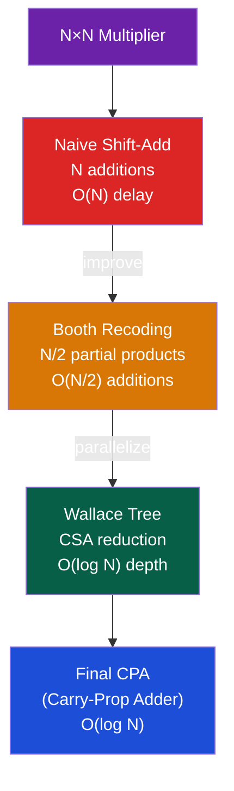

# 🔢 Arithmetic Circuits and IEEE 754

> [!abstract] TL;DR
> Integer multiplication uses Booth's algorithm (reduces partial products by recoding using signed digits, handles 2's complement natively) and Wallace trees (parallel reduction of partial products using carry-save adders in O(log N) stages). IEEE 754 floating-point stores values as (-1)^s × 1.mantissa × 2^(exp−bias) with bias=127 (single)/1023 (double). Special values: zero (exp=0,mant=0), denormals (exp=0,mant≠0 — gradual underflow), Inf (exp=all-1s,mant=0), NaN (exp=all-1s,mant≠0). Four rounding modes: RNE (default), RTZ, RUP, RDN.

## Intuition — analogy FIRST

IEEE 754 floating-point is scientific notation for computers: 6.022 × 10^23 stores the significant digits (6.022) and the magnitude (10^23) separately. The "hidden bit" trick means the leading 1 in binary (1.mantissa × 2^exp) is free — like always writing "1.something", so you only store "something". Booth's algorithm recodes multiplier digits from binary (0,1) to signed (−1,0,+1) to minimize partial products — like replacing "add 15" with "add 16 − 1".

---

## How It Works

### Integer Multiplication Architectures



### Booth's Algorithm

Modified Booth (radix-4) recodes every 2 bits of multiplier → one partial product (N/2 partial products for N-bit multiply):

| B[2i+1] | B[2i] | B[2i-1] | Action | Partial Product |
|---------|-------|---------|--------|-----------------|
| 0 | 0 | 0 | Zero | 0 |
| 0 | 0 | 1 | +1× | +A |
| 0 | 1 | 0 | +1× | +A |
| 0 | 1 | 1 | +2× | +2A |
| 1 | 0 | 0 | −2× | −2A |
| 1 | 0 | 1 | −1× | −A |
| 1 | 1 | 0 | −1× | −A |
| 1 | 1 | 1 | Zero | 0 |

- +2A = A << 1 (free with wiring)
- −A = two's complement (invert bits + 1 in final CSA)
- Handles signed multiplication natively

### Wallace Tree

A Wallace tree uses carry-save adders (CSA) to reduce M partial products to 2 operands in O(log₃/₂(M)) stages, then finishes with one fast carry-propagate adder:

```
Stage 0: 8 partial products (from Booth for 16-bit multiply)
         CSA reduces 3→2:    [PP0,PP1,PP2]→[S0,C0]
                              [PP3,PP4,PP5]→[S1,C1]
                              [PP6,PP7,0  ]→[S2,C2]
Stage 1: 6 operands (S0,C0,S1,C1,S2,C2)
         CSA reduces: [S0,C0,S1]→[S3,C3]
                      [C1,S2,C2]→[S4,C4]
Stage 2: 4 operands → 2 more CSA reductions
Stage 3: 2 operands → Final CPA (carry-lookahead)
```

CSA: takes 3 inputs A,B,C → produces Sum=A⊕B⊕C, Carry=majority(A,B,C) — this is just 3 full adders working in parallel at each bit position.

### IEEE 754 Format

**Single precision (32-bit)**:
```
[31]  [30:23]      [22:0]
 S    Exponent     Mantissa
 1    8 bits       23 bits
```

**Double precision (64-bit)**:
```
[63]  [62:52]      [51:0]
 S    Exponent     Mantissa
 1    11 bits      52 bits
```

**Value formula**:
```
Normal:    (-1)^S × 1.Mantissa × 2^(Exponent − Bias)
Denormal:  (-1)^S × 0.Mantissa × 2^(1 − Bias)    [Exponent=0, Mant≠0]
+Zero:     S=0, Exp=0, Mant=0
-Zero:     S=1, Exp=0, Mant=0
+Inf:      S=0, Exp=all-1s, Mant=0
-Inf:      S=1, Exp=all-1s, Mant=0
NaN:       Exp=all-1s, Mant≠0   (sNaN: Mant[MSB]=0; qNaN: Mant[MSB]=1)
```

| Type | Exp (biased) | Mantissa | Value |
|------|-------------|----------|-------|
| +Zero | 0 | 0 | 0 |
| Denormal | 0 | ≠0 | ≈ very small |
| Normal | 1–254 (single) | any | ±1.M × 2^(E−127) |
| +Inf | 255 (single) | 0 | ∞ |
| NaN | 255 (single) | ≠0 | Not-a-Number |

**Range for single precision**:
- Max normal: ≈ 3.4 × 10^38
- Min normal: ≈ 1.2 × 10^−38
- Min denormal: ≈ 1.4 × 10^−45
- Precision: ~7 decimal digits (23 mantissa bits → 2^−23 ≈ 1.2 × 10^−7)

### Rounding Modes

| Mode | IEEE Name | Rule |
|------|-----------|------|
| RNE | Round to Nearest Even (default) | Round to nearest; on tie, round to even LSB |
| RTZ | Round toward Zero (truncation) | Drop extra bits |
| RUP | Round Up (toward +∞) | Always round toward +∞ |
| RDN | Round Down (toward −∞) | Always round toward −∞ |

**Guard/Round/Sticky (GRS) bits** enable correct rounding:
- Guard: 1 bit beyond the representable mantissa
- Round: 1 bit beyond guard
- Sticky: OR of all remaining bits (sticky "sticks" to 1 if any lower bit was 1)
- RNE rule: round up if GRS > 100, or if GRS = 100 and LSB of result = 1

### FP Addition Algorithm

```
Align: shift the smaller-exponent operand right until exponents match
Add:   add/subtract mantissas (with hidden bits restored)
Norm:  normalize result (shift so leading bit is 1, adjust exponent)
Round: apply GRS rounding
Check: detect overflow/underflow/exact zero
```

---

## Real-World Notes

- Modern CPUs (Intel/AMD x86) have 3-5 cycle FP latency, 1 cycle throughput for add/mul via pipelining of the FP unit
- FMA (Fused Multiply-Add): computes A×B + C in one rounding step instead of two, preserving extra precision and being faster. Used heavily in BLAS, neural networks
- NaN is "poisonous" — any arithmetic on NaN produces NaN, propagating the error signal
- -0 == +0 in IEEE 754 comparisons but 1/-0 = -Inf while 1/+0 = +Inf
- Compiler flag `-ffast-math` breaks IEEE 754 compliance (allows reordering FP ops) for speed — can cause subtle numerical bugs in production
- RISC-V has FCSR register (floating-point control and status) with rounding mode bits and accrued exception flags (NV, DZ, OF, UF, NX)

---

## Common Pitfalls

1. **NaN comparison** — NaN != NaN is TRUE in IEEE 754. `if (x == x)` is false when x is NaN. Use `isnan()` explicitly
2. **Catastrophic cancellation** — subtracting two nearly-equal floats loses significant digits. Reorder computations algebraically to avoid
3. **Float equality** — `if (a == b)` for floats almost never correct. Use `fabs(a-b) < epsilon` with appropriate epsilon
4. **Denormal performance** — Operations on denormals can be 10–100× slower on some CPUs (software emulation path). Use `_MM_SET_FLUSH_ZERO_MODE(_MM_FLUSH_ZERO_ON)` in performance-critical code
5. **Unsigned vs signed in Booth** — Booth's algorithm handles signed multiplication; for unsigned, the sign extension must be done carefully to avoid incorrect negative partial products

---

## Related Concepts

- [[_MOC_Digital_Logic|↑ Digital Logic MOC]]
- [[Combinational_Circuits]] — Adder circuits form the basis of multipliers
- [[Hardware_Description_Languages]] — Verilog FP units use operator precedence carefully
- [[../05_Assembly_RISCV/RISCV_Extensions|RISC-V F/D Extensions]] — RV32F implements IEEE 754 single; RV32D double
- [[../06_Parallel_Computing/SIMD_and_Vector_ISA|SIMD]] — AVX-512 does 16× float32 FMA per cycle with vector FP units

---

## Review Questions

1. Show the IEEE 754 single-precision bit pattern for −13.75. Verify your answer by decoding the bit pattern.
2. Why does FMA (fused multiply-add) give more accurate results than separate multiply followed by add?
3. A Wallace tree multiplier for 32×32 bits has how many CSA stages? What is the total latency compared to a naive shift-and-add?

---

## Sources

- Kahan, W. "Lecture Notes on the Status of IEEE 754" (1996)
- Harris & Harris, *Digital Design and Computer Architecture*, Ch. 5.3–5.4
- Patterson & Hennessy, *Computer Organization and Design*, Appendix J

#Computer_Architecture #Digital_Logic #Arithmetic #IEEE754
