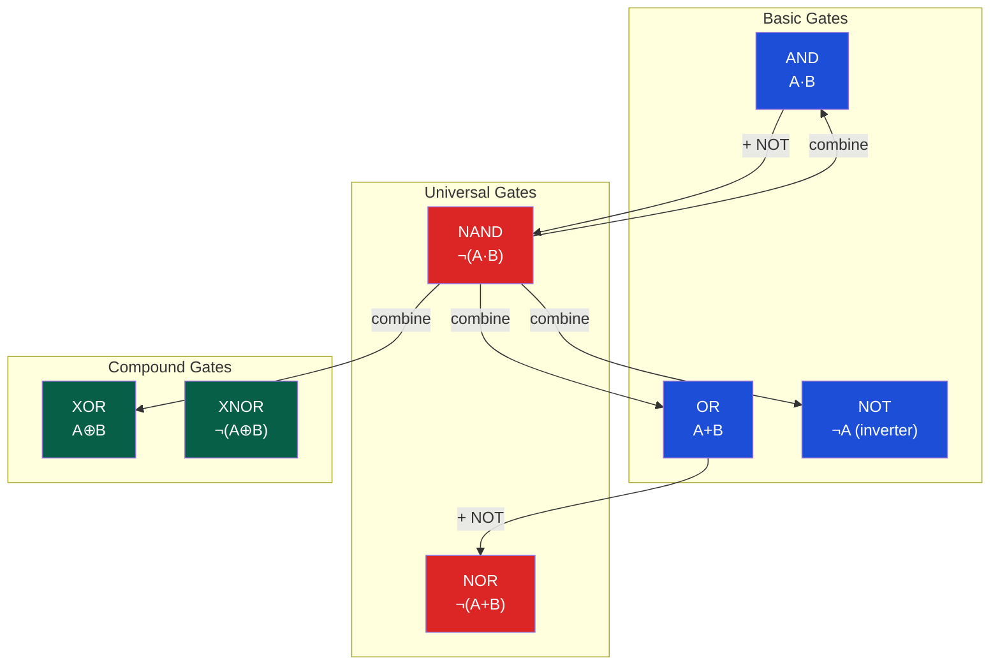

# ⚡ Boolean Algebra and Logic Gates

> [!abstract] TL;DR
> Boolean algebra provides the mathematical foundation for digital logic: variables are 0 or 1, operations are AND/OR/NOT, and identities like De Morgan's (¬(A·B) = ¬A+¬B) enable gate-level transformations. NAND and NOR are universal gates — any Boolean function can be implemented using only NAND (or only NOR) gates. Karnaugh maps (K-maps) provide a systematic method to minimize Boolean expressions into minimal Sum-of-Products (SOP) or Product-of-Sums (POS) forms, reducing gate count and propagation delay.

## Intuition — analogy FIRST

Think of Boolean algebra like English grammar — just as grammar rules let you rewrite sentences while preserving meaning ("It is not cold OR wet" ↔ "It is not (cold AND wet)"), Boolean identities let you rewrite logic expressions while preserving truth-table behavior. De Morgan's law is exactly this linguistic duality: a NAND gate is an AND-then-NOT, which equals OR-of-NOTs. This is why NAND gates are universal — you can build any logic function by rewriting the expression using only NAND operations.

---

## How It Works

### Gate Taxonomy



### Truth Tables

| A | B | AND | OR | NAND | NOR | XOR | XNOR |
|---|---|-----|----|------|-----|-----|------|
| 0 | 0 |  0  |  0 |   1  |  1  |  0  |   1  |
| 0 | 1 |  0  |  1 |   1  |  0  |  1  |   0  |
| 1 | 0 |  0  |  1 |   1  |  0  |  1  |   0  |
| 1 | 1 |  1  |  1 |   0  |  0  |  0  |   1  |

---

## Key Concepts / Details

### Boolean Identities

| Law | AND form | OR form |
|-----|----------|---------|
| Identity | A · 1 = A | A + 0 = A |
| Null | A · 0 = 0 | A + 1 = 1 |
| Idempotent | A · A = A | A + A = A |
| Complement | A · ¬A = 0 | A + ¬A = 1 |
| De Morgan's | ¬(A·B) = ¬A + ¬B | ¬(A+B) = ¬A · ¬B |
| Absorption | A · (A+B) = A | A + (A·B) = A |
| Distributive | A(B+C) = AB+AC | A+(BC) = (A+B)(A+C) |
| Consensus | AB+¬AC+BC = AB+¬AC | (A+B)(¬A+C)(B+C) = (A+B)(¬A+C) |

### De Morgan's Law — Key Application

De Morgan's is the **most important** identity for hardware design:
- ¬(A·B) = ¬A + ¬B → NAND = negative-OR
- ¬(A+B) = ¬A · ¬B → NOR = negative-AND

This means: **pushing a bubble through a gate changes AND↔OR**.

```
NAND gate:  [A]─┐         [¬A]─┐
             AND─►○    =        OR─
[B]─┘         [¬B]─┘
```

### Karnaugh Maps (K-maps)

K-maps exploit the **Gray code adjacency** property (adjacent cells differ in exactly one variable) to identify groups of 1s that represent shared logic:

**3-variable K-map example** for F(A,B,C):

```
      BC
AB  | 00 | 01 | 11 | 10 |
 00 |  1 |  1 |  0 |  0 |
 01 |  1 |  1 |  0 |  0 |
 11 |  0 |  0 |  1 |  1 |
 10 |  0 |  0 |  1 |  1 |
```

Grouping rules:
- Groups must be **powers of 2**: 1, 2, 4, 8, 16...
- Groups must be **rectangular** (with wrap-around allowed)
- Use **largest possible groups** (fewer literals)
- Every 1 must be **covered** by at least one group
- SOP: group the 1s; POS: group the 0s

Result: F = ¬B·¬C + B·C = ¬(B⊕C) = XNOR(B,C) when AB grouping is valid

### NAND as Universal Gate

Every Boolean expression can be built with only NAND gates:

```verilog
// NOT from NAND: A NAND A = ¬A
assign not_a = ~(a & a);     // NAND(A,A) = ¬A

// AND from NAND: NAND then NOT
assign a_and_b = ~(~(a & b)); // = A·B (double invert)

// OR from NAND (De Morgan): ¬A NAND ¬B = A OR B
assign a_or_b  = ~(~a & ~b);  // = A+B

// XOR from 4 NANDs:
wire n1 = ~(a & b);
wire n2 = ~(a & n1);
wire n3 = ~(b & n1);
assign xor_ab = ~(n2 & n3);   // A⊕B
```

### SOP vs POS Forms

| Property | SOP (Sum of Products) | POS (Product of Sums) |
|----------|----------------------|----------------------|
| Structure | AND terms OR'd together | OR terms AND'd together |
| From K-map | Group the 1s | Group the 0s |
| Gate realization | AND-OR (or NAND-NAND) | OR-AND (or NOR-NOR) |
| Minimized by | Consensus theorem | Dual consensus |
| Example | F = AB + ¬BC | F = (A+B)(¬B+C) |

### Logic Levels and Voltage

In CMOS technology:
- Logic 0 (LOW): 0 to ~0.3 VDD
- Logic 1 (HIGH): ~0.7 VDD to VDD
- Undefined zone: 0.3–0.7 VDD (noise margin)

Propagation delay tpd: time from input change to output settling. Critical path = longest delay path in combinational circuit.

---

## Real-World Notes

- Modern chips use CMOS (Complementary MOS): PMOS pull-up + NMOS pull-down networks mirror each other (De Morgan's physically realized)
- NAND gates have lower delay than NOR in CMOS because NMOS has ~2× mobility of PMOS
- FPGAs use 4–6 input LUTs (Look-Up Tables) instead of individual gates — each LUT is a 16/64-bit truth-table ROM
- Standard cell libraries have pre-characterized gate delays for every process corner (slow/fast/typical, hot/cold/nominal)
- Timing analysis tools (Synopsys PrimeTime) find the critical path by summing gate delays through the combinational cone

---

## Common Pitfalls

1. **Forgetting wrap-around in K-maps** — The left and right columns of a K-map are adjacent (Gray code wraps), missing this leaves larger groupings undiscovered
2. **De Morgan's direction** — ¬(A·B) = ¬A+¬B, NOT ¬A·¬B. Misapplication generates incorrect simplifications
3. **XOR is not associative with NOT** — ¬(A⊕B) ≠ ¬A⊕¬B; it equals A⊕¬B = ¬(A⊕¬B)… always verify with truth table
4. **NAND-NAND ≠ arbitrary AND-OR** — The conversion works only if all intermediate signals are inverted consistently; mixed-inversion paths break the identity
5. **Bubble pushing errors** — When converting gates using De Morgan's, every bubble must be matched (bubble at input requires bubble at output on the other side)

---

## Related Concepts

- [[_MOC_Digital_Logic|↑ Digital Logic MOC]]
- [[Combinational_Circuits]] — Gates compose into adders, muxes, ALUs
- [[Hardware_Description_Languages]] — Verilog synthesizes to gate-level netlists
- [[Sequential_Circuits_and_FSMs]] — Flip-flops are built from NAND/NOR latches
- [[../02_CPU_Architecture/CPU_Datapath_and_Control|CPU Datapath]] — Control unit implements Boolean logic over opcode bits

---

## Review Questions

1. Prove that NOR is a universal gate by showing how to construct AND, OR, and NOT from NOR gates only.
2. Minimize F(A,B,C,D) = Σm(0,2,5,7,8,10,13,15) using a K-map. What is the minimal SOP?
3. A circuit has glitches on its output during input transitions. What design technique (hint: static hazard) eliminates these, and what does it cost in gate count?

---

## Sources

- Wakerly, J.F. *Digital Design: Principles and Practices*, 5th ed.
- Patterson & Hennessy, *Computer Organization and Design*, Appendix B
- Harris & Harris, *Digital Design and Computer Architecture*, Ch. 2

#Computer_Architecture #Digital_Logic #Boolean_Algebra
