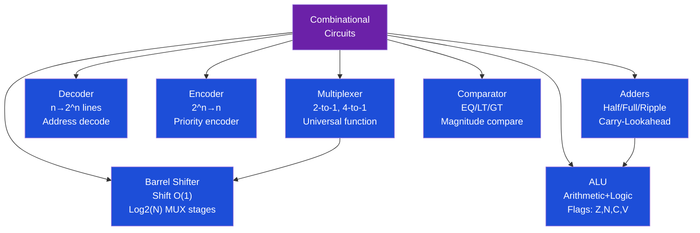
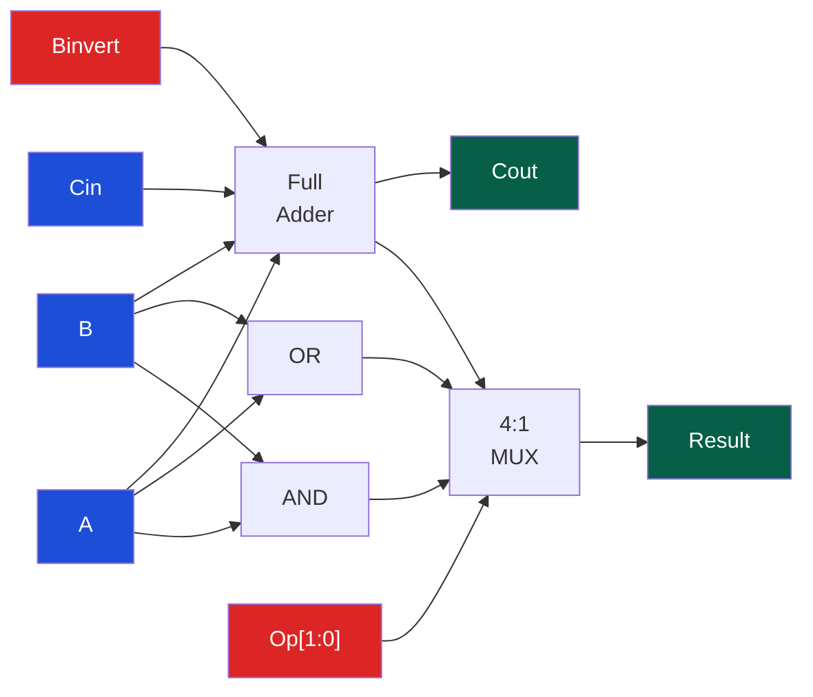
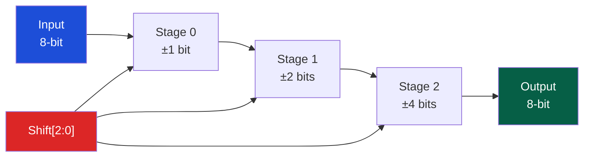

# 🔗 Combinational Circuits

> [!abstract] TL;DR
> Combinational circuits produce outputs that are purely a function of current inputs — no memory. Key building blocks: multiplexer (universal function generator — 2^n-to-1 MUX implements any n+1-variable function), adder (ripple-carry O(N) delay, carry-lookahead O(log N) delay by computing carries in parallel), ALU (combines adder/subtractor/logic ops, uses carry-in for subtraction via two's complement), barrel shifter (performs shift-by-N in O(1) using a grid of MUXes). Adder delay is the critical path in most integer datapaths.

## Intuition — analogy FIRST

A MUX is like a railroad switch — the select signal determines which track (input) connects to the output. A carry-lookahead adder is like a chain of workers handing a box: ripple-carry has each worker wait for the previous one to finish, while CLA is like a supervisor who simultaneously tells each worker whether a carry will come, computed from the original inputs — breaking the sequential dependency.

---

## How It Works

### Circuit Taxonomy



---

## Key Concepts / Details

### Multiplexer — Universal Function Generator

A 2-to-1 MUX: `Out = S ? I1 : I0`

**MUX as universal function**: A 2^n-to-1 MUX can implement ANY Boolean function of n+1 variables by hardwiring the 2^n input lines to 0, 1, or one of the variables. Even smaller MUXes work with Shannon expansion:

```
F(A,B,C) = ¬A·F(0,B,C) + A·F(1,B,C)
         = ¬A·f0(B,C) + A·f1(B,C)
```
A 4-to-1 MUX (2 select bits) + any f0/f1 function implements any 3-variable function.

### Adder Circuits

**Half Adder** (no carry-in):
```
Sum   = A ⊕ B
Carry = A · B
```

**Full Adder** (with carry-in Cin):
```
Sum   = A ⊕ B ⊕ Cin
Cout  = AB + Cin(A⊕B) = majority(A, B, Cin)
```

**Ripple-Carry Adder (RCA)**: Chain N full adders. Carry must ripple from bit 0 to bit N−1.
- Delay: O(N) — specifically ~2N gate delays for N-bit add
- Area: O(N) — minimal, one FA per bit

**Carry-Lookahead Adder (CLA)**: Compute all carries simultaneously.

Generate and Propagate terms:
```
Gᵢ = Aᵢ · Bᵢ          // bit i definitely generates carry
Pᵢ = Aᵢ ⊕ Bᵢ          // bit i propagates incoming carry

Cᵢ₊₁ = Gᵢ + Pᵢ·Cᵢ    // recursive, but expand:

C₁ = G₀ + P₀·C₀
C₂ = G₁ + P₁·G₀ + P₁·P₀·C₀
C₃ = G₂ + P₂·G₁ + P₂·P₁·G₀ + P₂·P₁·P₀·C₀
```

All carries computed in parallel → O(log N) delay. Trade-off: more wires and logic.

| Adder Type | Delay | Area | Used When |
|------------|-------|------|-----------|
| Ripple-Carry | O(N) | O(N) minimal | FPGAs, small widths |
| Carry-Lookahead | O(log N) | O(N log N) | High-speed CPUs |
| Carry-Select | O(√N) | O(N) moderate | Mid-speed balance |
| Prefix (Kogge-Stone) | O(log N) minimal depth | O(N log N) max wires | Leading CPUs (Intel/AMD) |

### ALU (Arithmetic Logic Unit)

The ALU is the computational heart of the CPU. A 1-bit ALU slice:



ALU operations controlled by `Op` + `Binvert` + `CarryIn`:

| Op | Binvert | CarryIn | Operation |
|----|---------|---------|-----------|
| 00 | 0 | 0 | AND |
| 01 | 0 | 0 | OR |
| 10 | 0 | 0 | ADD |
| 10 | 1 | 1 | SUB (A − B = A + ¬B + 1) |
| 11 | 1 | 1 | SLT (set-less-than, uses sign bit) |

**ALU status flags**:
- **Z (Zero)**: NOR of all result bits
- **N (Negative)**: MSB of result (sign bit)
- **C (Carry)**: Cout from MSB adder
- **V (oVerflow)**: C_out ⊕ C_in at sign bit (signed overflow)

### Barrel Shifter

Shifts by arbitrary amount N in O(1) using log₂(N) stages of MUXes:

```
// 8-bit barrel shifter (left shift by 0..7)
// Stage 0: shift by 1 if shift[0]=1
// Stage 1: shift by 2 if shift[1]=1
// Stage 2: shift by 4 if shift[2]=1

Stage 0: out[i] = shift[0] ? in[i-1] : in[i]   (shift by 1)
Stage 1: out[i] = shift[1] ? in[i-2] : in[i]   (shift by 2)
Stage 2: out[i] = shift[2] ? in[i-4] : in[i]   (shift by 4)
```

Each stage is a bank of N 2-to-1 MUXes. For N-bit data, needs log₂(N) stages.



---

## Real-World Notes

- Modern CPUs (x86, ARM) use Kogge-Stone or Brent-Kung prefix adder trees — fully parallel carries with 2·log₂(N)−1 levels
- A 64-bit CLA adder has about 14 gate-delay levels vs ~130 for ripple-carry
- FPGA carry chains (Xilinx carry4, carry8) implement ripple-carry in dedicated fast routing, achieving ~100 ps/stage — effectively O(N) but with tiny constant
- ALUs in modern OOO cores have multiple functional units: integer ALU, load-store AGU, FP/SIMD unit, branch unit — all running in parallel
- Barrel shifters are combined with rotate and sign-extension logic to form the full shifter unit

---

## Common Pitfalls

1. **MUX select width** — A 4-to-1 MUX needs 2 select bits, not 1. Off-by-one in select width is a common HDL bug
2. **Ripple-carry timing** — Adding ripple-carry in a high-speed design violates timing closure; the synthesizer may or may not infer CLA automatically
3. **Overflow vs carry** — Carry C is useful for unsigned arithmetic; Overflow V is for signed. Using C for signed overflow detection gives wrong results
4. **Barrel shifter boundary** — Shifting by N where N ≥ data width is undefined; hardware typically wraps or zeroes out depending on design
5. **SLT using just sign bit** — Set-less-than only reads the sign bit; overflow must be XORed with the sign bit for correct signed comparison

---

## Related Concepts

- [[_MOC_Digital_Logic|↑ Digital Logic MOC]]
- [[Boolean_Algebra_and_Logic_Gates]] — Gate-level building blocks
- [[Arithmetic_Circuits_and_IEEE754]] — Extends adder to multiply, FP
- [[Sequential_Circuits_and_FSMs]] — Combinational + registers = pipeline stage
- [[../02_CPU_Architecture/CPU_Datapath_and_Control|CPU Datapath]] — ALU is the centerpiece of the datapath

---

## Review Questions

1. Show how to implement a 3-input majority function using only a 4-to-1 MUX (no additional gates).
2. A 64-bit ripple-carry adder has gate delay of 200 ps/FA. A CLA has 5 gate levels at 100 ps/gate. At what bit-width does CLA become faster?
3. Design the carry-select adder for 16 bits: what is its depth and area trade-off versus CLA?

---

## Sources

- Patterson & Hennessy, *Computer Organization and Design*, Appendix B.5–B.6
- Harris & Harris, *Digital Design and Computer Architecture*, Ch. 5
- Weste & Harris, *CMOS VLSI Design*, Ch. 11

#Computer_Architecture #Digital_Logic #Combinational_Circuits
