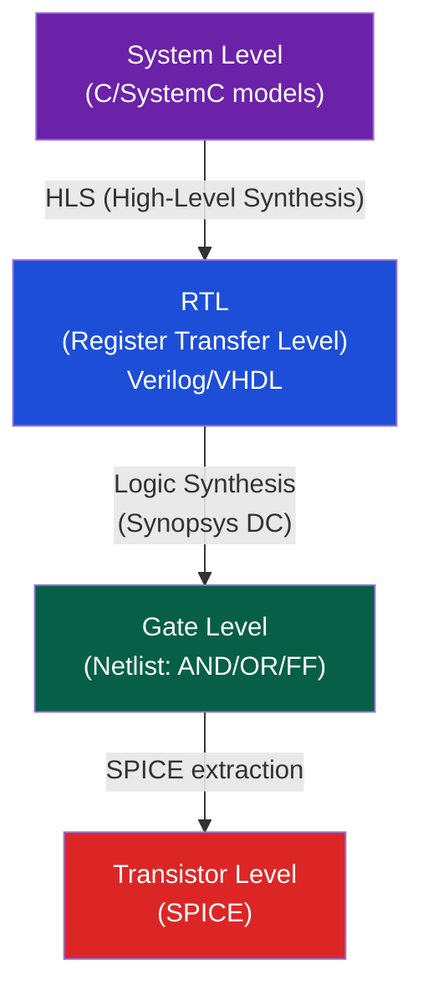

# 💻 Hardware Description Languages (Verilog)

> [!abstract] TL;DR
> Hardware Description Languages (HDLs) describe digital circuits as concurrent, event-driven code — fundamentally different from sequential software. Verilog's critical distinction: blocking assignment (=) executes immediately in sequence within a procedural block (use for combinational logic), while non-blocking assignment (<=) schedules updates to occur at end of time-step (use for sequential/clocked logic). Synthesis tools convert RTL Verilog into gate-level netlists; simulation tools (Verilator, ModelSim) verify functional behavior. Testbenches apply stimuli and check outputs using `$monitor`, assertions, and waveform dumps.

## Intuition — analogy FIRST

Verilog is not a program — it describes hardware that all runs simultaneously. Think of Verilog modules like blueprints for rooms in a building: multiple rooms operate independently and in parallel. The `always` block is like a room's "behavior rule" — it fires when its sensitivity list changes, like a sensor-activated light. Non-blocking assignment (<=) is like posting mail: all letters are sent simultaneously at the "end of the postal day" (end of time-step), so each letter sees the original values.

---

## How It Works

### Verilog Abstraction Levels



### Module Structure

```verilog
module adder #(parameter N = 8) (  // parameterized
    input  wire [N-1:0] a, b,
    input  wire         cin,
    output wire [N-1:0] sum,
    output wire         cout
);
    assign {cout, sum} = a + b + cin;  // continuous assignment
endmodule
```

### Blocking vs Non-Blocking — The Critical Distinction

```verilog
// BLOCKING (=): sequential, use for COMBINATIONAL logic
always @(*) begin
    a = b;      // a gets current value of b
    c = a;      // c gets new value of a (= old b)
    // Result: c = b (old)
end

// NON-BLOCKING (<=): parallel, use for SEQUENTIAL (clocked) logic
always @(posedge clk) begin
    a <= b;     // schedules: a := current b (at end of timestep)
    c <= a;     // schedules: c := current a (old value)
    // Result: c = old_a, a = old_b (swap behavior!)
end
```

**Why the difference matters**:

| Scenario | Use | Why |
|----------|-----|-----|
| Combinational logic (always @(*)) | Blocking = | Ensures correct sequential dependency modeling |
| Register update (always @(posedge clk)) | Non-blocking <= | All FFs update simultaneously, models real hardware |
| Temporary variable in sequential | Blocking = | Intermediate computation within one FF's always block |

A pipeline register using blocking = would model a transparent latch (data flows through in one timestep), not the intended edge-triggered behavior.

### Data Types

```verilog
wire   [7:0] bus;      // combinational connection (no state)
reg    [7:0] counter;  // holds value between always blocks (not necessarily a FF!)
logic  [7:0] sig;      // SystemVerilog: unified wire/reg (preferred)

integer i;             // 32-bit signed (for loop variables)
real    f;             // floating-point (simulation only, not synthesizable)

parameter W = 8;       // compile-time constant
localparam IDLE = 2'b00; // local parameter (inside module)
```

### Always Blocks

```verilog
// Combinational: triggered by any input change
always @(*) begin        // or always_comb in SV
    case (op)
        2'b00: y = a & b;
        2'b01: y = a | b;
        2'b10: y = a ^ b;
        default: y = 8'b0;  // MUST have default to avoid latch!
    endcase
end

// Sequential: triggered by clock edge
always @(posedge clk or negedge rst_n) begin  // async active-low reset
    if (!rst_n)
        q <= 8'b0;
    else
        q <= d;
end
```

### Structural (Gate-Level) vs Behavioral

```verilog
// STRUCTURAL: explicit gate instantiation
and u0(out, a, b);
nand u1(tmp, a, b);
or  u2(result, tmp, c);

// BEHAVIORAL: describe what, not how
assign result = (a & b) | (~(a & b) & c);
```

### Testbench Pattern

```verilog
`timescale 1ns/1ps    // time unit / time precision

module tb_adder;
    reg  [7:0] a, b;
    reg        cin;
    wire [7:0] sum;
    wire       cout;

    // Instantiate DUT
    adder #(8) dut (.a(a), .b(b), .cin(cin), .sum(sum), .cout(cout));

    // Clock (not needed for pure combinational)
    reg clk = 0;
    always #5 clk = ~clk;  // 10ns period = 100MHz

    initial begin
        $dumpfile("dump.vcd");    // waveform output
        $dumpvars(0, tb_adder);

        // Test vectors
        a = 8'd10; b = 8'd20; cin = 0; #10;
        $display("10+20=%0d, cout=%b", sum, cout);
        assert(sum == 8'd30) else $error("FAIL: sum mismatch");

        a = 8'd255; b = 8'd1; cin = 0; #10;
        assert(sum == 8'd0 && cout == 1) else $error("FAIL: overflow");

        $finish;
    end
endmodule
```

### Synthesis Flow

```mermaid
graph LR
    RTL["RTL Verilog\n(.v files)"]:::src
    ELAB["Elaboration\n(hierarchy flatten)"]:::tool
    SYNTH["Technology Mapping\n(DC / Yosys)"]:::tool
    NETLST["Gate Netlist\n(.v synthesized)"]:::out
    STA["Static Timing\nAnalysis (STA)"]:::verify
    APR["Place & Route\n(layout)"]:::impl
    GDS["GDSII\n(chip layout)"]:::final

    RTL --> ELAB --> SYNTH --> NETLST --> STA --> APR --> GDS

    classDef src fill:#1D4ED8,color:#fff
    classDef tool fill:#6B21A8,color:#fff
    classDef out fill:#065F46,color:#fff
    classDef verify fill:#DC2626,color:#fff
    classDef impl fill:#D97706,color:#fff
    classDef final fill:#065F46,color:#fff
```



### Verilator — Open-Source Simulation

```bash
# Convert Verilog to C++ for fast simulation
verilator --cc adder.v --exe tb.cpp --build -j4

# Run simulation
./obj_dir/Vadder

# With waveform tracing
verilator --cc adder.v --exe tb.cpp --trace --build
```

Verilator converts synthesizable Verilog to cycle-accurate C++ — 10–100× faster than event-driven simulators for large designs.

---

## Real-World Notes

- Industry tools: Synopsys Design Compiler (synthesis), Cadence Innovus (P&R), Synopsys VCS/Cadence Xcelium (simulation)
- Open-source: Yosys (synthesis), Verilator (simulation), OpenROAD (P&R) — full open-source ASIC flow
- SystemVerilog (SV) is the modern superset: adds `logic`, `always_comb`, `always_ff`, `interface`, `class`, assertions (SVA), coverage
- Lint tools (Spyglass, Synopsys Lint) catch CDC issues, reset issues, and non-synthesizable constructs before synthesis
- The `$display` / `$monitor` / `$finish` system tasks are simulation-only — never synthesizable

---

## Common Pitfalls

1. **Blocking in sequential block** — Using = in `always @(posedge clk)` creates simulation races where the order of always blocks matters, leading to non-deterministic results that differ between simulation and silicon
2. **Incomplete sensitivity list** — Old Verilog style `always @(a, b)` missing a signal causes simulation mismatch from synthesis. Always use `always @(*)`
3. **Inferring latches** — Any `if` or `case` without a `default` clause in a combinational always block infers a latch. Synthesis warns; sometimes ignored
4. **Integer overflow in concat** — `{a, b}` concatenation: bit widths must be explicit. `a + b` in a 8-bit context silently truncates the carry
5. **#delay in synthesis** — `#10 a = b;` is a simulation delay, ignored by synthesis. Use clock edges for timing in real hardware

---

## Related Concepts

- [[_MOC_Digital_Logic|↑ Digital Logic MOC]]
- [[Boolean_Algebra_and_Logic_Gates]] — HDL synthesizes to gate-level Boolean
- [[Sequential_Circuits_and_FSMs]] — Flip-flops and FSMs are the primary HDL constructs
- [[Combinational_Circuits]] — Adder, MUX, ALU all described in RTL Verilog
- [[../02_CPU_Architecture/CPU_Datapath_and_Control|CPU Datapath]] — Full CPUs (RISC-V RV32I) are ~500 lines of Verilog

---

## Review Questions

1. Explain why this code swaps a and b correctly: `always @(posedge clk) begin a <= b; b <= a; end` — and why it fails with blocking assignments.
2. Write a 4-to-2 priority encoder in Verilog. What Verilog construct causes latch inference and how do you prevent it?
3. A synthesis tool reports "combinational loop detected" on your always block. What coding pattern commonly causes this and how do you fix it?

---

## Sources

- Palnitkar, S. *Verilog HDL*, 2nd ed., Chapters 3–7
- Harris & Harris, *Digital Design and Computer Architecture*, Appendix A (Verilog)
- Sutherland, S. *Synthesizing SystemVerilog*, Sutherland HDL

#Computer_Architecture #Digital_Logic #HDL #Verilog
