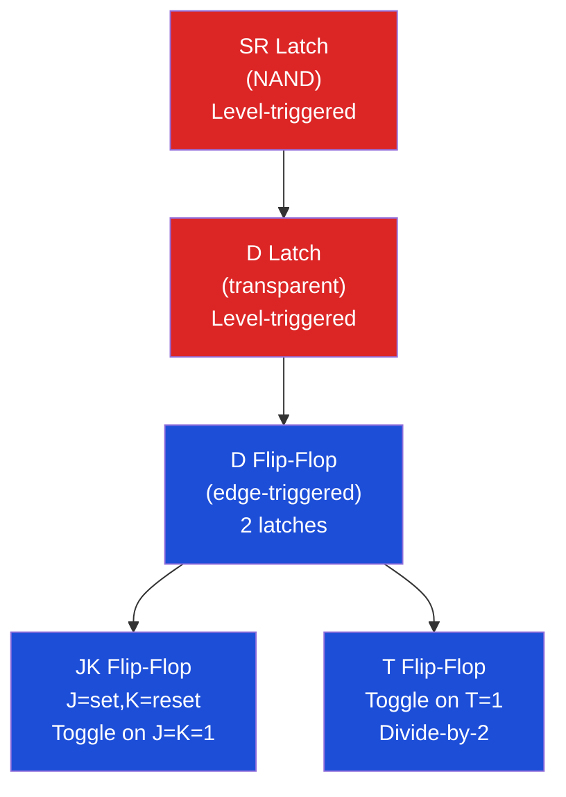
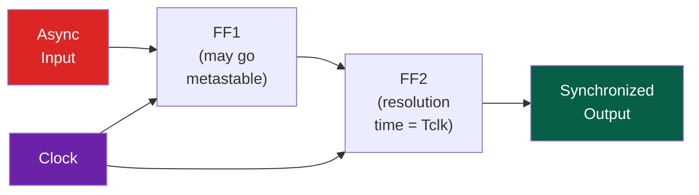
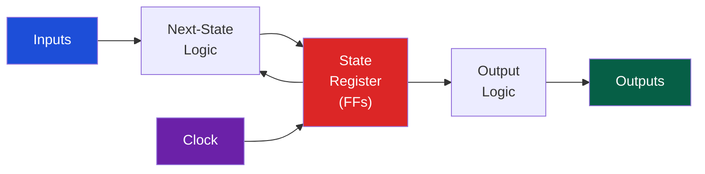

# 🔄 Sequential Circuits and FSMs

> [!abstract] TL;DR
> Sequential circuits add memory (state) to combinational logic. The D flip-flop is the canonical storage element: it captures input D on the rising clock edge, requiring setup time tsu before and hold time th after the clock edge. Violating either causes metastability — a probabilistic failure that can persist arbitrarily long (MTBF = exp(Tw/τ) / (f·fa)). Moore FSMs output only on state (clean, sync-safe); Mealy FSMs also use inputs (faster response, one fewer state). Synchronizer circuits (two cascaded FF) reduce metastability probability when crossing clock domains.

## Intuition — analogy FIRST

A D flip-flop is like a bank teller's drawer that snaps shut exactly at closing time (clock edge). Whatever is in your hand (D) at closing time is captured; what happens before or after doesn't matter — the drawer is sealed until the next day. Setup time = you must have your money ready before the drawer closes; hold time = don't snatch it back immediately after. Metastability = arriving exactly at closing time — the drawer opens halfway and oscillates.

---

## How It Works

### Latch vs Flip-Flop



### D Flip-Flop Internals

A positive-edge D flip-flop = master latch (active-low clock) + slave latch (active-high clock):

```
CLK=0: Master transparent, slave opaque  → D propagates into master
CLK=1: Master opaque, slave transparent  → master value captured into slave (output Q)
```

**Timing constraints**:
```
                    tsu  th
D  ──────────────────┤   ├──────────────
CLK ─────────────────┬───────────────────
                     ↑ edge
Q   ──────────────────────[tpd]──────────
```

- `tsu` (setup): D must be stable for at least tsu BEFORE clock edge
- `th` (hold): D must remain stable for at least th AFTER clock edge
- `tpd` (propagation): Q changes within tpd after clock edge

**Timing constraint for correct pipeline operation**:
```
Tclock ≥ tpd_FF + tpd_combo + tsu_FF
```
Violation of this = setup time violation → output arrives too late → miss the next cycle.

```
th_FF ≤ tpd_FF + tpd_combo_min
```
Violation = hold time violation → output changes too fast → overwrites before captured.

### Metastability

When D changes within the setup/hold window, the FF enters a metastable state — output is neither 0 nor 1 but an analog voltage that resolves randomly to 0 or 1 after some time:

```
MTBF = exp(Tw / τ) / (f_clock · f_async)
```
where:
- Tw = time window for resolution before next stage samples
- τ = flip-flop time constant (~50–200 ps for modern CMOS)
- f_clock = clock frequency
- f_async = rate of asynchronous input changes

**2-FF Synchronizer**: Chain two flip-flops with one full clock cycle between:



FF1 may go metastable, but has a full clock cycle (Tw = Tclk − tsu − th) to resolve before FF2 samples. MTBF improves exponentially with Tw.

### Moore vs Mealy FSMs

| Property | Moore FSM | Mealy FSM |
|----------|-----------|-----------|
| Output depends on | State only | State + current input |
| Output registered | Yes (state reg → output logic) | No (combinational on input+state) |
| Hazards/glitches | No (clocked outputs) | Yes (input glitches propagate) |
| States needed | Usually more | Fewer states |
| Latency | 1 extra cycle (registered) | 0 cycles (immediate) |
| Use case | Safe, synchronous outputs | Performance-critical, minimal states |

**Moore FSM Structure**:


**Mealy FSM**: Output logic takes both State AND Inputs as inputs.

### FSM Design Example — 3-bit sequence detector (detect "101")

States: S0(reset), S1(saw 1), S2(saw 10), S3(saw 101/output)

| Current State | Input | Next State | Output (Moore) |
|---------------|-------|------------|----------------|
| S0 | 0 | S0 | 0 |
| S0 | 1 | S1 | 0 |
| S1 | 0 | S2 | 0 |
| S1 | 1 | S1 | 0 |
| S2 | 0 | S0 | 0 |
| S2 | 1 | S3 | 0 |
| S3 | 0 | S2 | 1 |
| S3 | 1 | S1 | 1 |

State encoding: S0=00, S1=01, S2=10, S3=11

```verilog
module seq_detect(input clk, rst, x, output reg found);
  reg [1:0] state, nstate;
  always @(posedge clk or posedge rst)
    state <= rst ? 2'b00 : nstate;
  always @(*) begin
    case (state)
      2'b00: nstate = x ? 2'b01 : 2'b00;
      2'b01: nstate = x ? 2'b01 : 2'b10;
      2'b10: nstate = x ? 2'b11 : 2'b00;
      2'b11: nstate = x ? 2'b01 : 2'b10;
    endcase
  end
  assign found = (state == 2'b11); // Moore output
endmodule
```

---

## Real-World Notes

- **Clock domain crossing (CDC)** is one of the top causes of silicon bugs. Always use synchronizers (2 or 3 FF) for any asynchronous signal crossing
- **FIFO with gray-code pointers** is the standard method for multi-bit CDC — gray code ensures only 1 bit changes per transition, so the synchronized pointer is never corrupted to a random value
- Setup violations are fixed by reducing logic depth (pipeline deeper) or lowering clock frequency. Hold violations are fixed by adding delay (buffers) on the fast path — they cannot be fixed by changing the clock period
- Metastability is probabilistic — you can only improve MTBF, never eliminate it entirely. Mission-critical systems target MTBF > 10^9 seconds
- JK and T flip-flops are rarely used in modern digital design — all are synthesized as D flip-flops by the synthesis tool

---

## Common Pitfalls

1. **Latch inference in Verilog** — an incomplete `case` or `if-else` in combinational always block creates a latch. Always have a default assignment or `default:` case
2. **Forgetting reset logic** — FF without reset has unknown initial state. Simulation passes (X propagation), silicon may work or not
3. **Multi-bit CDC without gray code** — synchronizing a 2-bit counter that changes as 01→10 can briefly appear as 00 or 11 to the receiver
4. **Misidentifying setup vs hold violations** — setup = clock too fast (or path too slow); hold = extra buffers needed on fast path (no amount of slowing clock helps)
5. **Mealy glitches** — using Mealy outputs directly to drive external devices causes glitches when inputs change mid-cycle; register Mealy outputs through a FF

---

## Related Concepts

- [[_MOC_Digital_Logic|↑ Digital Logic MOC]]
- [[Boolean_Algebra_and_Logic_Gates]] — FF internals use Boolean logic
- [[Combinational_Circuits]] — Next-state logic is combinational
- [[Hardware_Description_Languages]] — Verilog always blocks model FF behavior
- [[../02_CPU_Architecture/Pipelining_and_Hazards|Pipelining]] — Pipeline registers are D flip-flops between stages

---

## Review Questions

1. A system runs at 1 GHz and has f_async = 1 MHz async inputs. The FF has τ = 100 ps. What is the approximate MTBF of a 2-FF synchronizer? How does adding a 3rd FF change it?
2. A Moore FSM for a traffic light has states (Red, Green, Yellow). Draw the state transition diagram and encode it in Verilog with a parameterized counter for timing.
3. You observe that a design passes timing in simulation but fails in silicon. The failure rate increases with temperature. Explain how this is consistent with a metastability issue.

---

## Sources

- Palnitkar, S. *Verilog HDL*, 2nd ed., Ch. 8–9
- Harris & Harris, *Digital Design and Computer Architecture*, Ch. 3
- Dally & Harting, *Digital Design Using VHDL*, CDC chapter

#Computer_Architecture #Digital_Logic #Sequential_Circuits #FSM
