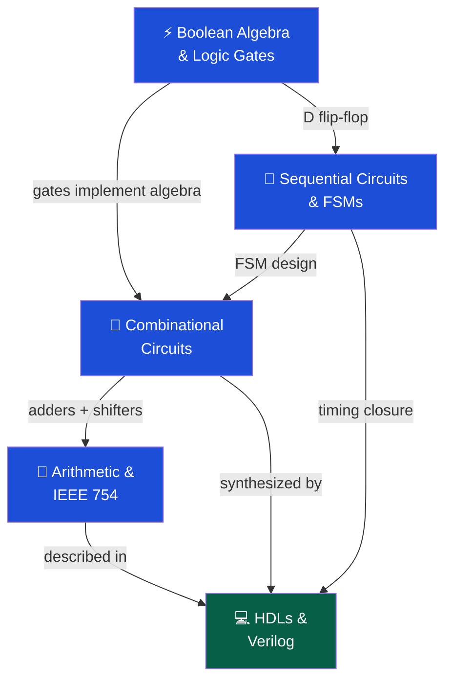

# ⚡ Digital Logic — Section MOC

> [!abstract] Section Overview
> Digital logic is the foundation of all computing hardware. This section covers the mathematical framework (Boolean algebra), the gate-level building blocks, how combinational and sequential circuits are composed into useful circuits (ALU, adders, FSMs), floating-point arithmetic (IEEE 754), and hardware description languages (Verilog) used to design and synthesize real chips.

---

## Concept Map

---

## Learning Path

1. [[Boolean_Algebra_and_Logic_Gates]] — Laws, De Morgan's, NAND/NOR universal
2. [[Combinational_Circuits]] — Mux, adders (ripple vs CLA), ALU, barrel shifter
3. [[Sequential_Circuits_and_FSMs]] — Flip-flops, timing, Moore/Mealy, metastability
4. [[Arithmetic_Circuits_and_IEEE754]] — Booth multiplication, Wallace tree, IEEE 754
5. [[Hardware_Description_Languages]] — Verilog syntax, blocking vs non-blocking, synthesis

---

## All Notes

| Note | Key Concepts | Difficulty |
|------|-------------|------------|
| [[Boolean_Algebra_and_Logic_Gates]] | De Morgan's, K-maps, SOP/POS, NAND universal | Beginner |
| [[Combinational_Circuits]] | Mux universal, CLA O(log N), ALU, barrel shifter | Beginner→Int |
| [[Sequential_Circuits_and_FSMs]] | Setup/hold, metastability, 2-FF sync, Moore vs Mealy | Intermediate |
| [[Arithmetic_Circuits_and_IEEE754]] | Booth, Wallace tree, sign/exp/mantissa, NaN/Inf | Intermediate |
| [[Hardware_Description_Languages]] | Blocking =, non-blocking <=, testbench, synthesis | Intermediate |

---

## Key Questions

1. Why is NAND a universal gate? What is the minimum NAND count for XOR?
2. How does carry-lookahead reduce adder depth from O(N) to O(log N)?
3. What is the difference between setup and hold time violations and how are they fixed?
4. How does IEEE 754 represent +0, -0, NaN, Inf, and denormals?
5. When must you use non-blocking assignments in Verilog?

---

## Related Sections

- [[_MOC_Computer_Architecture_Master|↑ Master MOC]]
- [[../02_CPU_Architecture/_MOC_CPU_Architecture|→ CPU Architecture]] — ALU and datapath use these circuits
- [[../05_Assembly_RISCV/_MOC_Assembly_RISCV|→ Assembly & RISC-V]] — ISA instructions map to these circuits

#Computer_Architecture #Digital_Logic #MOC
