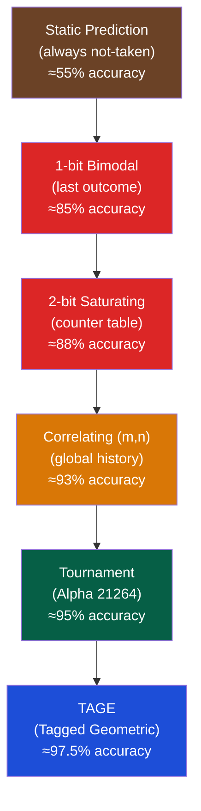
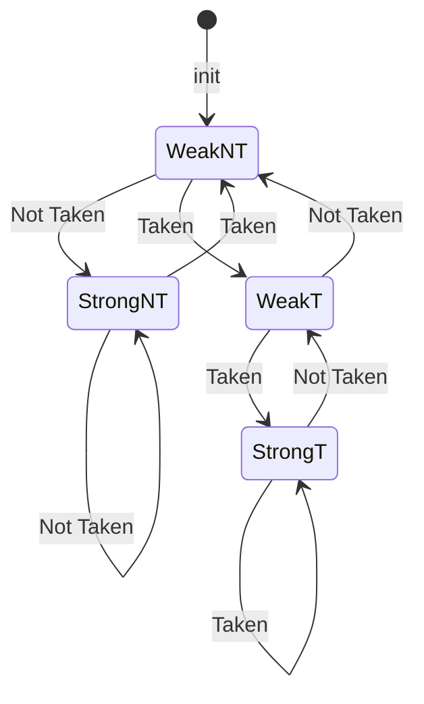
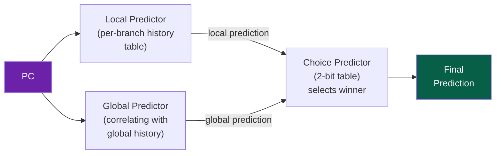

# 🔮 Branch Prediction

> [!abstract] TL;DR
> Branch prediction hides control hazards by speculatively fetching from the predicted target before the branch resolves. Misprediction cost = pipeline_depth − stages_to_resolve cycles flushed. A 1-bit predictor tracks last outcome; 2-bit saturating counter (00=StrongNT, 01=WeakNT, 10=WeakT, 11=StrongT) tolerates one misprediction per loop. Correlating (m,n) predictors use m last-branch outcomes to index into n-bit counters. TAGE (Tagged Geometric history length) is the state-of-the-art (≈97.5% accuracy). BTB (Branch Target Buffer) provides the predicted target PC so instruction fetch can proceed without decoding.

## Intuition — analogy FIRST

Branch prediction is like a weather forecaster: you don't know if it will rain tomorrow, but based on patterns (yesterday's weather, seasonal trends, recent history) you make a best guess and act on it (carry an umbrella). If wrong, you get wet (flush pipeline) and learn. The 2-bit saturating counter is "stubborn forecasting" — one wrong prediction doesn't flip the model, reducing thrashing in loops.

---

## How It Works

### Predictor Evolution



### 2-Bit Saturating Counter

Each entry is a 2-bit state machine:



States: `00`=StrongNT, `01`=WeakNT, `10`=WeakT, `11`=StrongT

Prediction: Take branch if state ≥ `10` (bit 1 = predict taken)

**Benefit over 1-bit**: A loop that iterates 100× only mispredicts 2× per loop call (first iteration and exit), not every other iteration.

### Bimodal Predictor (PHT — Pattern History Table)

```
PC[k:2] → index into PHT (2^k entries of 2-bit counters)

Prediction = PHT[PC[k:2]][bit 1]
Update:     PHT[PC[k:2]] += (taken ? +1 : -1), saturate at 0/3
```

**Problem**: Two branches that alias to the same PHT entry interfere with each other → destructive aliasing.

### Correlating Predictor (m, n)

Uses m-bit Global History Register (GHR) concatenated with PC bits to index the PHT:

```
GHR = last m branch outcomes (shift register)
Index = GHR[m-1:0] XOR PC[k+m-1:m]
Prediction = PHT[Index][bit 1]  (n-bit counter)

(2,2) predictor: 2-bit history, 2-bit counters, 2^(k+2) entries
```

**Why history helps**: `if(aa) if(bb) if(cc)` — the combination of a and b outcomes predicts c better than c's own history alone.

### Tournament Predictor (Alpha 21264 / AMD K8)

Combines a local predictor and a global predictor, with a choice predictor that selects which is more accurate per-branch:



Alpha 21264 local predictor: 1024-entry × 10-bit local history → 1024-entry × 3-bit counters
Global predictor: 4096-entry × 2-bit (indexed by 12-bit global history XOR PC)
Choice predictor: 4096-entry × 2-bit (updates toward whichever predictor was correct)

### TAGE — Tagged Geometric History Length

State-of-the-art predictor (Seznec, 2006). Uses multiple predictor tables with geometrically increasing history lengths:

```
T0: Base bimodal (short history)
T1: Tagged table, history length h1
T2: Tagged table, history length h2 = α·h1
T3: Tagged table, history length h3 = α·h2
T4: Tagged table, history length h4 = α·h3
(typically 4–8 tables, α ≈ 2)
```

Tags prevent aliasing: entry is only used if tag matches (partial PC tag). Longest matching history wins.

```
Index  = hash(PC, GHR[0:hi])   per table
Tag    = hash(PC, GHR[0:hi])   (different hash)
Match? = stored_tag == computed_tag
Result = longest-matching-table's 3-bit counter prediction
```

TAGE achieves ~97.5% accuracy on SPECint benchmarks.

### Branch Target Buffer (BTB)

BTB provides the predicted target PC (not just taken/not-taken) so the fetch unit can redirect immediately:

```
BTB structure:
┌──────────────┬─────────────┬────────────────┐
│  PC tag      │ Target PC   │ Branch Type    │
│  (partial)   │ (predicted) │ (direct/indir) │
└──────────────┴─────────────┴────────────────┘
- Indexed by PC[k:1]
- If miss: predict not-taken, fetch next sequential PC
- If hit:  fetch from BTB.TargetPC if predictor says taken
```

For indirect branches (function pointers, vtable calls): BTB stores last observed target, or use a separate Indirect Branch Target Predictor (IBTP) with history.

**Return Address Stack (RAS)**: dedicated stack for function return prediction. `call` pushes PC+4; `ret` pops → near-perfect return prediction (99%+).

### Misprediction Cost

```
Misprediction_penalty_cycles = pipeline_stages_until_branch_resolves

Example:
- 5-stage in-order: branch resolves at end of EX (stage 3) → 2 bubbles
- Modern OOO (Intel Skylake): ~15 cycle penalty
- AMD Zen 3: ~17 cycle penalty

Misprediction_CPI_impact = branch_rate × miss_rate × penalty_cycles

Example: 20% branches, 5% miss rate, 15 cycles penalty
= 0.20 × 0.05 × 15 = 0.15 CPI from branch mispredictions
```

| Predictor | Miss Rate | Penalty (15 stage) | CPI Impact (20% branches) |
|-----------|-----------|---------------------|---------------------------|
| Not-taken | ~40% | 15 | 1.20 |
| 2-bit bimodal | ~12% | 15 | 0.36 |
| Tournament (Alpha 21264) | ~5% | 15 | 0.15 |
| TAGE | ~2.5% | 15 | 0.075 |

---

## Real-World Notes

- Intel Skylake BTB: ~4096 entries + L2 BTB ~7000 entries. Instruction TLB + BTB work together for fast fetch
- Apple M1 branch predictor is believed to use TAGE with ~64KB of history tables — contributing to its exceptional single-thread performance
- Spectre attack (2018) exploits branch predictor training: attacker trains predictor to execute a speculative path that leaks secret data through cache side-channel. Mitigations (retpoline, IBRS, eIBRS) slow indirect branches significantly
- Competitive branch prediction challenge: CBP (Championship Branch Prediction) runs annually — state-of-the-art predictors use neural networks and perceptrons

---

## Common Pitfalls

1. **Aliasing in bimodal** — Two frequently-taken branches mapping to the same PHT entry interfere. Tagged predictors (TAGE) use partial tags to prevent this
2. **Cold-start (warmup)** — Branch predictor tables start with unknown state. Benchmarks must account for warm-up cycles; performance varies by working set
3. **Indirect branch prediction** — BTB only predicts the last-seen target. Highly polymorphic virtual dispatch (many call sites → many targets) defeats the BTB and requires speculative execution + verification
4. **Return Address Stack overflow** — Deep recursion overflows the RAS (typically 16–32 entries). Deeper call stacks reuse the same entry, causing mispredictions at function return
5. **Spectre-style training** — Malicious code can deliberately train the branch predictor from one security context to execute a speculatively-wrong path in another. Always validate user input before using it as branch condition

---

## Related Concepts

- [[_MOC_CPU_Architecture|↑ CPU Architecture MOC]]
- [[Pipelining_and_Hazards]] — Branch prediction eliminates control hazard stalls
- [[Superscalar_and_Out_of_Order_Execution]] — Mispredictions flush the entire ROB
- [[../03_Memory_Systems/Virtual_Memory_and_TLB|Virtual Memory]] — Spectre exploits BTB + cache timing, enabling Meltdown/Spectre variants

---

## Review Questions

1. A branch predictor has a 2-bit counter initialized to WeakNT. Trace the state after this sequence of branches: T, T, T, NT, T, NT, NT. What is the final prediction and how many mispredictions occurred?
2. Why does a 2-level (global history) predictor outperform bimodal for correlated branches? Give a concrete code example where `if(a) if(b) X` benefits from history.
3. The Spectre attack exploits branch prediction. Explain the attack mechanism step by step and why `LFENCE` is an effective mitigation for one Spectre variant.

---

## Sources

- Hennessy & Patterson, *Computer Architecture: A Quantitative Approach*, Ch. 3.3
- Seznec, A. & Michaud, P. "A Case for (Partially) Tagged Geometric History Length Branch Prediction", JILP 2006
- Kocher et al. "Spectre Attacks: Exploiting Speculative Execution", S&P 2019

#Computer_Architecture #CPU_Architecture #Branch_Prediction
