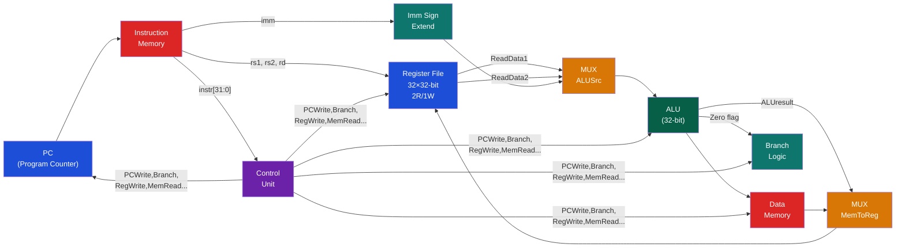
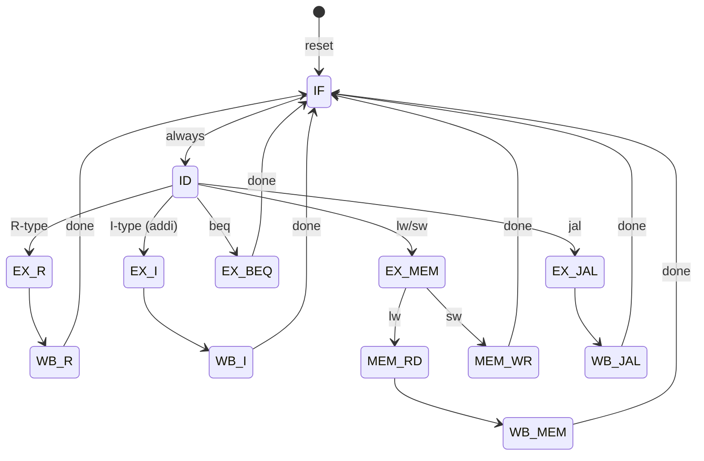

# 🔧 CPU Datapath and Control

> [!abstract] TL;DR
> The CPU datapath is the collection of hardware components that executes instructions: ALU (arithmetic and logic), register file (32 registers, 2 read ports, 1 write port), data memory, instruction memory, and their connecting multiplexers. The control unit decodes the instruction opcode/funct fields and generates control signals (RegWrite, MemRead, MemWrite, ALUSrc, MemToReg, Branch, ALUOp) as a truth table mapping. Single-cycle implementation executes each instruction in one clock cycle (limited by slowest instruction); multi-cycle shares hardware and uses a state machine FSM to sequence operations over multiple cycles.

## Intuition — analogy FIRST

The datapath is like a factory floor — conveyor belts (buses), machines (ALU, memory), and storage bins (registers). The control unit is the factory manager: it reads the work order (instruction), then flips switches (control signals) to route materials to the right machines. Single-cycle is like resetting the entire factory for each item; multi-cycle is like having the item visit only the stations it needs, sharing equipment between orders.

---

## How It Works

### Single-Cycle Datapath — RISC-V RV32I



### Control Unit Truth Table

The control unit is a combinational circuit: opcode → control signals

| Instruction | RegWrite | ALUSrc | MemRead | MemWrite | MemToReg | Branch | ALUOp |
|------------|----------|--------|---------|----------|----------|--------|-------|
| R-type (add,sub) | 1 | 0 | 0 | 0 | 0 | 0 | 10 |
| I-type (addi,ori) | 1 | 1 | 0 | 0 | 0 | 0 | 10 |
| lw | 1 | 1 | 1 | 0 | 1 | 0 | 00 |
| sw | 0 | 1 | 0 | 1 | X | 0 | 00 |
| beq | 0 | 0 | 0 | 0 | X | 1 | 01 |
| jal | 1 | 1 | 0 | 0 | 0 | 0 | 11 |

ALUOp → ALU Control (2nd-level decode):
```
ALUOp=00: ADD (for lw/sw address calculation)
ALUOp=01: SUB (for beq comparison)
ALUOp=10: Use funct3/funct7 (for R-type / I-type ALU ops)
ALUOp=11: ADD (PC+4 for JAL)
```

### Register File Implementation

```verilog
module regfile #(parameter N=32, W=5)(
    input  wire         clk,
    input  wire         we,        // write enable
    input  wire [W-1:0] ra1, ra2,  // read addresses
    input  wire [W-1:0] wa,        // write address
    input  wire [N-1:0] wd,        // write data
    output wire [N-1:0] rd1, rd2   // read data
);
    reg [N-1:0] regs [0:(1<<W)-1];
    initial regs[0] = 0;           // x0 = 0 hardwired

    // Asynchronous reads (combinational)
    assign rd1 = (ra1 == 0) ? 0 : regs[ra1];
    assign rd2 = (ra2 == 0) ? 0 : regs[ra2];

    // Synchronous write
    always @(posedge clk)
        if (we && wa != 0) regs[wa] <= wd;
endmodule
```

Features:
- 2 read ports (rs1 and rs2 simultaneously)
- 1 write port (rd on clock edge)
- x0 hardwired to 0 (reads return 0, writes ignored)
- Implemented as SRAM-like multi-ported register file in silicon

### Single-Cycle vs Multi-Cycle

| Property | Single-Cycle | Multi-Cycle |
|----------|-------------|-------------|
| Instructions/cycle | 1 | 1 |
| Cycles per instruction | 1 (always) | Varies by instruction |
| Clock period | Longest instruction (lw) | Shortest stage |
| Hardware sharing | No — duplicated instruction + data memory | Yes — 1 memory, 1 ALU |
| CPI | 1 | 3–5 (instruction-dependent) |
| Performance (IPC × Fclk) | Limited by lw path | Better balance |

**Single-cycle critical path** (for `lw`):
```
PC → IM → RegFile → ALU → DM → RegFile_write
 = tpc + tim + trf + talu + tdm + trf_setup
 ≈ 50ps + 200ps + 150ps + 200ps + 250ps + 20ps = 870ps
 → Clock period ≥ 870ps → Fclk ≤ 1.15 GHz

All other instructions are faster but must wait for 870ps clock!
```

**Multi-cycle** splits into 5 stages; each stage takes ~200ps:
```
IF: 200ps, ID: 200ps, EX: 200ps, MEM: 200ps, WB: 200ps
Clock period = 200ps → Fclk = 5 GHz
lw: 5 cycles × 200ps = 1ns total
R-type: 4 cycles × 200ps = 800ps total (skip MEM)
beq: 3 cycles × 200ps = 600ps total
```

### Multi-Cycle State Machine



### PC Update Logic

```verilog
// PC update: branch, jump, or PC+4
always @(*) begin
    case (1'b1)
        branch && zero:      pc_next = pc + imm_b;  // beq taken
        jump:                pc_next = pc + imm_j;  // jal
        jalr:                pc_next = rs1 + imm_i; // jalr (indirect)
        default:             pc_next = pc + 4;       // sequential
    endcase
end
```

---

## Real-World Notes

- Modern CPUs have fully pipelined datapaths (not single-cycle) with forwarding and hazard detection — the single-cycle model is pedagogically useful but not used in production
- The RISC-V "Rocket Core" (UC Berkeley) is a 5-stage in-order pipeline of ~10,000 lines of Chisel (Scala-based HDL) — synthesizes to ~100K gates
- Physical register files in modern CPUs (180+ entries, 8+ read ports, 4+ write ports) require multi-ported SRAM which is area and power expensive — this is why OOO CPUs limit physical register file size
- The PLA (Programmable Logic Array) or ROM-based control unit is used in CISC microcode engines — x86 internally decodes complex instructions to sequences of micro-ops using microcode ROM

---

## Common Pitfalls

1. **Control signal X (don't care)** — When an instruction doesn't use a resource (e.g., sw doesn't write register), control signals for that resource are don't-cares. Leaving them random can cause accidental writes
2. **Register file read-during-write** — If the same register is being written and read in the same cycle, what does the read return? (Depends on implementation — specify clearly; RISC-V pipelines typically use "new value" forwarding)
3. **Immediate sign extension width** — Extending a 12-bit I-type immediate to 32 bits requires sign-extending bit 11 into bits 31:12. Forgetting this gives wrong addresses for negative offsets
4. **Branch target addressing** — B-type immediate is in units of half-words (×2 implied), so the immediate field stores offset/2. Forgetting to left-shift by 1 gives wrong branch targets
5. **Single-cycle memory conflict** — A single memory can't be both instruction memory and data memory simultaneously. Single-cycle designs require separate I-mem and D-mem

---

## Related Concepts

- [[_MOC_CPU_Architecture|↑ CPU Architecture MOC]]
- [[ISA_Design_RISC_vs_CISC]] — ISA defines what the datapath must implement
- [[Pipelining_and_Hazards]] — Pipelining = multiple copies of datapath stages with registers between
- [[../01_Digital_Logic/Combinational_Circuits|Combinational Circuits]] — ALU, MUX, adder are the datapath components
- [[../01_Digital_Logic/Sequential_Circuits_and_FSMs|Sequential Circuits]] — Multi-cycle control unit is a Moore FSM

---

## Review Questions

1. Draw the complete datapath for the `jal rd, offset` instruction. Which control signals are active, and how is PC+4 stored in rd while PC jumps to PC+offset?
2. A single-cycle CPU has the following delays: I-mem 150ps, RegFile read 100ps, ALU 200ps, D-mem 250ps, RegFile write 50ps. What is the maximum clock frequency and the CPI for a mix of 25% lw and 75% R-type?
3. Design the multi-cycle state machine transitions for the `jalr rd, rs1, imm` instruction (jump to rs1+imm, store PC+4 in rd). How many states does it need?

---

## Sources

- Patterson & Hennessy, *Computer Organization and Design RISC-V Edition*, Ch. 4.1–4.4
- Harris & Harris, *Digital Design and Computer Architecture*, Ch. 7.1–7.4
- CVA6 RISC-V core: github.com/openhwgroup/cva6

#Computer_Architecture #CPU_Architecture #Datapath #Control_Unit
