# 📋 ISA Design — RISC vs CISC

> [!abstract] TL;DR
> An ISA (Instruction Set Architecture) is the contract between software and hardware: it defines registers, instruction formats, addressing modes, and memory model. RISC (load-store architecture, fixed-length instructions, large uniform register file, 32 registers) enables simple pipelining and fast decode. CISC (x86: variable-length 1–15 bytes, memory operands, few registers, complex addressing modes) evolved for code density and backward compatibility. RISC-V is a clean-slate open RISC ISA with six 32-bit instruction formats (R/I/S/B/U/J), 32 registers (x0 always zero), and a modular extension model (RV32I base + M, F, D, A, V extensions).

## Intuition — analogy FIRST

An ISA is like a language's grammar and vocabulary. RISC is like Basic English (850 core words, simple grammar — easy to learn and fast to speak). CISC is like full English with all idioms (one phrase can mean many things — efficient for writing, complex for understanding). RISC-V is designed from scratch in the "smartphone era" — no legacy baggage, just the essential grammar plus optional dialects (extensions).

---

## How It Works

### RISC vs CISC Comparison

```mermaid
graph LR
    subgraph RISC["RISC Philosophy"]
        R1["Fixed-length\n4 bytes/instruction"]:::risc
        R2["Load-store only\n(no mem operands)"]:::risc
        R3["32 registers\n(uniform)"]:::risc
        R4["Simple addressing\n(reg + immediate)"]:::risc
        R5["1 op per cycle\n(pipelining friendly)"]:::risc
    end
    subgraph CISC["CISC Philosophy"]
        C1["Variable-length\n1-15 bytes (x86)"]:::cisc
        C2["Memory operands\n(ADD [mem], reg)"]:::cisc
        C3["Few registers\n(8 in x86-32)"]:::cisc
        C4["Complex addressing\n([base+idx*scale+disp])"]:::cisc
        C5["Multi-cycle ops\n(microcode)"]:::cisc
    end
    RISC -->|"vs"| CISC

    classDef risc fill:#065F46,color:#fff
    classDef cisc fill:#DC2626,color:#fff
```



| Property | RISC (RISC-V, ARM) | CISC (x86-64) |
|----------|---------------------|---------------|
| Instruction width | Fixed 32-bit (or 16-bit compressed) | Variable 1–15 bytes |
| Register count | 32 (x0–x31) | 16 general-purpose (rax–r15) |
| Memory access | Only LOAD/STORE | Any instruction can access memory |
| Addressing modes | reg + sign-ext imm | base + index × scale + displacement |
| Operations | One operation per instruction | CISC: one instr can read mem + compute + writeback |
| Pipeline friendly | Yes (fixed decode, regular) | Complex (x86 decoded to micro-ops internally) |
| Code density | Moderate | High (short instructions for common ops) |

### RISC-V Instruction Formats

All RISC-V base (RV32I) instructions are exactly 32 bits. Six formats place fields consistently:

```
R-type: [31:25 funct7][24:20 rs2][19:15 rs1][14:12 funct3][11:7 rd][6:0 opcode]
I-type: [31:20 imm[11:0]        ][19:15 rs1][14:12 funct3][11:7 rd][6:0 opcode]
S-type: [31:25 imm[11:5]][24:20 rs2][19:15 rs1][14:12 funct3][11:7 imm[4:0]][6:0 opcode]
B-type: [31:25 imm[12|10:5]][24:20 rs2][19:15 rs1][14:12 funct3][11:7 imm[4:1|11]][6:0 opcode]
U-type: [31:12 imm[31:12]                                   ][11:7 rd][6:0 opcode]
J-type: [31:12 imm[20|10:1|11|19:12]                        ][11:7 rd][6:0 opcode]
```

Why the bit rearrangement in B/J? The sign bit (imm[12]/imm[20]) is always at position 31 — enabling sign extension with just a single wiring, no mux. The remaining bits minimize the hardware paths needed.

| Format | Used For | Example |
|--------|----------|---------|
| R | Register-register ops | `add rd, rs1, rs2` |
| I | Immediate ALU, loads | `addi rd, rs1, imm` `lw rd, offset(rs1)` |
| S | Stores | `sw rs2, offset(rs1)` |
| B | Conditional branches | `beq rs1, rs2, offset` |
| U | Upper immediate (20-bit) | `lui rd, imm` `auipc rd, imm` |
| J | Unconditional jump | `jal rd, offset` |

### RISC-V Register File

```
x0  / zero — hardwired 0, writes ignored
x1  / ra   — return address
x2  / sp   — stack pointer
x3  / gp   — global pointer
x4  / tp   — thread pointer
x5-x7  / t0-t2  — temporaries (caller-saved)
x8  / s0/fp     — saved / frame pointer (callee-saved)
x9  / s1        — saved (callee-saved)
x10-x11 / a0-a1 — function args / return values
x12-x17 / a2-a7 — function arguments
x18-x27 / s2-s11 — saved registers (callee-saved)
x28-x31 / t3-t6  — temporaries (caller-saved)
```

`x0` always reads as 0. Writing to `x0` is discarded. This enables many pseudo-instructions: `mv rd, rs` = `addi rd, rs, 0`; `ret` = `jalr x0, ra, 0`.

### Immediate Encoding

RISC-V immediate values are sign-extended from their format:
- I-type: 12-bit signed → range [-2048, 2047]
- B-type: 13-bit signed (multiples of 2) → branch range ±4KB
- U-type: 20-bit upper → combined with I-type to reach any 32-bit address:
  ```
  lui  t0, %hi(symbol)    # load upper 20 bits
  addi t0, t0, %lo(symbol) # add lower 12 bits (sign-extended)
  ```
- J-type: 21-bit signed (multiples of 2) → JAL range ±1MB

### x86-64 vs RISC-V Instruction Examples

```asm
; x86-64: add memory to register (CISC)
add rax, [rbx + rcx*8 + 0x100]   ; 3 operations in 1 instruction

; RISC-V equivalent (RISC): 3 separate instructions
slli t0, a1, 3        # t0 = rcx * 8
add  t1, a0, t0       # t1 = rbx + rcx*8
lw   t2, 256(t1)      # t2 = memory[rbx + rcx*8 + 256]
add  a0, a0, t2       # a0 = rax + memory[...]
```

CISC code is shorter (useful when memory bandwidth was scarce in 1970s). Modern x86 CPUs decode CISC instructions into micro-ops internally — effectively running a RISC core under the hood.

---

## Real-World Notes

- Intel Sandy Bridge and later translate x86 instructions to fixed-size micro-ops (μops) in the frontend — achieving RISC-like pipelining behind a CISC facade
- RISC-V is growing rapidly: used in Western Digital HDDs, ESP32-C3/C6 microcontrollers, SiFive HiFive boards, and NVIDIA's internal RISC-V management cores
- Apple M-series chips use ARM (RISC) but include custom ISA extensions (AMX matrix instructions, SVE-like NEON) — showing ISAs evolve with workloads
- RISC-V's open model means no license fee, enabling SoC vendors to modify the ISA without NDA

---

## Common Pitfalls

1. **Immediate sign-extension** — RISC-V sign-extends all immediates. If the lower 12 bits of an address have bit 11 set, `%lo` is negative, so `%hi` must be incremented by 1 to compensate: assemblers handle this with `%hi/%lo` pairs
2. **Branch range** — B-type has ±4KB range (13-bit offset). Long branches need a jump table or `jal` + `jalr` sequence
3. **PC-relative addressing** — `auipc` + `addi` computes PC-relative addresses. Forgetting `auipc` (using `lui` instead) gives absolute addresses that break position-independent code
4. **x86 register aliasing** — In x86-64, writing to `eax` (32-bit) zero-extends into `rax` (64-bit), but writing to `ax` (16-bit) does not zero-extend upper bits. This behavior confuses RISC programmers
5. **Pseudo-instructions in RISC-V** — `li rd, imm` is a pseudo that expands to 1 or 2 real instructions depending on immediate width; assembler handles it

---

## Related Concepts

- [[_MOC_CPU_Architecture|↑ CPU Architecture MOC]]
- [[CPU_Datapath_and_Control]] — Hardware that implements the ISA
- [[Pipelining_and_Hazards]] — Fixed-format ISA enables efficient pipelining
- [[../05_Assembly_RISCV/RISCV_ISA_Fundamentals|RISC-V ISA Fundamentals]] — Deep dive into all RV32I instructions
- [[../05_Assembly_RISCV/ABI_and_Calling_Conventions|ABI & Calling Conventions]] — Register usage conventions on top of ISA

---

## Review Questions

1. Why does RISC-V use bit-shuffled immediate encoding (imm[12|10:5] in B-type) instead of contiguous bits?
2. Design a minimal ISA that can implement any computable function with as few instruction types as possible (think: one-instruction computer SUBLEQ). What are the performance implications?
3. Given a RISC-V program that needs to load from address 0xDEADBEEF, write the exact instruction sequence using `lui`/`addi` and explain the sign-extension issue.

---

## Sources

- Patterson & Hennessy, *Computer Organization and Design RISC-V Edition*, Ch. 2
- Waterman, A. "Design of the RISC-V Instruction Set Architecture", PhD thesis, UC Berkeley (2016)
- RISC-V International, *RISC-V ISA Specification* v20191213

#Computer_Architecture #CPU_Architecture #ISA #RISC_V
