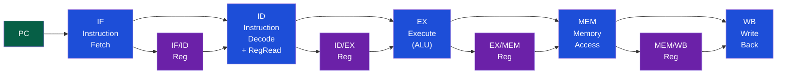
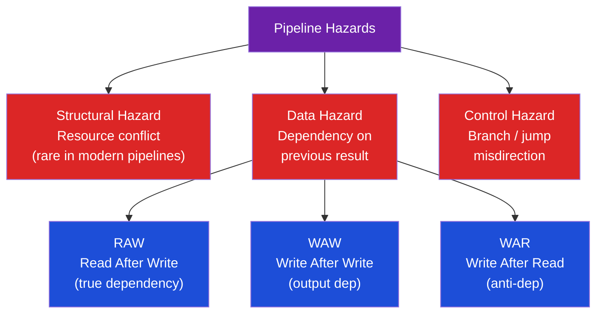

# ⚙️ Pipelining and Hazards

> [!abstract] TL;DR
> Pipelining overlaps execution of multiple instructions by splitting execution into stages (IF/ID/EX/MEM/WB). Ideal CPI=1, actual CPI = 1 + stall_rate where stalls come from hazards. Data hazards (RAW: read-after-write — most common, resolved by forwarding; WAW, WAR — only in OOO) require either stalling or forwarding (bypassing) results directly between pipeline stages. The load-use hazard cannot be fully eliminated by forwarding and requires one bubble. Control hazards from branches are handled by flushing the pipeline on misprediction (cost = pipeline_depth − 1 bubbles) or by branch prediction.

## Intuition — analogy FIRST

Pipeline is like a car wash with multiple stations: rinse → soap → scrub → rinse → dry. Car 2 enters rinse while car 1 is getting soap. Throughput improves N× over sequential processing. A hazard is when car 2 can't enter because car 1 is still blocking the next station — you either wait (stall/bubble) or design the stations so car 2 can "borrow" a result from car 1 mid-process (forwarding).

---

## How It Works

### 5-Stage Pipeline



**Pipeline registers** (IFID, IDEX, EXMEM, MEMWB) hold all information needed by downstream stages: instruction bits, PC, register values, ALU results, memory data, control signals.

### Pipeline Timing Diagram

```
Cycle:   1   2   3   4   5   6   7   8
Inst 1: IF  ID  EX  MEM  WB
Inst 2:     IF  ID  EX   MEM  WB
Inst 3:         IF  ID   EX   MEM  WB
Inst 4:             IF   ID   EX   MEM  WB
```
Throughput = 1 instruction/cycle (after fill), 5× speedup vs single-stage.

### Hazard Classification



| Hazard | Occurs When | 5-Stage Solution | OOO Solution |
|--------|-------------|-----------------|--------------|
| RAW | Inst reads reg written by recent inst | Forwarding + stall for load-use | Forwarding + Tomasulo wait |
| WAW | Two insts write same reg | Stall 2nd (not in-order) | ROB enforces in-order commit |
| WAR | Later inst writes, earlier reads | Not an issue in in-order pipeline | Register renaming eliminates |
| Structural | Two insts need same hardware | Stall | More functional units |
| Control | Branch changes PC | Flush + predict | Branch prediction |

### Data Forwarding (Bypassing)

Without forwarding, RAW requires 2 stall cycles. Forwarding sends the result from where it is generated directly to where it's needed:

```
add x1, x2, x3   # writes x1 in WB (cycle 5)
sub x4, x1, x5   # reads x1 in ID (cycle 3) — 2 cycles early!

Without forwarding: need 2 NOPs between them
With forwarding:    EX/MEM register → EX stage input MUX
```

**Forwarding paths (5-stage)**:
```
EX hazard:  IDEX.rs1 == EXMEM.rd → forward from EX/MEM.ALUresult
            IDEX.rs1 == MEMWB.rd  → forward from MEM/WB.ALUresult
MEM hazard: IDEX.rs1 == MEMWB.rd  → forward from MEM/WB.ReadData (load)
```

**Forwarding control logic** (simplified):
```verilog
// EX/MEM forwarding
if (EXMEM.RegWrite && EXMEM.rd != 0 && EXMEM.rd == IDEX.rs1)
    ForwardA = EX_FORWARD;
// MEM/WB forwarding
else if (MEMWB.RegWrite && MEMWB.rd != 0 && MEMWB.rd == IDEX.rs1)
    ForwardA = MEM_FORWARD;
else
    ForwardA = NO_FORWARD;
```

### Load-Use Hazard — The Unavoidable Bubble

```
lw  x1, 0(x2)   # load: data available AFTER MEM stage (cycle 4)
add x3, x1, x4  # needs x1 at start of EX stage (cycle 3!)
```

The data is not available even with forwarding (MEM hasn't happened yet when add needs EX). The hardware must:
1. **Stall** add for 1 cycle (insert a bubble)
2. Forward load data from MEM/WB to EX stage of add in the next cycle

```
Cycle:  1   2   3   4   5   6   7
lw:    IF  ID  EX  MEM  WB
add:       IF  ID  --- EX  MEM  WB  (stall in ID for 1 cycle)
next:          IF  --- ID  EX   MEM (stall propagates)
```

**Hazard detection unit** inserts bubble:
```verilog
if (IDEX.MemRead && (IDEX.rt == IFID.rs || IDEX.rt == IFID.rt))
    stall = 1;  // insert NOP, hold PC and IF/ID register
```

**Compiler optimization**: arrange code so independent instruction fills the load-delay slot:
```asm
lw   x1, 0(x2)
add  x5, x6, x7   # independent instruction fills delay slot
add  x3, x1, x4   # now safe: lw completed 2 cycles ago
```

### Control Hazards

When a branch is taken, instructions fetched after the branch (in IF and ID stages) must be flushed:

```
beq x1, x2, target   # branch resolved in EX (cycle 3)
inst2                 # fetched in cycle 2 — must flush if taken
inst3                 # fetched in cycle 3 — must flush if taken
```

**Cost**: 2 cycles wasted (flushed) per taken branch in 5-stage pipeline.

Solutions:
| Approach | CPI Impact | Method |
|----------|-----------|--------|
| Stall until resolved | +2 per branch | Simple, very slow |
| Predict not-taken | +2 on taken (~40%) | Flush if taken |
| Predict taken | +2 on not-taken (~60%) | Harder to implement |
| Delayed branch (MIPS) | 0 (ISA-visible) | Execute 1 instruction after branch always |
| Branch prediction | +misprediction × miss_rate | See [[Branch_Prediction]] |

### CPI Formula

```
CPI_actual = 1 + stalls_per_instruction

stalls_per_instruction = (load_use_rate × 1) + (branch_stall_rate × penalty)

Example: 20% loads with 50% use-next → 0.10 stalls/inst from loads
         15% branches with 40% taken, no prediction → 0.06 stalls/inst
         Total CPI ≈ 1 + 0.10 + 0.06 = 1.16
```

---

## Real-World Notes

- Modern x86 CPUs have 14–19 pipeline stages (Skylake: 14-20 stages). Deeper pipelines = higher clock frequency but longer branch misprediction penalty
- ARM Cortex-A53 (in-order) has 8 stages. Apple M1 (OOO) has a ~16-stage front-end
- Intel's P6 microarchitecture (1995) introduced register renaming and OOO — the fundamental breakthrough for modern high-performance CPUs
- RISC-V pipeline implementations include VexRiscv (FPGA), CVA6 (industrial-grade OOO), Rocket Core (in-order 5-stage)
- Load-to-use latency is 4–5 cycles in modern CPUs (L1 cache hit = ~4 cycles), so even cached loads create stalls

---

## Common Pitfalls

1. **WAW/WAR are not hazards in simple in-order pipelines** — They only arise in multiple-issue or OOO pipelines. In 5-stage single-issue in-order, they don't exist
2. **Forwarding doesn't eliminate all data hazards** — Load-use always needs 1 bubble regardless of forwarding
3. **Branch delay slot (MIPS)** — MIPS architecture exposes the delay slot to software; RISC-V does not (it hides control hazards in hardware). Converting MIPS code to RISC-V requires removing delay slot NOPs
4. **Forwarding from x0** — In RISC-V, forwarding checks must exclude rd=x0 (hardwired zero). A write to x0 with forwarding would incorrectly forward 0 to all consumers
5. **Structural hazards with single-memory** — A single combined instruction+data memory creates a structural hazard. Separate I-cache and D-cache (Harvard architecture within the pipeline) eliminates this

---

## Related Concepts

- [[_MOC_CPU_Architecture|↑ CPU Architecture MOC]]
- [[CPU_Datapath_and_Control]] — Datapath implements the pipeline stages
- [[Branch_Prediction]] — Eliminates most control hazard stalls
- [[Superscalar_and_Out_of_Order_Execution]] — OOO resolves data hazards more aggressively
- [[../03_Memory_Systems/Cache_Hierarchy|Cache Hierarchy]] — L1 cache miss creates many stall cycles

---

## Review Questions

1. Trace the pipeline execution diagram for: `lw x1, 0(x2)` / `sub x3, x1, x4` / `add x5, x1, x6`. Mark where forwarding occurs and where stalls are inserted.
2. A 12-stage pipeline has 25% branches, 10% misprediction rate. What is the CPI contribution from branch mispredictions alone?
3. Show the forwarding unit Verilog logic that handles both double-hazard (same register written by two recent instructions) and load-use hazard detection simultaneously.

---

## Sources

- Patterson & Hennessy, *Computer Organization and Design RISC-V Edition*, Ch. 4
- Hennessy & Patterson, *Computer Architecture: A Quantitative Approach*, Ch. 3
- Harris & Harris, *Digital Design and Computer Architecture*, Ch. 7

#Computer_Architecture #CPU_Architecture #Pipelining #Hazards
