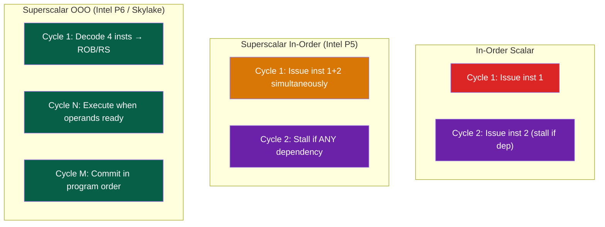
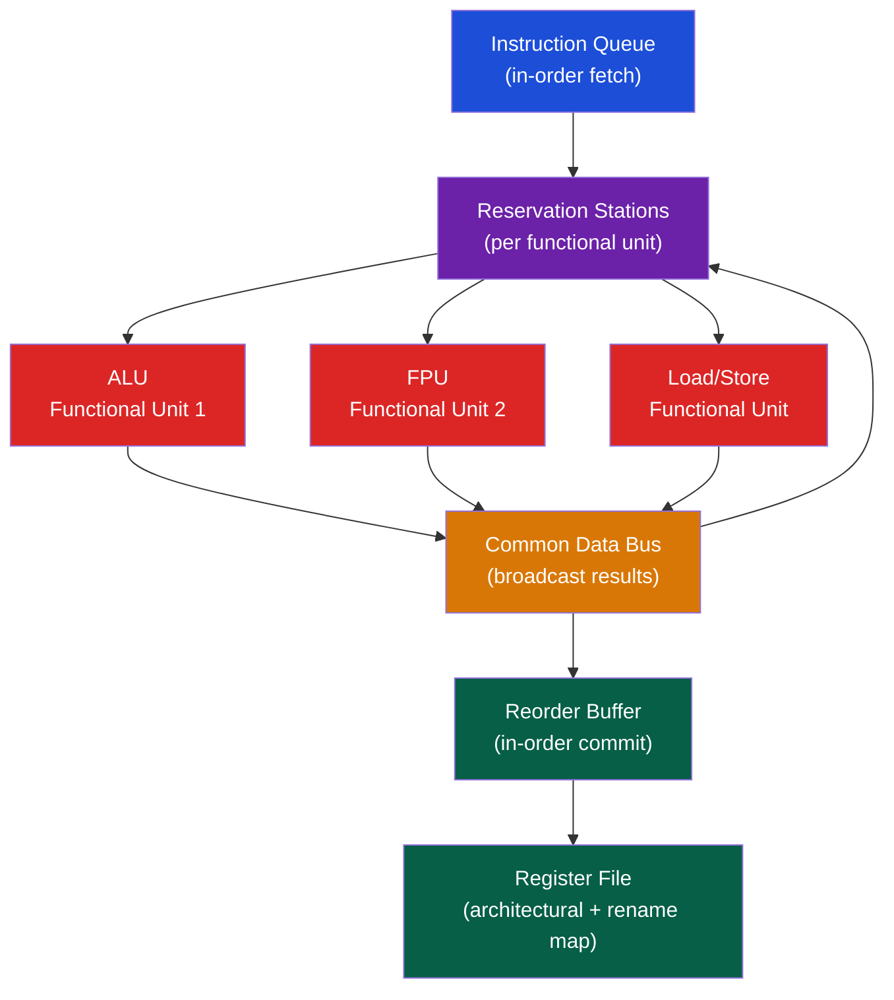

# 🚀 Superscalar and Out-of-Order Execution

> [!abstract] TL;DR
> Superscalar CPUs issue multiple instructions per cycle (IPC > 1). Out-of-order execution (OOO) dynamically reorders instructions around hazards while maintaining precise exceptions via in-order commit through the Reorder Buffer (ROB). Tomasulo's algorithm uses reservation stations (hold operands until ready) and a Common Data Bus (CDB) to broadcast results. WAW and WAR hazards are eliminated by register renaming (architectural → physical register file). The ROB holds speculative results; it commits instructions to the architectural state only in-order.

## Intuition — analogy FIRST

OOO execution is like a restaurant kitchen: orders (instructions) come in sequentially, but the chef doesn't wait for the pasta to boil before starting the salad. Each cooking station (functional unit) works on what's available. The waiter (ROB) tracks which orders came first and serves them in the original order to the customer, even though the kitchen produced them out-of-order. Register renaming is like giving each ingredient a unique batch label — two chefs can't accidentally use each other's ingredient.

---

## How It Works

### Superscalar vs In-Order Pipeline



### Tomasulo's Algorithm

Developed by Robert Tomasulo at IBM in 1967 for the IBM 360/91 floating-point unit.

**Key components**:



### Algorithm Steps

**1. Issue (Dispatch)**:
- Decode instruction, allocate ROB entry + Reservation Station entry
- If operand is ready in register file: copy value to RS
- If operand not ready: store the ROB tag (which will produce it)
- Register rename: destination register maps to new ROB entry

**2. Execute**:
- RS monitors CDB: when a tag matches a pending operand, capture value
- When all operands ready, RS issues to functional unit
- Instructions execute out-of-order based on operand availability

**3. Write Result (Common Data Bus)**:
- Functional unit broadcasts (tag, value) on CDB
- ALL reservation stations and ROB entries simultaneously check tag and latch value
- RS frees entry; ROB entry marked "done"

**4. Commit (Retire)**:
- Only the oldest ROB entry (head of ROB) is committed
- If it was correct speculation: write result to architectural register file
- If exception or misprediction: flush ROB from tail to the faulting instruction

### Register Renaming

Eliminates WAW (write-after-write) and WAR (write-after-read) hazards by mapping each write to a unique physical register:

```
Program order:               Renamed (physical regs):
add r1, r2, r3              add p5, p2, p3    (r1 → p5)
mul r1, r4, r5   (WAW)      mul p6, p4, p5    (r1 → p6, eliminates WAW)
sub r6, r1, r3   (reads WAW) sub p7, p6, p3   (uses p6, not p5)
add r3, r1, r2   (WAR on r3) add p8, p6, p2   (r3 → p8, r2 still p2)
```

Rename map (RAT — Register Alias Table): architectural reg → physical reg

When instruction commits: free old physical register (it's no longer the "latest" mapping)

### Reorder Buffer (ROB)

Circular buffer holding instructions in program order:

```
ROB Entry:
┌──────┬──────┬────────┬──────────┬────────┬──────┐
│ inst │ dest │ value  │ complete │ except │ spec │
│  #   │ reg  │ (when  │ (Y/N)   │ flag   │ PC   │
│      │      │  done) │         │        │      │
└──────┴──────┴────────┴──────────┴────────┴──────┘
HEAD → oldest (ready to commit)
TAIL → newest instruction allocated
```

ROB operations:
```
Allocate: TAIL← new instruction (ROB full = structural stall)
Complete: ROB[i].complete = Y, value = result
Commit:   if ROB[HEAD].complete: write arch. reg, advance HEAD
          if ROB[HEAD].exception: flush all, handle exception
          if mispredicted branch: flush ROB from HEAD+1, redirect PC
```

### Modern Superscalar Numbers (Intel Skylake)

| Resource | Size |
|----------|------|
| Decode width | 4 macro-ops/cycle |
| Reorder Buffer (ROB) | 224 entries |
| Reservation Station (RS/Scheduler) | 97 entries |
| Physical register file | 180 int + 168 FP regs |
| Execution ports | 8 ports (6 ALU, 2 load, 1 store) |
| Load buffer | 72 entries |
| Store buffer | 56 entries |

Intel Golden Cove (Alder Lake): ROB=512, RS=120, decode=6-wide.

### Load-Store Queue (LSQ)

OOO CPUs can execute loads out-of-order, but memory semantics require careful tracking:

```
Load must check: has any prior store (in ROB but not committed) written to same address?
If yes: forward from store buffer (Store-to-Load Forwarding)
If no: issue load to cache

Memory disambiguation: predict whether load depends on prior store
If prediction wrong → replay (memory order violation = expensive)
```

---

## Real-World Notes

- VLIW (Very Long Instruction Word) was an alternative to OOO: compiler statically schedules ILP, hardware executes VLIW bundles. Intel Itanium used VLIW but failed commercially — compilers couldn't schedule as well as OOO hardware
- Apple M1 is believed to have ROB of ~600 entries (largest ever), enabling very deep speculation
- OOO CPUs are the foundation of Spectre attacks: speculative execution of instructions after a mispredicted branch can access out-of-bounds data, which leaks via cache timing

---

## Common Pitfalls

1. **ROB full = front-end stall** — When ROB is full, no new instructions can be allocated. Long-latency operations (cache miss, div) that hold ROB entries block progress
2. **Memory ordering violations** — OOO loads that bypass stores to the same address can read stale values. The LSQ must detect and replay these violations
3. **Precise exceptions in OOO** — The ROB ensures exceptions are delivered at the correct instruction in program order. Without ROB, hardware exceptions would be imprecise (impossible to restart reliably)
4. **Register file pressure** — Physical register file must be large enough to hold all live values: all architectural registers + all in-flight ROB entries. Running out = structural stall
5. **Retirement rate ≠ execution rate** — A chip might execute 8 µops/cycle but commit only 4/cycle due to ROB head being a long-latency op

---

## Related Concepts

- [[_MOC_CPU_Architecture|↑ CPU Architecture MOC]]
- [[Pipelining_and_Hazards]] — OOO resolves hazards that stall in-order pipelines
- [[Branch_Prediction]] — Misprediction flushes the entire ROB — expensive
- [[../03_Memory_Systems/Cache_Hierarchy|Cache Hierarchy]] — Cache miss ≈ 100+ cycles fills many ROB entries
- [[../06_Parallel_Computing/Cache_Coherence_MESI|Cache Coherence]] — OOO interacts with coherence via LSQ and memory fences

---

## Review Questions

1. Show the ROB state (all entries, tags, values) after issuing `add r1, r2, r3` / `mul r4, r1, r5` / `sub r6, r4, r7`. Label which instructions are waiting on CDB tags vs have immediate values.
2. Why does the Spectre attack specifically exploit OOO execution? Could a purely in-order CPU be vulnerable?
3. A machine has ROB=256, RS=80, physical regs=180. What is the bottleneck if you have 256 consecutive independent loads that all miss L2 cache (100-cycle latency)?

---

## Sources

- Tomasulo, R.M. "An Efficient Algorithm for Exploiting Multiple Arithmetic Units", IBM Journal 1967
- Hennessy & Patterson, *Computer Architecture: A Quantitative Approach*, Ch. 3
- Smith, J.E. & Sohi, G.S. "The Microarchitecture of Superscalar Processors", Proc. IEEE 1995

#Computer_Architecture #CPU_Architecture #OOO #Tomasulo
