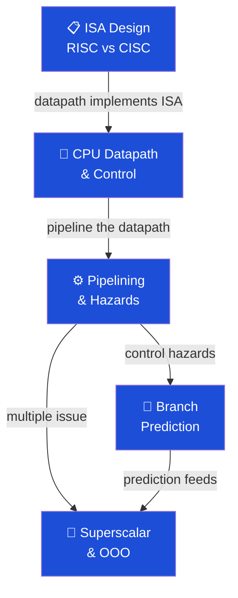

# 🔧 CPU Architecture — Section MOC

> [!abstract] Section Overview
> CPU Architecture covers how processors are designed to execute instruction set architectures efficiently. This section spans ISA design (RISC-V vs x86), the hardware datapath that executes instructions, pipelining to achieve near-CPI=1, branch prediction to handle control flow, and superscalar/out-of-order execution to exploit instruction-level parallelism beyond a single pipeline.

---

## Concept Map

---

## Learning Path

1. [[ISA_Design_RISC_vs_CISC]] — ISA principles, RISC-V formats, x86 comparison
2. [[CPU_Datapath_and_Control]] — ALU, register file, control signals, single/multi-cycle
3. [[Pipelining_and_Hazards]] — 5-stage pipeline, CPI formula, hazards, forwarding
4. [[Branch_Prediction]] — Bimodal, 2-bit, TAGE, BTB, misprediction penalty
5. [[Superscalar_and_Out_of_Order_Execution]] — Tomasulo, ROB, register renaming, LSQ

---

## All Notes

| Note | Key Concepts | Difficulty |
|------|-------------|------------|
| [[ISA_Design_RISC_vs_CISC]] | Load-store, fixed-length, RISC-V R/I/S/B/U/J | Intermediate |
| [[CPU_Datapath_and_Control]] | ALU, regfile, control truth table, CPI | Intermediate |
| [[Pipelining_and_Hazards]] | RAW/WAW/WAR, forwarding, load-use bubble | Intermediate |
| [[Branch_Prediction]] | 2-bit saturating, TAGE, BTB, misprediction cost | Advanced |
| [[Superscalar_and_Out_of_Order_Execution]] | Tomasulo, reservation stations, ROB | Advanced |

---

## Key Questions

1. Why does RISC's fixed-length instruction encoding enable simpler decoding?
2. What is the CPI formula with stalls, and what determines stall rate?
3. How does register forwarding eliminate most RAW hazards without stalling?
4. Why does deeper pipelining increase the branch misprediction penalty?
5. How does Tomasulo's algorithm achieve in-order commit with out-of-order execution?

---

## Related Sections

- [[_MOC_Computer_Architecture_Master|↑ Master MOC]]
- [[../01_Digital_Logic/_MOC_Digital_Logic|← Digital Logic]] — Gate circuits implement the datapath
- [[../03_Memory_Systems/_MOC_Memory_Systems|→ Memory Systems]] — Cache feeds the pipeline
- [[../05_Assembly_RISCV/_MOC_Assembly_RISCV|→ Assembly & RISC-V]] — Assembly programs run on this architecture

#Computer_Architecture #CPU_Architecture #MOC
