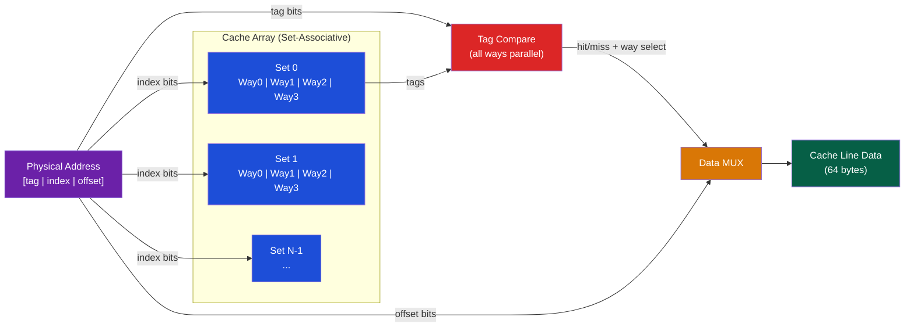

# 🗂️ Cache Hierarchy

> [!abstract] TL;DR
> Caches exploit spatial and temporal locality to bridge the CPU-DRAM speed gap. The AMAT (Average Memory Access Time) formula is recursive: AMAT = HitTime + MissRate × MissPenalty, where the miss penalty is itself the AMAT of the next level. Three C's of misses: Compulsory (cold, first access), Capacity (working set > cache), Conflict (aliasing in direct-mapped). Associativity trades conflict misses for slower hit time. LRU is the optimal replacement policy for temporal locality; PLRU (pseudo-LRU) is practical for large caches. Write-back + dirty bit reduces write traffic; write-through with write buffer simplifies coherence.

## Intuition — analogy FIRST

A cache is like a reference desk at a library. The librarian keeps the 20 most-recently-requested books on the desktop (L1). If not there, they check the shelved cart of 200 recent books (L2). If not there, they walk to the main stacks (L3). If not in the building, they order from off-site archives (DRAM). Each level is bigger but slower. You benefit because most requests are for recently-used books (temporal locality) or books near recently-used ones (spatial locality).

---

## How It Works

### Cache Anatomy



### Address Breakdown

For a 32KB, 8-way set-associative cache with 64-byte lines:
```
Total sets = 32KB / (8 ways × 64 bytes) = 64 sets
→ 6 index bits (log2(64))
→ 6 offset bits (log2(64 bytes))
→ tag bits = 32 - 6 - 6 = 20 bits

Physical address [31:0]:
[31:12 tag (20b)] [11:6 index (6b)] [5:0 offset (6b)]
```

### AMAT — Average Memory Access Time (Recursive)

```
AMAT_L1 = HitTime_L1 + MissRate_L1 × MissPenalty_L1

MissPenalty_L1 = AMAT_L2 = HitTime_L2 + MissRate_L2 × MissPenalty_L2

MissPenalty_L2 = AMAT_L3 = HitTime_L3 + MissRate_L3 × DRAMLatency
```

**Example calculation**:
```
L1: HitTime=4cy, MissRate=5%
L2: HitTime=12cy, MissRate=20%  (of misses reaching L2)
L3: HitTime=40cy, MissRate=50%  (of misses reaching L3)
DRAM: 200 cycles

AMAT_L3 = 40 + 0.50 × 200 = 140 cycles
AMAT_L2 = 12 + 0.20 × 140 = 12 + 28 = 40 cycles
AMAT_L1 = 4  + 0.05 × 40  = 4 + 2 = 6 cycles
```

### Three C's of Cache Misses

| Miss Type | Cause | Solution |
|-----------|-------|----------|
| **Compulsory** (cold) | First access to any address | Prefetching, larger lines |
| **Capacity** | Working set > cache size | Larger cache |
| **Conflict** | Too many addresses mapping to same set | More ways (associativity) |

**Compulsory** misses are irreducible (you must load data at least once). **Conflict** misses drop dramatically going from direct-mapped to 4-way; gains past 8-way are minimal.

### Associativity Trade-offs

| Design | Hit Time | Miss Rate | Hardware Cost |
|--------|----------|-----------|---------------|
| Direct-mapped (1-way) | Fastest | High conflict | Cheapest |
| 2-way set-assoc | +5% | -50% conflict miss | Moderate |
| 4-way set-assoc | +10% | -80% conflict miss | Moderate |
| 8-way set-assoc | +15% | -95% conflict miss | High |
| Fully associative | Slowest (CAM) | Zero conflict | Only for small caches (TLB) |

L1 caches: typically 4–8 way. L2/L3: 8–16 way. TLB: fully associative.

### Replacement Policies

| Policy | How | Pro | Con |
|--------|-----|-----|-----|
| LRU | Evict least-recently-used | Optimal for temporal locality | Expensive for >4 ways (n! state) |
| PLRU (Pseudo-LRU) | Tree of 1-bit hints | Approximates LRU cheaply | Not perfectly optimal |
| FIFO | Evict oldest-inserted | Simple | Bad for loops (Belady's anomaly) |
| Random | Random victim | Hardware simple, no pathological | ~10% worse than LRU |
| NMRU | Not-most-recently-used | Simple, decent | Simple approximation |

**Belady's optimal**: Evict the line that will be used furthest in the future. Theoretical upper bound for any policy.

### Write Policies

| Policy | On write HIT | On write MISS | Traffic | Coherence |
|--------|-------------|----------------|---------|-----------|
| Write-through | Update cache + memory | Write to memory (no-allocate) | High | Simpler |
| Write-back | Update cache only, set dirty bit | Allocate line, write cache | Low | Complex |
| Write-back + write-allocate | Update cache | Bring line into cache, then write | Low | Complex |

**Write buffer**: For write-through, a write buffer absorbs writes and sends them to memory in the background — CPU doesn't stall.

**Dirty bit**: In write-back, each cache line has a dirty bit (= modified but not written to memory). On eviction, if dirty=1, write back; if dirty=0, just discard.

### Inclusion Property

| Policy | Meaning |
|--------|---------|
| Inclusive (Intel) | L3 contains all lines in L1+L2. Simplifies coherence: check L3 to find any line |
| Exclusive | A line is in exactly one cache level. Maximum total cache capacity |
| Non-inclusive/Non-exclusive (NINE) | Default: may or may not be inclusive. Modern AMD Zen uses NINE for LLC |

### Spatial Locality — Cache Lines

All modern caches fetch a full cache line (64 bytes) on miss, not just the requested word. This exploits spatial locality: if you access array[i], you'll likely soon access array[i+1].

```c
// Good spatial locality: row-major access
for (int i = 0; i < N; i++)
    for (int j = 0; j < N; j++)
        sum += A[i][j];   // A[i][j] and A[i][j+1] are in same cache line

// Bad: column-major access (strided, cache misses every element)
for (int j = 0; j < N; j++)
    for (int i = 0; i < N; i++)
        sum += A[i][j];   // 64-byte stride → miss every access
```

### Hardware Prefetching

Modern CPUs detect stride access patterns and prefetch:
- **Stream prefetcher**: detects sequential access, prefetches ahead
- **Stride prefetcher**: detects constant-stride access, prefetches at the stride
- **IP-based prefetcher**: per-instruction PC-indexed stride table

Software prefetch: `__builtin_prefetch(addr, rw, locality)` in GCC.

---

## Real-World Notes

- Intel Skylake L1: 32KB 8-way, 4-cycle latency; L2: 256KB 4-way, 12-cycle; L3: 8MB 16-way, 42-cycle
- AMD Zen 4 has 32KB L1-I, 32KB L1-D, 1MB L2 (per core), 32MB L3 (per CCD)
- The L3 LLC (Last Level Cache) is shared between cores — L3 contention is a major bottleneck in multi-tenant cloud VMs
- `perf stat -e cache-misses,cache-references ./program` measures L1 miss rate; `perf stat -e LLC-misses` measures L3 misses
- Cache thrashing: two arrays of size > L1 capacity accessed alternately → every access is a miss. Solution: cache-oblivious algorithms or blocking/tiling

---

## Common Pitfalls

1. **AMAT is recursive** — Computing it as HitTime + MissRate × DRAM_latency (ignoring L2/L3) significantly overestimates DRAM impact for L2/L3 hits
2. **Conflict misses with powers-of-2 strides** — Arrays of size exactly power-of-2 and stride = cache_size can all map to the same set. Add padding to break aliasing
3. **Write-allocate assumption** — Write-back caches typically use write-allocate: a write miss brings the line in, then writes it. Write-through typically uses no-write-allocate. Confusing these changes bandwidth estimates
4. **Inclusion vs exclusion on multicore** — In inclusive L3, a core's L1 eviction can invalidate L3 copies, causing silent capacity loss. AMD switched to NINE in Zen to recover effective LLC capacity
5. **False sharing** — Two threads accessing different fields of the same cache line cause coherence traffic as if they share data. Solution: `alignas(64)` padding

---

## Related Concepts

- [[_MOC_Memory_Systems|↑ Memory Systems MOC]]
- [[DRAM_Architecture]] — DRAM is the destination of cache misses
- [[Virtual_Memory_and_TLB]] — TLB is a fully-associative cache for page table entries
- [[../06_Parallel_Computing/Cache_Coherence_MESI|Cache Coherence MESI]] — Multi-core caches require coherence protocol
- [[../06_Parallel_Computing/Multi_Core_Programming|Multi-Core Programming]] — False sharing, cache-line alignment

---

## Review Questions

1. Calculate AMAT for: L1 hit time=4, L1 miss rate=8%, L2 hit time=12, L2 miss rate=30%, DRAM latency=200 cycles. Compare to a system with a larger L1 (miss rate=4%) but same L2.
2. You have a 4-way LRU cache with 4 sets and observe 100% miss rate for the access pattern A,B,C,D,A,B,C,D. Why? What cache associativity would fix this?
3. A write-back cache has a dirty-eviction rate of 30% and a miss rate of 5%. The DRAM bandwidth is 50 GB/s. Calculate the write-back bandwidth consumption for a 4 GB/s read stream.

---

## Sources

- Hennessy & Patterson, *Computer Architecture: A Quantitative Approach*, Ch. 2
- Drepper, U. "What Every Programmer Should Know About Memory" (2007)
- Patterson & Hennessy, *Computer Organization and Design*, Ch. 5

#Computer_Architecture #Memory_Systems #Cache #AMAT
