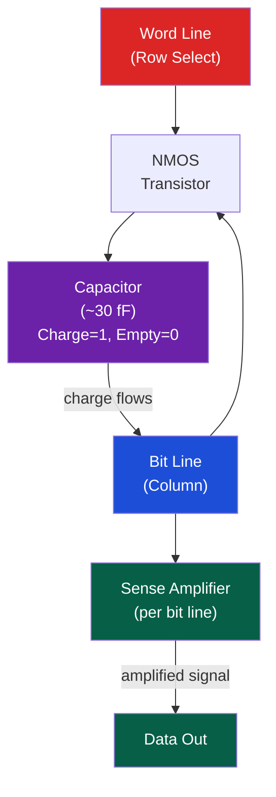

# 🧠 DRAM Architecture

> [!abstract] TL;DR
> DRAM (Dynamic RAM) stores bits as charge in 1T1C cells (one transistor + one capacitor). Addressing uses row/column multiplexing to reduce pin count. Key timing parameters: tRCD (RAS-to-CAS delay, row activation ≈14ns), tCL (CAS latency, column access ≈14ns), tRP (row precharge ≈14ns), tRAS (entire row cycle ≈35ns). DDR4 (double-data-rate, simultaneous rise/fall edges) → DDR5 (on-die ECC, higher density, 1.1V). SECDED ECC adds 8 bits to detect 2-bit and correct 1-bit errors. Rowhammer: repeated row activations distort adjacent rows' charge, flipping bits — a hardware security vulnerability with privilege escalation exploits.

## Intuition — analogy FIRST

DRAM is like a stadium (memory array) full of buckets (capacitors) that slowly leak. To read a bucket, you open the gate (transistor), tilt the bucket into a measuring cup (sense amplifier), refill to full or empty (refresh), and close the gate. Opening the gate for one row "senses" all 8192 buckets in parallel (one row). Rowhammer is like shaking the stadium bleachers so hard that neighboring rows' buckets spill — even without opening those gates.

---

## How It Works

### DRAM Cell — 1T1C



**Why it's "dynamic"**: The capacitor leaks charge. DRAM must be refreshed every 64ms (tREFW = 64ms, tRFC = refresh cycle time per row). During refresh, the entire bank is unavailable.

### DRAM Hierarchy

```
DIMM (memory stick)
  └── Rank (single/dual rank)
       └── Chip (8 or 16 chips per rank on a 64-bit bus)
            └── Bank (8 banks per chip for bank-level parallelism)
                 └── Row (8192+ rows per bank)
                      └── Columns (1024 columns per row → 8KB row buffer)
```

### Address Multiplexing

DRAM uses the same address pins for row and column — halves pin count:
1. **RAS (Row Address Strobe)**: Assert row address → activate row → load into sense amplifiers (row buffer)
2. **CAS (Column Address Strobe)**: Assert column address → output specific column data

```
Memory Controller → DRAM: Phase 1 (RAS)
  - Assert RAS, send row address [12:0]
  - DRAM: Activate row, sense amplifiers latch entire row (8KB)

Memory Controller → DRAM: Phase 2 (CAS)  
  - Assert CAS, send column address [9:0]
  - DRAM: Output 8 bytes from row buffer
```

### DRAM Timing Parameters

| Parameter | Name | Typical DDR4 | Meaning |
|-----------|------|-------------|---------|
| tRCD | RAS-to-CAS Delay | 14ns (14 cycles at 1ns) | Row activate → ready to read |
| tCL | CAS Latency | 14ns | Column address → data out |
| tRP | Row Precharge | 14ns | Precharge (close row) before new row |
| tRAS | Row Active Time | 35ns | Minimum row-open time |
| tRC | Row Cycle Time | tRAS + tRP ≈ 49ns | Min time between activating same bank |
| tREFI | Refresh Interval | 7.8µs | Average time between refresh commands |
| tRFC | Refresh Cycle | 350ns | Time to refresh one row |

**Row buffer hit vs miss**:
- **Hit** (already open): just CAS → latency = tCL ≈ 14ns
- **Miss** (different row): must precharge + activate → latency = tRP + tRCD + tCL ≈ 42ns
- **Empty** (precharged): just activate → latency = tRCD + tCL ≈ 28ns

### DDR4 vs DDR5

| Property | DDR4 | DDR5 |
|----------|------|------|
| Voltage | 1.2V | 1.1V |
| Data rate | 2133–3200 MT/s | 4800–8400 MT/s |
| Burst length | 8 | 16 |
| Banks per die | 16 | 32 (bank groups) |
| ECC | On-module (RDIMM only) | On-die ECC (all DIMMs) |
| Channel width | 64-bit per DIMM | 32-bit per sub-channel (2 sub-channels/DIMM) |
| Max DIMM capacity | 32GB (single die) | 128GB |

DDR5's on-die ECC corrects errors within the die before sending — improves signal integrity, not security-level ECC.

### SECDED ECC

SECDED (Single Error Correct, Double Error Detect) adds Hamming code check bits:
- 64-bit data word → 8 check bits → 72-bit ECC word
- Can correct any 1-bit flip and detect any 2-bit flip
- Intel Xeon / AMD EPYC server platforms require registered DIMMs (RDIMM) with ECC

```
Parity check positions: bits 1, 2, 4, 8, 16, 32, 64, 128 (powers of 2)
Each check bit covers specific data bits (Hamming code)
On error: syndrome bits point to the flipped bit position
```

### Rowhammer

**Physical mechanism**: DRAM cells are so densely packed that repeatedly activating a row causes charge to leak into adjacent rows (electromagnetic coupling). If row is hammered ~140,000 times in 64ms (the refresh window), adjacent row capacitors may flip.

```
Attack pattern:
while (1) {
    *addr_row_A;      // Read row A (causes row activation)
    *addr_row_B;      // Read row B (causes row activation)
    clflush(addr_A);  // Flush from cache (force DRAM access)
    clflush(addr_B);
}
// Rows between A and B experience "aggressor" hammering
// "Victim" row bits flip without ever being accessed
```

**Real exploits**:
- **Rowhammer JS**: Flipped bit in page table → privilege escalation (2015, Google Project Zero)
- **RAMBleed**: Read side-channel — extract private keys from neighboring rows (2019)
- **BlackSmith**: Non-uniform hammering patterns evade TRR (Target Row Refresh) countermeasures (2021)

**Mitigations**:
- TRR (Target Row Refresh): DRAM refresh adjacent rows on hammer detection — effective against basic hammers, defeated by BlackSmith
- pTRR/PARA: probabilistic adjacent row activation
- LPDDR5/DDR5 Enhanced RFM (Refresh Management): controller tracks row activation counts
- BIOS/OS: restrict `clflush` + unprivileged cache flushing (partial)
- ECC: can correct single-bit flips but rowhammer can flip multiple bits

### Bank Parallelism

Modern DRAM has 8–32 banks per chip. The memory controller can pipeline requests across banks:

```
Cycle:  1   2   3   4   5   6   ...
Bank0: ACT READ DATA
Bank1:     ACT  READ DATA
Bank2:          ACT  READ DATA
```
→ Effective bandwidth = N × single-bank bandwidth (up to bank count limit)

---

## Real-World Notes

- A typical DDR4-3200 DIMM: 25.6 GB/s peak bandwidth (3200 MT/s × 64 bits / 8 = 25.6 GB/s)
- Modern memory controllers use open/closed row buffer policy heuristics based on access patterns
- `dmidecode --type 17` (Linux) shows installed DIMM specs
- NUMA-aware memory allocation (`numactl --membind=0`) forces allocations to local DRAM, avoiding remote access penalty

---

## Common Pitfalls

1. **Confusing latency and bandwidth** — DRAM latency (100ns) is fixed by timing; bandwidth (25 GB/s) depends on burst length and channel width. Sequential access maximizes bandwidth; random access reveals latency
2. **Refresh stalls** — Every 7.8µs, a row refresh takes 350ns. At 100% utilization, refresh steals ~4% of bandwidth and adds latency jitter
3. **Bank conflicts** — If your access pattern always hits the same bank, you serialize (one access at a time). Spread accesses across banks to exploit bank-level parallelism
4. **ECC does not prevent rowhammer** — Single-bit ECC corrects one flip per 64-bit word. Rowhammer targeting the same bit position multiple times can still cause persistent errors
5. **DDR5 sub-channel confusion** — DDR5 DIMMs have two 32-bit sub-channels, each independently addressable. This affects memory interleaving calculations compared to DDR4's single 64-bit channel

---

## Related Concepts

- [[_MOC_Memory_Systems|↑ Memory Systems MOC]]
- [[Cache_Hierarchy]] — DRAM is the destination of last-level cache misses
- [[Virtual_Memory_and_TLB]] — Page tables live in DRAM; Meltdown exploits DRAM-level row buffer timing
- [[NUMA_and_Memory_Bandwidth]] — Multi-socket NUMA uses DDR channels per socket
- [[../04_IO_Systems/Bus_Architectures_PCIe|PCIe & Bus Architecture]] — Memory bus is separate from PCIe but both connect through the memory controller

---

## Review Questions

1. A DDR4-3200 DIMM has 4 banks. Compute the worst-case latency for a random access (bank miss, precharged state). Compare to a sequential access with an open row buffer.
2. A rowhammer attack needs to hammer a row 140,000 times in 64ms. At DDR4 timing (tRC=49ns), is this physically possible? What is the theoretical maximum hammers per refresh window?
3. Explain why SECDED ECC with 8 check bits can correct 1-bit errors but not 2-bit errors, using the Hamming code syndrome calculation.

---

## Sources

- Mutlu, O. "The Rowhammer Problem and Other Issues We May Face As Memory Becomes Denser", DATE 2017
- JEDEC DDR5 Standard JESD79-5B
- Kim, Y. et al. "Flipping Bits in Memory Without Accessing Them", ISCA 2014

#Computer_Architecture #Memory_Systems #DRAM #Rowhammer
