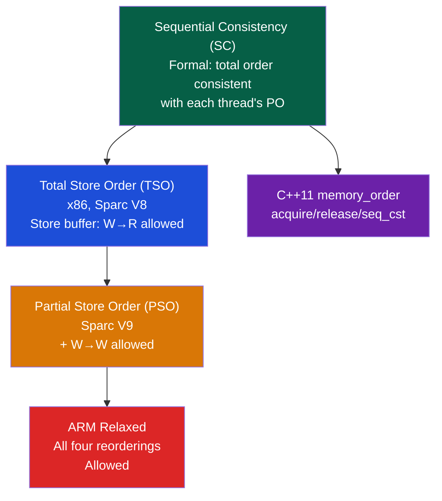

# 🔀 Memory Consistency Models

> [!abstract] TL;DR
> Memory consistency models define the legal orderings of memory operations across multiple cores. Sequential Consistency (SC, Lamport 1979) is the intuitive model: all operations appear to execute in some global total order consistent with each thread's program order. x86 uses TSO (Total Store Order): reads can bypass prior writes via a store buffer, but all writes are globally visible in program order. ARM uses a relaxed model allowing all four reorderings (load-load, load-store, store-load, store-store). C++11 `std::atomic` provides acquire-release semantics: acquire loads see all writes that happened before a release store on the same variable. `mfence`/`sfence`/`lfence` on x86 enforce ordering at the hardware level.

## Intuition — analogy FIRST

Memory consistency is like a bulletin board in an office. Sequential Consistency means everyone posts and reads from one shared board instantaneously. TSO means writes go into your outbox first (store buffer) — you might see your own writes before others do, but the outbox delivers in order. ARM relaxed means each person has their own board and rarely syncs — great speed, but you need explicit "sync meetings" (barriers) when sharing data.

---

## How It Works

### Four Types of Memory Reordering

| Reorder | Name | Meaning |
|---------|------|---------|
| W→R | Store-Load | A store can be reordered after a subsequent load |
| R→R | Load-Load | Two loads can swap order |
| R→W | Load-Store | A load can appear after a subsequent store |
| W→W | Store-Store | Two stores can swap order |

### Consistency Model Taxonomy



### x86 TSO — Store Buffer

x86 has a per-core write (store) buffer:
```
Core 0 executes: STORE x = 1
  → x=1 goes into Core 0's store buffer (not yet visible to Core 1)
  → Core 0 immediately does LOAD y → reads y's current value from cache/memory
  → Meanwhile Core 1 might read x=0 (old value, store not yet flushed)
  → Store buffer drains → x=1 becomes globally visible
```

This means: **in x86 TSO, the only allowed reordering is store→load (W→R)**. A store can be reordered after (appear after) a subsequent load from a different address.

Classic TSO Litmus Test (Dekker's):
```
Thread 1:          Thread 2:
  MOV [x], 1       MOV [y], 1
  MOV r1, [y]      MOV r2, [x]

SC: r1=1 or r2=1 (impossible: r1=0 AND r2=0)
TSO: r1=0 AND r2=0 IS POSSIBLE (stores buffered, loads bypass)
Fix: MFENCE between store and load
```

### x86 Memory Fence Instructions

| Instruction | Effect |
|-------------|--------|
| `MFENCE` | Full fence: all loads/stores before mfence complete before any load/store after |
| `SFENCE` | Store fence: all stores before sfence complete before any store after |
| `LFENCE` | Load fence: all loads before lfence complete before any load after (also serializes speculative execution — used for Spectre mitigation) |
| `LOCK` prefix | Atomic read-modify-write + implicit mfence |

### ARM Relaxed Model

ARM allows all four reorderings. Every shared variable access requires explicit barriers:

| ARM Barrier | Effect |
|-------------|--------|
| `DMB ISH` | Data Memory Barrier (Inner Shareable domain) — all preceding accesses complete |
| `DSB ISH` | Data Synchronization Barrier — stronger than DMB; also waits for cache maintenance |
| `ISB` | Instruction Sync Barrier — flushes pipeline (used after MMU config changes) |
| `STLR` | Store-Release: release store (implicit store barrier before it) |
| `LDAR` | Load-Acquire: acquire load (implicit load barrier after it) |

### Acquire-Release Semantics

Acquire-release is the lightweight alternative to full sequential consistency:

```
[Thread 1: Producer]          [Thread 2: Consumer]
data = compute();             while (!ready.load(acquire)) {}
ready.store(1, release);      use(data);   // guaranteed to see computed data
```

**Release store**: All previous writes in T1 are visible to any thread that subsequently performs an **acquire load** on the same variable and observes the release-stored value.

```
Release: prevents W→R and W→W reordering BEFORE the release
Acquire: prevents R→R and R→W reordering AFTER the acquire
```

This creates a happens-before edge: `T1::data=compute()` happens-before `T2::use(data)`.

### C++11 Memory Orders

```cpp
#include <atomic>
std::atomic<int> x{0}, y{0};

// Thread 1
x.store(1, std::memory_order_relaxed);   // no ordering guarantee
y.store(2, std::memory_order_release);   // release fence before this store

// Thread 2
int r2 = y.load(std::memory_order_acquire);  // acquire fence after this load
int r1 = x.load(std::memory_order_relaxed);
if (r2 == 2) assert(r1 == 1);  // guaranteed: x=1 visible if y=2 visible
```

| Memory Order | Prevents | Cost |
|-------------|---------|------|
| `relaxed` | Nothing — only atomicity | Cheapest |
| `acquire` | Load-Load, Load-Store after | Moderate |
| `release` | Store-Store, Load-Store before | Moderate |
| `acq_rel` | All except Store-Load | For RMW operations |
| `seq_cst` | All four reorderings | Most expensive (like mfence) |

**Performance on x86** (most orderings are "free" because TSO already prevents them):
- `seq_cst` store requires `XCHG` or `MOV + MFENCE` — expensive
- `release` store = regular `MOV` — free on x86 (TSO already prevents W→W, W→R via SFENCE)
- `acquire` load = regular `MOV` — free on x86 (TSO already prevents R→R, R→W)

### Happens-Before and Data Races

Two accesses to the same memory location form a **data race** if:
1. At least one is a write
2. They are in different threads
3. No happens-before relationship exists between them

Data races are undefined behavior in C++. `std::atomic` with appropriate memory orders eliminates data races.

### Volatile vs Atomic

```cpp
// WRONG: volatile is NOT atomic in C++
volatile int flag = 0;   // no atomicity, no ordering guarantee (only prevents compiler reorder)
flag = 1;                // may be non-atomic on 16/64-bit types

// CORRECT: std::atomic
std::atomic<int> flag{0};
flag.store(1, std::memory_order_release);  // atomic + ordered
```

`volatile` in C++ only prevents compiler from optimizing away reads/writes (useful for MMIO). It does NOT prevent CPU reordering and does NOT guarantee atomic access.

---

## Real-World Notes

- Linux kernel uses `READ_ONCE()` / `WRITE_ONCE()` for volatile-equivalent semantics and `smp_mb()` / `smp_rmb()` / `smp_wmb()` for portable barrier macros
- Java volatile: full happens-before (effectively seq_cst). Java 9 VarHandle provides acquire/release/plain analogous to C++11
- The `lock cmpxchg` (x86 compare-and-swap) is an implicit full fence — all prior writes are globally visible before the CAS
- Weak memory models are why concurrent algorithms (Peterson's lock, Dekker's) don't work without explicit fences

---

## Common Pitfalls

1. **"Volatile makes it thread-safe"** — No. `volatile` prevents compiler optimization but not CPU reordering. Use `std::atomic` for shared variables
2. **Using seq_cst unnecessarily** — `seq_cst` has hardware cost (mfence on x86, dmb on ARM). Use `acquire`/`release` for producer-consumer patterns — same safety, lower cost
3. **Assuming x86 TSO = SC** — TSO allows W→R reordering (Dekker's test shows r1=r2=0 is possible). Programs relying on Dekker's without fences are broken on x86
4. **Reordering in the compiler** — Even before hardware reordering, the compiler itself reorders instructions. `memory_order_relaxed` prevents compiler + hardware atomicity but not compiler reordering. Always use `std::atomic` with at least `relaxed` for shared variables
5. **ARM barriers affect instruction ordering, not cache coherence** — Barriers ensure ordering of operations TO cache, not that other cores have seen the value. Cache coherence (MESI) ensures visibility; barriers ensure ordering

---

## Related Concepts

- [[_MOC_Memory_Systems|↑ Memory Systems MOC]]
- [[Cache_Hierarchy]] — Coherence ensures all caches agree on values; consistency defines order of operations
- [[NUMA_and_Memory_Bandwidth]] — NUMA memory controller ordering adds to relaxed model complexity
- [[../06_Parallel_Computing/Cache_Coherence_MESI|Cache Coherence MESI]] — MESI provides coherence; consistency is a separate, higher-level guarantee
- [[../06_Parallel_Computing/Memory_Barriers_and_Ordering|Memory Barriers]] — Detailed coverage of hardware barrier instructions

---

## Review Questions

1. Show a specific interleaving of Thread 1 (x=1; r1=y) and Thread 2 (y=1; r2=x) that produces r1=r2=0 under TSO but not under SC. Explain the store buffer mechanism causing it.
2. A lock-free queue uses `head.store(new_head, relaxed)`. Why is this insufficient for correct consumer behavior? What memory order is needed and why?
3. Compare the assembly generated by `std::atomic<int>::store(1, seq_cst)` vs `store(1, release)` on x86-64 (use `godbolt.org`). Explain why one requires `MFENCE` and the other doesn't.

---

## Sources

- Lamport, L. "How to Make a Multiprocessor Computer That Correctly Executes Multiprocess Programs", IEEE Trans. Computers 1979
- Maranget, L. et al. "A Tutorial Introduction to the ARM and POWER Relaxed Memory Models", 2012
- Boehm, H. & Adve, S. "Foundations of the C++ Concurrency Memory Model", PLDI 2008

#Computer_Architecture #Memory_Systems #Memory_Consistency #TSO
