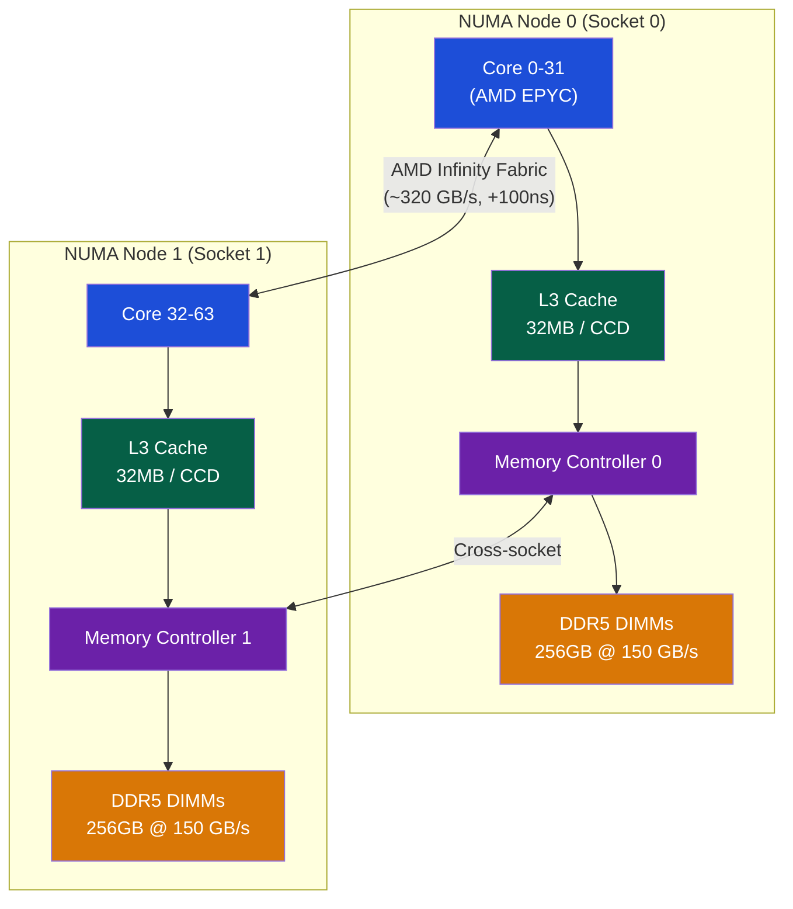
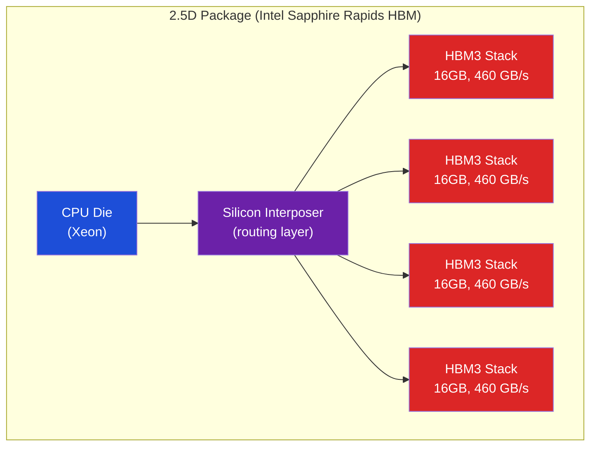

# 🌐 NUMA and Memory Bandwidth

> [!abstract] TL;DR
> NUMA (Non-Uniform Memory Access) systems attach memory banks to specific processors; local memory access takes ~100ns while remote access (via inter-socket interconnect) takes 200–400ns (2–4× penalty). Linux uses first-touch policy: memory is allocated on the NUMA node where the first write occurs. `numactl --membind=N` forces allocation to node N; `numactl --interleave=all` spreads pages round-robin for bandwidth. HBM (High Bandwidth Memory) is 3D-stacked DRAM offering ~1 TB/s bandwidth at the cost of limited capacity (e.g., 64GB HBM3 on Intel Sapphire Rapids vs 4.8 TB DDR5 DRAM).

## Intuition — analogy FIRST

NUMA is like an office building where each floor (socket/node) has its own printer (local memory). Using your floor's printer is fast. If you need to use another floor's printer, you must take the elevator (interconnect) — 2–4× slower. The building manager (OS scheduler) tries to keep you on the floor where your files (data) are stored.

---

## How It Works

### NUMA Topology



### NUMA Latency Numbers

| Access Type | Latency | Bandwidth |
|------------|---------|-----------|
| L1 cache hit | ~4 cycles / 1.3ns | ~1 TB/s |
| L3 cache hit (local) | ~40 cycles / 13ns | ~200 GB/s |
| Local DRAM | ~80ns (DDR5) | ~150 GB/s / socket |
| Remote DRAM (1 hop) | ~160–200ns | ~75 GB/s |
| Remote DRAM (2 hops, 4-socket) | ~300–400ns | ~40 GB/s |

**NUMA factor** (remote/local latency) = 2–4× depending on interconnect generation.

### NUMA Interconnects

| Interconnect | Used By | Bandwidth | Topology |
|-------------|---------|-----------|----------|
| AMD Infinity Fabric 3.0 | EPYC Genoa | 512 GB/s bi-directional | Mesh between CCDs |
| Intel UPI (Ultra Path Interconnect) | Xeon Sapphire Rapids | 20 GT/s × 3 links | Ring/mesh per socket |
| IBM POWER10 | POWER10 | 1.3 TB/s NVLink | Multiple links |

### Linux NUMA — First-Touch Policy

Linux uses **first-touch** allocation: a page is allocated on the NUMA node where the first write occurs.

```c
// This allocation goes to Node 0 if running on Node 0's CPU
char *buf = malloc(1024 * 1024 * 1024); // 1GB — not yet allocated (lazy)

// First touch: pages allocated on current NUMA node
memset(buf, 0, 1024 * 1024 * 1024);    // if this runs on Node 0 CPU → Node 0 memory

// If we migrate thread to Node 1 and access buf → remote NUMA accesses!
```

**Problem**: If a thread initializes data on Node 0 and then all processing runs on Node 1 → all accesses are remote.

**Solution**: Initialize on the same NUMA node where processing happens, or use interleaving.

### numactl — NUMA Affinity Tool

```bash
# Show NUMA topology
numactl --hardware
numactl --show   # current process NUMA policy

# Bind process to Node 0, memory from Node 0
numactl --cpunodebind=0 --membind=0 ./myapp

# Interleave memory allocation across all nodes (good for DRAM bandwidth)
numactl --interleave=all ./myapp

# Bind to specific CPUs (bypass NUMA node granularity)
numactl --physcpubind=0-7 ./myapp

# Prefer local, fall back to remote if needed
numactl --preferred=0 ./myapp
```

Linux API:
```c
#include <numa.h>

numa_set_membind(numa_bitmask_alloc(numa_max_node()+1));  // bind to node
void *buf = numa_alloc_onnode(size, node);  // allocate on specific node
numa_free(buf, size);

// For fine-grained: mbind() syscall
mbind(addr, len, MPOL_BIND, nodemask, maxnode, MPOL_MF_MOVE);
```

### NUMA-Aware Parallel Programming

```c
// BAD: single-thread init, multi-thread compute
void init(float *A, int N) {
    for (int i = 0; i < N; i++) A[i] = 0.0f;  // runs on Node 0
}

void compute(float *A, int N, int tid) {
    // Thread on Node 1 touches Node 0 memory → remote access
    for (int i = tid*N/T; i < (tid+1)*N/T; i++) A[i] = A[i] * 2;
}

// GOOD: parallel init matches thread affinity
#pragma omp parallel for schedule(static)
for (int i = 0; i < N; i++) A[i] = 0.0f;  // each thread touches own region

// THEN parallel compute touches same region → local access
#pragma omp parallel for schedule(static)
for (int i = 0; i < N; i++) A[i] = A[i] * 2;
```

### HBM — High Bandwidth Memory

HBM uses 3D stacking (through-silicon vias, TSV) to place multiple DRAM dies directly on or adjacent to the processor:



| Memory Type | Bandwidth | Capacity | Latency | Cost |
|------------|-----------|----------|---------|------|
| DDR5-4800 | 38 GB/s / channel | 256GB–4TB | 80ns | Low |
| HBM2e | 460 GB/s / stack | 8–16 GB | 70ns | Very High |
| HBM3 | 819 GB/s / stack | 16–64 GB | 65ns | Very High |
| LPDDR5X | 68 GB/s / channel | 32GB (mobile) | 70ns | Medium |

HBM use cases:
- GPUs (A100: 80GB HBM2e at 2 TB/s; H100: 80GB HBM3 at 3.35 TB/s)
- Intel Sapphire Rapids HBM: 64GB on-package + DDR5 channels → can operate as L4 cache or flat address
- AMD CDNA2 (MI250X): 128GB HBM2e at 3.2 TB/s

### Memory Bandwidth Roofline

```
Roofline model: Performance = min(Peak_FLOPS, Arithmetic_Intensity × Peak_BW)

Example (A100 GPU):
  Peak BF16 FLOPS = 312 TFLOPS
  Peak HBM BW = 2 TB/s
  Arithmetic Intensity breakeven = 312 TFLOPS / 2 TB/s = 156 FLOP/Byte

  Gemm 4096³: ~156 FLOP/Byte → right at the ridge → compute-limited
  Vector add: ~0.25 FLOP/Byte → bandwidth-limited
```

---

## Real-World Notes

- `numastat` shows per-NUMA-node allocation statistics; `numactl --hardware` shows topology
- PostgreSQL: use `huge_pages=on` + `numactl --interleave=all` for large buffer pools; reduces NUMA thrashing
- Redis is NUMA-sensitive: bind to single node for latency-sensitive operations
- AMD's EPYC Zen 4 uses "NUMA per L3 cluster" (NPS4 mode): 4 NUMA nodes per socket for 192-core systems — each L3 slice has its own NUMA node

---

## Common Pitfalls

1. **Ignoring NUMA in benchmarks** — Memory benchmark run without NUMA binding measures local DRAM. Production with cross-socket access can be 50% slower
2. **First-touch in OpenMP** — Default: the master thread initializes, all workers access. Always parallelize initialization to match thread affinity
3. **Docker/Kubernetes ignoring NUMA** — Containers scheduled without CPU+memory affinity may span NUMA nodes. Use `--cpuset-cpus` + `--cpuset-mems` in Docker
4. **HBM capacity limits** — HBM has high bandwidth but low capacity (64GB typical). Applications that exceed HBM size fall back to DDR5 at lower bandwidth
5. **Inter-socket bandwidth over-subscription** — Multiple threads doing cross-socket access can saturate the interconnect (~320 GB/s for AMD Infinity Fabric), bottlenecking all cross-NUMA traffic

---

## Related Concepts

- [[_MOC_Memory_Systems|↑ Memory Systems MOC]]
- [[DRAM_Architecture]] — NUMA adds topology on top of DRAM's per-node bandwidth
- [[Cache_Hierarchy]] — LLC is often per-socket, making L3 miss cross-socket in dual-socket systems
- [[Memory_Consistency_Models]] — NUMA memory controllers must respect consistency model ordering
- [[../06_Parallel_Computing/Multi_Core_Programming|Multi-Core Programming]] — Thread affinity, NUMA-aware allocation

---

## Review Questions

1. A dual-socket server has 150 GB/s bandwidth per socket and 200ns remote latency vs 80ns local. For a 64-thread workload where half the threads are on each socket accessing a shared array, what is the effective bandwidth if 40% of accesses are remote?
2. Design a NUMA-aware memory allocator for a parallel matrix multiplication. Which phase should use `MPOL_INTERLEAVE` and which `MPOL_BIND`?
3. An HBM-equipped server has 64GB HBM (819 GB/s) and 512GB DDR5 (300 GB/s total). A deep learning training job uses 80GB of activations. How should memory be partitioned between HBM and DDR5 for maximum throughput?

---

## Sources

- Drepper, U. "What Every Programmer Should Know About Memory", Red Hat (2007), Section 5: NUMA
- Intel Xeon Sapphire Rapids HBM Platform Architecture Brief
- AMD EPYC Technical Reference Manual

#Computer_Architecture #Memory_Systems #NUMA #HBM #Memory_Bandwidth
